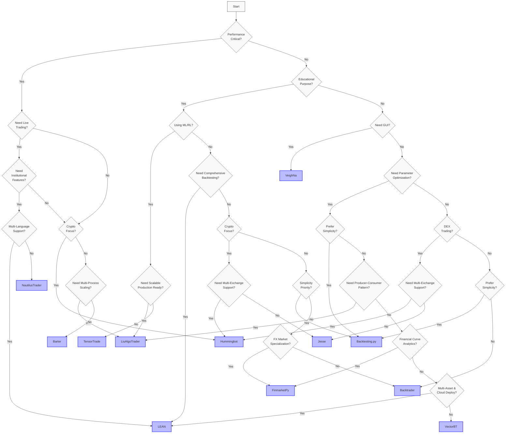

# Trading Systems Overview and Comparison

This documentation provides comprehensive information about the various trading systems available in our codebase. Each system has its own strengths, use cases, and architectural approaches.


## Trading System Comparison

| System | GitHub URL | Docs URL | Repository Stats | Language | Type | Key Features | Best For | Market Support | Execution Venues | Live/Paper Trading | Order Types | Order Book Sim | Key Dependencies |
|--------|------------|----------|------------------|----------|------|-------------|----------|----------------|------------------|-------------------|-------------|----------------|------------------|
| [LEAN](./docs/lean/README.md) | [GitHub](https://github.com/QuantConnect/Lean) | [Docs](https://www.lean.io/docs/v2/lean-cli) |  | C#/Python | Event-driven | Modular architecture, multi-asset, institutional-grade | Production algorithmic trading, cloud deployment, research | All markets | Interactive Brokers, OANDA, Binance, Coinbase, multiple others | Yes/Yes | Comprehensive set of order types | Yes (advanced) | .NET Core, Python (optional) |
| [Barter](./docs/barter/README.md) | [GitHub](https://github.com/barter-rs/barter-rs) | [Docs](https://docs.rs/barter/latest/barter/) |  | Rust | Event-driven | Fast, robust, strongly typed, multithreaded | HFT, low-latency applications | Crypto, FX, Equities | Binance, FTX, custom | Yes/Yes | Market, Limit, Stop | Yes | Rust ecosystem |
| [Backtrader](./docs/backtrader/README.md) | [GitHub](https://github.com/mementum/backtrader) | [Docs](https://www.backtrader.com/docu/) |  | Python | Event-driven | Easy to use, comprehensive, event-driven | Strategy development, research, education | All markets | IB, OANDA, VC, Alpaca | Yes/Yes | All common types | Limited | pandas, matplotlib |
| [NautilusTrader](./docs/nautilustrader/README.md) | [GitHub](https://github.com/nautechsystems/nautilus_trader) | [Docs](https://nautilustrader.io/docs/latest/) |  | Python/Cython/Rust | Event-driven | Production-grade, distributed | Institutional-grade trading systems | Crypto, FX, Futures, Equities | Binance, Coinbase, FXCM, IB | Yes/Yes | All types + custom | Yes (advanced) | pandas, numpy, msgspec |
| [VeighNa](./docs/veighna/README.md) | [GitHub](https://github.com/vnpy/vnpy) | [Docs](https://www.vnpy.com/docs/) |  | Python | Event-driven | CTA strategies, algorithmic trading, options | Comprehensive trading applications with GUI | All markets | CTP, IB, custom | Yes/Yes | All common types | Yes | pandas, PyQt |
| [TensorTrade](./docs/tensortrade/README.md) | [GitHub](https://github.com/tensortrade-org/tensortrade) | [Docs](https://www.tensortrade.org/en/latest/) |  | Python | Event-driven | RL-based strategies, modular components | Research and ML-based trading strategies | Crypto, Simulated | Simulated | Limited/Yes | Market, Limit | Limited | pandas, gym, tensorflow |
| [VectorBT](./docs/vectorbt/README.md) | [GitHub](https://github.com/polakowo/vectorbt) | [Docs](https://vectorbt.dev/api/data/base/) |  | Python | Vector-based | Ultra-fast backtesting, data analysis | Strategy optimization, parameter sweeping | All markets | N/A (backtesting only) | No/No | Market, Limit | No | pandas, numpy, numba |
| [Hummingbot](./docs/hummingbot/README.md) | [GitHub](https://github.com/hummingbot/hummingbot) | [Docs](https://hummingbot.org/docs/) |  | Python | Event-driven | Component-based, multi-exchange, DEX support | Cryptocurrency trading, DEX/CEX arbitrage | Crypto (CEX & DEX) | 30+ CEXs, 10+ DEXs | Yes/Yes | Market, Limit, IOC, FOK, Post-only | Yes | pandas, asyncio, websockets |
| [Backtesting.py](./docs/backtesting.py/README.md) | [GitHub](https://github.com/kernc/backtesting.py) | [Docs](https://kernc.github.io/backtesting.py/doc/backtesting/#gsc.tab=0) |  | Python | Event-driven | Lightweight, intuitive, interactive visualization | Rapid prototyping, strategy development | All markets | N/A (backtesting only) | No/No | Market, Limit, Stop, SL, TP | Limited | pandas, numpy, bokeh |
| [Jesse](./docs/jesse/README.md) | [GitHub](https://github.com/jesse-ai/jesse) | [Docs](https://docs.jesse.trade/) |  | Python | Event-driven | Clean API, modular, crypto-focused | Cryptocurrency trading, strategy development | Crypto | Binance, Coinbase, Bitfinex | Yes/Yes | Market, Limit, Stop, SL, TP | Limited | pandas, numpy, ta-lib, redis |
| [Freqtrade](./docs/freqtrade/README.md) | [GitHub](https://github.com/freqtrade/freqtrade) | [Docs](https://www.freqtrade.io/en/stable/) |  | Python | Event-driven | Modular, feature-rich, ML integration | Cryptocurrency trading, strategy optimization | Crypto, Futures (experimental) | Multiple crypto exchanges | Yes/Yes | Market, Limit, Stop, SL, TP | Limited | pandas, ccxt, SQLAlchemy, scikit-learn |
| [ZVT](./docs/zvt/README.md) | [GitHub](https://github.com/zvtvz/zvt) | [Docs](https://zvt.readthedocs.io/en/latest/) |  | Python | Entity-based | Entity-based, data persistence | Data-driven strategies, factor-based trading | China A-shares, US stocks, ETFs | Simulated | Limited/Yes | Market, Limit | No | pandas, SQLAlchemy, plotly |
| [HFTBacktest](./docs/hftbacktest/README.md) | [GitHub](https://github.com/nkaz001/hftbacktest) | [Docs](https://hftbacktest.readthedocs.io/en/latest/) |  | Python/Rust | Event-driven | High-frequency, order book simulation | HFT, market making, latency-sensitive strategies | Crypto, Futures | Simulated | No/No | Market, Limit, IOC | Yes (advanced) | numba, numpy, Rust |
| [OctoBot](./docs/octobot/README.md) | [GitHub](https://github.com/Drakkar-Software/OctoBot) | [Docs](https://www.octobot.cloud/en/guides/octobot) |  | Python | Event-driven | Modular, tentacle-based, multi-exchange | Cryptocurrency trading, strategy development | Crypto | Multiple crypto exchanges | Yes/Yes | Market, Limit, Stop | Yes | pandas, asyncio, websockets |
| [LiuAlgoTrader](./docs/liualgotrader/README.md) | [GitHub](https://github.com/amor71/LiuAlgoTrader) | [Docs](https://liualgotrader.readthedocs.io/en/latest/index.html) |  | Python | Event-driven | Producer-consumer, multi-process, ML-ready | Scalable algorithmic trading, intraday strategies | US Equities, Crypto | Alpaca, Gemini, custom | Yes/Yes | Market, Limit, Stop, SL, TP | Limited | pandas, asyncio, PostgreSQL |
| [FinmarketPy](./docs/finmarketpy/README.md) | [GitHub](https://github.com/cuemacro/finmarketpy) | [Docs](https://www.cuemacro.com/) |  | Python | Event-driven | FX analytics, curve analysis, event studies | FX trading, market analysis, research | FX, Fixed Income, Equities, Commodities | Simulated | Limited/Yes | Market | Limited | pandas, numpy, matplotlib, scipy |
| [Blankly](./docs/blankly/README.md) | [GitHub](https://github.com/blankly-finance/blankly) | [Docs](https://docs.blankly.finance/) |  | Python | Event-driven | Easy exchange integration, unified API, cloud deployment | Rapid development, deployable strategies, crypto trading | Crypto, US Equities, FX | Coinbase, Binance, Alpaca, OANDA, FTX, KuCoin | Yes/Yes | Market, Limit, Stop loss, Take profit | Limited | pandas, numpy, websockets |
| [Basana](./docs/basana/README.md) | [GitHub](https://github.com/gbeced/basana) | [Docs](https://basana.readthedocs.io/en/latest/) |  | Python | Event-driven | Async, modular, extensible, clean API | Cryptocurrency trading, strategy development | Crypto | Binance, Bitstamp | Yes/Yes | Market, Limit | Yes | asyncio, websockets, pandas |
| [QF-Lib](./docs/qf-lib/README.md) | [GitHub](https://github.com/quarkfin/qf-lib) | [Docs](https://qf-lib.readthedocs.io/en/latest/) |  | Python | Event-driven | Advanced financial analysis, PDF reports, look-ahead bias prevention | Academic research, strategy development, portfolio optimization | Equities, Fixed Income, Alternatives | Interactive Brokers | Yes/Yes | Market, Limit, Stop, SL, TP | Limited | pandas, numpy, scipy, WeasyPrint |
| [pysystemtrade](./docs/pysystemtrade/README.md) | [GitHub](https://github.com/robcarver17/pysystemtrade) | - |  | Python | Event-driven | Portfolio construction, multiple trading rules, risk management | Futures trading, portfolio optimization, systematic trading | Futures, ETFs, any tradeable instrument | Interactive Brokers | Yes/Yes | Market, Limit | Limited | pandas, numpy, matplotlib, ib_insync |

*Additional Features: All systems support PnL calculation, drawdown analysis, and Sharpe ratio calculation. Most support multi-asset, multi-strategy, and multi-timeframe functionality.*


## Available Trading Systems

```mermaid
graph TD
    subgraph "Event-Driven Systems"
        Barter[Barter]:::rust
        Backtrader[Backtrader]:::python
        NautilusTrader[NautilusTrader]:::hybrid
        VeighNa[VeighNa]:::python
        TensorTrade[TensorTrade]:::python
        Hummingbot[Hummingbot]:::python
        BacktestingPy[Backtesting.py]:::python
        Jesse[Jesse]:::python
        LiuAlgoTrader[LiuAlgoTrader]:::python
        FinmarketPy[FinmarketPy]:::python
        Blankly[Blankly]:::python
        Basana[Basana]:::python
        QFLib[QF-Lib]:::python
        LEAN[LEAN]:::csharp
        pysystemtrade[pysystemtrade]:::python
    end

    subgraph "Vectorized Systems"
        VectorBT[VectorBT]:::python
    end

    subgraph "Use Cases"
        HFT[High-Frequency Trading]:::usecase
        Education[Education & Research]:::usecase
        Institutional[Institutional Trading]:::usecase
        GUI[GUI Trading Platform]:::usecase
        ML[Machine Learning]:::usecase
        Optimization[Strategy Optimization]:::usecase
        Crypto[Crypto Trading]:::usecase
        DEX[DEX Trading]:::usecase
        Prototyping[Rapid Prototyping]:::usecase
        FX[FX Analytics]:::usecase
        Cloud[Cloud Deployment]:::usecase
        Academic[Academic Research]:::usecase
        Production[Production Deployment]:::usecase
        Portfolio[Portfolio Construction]:::usecase
        Futures[Futures Trading]:::usecase
    end

    Barter --> HFT
    Barter --> Institutional

    Backtrader --> Education

    NautilusTrader --> HFT
    NautilusTrader --> Institutional

    VeighNa --> GUI

    TensorTrade --> ML
    TensorTrade --> Education

    VectorBT --> Optimization
    VectorBT --> Education

    Hummingbot --> Crypto
    Hummingbot --> DEX
    Hummingbot --> Education

    BacktestingPy --> Education
    BacktestingPy --> Prototyping
    BacktestingPy --> Optimization

    Jesse --> Crypto
    Jesse --> Education
    Jesse --> Prototyping
    
    LiuAlgoTrader --> ML
    LiuAlgoTrader --> Optimization
    LiuAlgoTrader --> Prototyping
    
    FinmarketPy --> FX
    FinmarketPy --> Education
    FinmarketPy --> Institutional
    
    Blankly --> Prototyping
    Blankly --> Crypto
    Blankly --> Cloud
    Blankly --> Education

    Basana --> Crypto
    Basana --> Education
    Basana --> Prototyping
    Basana --> Institutional
    
    QFLib --> Academic
    QFLib --> Education
    QFLib --> Institutional
    QFLib --> Optimization

    LEAN --> Education
    LEAN --> Institutional
    LEAN --> Optimization
    LEAN --> Cloud
    LEAN --> Production
    LEAN --> ML
    
    pysystemtrade --> Portfolio
    pysystemtrade --> Futures
    pysystemtrade --> Academic
    pysystemtrade --> Institutional
    pysystemtrade --> Education

    classDef rust fill:#f96,stroke:#333,stroke-width:2px;
    classDef python fill:#bbf,stroke:#33f,stroke-width:1px;
    classDef hybrid fill:#dfd,stroke:#3a3,stroke-width:1px;
    classDef csharp fill:#d9f,stroke:#93d,stroke-width:1px;
    classDef usecase fill:#fdd,stroke:#d33,stroke-width:1px;

    class Barter rust;
    class Backtrader,VeighNa,TensorTrade,VectorBT,Hummingbot,BacktestingPy,Jesse,LiuAlgoTrader,FinmarketPy,Blankly,QFLib,pysystemtrade python;
    class NautilusTrader hybrid;
    class LEAN csharp;
    class HFT,Education,Institutional,GUI,ML,Optimization,Crypto,DEX,Prototyping,FX,Cloud,Academic,Production,Portfolio,Futures usecase;
```




## Key Differences and Strengths

### Architecture and Design Philosophy

```mermaid
flowchart TD
    subgraph "LEAN Architecture"
        LEEngine[Engine]:::lean
        LEAlgorithm[Algorithm]:::lean
        LEDataFeed[DataFeed]:::lean
        LETransaction[TransactionHandler]:::lean
        LEResults[ResultHandler]:::lean
        LERealTime[RealTimeHandler]:::lean
        LEHistory[HistoryProvider]:::lean
        
        LEEngine --> LEAlgorithm
        LEEngine --> LEDataFeed
        LEEngine --> LETransaction
        LEEngine --> LEResults
        LEEngine --> LERealTime
        LEEngine --> LEHistory
    end

    subgraph "Barter Architecture"
        BEngine[Engine]:::barter
        BStrategy[Strategy]:::barter
        BExchange[Exchange]:::barter
        BPortfolio[Portfolio]:::barter
        BRisk[Risk]:::barter
        BEngine --> BStrategy
        BEngine --> BExchange
        BEngine --> BPortfolio
        BEngine --> BRisk
    end

    subgraph "Backtrader Architecture"
        BTCerebro[Cerebro]:::backtrader
        BTStrategy[Strategy]:::backtrader
        BTData[Data Feeds]:::backtrader
        BTBroker[Broker]:::backtrader
        BTAnalyzers[Analyzers]:::backtrader
        BTCerebro --> BTStrategy
        BTCerebro --> BTData
        BTCerebro --> BTBroker
        BTCerebro --> BTAnalyzers
    end

    subgraph "NautilusTrader Architecture"
        NTMessageBus[Message Bus]:::nautilus
        NTTrading[Trading]:::nautilus
        NTRisk[Risk]:::nautilus
        NTData[Data]:::nautilus
        NTExecution[Execution]:::nautilus
        NTMessageBus --> NTTrading
        NTMessageBus --> NTRisk
        NTMessageBus --> NTData
        NTMessageBus --> NTExecution
    end
    
    subgraph "pysystemtrade Architecture"
        PSystem[System]:::pysystem
        PRawData[Raw Data]:::pysystem
        PTradingRules[Trading Rules]:::pysystem
        PForecastScale[Forecast Scaling]:::pysystem
        PForecastCombine[Forecast Combination]:::pysystem
        PPositionSize[Position Sizing]:::pysystem
        PPortfolio[Portfolio]:::pysystem
        
        PSystem --> PRawData
        PSystem --> PTradingRules
        PSystem --> PForecastScale
        PSystem --> PForecastCombine
        PSystem --> PPositionSize
        PSystem --> PPortfolio
    end

    subgraph "VectorBT Architecture"
        VBTVectorized[Vectorized Operations]:::vectorbt
        VBTNumba[Numba JIT]:::vectorbt
        VBTPortfolio[Portfolio]:::vectorbt
        VBTIndicators[Indicators]:::vectorbt
        VBTVectorized --> VBTNumba
        VBTVectorized --> VBTPortfolio
        VBTVectorized --> VBTIndicators
    end

    subgraph "Hummingbot Architecture"
        HBScript[Script]:::hummingbot
        HBMDP[Market Data Provider]:::hummingbot
        HBExecutors[Executors]:::hummingbot
        HBControllers[Controllers]:::hummingbot
        HBConnectors[Connectors]:::hummingbot
        HBScript --> HBMDP
        HBScript --> HBExecutors
        HBScript --> HBControllers
        HBExecutors --> HBConnectors
        HBMDP --> HBConnectors
    end

    subgraph "Backtesting.py Architecture"
        BPBacktest[Backtest]:::backtestingpy
        BPStrategy[Strategy]:::backtestingpy
        BPOrder[Order]:::backtestingpy
        BPTrade[Trade]:::backtestingpy
        BPPosition[Position]:::backtestingpy
        BPBacktest --> BPStrategy
        BPStrategy --> BPOrder
        BPOrder --> BPTrade
        BPTrade --> BPPosition
        BPPosition --> BPBacktest
    end

    subgraph "Jesse Architecture"
        JRouter[Router]:::jesse
        JStrategy[Strategy]:::jesse
        JBroker[Broker]:::jesse
        JStore[Store]:::jesse
        JExchange[Exchange]:::jesse
        JRouter --> JStrategy
        JStrategy --> JBroker
        JBroker --> JExchange
        JExchange --> JStore
        JStore --> JStrategy
    end

    subgraph "Freqtrade Architecture"
        FTBot[FreqtradeBot]:::freqtrade
        FTStrategy[Strategy]:::freqtrade
        FTExchange[Exchange]:::freqtrade
        FTDataProvider[DataProvider]:::freqtrade
        FTPairList[PairList]:::freqtrade
        FTBot --> FTStrategy
        FTBot --> FTExchange
        FTBot --> FTDataProvider
        FTBot --> FTPairList
        FTDataProvider --> FTExchange
    end

    subgraph "TensorTrade Architecture"
        TTEnv[TradingEnv]:::tensortrade
        TTAction[ActionScheme]:::tensortrade
        TTReward[RewardScheme]:::tensortrade
        TTPortfolio[Portfolio]:::tensortrade
        TTFeed[DataFeed]:::tensortrade
        TTAgent[Agent]:::tensortrade
        TTEnv --> TTAction
        TTEnv --> TTReward
        TTEnv --> TTPortfolio
        TTEnv --> TTFeed
        TTAgent --> TTEnv
    end

    subgraph "ZVT Architecture"
        ZVTContract[Contract]:::zvt
        ZVTDomain[Domain]:::zvt
        ZVTRecorder[Recorder]:::zvt
        ZVTFactor[Factor]:::zvt
        ZVTTrader[Trader]:::zvt
        ZVTContract --> ZVTDomain
        ZVTContract --> ZVTRecorder
        ZVTContract --> ZVTFactor
        ZVTContract --> ZVTTrader
    end
    
    subgraph "QF-Lib Architecture"
        QFEventManager[EventManager]:::qflib
        QFScheduler[Scheduler]:::qflib
        QFDataHandler[DataHandler]:::qflib
        QFStrategy[Strategy]:::qflib
        QFAlphaModel[AlphaModel]:::qflib
        QFPositionSizer[PositionSizer]:::qflib
        QFExecutionHandler[ExecutionHandler]:::qflib
        QFPortfolio[Portfolio]:::qflib
        QFBacktestMonitor[BacktestMonitor]:::qflib
        
        QFEventManager --> QFScheduler
        QFEventManager --> QFDataHandler
        QFEventManager --> QFStrategy
        QFEventManager --> QFExecutionHandler
        QFStrategy --> QFAlphaModel
        QFAlphaModel --> QFPositionSizer
        QFPositionSizer --> QFExecutionHandler
        QFExecutionHandler --> QFPortfolio
        QFPortfolio --> QFBacktestMonitor
    end

    classDef lean fill:#d9f,stroke:#93d,stroke-width:1px;
    classDef barter fill:#f96,stroke:#333,stroke-width:2px;
    classDef backtrader fill:#bbf,stroke:#33f,stroke-width:1px;
    classDef nautilus fill:#dfd,stroke:#3a3,stroke-width:1px;
    classDef vectorbt fill:#fdd,stroke:#d33,stroke-width:1px;
    classDef hummingbot fill:#ddf,stroke:#33d,stroke-width:1px;
    classDef backtestingpy fill:#faf,stroke:#a3a,stroke-width:1px;
    classDef jesse fill:#ffa,stroke:#aa3,stroke-width:1px;
    classDef freqtrade fill:#d9f,stroke:#93d,stroke-width:1px;
    classDef tensortrade fill:#fcd,stroke:#c3d,stroke-width:1px;
    classDef zvt fill:#dfd,stroke:#3d3,stroke-width:1px;
    classDef hftbacktest fill:#adf,stroke:#36d,stroke-width:1px;
    classDef octobot fill:#daa,stroke:#a33,stroke-width:1px;
    classDef liualgotrader fill:#cfc,stroke:#3c3,stroke-width:1px;
    classDef finmarketpy fill:#ddf,stroke:#33d,stroke-width:1px;
    classDef blankly fill:#cdf,stroke:#3ad,stroke-width:1px;
    classDef basana fill:#bfd,stroke:#3ad,stroke-width:1px;
    classDef qflib fill:#fdd,stroke:#d33,stroke-width:1px;

    class LEEngine,LEAlgorithm,LEDataFeed,LETransaction,LEResults,LERealTime,LEHistory lean;
    class BEngine,BStrategy,BExchange,BPortfolio,BRisk barter;
    class BTCerebro,BTStrategy,BTData,BTBroker,BTAnalyzers backtrader;
    class NTMessageBus,NTTrading,NTRisk,NTData,NTExecution nautilus;
    class VBTVectorized,VBTNumba,VBTPortfolio,VBTIndicators vectorbt;
    class HBScript,HBMDP,HBExecutors,HBControllers,HBConnectors hummingbot;
    class BPBacktest,BPStrategy,BPOrder,BPTrade,BPPosition backtestingpy;
    class JRouter,JStrategy,JBroker,JStore,JExchange jesse;
    class FTBot,FTStrategy,FTExchange,FTDataProvider,FTPairList freqtrade;
    class TTEnv,TTAction,TTReward,TTPortfolio,TTFeed,TTAgent tensortrade;
    class ZVTContract,ZVTDomain,ZVTRecorder,ZVTFactor,ZVTTrader zvt;
    class HFTBacktester,HFTMarketDepth,HFTLatencyModel,HFTQueueModel,HFTExchangeModel hftbacktest;
    class OCCore,OCTentacles,OCChannels,OCEvaluators,OCTradingModes octobot;
    class LATProducer,LATConsumers,LATScanners,LATStrategies,LATDatabase,LATTrader liualgotrader;
    class FMPTradingModel,FMPBacktest,FMPCurve,FMPEconomics,FMPAnalysis finmarketpy;
    class BLStrategy,BLExchange,BLInterface,BLState,BLWebsocket,BLPaperTrade blankly;
    class BSDispatcher,BSEvents,BSExchange,BSBacktesting,BSExternal basana;
    class QFEventManager,QFScheduler,QFDataHandler,QFStrategy,QFAlphaModel,QFPositionSizer,QFExecutionHandler,QFPortfolio,QFBacktestMonitor qflib;
```



- **Barter**: Built from the ground up in Rust with a focus on performance, safety, and concurrency. Uses a modular, component-based architecture with strong typing throughout.

- **Backtrader**: Designed for simplicity and ease of use with a comprehensive API. Uses a cerebro-centric design that coordinates all components.

- **NautilusTrader**: Employs a sophisticated event-sourced architecture with a central message bus. Core components are implemented in Cython and Rust for performance, with a Python API for flexibility.

- **VeighNa**: Structured as a multi-module platform with both GUI and API interfaces. Focuses on practical trading applications with comprehensive market connectivity.

- **TensorTrade**: Built around reinforcement learning principles with modular components for environments, rewards, and actions. Designed for research and experimentation.

- **VectorBT**: Employs a vectorized approach using NumPy and Numba for ultra-fast backtesting. Optimized for parameter sweeping and strategy optimization.

- **Hummingbot**: Uses a component-based architecture with scripts, controllers, and executors. Designed for cryptocurrency trading with extensive exchange connectivity and DEX support. Emphasizes modularity and reusability of trading components.

- **Backtesting.py**: Implements a lightweight, intuitive design focused on simplicity and ease of use. Uses a circular flow architecture where the Backtest engine coordinates Strategy, Order, Trade, and Position components. Emphasizes interactive visualization and parameter optimization.

- **Jesse**: Employs a clean, modular architecture with a focus on simplicity and readability. Uses a router-based design where strategies are mapped to specific exchange-symbol-timeframe combinations. Features a centralized store for state management and a broker interface for order execution.

- **Freqtrade**: Built with a modular, plugin-based architecture focused on flexibility and extensibility. Uses a central bot class that coordinates components like strategies, exchange interfaces, and pair list managers. Features a comprehensive backtesting engine, hyperparameter optimization, and machine learning integration through FreqAI.

- **TensorTrade**: Designed as a composable reinforcement learning framework for trading. Follows OpenAI Gym interface with modular components including action schemes, reward schemes, and observers. Emphasizes flexibility in defining trading environments and integrates with popular RL libraries like Ray, Stable Baselines, and Tensorforce.

- **ZVT**: Built with a focus on data persistence and entity-relationship modeling. Uses SQLAlchemy ORM for database operations and follows a contract-based design with clear interfaces. Emphasizes incremental data collection, factor calculation, and backtesting with a strong focus on the Chinese market.

- **HFTBacktest**: Designed specifically for high-frequency trading with a focus on accurate order book simulation, latency modeling, and queue position dynamics. Implemented in Rust with Python bindings for performance. Uses a market replay-based approach with full order book reconstruction and realistic order fill simulation.

- **FinmarketPy**: Specialized in financial time series and market data processing, particularly for FX markets. Features extensive curve analysis for financial instruments including FX options, forwards, and vol surfaces. Employs pandas DataFrames as the primary data structure with strong support for time-indexed data. Includes tools for event studies, seasonality analysis, and technical indicator calculation.

- **Blankly**: Built with a focus on simplicity, flexibility, and usability. Uses a state-based event-driven architecture with a unified interface across exchanges. Features an abstracted exchange connectivity layer that allows the same strategy to run on multiple exchanges or in backtesting without code changes. Emphasizes cloud deployment capabilities with built-in metrics tracking, dashboards, and monitoring.

- **Basana**: Efficient async data handling with support for live and historical data. Uses lightweight data structures optimized for event-based processing. Features built-in CSV data export/import with standardized formats. Supports real-time WebSocket streams for market data with automatic reconnection and error handling.

- **QF-Lib**: Specialized in advanced financial analysis, PDF reports, and look-ahead bias prevention. Features a comprehensive set of tools for academic research, strategy development, and portfolio optimization. Supports a wide range of financial instruments and markets.

### Performance Characteristics

```mermaid
xychart-beta
    title "Relative Performance Comparison"
    x-axis ["Backtesting Speed", "Live Trading Latency", "Memory Efficiency", "CPU Efficiency", "Throughput"]
    y-axis "Performance Score (Higher is Better)" 0 --> 10
    bar [9, 10, 9, 8, 10] "Barter"
    bar [6, 6, 7, 6, 6] "Backtrader"
    bar [8, 8, 7, 7, 8] "NautilusTrader"
    bar [6, 6, 7, 6, 6] "VeighNa"
    bar [5, 4, 5, 4, 4] "TensorTrade"
    bar [10, 0, 6, 9, 0] "VectorBT"
    bar [7, 7, 6, 6, 7] "Hummingbot"
    bar [8, 0, 9, 8, 0] "Backtesting.py"
    bar [7, 6, 8, 7, 6] "Jesse"
    bar [7, 7, 8, 7, 7] "Freqtrade"
    bar [6, 7, 9, 8, 6] "ZVT"
    bar [9, 0, 10, 9, 0] "HFTBacktest"
    bar [7, 7, 8, 7, 6] "LiuAlgoTrader"
    bar [7, 5, 8, 7, 6] "FinmarketPy"
    bar [7, 7, 8, 7, 7] "Blankly"
    bar [7, 7, 8, 7, 6] "Basana"
    bar [7, 7, 8, 7, 7] "QF-Lib"
```

- **Barter**: Offers the highest raw performance due to Rust implementation. Excellent for high-frequency trading with microsecond-level latencies.

- **Backtrader**: Provides good performance for most use cases but can be slower for complex strategies or large datasets due to pure Python implementation.

- **NautilusTrader**: Achieves near-native performance through Cython and Rust components while maintaining Python flexibility. Designed for institutional-grade performance requirements.

- **VeighNa**: Balances performance with functionality, offering good execution speed for most trading applications.

- **TensorTrade**: Performance is secondary to research capabilities, with moderate execution speeds due to ML integration overhead. Optimized for training RL agents with various frameworks like TensorFlow, PyTorch, and Ray. Memory usage can be high during training due to experience replay buffers and neural network models.

- **VectorBT**: Extremely fast for backtesting due to vectorized operations, but limited to historical analysis only.

- **Hummingbot**: Provides good performance for cryptocurrency trading with asyncio-based architecture. Optimized for exchange connectivity and real-time market data processing rather than raw execution speed.

- **Backtesting.py**: Delivers fast backtesting performance with efficient memory usage. Optimized for quick strategy prototyping and parameter optimization. No live trading capabilities but excellent for research and education.

- **Jesse**: Provides good overall performance with a focus on memory efficiency and clean design. Uses NumPy for indicator calculations and Redis for state management in live trading. Balances speed with usability for cryptocurrency trading.

- **Freqtrade**: Delivers balanced performance with good memory efficiency and moderate CPU usage. Optimized for cryptocurrency trading with efficient data handling and state management. Features a fast backtesting engine and hyperparameter optimization capabilities while maintaining reasonable live trading performance.

- **ZVT**: Provides excellent memory efficiency and data handling capabilities due to its focus on persistence and incremental updates. Moderate backtesting speed but highly efficient for large datasets. Optimized for factor-based trading with strong database integration and entity-relationship modeling.

- **HFTBacktest**: Delivers exceptional performance for high-frequency trading backtesting with its Rust implementation and Numba JIT compilation. Extremely memory efficient with optimized data structures for order book operations. Specialized for tick-by-tick market replay with full order book reconstruction, latency modeling, and queue position dynamics.

- **FinmarketPy**: Specialized in financial time series and market data processing, particularly for FX markets. Features extensive curve analysis for financial instruments including FX options, forwards, and vol surfaces. Employs pandas DataFrames as the primary data structure with strong support for time-indexed data. Includes tools for event studies, seasonality analysis, and technical indicator calculation.

- **Blankly**: Provides a unified data interface across exchanges with support for real-time and historical data. Uses pandas DataFrames for most data operations with NumPy for accelerated calculations. Features automatic data caching and throttling to respect exchange rate limits. Includes built-in indicator library and utilities for data preprocessing. Supports both direct exchange data and local file-based data for backtesting.

- **Basana**: Efficient async data handling with support for live and historical data. Uses lightweight data structures optimized for event-based processing. Features built-in CSV data export/import with standardized formats. Supports real-time WebSocket streams for market data with automatic reconnection and error handling.

- **QF-Lib**: Provides advanced financial analysis, PDF reports, and look-ahead bias prevention. Features a comprehensive set of tools for academic research, strategy development, and portfolio optimization. Supports a wide range of financial instruments and markets.

### Data Handling and Processing

- **Barter**: Efficient binary data handling with custom serialization for minimal overhead.

- **Backtrader**: Flexible data feeds with support for various sources and formats. Line-by-line processing model.

- **NautilusTrader**: Comprehensive data engine with support for ticks, bars, quotes, and order books. Advanced data normalization and processing capabilities.

- **VeighNa**: Practical data handling focused on real-world trading data formats and sources.

- **TensorTrade**: Data processing tailored for ML model consumption with feature engineering capabilities. Uses a stream-based approach with composable data feeds and transformers. Features a flexible Stream API that allows for custom data sources and transformations. Supports both historical and real-time data through the same interface.

- **ZVT**: Comprehensive data persistence system using SQLAlchemy ORM and SQLite databases. Emphasizes incremental data collection and updates. Features a robust entity-relationship model with clear schemas for different data types. Supports multiple data providers with provider-specific recorders.

- **HFTBacktest**: Specialized data handling for high-frequency trading with tick-by-tick market data processing. Uses optimized NPZ file format for efficient storage and retrieval. Features full order book reconstruction from market depth updates and trades. Supports both L2 (Market-by-Price) and L3 (Market-by-Order) data.

- **VectorBT**: Optimized for bulk data processing with NumPy arrays as the core data structure.

- **LiuAlgoTrader**: PostgreSQL-based data storage with real-time processing capabilities. Uses pandas DataFrames for in-memory data manipulation. Features minute/second-level aggregation of streaming data. Supports both historical backtesting data and real-time WebSocket feeds through a unified interface. Efficiently stores indicators and trade metadata for post-trade analysis.

- **FinmarketPy**: Specialized in financial time series and market data processing, particularly for FX markets. Features extensive curve analysis for financial instruments including FX options, forwards, and vol surfaces. Employs pandas DataFrames as the primary data structure with strong support for time-indexed data. Includes tools for event studies, seasonality analysis, and technical indicator calculation.

- **Blankly**: Provides a unified data interface across exchanges with support for real-time and historical data. Uses pandas DataFrames for most data operations with NumPy for accelerated calculations. Features automatic data caching and throttling to respect exchange rate limits. Includes built-in indicator library and utilities for data preprocessing. Supports both direct exchange data and local file-based data for backtesting.

- **Basana**: Efficient async data handling with support for live and historical data. Uses lightweight data structures optimized for event-based processing. Features built-in CSV data export/import with standardized formats. Supports real-time WebSocket streams for market data with automatic reconnection and error handling.

- **QF-Lib**: Provides advanced financial analysis, PDF reports, and look-ahead bias prevention. Features a comprehensive set of tools for academic research, strategy development, and portfolio optimization. Supports a wide range of financial instruments and markets.

### Workflow Summary

- **Barter**:
  1. Define custom strategy implementing the Strategy trait
  2. Configure data sources and execution venues
  3. Set up portfolio and risk management rules
  4. Run backtest or live trading through the Engine
  5. Analyze results with custom metrics

- **Backtrader**:
  1. Create a Strategy class inheriting from bt.Strategy
  2. Add indicators and define logic in next() method
  3. Configure data feeds and broker parameters
  4. Add the strategy to Cerebro and run
  5. Analyze results with built-in or PyFolio analyzers

- **NautilusTrader**:
  1. Create a Strategy class inheriting from Strategy
  2. Subscribe to market data and define event handlers
  3. Configure trading parameters and risk controls
  4. Initialize the trading node with appropriate config
  5. Run backtest or live trading and analyze results

- **VeighNa**:
  1. Set up the main engine and register gateways
  2. Configure data feeds and trading accounts
  3. Implement strategy logic using event handlers
  4. Launch the GUI or run headless
  5. Monitor and analyze trading performance

- **TensorTrade**:
  1. Define environment, action scheme, and reward scheme
  2. Create or import a reinforcement learning agent
  3. Train the agent on historical data
  4. Evaluate performance and refine the model
  5. Deploy for paper trading or further research

- **ZVT**:
  1. Record market data using appropriate recorders
  2. Define factors based on recorded data
  3. Create target selector using calculated factors
  4. Implement trader using the target selector
  5. Run backtest and analyze performance metrics

- **HFTBacktest**:
  1. Prepare market data in NPZ format with depth updates and trades
  2. Configure assets with appropriate models (latency, queue, exchange, fee)
  3. Implement strategy using Numba JIT compilation
  4. Run backtest with tick-by-tick market replay
  5. Analyze performance with built-in metrics

- **FinmarketPy**:
  1. Define a strategy by subclassing TradingModel
  2. Configure BacktestRequest with parameters and dates
  3. Implement signal generation logic in construct_signal()
  4. Run backtest with construct_strategy()
  5. Analyze results with built-in analysis tools
  6. Visualize performance with integrated plotting functions

- **Blankly**:
  1. Create a Strategy class and define event handlers (price_event, order_event)
  2. Initialize strategy parameters and indicators in init() method
  3. Implement trading logic in price_event() or other event handlers
  4. Configure exchange settings in settings.json and keys.json
  5. Run either backtest() or start() on the strategy
  6. Analyze results with built-in metrics or export data

- **Basana**:
  1. Create async event handlers for different event types
  2. Register handlers with the central event dispatcher
  3. Configure exchange connections or backtesting environment
  4. Define strategy logic processing event data
  5. Analyze results with built-in charting and metrics

- **QF-Lib**:
  1. Implement advanced financial analysis logic
  2. Generate PDF reports based on financial analysis results
  3. Prevent look-ahead bias in trading strategies
  4. Optimize trading strategies and portfolios
  5. Support academic research and strategy development

## System Selection Guide



### When to use Barter
- When performance and low latency are critical
- For high-frequency trading strategies
- When you need robust type safety and thread safety
- For systems that need to scale across multiple exchanges

### When to use Backtrader
- When ease of use and rapid development are priorities
- For educational purposes and learning algorithmic trading
- When you need comprehensive documentation and examples
- For Python developers who want a gentle learning curve

### When to use NautilusTrader
- For production-grade trading systems
- When you need a comprehensive event-driven architecture
- For distributed trading systems
- When you need both Python flexibility and C/Cython performance

### When to use VeighNa
- When you need a complete trading platform with GUI
- For CTA strategies and algorithmic trading
- When working with options and derivatives
- For systems that need multiple specialized modules

### When to use TensorTrade
- For reinforcement learning-based trading strategies
- When researching new ML trading approaches
- When you need to experiment with different reward functions
- For integration with popular RL libraries (Ray, Stable Baselines, Tensorforce)
- For educational purposes in RL and algorithmic trading
- When you need a highly customizable trading environment

### When to use ZVT
- For building and maintaining a comprehensive financial database
- When working with Chinese market data (A-shares, indices, etc.)
- For factor-based trading strategies
- When you need robust data persistence and incremental updates
- For entity-relationship based market modeling
- When you want to combine multiple data sources

### When to use HFTBacktest
- For high-frequency trading strategy development and testing
- When you need accurate order book simulation with queue position modeling
- For strategies sensitive to latency and execution dynamics
- When you need to simulate market making strategies
- For tick-by-tick backtesting with full order book reconstruction
- When performance and accuracy are critical for backtesting

### When to use VectorBT
- For ultra-fast backtesting of many strategy variations
- When optimizing strategy parameters
- For data-driven strategy development
- When you need interactive visualization tools

### When to use Hummingbot
- For cryptocurrency trading across multiple exchanges
- When you need to trade on decentralized exchanges (DEXs)
- For market making and arbitrage strategies
- When you want a modular, component-based approach
- For strategies that require extensive exchange connectivity

### When to use Backtesting.py
- When simplicity and ease of use are top priorities
- For rapid prototyping and testing of trading strategies
- When you need interactive visualization of backtest results
- For educational purposes and learning algorithmic trading
- When you want efficient parameter optimization

### When to use Jesse
- For cryptocurrency trading strategies
- When you need a clean, modular architecture
- For both backtesting and live trading in the same framework
- When you want a balance of simplicity and flexibility
- For strategies with clear entry/exit conditions

### When to use Freqtrade
- For cryptocurrency trading across multiple exchanges
- When you need hyperparameter optimization for strategy tuning
- For strategies that benefit from machine learning integration
- When you want a feature-rich framework with active community support
- For both backtesting and live trading with the same codebase
- When you need a web UI and Telegram integration for monitoring

### When to use TensorTrade
- For reinforcement learning-based trading strategies
- When you need to experiment with different reward functions
- For research in financial applications of machine learning
- When you want to integrate with popular RL libraries (Ray, Stable Baselines, Tensorforce)
- For educational purposes in RL and algorithmic trading
- When you need a highly customizable trading environment

### When to use FinmarketPy
- When working with FX markets and currencies
- For analyzing volatility surfaces and option pricing
- When you need specialized tools for event studies and seasonality analysis
- For comprehensive curve analysis and financial modeling
- When working in institutional FX trading and research
- For economic and technical analysis with visualization

### When to use Blankly
- When you want a unified API across multiple exchanges
- For rapid development and prototyping of trading strategies
- When you need both backtesting and live trading in the same codebase
- For deploying strategies to cloud infrastructure
- When you need a balance of simplicity, flexibility, and performance
- For cryptocurrency trading with support for multiple exchanges

### When to use Basana
- When you need efficient async data handling with support for live and historical data
- For cryptocurrency trading strategies
- When you want a modular, extensible, clean API
- For strategies that require real-time market data processing
- When building applications that need robust error handling and recovery mechanisms
- For academic or educational projects exploring event-driven systems
- When implementing margin trading strategies (especially on Binance)

### When to use QF-Lib
- When you need advanced financial analysis
- For academic research and strategy development
- For portfolio optimization and look-ahead bias prevention
- For generating PDF reports based on financial analysis results

### When to use LEAN
- For building and deploying production-grade algorithmic trading systems that need to run across different environments
- For a robust, well-tested framework with comprehensive broker integrations
- For a modular architecture, support for both C# and Python, and active community

### Scenario 11: Multi-Asset Systematic Portfolio Management

**Best Choice: pysystemtrade**

For portfolio managers focused on systematic trading across futures markets with multiple trading rules and robust risk management, pysystemtrade provides a comprehensive framework. Its strengths in portfolio construction, trading rule combination, and risk management make it ideal for institutional portfolio managers and systematic traders. The system is particularly well-suited for implementing the concepts from Robert Carver's book "Systematic Trading," making it valuable for those following systematic futures trading approaches.

## Getting Started

Each trading system has its own documentation section with detailed information about:
- Installation and setup
- Architecture and components
- Event flow and state management
- Handlers and interfaces
- Code examples and usage patterns

Select a trading system from the documentation in the [docs directory](./docs/) to explore its detailed information.

#### Design Philosophy Comparison

| System | Design Philosophy | Coding Style | Error Handling | State Management | Learning Curve |
|--------|------------------|--------------|---------------|------------------|---------------|
| Barter | Immutability, type safety | Functional, strong typing | Comprehensive error types | Minimized mutable state | Steep (Rust) |
| Backtrader | Object-oriented, inheritance | Object-oriented, fluent | Exception-based | Object properties | Moderate |
| NautilusTrader | Message-passing, components | Object-oriented, typed | Status objects, exceptions | Message-driven state | Moderate-steep |
| LEAN | Factory pattern, dependency injection | Object-oriented | Exception handling | Queue-based | Moderate |
| VectorBT | Vectorized operations | Functional | Validation checks | Immutable | Steep |
| pysystemtrade | Pipeline, dependency injection | Object-oriented, functional | Exception-based, fallbacks | Cached calculations | Moderate |

#### Architecture Continuum

Trading systems can be classified on a continuum based on their architecture and design approach:

1. **Data-Flow Pipeline** (VectorBT, pysystemtrade): Systems where data flows linearly through processing stages
2. **Event-Driven Architecture** (NautilusTrader, Backtrader, LEAN): Systems that react to events like price changes, time events
3. **Dependency-Triggered** (pysystemtrade): Systems where calculations are triggered when dependencies change
4. **Actor-Based** (Basana): Systems that use independent actors communicating via messages
5. **Object-Oriented Simulation** (Backtrader): Systems that model market entities as interacting objects

