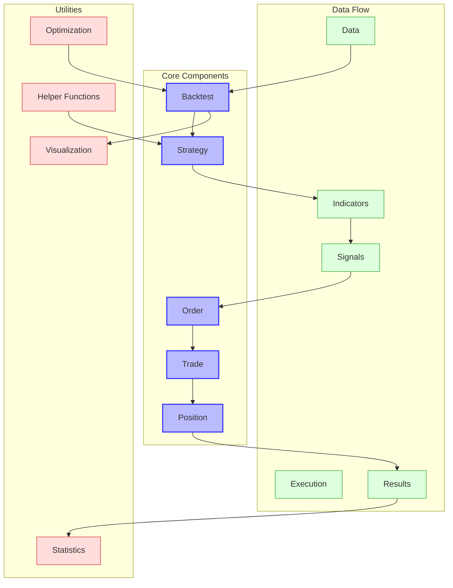

# Backtesting.py Overview

Backtesting.py is a lightweight, intuitive Python framework for backtesting trading strategies. It provides a clean API with a focus on simplicity, ease of use, and interactive visualization.

## Purpose and Design Philosophy

Backtesting.py was designed with the following principles in mind:

- **Simplicity**: Provide a clean, intuitive API that is easy to learn and use
- **Performance**: Deliver fast backtesting capabilities for rapid strategy development
- **Visualization**: Offer interactive, insightful visualizations of backtest results
- **Optimization**: Enable efficient parameter optimization for strategy refinement

The framework is particularly well-suited for:
- Rapid prototyping of trading strategies
- Educational purposes and learning algorithmic trading
- Parameter optimization and strategy refinement
- Interactive visualization of backtest results

## Architecture Overview



The architecture of Backtesting.py follows a circular flow pattern where:

1. The **Backtest** engine coordinates the overall simulation process
2. The **Strategy** class defines trading logic and indicator calculations
3. **Orders** are generated based on strategy signals
4. **Trades** are created when orders are filled
5. **Positions** track the current market exposure
6. **Results** are computed and visualized after the backtest completes

## Key Components

### Backtest

The `Backtest` class is the central component that orchestrates the entire backtesting process. It takes data and a strategy as inputs and simulates the trading process. Key features include:

- Configuration of initial cash, commission, spread, and margin
- Support for different order types and execution modes
- Comprehensive performance statistics calculation
- Interactive visualization of backtest results
- Parameter optimization capabilities

### Strategy

The `Strategy` class is where users define their trading logic. It provides:

- Methods for indicator calculation and signal generation
- Access to market data and current position information
- Order placement functionality (buy/sell)
- Trade and position management

### Order

The `Order` class represents trading orders with properties such as:

- Order type (market, limit, stop)
- Size (positive for long, negative for short)
- Price limits and stop levels
- Take-profit and stop-loss settings

### Trade

The `Trade` class represents executed trades with:

- Entry and exit prices and times
- Profit/loss tracking
- Stop-loss and take-profit management
- Position sizing information

### Position

The `Position` class tracks the current market exposure with:

- Current position size and direction
- Profit/loss calculation
- Position closing functionality

## Supported Markets and Instruments

Backtesting.py is designed to work with any financial instrument that can be represented in OHLCV (Open, High, Low, Close, Volume) format, including:

- Stocks and equities
- Forex (currency pairs)
- Cryptocurrencies
- Futures and commodities
- ETFs and indices

## Data Sources

Backtesting.py accepts data in pandas DataFrame format with the following columns:
- Open
- High
- Low
- Close
- Volume (optional)

Data can be sourced from:
- CSV files
- Pandas DataFrames from any source
- APIs (with appropriate data transformation)

## Quick Start Guide

### Installation

```bash
pip install backtesting
```

### Basic Strategy Example

```python
from backtesting import Backtest, Strategy
from backtesting.lib import crossover
from backtesting.test import SMA, GOOG

class SmaCrossStrategy(Strategy):
    # Define parameters
    n1 = 20  # Fast SMA lookback
    n2 = 50  # Slow SMA lookback
    
    def init(self):
        # Compute indicators
        self.sma1 = self.I(SMA, self.data.Close, self.n1)
        self.sma2 = self.I(SMA, self.data.Close, self.n2)
    
    def next(self):
        # If fast SMA crosses above slow SMA, buy
        if crossover(self.sma1, self.sma2):
            self.buy()
            
        # If fast SMA crosses below slow SMA, sell
        elif crossover(self.sma2, self.sma1):
            self.sell()

# Run backtest
bt = Backtest(GOOG, SmaCrossStrategy, cash=10000, commission=.002)
stats = bt.run()
bt.plot()
```

### Parameter Optimization

```python
# Optimize strategy parameters
stats = bt.optimize(
    n1=range(10, 30, 5),
    n2=range(40, 70, 5),
    maximize='Sharpe Ratio',
    constraint=lambda p: p.n1 < p.n2
)
```

## Dependencies

Backtesting.py has minimal dependencies:
- pandas
- numpy
- bokeh (for visualization)

## Further Resources

- [Official Documentation](https://kernc.github.io/backtesting.py/doc/backtesting/)
- [GitHub Repository](https://github.com/kernc/backtesting.py)
- [Tutorials and Examples](https://kernc.github.io/backtesting.py/doc/examples/Quick%20Start%20User%20Guide.html)
