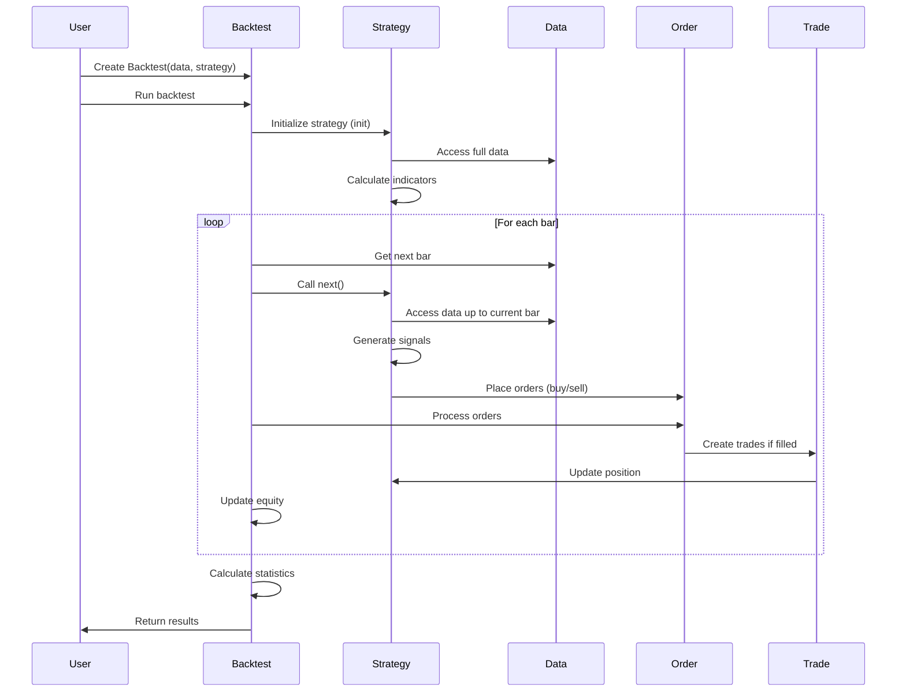
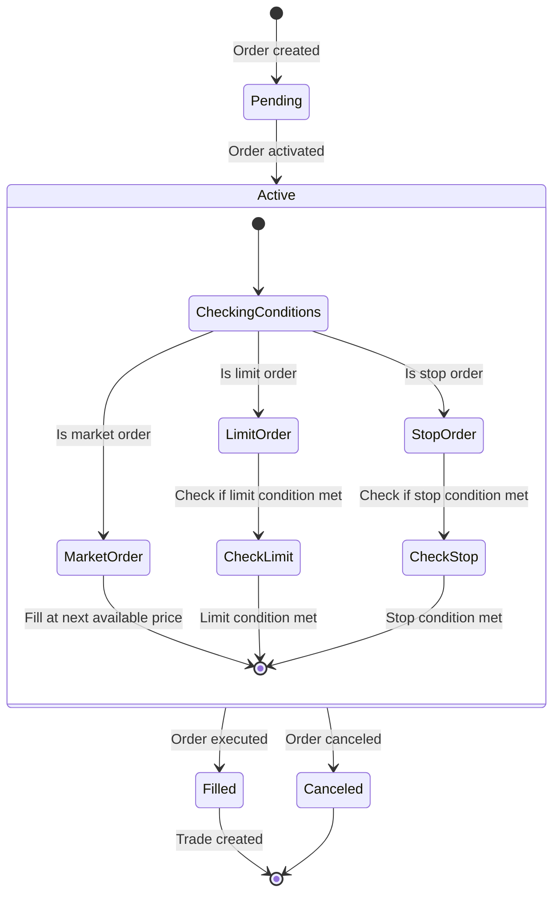
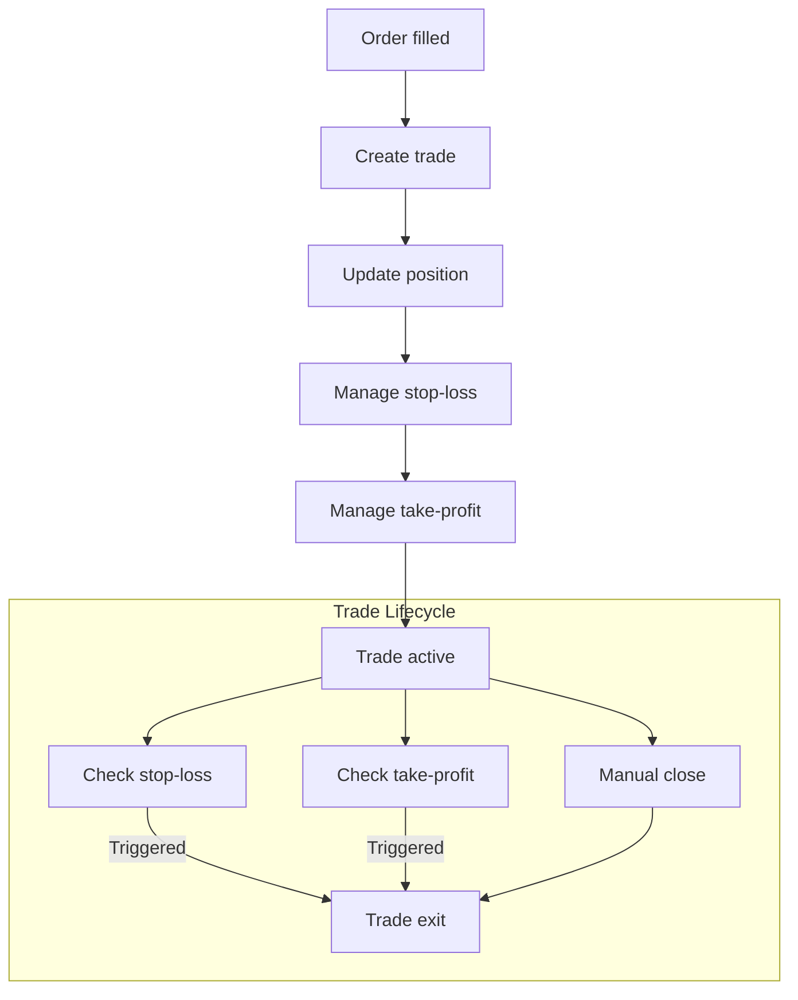
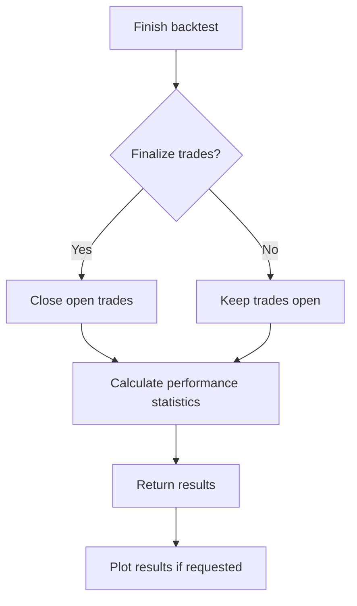
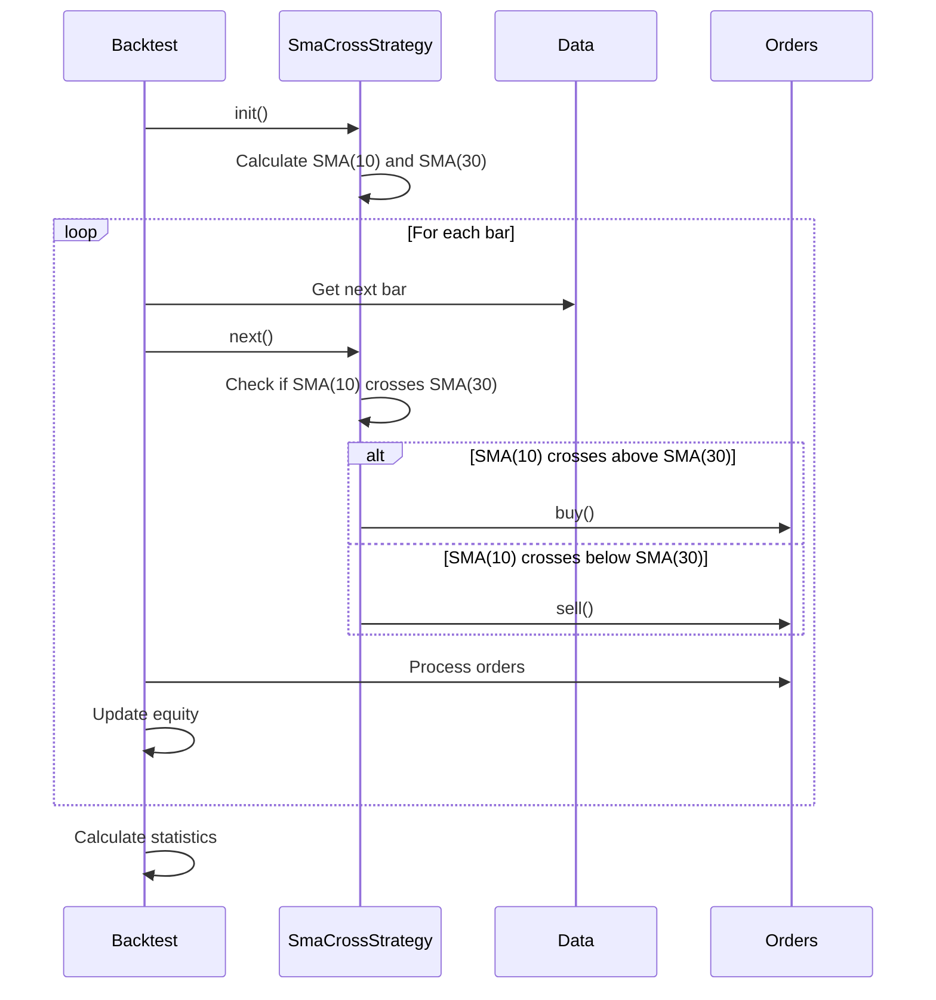

# Backtesting.py Event Flow

This document details the event flow and processing sequence in the Backtesting.py framework. Understanding this flow is crucial for developing effective trading strategies and properly utilizing the framework's capabilities.

## High-Level Event Flow



## Detailed Event Processing Sequence

Backtesting.py follows a bar-by-bar simulation approach where each price bar (candlestick) is processed sequentially. The framework simulates the gradual revelation of price data that occurs in real trading.

### 1. Initialization Phase

```mermaid
flowchart TD
    Start[Start Backtest] --> CreateBacktest[Create Backtest instance]
    CreateBacktest --> RunBacktest[Call run() method]
    RunBacktest --> InitStrategy[Initialize Strategy]
    InitStrategy --> CalculateIndicators[Calculate indicators on full data]
    CalculateIndicators --> PrepareSimulation[Prepare for bar-by-bar simulation]
    
    subgraph "Strategy.init()"
        CalculateIndicators
    end
```

During initialization:

1. The user creates a `Backtest` instance with data and a strategy class
2. When `run()` is called, the backtest creates an instance of the strategy
3. The strategy's `init()` method is called
4. Within `init()`, the strategy has access to the full dataset for indicator calculation
5. Indicators are wrapped with `Strategy.I()` to ensure proper time-series alignment

### 2. Bar-by-Bar Simulation

```mermaid
flowchart TD
    PrepareSimulation[Prepare for simulation] --> BarLoop[Process next bar]
    BarLoop --> UpdateData[Update available data]
    UpdateData --> ProcessPendingOrders[Process pending orders]
    ProcessPendingOrders --> CallNext[Call Strategy.next()]
    
    subgraph "Strategy.next()"
        CheckSignals[Check signals/conditions]
        GenerateOrders[Generate orders]
        ManageTrades[Manage existing trades]
        CheckSignals --> GenerateOrders
        GenerateOrders --> ManageTrades
    end
    
    CallNext --> CheckSignals
    ManageTrades --> UpdateEquity[Update equity and statistics]
    UpdateEquity --> CheckMoreBars{More bars?}
    CheckMoreBars -->|Yes| BarLoop
    CheckMoreBars -->|No| FinishBacktest[Finish backtest]
    
    subgraph "Order Processing"
        ProcessMarketOrders[Process market orders]
        CheckLimitOrders[Check limit orders]
        CheckStopOrders[Check stop orders]
        UpdatePositions[Update positions]
        ProcessMarketOrders --> CheckLimitOrders
        CheckLimitOrders --> CheckStopOrders
        CheckStopOrders --> UpdatePositions
    end
    
    ProcessPendingOrders --> ProcessMarketOrders
```

During the bar-by-bar simulation:

1. For each price bar, the backtest engine:
   - Updates the available data to include the current bar
   - Processes any pending orders that might be filled at the current bar
   - Calls the strategy's `next()` method

2. Within `next()`, the strategy:
   - Accesses data up to the current bar (simulating real-time data availability)
   - Checks trading signals and conditions
   - Places new orders or manages existing trades/positions

3. After `next()` returns, the backtest engine:
   - Processes any new orders placed by the strategy
   - Updates equity and performance statistics
   - Moves to the next bar if available

### 3. Order Processing Flow



Order processing follows these steps:

1. When an order is created (via `buy()` or `sell()`), it's added to the pending orders list
2. At the beginning of each bar, pending orders are processed:
   - Market orders are filled at the open price of the current bar (or close price if `trade_on_close=True`)
   - Limit orders are filled if the price reaches the limit price during the bar
   - Stop orders are activated if the price reaches the stop price during the bar
3. When an order is filled, a trade is created and the strategy's position is updated

### 4. Trade Management Flow



Trade management includes:

1. When an order is filled, a trade is created
2. The trade updates the strategy's position
3. If stop-loss (SL) or take-profit (TP) levels are set, contingent orders are created
4. During each bar, SL and TP conditions are checked
5. Trades can be closed manually via `trade.close()` or `position.close()`
6. When a trade is closed, the position is updated and P&L is calculated

### 5. Finalization Phase



During finalization:

1. If `finalize_trades=True`, any open trades are closed at the last bar's price
2. Comprehensive performance statistics are calculated
3. Results are returned to the user
4. If `plot()` is called, interactive visualization is generated

## Event Timing Considerations

Understanding the timing of events in Backtesting.py is crucial for accurate strategy development:

1. **Market Orders**: By default, market orders are filled at the next bar's open price. If `trade_on_close=True`, they are filled at the current bar's close price.

2. **Limit and Stop Orders**: These orders are checked against the price range of each bar (High and Low). If the price range includes the order price, the order is filled.

3. **Indicator Calculation**: Indicators calculated in `init()` have access to the full dataset, but within `next()`, they only have values up to the current bar.

4. **Look-Ahead Bias Prevention**: The framework prevents look-ahead bias by only making data available up to the current bar in `next()`.

## Error Handling in the Event Flow

Backtesting.py implements several error handling mechanisms:

1. **Insufficient Cash**: Orders that would require more cash than available are scaled down or rejected

2. **Invalid Orders**: Orders with invalid parameters (e.g., negative prices) are rejected

3. **Data Validation**: The framework validates input data to ensure it has the required OHLC columns

4. **Indicator Warm-Up**: The backtest only begins when all indicators have valid (non-NaN) values

## Example Event Flow

Here's a concrete example of the event flow for a simple moving average crossover strategy:



This example demonstrates how a simple strategy interacts with the Backtesting.py event flow to generate and process trading signals.
