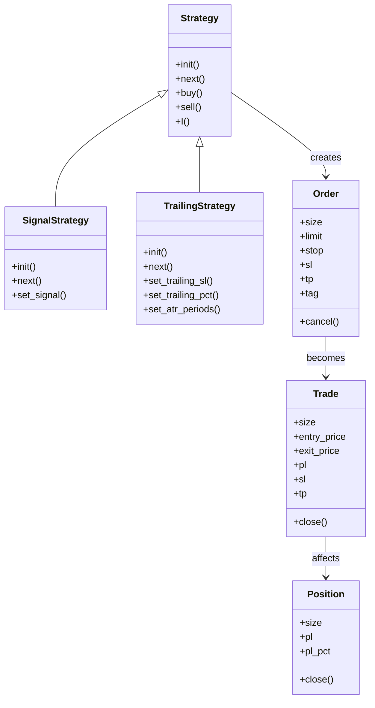
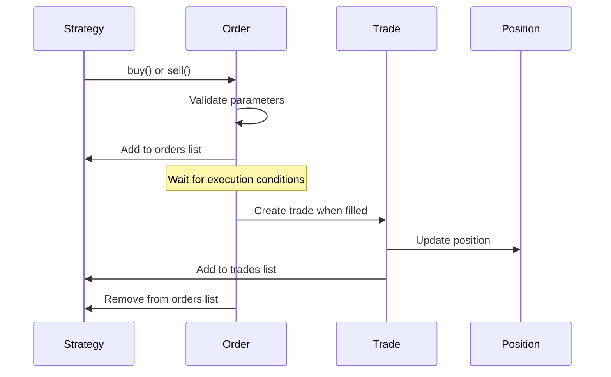
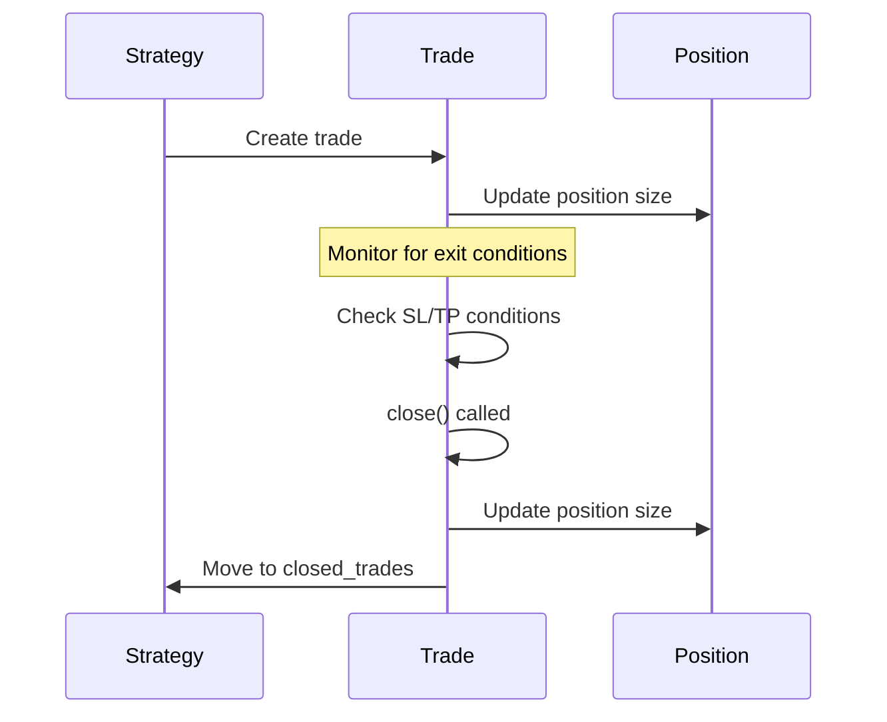
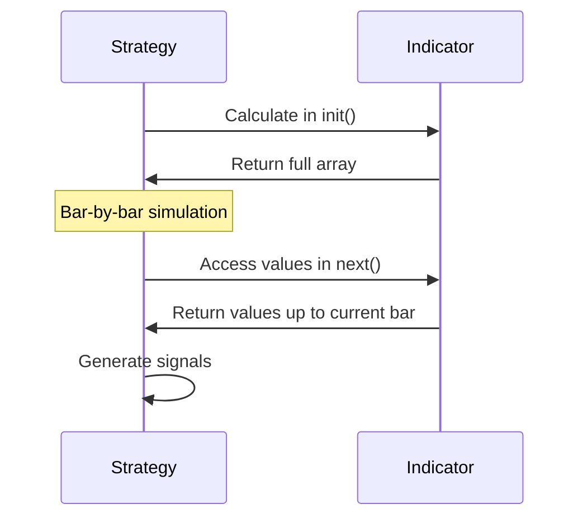

# Backtesting.py Handlers

This document provides comprehensive documentation of the handlers and interfaces in Backtesting.py. Understanding these components is essential for developing effective trading strategies and extending the framework's functionality.

## Handler Overview



## Core Handlers

### Strategy Handler

The `Strategy` class is the primary handler for implementing trading logic. It serves as the base class for all trading strategies in Backtesting.py.

#### Interface

```python
class Strategy:
    def init(self):
        """Initialize the strategy, calculate indicators."""
        pass
        
    def next(self):
        """Called for each new candlestick bar."""
        pass
        
    def buy(self, *, size=0.99, limit=None, stop=None, sl=None, tp=None, tag=None):
        """Place a buy order."""
        pass
        
    def sell(self, *, size=0.99, limit=None, stop=None, sl=None, tp=None, tag=None):
        """Place a sell order."""
        pass
        
    def I(self, func, *args, name=None, plot=True, overlay=None, color=None, **kwargs):
        """Declare an indicator for use in the strategy."""
        pass
```

#### Key Properties

- `data`: Access to price data (OHLCV)
- `position`: Current market position
- `equity`: Current account equity
- `orders`: List of pending orders
- `trades`: List of active trades
- `closed_trades`: List of completed trades

#### Responsibilities

- Defining trading logic and signal generation
- Calculating and managing indicators
- Placing and managing orders
- Tracking positions and trades
- Implementing entry and exit rules

#### Error Handling

- Validates indicator calculations to prevent look-ahead bias
- Ensures orders have valid parameters
- Manages position sizing based on available equity

#### Performance Considerations

- Indicator calculations in `init()` are vectorized for performance
- Bar-by-bar processing in `next()` simulates real-time trading
- Minimize complex calculations in `next()` for better performance

#### Example Usage

```python
class SmaCrossStrategy(Strategy):
    n1 = 10  # Fast SMA period
    n2 = 20  # Slow SMA period
    
    def init(self):
        # Calculate indicators once
        self.sma1 = self.I(SMA, self.data.Close, self.n1)
        self.sma2 = self.I(SMA, self.data.Close, self.n2)
    
    def next(self):
        # If fast SMA crosses above slow SMA, go long
        if crossover(self.sma1, self.sma2):
            self.buy()
            
        # If fast SMA crosses below slow SMA, exit long or go short
        elif crossover(self.sma2, self.sma1):
            self.sell()
```

### SignalStrategy Handler

The `SignalStrategy` is a specialized strategy handler that simplifies the creation of signal-based strategies.

#### Interface

```python
class SignalStrategy(Strategy):
    def init(self):
        """Initialize the strategy."""
        pass
        
    def next(self):
        """Process signals and manage positions."""
        pass
        
    def set_signal(self, entry_size, exit_portion=None, *, plot=True):
        """Set entry/exit signal vectors."""
        pass
```

#### Responsibilities

- Simplifying the creation of signal-based strategies
- Converting boolean signals into trading actions
- Managing position entries and exits based on signals

#### Example Usage

```python
class MySignalStrategy(SignalStrategy):
    def init(self):
        super().init()
        
        # Calculate indicators
        self.sma1 = self.I(SMA, self.data.Close, 10)
        self.sma2 = self.I(SMA, self.data.Close, 20)
        
        # Set entry/exit signals
        entry_signal = self.sma1 > self.sma2  # Long when fast > slow
        exit_signal = self.sma1 < self.sma2   # Exit when fast < slow
        
        self.set_signal(entry_signal, exit_signal)
```

### TrailingStrategy Handler

The `TrailingStrategy` is a specialized strategy handler that implements automatic trailing stop-loss functionality.

#### Interface

```python
class TrailingStrategy(Strategy):
    def init(self):
        """Initialize the strategy."""
        pass
        
    def next(self):
        """Process signals and manage trailing stops."""
        pass
        
    def set_trailing_sl(self, n_atr=6):
        """Set trailing stop-loss as multiple of ATR."""
        pass
        
    def set_trailing_pct(self, pct=0.05):
        """Set trailing stop-loss as percentage of price."""
        pass
        
    def set_atr_periods(self, periods=100):
        """Set ATR calculation period."""
        pass
```

#### Responsibilities

- Implementing automatic trailing stop-loss functionality
- Adjusting stop-loss levels as price moves in favor of the trade
- Managing ATR-based or percentage-based trailing stops

#### Example Usage

```python
class MyTrailingStrategy(TrailingStrategy):
    def init(self):
        super().init()
        
        # Calculate indicators
        self.sma = self.I(SMA, self.data.Close, 20)
        
        # Set trailing stop as 3x ATR
        self.set_trailing_sl(3)
        
    def next(self):
        super().next()  # Important: call parent method to handle trailing stops
        
        # Entry logic
        if not self.position and self.data.Close[-1] > self.sma[-1]:
            self.buy()
```

## Order Handler

The `Order` class represents trading orders and manages their lifecycle.

#### Interface

```python
class Order:
    # Properties
    size        # Order size (positive for long, negative for short)
    limit       # Limit price for limit orders
    stop        # Stop price for stop orders
    sl          # Stop-loss price
    tp          # Take-profit price
    tag         # Custom tag for order identification
    is_long     # True if order is long
    is_short    # True if order is short
    is_contingent  # True if order is contingent (SL/TP)
    
    def cancel(self):
        """Cancel the order."""
        pass
```

#### Responsibilities

- Representing order parameters and state
- Tracking order execution conditions
- Managing contingent orders (stop-loss, take-profit)
- Supporting order cancellation

#### Example Usage

```python
# Creating orders
order = self.buy(size=1.0, limit=price*0.98, sl=price*0.95, tp=price*1.1, tag='buy_dip')

# Canceling orders
for order in self.orders:
    if condition:
        order.cancel()
```

## Trade Handler

The `Trade` class represents executed trades and manages their lifecycle.

#### Interface

```python
class Trade:
    # Properties
    size         # Trade size
    entry_price  # Entry price
    entry_time   # Entry time
    entry_bar    # Entry bar index
    exit_price   # Exit price (None if active)
    exit_time    # Exit time (None if active)
    exit_bar     # Exit bar index (None if active)
    pl           # Profit/loss in cash
    pl_pct       # Profit/loss in percent
    value        # Trade value (size * price)
    sl           # Stop-loss price (writable)
    tp           # Take-profit price (writable)
    tag          # Custom tag
    is_long      # True if trade is long
    is_short     # True if trade is short
    
    def close(self, portion=1.0):
        """Close portion of the trade."""
        pass
```

#### Responsibilities

- Tracking trade entry and exit details
- Calculating profit/loss
- Managing stop-loss and take-profit levels
- Supporting partial or complete trade closure

#### Example Usage

```python
# Closing specific trades
for trade in self.trades:
    if trade.is_long and exit_long_condition:
        trade.close()
    elif trade.is_short and exit_short_condition:
        trade.close()

# Updating stop-loss (trailing stop)
for trade in self.trades:
    if trade.is_long:
        new_sl = max(trade.sl or 0, self.data.Close[-1] * 0.95)
        trade.sl = new_sl
```

## Position Handler

The `Position` class represents the current market position.

#### Interface

```python
class Position:
    # Properties
    size     # Position size (positive for long, negative for short)
    pl       # Profit/loss in cash
    pl_pct   # Profit/loss in percent
    is_long  # True if position is long
    is_short # True if position is short
    
    def close(self, portion=1.0):
        """Close portion of the position."""
        pass
```

#### Responsibilities

- Tracking current market exposure
- Calculating position profit/loss
- Supporting position closure (full or partial)

#### Example Usage

```python
# Check if we have a position
if self.position:
    # Check position direction
    if self.position.is_long:
        # Exit if conditions met
        if exit_long_condition:
            self.position.close()
    else:  # Short position
        if exit_short_condition:
            self.position.close()
else:
    # No position, check for entry
    if long_entry_condition:
        self.buy()
    elif short_entry_condition:
        self.sell()
```

## Backtest Handler

The `Backtest` class is the main handler that orchestrates the backtesting process.

#### Interface

```python
class Backtest:
    def __init__(self, data, strategy, *, cash=10000, commission=0.0, margin=1.0, 
                 trade_on_close=False, hedging=False, exclusive_orders=False):
        """Initialize backtest with data and strategy."""
        pass
        
    def run(self, **kwargs):
        """Run backtest with strategy parameters."""
        pass
        
    def optimize(self, *, maximize='SQN', method='grid', constraint=None, 
                 return_heatmap=False, **kwargs):
        """Optimize strategy parameters."""
        pass
        
    def plot(self, *, results=None, filename=None, plot_width=None, 
             plot_equity=True, plot_return=False, plot_pl=True, 
             plot_volume=True, plot_drawdown=False, plot_trades=True, 
             smooth_equity=False, relative_equity=True, superimpose=True, 
             resample=True, open_browser=True):
        """Plot backtest results."""
        pass
```

#### Responsibilities

- Configuring backtest parameters
- Running the backtest simulation
- Optimizing strategy parameters
- Calculating performance statistics
- Generating interactive visualizations

#### Example Usage

```python
# Create and run backtest
bt = Backtest(data, MyStrategy, cash=100000, commission=0.001)
stats = bt.run(param1=10, param2=20)

# Optimize strategy parameters
optimized = bt.optimize(
    param1=range(5, 20, 5),
    param2=range(10, 50, 10),
    maximize='Sharpe Ratio',
    constraint=lambda p: p.param1 < p.param2
)

# Plot results
bt.plot(filename='backtest_results.html', plot_drawdown=True)
```

## Specialized Handlers

### FractionalBacktest Handler

The `FractionalBacktest` handler extends `Backtest` to support fractional trading.

#### Interface

```python
class FractionalBacktest(Backtest):
    def __init__(self, data, *args, fractional_unit=1e-8, **kwargs):
        """Initialize fractional backtest."""
        pass
```

#### Responsibilities

- Enabling fractional unit trading (e.g., for cryptocurrencies)
- Transforming data to support fractional positions
- Maintaining the same interface as the standard `Backtest`

#### Example Usage

```python
# Create fractional backtest for Bitcoin trading
bt = FractionalBacktest(
    btc_data, 
    MyStrategy, 
    cash=10000, 
    commission=0.001,
    fractional_unit=1e-8  # 1 satoshi
)
stats = bt.run()
```

### MultiBacktest Handler

The `MultiBacktest` handler enables running the same strategy on multiple instruments.

#### Interface

```python
class MultiBacktest:
    def __init__(self, df_list, strategy_cls, **kwargs):
        """Initialize multi-instrument backtest."""
        pass
        
    def run(self, **kwargs):
        """Run backtest on all instruments."""
        pass
        
    def optimize(self, **kwargs):
        """Optimize strategy on all instruments."""
        pass
```

#### Responsibilities

- Running the same strategy on multiple instruments
- Aggregating results across instruments
- Supporting parallel optimization

#### Example Usage

```python
# Create multi-instrument backtest
instruments = [AAPL, MSFT, GOOG]
multi_bt = MultiBacktest(instruments, MyStrategy, cash=10000)

# Run on all instruments
results = multi_bt.run(param1=10, param2=20)

# Optimize across all instruments
optimized = multi_bt.optimize(
    param1=range(5, 20, 5),
    param2=range(10, 50, 10)
)
```

## Handler Interaction Patterns

### Strategy and Order Interaction



### Trade and Position Interaction



### Strategy and Indicator Interaction



## Edge Cases and Their Handling

### 1. Insufficient Cash

When an order requires more cash than available:

```python
def buy(self, size=0.99, **kwargs):
    # If size is a fraction (0-1), it's interpreted as a fraction of available cash
    if 0 < size < 1:
        # Adjust size based on available cash
        size = size  # Framework handles this automatically
    else:
        # Absolute size - framework will scale down if insufficient cash
        size = size
```

### 2. Zero or Negative Prices

The framework validates price data to prevent issues with zero or negative prices:

```python
# This validation happens internally
if price <= 0:
    raise ValueError("Price must be positive")
```

### 3. Look-Ahead Bias Prevention

The framework prevents look-ahead bias by limiting data access in `next()`:

```python
def next(self):
    # Correct: Access only data up to current bar
    current_price = self.data.Close[-1]
    
    # Incorrect: This would cause an IndexError as it tries to access future data
    # future_price = self.data.Close[len(self.data)]
```

### 4. Order Execution Edge Cases

The framework handles various order execution edge cases:

```python
# Market orders with trade_on_close=True
bt = Backtest(data, MyStrategy, trade_on_close=True)
# Orders are filled at current bar's close instead of next bar's open

# Limit orders within bar range
# If High > limit > Low, order is filled at limit price
self.buy(limit=limit_price)

# Stop orders within bar range
# If High > stop > Low, order is activated and filled at stop price
self.buy(stop=stop_price)
```

## Conclusion

Backtesting.py provides a comprehensive set of handlers that enable the development of sophisticated trading strategies. By understanding these handlers and their interactions, developers can create more effective and realistic backtests while avoiding common pitfalls in strategy development.
