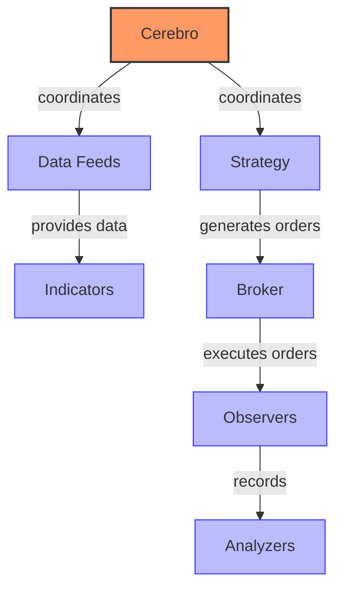

# Backtrader Trading System

## Overview

Backtrader is a Python-based backtesting and trading framework designed for developing, testing, and implementing trading strategies. It follows a simple yet powerful design philosophy focused on ease of use while providing comprehensive functionality for quantitative trading research and execution.

The platform is designed to be intuitive for Python developers, allowing them to quickly implement and test trading ideas without getting bogged down in complex infrastructure. Backtrader emphasizes readability and simplicity in its API design, making it accessible to both beginners and experienced traders.

## Architecture



Backtrader's architecture consists of several key components:

1. **Cerebro** - The central engine that coordinates all activities
2. **Data Feeds** - Sources of market data (historical or live)
3. **Strategy** - User-defined trading logic
4. **Broker** - Simulates or connects to real brokers for order execution
5. **Analyzers** - Components for performance analysis
6. **Observers** - Components for monitoring and visualization
7. **Sizers** - Components for position sizing
8. **Writers** - Components for logging and output

## Key Components and Relationships

### Cerebro

The `Cerebro` class is the central component that orchestrates the entire backtesting process:
- Manages data feeds and strategies
- Coordinates the event-driven architecture
- Handles the simulation loop
- Provides optimization capabilities
- Manages observers, analyzers, and writers

### Data Feeds

Data feeds provide market data to the system:
- Can be historical (CSV, Pandas, databases) or live (Interactive Brokers, Oanda, etc.)
- Support various timeframes and data types (OHLCV, tick data)
- Can be resampled, replayed, or filtered
- Support multiple assets and timeframes simultaneously

### Strategy

The `Strategy` class is where users implement their trading logic:
- Receives data from data feeds
- Implements indicators and signals
- Generates buy/sell orders
- Manages positions and risk
- Provides hooks for various events (initialization, next bar, order notifications)

### Broker

The `Broker` class simulates or connects to real brokers:
- Executes orders
- Tracks positions and cash
- Calculates commissions and slippage
- Provides account information
- Supports various order types (Market, Limit, Stop, StopLimit, etc.)

### Indicators

Indicators are mathematical calculations based on price and volume data:
- Built-in library of common technical indicators (Moving Averages, RSI, MACD, etc.)
- Support for custom indicator development
- Can be chained and combined using natural Python operators
- Support for multiple timeframes

## Supported Markets and Instruments

Backtrader supports a wide range of markets and instruments through its flexible data feed system:

- **Equities**: Stocks, ETFs
- **Futures**: Index futures, Commodity futures, Currency futures
- **Forex**: Currency pairs
- **Cryptocurrencies**: Bitcoin, Ethereum, and other digital assets
- **Custom Instruments**: User-defined custom instruments

## Performance Characteristics

- **Execution Speed**: Moderate (Python-based, but optimized with vectorization)
- **Memory Efficiency**: Moderate to High (configurable memory saving modes)
- **Concurrency**: Supports multiprocessing for optimization
- **Scalability**: Can handle multiple assets and timeframes

## Dependencies and Requirements

- Python 2.7 or Python 3.x
- NumPy for numerical operations
- matplotlib for plotting (optional)
- pandas for data manipulation (optional)
- pytz for timezone handling (optional)

## Quick Start Guide

### Installation

```bash
pip install backtrader
```

### Basic Usage

```python
import backtrader as bt
import datetime

# Create a Cerebro entity
cerebro = bt.Cerebro()

# Add a data feed
data = bt.feeds.YahooFinanceData(
    dataname='AAPL',
    fromdate=datetime.datetime(2019, 1, 1),
    todate=datetime.datetime(2019, 12, 31),
    reverse=False)

cerebro.adddata(data)

# Add a strategy
class MyStrategy(bt.Strategy):
    def __init__(self):
        self.sma = bt.indicators.SimpleMovingAverage(self.data.close, period=20)

    def next(self):
        if self.data.close[0] > self.sma[0]:
            if not self.position:
                self.buy()
        elif self.data.close[0] < self.sma[0]:
            if self.position:
                self.sell()

cerebro.addstrategy(MyStrategy)

# Set our desired cash start
cerebro.broker.setcash(100000.0)

# Add a FixedSize sizer
cerebro.addsizer(bt.sizers.FixedSize, stake=10)

# Set the commission
cerebro.broker.setcommission(commission=0.001)

# Run over everything
cerebro.run()

# Plot the result
cerebro.plot()
```

For more detailed examples, see the [event-flow.md](./event-flow.md), [state-management.md](./state-management.md), and [handlers.md](./handlers.md) documentation.
