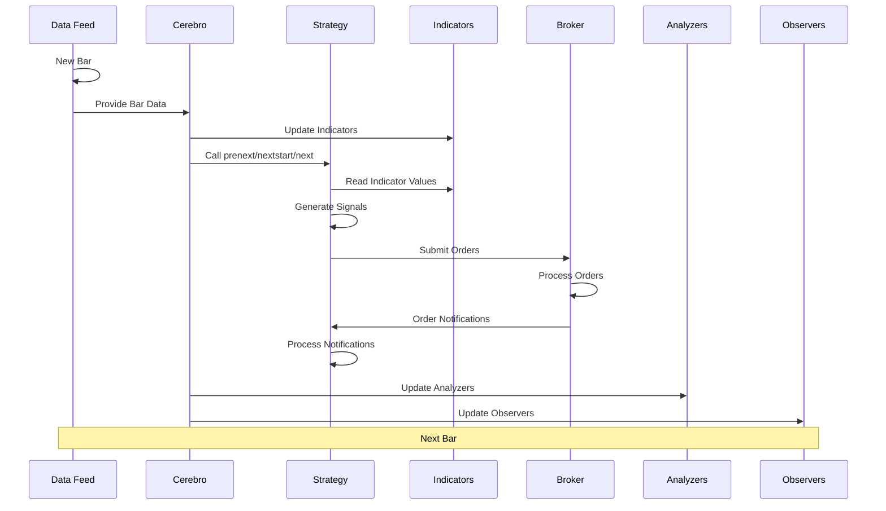
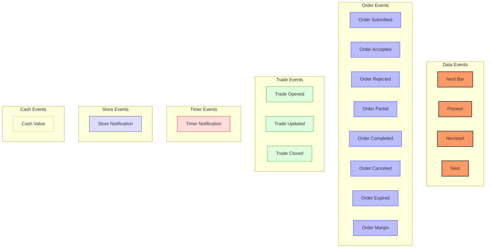
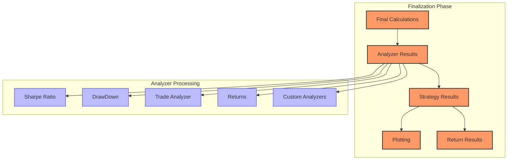
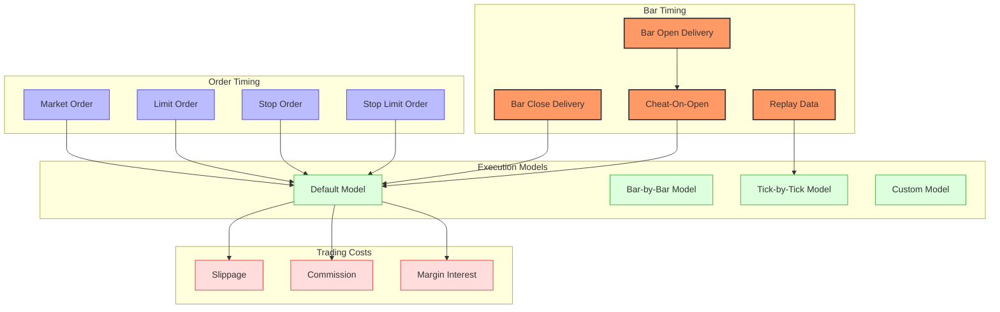
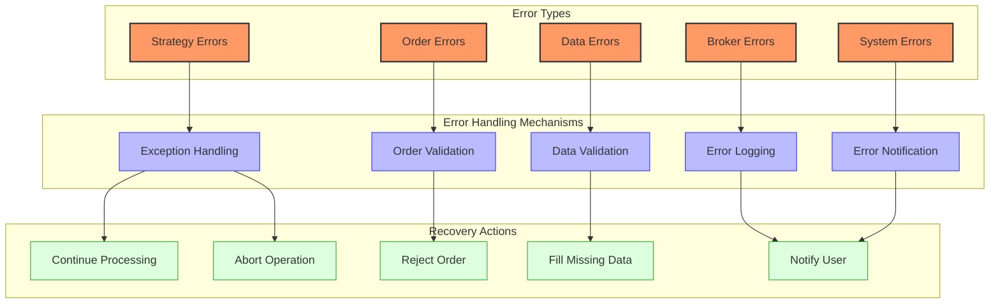

# Backtrader Event Flow

## Event Flow Overview

Backtrader uses an event-driven architecture where the system processes market data and other events sequentially. This document details the event types, their flow through the system, and how they are processed.



The event flow in Backtrader follows a strict sequence for each bar of data, ensuring that all components process events in the correct order. This event-driven architecture allows for accurate simulation of real-world trading conditions.

## Event Types



Backtrader's event flow is primarily driven by the progression of data through the system, with several key event types:

### Data Events

- **Next Bar**: A new bar of data is available for processing
- **Prenext**: Called when not enough bars are available for indicators
- **Nextstart**: Called when indicators have enough data to start producing values
- **Next**: Called for each bar after indicators have started producing values

```python
def prenext(self):
    # Called when not enough bars are available for indicators
    pass

def nextstart(self):
    # Called once when indicators have enough data
    # Default implementation calls next()
    self.next()

def next(self):
    # Called for each bar after indicators have started
    # Main trading logic goes here
    if self.crossover > 0:  # Buy signal
        self.buy()
    elif self.crossover < 0:  # Sell signal
        self.sell()
```

### Order Events

- **Order Submitted**: An order has been submitted to the broker
- **Order Accepted**: An order has been accepted by the broker
- **Order Rejected**: An order has been rejected by the broker
- **Order Partial**: An order has been partially filled
- **Order Completed**: An order has been completely filled
- **Order Canceled**: An order has been canceled
- **Order Expired**: An order has expired
- **Order Margin**: An order has been rejected due to insufficient margin

```python
def notify_order(self, order):
    # Called when an order status changes
    if order.status in [order.Submitted, order.Accepted]:
        # Order has been submitted/accepted - nothing to do
        return

    if order.status == order.Completed:
        # Order has been completed - report execution
        if order.isbuy():
            self.log(f'BUY EXECUTED, {order.executed.price:.2f}')
        else:
            self.log(f'SELL EXECUTED, {order.executed.price:.2f}')
    elif order.status == order.Canceled:
        self.log('Order Canceled')
    elif order.status == order.Margin:
        self.log('Order Margin')
    elif order.status == order.Rejected:
        self.log('Order Rejected')
    elif order.status == order.Expired:
        self.log('Order Expired')
```

### Trade Events

- **Trade Opened**: A new trade has been opened
- **Trade Updated**: An existing trade has been updated (e.g., partial fills)
- **Trade Closed**: A trade has been closed

```python
def notify_trade(self, trade):
    # Called when a trade is opened, updated, or closed
    if not trade.isclosed:
        return  # Trade is still open - nothing to do

    # Trade has been closed - report P&L
    self.log(f'TRADE PROFIT, GROSS {trade.pnl:.2f}, NET {trade.pnlcomm:.2f}')
```

### Timer Events

- **Timer Notification**: A timer has fired, triggering a callback

```python
def notify_timer(self, timer, when, *args, **kwargs):
    # Called when a timer has fired
    self.log(f'Timer {timer.p.tid} fired at {when}')

    # Perform timer-based actions
    if timer.p.tid == 'daily_rebalance':
        self.rebalance_portfolio()
```

### Store Events

- **Store Notification**: A store (e.g., broker connection) has sent a notification

```python
def notify_store(self, msg, *args, **kwargs):
    # Called when a store sends a notification
    self.log(f'Store notification: {msg}')

    # Handle specific store events
    if msg == 'CONNECTED':
        self.broker_connected = True
    elif msg == 'DISCONNECTED':
        self.broker_connected = False
```

### Cash Events

- **Cash Value**: Cash and portfolio value have changed

```python
def notify_cashvalue(self, cash, value):
    # Called when cash or value changes
    self.log(f'Cash: {cash:.2f}, Value: {value:.2f}')

    # Monitor for margin calls
    if cash < value * 0.05:  # Less than 5% cash
        self.log('WARNING: Low cash level, potential margin call')
```

## Event Processing Sequence

```mermaid
flowchart TD
    subgraph "Initialization Phase"
        Init[Cerebro Initialization]
        AddData[Add Data Feeds]
        AddStrategy[Add Strategies]
        AddAnalyzers[Add Analyzers]
        AddObservers[Add Observers]
        ConfigBroker[Configure Broker]
        SetParams[Set Parameters]
    end

    subgraph "Run Phase"
        Run[Cerebro Run]
        LoadData[Load Data]
        InitStrategy[Initialize Strategies]
        InitIndicators[Initialize Indicators]
        CalcIndicators[Calculate Initial Values]

        subgraph "Bar Processing Loop"
            NextBar[Next Bar]
            UpdateIndicators[Update Indicators]
            StrategyMethod[Call prenext/nextstart/next]
            GenerateOrders[Generate Orders]
            ProcessOrders[Process Orders]
            NotifyOrder[Notify Order Status]
            NotifyTrade[Notify Trade Status]
            UpdateAnalyzers[Update Analyzers]
            UpdateObservers[Update Observers]
        end
    end

    subgraph "End Phase"
        End[Cerebro End]
        FinalCalc[Final Calculations]
        CompileResults[Compile Results]
        ReturnResults[Return Results]
        OptionalPlot[Optional Plotting]
    end

    Init --> AddData
    AddData --> AddStrategy
    AddStrategy --> AddAnalyzers
    AddAnalyzers --> AddObservers
    AddObservers --> ConfigBroker
    ConfigBroker --> SetParams
    SetParams --> Run

    Run --> LoadData
    LoadData --> InitStrategy
    InitStrategy --> InitIndicators
    InitIndicators --> CalcIndicators
    CalcIndicators --> NextBar

    NextBar --> UpdateIndicators
    UpdateIndicators --> StrategyMethod
    StrategyMethod --> GenerateOrders
    GenerateOrders --> ProcessOrders
    ProcessOrders --> NotifyOrder
    NotifyOrder --> NotifyTrade
    NotifyTrade --> UpdateAnalyzers
    UpdateAnalyzers --> UpdateObservers
    UpdateObservers --> NextBar

    NextBar -- "No more bars" --> End
    End --> FinalCalc
    FinalCalc --> CompileResults
    CompileResults --> ReturnResults
    ReturnResults --> OptionalPlot

    %% Style definitions
    style Init fill:#f96,stroke:#333,stroke-width:2px
    style AddData fill:#f96,stroke:#333,stroke-width:2px
    style AddStrategy fill:#f96,stroke:#333,stroke-width:2px
    style AddAnalyzers fill:#f96,stroke:#333,stroke-width:2px
    style AddObservers fill:#f96,stroke:#333,stroke-width:2px
    style ConfigBroker fill:#f96,stroke:#333,stroke-width:2px
    style SetParams fill:#f96,stroke:#333,stroke-width:2px

    style Run fill:#bbf,stroke:#33f,stroke-width:1px
    style LoadData fill:#bbf,stroke:#33f,stroke-width:1px
    style InitStrategy fill:#bbf,stroke:#33f,stroke-width:1px
    style InitIndicators fill:#bbf,stroke:#33f,stroke-width:1px
    style CalcIndicators fill:#bbf,stroke:#33f,stroke-width:1px

    style NextBar fill:#dfd,stroke:#3a3,stroke-width:1px
    style UpdateIndicators fill:#dfd,stroke:#3a3,stroke-width:1px
    style StrategyMethod fill:#dfd,stroke:#3a3,stroke-width:1px
    style GenerateOrders fill:#dfd,stroke:#3a3,stroke-width:1px
    style ProcessOrders fill:#dfd,stroke:#3a3,stroke-width:1px
    style NotifyOrder fill:#dfd,stroke:#3a3,stroke-width:1px
    style NotifyTrade fill:#dfd,stroke:#3a3,stroke-width:1px
    style UpdateAnalyzers fill:#dfd,stroke:#3a3,stroke-width:1px
    style UpdateObservers fill:#dfd,stroke:#3a3,stroke-width:1px

    style End fill:#fdd,stroke:#d33,stroke-width:1px
    style FinalCalc fill:#fdd,stroke:#d33,stroke-width:1px
    style CompileResults fill:#fdd,stroke:#d33,stroke-width:1px
    style ReturnResults fill:#fdd,stroke:#d33,stroke-width:1px
    style OptionalPlot fill:#fdd,stroke:#d33,stroke-width:1px
```



Backtrader's event processing follows a well-defined sequence that ensures proper initialization, data processing, and finalization. This sequence is orchestrated by the Cerebro engine, which acts as the central coordinator for all components.

### Event Processing Phases

#### 1. Initialization Phase

During initialization, Cerebro sets up all components needed for the backtest or live trading session:

- **Cerebro Initialization**: Create a Cerebro instance with desired settings
- **Add Data Feeds**: Register data sources (CSV files, databases, live feeds, etc.)
- **Add Strategies**: Register one or more trading strategies
- **Add Analyzers**: Register performance analyzers (Sharpe ratio, drawdown, etc.)
- **Add Observers**: Register observers for tracking metrics (cash, value, trades, etc.)
- **Configure Broker**: Set up broker parameters (cash, commission, slippage, etc.)
- **Set Parameters**: Configure additional parameters (sizers, writers, etc.)

#### 2. Run Phase

The run phase is where the actual processing happens:

- **Load Data**: Data feeds are loaded into memory (if preload is enabled)
- **Initialize Strategies**: Strategy `__init__` methods are called
- **Initialize Indicators**: Indicators are created and initialized
- **Calculate Initial Values**: Initial indicator values are calculated

#### 3. Bar Processing Loop

The core of Backtrader's event processing is the bar processing loop:

- **Next Bar**: Advance to the next bar in the data feeds
- **Update Indicators**: Recalculate indicator values for the current bar
- **Call Strategy Methods**: Call `prenext()`, `nextstart()`, or `next()` as appropriate
- **Generate Orders**: Strategy creates buy/sell orders
- **Process Orders**: Broker processes orders (accept, reject, execute)
- **Notify Order Status**: Strategy is notified of order status changes
- **Notify Trade Status**: Strategy is notified of trade status changes
- **Update Analyzers**: Analyzers process the current bar
- **Update Observers**: Observers record current values

#### 4. End Phase

After all bars have been processed:

- **Final Calculations**: Perform any final calculations
- **Compile Results**: Gather results from strategies, analyzers, etc.
- **Return Results**: Return strategy instances with results
- **Optional Plotting**: Generate plots if requested

### Backtesting Flow

In backtesting mode, the event processing sequence follows a well-defined flow:

#### 1. Cerebro Initialization

```python
# Create a Cerebro instance
cerebro = bt.Cerebro()

# Add data feeds
data = bt.feeds.YahooFinanceCSVData(dataname='AAPL.csv')
cerebro.adddata(data)

# Add strategy
cerebro.addstrategy(MyStrategy)

# Add analyzers
cerebro.addanalyzer(bt.analyzers.SharpeRatio, _name='sharpe')
cerebro.addanalyzer(bt.analyzers.DrawDown, _name='drawdown')

# Add observers
cerebro.addobserver(bt.observers.Broker)
cerebro.addobserver(bt.observers.BuySell)

# Configure broker
cerebro.broker.setcash(100000.0)
cerebro.broker.setcommission(commission=0.001)  # 0.1%
```

#### 2. Preloading Phase (Optional)

```python
# Enable preloading for faster backtesting
cerebro = bt.Cerebro(runonce=True, preload=True)
```

When preloading is enabled:
- Data is loaded into memory before the backtest starts
- Indicators can be calculated in vectorized mode if `runonce=True`
- This significantly improves performance for large datasets

#### 3. Main Loop

During the main loop, Cerebro processes each bar sequentially:

```python
# Simplified pseudocode of Cerebro's main loop
def _runnext(self):
    # Loop through all bars
    while self.datas[0].next():
        # Update all data feeds
        for data in self.datas[1:]:
            data.next()

        # Process pending orders
        self.broker.next()

        # Call strategy methods
        for strategy in self.strategies:
            strategy._next()

        # Update observers
        for observer in self.observers:
            observer.next()

        # Update analyzers
        for analyzer in self.analyzers:
            analyzer.next()
```

#### 4. Finalization

```python
# Access results after the run
results = cerebro.run()
strategy = results[0]

# Get analyzer results
sharpe = strategy.analyzers.sharpe.get_analysis()['sharperatio']
drawdown = strategy.analyzers.drawdown.get_analysis()['max']['drawdown']

# Plot results
cerebro.plot()
```

### Finalization Phase



During finalization, Backtrader performs several important steps:

1. **Final Calculations**: All remaining calculations are completed
   - Indicators finalize their values
   - Strategy completes its processing
   - Broker finalizes order processing

2. **Analyzer Results Compilation**: All analyzers process their final data
   - Performance metrics are calculated (Sharpe ratio, drawdown, etc.)
   - Trade statistics are compiled
   - Custom analyzers complete their analysis

3. **Results Collection**: Results from the backtest are collected
   - Strategy instances are returned
   - Analyzer results are made accessible
   - Performance metrics are prepared for reporting

4. **Plotting (Optional)**: If requested, results are plotted
   - Price data and indicators are visualized
   - Trade entries and exits are marked
   - Equity curves and other metrics are displayed

```python
# Access results after the run
results = cerebro.run()
strategy = results[0]

# Get analyzer results
sharpe = strategy.analyzers.sharpe.get_analysis()['sharperatio']
drawdown = strategy.analyzers.drawdown.get_analysis()['max']['drawdown']
trades = strategy.analyzers.trades.get_analysis()

# Print key performance metrics
print(f"Sharpe Ratio: {sharpe:.3f}")
print(f"Max Drawdown: {drawdown:.2%}")
print(f"Total Trades: {trades['total']['total']}")
print(f"Win Rate: {trades['won']['total'] / trades['total']['total']:.2%}")

# Plot results (optional)
cerebro.plot(style='candle', barup='green', bardown='red',
             volup='green', voldown='red', grid=True)
```

### Live Trading Flow

For live trading, the event flow is similar but driven by real-time data:

1. **Cerebro Initialization**
   - Live data feeds are connected
   - Strategies are instantiated
   - Indicators are created
   - Observers and analyzers are set up

2. **Main Loop**
   - For each new data point received:
     - Data feeds are updated
     - Broker processes pending orders and receives execution reports
     - Strategy's prenext/nextstart/next method is called
     - Observers record values
     - Analyzers process data

## Detailed Event Flow

### Strategy Lifecycle Events

The `Strategy` class has several methods that are called at different points in the event flow:

1. **__init__**: Called when the strategy is instantiated
   - Used to set up indicators and other components
   - No trading should be done here

2. **start**: Called before the main event loop begins
   - Used for any initialization that requires all data feeds to be registered

3. **prenext**: Called when not enough bars are available for indicators
   - Receives the current bar data
   - Can be used for preliminary analysis

4. **nextstart**: Called once when indicators have enough data
   - Transition from prenext to next
   - Only called once

5. **next**: Called for each bar after indicators have started
   - Main trading logic goes here
   - Generates buy/sell signals

6. **stop**: Called after the main event loop ends
   - Used for cleanup and final calculations

### Order Lifecycle Events

Orders in Backtrader go through a lifecycle with several notification events:

1. **Order Creation**: Strategy creates an order
   - `buy()`, `sell()`, `close()`, etc.

2. **Order Submission**: Order is submitted to the broker
   - `notify_order()` is called with status `Submitted`

3. **Order Acceptance**: Broker accepts the order
   - `notify_order()` is called with status `Accepted`

4. **Order Execution**: Order is executed (partially or fully)
   - `notify_order()` is called with status `Partial` or `Completed`
   - `notify_trade()` is called for any trades created

5. **Order Cancellation/Expiration**: Order is canceled or expires
   - `notify_order()` is called with status `Canceled` or `Expired`

## Timing Considerations



Backtrader's event processing is designed to simulate realistic trading scenarios:

### Bar Delivery Timing

1. **Standard Bar Delivery**: By default, bars are delivered at the end of the period
   - This prevents look-ahead bias by simulating that you only know the bar after it's completed
   - Orders are executed on the next bar after the signal

   ```python
   # Standard bar delivery (default)
   cerebro = bt.Cerebro()
   ```

2. **Cheat-On-Open Mode**: Simulates trading at the open of the bar
   - Allows strategies to generate signals based on the previous bar's data
   - Orders are executed at the open price of the current bar

   ```python
   # Enable Cheat-On-Open mode
   cerebro = bt.Cerebro(cheat_on_open=True)
   ```

3. **Replay Data**: Provides intra-bar data for more realistic simulation
   - Breaks down bars into smaller timeframes
   - Allows for more precise order execution timing

   ```python
   # Create a replay data feed
   data = bt.feeds.YahooFinanceCSVData(dataname='AAPL.csv')
   cerebro.resampledata(data, timeframe=bt.TimeFrame.Ticks)
   ```

### Order Execution Timing

1. **Market Orders**: Execute at the next available price
   - In standard mode: next bar's open price
   - In cheat-on-open mode: current bar's open price

   ```python
   # Market order
   self.buy(exectype=bt.Order.Market)
   ```

2. **Limit Orders**: Execute when price reaches or improves beyond the limit price
   - Buy limit: executes when price <= limit price
   - Sell limit: executes when price >= limit price

   ```python
   # Limit order
   self.buy(exectype=bt.Order.Limit, price=100.0)
   ```

3. **Stop Orders**: Execute when price reaches or worsens beyond the stop price
   - Buy stop: executes when price >= stop price
   - Sell stop: executes when price <= stop price

   ```python
   # Stop order
   self.sell(exectype=bt.Order.Stop, price=95.0)
   ```

4. **Stop Limit Orders**: Combine stop and limit order behavior
   - Trigger at stop price, then become limit orders

   ```python
   # Stop limit order
   self.buy(exectype=bt.Order.StopLimit, price=105.0, plimit=107.0)
   ```

### Trading Costs

1. **Commission Models**: Various commission schemes can be applied
   - Fixed commission per trade
   - Percentage of trade value
   - Per-share commission
   - Tiered commission structures

   ```python
   # Set percentage commission
   cerebro.broker.setcommission(commission=0.001)  # 0.1%

   # Set fixed commission
   cerebro.broker.setcommission(commission=5.0, commtype=bt.CommInfoBase.COMM_FIXED)

   # Custom commission scheme
   class MyCommissionScheme(bt.CommInfoBase):
       def _getcommission(self, size, price, pseudoexec):
           return abs(size) * price * 0.001  # 0.1% of trade value

   cerebro.broker.addcommissioninfo(MyCommissionScheme())
   ```

2. **Slippage Models**: Simulate price slippage during execution
   - Fixed slippage in points
   - Percentage slippage
   - Volume-based slippage

   ```python
   # Set percentage slippage
   cerebro.broker.set_slippage_perc(0.001)  # 0.1% slippage

   # Set fixed slippage
   cerebro.broker.set_slippage_fixed(0.02)  # 2 cents slippage
   ```

3. **Margin and Interest**: Simulate margin requirements and interest costs
   - Leverage settings
   - Margin call handling
   - Interest on borrowed funds

   ```python
   # Set leverage
   cerebro.broker.set_leverage(5.0)  # 5x leverage

   # Custom margin scheme with interest
   class MarginScheme(bt.CommInfoBase):
       params = (
           ('leverage', 5.0),
           ('interest', 0.05),  # 5% annual interest
       )

       def get_margin(self, price):
           return price / self.p.leverage

       def get_interest(self, size, price, days):
           return abs(size) * price * (self.p.interest / 365) * days

   cerebro.broker.addcommissioninfo(MarginScheme())
   ```

## Error Handling in the Event Flow



Backtrader implements comprehensive error handling throughout the event flow:

### Strategy Error Handling

1. **Exception Handling**: Exceptions in strategy code are caught and reported
   - The system attempts to continue processing when possible
   - Stack traces are provided for debugging

   ```python
   # Example of try/except in strategy code
   def next(self):
       try:
           # Strategy logic that might raise exceptions
           if self.calculate_signal():
               self.buy()
       except Exception as e:
           self.log(f"Error in strategy: {e}")
           # Continue with next bar
   ```

2. **Logging Framework**: Comprehensive logging helps identify issues
   - Different log levels for different severity
   - Timestamps and context information

   ```python
   # Example of logging in a strategy
   def log(self, txt, dt=None):
       dt = dt or self.datas[0].datetime.date(0)
       print(f"{dt.isoformat()}: {txt}")
   ```

### Order Error Handling

1. **Order Validation**: Orders are validated before submission
   - Size validation (non-zero, within limits)
   - Cash/margin validation
   - Price validation for limit/stop orders

   ```python
   # Order validation happens automatically
   # You can add custom validation
   def buy(self, **kwargs):
       size = kwargs.get('size', 1)
       price = kwargs.get('price', self.data.close[0])

       # Custom validation
       if size <= 0:
           self.log("Invalid order size: must be positive")
           return None

       if price <= 0:
           self.log("Invalid price: must be positive")
           return None

       # Submit order if validation passes
       return super().buy(**kwargs)
   ```

2. **Order Rejection Handling**: Proper handling of rejected orders
   - Notification through `notify_order`
   - Reason codes for different rejection types

   ```python
   def notify_order(self, order):
       if order.status == order.Rejected:
           self.log(f"Order rejected: {order.info.get('reject_reason', 'Unknown reason')}")
           # Handle rejection (e.g., try alternative order type)
           if order.info.get('reject_reason') == 'Insufficient margin':
               # Try with smaller size
               size = order.size / 2
               self.buy(size=size)
   ```

### Data Error Handling

1. **Data Validation**: Data feeds are validated for consistency
   - Timestamp validation
   - Price range validation
   - Volume validation

   ```python
   # Custom data feed with validation
   class ValidatedCSVData(bt.feeds.CSVData):
       def _load(self):
           # Call parent load method
           super()._load()

           # Validate loaded data
           for i in range(len(self)):
               if self.lines.close[i] <= 0:
                   # Fix or report invalid prices
                   self.lines.close[i] = self.lines.open[i]
                   print(f"Warning: Invalid close price at {self.lines.datetime.date(i)}")
   ```

2. **Missing Data Handling**: Various methods to handle missing data
   - Forward filling
   - Backward filling
   - Interpolation
   - Custom filling methods

   ```python
   # Configure data feed to handle missing data
   data = bt.feeds.YahooFinanceCSVData(
       dataname='AAPL.csv',
       fromdate=datetime(2020, 1, 1),
       todate=datetime(2021, 1, 1),
       nullvalue=0.0,  # Value to use for missing data
       fillclose=True,  # Fill missing close prices
       fillhigh=True,   # Fill missing high prices
       filllow=True,    # Fill missing low prices
       fillopen=True,   # Fill missing open prices
       fillvolume=False  # Don't fill missing volume
   )
   ```

### System Error Handling

1. **Resource Management**: Proper handling of system resources
   - File handles are properly closed
   - Memory usage is monitored
   - Temporary resources are cleaned up

   ```python
   # Example of resource management
   def __init__(self):
       self.file_handle = None

   def start(self):
       try:
           self.file_handle = open('output.csv', 'w')
       except IOError as e:
           self.log(f"Error opening file: {e}")

   def stop(self):
       if self.file_handle is not None:
           self.file_handle.close()
           self.file_handle = None
   ```

2. **Graceful Shutdown**: System shuts down gracefully on errors
   - Resources are released
   - Partial results are saved when possible
   - Error conditions are reported

   ```python
   # Example of graceful shutdown
   try:
       results = cerebro.run()
   except Exception as e:
       print(f"Error during backtest: {e}")
       # Save partial results if available
       if hasattr(cerebro, 'save_state'):
           cerebro.save_state('recovery_point.pkl')
   finally:
       # Clean up resources
       if hasattr(cerebro, 'close'):
           cerebro.close()
   ```

## Event Flow Monitoring and Debugging

```mermaid
flowchart TD
    subgraph "Monitoring Tools"
        Logging[Logging]:::tool
        Observers[Observers]:::tool
        Writers[Writers]:::tool
        Plotting[Plotting]:::tool
        Analyzers[Analyzers]:::tool
    end

    subgraph "Observable Components"
        Strategy[Strategy]:::component
        Broker[Broker]:::component
        DataFeeds[Data Feeds]:::component
        Indicators[Indicators]:::component
        Orders[Orders]:::component
        Trades[Trades]:::component
    end

    subgraph "Output Formats"
        Console[Console Output]:::output
        CSVFiles[CSV Files]:::output
        Plots[Interactive Plots]:::output
        CustomOutput[Custom Output]:::output
    end

    Logging --> Strategy
    Logging --> Broker
    Logging --> DataFeeds

    Observers --> Broker
    Observers --> Orders
    Observers --> Trades

    Writers --> Strategy
    Writers --> Broker
    Writers --> DataFeeds
    Writers --> Indicators

    Plotting --> Indicators
    Plotting --> Orders
    Plotting --> Trades

    Analyzers --> Strategy
    Analyzers --> Trades

    Logging --> Console
    Logging --> CSVFiles

    Writers --> CSVFiles
    Writers --> CustomOutput

    Observers --> Plots
    Plotting --> Plots

    Analyzers --> Console
    Analyzers --> CSVFiles

    classDef tool fill:#f96,stroke:#333,stroke-width:2px;
    classDef component fill:#bbf,stroke:#33f,stroke-width:1px;
    classDef output fill:#dfd,stroke:#3a3,stroke-width:1px;

    class Logging,Observers,Writers,Plotting,Analyzers tool;
    class Strategy,Broker,DataFeeds,Indicators,Orders,Trades component;
    class Console,CSVFiles,Plots,CustomOutput output;
```



Backtrader provides comprehensive tools for monitoring and debugging the event flow:

### Logging

Backtrader supports detailed logging of events and their processing:

```python
import logging
import backtrader as bt

# Configure logging
logging.basicConfig(
    format='%(asctime)s %(name)s:%(levelname)s:%(message)s',
    level=logging.DEBUG,
    datefmt='%Y-%m-%d %H:%M:%S'
)

# Create a strategy with logging
class LoggingStrategy(bt.Strategy):
    def log(self, txt, dt=None):
        dt = dt or self.datas[0].datetime.date(0)
        print(f'{dt.isoformat()} {txt}')

    def next(self):
        self.log(f'Close: {self.data.close[0]:.2f}')

        # Log indicator values
        self.log(f'SMA: {self.sma[0]:.2f}')

        # Log portfolio information
        self.log(f'Cash: {self.broker.getcash():.2f}, Value: {self.broker.getvalue():.2f}')
```

### Observers

Observers provide real-time monitoring of key metrics during backtesting:

```python
# Add observers to Cerebro
cerebro = bt.Cerebro()

# Add standard observers
cerebro.addobserver(bt.observers.Broker)  # Cash and value
cerebro.addobserver(bt.observers.BuySell)  # Buy/sell arrows
cerebro.addobserver(bt.observers.Trades)  # Trades information
cerebro.addobserver(bt.observers.DrawDown)  # Drawdown

# Create a custom observer
class PositionObserver(bt.Observer):
    lines = ('size', 'price',)

    def next(self):
        self.lines.size[0] = self._owner.position.size
        self.lines.price[0] = self._owner.position.price

# Add custom observer
cerebro.addobserver(PositionObserver)
```

### Writers

Writers record detailed information about the backtest to files:

```python
from backtrader.writer import WriterFile

# Create a Cerebro entity
cerebro = bt.Cerebro()

# Add a writer with CSV output
cerebro.addwriter(WriterFile, csv=True, out='backtest_log.csv')

# Add a writer with custom output format
class CustomWriter(bt.WriterFile):
    def _write_strategy(self, strategy):
        # Custom strategy writing logic
        dt = strategy.datetime.date(0).isoformat()
        close = strategy.data.close[0]
        position = strategy.position.size

        # Write to file
        self.writer.writerow([dt, close, position])

# Add custom writer
cerebro.addwriter(CustomWriter, out='custom_log.csv')
```

### Plotting

Backtrader provides powerful visualization capabilities for debugging:

```python
# Configure plotting
cerebro = bt.Cerebro()
cerebro.addobserver(bt.observers.BuySell)  # Add buy/sell arrows

# Run backtest
results = cerebro.run()

# Plot with default settings
cerebro.plot()

# Plot with custom settings
cerebro.plot(
    style='candle',  # Use candlestick chart
    barup='green',   # Up candles color
    bardown='red',   # Down candles color
    volup='green',   # Up volume color
    voldown='red',   # Down volume color
    grid=True,       # Show grid
    plotdist=0.1,    # Distance between subplots
    barupfill=True,  # Fill up candles
    bardownfill=True,  # Fill down candles
    volume=True      # Plot volume
)

# Plot specific data and indicators
cerebro.plot(
    plotter=bt.plot.Plot_OldSync(),  # Use old synchronization
    numfigs=2,  # Number of figures
    iplot=True,  # Interactive plot
    start=datetime(2020, 3, 1),  # Start date
    end=datetime(2020, 6, 1),  # End date
    use='line',  # Line chart
    width=16, height=9,  # Figure size
    dpi=100,  # DPI
    tight=True,  # Tight layout
    strip_indicators=True,  # Strip indicators
    strip_observers=True,  # Strip observers
)
```

### Analyzers

Analyzers provide detailed performance metrics that can help debug strategy behavior:

```python
# Add analyzers to Cerebro
cerebro = bt.Cerebro()

# Add standard analyzers
cerebro.addanalyzer(bt.analyzers.SharpeRatio, _name='sharpe')
cerebro.addanalyzer(bt.analyzers.DrawDown, _name='drawdown')
cerebro.addanalyzer(bt.analyzers.TradeAnalyzer, _name='trades')
cerebro.addanalyzer(bt.analyzers.TimeReturn, _name='returns')

# Run backtest
results = cerebro.run()
strategy = results[0]

# Access analyzer results
sharpe = strategy.analyzers.sharpe.get_analysis()
drawdown = strategy.analyzers.drawdown.get_analysis()
trades = strategy.analyzers.trades.get_analysis()
returns = strategy.analyzers.returns.get_analysis()

# Print analyzer results
print(f"Sharpe Ratio: {sharpe['sharperatio']:.3f}")
print(f"Max Drawdown: {drawdown['max']['drawdown']:.2%}")
print(f"Total Trades: {trades['total']['total']}")
print(f"Win Rate: {trades['won']['total'] / trades['total']['total']:.2%}")

# Create a custom analyzer
class CustomAnalyzer(bt.Analyzer):
    def start(self):
        self.trades = []

    def notify_trade(self, trade):
        if trade.isclosed:
            self.trades.append({
                'entry_date': trade.dtopen,
                'exit_date': trade.dtclose,
                'entry_price': trade.price,
                'exit_price': trade.pnlcomm,
                'pnl': trade.pnlcomm,
                'bars_held': trade.barlen,
            })

    def get_analysis(self):
        return {
            'trades': self.trades,
            'total_trades': len(self.trades),
            'avg_bars_held': sum(t['bars_held'] for t in self.trades) / len(self.trades) if self.trades else 0,
        }

# Add custom analyzer
cerebro.addanalyzer(CustomAnalyzer, _name='custom')
```

### Debugging Techniques

1. **Step-by-Step Debugging**: Run the strategy step by step
   ```python
   # Create a strategy with debug prints
   class DebugStrategy(bt.Strategy):
       def next(self):
           print(f"Date: {self.datetime.date(0)}")
           print(f"Open: {self.data.open[0]:.2f}")
           print(f"High: {self.data.high[0]:.2f}")
           print(f"Low: {self.data.low[0]:.2f}")
           print(f"Close: {self.data.close[0]:.2f}")
           print(f"SMA: {self.sma[0]:.2f}")
           print(f"Position: {self.position.size}")
           print("---")
   ```

2. **Event Tracing**: Trace specific events through the system
   ```python
   # Trace order events
   def notify_order(self, order):
       print(f"Order Event: {order.getstatusname()}")
       print(f"  - Order ID: {order.ref}")
       print(f"  - Order Type: {order.ordtypename()}")
       print(f"  - Order Size: {order.size}")
       print(f"  - Order Price: {order.price}")
       print(f"  - Order Created: {bt.num2date(order.created.dt)}")
       if order.status >= order.Completed:
           print(f"  - Order Executed: {bt.num2date(order.executed.dt)}")
           print(f"  - Execution Price: {order.executed.price}")
           print(f"  - Execution Size: {order.executed.size}")
           print(f"  - Execution Value: {order.executed.value}")
           print(f"  - Execution Commission: {order.executed.comm}")
   ```

3. **Data Inspection**: Inspect data at specific points
   ```python
   # Inspect data at specific dates
   def next(self):
       current_date = self.datetime.date(0)
       target_date = datetime.date(2020, 3, 15)

       if current_date == target_date:
           print(f"Inspecting data on {current_date}:")
           print(f"  - Close: {self.data.close[0]}")
           print(f"  - SMA: {self.sma[0]}")
           print(f"  - Position: {self.position.size}")
           print(f"  - Cash: {self.broker.getcash()}")
           print(f"  - Value: {self.broker.getvalue()}")
   ```

## Comparison with Other Event-Driven Systems

```mermaid
flowchart TD
    subgraph "Trading Systems"
        BT[Backtrader]:::backtrader
        ZP[Zipline]:::zipline
        QC[QuantConnect]:::quantconnect
        VBT[VectorBT]:::vectorbt
        IBPy[IBPy]:::ibpy
    end

    subgraph "Event Models"
        Bar[Bar-based Events]:::event
        Tick[Tick-based Events]:::event
        Batch[Batch Processing]:::event
        Vector[Vectorized Operations]:::event
        Raw[Raw Messages]:::event
    end

    subgraph "Processing Models"
        Sequential[Sequential]:::model
        Pipeline[Pipeline]:::model
        MultiThread[Multi-threaded]:::model
        Parallel[Parallel]:::model
        Async[Asynchronous]:::model
    end

    subgraph "State Management"
        Mutable[Mutable Objects]:::state
        Immutable[Immutable Objects]:::state
        OOP[Object-Oriented]:::state
        Minimal[Minimal State]:::state
    end

    subgraph "Performance vs Flexibility"
        direction LR
        HighPerf[High Performance]:::perf
        MedPerf[Medium Performance]:::perf
        LowPerf[Low Performance]:::perf
        HighFlex[High Flexibility]:::flex
        MedFlex[Medium Flexibility]:::flex
        LowFlex[Low Flexibility]:::flex
    end

    BT --> Bar
    BT --> Sequential
    BT --> Mutable
    BT --> MedPerf
    BT --> HighFlex

    ZP --> Bar
    ZP --> Pipeline
    ZP --> Batch
    ZP --> Immutable
    ZP --> MedPerf
    ZP --> MedFlex

    QC --> Bar
    QC --> Tick
    QC --> MultiThread
    QC --> OOP
    QC --> HighPerf
    QC --> MedFlex

    VBT --> Vector
    VBT --> Parallel
    VBT --> Batch
    VBT --> Immutable
    VBT --> HighPerf
    VBT --> LowFlex

    IBPy --> Raw
    IBPy --> Async
    IBPy --> Minimal
    IBPy --> LowPerf
    IBPy --> HighFlex

    classDef backtrader fill:#f96,stroke:#333,stroke-width:2px;
    classDef zipline fill:#bbf,stroke:#33f,stroke-width:1px;
    classDef quantconnect fill:#dfd,stroke:#3a3,stroke-width:1px;
    classDef vectorbt fill:#fdd,stroke:#d33,stroke-width:1px;
    classDef ibpy fill:#ddf,stroke:#33d,stroke-width:1px;
    classDef event fill:#f9f,stroke:#333,stroke-width:1px;
    classDef model fill:#9ff,stroke:#333,stroke-width:1px;
    classDef state fill:#fd9,stroke:#333,stroke-width:1px;
    classDef perf fill:#9df,stroke:#333,stroke-width:1px;
    classDef flex fill:#df9,stroke:#333,stroke-width:1px;

    class BT backtrader;
    class ZP zipline;
    class QC quantconnect;
    class VBT vectorbt;
    class IBPy ibpy;
    class Bar,Tick,Batch,Vector,Raw event;
    class Sequential,Pipeline,MultiThread,Parallel,Async model;
    class Mutable,Immutable,OOP,Minimal state;
    class HighPerf,MedPerf,LowPerf perf;
    class HighFlex,MedFlex,LowFlex flex;
```



### Comparison Table

| System | Event Model | Processing Model | State Management | Performance | Flexibility |
|--------|-------------|------------------|------------------|-------------|-------------|
| **Backtrader** | Bar-based with sequential processing | Single-threaded with event loop | Mutable objects with line arrays | Moderate (Python overhead) | High (customizable at all levels) |
| **Zipline** | Bar-based with minute resolution | Pipeline-based batch processing | Immutable DataFrames | Good (optimized for batch processing) | Medium (fixed pipeline architecture) |
| **QuantConnect** | Tick and bar-based events | Multi-threaded event processing | Object-oriented with history management | Very good (C# performance) | Medium-high (plugin architecture) |
| **VectorBT** | Vectorized batch processing | Parallel array operations | Immutable arrays | Excellent (vectorized operations) | Low (limited to vectorizable strategies) |
| **IBPy** | Raw message-based events | Asynchronous callbacks | Minimal (user-managed) | Low (raw API only) | Very high (direct broker access) |

Backtrader's event flow differs from other event-driven systems in several key aspects:

### Sequential vs. Parallel Processing

1. **Backtrader**: Uses sequential processing where events are handled one at a time in chronological order
   ```python
   # Backtrader's sequential processing
   def next(self):
       # Process current bar
       if self.crossover > 0:
           self.buy()
   ```

2. **VectorBT**: Uses vectorized parallel processing where all events are processed simultaneously
   ```python
   # VectorBT's vectorized processing
   fast_ma = vbt.MA.run(price, window=10)
   slow_ma = vbt.MA.run(price, window=30)
   entries = fast_ma.ma_above(slow_ma)  # Processes all bars at once
   ```

### Event Granularity

1. **Backtrader**: Primarily designed around bar-based events (OHLCV)
   ```python
   # Backtrader's bar-based processing
   def next(self):
       # Access current bar data
       current_open = self.data.open[0]
       current_high = self.data.high[0]
       current_low = self.data.low[0]
       current_close = self.data.close[0]
       current_volume = self.data.volume[0]
   ```

2. **QuantConnect**: Supports both tick-level and bar-level events
   ```csharp
   // QuantConnect's tick-level processing
   public override void OnData(Tick tick) {
       // Process individual tick
       if (tick.TickType == TickType.Trade) {
           // Process trade tick
       }
   }
   ```

### Broker Integration

1. **Backtrader**: Includes an integrated broker model that's part of the event flow
   ```python
   # Backtrader's integrated broker
   cerebro = bt.Cerebro()
   cerebro.broker.setcash(10000)
   cerebro.broker.setcommission(commission=0.001)
   ```

2. **IBPy**: Separates the broker from the event flow, requiring manual integration
   ```python
   # IBPy's separate broker
   from ib.opt import Connection
   conn = Connection.create(host='127.0.0.1', port=7496, clientId=1)
   conn.register(...)
   conn.connect()
   ```

### Indicator Framework

1. **Backtrader**: Indicator framework is tightly integrated with the event flow
   ```python
   # Backtrader's integrated indicators
   class MyStrategy(bt.Strategy):
       def __init__(self):
           self.sma = bt.indicators.SMA(self.data, period=20)
           self.rsi = bt.indicators.RSI(self.data, period=14)
   ```

2. **Zipline**: Uses a separate pipeline for indicators
   ```python
   # Zipline's pipeline for indicators
   from zipline.pipeline import Pipeline
   from zipline.pipeline.factors import SimpleMovingAverage

   def make_pipeline():
       sma = SimpleMovingAverage(inputs=[USEquityPricing.close], window_length=20)
       return Pipeline(columns={'sma': sma})
   ```

### State Management

1. **Backtrader**: Uses mutable objects with line arrays for state management
   ```python
   # Backtrader's mutable state
   self.position.size  # Current position size
   self.broker.getcash()  # Current cash
   self.sma[0]  # Current SMA value
   self.sma[-1]  # Previous SMA value
   ```

2. **VectorBT**: Uses immutable arrays for state management
   ```python
   # VectorBT's immutable state
   portfolio = vbt.Portfolio.from_signals(price, entries, exits)
   position_size = portfolio.position_size()  # Returns entire array of position sizes
   ```

### Performance Characteristics

1. **Backtrader**: Moderate performance due to Python overhead and sequential processing
   - Pros: Intuitive event model, easy to debug
   - Cons: Slower for large datasets or complex strategies

2. **VectorBT**: Excellent performance due to vectorized operations
   - Pros: Very fast for large datasets and parameter sweeps
   - Cons: Limited to strategies that can be vectorized

3. **QuantConnect**: Very good performance due to C# implementation and multi-threading
   - Pros: Good balance of performance and flexibility
   - Cons: More complex programming model

### Flexibility and Customization

1. **Backtrader**: High flexibility with customization at all levels
   - Custom indicators, strategies, brokers, data feeds, etc.
   - Event-driven model allows for complex decision logic

2. **IBPy**: Very high flexibility but minimal built-in functionality
   - Direct access to broker API
   - Requires building most functionality from scratch

3. **Zipline**: Medium flexibility with fixed pipeline architecture
   - Well-structured but less flexible for custom event handling