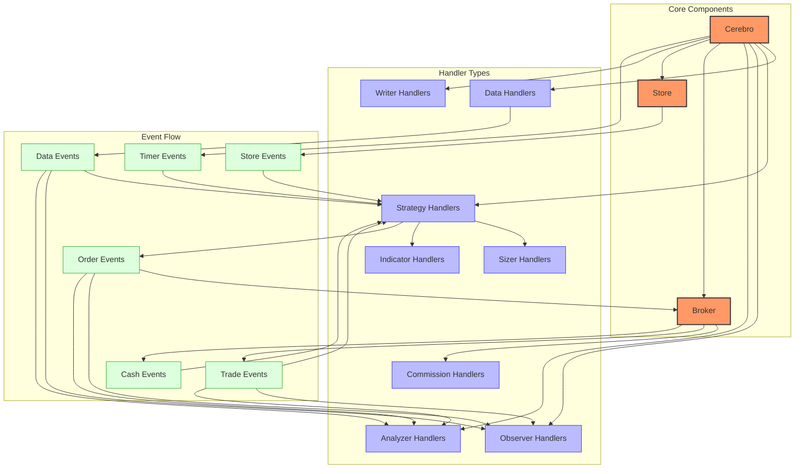
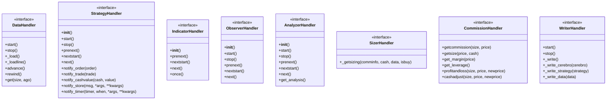
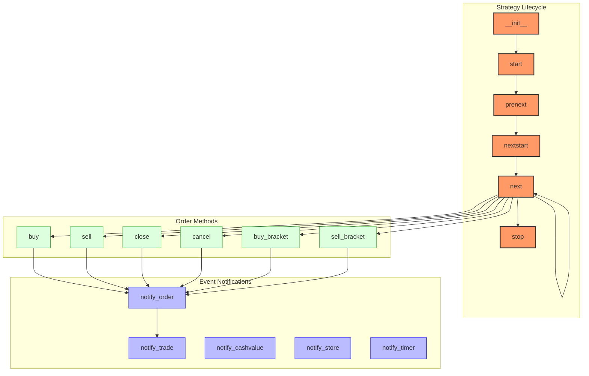
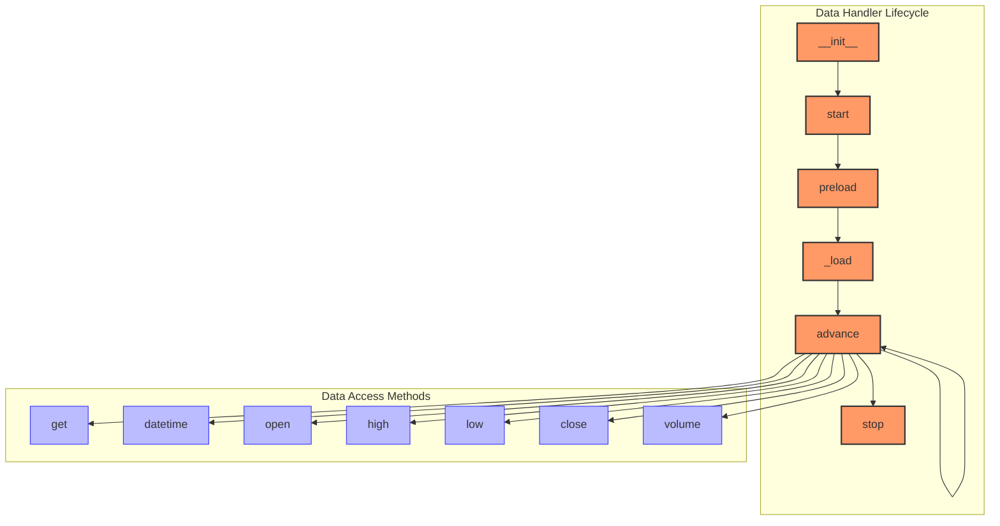
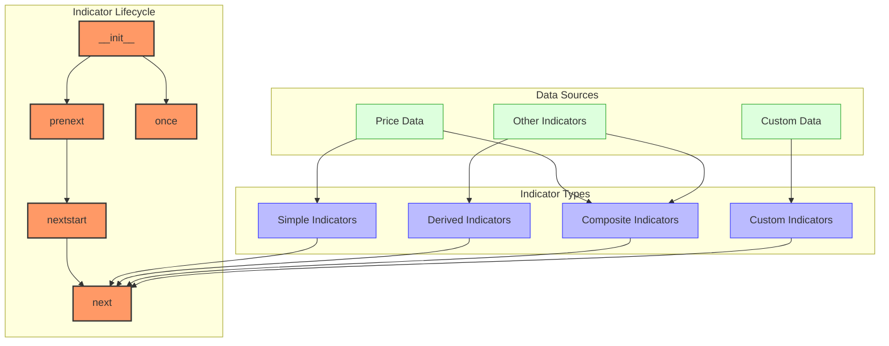
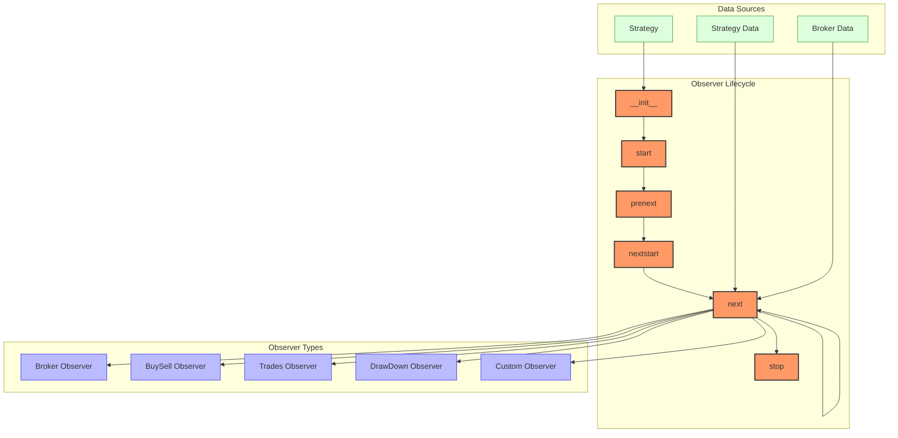
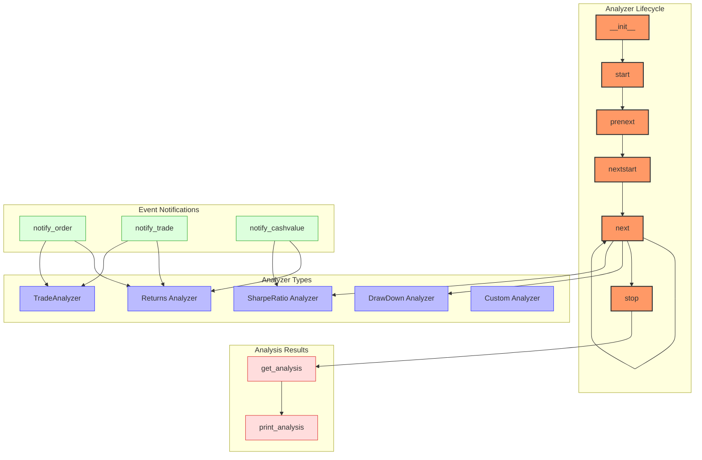
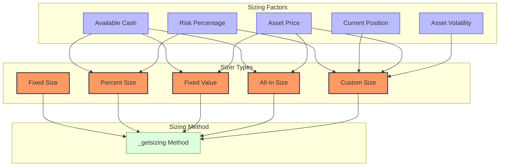

# Backtrader Handlers

## Handler Overview

Backtrader uses a handler-based architecture where different components handle specific types of events and data processing. This document details the handler interfaces, their responsibilities, and how they interact with the rest of the system.



### Handler Interfaces



## Strategy Handlers



### Strategy Interface

The `Strategy` class is the primary interface for implementing trading strategies in Backtrader:

```python
class Strategy(with_metaclass(MetaStrategy, StrategyBase)):
    """
    Base class to be subclassed for user defined strategies.
    """

    def __init__(self):
        """
        Initialize the strategy.
        """
        # Set up indicators and other components

    def start(self):
        """
        Called when the strategy is started.
        """
        # Perform any startup operations

    def prenext(self):
        """
        Called when not enough data bars are available for indicators.
        """
        # Handle the case when not enough data is available

    def nextstart(self):
        """
        Called when enough data bars are available for indicators (once).
        """
        # Handle the transition from prenext to next

    def next(self):
        """
        Called for each data bar when enough data is available.
        """
        # Implement main trading logic

    def stop(self):
        """
        Called when the strategy is stopped.
        """
        # Perform any cleanup operations

    def notify_order(self, order):
        """
        Called when an order status changes.
        """
        # Handle order notifications

    def notify_trade(self, trade):
        """
        Called when a trade is opened, updated, or closed.
        """
        # Handle trade notifications

    def notify_cashvalue(self, cash, value):
        """
        Called when cash or value changes.
        """
        # Handle cash/value notifications

    def notify_fund(self, cash, value, fundvalue, shares):
        """
        Called when fund mode values change.
        """
        # Handle fund notifications

    def notify_store(self, msg, *args, **kwargs):
        """
        Called when a store sends a notification.
        """
        # Handle store notifications

    def notify_data(self, data, status, *args, **kwargs):
        """
        Called when a data feed status changes.
        """
        # Handle data feed notifications
```

### Order Methods

Strategy handlers provide several methods for order management:

```python
# Basic order methods
def buy(self, data=None, size=None, price=None, plimit=None,
       exectype=None, valid=None, tradeid=0, **kwargs):
    """Create a buy order"""

def sell(self, data=None, size=None, price=None, plimit=None,
        exectype=None, valid=None, tradeid=0, **kwargs):
    """Create a sell order"""

def close(self, data=None, size=None, price=None, plimit=None,
         exectype=None, valid=None, tradeid=0, **kwargs):
    """Close a position"""

def cancel(self, order):
    """Cancel an order"""

# Bracket order methods
def buy_bracket(self, data=None, size=None, price=None,
              stopprice=None, limitprice=None, **kwargs):
    """Create a buy order with stop loss and take profit"""

def sell_bracket(self, data=None, size=None, price=None,
               stopprice=None, limitprice=None, **kwargs):
    """Create a sell order with stop loss and take profit"""
```

### Example Strategy Implementation

```python
class MyStrategy(bt.Strategy):
    # Define parameters with default values
    params = (
        ('fast_period', 10),
        ('slow_period', 30),
    )

    def __init__(self):
        # Initialize indicators
        self.fast_ma = bt.indicators.SMA(self.data, period=self.params.fast_period)
        self.slow_ma = bt.indicators.SMA(self.data, period=self.params.slow_period)
        self.crossover = bt.indicators.CrossOver(self.fast_ma, self.slow_ma)

    def next(self):
        # Main strategy logic
        if self.crossover > 0:  # Fast MA crosses above slow MA
            self.buy()
        elif self.crossover < 0:  # Fast MA crosses below slow MA
            self.sell()

    def notify_order(self, order):
        # Handle order status changes
        if order.status in [order.Completed]:
            if order.isbuy():
                self.log('BUY EXECUTED, %.2f' % order.executed.price)
            else:
                self.log('SELL EXECUTED, %.2f' % order.executed.price)

    def notify_trade(self, trade):
        # Handle trade status changes
        if trade.isclosed:
            self.log('TRADE PROFIT, GROSS %.2f, NET %.2f' %
                     (trade.pnl, trade.pnlcomm))

    def log(self, txt, dt=None):
        # Logging helper function
        dt = dt or self.datas[0].datetime.date(0)
        print(f'{dt.isoformat()} {txt}')
```

## Data Handlers



### Data Feed Interface

```python
class DataBase(LineSeries):
    """Base class for data feeds"""

    def __init__(self):
        """Initialize the data feed"""
        # Initialize data structures

    def start(self):
        """Start the data feed"""
        # Start data loading

    def preload(self):
        """Preload data if required"""
        # Preload data into memory

    def _load(self):
        """Load data from source"""
        # Load data from source

    def advance(self):
        """Advance to the next data point"""
        # Move to the next data point

    def stop(self):
        """Stop the data feed"""
        # Clean up resources

    def get(self, size, ago=0):
        """Get data values"""
        # Return data values
```

### Data Feed Examples

```python
# CSV Data Feed
data = bt.feeds.GenericCSVData(
    dataname='data.csv',
    datetime=0,
    open=1,
    high=2,
    low=3,
    close=4,
    volume=5,
    dtformat='%Y-%m-%d',
    fromdate=datetime(2020, 1, 1),
    todate=datetime(2021, 1, 1)
)

# Yahoo Finance Data Feed
data = bt.feeds.YahooFinanceData(
    dataname='AAPL',
    fromdate=datetime(2020, 1, 1),
    todate=datetime(2021, 1, 1)
)

# Pandas Data Feed
import pandas as pd

# Create a pandas DataFrame
df = pd.read_csv('data.csv', index_col=0, parse_dates=True)

# Create a data feed from the DataFrame
data = bt.feeds.PandasData(
    dataname=df,
    datetime=None,  # Use index as datetime
    open='Open',
    high='High',
    low='Low',
    close='Close',
    volume='Volume',
    openinterest=None
)

# Custom Data Feed
class MyDataFeed(bt.feeds.GenericCSVData):
    params = (
        ('datetime', 0),
        ('open', 1),
        ('high', 2),
        ('low', 3),
        ('close', 4),
        ('volume', 5),
        ('openinterest', -1),  # Not present
        ('dtformat', '%Y-%m-%d'),
    )

    def _load(self):
        # Custom loading logic
        super()._load()

        # Post-process loaded data
        for i in range(len(self)):
            if self.lines.close[i] <= 0:
                # Fix invalid prices
                self.lines.close[i] = self.lines.open[i]
```

## Indicator Handlers



### Indicator Interface

```python
class Indicator(LineSeries):
    """Base class for indicators"""

    def __init__(self):
        """Initialize the indicator"""
        # Initialize indicator parameters and lines

    def prenext(self):
        """Called when not enough data is available"""
        # Handle insufficient data

    def nextstart(self):
        """Called once when enough data is available"""
        # Initialize indicator with sufficient data
        # Default implementation calls next()
        self.next()

    def next(self):
        """Called for each new data point"""
        # Calculate indicator value for current data point

    def once(self):
        """Called when runonce=True for vectorized calculation"""
        # Calculate all indicator values at once
```

### Indicator Examples

```python
# Using built-in indicators
sma = bt.indicators.SMA(self.data, period=20)
rsi = bt.indicators.RSI(self.data, period=14)
bbands = bt.indicators.BollingerBands(self.data, period=20, devfactor=2)

# Creating a custom indicator
class MyCustomIndicator(bt.Indicator):
    lines = ('signal',)  # Define output lines
    params = (
        ('period', 20),  # Define parameters with default values
    )

    def __init__(self):
        # Initialize the indicator
        self.addminperiod(self.params.period)  # Set minimum required period

    def next(self):
        # Calculate the indicator value for the current bar
        self.lines.signal[0] = sum(self.data.close.get(size=self.params.period)) / self.params.period

    def once(self):
        # Vectorized calculation for all bars at once
        # Only called when runonce=True
        for i in range(self.params.period - 1, len(self.data)):
            self.lines.signal[i] = sum(self.data.close.array[i - self.params.period + 1:i + 1]) / self.params.period
```

## Observer Handlers



### Observer Interface

```python
class Observer(LineSeries):
    """Base class for observers"""

    def __init__(self):
        """Initialize the observer"""
        # Initialize observer parameters and lines

    def start(self):
        """Called when the observer is started"""
        # Initialize observer state

    def prenext(self):
        """Called when not enough data is available"""
        # Handle insufficient data

    def nextstart(self):
        """Called once when enough data is available"""
        # Initialize observer with sufficient data
        # Default implementation calls next()
        self.next()

    def next(self):
        """Called for each new data point"""
        # Update observer value for current data point

    def stop(self):
        """Called when the observer is stopped"""
        # Clean up resources
```

### Observer Examples

```python
# Add observers to Cerebro
cerebro = bt.Cerebro()

# Add standard observers
cerebro.addobserver(bt.observers.Broker)  # Cash and value
cerebro.addobserver(bt.observers.BuySell)  # Buy/sell arrows
cerebro.addobserver(bt.observers.Trades)  # Trades information
cerebro.addobserver(bt.observers.DrawDown)  # Drawdown

# Create a custom observer
class PositionObserver(bt.Observer):
    lines = ('size', 'price',)  # Define output lines

    def __init__(self):
        # Initialize the observer
        pass

    def next(self):
        # Update observer values for the current bar
        self.lines.size[0] = self._owner.position.size
        self.lines.price[0] = self._owner.position.price

# Add custom observer
cerebro.addobserver(PositionObserver)
```

## Analyzer Handlers



### Analyzer Interface

```python
class Analyzer(object):
    """Base class for analyzers"""

    def __init__(self):
        """Initialize the analyzer"""
        # Initialize analyzer parameters and data structures

    def start(self):
        """Called when the analyzer is started"""
        # Initialize analyzer state

    def prenext(self):
        """Called when not enough data is available"""
        # Handle insufficient data

    def nextstart(self):
        """Called once when enough data is available"""
        # Initialize analyzer with sufficient data
        # Default implementation calls next()
        self.next()

    def next(self):
        """Called for each new data point"""
        # Update analyzer for current data point

    def stop(self):
        """Called when the analyzer is stopped"""
        # Finalize analysis

    def notify_order(self, order):
        """Called when an order status changes"""
        # Process order information

    def notify_trade(self, trade):
        """Called when a trade status changes"""
        # Process trade information

    def notify_cashvalue(self, cash, value):
        """Called when cash or value changes"""
        # Process cash and value information

    def get_analysis(self):
        """Return analysis results"""
        # Return analysis results
```

### Analyzer Examples

```python
# Add analyzers to Cerebro
cerebro = bt.Cerebro()

# Add standard analyzers
cerebro.addanalyzer(bt.analyzers.SharpeRatio, _name='sharpe')
cerebro.addanalyzer(bt.analyzers.DrawDown, _name='drawdown')
cerebro.addanalyzer(bt.analyzers.TradeAnalyzer, _name='trades')
cerebro.addanalyzer(bt.analyzers.Returns, _name='returns')

# Run the backtest
results = cerebro.run()
strategy = results[0]

# Access analyzer results
sharpe = strategy.analyzers.sharpe.get_analysis()
drawdown = strategy.analyzers.drawdown.get_analysis()
trades = strategy.analyzers.trades.get_analysis()
returns = strategy.analyzers.returns.get_analysis()

# Print analyzer results
print(f"Sharpe Ratio: {sharpe['sharperatio']:.3f}")
print(f"Max Drawdown: {drawdown['max']['drawdown']:.2%}")
print(f"Total Trades: {trades['total']['total']}")
print(f"Win Rate: {trades['won']['total'] / trades['total']['total']:.2%}")

# Create a custom analyzer
class CustomAnalyzer(bt.Analyzer):
    params = (
        ('period', 20),  # Define parameters with default values
    )

    def start(self):
        # Initialize analyzer
        self.returns = []
        self.drawdowns = []
        self.max_drawdown = 0.0
        self.current_drawdown = 0.0
        self.peak_value = 0.0

    def next(self):
        # Calculate returns
        value = self.strategy.broker.getvalue()
        if len(self.returns) == 0:
            self.peak_value = value
            self.returns.append(0.0)
        else:
            prev_value = self.strategy.broker.getvalue() - self.strategy.broker.getcash()
            ret = (value - prev_value) / prev_value if prev_value > 0 else 0.0
            self.returns.append(ret)

        # Calculate drawdown
        if value > self.peak_value:
            self.peak_value = value
            self.current_drawdown = 0.0
        else:
            self.current_drawdown = (self.peak_value - value) / self.peak_value

        self.drawdowns.append(self.current_drawdown)
        self.max_drawdown = max(self.max_drawdown, self.current_drawdown)

    def stop(self):
        # Calculate final metrics
        self.rets = {
            'total': sum(self.returns),
            'average': sum(self.returns) / len(self.returns) if self.returns else 0.0,
            'std': np.std(self.returns) if len(self.returns) > 1 else 0.0
        }

        self.dd = {
            'max': self.max_drawdown,
            'average': sum(self.drawdowns) / len(self.drawdowns) if self.drawdowns else 0.0
        }

    def get_analysis(self):
        # Return analysis results
        return {
            'returns': self.rets,
            'drawdown': self.dd
        }
```

## Sizer Handlers



### Sizer Interface

```python
class Sizer(object):
    """Base class for sizers"""

    def _getsizing(self, comminfo, cash, data, isbuy):
        """Return the sizing for the given parameters"""
        # Calculate and return the position size
```

### Sizer Examples

```python
# Fixed size sizer
cerebro.addsizer(bt.sizers.FixedSize, stake=10)  # Always buy/sell 10 units

# Percent of cash sizer
cerebro.addsizer(bt.sizers.PercentSizer, percents=10)  # Use 10% of available cash

# Fixed value sizer
class FixedValueSizer(bt.Sizer):
    params = (
        ('value', 1000),  # Fixed value to use for positions
    )

    def _getsizing(self, comminfo, cash, data, isbuy):
        # Calculate size based on fixed value
        price = data.close[0]
        if price > 0:
            size = self.params.value / price
            # Round down to nearest integer
            return int(size)
        return 0

# Risk-based sizer
class RiskSizer(bt.Sizer):
    params = (
        ('risk_pct', 2.0),  # Risk percentage per trade (e.g., 2%)
        ('stop_pct', 5.0),   # Stop loss percentage (e.g., 5%)
    )

    def _getsizing(self, comminfo, cash, data, isbuy):
        # Calculate size based on risk
        price = data.close[0]
        risk_amount = cash * (self.params.risk_pct / 100.0)
        stop_amount = price * (self.params.stop_pct / 100.0)

        if stop_amount > 0:
            size = risk_amount / stop_amount
            # Round down to nearest integer
            return int(size)
        return 0
```

## Data Feed Handlers

### Data Feed Interface


The `DataBase` class is the base class for all data feeds:

```python
class DataBase(LineSeries):
    """Base class for data feeds"""

    def __init__(self):
        """Initialize the data feed"""
        # Initialize data structures

    def start(self):
        """Start the data feed"""
        # Start data loading

    def preload(self):
        """Preload data if required"""
        # Preload data into memory

    def _load(self):
        """Load data from source"""
        # Load data from source

    def advance(self):
        """Advance to the next data point"""
        # Move to the next data point

    def stop(self):
        """Stop the data feed"""
        # Clean up resources

    def _load(self):
        """
        Load data from the source.
        """
        # Load data from the source

    def _start(self):
        """
        Start the data feed (internal).
        """
        # Start the data feed

    def _stop(self):
        """
        Stop the data feed (internal).
        """
        # Stop the data feed

    def islive(self):
        """
        Return whether the data feed is live.
        """
        # Return True if the data feed is live

    def preload(self):
        """
        Preload data from the source.
        """
        # Preload data from the source
```

### Data Feed Implementation Example

```python
class MyCSVData(bt.feeds.CSVDataBase):
    params = (
        ('datetime', 0),
        ('open', 1),
        ('high', 2),
        ('low', 3),
        ('close', 4),
        ('volume', 5),
        ('openinterest', -1),
    )

    def _loadline(self, linetokens):
        # Parse the date/time
        dtfield = linetokens[self.p.datetime]
        dt = datetime.datetime.strptime(dtfield, '%Y-%m-%d')

        # Store the values
        self.lines.datetime[0] = self.date2num(dt)
        self.lines.open[0] = float(linetokens[self.p.open])
        self.lines.high[0] = float(linetokens[self.p.high])
        self.lines.low[0] = float(linetokens[self.p.low])
        self.lines.close[0] = float(linetokens[self.p.close])
        self.lines.volume[0] = float(linetokens[self.p.volume])

        # Return True to indicate successful parsing
        return True
```

## Indicator Handlers

### Indicator Interface

The `Indicator` class is the base class for all indicators:

```python
class Indicator(with_metaclass(MetaIndicator, LineSeries)):
    """
    Base class for all Indicators.
    """

    def __init__(self):
        """
        Initialize the indicator.
        """
        # Set up the indicator

    def prenext(self):
        """
        Called when not enough data bars are available.
        """
        # Handle the case when not enough data is available

    def nextstart(self):
        """
        Called when enough data bars are available (once).
        """
        # Handle the transition from prenext to next

    def next(self):
        """
        Called for each data bar when enough data is available.
        """
        # Calculate the indicator value
```

### Indicator Implementation Example

```python
class SimpleMovingAverage(bt.Indicator):
    lines = ('sma',)  # Define a line named 'sma'
    params = (('period', 20),)  # Define a parameter named 'period'

    def __init__(self):
        # Calculate the simple moving average
        self.lines.sma = bt.indicators.Average(self.data, period=self.p.period)

        # Define the minimum period
        self.addminperiod(self.p.period)
```

## Analyzer Handlers

### Analyzer Interface

The `Analyzer` class is the base class for all analyzers:

```python
class Analyzer(with_metaclass(MetaAnalyzer, object)):
    """
    Base class for all Analyzers.
    """

    def __init__(self):
        """
        Initialize the analyzer.
        """
        # Set up the analyzer

    def start(self):
        """
        Called when the analyzer is started.
        """
        # Perform any startup operations

    def stop(self):
        """
        Called when the analyzer is stopped.
        """
        # Perform any cleanup operations

    def prenext(self):
        """
        Called when not enough data bars are available.
        """
        # Handle the case when not enough data is available

    def nextstart(self):
        """
        Called when enough data bars are available (once).
        """
        # Handle the transition from prenext to next

    def next(self):
        """
        Called for each data bar when enough data is available.
        """
        # Update the analyzer

    def notify_order(self, order):
        """
        Called when an order status changes.
        """
        # Handle order notifications

    def notify_trade(self, trade):
        """
        Called when a trade is opened, updated, or closed.
        """
        # Handle trade notifications

    def notify_cashvalue(self, cash, value):
        """
        Called when cash or value changes.
        """
        # Handle cash/value notifications

    def notify_fund(self, cash, value, fundvalue, shares):
        """
        Called when fund mode values change.
        """
        # Handle fund notifications

    def get_analysis(self):
        """
        Return the analysis results.
        """
        # Return the analysis results
```

### Analyzer Implementation Example

```python
class SharpeRatio(bt.Analyzer):
    params = (
        ('timeframe', bt.TimeFrame.Years),
        ('compression', 1),
        ('riskfreerate', 0.0),
        ('annualize', True),
        ('factor', None),
    )

    def __init__(self):
        # Initialize variables
        self.returns = bt.analyzers.Returns(timeframe=self.p.timeframe,
                                           compression=self.p.compression)

    def start(self):
        # Reset variables
        self.rets = list()

    def next(self):
        # Collect returns
        ret = self.returns.get_analysis()['return']
        if ret is not None:
            self.rets.append(ret)

    def get_analysis(self):
        # Calculate Sharpe ratio
        if not self.rets:
            return {'sharperatio': None}

        # Calculate the average return and standard deviation
        retfree = [x - self.p.riskfreerate for x in self.rets]
        ret_avg = sum(retfree) / len(retfree)
        ret_std = math.sqrt(sum((x - ret_avg) ** 2 for x in retfree) / len(retfree))

        # Calculate the Sharpe ratio
        if ret_std > 0.0:
            sharpe = ret_avg / ret_std
        else:
            sharpe = float('inf')

        # Annualize if requested
        if self.p.annualize:
            factor = self.p.factor
            if factor is None:
                if self.p.timeframe == bt.TimeFrame.Days:
                    factor = 252.0
                elif self.p.timeframe == bt.TimeFrame.Weeks:
                    factor = 52.0
                elif self.p.timeframe == bt.TimeFrame.Months:
                    factor = 12.0
                elif self.p.timeframe == bt.TimeFrame.Years:
                    factor = 1.0
                else:
                    factor = 252.0  # Default to daily

            sharpe = sharpe * math.sqrt(factor)

        return {'sharperatio': sharpe}
```

## Observer Handlers

### Observer Interface

The `Observer` class is the base class for all observers:

```python
class Observer(with_metaclass(MetaObserver, LineSeries)):
    """
    Base class for all Observers.
    """

    def __init__(self):
        """
        Initialize the observer.
        """
        # Set up the observer

    def prenext(self):
        """
        Called when not enough data bars are available.
        """
        # Handle the case when not enough data is available

    def nextstart(self):
        """
        Called when enough data bars are available (once).
        """
        # Handle the transition from prenext to next

    def next(self):
        """
        Called for each data bar when enough data is available.
        """
        # Update the observer
```

### Observer Implementation Example

```python
class Cash(bt.Observer):
    lines = ('cash',)

    plotinfo = dict(plot=True, subplot=True)

    def next(self):
        self.lines.cash[0] = self._owner.broker.getcash()
```

## Sizer Handlers

### Sizer Interface

The `Sizer` class is the base class for all sizers:

```python
class Sizer(with_metaclass(MetaSizer, object)):
    """
    Base class for all Sizers.
    """

    def __init__(self):
        """
        Initialize the sizer.
        """
        # Set up the sizer

    def _getsizing(self, comminfo, cash, data, isbuy):
        """
        Return the sizing for the given parameters.
        """
        # Calculate the sizing
```

### Sizer Implementation Example

```python
class PercentSizer(bt.Sizer):
    params = (
        ('percents', 20),
    )

    def _getsizing(self, comminfo, cash, data, isbuy):
        position = self.broker.getposition(data)

        if not position:
            size = cash / data.close[0] * (self.p.percents / 100)
            return int(size)

        return 0  # No position change
```

## Input/Output Specifications

### Strategy Input

Strategies receive input from:

- **Data Feeds**: Price and volume data
- **Indicators**: Technical indicator values
- **Broker**: Account information (cash, value, positions)
- **Notifications**: Order and trade status updates

### Strategy Output

Strategies produce output in the form of:

- **Orders**: Buy, sell, and cancel orders
- **Logs**: Debug and information messages
- **Analyzer Data**: Performance metrics

### Data Feed Input

Data feeds receive input from:

- **External Sources**: CSV files, databases, APIs
- **Cerebro**: Configuration parameters

### Data Feed Output

Data feeds produce output in the form of:

- **OHLCV Data**: Open, high, low, close, volume data
- **Status Updates**: Connection status, data availability

## Error Handling Strategies

Backtrader implements several error handling strategies:

1. **Exception Handling**: Exceptions in handlers are caught and reported
2. **Validation**: Input data and parameters are validated
3. **Graceful Degradation**: The system attempts to continue operation when possible

### Error Handling Example

```python
def next(self):
    try:
        # Trading logic
        if self.fast_ma[0] > self.slow_ma[0]:
            self.buy()
    except Exception as e:
        self.log(f'Error in next: {e}')
```

## Performance Considerations

Backtrader's handlers are designed for flexibility and ease of use, with some performance optimizations:

1. **Vectorized Calculations**: Indicators can use vectorized calculations for speed
2. **Memory Saving Modes**: Various memory saving modes are available
3. **Preloading**: Data can be preloaded for faster processing

### Performance Optimization Example

```python
# Create a Cerebro entity with performance optimizations
cerebro = bt.Cerebro(runonce=True, preload=True, stdstats=False)

# Add a strategy
cerebro.addstrategy(MyStrategy)

# Run the backtest
cerebro.run()
```

## Edge Cases and Their Handling

Backtrader's handlers are designed to handle various edge cases:

1. **Missing Data**: Data feeds can handle missing data points
2. **Order Rejections**: Strategies can handle rejected orders
3. **Market Gaps**: Price gaps are handled correctly
4. **Dividend Adjustments**: Price adjustments for dividends can be handled

### Edge Case Handling Example

```python
def notify_order(self, order):
    if order.status in [order.Submitted, order.Accepted]:
        return

    if order.status == order.Rejected:
        self.log(f'Order rejected: {order.info.get("reject_reason", "")}')
    elif order.status == order.Margin:
        self.log('Order margin: insufficient funds')
    elif order.status == order.Cancelled:
        self.log('Order cancelled')
    elif order.status == order.Expired:
        self.log('Order expired')
    elif order.status == order.Completed:
        if order.isbuy():
            self.log(f'BUY EXECUTED, {order.executed.price:.2f}')
        else:
            self.log(f'SELL EXECUTED, {order.executed.price:.2f}')
```

These handlers form the core of Backtrader's event processing system, enabling efficient and robust backtesting and trading operations.
