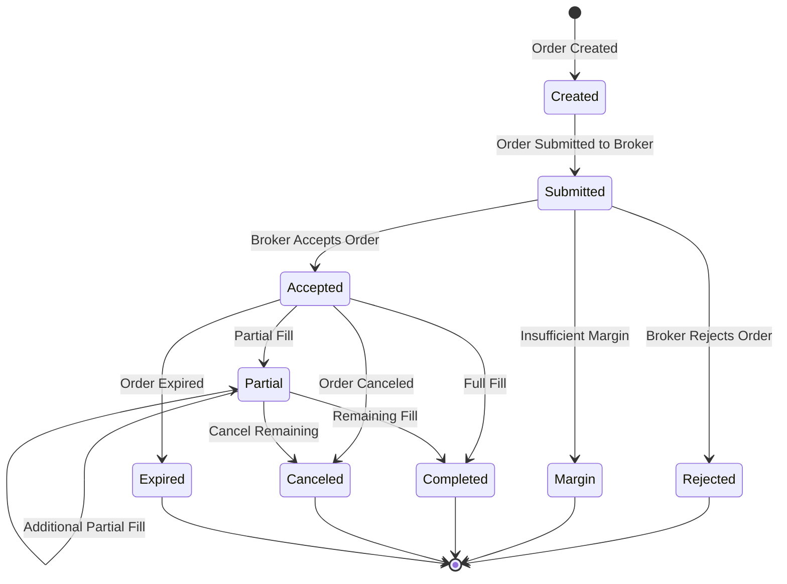
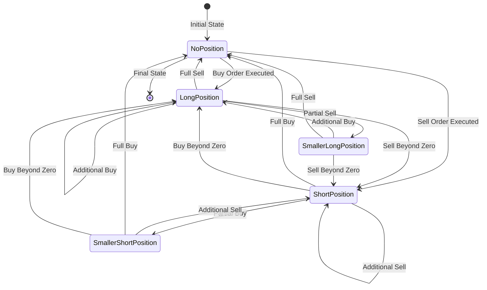
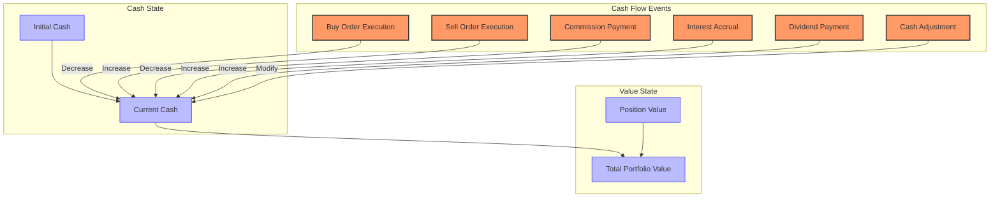
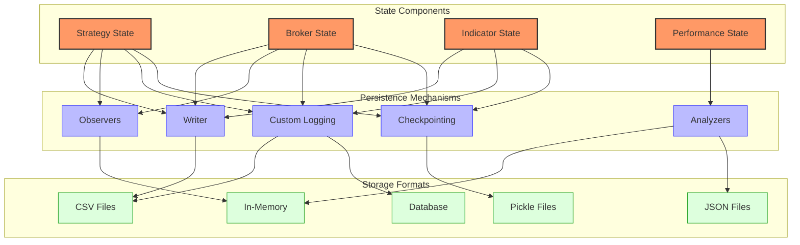
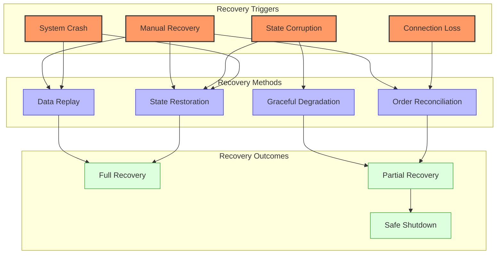
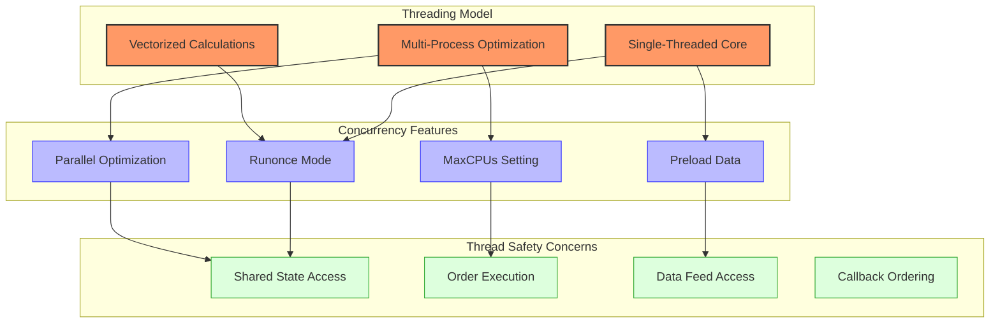

# Backtrader State Management

## State Model Overview

Backtrader implements a comprehensive state management system that maintains the current state of orders, positions, cash, and other critical components. The state model is designed to be consistent, accessible, and to accurately simulate real-world trading conditions.

```mermaid
graph TD
    subgraph "Core State Components"
        Cerebro[Cerebro]:::core
        Strategy[Strategy]:::core
        Broker[Broker]:::core
        DataFeeds[Data Feeds]:::core
    end

    subgraph "Strategy State"
        Indicators[Indicators]:::strategy
        Lines[Line Objects]:::strategy
        Params[Parameters]:::strategy
        StrategyVars[Strategy Variables]:::strategy
    end


    subgraph "Broker State"
        Cash[Cash]:::broker
        Value[Portfolio Value]:::broker
        Positions[Positions]:::broker
        Orders[Orders]:::broker
        Commission[Commission Schemes]:::broker
    end

    subgraph "Data State"
        OHLCV[OHLCV Data]:::data
        Metadata[Metadata]:::data
        DataParams[Data Parameters]:::data
        Buffers[Data Buffers]:::data
    end

    Cerebro --> Strategy
    Cerebro --> Broker
    Cerebro --> DataFeeds

    Strategy --> Indicators
    Strategy --> Lines
    Strategy --> Params
    Strategy --> StrategyVars

    Broker --> Cash
    Broker --> Value
    Broker --> Positions
    Broker --> Orders
    Broker --> Commission

    DataFeeds --> OHLCV
    DataFeeds --> Metadata
    DataFeeds --> DataParams
    DataFeeds --> Buffers

    classDef core fill:#f96,stroke:#333,stroke-width:2px;
    classDef strategy fill:#bbf,stroke:#33f,stroke-width:1px;
    classDef broker fill:#dfd,stroke:#3a3,stroke-width:1px;
    classDef data fill:#fdd,stroke:#d33,stroke-width:1px;

    class Cerebro,Strategy,Broker,DataFeeds core;
    class Indicators,Lines,Params,StrategyVars strategy;
    class Cash,Value,Positions,Orders,Commission broker;
    class OHLCV,Metadata,DataParams,Buffers data;
```



## Core State Components

### Cerebro State

The `Cerebro` class is the central component that maintains the global state of the backtesting system:

```python
class Cerebro:
    def __init__(self):
        self.brokers = list()
        self.datas = list()
        self.datasbyname = collections.OrderedDict()
        self.strats = list()
        self.observers = list()
        self.analyzers = list()
        self.indicators = list()
        self.sizers = dict()
        self.writers = list()
        self.storecbs = list()
        self.datacbs = list()
        self.signals = list()
        # Other state variables...
```

### Broker State

The `Broker` class maintains the state of cash, positions, and orders:

```python
class BackBroker(BrokerBase):
    def __init__(self):
        super(BackBroker, self).__init__()
        self.cash = 0.0
        self.positions = collections.defaultdict(Position)
        self.orders = list()
        self.pending = collections.deque()
        self.executed = dict()
        self.notifs = collections.deque()
        # Other state variables...
```

### Strategy State

The `Strategy` class maintains the state of the trading strategy, including indicators, orders, and trades:

```python
class Strategy(with_metaclass(MetaStrategy, StrategyBase)):
    def __init__(self):
        self.broker = None  # Set by cerebro
        self._orders = list()
        self._orderspending = list()
        self._trades = collections.defaultdict(AutoDictList)
        self._tradespending = list()
        self.stats = self.observers = ItemCollection()
        self.analyzers = ItemCollection()
        # Other state variables...
```

### Position State

The `Position` class tracks the current holdings for a specific asset:

```python
class Position(object):
    def __init__(self):
        self.size = 0
        self.price = 0.0
        self.closed = 0
        self.opened = 0
        self.adjbase = 0.0
        # Other state variables...
```

### Order State

The `Order` class represents a trading order with its current state:

```python
class Order(object):
    def __init__(self):
        self.status = Status.Created
        self.created = self.data.datetime[0]
        self.executed = OrderData()
        # Other state variables...
```

## State Transitions and Triggers

### Order State Transitions



Orders go through a well-defined lifecycle represented by the `Order.Status` enum:

```python
class Order:
    class Status(object):
        Created = 0  # order has been created
        Submitted = 1  # order has been submitted to the broker
        Accepted = 2  # order has been accepted by the broker
        Partial = 3  # order has been partially executed
        Completed = 4  # order has been fully executed
        Canceled = 5  # order has been canceled
        Expired = 6  # order has expired
        Margin = 7  # order has not been executed due to margin
        Rejected = 8  # order has been rejected
```

Transitions between these states are triggered by specific events:

1. **Strategy Actions**:
   - `buy()` / `sell()`: Create and submit new orders
   - `cancel()`: Request cancellation of an order
   - `Strategy.notify_order()`: Process order status changes

   ```python
   # Create and submit a buy order
   def next(self):
       if self.should_buy():
           self.buy(size=1)  # Creates order and submits to broker

   # Cancel an order
   def next(self):
       if self.should_cancel():
           self.cancel(self.pending_order)

   # Process order status changes
   def notify_order(self, order):
       if order.status == order.Completed:
           self.log(f"Order completed: {order.executed.price}")
   ```

2. **Broker Processing**:
   - Order validation and acceptance
   - Order execution based on market conditions
   - Order rejection due to validation failures

   ```python
   # Broker processing (simplified internal logic)
   def _process_order(self, order):
       # Validate order
       if not self._validate_order(order):
           order.status = order.Rejected
           return

       # Check margin
       if not self._check_margin(order):
           order.status = order.Margin
           return

       # Accept order
       order.status = order.Accepted

       # Check if order can be executed
       if self._can_execute(order):
           self._execute_order(order)
   ```

3. **Market Conditions**:
   - Price reaching limit/stop levels
   - Time-based conditions (Good-Till-Canceled, Day orders)
   - Volume conditions

   ```python
   # Market order execution (simplified internal logic)
   def _execute_market_order(self, order, price):
       # Execute at current market price
       order.execute(price, order.size)
       order.status = order.Completed

   # Limit order execution (simplified internal logic)
   def _check_limit_order(self, order, price):
       # Buy limit: execute when price <= limit price
       if order.isbuy() and price <= order.price:
           order.execute(price, order.size)
           order.status = order.Completed

       # Sell limit: execute when price >= limit price
       elif order.issell() and price >= order.price:
           order.execute(price, order.size)
           order.status = order.Completed
   ```

### Position State Transitions



Position state changes are triggered by order executions:

1. **New Position Creation**:
   - First buy order creates a long position
   - First sell order creates a short position

   ```python
   # Position creation (simplified internal logic)
   def _process_order_fill(self, order):
       position = self.positions[order.data]

       # Update position based on order
       if position.size == 0:  # No existing position
           # Create new position
           position.size = order.size if order.isbuy() else -order.size
           position.price = order.executed.price
   ```

2. **Position Modification**:
   - Additional buys increase a long position or decrease a short position
   - Additional sells increase a short position or decrease a long position

   ```python
   # Position modification (simplified internal logic)
   def _process_order_fill(self, order):
       position = self.positions[order.data]

       # Update existing position
       if position.size > 0:  # Long position
           if order.isbuy():
               # Increase long position
               new_size = position.size + order.executed.size
               new_price = (position.size * position.price +
                           order.executed.size * order.executed.price) / new_size
               position.size = new_size
               position.price = new_price
           else:
               # Decrease long position
               position.size -= order.executed.size
               # Position price remains unchanged when decreasing
       elif position.size < 0:  # Short position
           # Similar logic for short positions
   ```

3. **Position Reversal**:
   - Buy orders larger than a short position reverse to a long position
   - Sell orders larger than a long position reverse to a short position

   ```python
   # Position reversal (simplified internal logic)
   def _process_order_fill(self, order):
       position = self.positions[order.data]

       # Check for position reversal
       if position.size > 0 and order.issell() and order.executed.size > position.size:
           # Long to short reversal
           excess = order.executed.size - position.size
           position.size = -excess  # New short position
           position.price = order.executed.price  # New position price
       elif position.size < 0 and order.isbuy() and order.executed.size > abs(position.size):
           # Short to long reversal
           excess = order.executed.size - abs(position.size)
           position.size = excess  # New long position
           position.price = order.executed.price  # New position price
   ```

4. **Position Closure**:
   - Buy orders that exactly match a short position close it
   - Sell orders that exactly match a long position close it

   ```python
   # Position closure (simplified internal logic)
   def _process_order_fill(self, order):
       position = self.positions[order.data]

       # Check for position closure
       if position.size > 0 and order.issell() and order.executed.size == position.size:
           # Close long position
           pnl = (order.executed.price - position.price) * position.size
           position.size = 0
           position.price = 0
           self._realized_pnl += pnl
       elif position.size < 0 and order.isbuy() and order.executed.size == abs(position.size):
           # Close short position
           pnl = (position.price - order.executed.price) * abs(position.size)
           position.size = 0
           position.price = 0
           self._realized_pnl += pnl
   ```

### Cash and Value State



The broker's cash and portfolio value are updated based on various events:

1. **Order Executions**:
   - Cash decreases for buy orders
   - Cash increases for sell orders

   ```python
   # Cash update on order execution (simplified internal logic)
   def _process_order_fill(self, order):
       # Calculate order cost
       cost = order.executed.price * order.executed.size

       # Update cash based on order direction
       if order.isbuy():
           self.cash -= cost  # Decrease cash for buys
       else:
           self.cash += cost  # Increase cash for sells
   ```

2. **Commissions**:
   - Deducted from cash based on commission model
   - Different models: fixed, percentage, per-share, etc.

   ```python
   # Commission calculation and deduction (simplified internal logic)
   def _process_commission(self, order):
       # Calculate commission based on model
       commission = self.comminfo.getcommission(
           order.executed.size, order.executed.price)

       # Deduct commission from cash
       self.cash -= commission

       # Store commission in order for reporting
       order.executed.commission = commission
   ```

3. **Interest**:
   - Added to cash if enabled (e.g., for margin accounts)
   - Calculated based on cash balance and interest rate

   ```python
   # Interest calculation (simplified internal logic)
   def _process_interest(self):
       if self.interest > 0:  # If interest is enabled
           # Calculate interest based on cash balance
           interest_amount = self.cash * self.interest / 365.0  # Daily interest

           # Add interest to cash
           self.cash += interest_amount
   ```

4. **Dividend Payments**:
   - Added to cash when dividends are received
   - Based on position size and dividend amount

   ```python
   # Dividend processing (simplified internal logic)
   def _process_dividend(self, dividend_event):
       # Get position for the dividend-paying asset
       position = self.positions[dividend_event.data]

       # Calculate dividend amount based on position size
       if position.size > 0:  # Only long positions receive dividends
           dividend_amount = position.size * dividend_event.amount

           # Add dividend to cash
           self.cash += dividend_amount
   ```

5. **Portfolio Value Calculation**:
   - Combines cash and current position values
   - Updated on each price change and cash flow event

   ```python
   # Portfolio value calculation (simplified internal logic)
   def get_value(self):
       # Start with cash
       value = self.cash

       # Add value of all positions
       for data, position in self.positions.items():
           if position.size != 0:  # If position exists
               # Current market price of the asset
               price = data.close[0]

               # Add position value to total
               value += position.size * price

       return value
   ```

## Persistence Mechanisms



Backtrader provides several mechanisms for persisting state:

1. **Cerebro Pickling**: The entire Cerebro instance can be pickled for later restoration
2. **Writer Component**: State can be logged to CSV files
3. **Observers**: State can be recorded for later analysis
4. **Analyzers**: Performance metrics can be stored and retrieved
5. **Custom Persistence**: Users can implement custom persistence by accessing state variables

### Writer Component

The Writer component can be used to log state to CSV files:

```python
from backtrader.writer import WriterFile

# Create a Cerebro entity
cerebro = bt.Cerebro()

# Add a writer with CSV output
cerebro.addwriter(WriterFile, csv=True, out='backtest_state.csv')

# Run the backtest
cerebro.run()
```

The Writer logs various state information:
- Data feed values (OHLCV)
- Indicator values
- Strategy positions
- Broker cash and value

You can customize the Writer to log specific information:

```python
# Custom Writer class
class MyWriter(bt.WriterFile):
    def _write_strategy(self, strategy):
        # Custom strategy writing logic
        dt = strategy.datetime.date(0).isoformat()
        close = strategy.data.close[0]
        position = strategy.position.size
        cash = strategy.broker.getcash()
        value = strategy.broker.getvalue()

        # Write to file
        self.writer.writerow([dt, close, position, cash, value])

# Add custom writer
cerebro.addwriter(MyWriter, out='custom_log.csv')
```

### Observers and Analyzers

Observers and Analyzers provide additional ways to persist state:

```python
# Add observers to Cerebro
cerebro = bt.Cerebro()

# Add standard observers
cerebro.addobserver(bt.observers.Broker)  # Cash and value
cerebro.addobserver(bt.observers.BuySell)  # Buy/sell arrows
cerebro.addobserver(bt.observers.Trades)  # Trades information
cerebro.addobserver(bt.observers.DrawDown)  # Drawdown

# Add standard analyzers
cerebro.addanalyzer(bt.analyzers.SharpeRatio, _name='sharpe')
cerebro.addanalyzer(bt.analyzers.DrawDown, _name='drawdown')
cerebro.addanalyzer(bt.analyzers.TradeAnalyzer, _name='trades')
cerebro.addanalyzer(bt.analyzers.Returns, _name='returns')

# Run the backtest
results = cerebro.run()
strategy = results[0]

# Access analyzer results
sharpe = strategy.analyzers.sharpe.get_analysis()
drawdown = strategy.analyzers.drawdown.get_analysis()
trades = strategy.analyzers.trades.get_analysis()
returns = strategy.analyzers.returns.get_analysis()

# Save analyzer results to JSON
import json

with open('analyzer_results.json', 'w') as f:
    json.dump({
        'sharpe': sharpe,
        'drawdown': drawdown,
        'trades': trades,
        'returns': returns
    }, f, default=str)  # default=str handles non-serializable objects
```

### Custom Persistence

You can implement custom persistence by accessing state variables directly:

```python
# Custom persistence in a strategy
class PersistentStrategy(bt.Strategy):
    def __init__(self):
        self.log_file = open('strategy_log.csv', 'w')
        self.log_file.write('Date,Close,SMA,Position,Cash,Value\n')

    def next(self):
        # Log state information
        self.log_file.write(f'{self.datetime.date(0)},{self.data.close[0]:.2f},{self.sma[0]:.2f},{self.position.size},{self.broker.getcash():.2f},{self.broker.getvalue():.2f}\n')

    def stop(self):
        # Close log file
        self.log_file.close()
```

## Recovery Procedures



Backtrader implements several recovery procedures:

1. **Checkpoint Recovery**: Restore state from a pickled Cerebro instance
2. **Data Replay**: Replay data from a specific point in time
3. **Order History**: Reconstruct order history from saved data
4. **Graceful Degradation**: Handle partial recovery when full recovery is not possible

### Checkpoint Example

```python
import pickle

# Save Cerebro state
def save_checkpoint(cerebro, filename='cerebro.pickle'):
    with open(filename, 'wb') as f:
        pickle.dump(cerebro, f)
    print(f"Checkpoint saved to {filename}")

# Restore Cerebro state
def load_checkpoint(filename='cerebro.pickle'):
    with open(filename, 'rb') as f:
        cerebro = pickle.load(f)
    print(f"Checkpoint loaded from {filename}")
    return cerebro

# Example usage in a strategy
class CheckpointStrategy(bt.Strategy):
    params = (
        ('checkpoint_interval', 20),  # Save checkpoint every 20 bars
    )

    def __init__(self):
        self.count = 0

    def next(self):
        self.count += 1

        # Save checkpoint at regular intervals
        if self.count % self.params.checkpoint_interval == 0:
            # Create a custom checkpoint with strategy-specific data
            checkpoint = {
                'datetime': self.datetime.date(0),
                'count': self.count,
                'position': {
                    'size': self.position.size,
                    'price': self.position.price
                },
                'broker': {
                    'cash': self.broker.getcash(),
                    'value': self.broker.getvalue()
                },
                'indicators': {
                    # Store indicator values
                    'sma': [self.sma[i] for i in range(-5, 1)]
                }
            }

            # Save checkpoint to file
            with open(f'checkpoint_{self.count}.pkl', 'wb') as f:
                pickle.dump(checkpoint, f)
```

### Data Replay Example

```python
# Replay data from a specific point
def replay_from_checkpoint(checkpoint_file, data_file):
    # Load checkpoint
    with open(checkpoint_file, 'rb') as f:
        checkpoint = pickle.load(f)

    # Create new Cerebro instance
    cerebro = bt.Cerebro()

    # Add strategy with restored state
    cerebro.addstrategy(
        CheckpointStrategy,
        _restore_checkpoint=checkpoint  # Pass checkpoint to strategy
    )

    # Add data feed starting from checkpoint date
    data = bt.feeds.YahooFinanceCSVData(
        dataname=data_file,
        fromdate=checkpoint['datetime'],  # Start from checkpoint date
    )
    cerebro.adddata(data)

    # Set broker cash to match checkpoint
    cerebro.broker.set_cash(checkpoint['broker']['cash'])

    # Run the backtest from checkpoint
    cerebro.run()
```

### Order History Example

```python
# Reconstruct order history
def reconstruct_order_history(order_log_file):
    # Load order log
    import pandas as pd
    orders_df = pd.read_csv(order_log_file)

    # Create a dictionary of orders
    orders = {}
    for _, row in orders_df.iterrows():
        order_id = row['order_id']
        orders[order_id] = {
            'datetime': pd.to_datetime(row['datetime']),
            'type': row['type'],
            'side': row['side'],
            'size': row['size'],
            'price': row['price'],
            'status': row['status']
        }

    return orders
```

## Thread Safety and Concurrency Considerations



Backtrader is primarily designed for single-threaded operation, but provides some support for concurrency:

1. **Multiprocessing for Optimization**: Cerebro can use multiple processes for optimization
2. **Thread-Safe Data Access**: Data access is designed to be thread-safe
3. **Synchronization**: When using live trading, synchronization mechanisms ensure data consistency
4. **Vectorized Calculations**: The `runonce` mode enables vectorized indicator calculations

### Multiprocessing Example

```python
# Create a Cerebro entity
cerebro = bt.Cerebro(maxcpus=4)  # Use 4 CPU cores for optimization

# Add a strategy with parameters to optimize
cerebro.optstrategy(
    MyStrategy,
    fast_period=range(5, 21, 5),  # 5, 10, 15, 20
    slow_period=range(20, 61, 10)  # 20, 30, 40, 50, 60
)

# Run optimization
results = cerebro.run()

# Process results
for i, strategy in enumerate(results):
    params = strategy[0].params
    sharpe = strategy[0].analyzers.sharpe.get_analysis()['sharperatio']
    returns = strategy[0].analyzers.returns.get_analysis()['rtot']

    print(f"Strategy {i+1}:")
    print(f"  Fast Period: {params.fast_period}")
    print(f"  Slow Period: {params.slow_period}")
    print(f"  Sharpe Ratio: {sharpe:.3f}")
    print(f"  Total Return: {returns:.2%}")
```

### Runonce Mode Example

```python
# Create a Cerebro entity with runonce mode
cerebro = bt.Cerebro(runonce=True)

# Add data and strategy
cerebro.adddata(data)
cerebro.addstrategy(MyStrategy)

# Run the backtest
cerebro.run()
```

### Thread Safety Considerations

When working with Backtrader in multi-threaded or multi-process environments:

1. **Shared State Access**: Be careful with shared state
   ```python
   # Avoid shared state between processes
   # Instead, pass parameters to each process
   def optimize_strategy(params):
       cerebro = bt.Cerebro()
       cerebro.addstrategy(MyStrategy, **params)
       # ...
       return cerebro.run()
   ```

2. **Order Execution**: Order execution is not thread-safe
   ```python
   # Don't submit orders from multiple threads
   # Instead, use a single thread for order submission
   def submit_order(cerebro, order_params):
       # Ensure this runs in a single thread
       with order_lock:
           cerebro.broker.submit_order(**order_params)
   ```

3. **Data Feed Access**: Data feeds are not thread-safe
   ```python
   # Don't access data feeds from multiple threads
   # Instead, clone data feeds for each thread
   def clone_data_for_thread(data):
       return data.clone()
   ```

## Lines Objects and Memory Management

Backtrader uses a unique "lines" architecture for managing time series data:

1. **Lines Objects**: Time series data is stored in "lines" objects
2. **Memory Saving Modes**: Several memory saving modes are available
3. **Indexing**: Special indexing rules apply to lines objects

### Lines Objects

Lines objects are the fundamental data structure in Backtrader:

```python
class MyIndicator(bt.Indicator):
    lines = ('signal',)  # Define a line named 'signal'

    def __init__(self):
        self.lines.signal = self.data.close > self.data.open  # Assign values to the line
```

### Memory Saving Modes

Backtrader provides several memory saving modes:

```python
# Create a Cerebro entity
cerebro = bt.Cerebro()

# Set memory saving mode
cerebro.run(stdstats=False, exactbars=1)
```

Memory saving modes:
- `exactbars=1`: Keep only the minimum number of bars needed
- `preload=False`: Don't preload data, load it on demand
- `runonce=False`: Don't use vectorized calculations

## State Inspection and Debugging

Backtrader provides several ways to inspect the state of the system:

1. **Observers**: Visual representation of state in plots
2. **Analyzers**: Calculation and storage of performance metrics
3. **Strategy Methods**: Direct access to state variables in strategy code

### Observers Example

```python
# Create a Cerebro entity
cerebro = bt.Cerebro()

# Add observers
cerebro.addobserver(bt.observers.Broker)  # Plot cash and value
cerebro.addobserver(bt.observers.BuySell)  # Plot buy/sell points
cerebro.addobserver(bt.observers.Trades)  # Plot trades

# Run and plot
cerebro.run()
cerebro.plot()
```

### Analyzers Example

```python
# Create a Cerebro entity
cerebro = bt.Cerebro()

# Add analyzers
cerebro.addanalyzer(bt.analyzers.SharpeRatio, _name='sharpe')
cerebro.addanalyzer(bt.analyzers.DrawDown, _name='drawdown')
cerebro.addanalyzer(bt.analyzers.TradeAnalyzer, _name='trades')

# Run and access results
results = cerebro.run()
strategy = results[0]
sharpe = strategy.analyzers.sharpe.get_analysis()
drawdown = strategy.analyzers.drawdown.get_analysis()
trades = strategy.analyzers.trades.get_analysis()

print(f"Sharpe Ratio: {sharpe['sharperatio']:.3f}")
print(f"Max Drawdown: {drawdown['max']['drawdown']:.2%}")
print(f"Total Trades: {trades['total']['total']}")
```

These state management features make Backtrader a powerful tool for developing and testing trading strategies.
