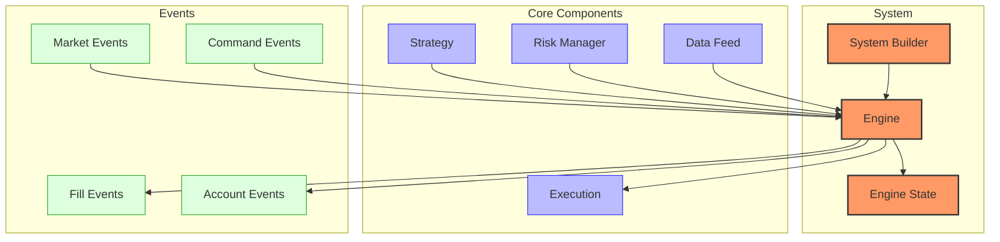
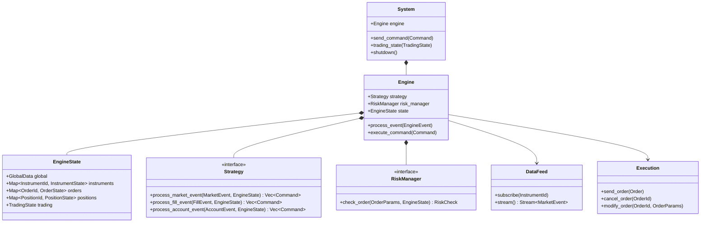
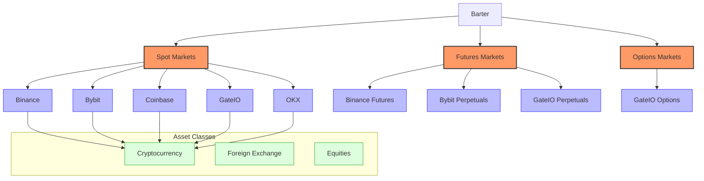
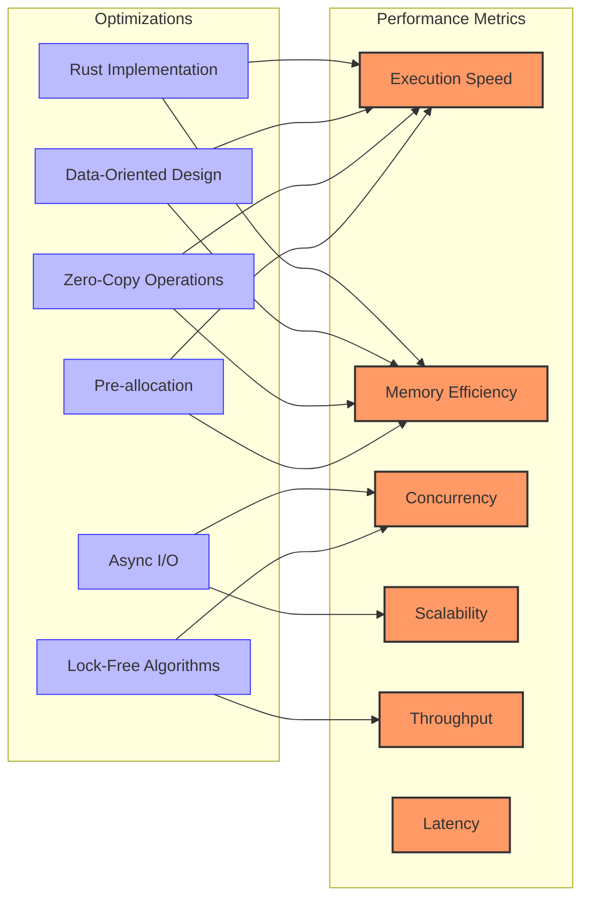
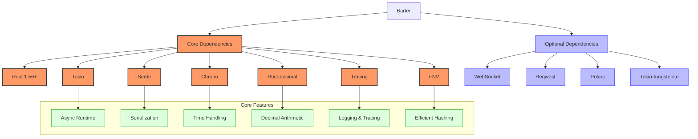
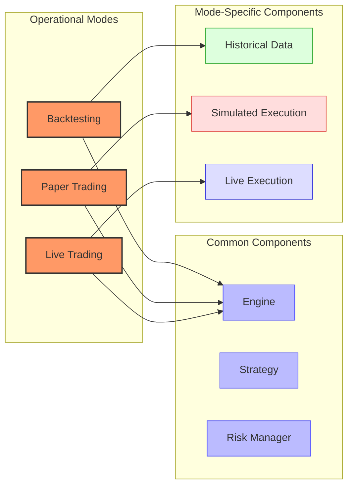

# Barter Trading System

## Overview

Barter is a Rust framework for building high-performance live-trading, paper-trading, and back-testing systems. It is designed with a focus on speed, robustness, and scalability, making it ideal for high-frequency trading and low-latency applications.

## Architecture



Barter's architecture consists of several key components:

1. **SystemBuilder** - For constructing and initializing a full trading `System`
2. **Engine** - The central processor with plug-and-play `Strategy` and `RiskManager` components
3. **EngineState** - Centralized cache-friendly state management with O(1) constant lookups
4. **Strategy** - Interfaces for customizing Engine behavior
5. **RiskManager** - Interface for defining custom risk logic
6. **Event-driven system** - Allows for Commands to be issued from external processes
7. **Statistics package** - Provides summary of key performance metrics

## Key Components and Relationships



### System

The `System` is the top-level component that coordinates all aspects of the trading system. It provides methods for:

- **Sending commands**: Allows external components to send commands to the Engine
- **Managing trading state**: Controls the overall trading state (Active, Halted, Reducing)
- **Shutting down gracefully**: Ensures all components are properly terminated
- **Initialization**: Sets up all components and establishes connections

### Engine

The `Engine` is the core processor that:

- **Processes market data events**: Handles incoming market data and updates state
- **Executes trading strategies**: Invokes strategy methods to generate trading signals
- **Manages risk**: Validates orders through the risk manager
- **Maintains system state**: Updates and manages the EngineState
- **Handles commands**: Processes command events from external sources
- **Coordinates execution**: Sends orders to execution components

### EngineState

The `EngineState` is a centralized state container that:

- **Stores global data**: Maintains data shared across all instruments
- **Tracks instruments**: Stores instrument-specific data and market information
- **Manages orders**: Tracks all orders and their current status
- **Tracks positions**: Maintains position information and performance metrics
- **Stores trading state**: Tracks the current trading state of the system

### Strategy

Strategies in Barter implement the `Strategy` trait, which defines methods for:

- **Processing market data**: Analyzes market data to generate trading signals
- **Handling fill events**: Responds to order fills and updates strategy state
- **Managing account events**: Processes account updates and adjusts strategy accordingly
- **Generating commands**: Creates commands for order placement, cancellation, etc.

### RiskManager

The `RiskManager` component validates orders before they are sent to exchanges, implementing checks such as:

- **Position size limits**: Ensures positions don't exceed maximum size
- **Order frequency limits**: Prevents excessive order submission
- **Drawdown protection**: Limits trading during drawdowns
- **Exposure limits**: Controls exposure to specific instruments or markets
- **Custom risk rules**: Allows implementation of custom risk management logic

## Supported Markets and Instruments

Barter supports a wide range of markets and instruments through its integration with various exchanges:



### Supported Exchanges

- **Spot Markets**:
  - Binance: Full API support for spot trading
  - Bybit: Comprehensive spot market integration
  - Coinbase: Advanced API integration with websocket support
  - GateIO: Complete spot market functionality
  - OKX: Full spot trading capabilities

- **Futures Markets**:
  - Binance Futures: USDT and coin-margined futures
  - Bybit Perpetuals: USDT and inverse perpetual contracts
  - GateIO Perpetuals: USDT-margined perpetual contracts

- **Options Markets**:
  - GateIO Options: European-style cryptocurrency options

### Instrument Types

- **Cryptocurrency**: BTC, ETH, and other major and minor cryptocurrencies
- **Foreign Exchange**: Through custom integrations
- **Equities**: Through custom integrations

### Custom Instruments

Barter's flexible architecture allows for the creation of custom instruments and markets through its extensible adapter system.

## Performance Characteristics



### Key Performance Features

- **Execution Speed**: Microsecond-level response times due to Rust's zero-cost abstractions and minimal runtime overhead
- **Memory Efficiency**: Minimal allocations with data-oriented design optimized for cache locality
- **Concurrency**: Thread-safe architecture leveraging Tokio for efficient async I/O with minimal blocking
- **Scalability**: Can handle multiple exchanges and instruments simultaneously with linear scaling
- **Throughput**: High message processing capacity with batch operations for optimal performance
- **Latency**: Consistently low latency with minimal jitter due to careful memory management

### Performance Optimizations

- **Rust Implementation**: Compiled to native code with no garbage collection or runtime overhead
- **Data-Oriented Design**: State organized for optimal cache utilization and minimal pointer chasing
- **Zero-Copy Operations**: Minimizes data copying between components for maximum efficiency
- **Asynchronous I/O**: Non-blocking I/O operations for optimal resource utilization
- **Pre-allocation**: Strategic memory pre-allocation to avoid runtime allocations in critical paths
- **Lock-Free Algorithms**: Minimizes contention in concurrent scenarios for better scaling

## Dependencies and Requirements



### Core Dependencies

- **Rust 1.56 or higher**: Required for the Rust 2021 edition features
- **Tokio**: Asynchronous runtime for non-blocking I/O operations
- **Serde**: Fast, efficient serialization and deserialization
- **Chrono**: Comprehensive date and time handling
- **Rust-decimal**: Precise decimal arithmetic for financial calculations
- **Tracing**: Structured, contextual logging and diagnostics
- **FNV**: Fast, non-cryptographic hash function for efficient hashmaps

### Optional Dependencies

- **WebSocket**: For real-time market data streaming
- **Reqwest**: HTTP client for REST API interactions
- **Polars**: Fast, memory-efficient DataFrame library for data analysis
- **Tokio-tungstenite**: WebSocket implementation for Tokio
- **Plotters**: For visualization of backtest results

### System Requirements

- **Memory**: Minimal footprint, typically <100MB for most applications
- **CPU**: Benefits from multi-core processors for parallel processing
- **Disk**: Minimal requirements, primarily for data storage
- **Network**: Low-latency connection recommended for live trading

## Operational Modes

Barter operates in three distinct modes, each with specific use cases and capabilities:



### Backtesting

The backtesting mode allows you to test strategies on historical data with high fidelity:
- Processes historical market data in event-driven fashion
- Simulates order execution with configurable models
- Provides comprehensive performance analytics
- Supports optimization of strategy parameters

### Paper Trading

The paper trading mode provides a real-time simulation with live market data:
- Uses real-time data feeds but simulated execution
- Allows testing of strategies in real market conditions without financial risk
- Maintains the same code path as live trading for accurate behavior

### Live Trading

The live trading mode connects to real exchanges for actual trading:
- Supports multiple exchanges through a unified API
- Provides robust error handling and recovery mechanisms
- Includes configurable risk controls and circuit breakers
- Offers advanced order management and execution capabilities

## Quick Start Guide

### Installation

Add Barter to your Cargo.toml:

```toml
[dependencies]
barter = "0.8.0"
barter-data = "0.5.0"  # For market data handling
barter-execution = "0.4.0"  # For order execution
```

### Backtesting Example

```rust
use barter::{
    engine::{
        Engine, EngineConfig, EngineEvent,
        clock::SimulatedClock,
        state::{EngineState, trading::TradingState},
    },
    strategy::MyStrategy,
    risk::DefaultRiskManager,
    system::{
        builder::{SystemArgs, SystemBuilder},
        config::SystemConfig,
    },
    data::historical::HistoricalDataFeed,
    execution::simulated::SimulatedExecution,
};

#[tokio::main]
async fn main() -> Result<(), Box<dyn std::error::Error>> {
    // 1. Load historical data
    let data_feed = HistoricalDataFeed::new("path/to/data.csv");

    // 2. Create system builder with backtest components
    let system_builder = SystemBuilder::new(SystemArgs {
        instruments: &instruments,
        executions: vec![SimulatedExecution::new()],
        clock: SimulatedClock::new(),
        strategy: MyStrategy::new(),
        risk: DefaultRiskManager::new(),
        market_stream: data_feed,
        global_data: GlobalData::default(),
        instrument_data_init: || InstrumentDataState::default(),
    });

    // 3. Build and initialize the system
    let mut system = system_builder
        .trading_state(TradingState::Active)
        .build()?
        .init()
        .await?;

    // 4. Run the backtest
    let results = system.run().await?;

    // 5. Analyze results
    println!("Backtest Results: {:?}", results.metrics);

    Ok(())
}
```

### Live Trading Example

```rust
use barter::{
    engine::{
        Engine, EngineConfig, EngineEvent,
        clock::LiveClock,
        state::{EngineState, trading::TradingState},
    },
    strategy::MyStrategy,
    risk::DefaultRiskManager,
    system::{
        builder::{SystemArgs, SystemBuilder},
        config::SystemConfig,
    },
    data::exchange::ExchangeDataFeed,
    execution::exchange::ExchangeExecution,
};

#[tokio::main]
async fn main() -> Result<(), Box<dyn std::error::Error>> {
    // 1. Create exchange connections
    let data_feed = ExchangeDataFeed::new("binance", "BTC-USDT", "api_key", "api_secret");
    let execution = ExchangeExecution::new("binance", "api_key", "api_secret");

    // 2. Create system builder with live components
    let system_builder = SystemBuilder::new(SystemArgs {
        instruments: &instruments,
        executions: vec![execution],
        clock: LiveClock::new(),
        strategy: MyStrategy::new(),
        risk: DefaultRiskManager::new(),
        market_stream: data_feed,
        global_data: GlobalData::default(),
        instrument_data_init: || InstrumentDataState::default(),
    });

    // 3. Build and initialize the system
    let mut system = system_builder
        .trading_state(TradingState::Active)
        .build()?
        .init()
        .await?;

    // 4. Run the live trading system
    system.run().await?;

    Ok(())
}
```

For more detailed examples, see the [event-flow.md](./event-flow.md), [state-management.md](./state-management.md), and [handlers.md](./handlers.md) documentation.
