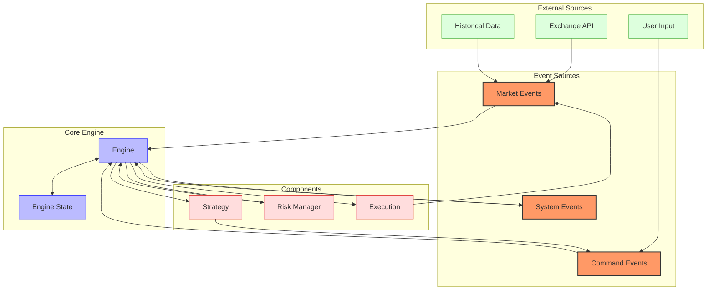
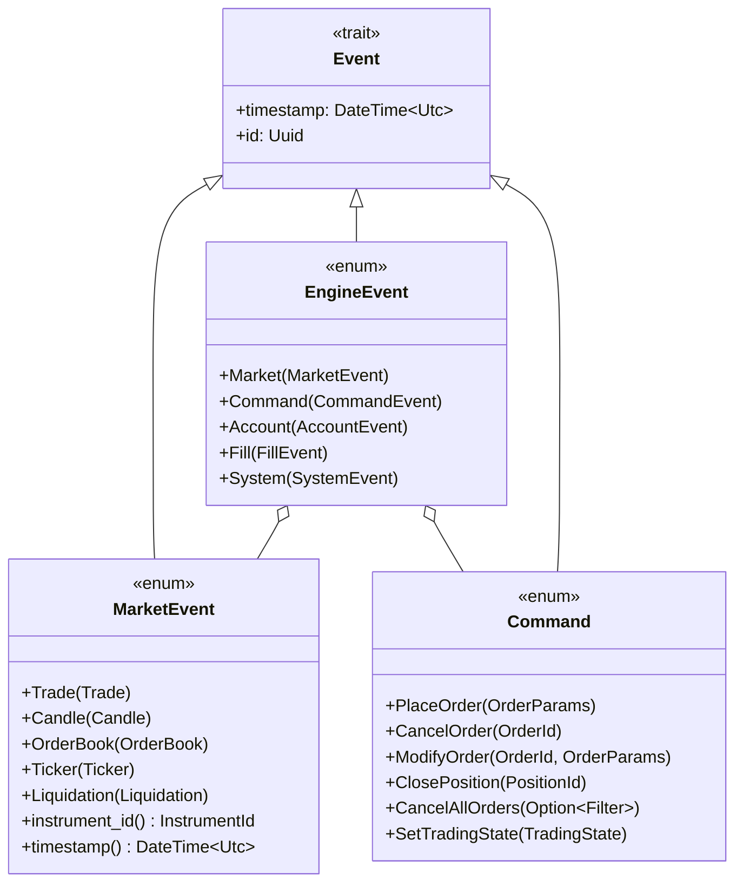
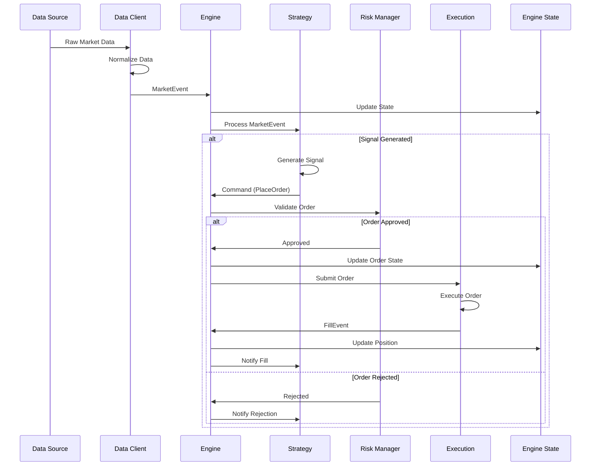
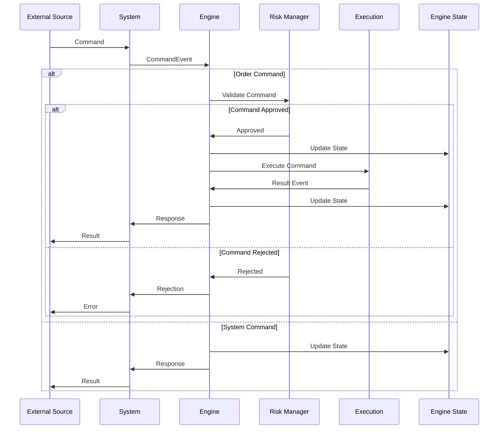
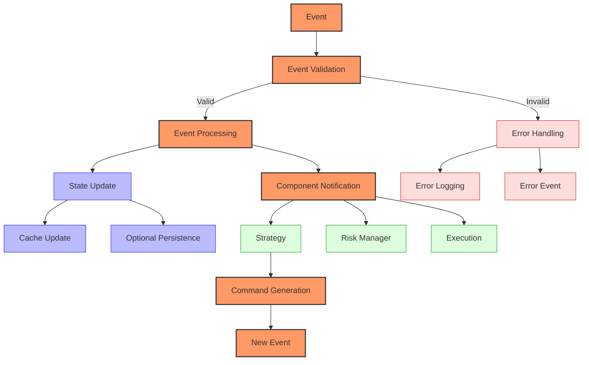
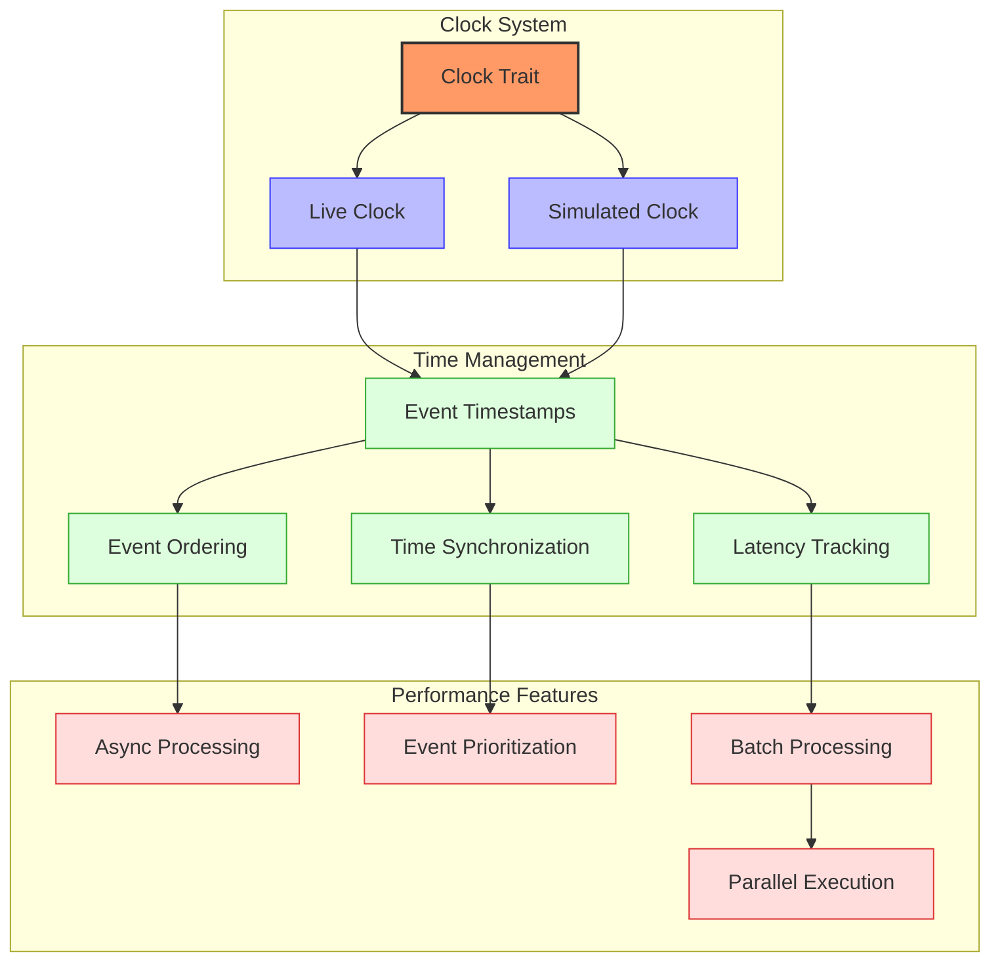
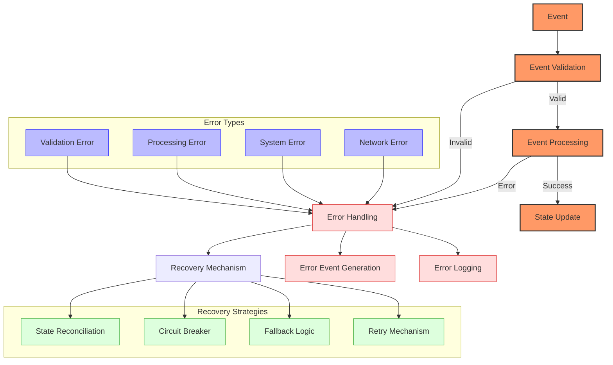
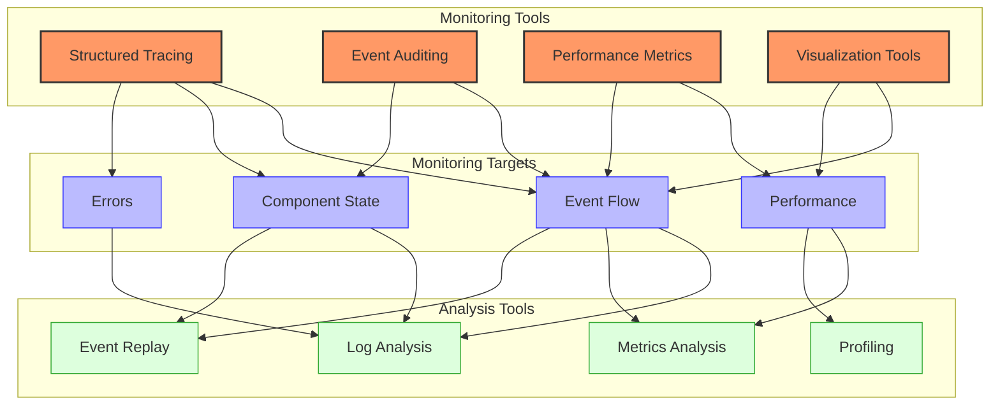

# Barter Event Flow

## Event Flow Overview

Barter uses an event-driven architecture where various events flow through the system, triggering responses from different components. This document details the event types, their flow through the system, and how they are processed.



The event flow in Barter is designed to be highly efficient and deterministic, with events flowing through the system in a well-defined sequence. The Engine acts as the central coordinator, processing events and updating state accordingly.

## Event Types



### Market Data Events

Market data events represent updates from exchanges and include:

- **Trade**: Individual trade executions on an exchange
  ```rust
  pub struct Trade {
      pub instrument_id: InstrumentId,
      pub id: String,
      pub price: Decimal,
      pub quantity: Decimal,
      pub side: Side,
      pub timestamp: DateTime<Utc>,
  }
  ```

- **Candle**: OHLCV (Open, High, Low, Close, Volume) data for a specific time period
  ```rust
  pub struct Candle {
      pub instrument_id: InstrumentId,
      pub open: Decimal,
      pub high: Decimal,
      pub low: Decimal,
      pub close: Decimal,
      pub volume: Decimal,
      pub timestamp: DateTime<Utc>,
  }
  ```

- **OrderBook**: Updates to the order book (bids and asks)
  ```rust
  pub struct OrderBook {
      pub instrument_id: InstrumentId,
      pub bids: Vec<Level>,  // Sorted by price (descending)
      pub asks: Vec<Level>,  // Sorted by price (ascending)
      pub timestamp: DateTime<Utc>,
  }

  pub struct Level {
      pub price: Decimal,
      pub quantity: Decimal,
  }
  ```

- **Ticker**: Latest price and volume information
  ```rust
  pub struct Ticker {
      pub instrument_id: InstrumentId,
      pub price: Decimal,
      pub quantity: Decimal,
      pub timestamp: DateTime<Utc>,
  }
  ```

### Engine Events

Engine events are internal events that drive the trading engine:

- **MarketEvent**: Wraps market data events for processing by the engine
  ```rust
  pub enum MarketEvent {
      Trade(Trade),
      Candle(Candle),
      OrderBook(OrderBook),
      Ticker(Ticker),
      Liquidation(Liquidation),
  }
  ```

- **CommandEvent**: Represents commands sent to the engine
  ```rust
  pub struct CommandEvent {
      pub command: Command,
      pub id: Uuid,
      pub timestamp: DateTime<Utc>,
  }
  ```

- **AccountEvent**: Updates about account status
  ```rust
  pub struct AccountEvent {
      pub account_id: AccountId,
      pub balance_updates: Vec<BalanceUpdate>,
      pub timestamp: DateTime<Utc>,
  }
  ```

- **FillEvent**: Notifications about order fills
  ```rust
  pub struct FillEvent {
      pub order_id: OrderId,
      pub instrument_id: InstrumentId,
      pub price: Decimal,
      pub quantity: Decimal,
      pub side: Side,
      pub timestamp: DateTime<Utc>,
      pub trade_id: String,
      pub fees: Option<Fees>,
  }
  ```

### Command Events

Command events are instructions sent to the engine:

- **PlaceOrder**: Request to place a new order
  ```rust
  pub struct OrderParams {
      pub instrument_id: InstrumentId,
      pub order_type: OrderType,
      pub side: Side,
      pub quantity: Decimal,
      pub price: Option<Decimal>,
      pub time_in_force: TimeInForce,
      pub post_only: bool,
      pub reduce_only: bool,
      pub trigger_price: Option<Decimal>,
      pub trigger_type: Option<TriggerType>,
      pub client_id: Option<String>,
  }
  ```

- **CancelOrder**: Request to cancel an existing order
  ```rust
  pub struct CancelOrder {
      pub order_id: OrderId,
  }
  ```

- **ModifyOrder**: Request to modify an existing order
  ```rust
  pub struct ModifyOrder {
      pub order_id: OrderId,
      pub params: OrderParams,
  }
  ```

- **ClosePosition**: Request to close an open position
  ```rust
  pub struct ClosePosition {
      pub position_id: PositionId,
  }
  ```

- **CancelAllOrders**: Request to cancel all open orders
  ```rust
  pub struct CancelAllOrders {
      pub filter: Option<Filter>,  // Optional filter criteria
  }
  ```

- **SetTradingState**: Change the trading state
  ```rust
  pub enum TradingState {
      Active,    // Normal trading operations
      Halted,    // Trading is completely halted
      Reducing,  // Only reducing positions is allowed
  }
  ```

## Event Processing Sequence

### Market Data Processing Flow



1. **Market data source** (exchange, historical data) produces raw market data
2. **Data client** normalizes the data into platform-specific events
3. Events are wrapped as **MarketEvent** and sent to the Engine
4. Engine updates its internal state with the new market data
5. Strategy processes the market data and potentially generates trading signals
6. If signals are generated, the Strategy creates order commands
7. Order commands are validated by the RiskManager
8. Valid orders are sent to the execution component
9. Execution results flow back as AccountEvents and FillEvents
10. Engine updates its state with the execution results
11. Strategy is notified of the execution results

### Command Processing Flow



1. **External source** (API, UI) sends a command to the System
2. System wraps the command as a **CommandEvent** and sends it to the Engine
3. Engine processes the command based on its type
4. For order-related commands, the Engine validates them with the RiskManager
5. Valid commands are executed and update the Engine state
6. Execution component processes the command and returns results
7. Engine updates its state with the execution results
8. Results are sent back to the external source as appropriate events

### Event Processing Pipeline



The event processing pipeline in Barter follows these general steps:

1. **Event Validation**: All events are validated for correctness and consistency
2. **Event Processing**: Valid events are processed by the appropriate components
3. **State Update**: The engine state is updated based on the event
4. **Component Notification**: Relevant components are notified of the event
5. **Command Generation**: Components may generate new commands in response
6. **Error Handling**: Invalid events or processing errors are handled gracefully

## Timing Considerations



Barter's event processing is designed to be highly efficient with minimal latency:

### Clock System

Barter uses a flexible clock system to handle different timing scenarios:

```rust
pub trait Clock: Send + Sync {
    fn now(&self) -> DateTime<Utc>;
    fn timestamp_ns(&self) -> u64;
    fn is_realtime(&self) -> bool;
}

pub struct LiveClock;

impl Clock for LiveClock {
    fn now(&self) -> DateTime<Utc> {
        Utc::now()
    }

    fn timestamp_ns(&self) -> u64 {
        // Get nanosecond timestamp
        SystemTime::now()
            .duration_since(UNIX_EPOCH)
            .unwrap()
            .as_nanos() as u64
    }

    fn is_realtime(&self) -> bool {
        true
    }
}

pub struct SimulatedClock {
    current_time: Arc<RwLock<DateTime<Utc>>>,
}

impl Clock for SimulatedClock {
    fn now(&self) -> DateTime<Utc> {
        *self.current_time.read().unwrap()
    }

    fn timestamp_ns(&self) -> u64 {
        self.now().timestamp_nanos() as u64
    }

    fn is_realtime(&self) -> bool {
        false
    }
}
```

### Key Timing Features

1. **Event Prioritization**: Market data events are prioritized to ensure timely processing
   - Critical events like fills and cancellations have higher priority
   - Events are processed in timestamp order within priority levels

2. **Asynchronous Processing**: Events are processed asynchronously using Tokio
   - Non-blocking I/O operations for maximum throughput
   - Task-based concurrency model for efficient resource utilization
   - Channel-based communication between components

3. **Batched Updates**: Multiple events can be batched for efficient processing
   - Reduces overhead for high-frequency market data
   - Optimizes state updates with bulk operations
   - Configurable batch sizes based on event types

4. **Clock Synchronization**: The Engine uses a clock to ensure proper event sequencing
   - LiveClock for real-time trading with system time
   - SimulatedClock for backtesting with controlled time progression
   - Nanosecond precision for accurate event ordering

5. **Latency Tracking**: Events are tracked for performance monitoring
   - End-to-end latency measurements from event creation to processing
   - Component-specific latency metrics
   - Configurable latency thresholds for alerting

## Error Handling in the Event Flow



Barter implements robust error handling throughout the event flow:

### Error Handling Architecture

Barter uses a comprehensive error handling architecture with these key components:

1. **Error Types**: Barter defines a rich hierarchy of error types for precise error handling
   ```rust
   #[derive(Debug, Error)]
   pub enum BarterError {
       #[error("Validation error: {0}")]
       Validation(String),

       #[error("Processing error: {0}")]
       Processing(String),

       #[error("System error: {0}")]
       System(String),

       #[error("Network error: {0}")]
       Network(String),

       #[error("Exchange error: {0}")]
       Exchange(String),

       #[error("Data error: {0}")]
       Data(String),

       #[error("{0}")]
       Generic(String),
   }
   ```

2. **Event Validation**: All events are validated before processing
   - Type checking ensures events have the correct structure
   - Semantic validation ensures events are logically consistent
   - Timestamp validation ensures events are in the correct order

3. **Error Events**: Errors during processing generate specific error events
   ```rust
   pub struct ErrorEvent {
       pub source: ComponentId,
       pub error: BarterError,
       pub context: HashMap<String, String>,
       pub timestamp: DateTime<Utc>,
   }
   ```

4. **Recovery Mechanisms**: The system can recover from certain errors and continue processing
   - Retry mechanisms for transient errors
   - Circuit breakers to prevent cascading failures
   - Fallback logic for critical operations
   - State reconciliation for consistency recovery

5. **Structured Logging**: All events and errors are logged with context for later analysis
   ```rust
   tracing::error!(
       target: "barter::engine",
       error = %error,
       component = %self.id,
       event_type = %event.type_name(),
       "Error processing event"
   );
   ```

### Error Handling Implementation

```rust
// Example of error handling in a strategy
impl Strategy for MyStrategy {
    fn process_market_event(
        &self,
        market_event: &MarketEvent,
        state: &EngineState,
    ) -> Result<Vec<Command>, BarterError> {
        // Process the market event
        match market_event {
            MarketEvent::Trade(trade) => {
                // Validate trade
                if trade.price.is_zero() || trade.quantity.is_zero() {
                    return Err(BarterError::Validation(
                        format!("Invalid trade: price={}, quantity={}", trade.price, trade.quantity)
                    ));
                }

                // Process trade
                Ok(vec![])
            }
            MarketEvent::Candle(candle) => {
                // Validate candle
                if let Err(e) = self.validate_candle(candle) {
                    // Log the error with context
                    tracing::warn!(
                        error = %e,
                        instrument = %candle.instrument_id,
                        timestamp = %candle.timestamp,
                        "Invalid candle"
                    );
                    return Err(BarterError::Validation(format!("Invalid candle: {}", e)));
                }

                // Try to generate signals with fallback logic
                let signals = match self.generate_signals(candle, state) {
                    Ok(signals) => signals,
                    Err(e) => {
                        // Log the error but use fallback logic
                        tracing::warn!("Error generating signals: {}, using fallback", e);
                        self.fallback_signals(candle, state)?
                    }
                };

                // Convert signals to commands
                let commands = signals.into_iter()
                    .map(|signal| self.signal_to_command(signal, state))
                    .collect::<Result<Vec<_>, _>>()?;

                Ok(commands)
            }
            _ => Ok(vec![]),
        }
    }
}
```

### Recovery Procedures

Barter implements several recovery procedures for handling errors:

1. **Retry with Backoff**: For transient errors like network issues
   ```rust
   async fn submit_order_with_retry(&self, order: Order) -> Result<OrderId, BarterError> {
       let mut attempts = 0;
       let max_attempts = 3;

       while attempts < max_attempts {
           match self.exchange.submit_order(order.clone()).await {
               Ok(order_id) => return Ok(order_id),
               Err(e) if e.is_transient() => {
                   attempts += 1;
                   let backoff = Duration::from_millis(100 * 2u64.pow(attempts));
                   tracing::warn!("Transient error submitting order, retrying in {:?}: {}", backoff, e);
                   tokio::time::sleep(backoff).await;
               }
               Err(e) => return Err(e),
           }
       }

       Err(BarterError::Network("Max retry attempts exceeded".into()))
   }
   ```

2. **Circuit Breaker**: To prevent cascading failures
   ```rust
   struct CircuitBreaker {
       failures: AtomicUsize,
       threshold: usize,
       state: AtomicBool,  // true = open (tripping), false = closed (normal)
       last_failure: AtomicU64,
       reset_timeout: Duration,
   }

   impl CircuitBreaker {
       fn record_failure(&self) -> bool {
           let failures = self.failures.fetch_add(1, Ordering::SeqCst) + 1;
           if failures >= self.threshold {
               self.state.store(true, Ordering::SeqCst);
               self.last_failure.store(SystemTime::now().duration_since(UNIX_EPOCH).unwrap().as_secs(), Ordering::SeqCst);
               true  // Circuit is now open
           } else {
               false  // Circuit still closed
           }
       }
   }
   ```

3. **State Reconciliation**: To recover consistent state after errors
   ```rust
   async fn reconcile_orders(&self) -> Result<(), BarterError> {
       // Get local orders
       let local_orders = self.state.orders();

       // Get exchange orders
       let exchange_orders = self.exchange.get_open_orders().await?;

       // Find discrepancies
       for local_order in local_orders {
           if !exchange_orders.contains_key(&local_order.venue_id) {
               // Local order doesn't exist on exchange
               self.handle_phantom_order(local_order).await?;
           }
       }

       // Handle exchange orders not in local state
       for (venue_id, exchange_order) in exchange_orders {
           if !local_orders.contains_key(&venue_id) {
               // Exchange order doesn't exist locally
               self.handle_unknown_order(exchange_order).await?;
           }
       }

       Ok(())
   }
   ```

## Event Flow Monitoring and Debugging



Barter provides comprehensive tools for monitoring and debugging the event flow:

### Structured Tracing

Barter uses the `tracing` crate for structured, contextual logging:

```rust
use tracing_subscriber::{fmt, EnvFilter};
use tracing_subscriber::prelude::*;

// Initialize structured tracing
pub fn init_tracing() {
    // Create a formatting layer for console output
    let fmt_layer = fmt::layer()
        .with_target(true)
        .with_file(true)
        .with_line_number(true);

    // Create a filter layer
    let filter_layer = EnvFilter::from_default_env()
        .add_directive("barter=info".parse().unwrap())
        .add_directive("barter::engine=debug".parse().unwrap());

    // Register the subscriber
    tracing_subscriber::registry()
        .with(filter_layer)
        .with(fmt_layer)
        .init();

    tracing::info!("Tracing initialized");
}
```

### Event Auditing

Barter can be configured to audit all events for later analysis:

```rust
// Enable audit mode when building the system
let system_builder = SystemBuilder::new(/* ... */)
    .audit_mode(AuditMode::Record)
    .build()?;
```

The audit system records all events processed by the Engine:

```rust
pub enum AuditMode {
    /// Don't record any events
    Disabled,
    /// Record events to memory
    Record,
    /// Record events to a file
    RecordToFile(String),
}

pub struct AuditTrail {
    events: Vec<AuditEvent>,
    mode: AuditMode,
    file: Option<File>,
}

impl AuditTrail {
    pub fn record(&mut self, event: EngineEvent, timestamp: DateTime<Utc>) {
        let audit_event = AuditEvent {
            event,
            timestamp,
            process_time: None,
        };

        match &self.mode {
            AuditMode::Record => {
                self.events.push(audit_event);
            }
            AuditMode::RecordToFile(path) => {
                if let Some(file) = &mut self.file {
                    // Serialize and write to file
                    // ...
                }
            }
            AuditMode::Disabled => {}
        }
    }

    pub fn events(&self) -> &[AuditEvent] {
        &self.events
    }
}
```

### Performance Metrics

Barter collects comprehensive performance metrics:

```rust
pub struct Metrics {
    // Event processing metrics
    pub event_count: Counter,
    pub event_processing_time: Histogram,
    pub event_queue_time: Histogram,

    // Market data metrics
    pub market_event_count: Counter,
    pub market_event_processing_time: Histogram,

    // Order metrics
    pub order_count: Counter,
    pub order_latency: Histogram,
    pub order_fill_rate: Gauge,

    // Error metrics
    pub error_count: Counter,
    pub error_rate: Gauge,
}
```

### Visualization Tools

Barter provides tools for visualizing the event flow and system state:

1. **Event Flow Visualization**: Generate diagrams of event flow from audit trails
   ```rust
   pub fn generate_event_flow_diagram(audit_trail: &AuditTrail, path: &str) -> Result<(), BarterError> {
       // Generate a diagram of the event flow
       // ...
       Ok(())
   }
   ```

2. **State Visualization**: Visualize the current state of the system
   ```rust
   pub fn generate_state_diagram(state: &EngineState, path: &str) -> Result<(), BarterError> {
       // Generate a diagram of the system state
       // ...
       Ok(())
   }
   ```

### Debugging Techniques

1. **Event Replay**: Replay recorded events to reproduce issues
   ```rust
   pub fn replay_audit_trail(audit_trail: &AuditTrail, engine: &mut Engine) -> Result<(), BarterError> {
       for audit_event in audit_trail.events() {
           engine.process_event(audit_event.event.clone())?;
       }
       Ok(())
   }
   ```

2. **State Inspection**: Inspect the current state of the system
   ```rust
   let state = engine.state();
   println!("Orders: {:?}", state.orders());
   println!("Positions: {:?}", state.positions());
   ```

3. **Conditional Breakpoints**: Use conditional logging for specific events
   ```rust
   if let EngineEvent::Market(MarketEvent::Trade(trade)) = event {
       if trade.instrument_id == InstrumentId::from_str("BTC-USDT") && trade.price > dec!(50000) {
           tracing::info!("High-value BTC trade: {:?}", trade);
           // Additional debugging code
       }
   }
   ```
