# Barter Handlers

## Handler Overview

Barter uses a handler-based architecture where different components handle specific types of events and commands. This document details the handler interfaces, their responsibilities, and how they interact with the rest of the system.

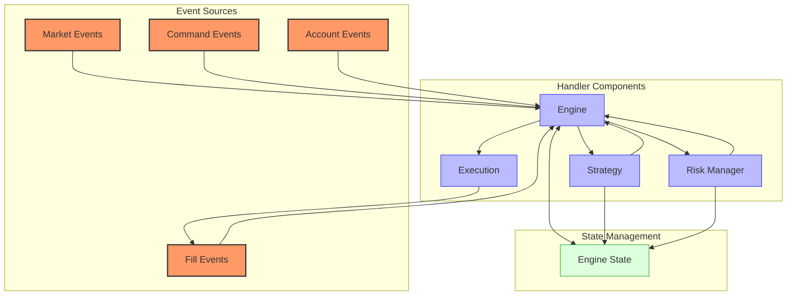

The handler architecture in Barter follows a clear flow:

1. **Events** from various sources are received by the Engine
2. The **Engine** processes these events and updates the EngineState
3. The Engine delegates to specialized handlers like **Strategy** and **RiskManager**
4. These handlers generate **Commands** which are executed by the Engine
5. Commands may result in orders being sent to **Execution**
6. Execution generates **Fill Events** which flow back into the system

## Strategy Handlers

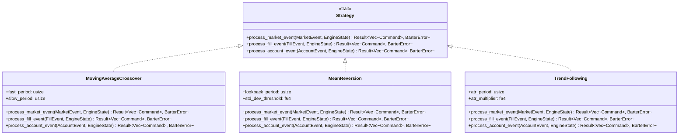

### Strategy Interface

The `Strategy` trait is the primary interface for implementing trading strategies in Barter. It defines methods for processing different types of events and generating commands based on those events.

```rust
pub trait Strategy: Debug + Send + Sync {
    /// Process a market event and generate commands.
    ///
    /// This method is called whenever a new market event (trade, candle, etc.) is received.
    /// The strategy should analyze the event and the current state to generate trading signals.
    fn process_market_event(
        &self,
        market_event: &MarketEvent,
        state: &EngineState,
    ) -> Result<Vec<Command>, BarterError>;

    /// Process a fill event and generate commands.
    ///
    /// This method is called whenever an order is filled (partially or completely).
    /// The strategy can use this to update its internal state or generate follow-up orders.
    fn process_fill_event(
        &self,
        fill_event: &FillEvent,
        state: &EngineState,
    ) -> Result<Vec<Command>, BarterError>;

    /// Process an account event and generate commands.
    ///
    /// This method is called whenever an account event (balance update, etc.) is received.
    /// The strategy can use this to adjust its trading behavior based on account changes.
    fn process_account_event(
        &self,
        account_event: &AccountEvent,
        state: &EngineState,
    ) -> Result<Vec<Command>, BarterError>;
}
```

The Strategy trait is designed to be:

1. **Event-Driven**: Strategies respond to events rather than polling for data
2. **Stateless**: Strategies don't maintain their own state, but instead read from the shared EngineState
3. **Command-Based**: Strategies generate commands rather than directly executing actions
4. **Error-Aware**: All methods return Results to handle errors gracefully

### Strategy Implementation Example

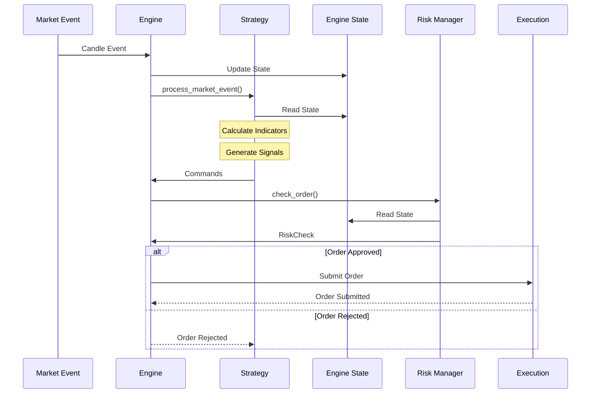

Here's a complete example of a Moving Average Crossover strategy implementation:

```rust
#[derive(Debug, Clone)]
pub struct MovingAverageCrossover {
    /// Period for the fast moving average
    fast_period: usize,
    /// Period for the slow moving average
    slow_period: usize,
    /// Position size as a percentage of account balance
    position_size_pct: Decimal,
    /// Instrument ID to trade
    instrument_id: InstrumentId,
}

impl MovingAverageCrossover {
    pub fn new(
        fast_period: usize,
        slow_period: usize,
        position_size_pct: Decimal,
        instrument_id: InstrumentId,
    ) -> Self {
        Self {
            fast_period,
            slow_period,
            position_size_pct,
            instrument_id,
        }
    }

    /// Calculate Simple Moving Average
    fn calculate_sma(&self, candles: &[Candle], period: usize) -> Result<Decimal, BarterError> {
        if candles.len() < period {
            return Err(BarterError::InsufficientData(
                format!("Need at least {} candles for SMA calculation", period)
            ));
        }

        let sum: Decimal = candles.iter()
            .rev()
            .take(period)
            .map(|candle| candle.close)
            .sum();

        Ok(sum / Decimal::from(period))
    }

    /// Calculate position size based on account balance
    fn calculate_position_size(&self, state: &EngineState) -> Result<Decimal, BarterError> {
        // Get account balance
        let balance = state.global.account_balance
            .get(&self.instrument_id.quote_currency())
            .ok_or(BarterError::BalanceNotFound(
                self.instrument_id.quote_currency().to_string()
            ))?;

        // Calculate position size
        let position_size = balance * self.position_size_pct / dec!(100);

        // Get current price
        let instrument_state = state.instruments.get(&self.instrument_id)
            .ok_or(BarterError::InstrumentNotFound(self.instrument_id.clone()))?;

        let current_price = instrument_state.last_candle
            .as_ref()
            .map(|candle| candle.close)
            .ok_or(BarterError::PriceNotFound(self.instrument_id.clone()))?;

        // Calculate quantity
        let quantity = position_size / current_price;

        Ok(quantity)
    }
}

impl Strategy for MovingAverageCrossover {
    fn process_market_event(
        &self,
        market_event: &MarketEvent,
        state: &EngineState,
    ) -> Result<Vec<Command>, BarterError> {
        // Only process candle events for our instrument
        match market_event {
            MarketEvent::Candle(candle) if candle.instrument_id == self.instrument_id => {
                // Get instrument state
                let instrument_state = state.instruments.get(&self.instrument_id)
                    .ok_or(BarterError::InstrumentNotFound(self.instrument_id.clone()))?;

                // Get candles
                let candles = match &instrument_state.data.candles {
                    Some(candles) if candles.len() >= self.slow_period => candles,
                    _ => {
                        // Not enough data yet
                        tracing::debug!(
                            "Not enough candles for MA calculation: need {}, have {}",
                            self.slow_period,
                            instrument_state.data.candles.as_ref().map_or(0, |c| c.len())
                        );
                        return Ok(vec![]);
                    }
                };

                // Calculate moving averages
                let fast_ma = self.calculate_sma(candles, self.fast_period)?;
                let slow_ma = self.calculate_sma(candles, self.slow_period)?;

                // Get previous moving averages (from previous candle)
                let prev_candles = &candles[..candles.len() - 1];
                let fast_ma_prev = self.calculate_sma(prev_candles, self.fast_period)?;
                let slow_ma_prev = self.calculate_sma(prev_candles, self.slow_period)?;

                // Generate trading signals
                let mut commands = Vec::new();

                // Calculate position size
                let quantity = self.calculate_position_size(state)?;

                // Check for crossover (fast MA crosses above slow MA)
                if fast_ma > slow_ma && fast_ma_prev <= slow_ma_prev {
                    tracing::info!(
                        "BUY Signal: fast_ma={}, slow_ma={}, fast_ma_prev={}, slow_ma_prev={}",
                        fast_ma, slow_ma, fast_ma_prev, slow_ma_prev
                    );

                    // Close any existing short positions
                    for (position_id, position) in state.positions.iter() {
                        if position.instrument_id == self.instrument_id && position.side == Side::Sell {
                            commands.push(Command::ClosePosition(position_id.clone()));
                        }
                    }

                    // Place buy order
                    commands.push(Command::PlaceOrder(OrderParams {
                        instrument_id: self.instrument_id.clone(),
                        order_type: OrderType::Market,
                        side: Side::Buy,
                        quantity,
                        price: None,
                        time_in_force: TimeInForce::GTC,
                        post_only: false,
                        reduce_only: false,
                        trigger_price: None,
                        trigger_type: None,
                        client_id: Some(format!("MAC-BUY-{}", Uuid::new_v4())),
                    }));
                }

                // Check for crossunder (fast MA crosses below slow MA)
                if fast_ma < slow_ma && fast_ma_prev >= slow_ma_prev {
                    tracing::info!(
                        "SELL Signal: fast_ma={}, slow_ma={}, fast_ma_prev={}, slow_ma_prev={}",
                        fast_ma, slow_ma, fast_ma_prev, slow_ma_prev
                    );

                    // Close any existing long positions
                    for (position_id, position) in state.positions.iter() {
                        if position.instrument_id == self.instrument_id && position.side == Side::Buy {
                            commands.push(Command::ClosePosition(position_id.clone()));
                        }
                    }

                    // Place sell order
                    commands.push(Command::PlaceOrder(OrderParams {
                        instrument_id: self.instrument_id.clone(),
                        order_type: OrderType::Market,
                        side: Side::Sell,
                        quantity,
                        price: None,
                        time_in_force: TimeInForce::GTC,
                        post_only: false,
                        reduce_only: false,
                        trigger_price: None,
                        trigger_type: None,
                        client_id: Some(format!("MAC-SELL-{}", Uuid::new_v4())),
                    }));
                }

                Ok(commands)
            }
            _ => Ok(vec![]),  // Ignore other events
        }
    }

    fn process_fill_event(
        &self,
        fill_event: &FillEvent,
        state: &EngineState,
    ) -> Result<Vec<Command>, BarterError> {
        // Log fill event
        tracing::info!(
            "Fill Event: order_id={}, side={}, quantity={}, price={}",
            fill_event.order_id, fill_event.side, fill_event.quantity, fill_event.price
        );

        // No commands generated from fill events in this strategy
        Ok(vec![])
    }

    fn process_account_event(
        &self,
        account_event: &AccountEvent,
        state: &EngineState,
    ) -> Result<Vec<Command>, BarterError> {
        // Log account event
        tracing::info!(
            "Account Event: account_id={}, balance_updates={:?}",
            account_event.account_id, account_event.balance_updates
        );

        // No commands generated from account events in this strategy
        Ok(vec![])
    }
}
```

## Risk Manager Handlers

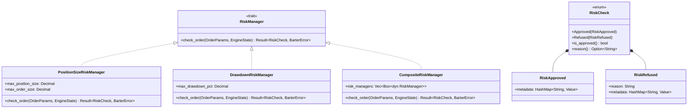

### RiskManager Interface

The `RiskManager` trait defines the interface for risk management components. It is responsible for validating orders against risk parameters before they are submitted to the exchange.

```rust
pub trait RiskManager: Debug + Send + Sync {
    /// Check if an order is allowed based on risk parameters.
    ///
    /// This method is called before an order is submitted to the exchange.
    /// It should validate the order against risk parameters and return a RiskCheck
    /// indicating whether the order is approved or refused.
    fn check_order(
        &self,
        order: &OrderParams,
        state: &EngineState,
    ) -> Result<RiskCheck, BarterError>;
}
```

The `RiskCheck` enum represents the result of a risk check:

```rust
pub enum RiskCheck {
    /// Order is approved by the risk manager.
    Approved(RiskApproved),

    /// Order is refused by the risk manager.
    Refused(RiskRefused),
}

impl RiskCheck {
    /// Returns true if the order is approved, false otherwise.
    pub fn is_approved(&self) -> bool {
        matches!(self, RiskCheck::Approved(_))
    }

    /// Returns the reason for refusal, if any.
    pub fn reason(&self) -> Option<&str> {
        match self {
            RiskCheck::Refused(refused) => Some(&refused.reason),
            _ => None,
        }
    }
}

/// Metadata for an approved order.
pub struct RiskApproved {
    /// Additional metadata about the approval.
    pub metadata: HashMap<String, Value>,
}

/// Metadata for a refused order.
pub struct RiskRefused {
    /// Reason for refusal.
    pub reason: String,
    /// Additional metadata about the refusal.
    pub metadata: HashMap<String, Value>,
}
```

The RiskManager trait is designed to be:

1. **Composable**: Multiple risk managers can be combined to form a composite risk manager
2. **Stateless**: Risk managers don't maintain their own state, but instead read from the shared EngineState
3. **Informative**: Risk checks provide detailed information about why an order was approved or refused
4. **Error-Aware**: All methods return Results to handle errors gracefully

### RiskManager Implementation Example

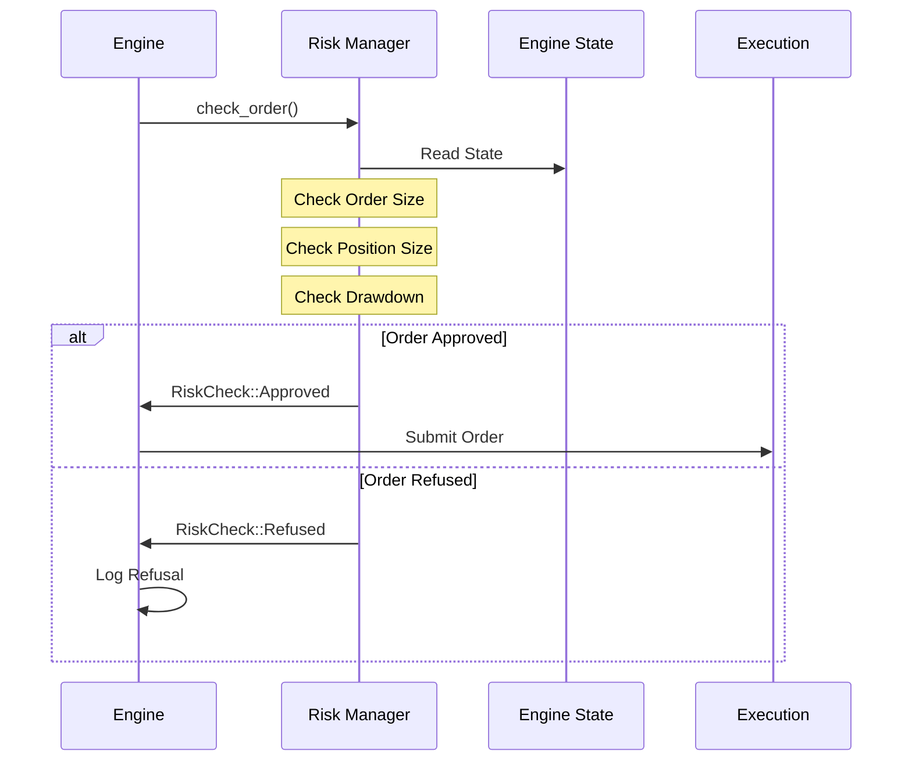

Here's an example of a composite risk manager that combines multiple risk checks:

```rust
/// Position size risk manager that enforces maximum position and order sizes
#[derive(Debug, Clone)]
pub struct PositionSizeRiskManager {
    /// Maximum position size allowed
    max_position_size: Decimal,
    /// Maximum order size allowed
    max_order_size: Decimal,
}

impl PositionSizeRiskManager {
    pub fn new(max_position_size: Decimal, max_order_size: Decimal) -> Self {
        Self {
            max_position_size,
            max_order_size,
        }
    }
}

impl RiskManager for PositionSizeRiskManager {
    fn check_order(
        &self,
        order: &OrderParams,
        state: &EngineState,
    ) -> Result<RiskCheck, BarterError> {
        // Check order size
        if order.quantity > self.max_order_size {
            return Ok(RiskCheck::Refused(RiskRefused {
                reason: format!("Order size {} exceeds maximum {}", order.quantity, self.max_order_size),
                metadata: HashMap::new(),
            }));
        }

        // Check position size
        let instrument_id = &order.instrument_id;

        // Get current position size
        let current_position_size = state.positions.iter()
            .filter(|(_, position)| &position.instrument_id == instrument_id)
            .map(|(_, position)| {
                if position.side == Side::Buy {
                    position.quantity
                } else {
                    -position.quantity
                }
            })
            .sum::<Decimal>();

        // Calculate new position size
        let order_size = if order.side == Side::Buy {
            order.quantity
        } else {
            -order.quantity
        };

        let new_position_size = current_position_size + order_size;

        if new_position_size.abs() > self.max_position_size {
            return Ok(RiskCheck::Refused(RiskRefused {
                reason: format!(
                    "New position size {} would exceed maximum {}",
                    new_position_size.abs(),
                    self.max_position_size
                ),
                metadata: HashMap::new(),
            }));
        }

        // Order is approved
        Ok(RiskCheck::Approved(RiskApproved {
            metadata: HashMap::new(),
        }))
    }
}

/// Drawdown risk manager that enforces maximum drawdown percentage
#[derive(Debug, Clone)]
pub struct DrawdownRiskManager {
    /// Maximum drawdown percentage allowed
    max_drawdown_pct: Decimal,
}

impl DrawdownRiskManager {
    pub fn new(max_drawdown_pct: Decimal) -> Self {
        Self {
            max_drawdown_pct,
        }
    }

    /// Calculate current drawdown percentage
    fn calculate_drawdown(&self, state: &EngineState) -> Result<Decimal, BarterError> {
        // Get account equity history
        let equity_history = state.global.equity_history.as_ref()
            .ok_or(BarterError::MissingData("Equity history not available".to_string()))?;

        if equity_history.is_empty() {
            return Ok(Decimal::zero());
        }

        // Find peak equity
        let peak_equity = equity_history.iter()
            .map(|equity| equity.value)
            .max_by(|a, b| a.partial_cmp(b).unwrap_or(std::cmp::Ordering::Equal))
            .unwrap_or(Decimal::zero());

        // Get current equity
        let current_equity = equity_history.last()
            .map(|equity| equity.value)
            .unwrap_or(Decimal::zero());

        // Calculate drawdown percentage
        if peak_equity.is_zero() {
            Ok(Decimal::zero())
        } else {
            let drawdown = (peak_equity - current_equity) / peak_equity * dec!(100);
            Ok(drawdown)
        }
    }
}

impl RiskManager for DrawdownRiskManager {
    fn check_order(
        &self,
        order: &OrderParams,
        state: &EngineState,
    ) -> Result<RiskCheck, BarterError> {
        // Calculate current drawdown
        let current_drawdown = self.calculate_drawdown(state)?;

        // Check if drawdown exceeds maximum
        if current_drawdown > self.max_drawdown_pct {
            return Ok(RiskCheck::Refused(RiskRefused {
                reason: format!(
                    "Current drawdown {}% exceeds maximum {}%",
                    current_drawdown,
                    self.max_drawdown_pct
                ),
                metadata: HashMap::new(),
            }));
        }

        // Order is approved
        Ok(RiskCheck::Approved(RiskApproved {
            metadata: HashMap::new(),
        }))
    }
}

/// Composite risk manager that combines multiple risk managers
#[derive(Debug)]
pub struct CompositeRiskManager {
    /// List of risk managers to check
    risk_managers: Vec<Box<dyn RiskManager>>,
}

impl CompositeRiskManager {
    pub fn new() -> Self {
        Self {
            risk_managers: Vec::new(),
        }
    }

    /// Add a risk manager to the composite
    pub fn add<R: RiskManager + 'static>(&mut self, risk_manager: R) -> &mut Self {
        self.risk_managers.push(Box::new(risk_manager));
        self
    }
}

impl RiskManager for CompositeRiskManager {
    fn check_order(
        &self,
        order: &OrderParams,
        state: &EngineState,
    ) -> Result<RiskCheck, BarterError> {
        // Check order with all risk managers
        for risk_manager in &self.risk_managers {
            let check = risk_manager.check_order(order, state)?;

            // If any risk manager refuses the order, return the refusal
            if let RiskCheck::Refused(refused) = check {
                return Ok(RiskCheck::Refused(refused));
            }
        }

        // All risk managers approved the order
        Ok(RiskCheck::Approved(RiskApproved {
            metadata: HashMap::new(),
        }))
    }
}

// Example usage
pub fn create_risk_manager() -> CompositeRiskManager {
    let mut risk_manager = CompositeRiskManager::new();

    // Add position size risk manager
    risk_manager.add(PositionSizeRiskManager::new(
        dec!(10.0),  // Max position size
        dec!(5.0),    // Max order size
    ));

    // Add drawdown risk manager
    risk_manager.add(DrawdownRiskManager::new(
        dec!(20.0),  // Max drawdown percentage
    ));

    risk_manager
}
```

## Engine Handlers

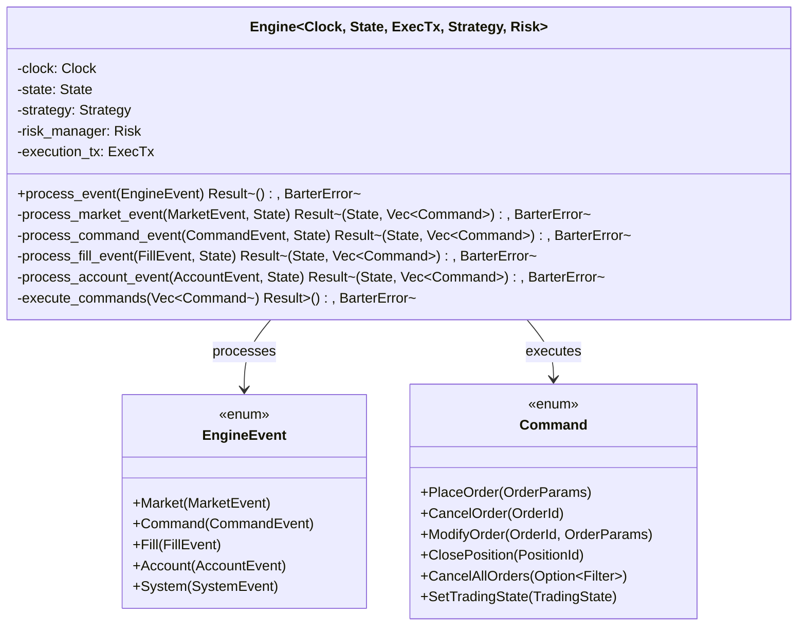

The `Engine` is the central component that processes events and coordinates the system. It implements several handlers for different types of events and manages the overall state of the trading system.

### Event Processing Flow

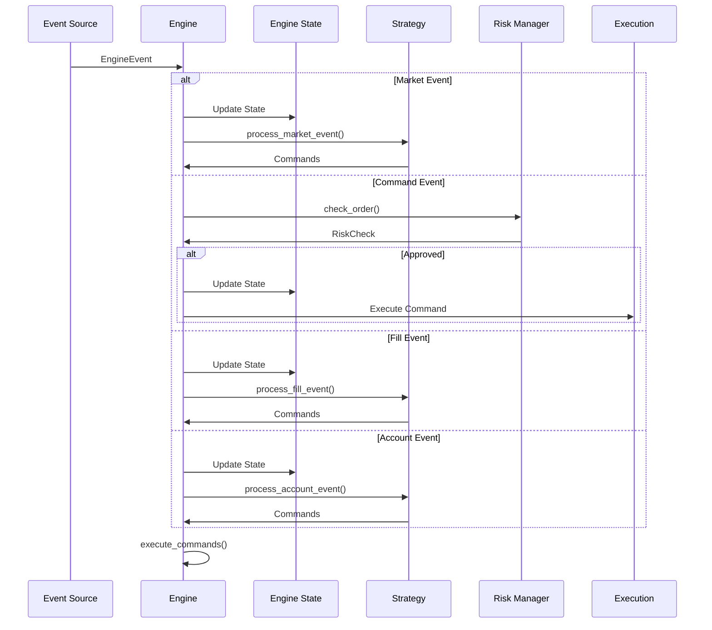

### Market Event Handler

The market event handler processes market data events and updates the state accordingly:

```rust
impl<Clock, State, ExecTx, Strategy, Risk> Engine<Clock, State, ExecTx, Strategy, Risk>
where
    Clock: ClockTrait,
    State: StateTrait,
    ExecTx: ExecutionTransmitter,
    Strategy: StrategyTrait,
    Risk: RiskManagerTrait,
{
    /// Process a market event
    fn process_market_event(
        &mut self,
        market_event: MarketEvent,
        state: &State,
    ) -> Result<(State, Vec<Command>), BarterError> {
        // Create a span for tracing
        let span = tracing::debug_span!(
            "process_market_event",
            event_type = %market_event.type_name(),
            instrument = %market_event.instrument_id(),
            timestamp = %market_event.timestamp(),
        );
        let _enter = span.enter();

        // Update state with market data
        let mut new_state = state.clone();
        new_state.update_market_data(&market_event)?;

        // Process market event with strategy
        let commands = self.strategy.process_market_event(&market_event, &new_state)?;

        // Log commands if any
        if !commands.is_empty() {
            tracing::debug!("Generated {} commands from market event", commands.len());
        }

        // Return updated state and commands
        Ok((new_state, commands))
    }
}
```

### Command Event Handler

The command event handler processes command events and executes the corresponding actions:

```rust
impl<Clock, State, ExecTx, Strategy, Risk> Engine<Clock, State, ExecTx, Strategy, Risk>
where
    Clock: ClockTrait,
    State: StateTrait,
    ExecTx: ExecutionTransmitter,
    Strategy: StrategyTrait,
    Risk: RiskManagerTrait,
{
    /// Process a command event
    async fn process_command_event(
        &mut self,
        command_event: CommandEvent,
        state: &State,
    ) -> Result<(State, Vec<Command>), BarterError> {
        // Create a span for tracing
        let span = tracing::debug_span!(
            "process_command_event",
            command_type = %command_event.command.type_name(),
            command_id = %command_event.id,
            timestamp = %command_event.timestamp,
        );
        let _enter = span.enter();

        // Process command based on type
        match command_event.command {
            Command::PlaceOrder(order_params) => {
                // Check order with risk manager
                let risk_check = self.risk.check_order(&order_params, state)?;

                match risk_check {
                    RiskCheck::Approved(_) => {
                        // Create order and update state
                        let mut new_state = state.clone();
                        let order = create_order(order_params, &new_state, self.clock.timestamp_ns())?;
                        new_state.add_order(order.clone())?;

                        // Send order to execution
                        self.execution_tx.send_order(order).await?;

                        tracing::info!("Order placed and sent to execution");
                        Ok((new_state, vec![]))
                    }
                    RiskCheck::Refused(refused) => {
                        // Log refusal and return unchanged state
                        tracing::warn!(
                            "Order refused by risk manager: {}",
                            refused.reason
                        );
                        Ok((state.clone(), vec![]))
                    }
                }
            }
            Command::CancelOrder(order_id) => {
                // Get the order
                let order = state.get_order(&order_id)
                    .ok_or(BarterError::OrderNotFound(order_id.clone()))?;

                // Check if order can be canceled
                if !order.is_active() {
                    return Err(BarterError::OrderNotActive(order_id));
                }

                // Send cancel request to execution
                self.execution_tx.cancel_order(order_id.clone()).await?;

                // Update state
                let mut new_state = state.clone();
                new_state.update_order_status(&order_id, OrderStatus::PendingCancel)?;

                tracing::info!("Order cancellation sent to execution");
                Ok((new_state, vec![]))
            }
            Command::SetTradingState(trading_state) => {
                // Update trading state
                let mut new_state = state.clone();
                new_state.set_trading_state(trading_state);

                tracing::info!("Trading state set to {:?}", trading_state);
                Ok((new_state, vec![]))
            }
            // Handle other command types...
            _ => {
                tracing::warn!("Unhandled command type: {:?}", command_event.command);
                Ok((state.clone(), vec![]))
            }
        }
    }
}
```

### Fill Event Handler

The fill event handler processes fill events and updates orders and positions accordingly:

```rust
impl<Clock, State, ExecTx, Strategy, Risk> Engine<Clock, State, ExecTx, Strategy, Risk>
where
    Clock: ClockTrait,
    State: StateTrait,
    ExecTx: ExecutionTransmitter,
    Strategy: StrategyTrait,
    Risk: RiskManagerTrait,
{
    /// Process a fill event
    fn process_fill_event(
        &mut self,
        fill_event: FillEvent,
        state: &State,
    ) -> Result<(State, Vec<Command>), BarterError> {
        // Create a span for tracing
        let span = tracing::debug_span!(
            "process_fill_event",
            order_id = %fill_event.order_id,
            instrument = %fill_event.instrument_id,
            price = %fill_event.price,
            quantity = %fill_event.quantity,
            timestamp = %fill_event.timestamp,
        );
        let _enter = span.enter();

        // Update state with fill information
        let mut new_state = state.clone();

        // Update order with fill
        new_state.update_order_fill(&fill_event)?;

        // Update position
        new_state.update_position(&fill_event)?;

        // Process fill event with strategy
        let commands = self.strategy.process_fill_event(&fill_event, &new_state)?;

        // Log fill event
        tracing::info!(
            "Order filled: order_id={}, price={}, quantity={}, side={}",
            fill_event.order_id,
            fill_event.price,
            fill_event.quantity,
            fill_event.side,
        );

        // Return updated state and commands
        Ok((new_state, commands))
    }
}
```

### Command Execution

The engine also implements a method to execute commands generated by handlers:

```rust
impl<Clock, State, ExecTx, Strategy, Risk> Engine<Clock, State, ExecTx, Strategy, Risk>
where
    Clock: ClockTrait,
    State: StateTrait,
    ExecTx: ExecutionTransmitter,
    Strategy: StrategyTrait,
    Risk: RiskManagerTrait,
{
    /// Execute a list of commands
    async fn execute_commands(
        &mut self,
        commands: Vec<Command>,
    ) -> Result<(), BarterError> {
        for command in commands {
            // Create command event
            let command_event = CommandEvent {
                command: command.clone(),
                id: Uuid::new_v4(),
                timestamp: self.clock.timestamp_ns(),
            };

            // Process command event
            let (new_state, new_commands) = self.process_command_event(command_event, &self.state).await?;

            // Update state
            self.state = new_state;

            // Execute any new commands recursively
            if !new_commands.is_empty() {
                self.execute_commands(new_commands).await?;
            }
        }

        Ok(())
    }
}
```

## Input/Output Specifications

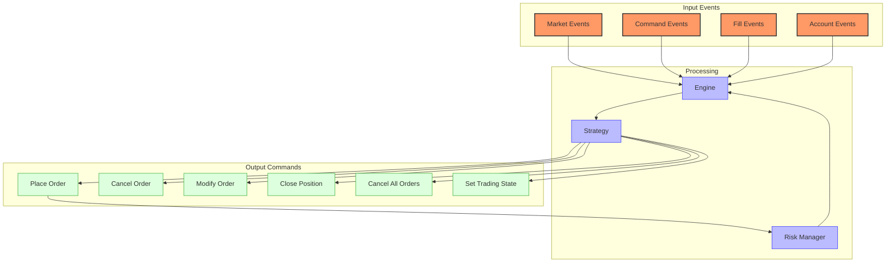

### Market Event Input

Market events come from external sources (exchanges, historical data) and include:

- **Trade**: Individual trade execution data
  ```rust
  pub struct Trade {
      pub instrument_id: InstrumentId,
      pub id: String,
      pub price: Decimal,
      pub quantity: Decimal,
      pub side: Side,
      pub timestamp: DateTime<Utc>,
  }
  ```

- **Candle**: OHLCV data for a time period
  ```rust
  pub struct Candle {
      pub instrument_id: InstrumentId,
      pub open: Decimal,
      pub high: Decimal,
      pub low: Decimal,
      pub close: Decimal,
      pub volume: Decimal,
      pub timestamp: DateTime<Utc>,
  }
  ```

- **OrderBook**: Order book snapshot or update
  ```rust
  pub struct OrderBook {
      pub instrument_id: InstrumentId,
      pub bids: Vec<Level>,  // Sorted by price (descending)
      pub asks: Vec<Level>,  // Sorted by price (ascending)
      pub timestamp: DateTime<Utc>,
  }

  pub struct Level {
      pub price: Decimal,
      pub quantity: Decimal,
  }
  ```

### Fill Event Input

Fill events represent order executions and include:

```rust
pub struct FillEvent {
    pub order_id: OrderId,
    pub instrument_id: InstrumentId,
    pub price: Decimal,
    pub quantity: Decimal,
    pub side: Side,
    pub timestamp: DateTime<Utc>,
    pub trade_id: String,
    pub fees: Option<Fees>,
}

pub struct Fees {
    pub amount: Decimal,
    pub currency: Currency,
}
```

### Account Event Input

Account events represent changes to account state and include:

```rust
pub struct AccountEvent {
    pub account_id: AccountId,
    pub balance_updates: Vec<BalanceUpdate>,
    pub timestamp: DateTime<Utc>,
}

pub struct BalanceUpdate {
    pub currency: Currency,
    pub amount: Decimal,
    pub balance_type: BalanceType,  // Available, Reserved, Total
}
```

### Command Output

Commands are instructions generated by handlers and include:

- **PlaceOrder**: Request to place a new order
  ```rust
  pub struct OrderParams {
      pub instrument_id: InstrumentId,
      pub order_type: OrderType,
      pub side: Side,
      pub quantity: Decimal,
      pub price: Option<Decimal>,
      pub time_in_force: TimeInForce,
      pub post_only: bool,
      pub reduce_only: bool,
      pub trigger_price: Option<Decimal>,
      pub trigger_type: Option<TriggerType>,
      pub client_id: Option<String>,
  }
  ```

- **CancelOrder**: Request to cancel an existing order
  ```rust
  pub struct CancelOrder {
      pub order_id: OrderId,
  }
  ```

- **ModifyOrder**: Request to modify an existing order
  ```rust
  pub struct ModifyOrder {
      pub order_id: OrderId,
      pub params: OrderParams,
  }
  ```

- **ClosePosition**: Request to close an open position
  ```rust
  pub struct ClosePosition {
      pub position_id: PositionId,
  }
  ```

- **CancelAllOrders**: Request to cancel all open orders
  ```rust
  pub struct CancelAllOrders {
      pub filter: Option<Filter>,  // Optional filter criteria
  }

  pub struct Filter {
      pub instrument_id: Option<InstrumentId>,
      pub side: Option<Side>,
      pub order_type: Option<OrderType>,
  }
  ```

- **SetTradingState**: Change the trading state
  ```rust
  pub enum TradingState {
      Active,    // Normal trading operations
      Halted,    // Trading is completely halted
      Reducing,  // Only reducing positions is allowed
  }
  ```

## Error Handling Strategies

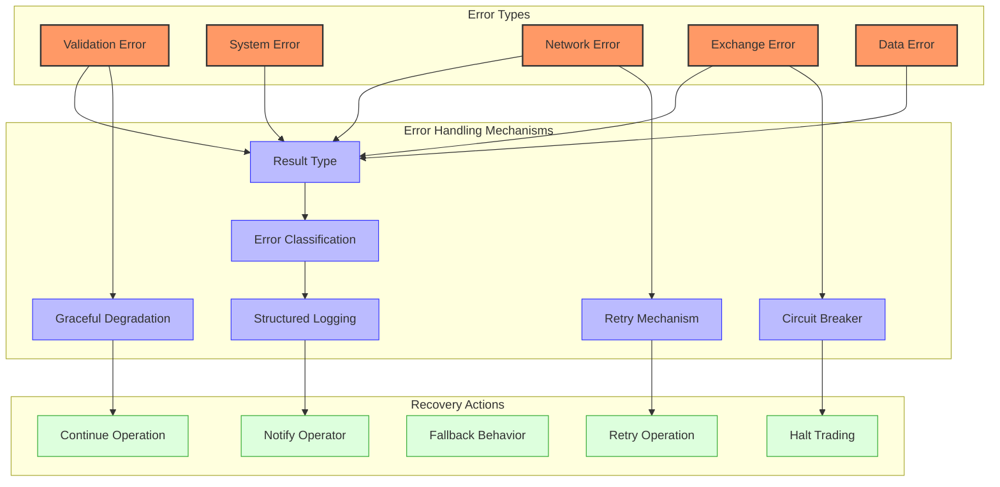

Barter implements comprehensive error handling strategies in its handlers:

1. **Result-based Error Handling**: All handler methods return `Result<T, BarterError>` to propagate errors in a type-safe manner
2. **Error Classification**: Errors are classified into different categories for appropriate handling
   ```rust
   #[derive(Debug, Error)]
   pub enum BarterError {
       #[error("Validation error: {0}")]
       Validation(String),

       #[error("System error: {0}")]
       System(String),

       #[error("Network error: {0}")]
       Network(String),

       #[error("Exchange error: {0}")]
       Exchange(String),

       #[error("Data error: {0}")]
       Data(String),

       #[error("{0}")]
       Generic(String),

       // Specific errors
       #[error("Order not found: {0}")]
       OrderNotFound(OrderId),

       #[error("Instrument not found: {0}")]
       InstrumentNotFound(InstrumentId),

       #[error("Position not found: {0}")]
       PositionNotFound(PositionId),

       #[error("Order not active: {0}")]
       OrderNotActive(OrderId),

       #[error("Insufficient data: {0}")]
       InsufficientData(String),

       #[error("Missing data: {0}")]
       MissingData(String),
   }
   ```
3. **Structured Logging**: Errors are logged with detailed context for diagnosis
   ```rust
   tracing::error!(
       target: "barter::engine",
       error = %error,
       component = %self.id,
       event_type = %event.type_name(),
       "Error processing event"
   );
   ```
4. **Graceful Degradation**: Handlers attempt to continue operation when possible
5. **Retry Mechanisms**: Critical operations can be retried with exponential backoff
6. **Circuit Breakers**: Automatic circuit breakers can halt trading when error rates exceed thresholds

### Error Handling Implementation

```rust
impl<T: Strategy> StrategyHandler<T> {
    fn process_market_event(
        &self,
        market_event: &MarketEvent,
        state: &EngineState,
    ) -> Result<Vec<Command>, BarterError> {
        // Create a span for tracing
        let span = tracing::debug_span!(
            "process_market_event",
            event_type = %market_event.type_name(),
            instrument = %market_event.instrument_id(),
            timestamp = %market_event.timestamp(),
        );
        let _enter = span.enter();

        // Validate market event
        if let Err(e) = self.validate_market_event(market_event) {
            // Log validation error with context
            tracing::warn!(
                error = %e,
                event_type = %market_event.type_name(),
                instrument = %market_event.instrument_id(),
                "Invalid market event"
            );

            // Continue with empty commands (graceful degradation)
            return Ok(vec![]);
        }

        // Process market event based on type
        match market_event {
            MarketEvent::Candle(candle) => {
                // Process candle with retry mechanism for transient errors
                match self.with_retry(|| self.strategy.process_candle(candle, state)) {
                    Ok(commands) => {
                        // Log success
                        tracing::debug!(
                            "Processed candle successfully, generated {} commands",
                            commands.len()
                        );
                        Ok(commands)
                    },
                    Err(e) => {
                        // Check if error is fatal
                        if self.is_fatal_error(&e) {
                            // Propagate fatal errors
                            Err(e)
                        } else {
                            // Log non-fatal error but continue with empty commands
                            tracing::error!(
                                error = %e,
                                candle_time = %candle.timestamp,
                                instrument = %candle.instrument_id,
                                "Error processing candle, continuing with empty commands"
                            );
                            Ok(vec![])
                        }
                    }
                }
            },
            // Process other event types...
            _ => Ok(vec![]),
        }
    }

    /// Retry an operation with exponential backoff
    fn with_retry<F, R>(&self, mut operation: F) -> Result<R, BarterError>
    where
        F: FnMut() -> Result<R, BarterError>,
    {
        let mut attempts = 0;
        let max_attempts = 3;
        let mut backoff = Duration::from_millis(10);

        loop {
            match operation() {
                Ok(result) => return Ok(result),
                Err(e) => {
                    attempts += 1;

                    // Check if error is retryable and we haven't exceeded max attempts
                    if self.is_retryable_error(&e) && attempts < max_attempts {
                        tracing::warn!(
                            error = %e,
                            attempt = attempts,
                            backoff_ms = %backoff.as_millis(),
                            "Retryable error, will retry"
                        );

                        // Sleep with exponential backoff
                        std::thread::sleep(backoff);
                        backoff *= 2;  // Exponential backoff
                    } else {
                        // Not retryable or max attempts exceeded
                        return Err(e);
                    }
                }
            }
        }
    }

    /// Check if an error is retryable
    fn is_retryable_error(&self, error: &BarterError) -> bool {
        matches!(error,
            BarterError::Network(_) |
            BarterError::Exchange(e) if e.contains("rate limit") ||
            e.contains("timeout")
        )
    }

    /// Check if an error is fatal
    fn is_fatal_error(&self, error: &BarterError) -> bool {
        matches!(error,
            BarterError::System(_) |
            BarterError::Exchange(e) if e.contains("account disabled") ||
            e.contains("insufficient funds")
        )
    }
}
```

### Circuit Breaker Implementation

```rust
/// Circuit breaker for error handling
pub struct CircuitBreaker {
    /// Current state of the circuit breaker
    state: AtomicBool,  // false = closed (normal), true = open (tripped)
    /// Error counter
    error_count: AtomicUsize,
    /// Error threshold before tripping
    threshold: usize,
    /// Time of last error
    last_error_time: AtomicU64,
    /// Reset timeout in milliseconds
    reset_timeout_ms: u64,
}

impl CircuitBreaker {
    pub fn new(threshold: usize, reset_timeout_ms: u64) -> Self {
        Self {
            state: AtomicBool::new(false),
            error_count: AtomicUsize::new(0),
            threshold,
            last_error_time: AtomicU64::new(0),
            reset_timeout_ms,
        }
    }

    /// Record an error and check if circuit breaker should trip
    pub fn record_error(&self) -> bool {
        // Update last error time
        self.last_error_time.store(
            SystemTime::now()
                .duration_since(UNIX_EPOCH)
                .unwrap_or_default()
                .as_millis() as u64,
            Ordering::SeqCst
        );

        // Increment error count
        let count = self.error_count.fetch_add(1, Ordering::SeqCst) + 1;

        // Check if threshold exceeded
        if count >= self.threshold {
            // Trip circuit breaker
            self.state.store(true, Ordering::SeqCst);
            true
        } else {
            false
        }
    }

    /// Check if circuit breaker is tripped
    pub fn is_tripped(&self) -> bool {
        // If circuit breaker is open (tripped)
        if self.state.load(Ordering::SeqCst) {
            // Check if reset timeout has elapsed
            let now = SystemTime::now()
                .duration_since(UNIX_EPOCH)
                .unwrap_or_default()
                .as_millis() as u64;

            let last_error = self.last_error_time.load(Ordering::SeqCst);

            if now - last_error > self.reset_timeout_ms {
                // Reset circuit breaker
                self.state.store(false, Ordering::SeqCst);
                self.error_count.store(0, Ordering::SeqCst);
                false
            } else {
                true
            }
        } else {
            false
        }
    }

    /// Reset the circuit breaker
    pub fn reset(&self) {
        self.state.store(false, Ordering::SeqCst);
        self.error_count.store(0, Ordering::SeqCst);
    }
}
```

## Performance Considerations

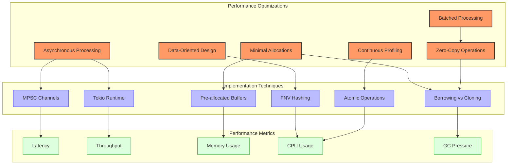

Barter's handlers are designed for ultra-low latency performance:

### Memory Optimization

1. **Minimal Allocations**: Handlers minimize memory allocations to reduce GC pressure
   ```rust
   // Pre-allocate buffers for high-frequency operations
   let mut commands = Vec::with_capacity(10);  // Pre-allocate space for 10 commands
   ```

2. **Data-Oriented Design**: State is organized for cache efficiency
   ```rust
   // Use FNV hasher for faster hashing of integer keys
   type OrderMap = FnvHashMap<OrderId, OrderState>;
   ```

3. **Zero-Copy Operations**: Data is borrowed rather than cloned when possible
   ```rust
   // Borrow data instead of cloning
   fn process_market_event(&self, market_event: &MarketEvent, state: &EngineState) -> Result<Vec<Command>, BarterError> {
       // Use references to avoid cloning
   }
   ```

### Processing Optimization

4. **Asynchronous Processing**: Handlers use async/await for non-blocking I/O
   ```rust
   // Use async/await for non-blocking I/O
   async fn process_command_event(&mut self, command_event: CommandEvent) -> Result<(), BarterError> {
       // Asynchronous processing
       self.execution_tx.send_order(order).await?
   }
   ```

5. **Batched Processing**: Events can be processed in batches for efficiency
   ```rust
   // Process multiple events in a batch
   fn process_market_events(&mut self, events: &[MarketEvent]) -> Result<Vec<Command>, BarterError> {
       let mut commands = Vec::with_capacity(events.len());

       for event in events {
           let event_commands = self.process_market_event(event)?;
           commands.extend(event_commands);
       }

       Ok(commands)
   }
   ```

6. **Lock-Free Algorithms**: Use atomic operations for thread-safe counters
   ```rust
   // Use atomic operations for thread-safe counters
   let counter = AtomicUsize::new(0);
   counter.fetch_add(1, Ordering::SeqCst);
   ```

### Performance Monitoring

7. **Continuous Profiling**: Critical paths are profiled and optimized
   ```rust
   // Use tracing spans for performance monitoring
   let span = tracing::info_span!("process_market_event");
   let _enter = span.enter();

   // Process event
   let start = Instant::now();
   let result = self.strategy.process_market_event(market_event, state);
   let duration = start.elapsed();

   // Record metrics
   self.metrics.record_event_processed("market", duration);
   ```

8. **Performance Metrics**: Track and analyze performance metrics
   ```rust
   // Define performance metrics
   pub struct Metrics {
       pub event_count: Counter,
       pub event_processing_time: Histogram,
       pub event_queue_time: Histogram,
   }

   // Record metrics
   impl Metrics {
       pub fn record_event_processed(&self, event_type: &str, duration: Duration) {
           self.event_count.inc(1);
           self.event_processing_time.record(duration.as_micros() as f64);
       }
   }
   ```

### Performance Optimization Example

```rust
// Optimized implementation of an order book handler
pub struct OrderBookHandler {
    /// Map of instrument ID to order book
    order_books: FnvHashMap<InstrumentId, OrderBook>,
    /// Pre-allocated buffer for order book updates
    update_buffer: Vec<OrderBookLevel>,
    /// Performance metrics
    metrics: Arc<Metrics>,
}

impl OrderBookHandler {
    /// Create a new order book handler
    pub fn new(capacity: usize, metrics: Arc<Metrics>) -> Self {
        Self {
            // Use FNV hasher for better performance with integer keys
            order_books: FnvHashMap::default(),
            // Pre-allocate buffer to avoid allocations during processing
            update_buffer: Vec::with_capacity(capacity),
            metrics,
        }
    }

    /// Process an order book update
    pub fn process_update(&mut self, update: OrderBookUpdate) -> Result<(), BarterError> {
        // Start performance measurement
        let start = Instant::now();

        // Get or create order book
        let order_book = self.order_books
            .entry(update.instrument_id.clone())
            .or_insert_with(|| OrderBook::new(update.instrument_id.clone()));

        // Clear update buffer and reuse it
        self.update_buffer.clear();

        // Process bids
        for level in &update.bids {
            // Avoid cloning by using references
            self.update_buffer.push(OrderBookLevel {
                price: level.price,
                quantity: level.quantity,
                side: Side::Buy,
            });
        }

        // Process asks
        for level in &update.asks {
            // Avoid cloning by using references
            self.update_buffer.push(OrderBookLevel {
                price: level.price,
                quantity: level.quantity,
                side: Side::Sell,
            });
        }

        // Apply updates in a single batch operation
        order_book.apply_updates(&self.update_buffer)?;

        // Record performance metrics
        let duration = start.elapsed();
        self.metrics.record_order_book_update(duration);

        Ok(())
    }
}
```

## Edge Cases and Their Handling

```mermaid
flowchart TD
    subgraph "Edge Cases"
        InvalidData[Invalid Market Data]:::edge
        OrderRejection[Order Rejection]:::edge
        ConnectionLoss[Connection Loss]:::edge
        PartialFills[Partial Fills]:::edge
        RaceConditions[Race Conditions]:::edge
        ExchangeLatency[Exchange Latency]:::edge
        ClockSkew[Clock Skew]:::edge
        OutOfOrderEvents[Out-of-Order Events]:::edge
    end

    subgraph "Handling Mechanisms"
        Validation[Data Validation]:::mechanism
        Reconciliation[State Reconciliation]:::mechanism
        Reconnection[Auto Reconnection]:::mechanism
        OrderTracking[Order Tracking]:::mechanism
        Synchronization[Thread Synchronization]:::mechanism
        TimeoutHandling[Timeout Handling]:::mechanism
        TimeNormalization[Time Normalization]:::mechanism
        EventReordering[Event Reordering]:::mechanism
    end

    InvalidData --> Validation
    OrderRejection --> OrderTracking
    ConnectionLoss --> Reconnection
    ConnectionLoss --> Reconciliation
    PartialFills --> OrderTracking
    RaceConditions --> Synchronization
    ExchangeLatency --> TimeoutHandling
    ClockSkew --> TimeNormalization
    OutOfOrderEvents --> EventReordering

    classDef edge fill:#f96,stroke:#333,stroke-width:2px;
    classDef mechanism fill:#bbf,stroke:#33f,stroke-width:1px;

    class InvalidData,OrderRejection,ConnectionLoss,PartialFills,RaceConditions,ExchangeLatency,ClockSkew,OutOfOrderEvents edge;
    class Validation,Reconciliation,Reconnection,OrderTracking,Synchronization,TimeoutHandling,TimeNormalization,EventReordering mechanism;
```

Barter's handlers are designed to handle various edge cases that can occur in trading systems:

### Data Integrity Issues

1. **Invalid Market Data**: Handlers validate market data and handle invalid data gracefully
   ```rust
   fn validate_market_event(&self, event: &MarketEvent) -> Result<(), BarterError> {
       match event {
           MarketEvent::Trade(trade) => {
               // Validate trade data
               if trade.price.is_zero() || trade.price.is_sign_negative() {
                   return Err(BarterError::Validation(
                       format!("Invalid trade price: {}", trade.price)
                   ));
               }

               if trade.quantity.is_zero() || trade.quantity.is_sign_negative() {
                   return Err(BarterError::Validation(
                       format!("Invalid trade quantity: {}", trade.quantity)
                   ));
               }

               Ok(())
           },
           // Validate other event types...
           _ => Ok(()),
       }
   }
   ```

2. **Out-of-Order Events**: Handlers can reorder events based on timestamps
   ```rust
   fn process_events(&mut self, mut events: Vec<MarketEvent>) -> Result<(), BarterError> {
       // Sort events by timestamp
       events.sort_by(|a, b| a.timestamp().cmp(&b.timestamp()));

       // Process events in order
       for event in events {
           self.process_market_event(&event)?;
       }

       Ok(())
   }
   ```

### Exchange Interaction Issues

3. **Order Rejections**: Handlers handle order rejections from exchanges
   ```rust
   fn handle_order_rejected(&mut self, rejection: OrderRejected) -> Result<(), BarterError> {
       // Get the original order
       let order_id = rejection.order_id;
       let order = self.state.get_order(&order_id)
           .ok_or(BarterError::OrderNotFound(order_id.clone()))?;

       // Update order status
       let mut updated_order = order.clone();
       updated_order.status = OrderStatus::Rejected;
       self.state.update_order(updated_order);

       // Log rejection
       tracing::warn!(
           "Order rejected: order_id={}, reason={}",
           order_id,
           rejection.reason.unwrap_or_else(|| "Unknown reason".to_string())
       );

       // Notify strategy
       let commands = self.strategy.process_order_rejected(&rejection, &self.state)?;
       self.execute_commands(commands).await?;

       Ok(())
   }
   ```

4. **Connection Loss**: Handlers handle connection loss and reconnection
   ```rust
   async fn handle_connection_loss(&mut self) -> Result<(), BarterError> {
       // Set trading state to halted
       self.state.set_trading_state(TradingState::Halted);

       // Log connection loss
       tracing::error!("Connection lost to exchange, attempting reconnection");

       // Attempt reconnection with exponential backoff
       let mut attempts = 0;
       let max_attempts = 10;
       let mut backoff = Duration::from_secs(1);

       while attempts < max_attempts {
           tracing::info!("Reconnection attempt {}/{}", attempts + 1, max_attempts);

           match self.exchange.connect().await {
               Ok(_) => {
                   tracing::info!("Reconnected to exchange");

                   // Reconcile state with exchange
                   self.reconcile_state().await?;

                   // Resume trading
                   self.state.set_trading_state(TradingState::Active);

                   return Ok(());
               },
               Err(e) => {
                   tracing::error!("Reconnection failed: {}", e);
                   attempts += 1;
                   tokio::time::sleep(backoff).await;
                   backoff *= 2;  // Exponential backoff
               }
           }
       }

       Err(BarterError::Network("Failed to reconnect after maximum attempts".to_string()))
   }
   ```

### Order State Issues

5. **Partial Fills**: Handlers handle partial fills and order updates
   ```rust
   fn handle_fill_event(&mut self, fill: FillEvent) -> Result<(), BarterError> {
       // Get the order
       let order_id = &fill.order_id;
       let order = self.state.get_order(order_id)
           .ok_or(BarterError::OrderNotFound(order_id.clone()))?;

       // Update order with fill information
       let mut updated_order = order.clone();
       updated_order.filled_quantity += fill.quantity;

       // Update order status based on fill
       if updated_order.filled_quantity >= updated_order.quantity {
           updated_order.status = OrderStatus::Filled;
       } else {
           updated_order.status = OrderStatus::PartiallyFilled;
       }

       // Add fill to order
       updated_order.fills.push(fill.clone());

       // Update order in state
       self.state.update_order(updated_order);

       // Update position
       self.update_position(fill)?;

       // Log fill
       tracing::info!(
           "Order filled: order_id={}, quantity={}/{}, price={}",
           order_id,
           fill.quantity,
           order.quantity,
           fill.price
       );

       Ok(())
   }
   ```

### Concurrency Issues

6. **Race Conditions**: Handlers use appropriate synchronization to avoid race conditions
   ```rust
   // Use atomic operations for thread-safe counters
   let order_counter = AtomicU64::new(0);

   fn generate_order_id(&self) -> OrderId {
       let count = self.order_counter.fetch_add(1, Ordering::SeqCst);
       OrderId::new(format!("{}-{}", self.id, count))
   }
   ```

7. **Clock Skew**: Handlers normalize timestamps to handle clock skew
   ```rust
   fn normalize_timestamp(&self, timestamp: DateTime<Utc>) -> DateTime<Utc> {
       // Calculate clock skew
       let now = Utc::now();
       let max_future_skew = Duration::seconds(5);

       // If timestamp is too far in the future, cap it
       if timestamp > now + max_future_skew {
           tracing::warn!(
               "Clock skew detected: event timestamp {} is too far in the future",
               timestamp
           );
           return now;
       }

       timestamp
   }
   ```

These handlers form the core of Barter's event processing system, enabling efficient and robust trading operations.
