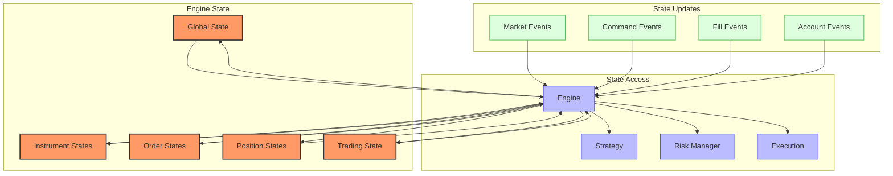
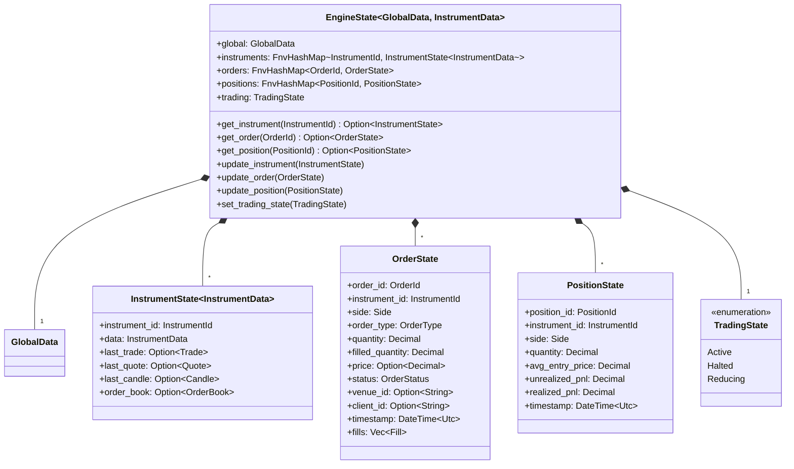
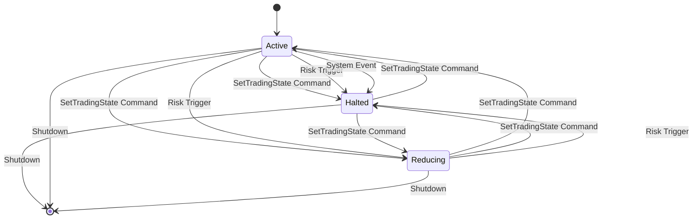
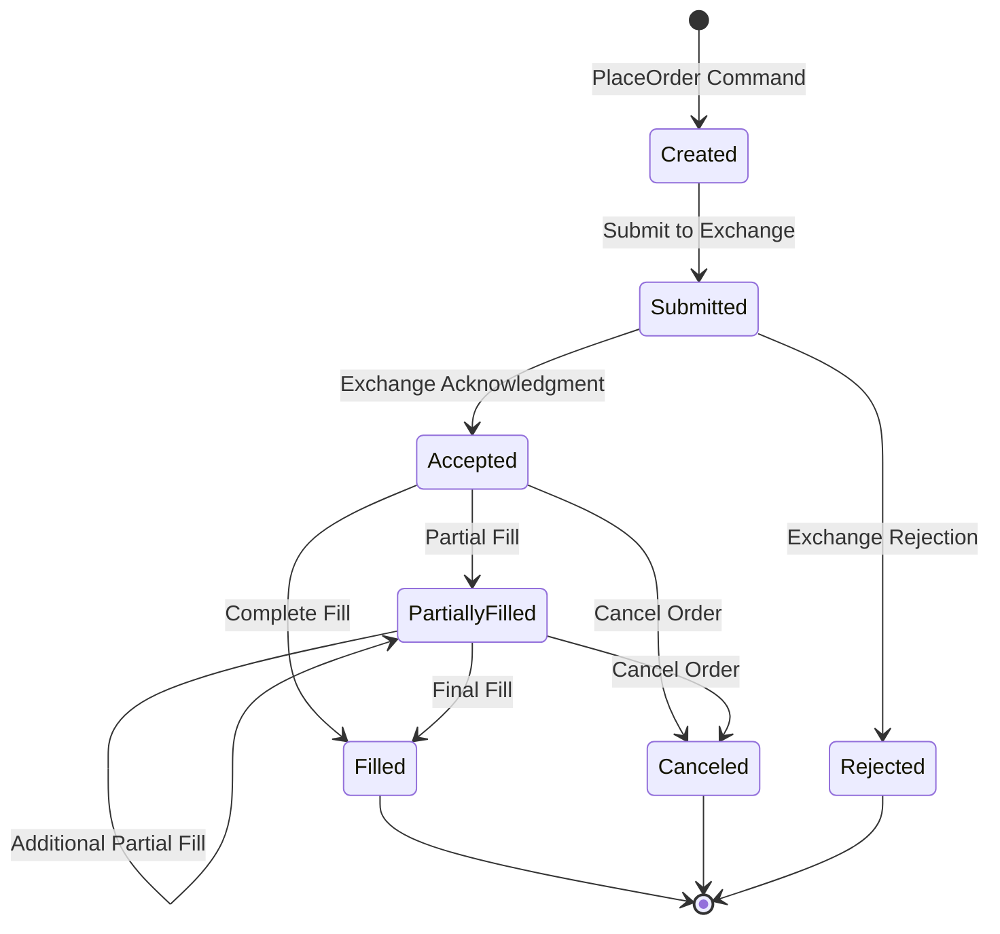
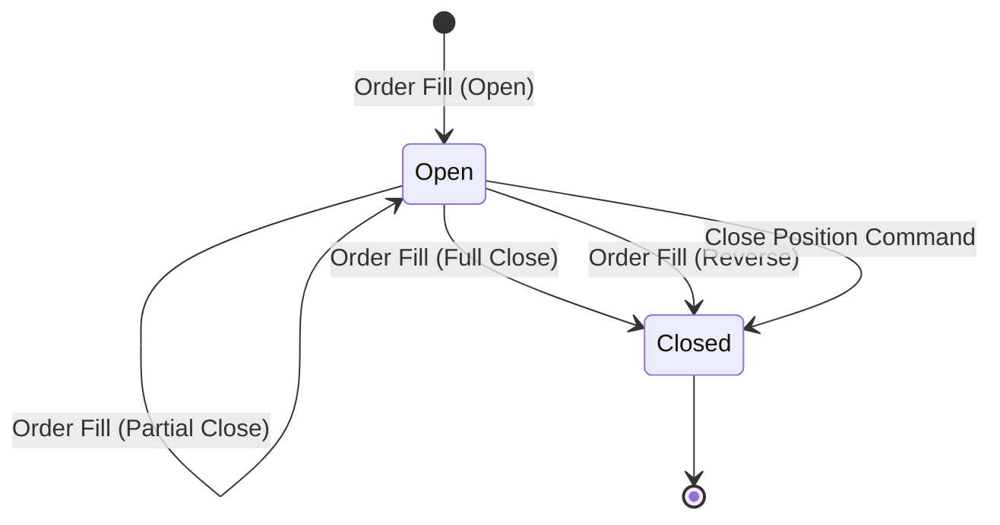
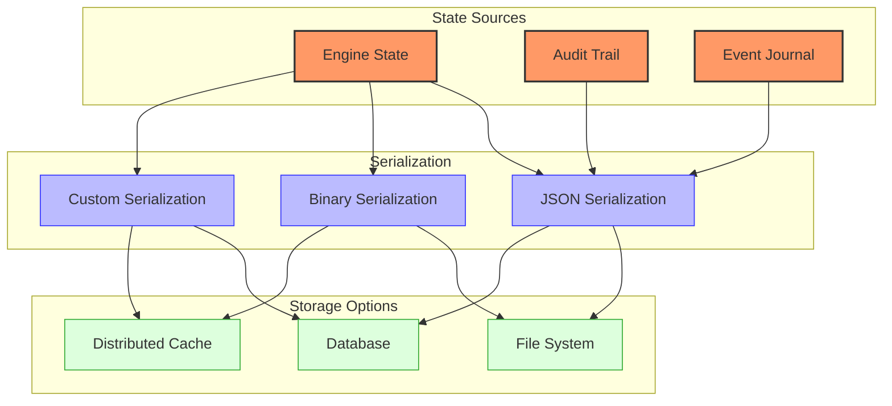
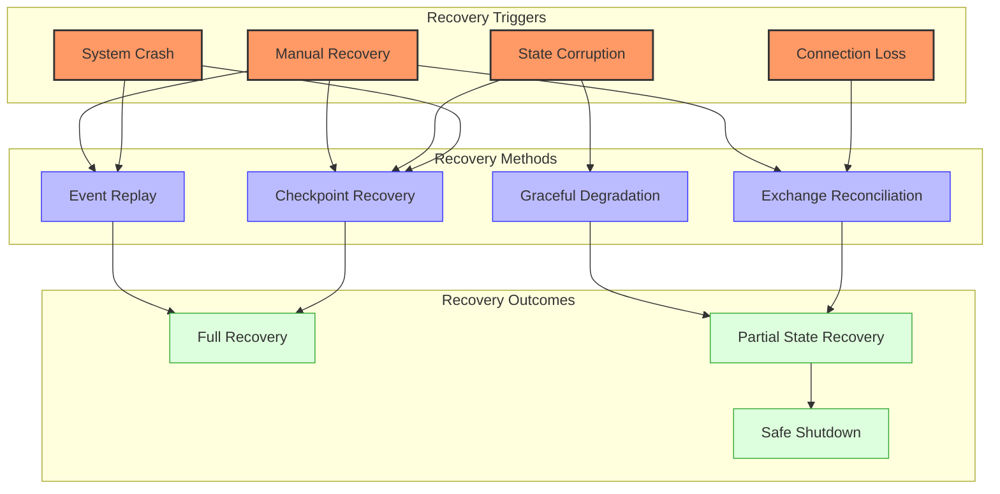
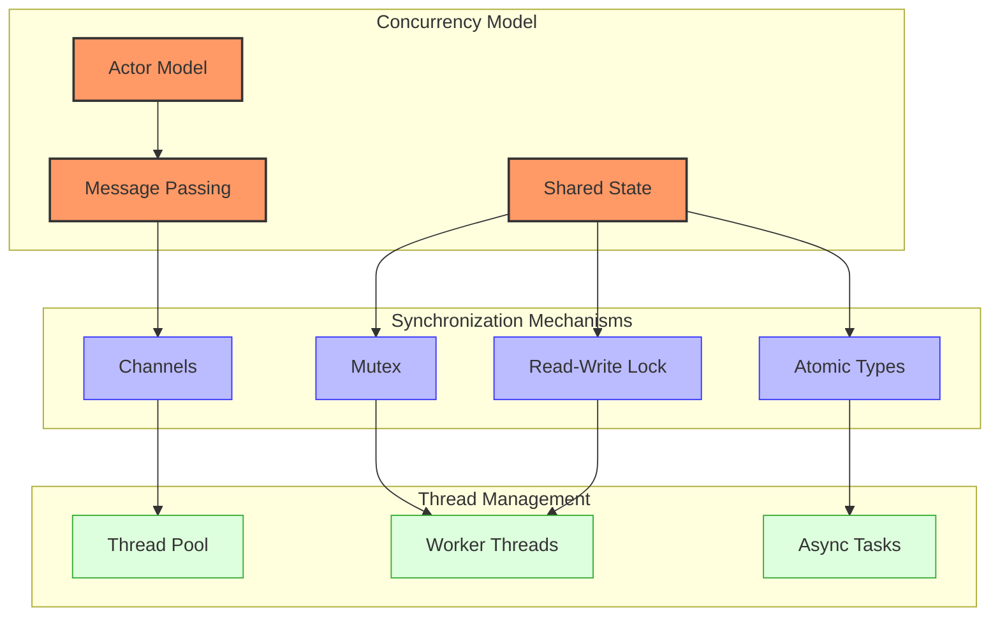

# Barter State Management

## State Model Overview

Barter implements a sophisticated state management system that maintains the current state of the trading engine, instruments, positions, orders, and other critical components. The state model is designed to be efficient, thread-safe, and easily accessible.



The state management in Barter is designed to be immutable and thread-safe, with all state updates flowing through the Engine component. This centralized approach ensures consistency and makes it easier to reason about the system's behavior.

## Core State Components

### EngineState



The `EngineState` is the central state container that holds all trading-related state. It is organized into several key components:

```rust
pub struct EngineState<GlobalData, InstrumentData> {
    /// Global data shared across all instruments.
    pub global: GlobalData,

    /// Map of instrument specific data indexed by InstrumentId.
    pub instruments: FnvHashMap<InstrumentId, InstrumentState<InstrumentData>>,

    /// Map of order specific data indexed by OrderId.
    pub orders: FnvHashMap<OrderId, OrderState>,

    /// Map of position specific data indexed by PositionId.
    pub positions: FnvHashMap<PositionId, PositionState>,

    /// Current trading state of the Engine.
    pub trading: TradingState,
}
```

The `EngineState` is generic over two types:

1. **GlobalData**: User-defined type for global state shared across all instruments
2. **InstrumentData**: User-defined type for instrument-specific state

This generic approach allows users to define their own state structures while maintaining type safety.

The `EngineState` provides methods for accessing and updating the various state components:

```rust
impl<GlobalData, InstrumentData> EngineState<GlobalData, InstrumentData> {
    /// Create a new EngineState with the given global data
    pub fn new(global: GlobalData) -> Self {
        Self {
            global,
            instruments: FnvHashMap::default(),
            orders: FnvHashMap::default(),
            positions: FnvHashMap::default(),
            trading: TradingState::Active,
        }
    }

    /// Get an instrument state by ID
    pub fn get_instrument(&self, instrument_id: &InstrumentId) -> Option<&InstrumentState<InstrumentData>> {
        self.instruments.get(instrument_id)
    }

    /// Get an order state by ID
    pub fn get_order(&self, order_id: &OrderId) -> Option<&OrderState> {
        self.orders.get(order_id)
    }

    /// Get a position state by ID
    pub fn get_position(&self, position_id: &PositionId) -> Option<&PositionState> {
        self.positions.get(position_id)
    }

    /// Update an instrument state
    pub fn update_instrument(&mut self, instrument: InstrumentState<InstrumentData>) {
        self.instruments.insert(instrument.instrument_id.clone(), instrument);
    }

    /// Update an order state
    pub fn update_order(&mut self, order: OrderState) {
        self.orders.insert(order.order_id.clone(), order);
    }

    /// Update a position state
    pub fn update_position(&mut self, position: PositionState) {
        self.positions.insert(position.position_id.clone(), position);
    }

    /// Set the trading state
    pub fn set_trading_state(&mut self, state: TradingState) {
        self.trading = state;
    }
}
```

### InstrumentState

Each instrument tracked by the system has its own `InstrumentState`:

```rust
pub struct InstrumentState<InstrumentData> {
    /// Instrument specific market data.
    pub market_data: InstrumentMarketData,

    /// Custom instrument specific data.
    pub data: InstrumentData,

    /// Map of active positions for this instrument indexed by PositionId.
    pub positions: FnvHashMap<PositionId, PositionId>,

    /// Map of active orders for this instrument indexed by OrderId.
    pub orders: FnvHashMap<OrderId, OrderId>,
}
```

### OrderState

The `OrderState` tracks the current state of each order:

```rust
pub struct OrderState {
    /// Order details.
    pub order: Order,

    /// Current status of the Order.
    pub status: OrderStatus,

    /// Filled quantity of the Order.
    pub filled_qty: Decimal,

    /// Average fill price of the Order.
    pub avg_fill_price: Option<Decimal>,

    /// Timestamp when the Order was last updated.
    pub last_updated: DateTime<Utc>,
}
```

### PositionState

The `PositionState` tracks the current state of each position:

```rust
pub struct PositionState {
    /// Position details.
    pub position: Position,

    /// Current status of the Position.
    pub status: PositionStatus,

    /// Current quantity of the Position.
    pub quantity: Decimal,

    /// Average entry price of the Position.
    pub avg_entry_price: Decimal,

    /// Current unrealized profit/loss of the Position.
    pub unrealized_pnl: Decimal,

    /// Realized profit/loss of the Position.
    pub realized_pnl: Decimal,

    /// Timestamp when the Position was last updated.
    pub last_updated: DateTime<Utc>,
}
```

## State Transitions and Triggers

### Trading State Transitions

The `TradingState` enum represents the current trading state of the engine:

```rust
pub enum TradingState {
    /// Normal trading operations.
    Active,

    /// Trading is completely halted, no new order commands will be emitted.
    Halted,

    /// Only order commands which would cancel order, or reduce position sizes are permitted.
    Reducing,
}
```



Transitions between these states are triggered by:

- **Command Events**: Explicit commands to change the trading state
  ```rust
  // Example of a SetTradingState command
  let command = Command::SetTradingState(TradingState::Halted);
  system.send_command(command);
  ```

- **Risk Management Decisions**: Automatic state changes based on risk rules
  ```rust
  impl RiskManager for MyRiskManager {
      fn check_order(&self, order: &OrderParams, state: &EngineState) -> RiskResult {
          // Check if drawdown exceeds threshold
          if self.calculate_drawdown(state) > self.max_drawdown {
              // Transition to Reducing state
              return RiskResult {
                  is_accepted: false,
                  trading_state: Some(TradingState::Reducing),
                  reason: Some("Maximum drawdown exceeded".to_string()),
              };
          }

          // Normal risk check
          // ...
      }
  }
  ```

- **System Events**: Automatic state changes in response to system events
  ```rust
  // Example of handling a system event
  fn handle_exchange_disconnection(&mut self) {
      // Transition to Halted state
      self.state.set_trading_state(TradingState::Halted);

      // Log the event
      tracing::warn!("Exchange disconnected, trading halted");

      // Attempt reconnection
      self.attempt_reconnection();
  }
  ```

### Order State Transitions



Orders go through several states during their lifecycle:

```rust
pub enum OrderStatus {
    /// Order has been created but not yet submitted to the exchange.
    Created,

    /// Order has been submitted to the exchange.
    Submitted,

    /// Order has been accepted by the exchange.
    Accepted,

    /// Order has been partially filled.
    PartiallyFilled,

    /// Order has been completely filled.
    Filled,

    /// Order has been canceled.
    Canceled,

    /// Order has been rejected by the exchange.
    Rejected,
}
```

Transitions are triggered by specific events:

- **Exchange Events**: Events from the exchange indicating order status changes
  ```rust
  // Example of processing an exchange event
  fn handle_exchange_event(&mut self, event: ExchangeEvent) {
      match event {
          ExchangeEvent::OrderAccepted { order_id, venue_id } => {
              // Update order status to Accepted
              if let Some(mut order) = self.state.get_order(&order_id).cloned() {
                  order.status = OrderStatus::Accepted;
                  order.venue_id = Some(venue_id);
                  self.state.update_order(order);
              }
          },
          ExchangeEvent::OrderFilled { order_id, quantity, price, .. } => {
              // Update order with fill information
              if let Some(mut order) = self.state.get_order(&order_id).cloned() {
                  order.filled_quantity += quantity;

                  // Update status based on fill amount
                  if order.filled_quantity >= order.quantity {
                      order.status = OrderStatus::Filled;
                  } else {
                      order.status = OrderStatus::PartiallyFilled;
                  }

                  self.state.update_order(order);
              }
          },
          // Other event types...
      }
  }
  ```

- **Command Events**: Explicit commands to place or cancel orders
  ```rust
  // Example of processing a cancel order command
  fn handle_cancel_order(&mut self, order_id: OrderId) {
      if let Some(mut order) = self.state.get_order(&order_id).cloned() {
          // Only cancel if the order is in a cancellable state
          if matches!(order.status, OrderStatus::Accepted | OrderStatus::PartiallyFilled) {
              // Send cancellation to exchange
              self.exchange.cancel_order(order_id.clone());

              // Update order status
              order.status = OrderStatus::Canceled;
              self.state.update_order(order);
          }
      }
  }
  ```

- **System Events**: Events triggered by system conditions
  ```rust
  // Example of handling a connection loss
  fn handle_connection_loss(&mut self) {
      // Mark all active orders as potentially stale
      for (order_id, order) in self.state.orders.iter_mut() {
          if matches!(order.status, OrderStatus::Submitted | OrderStatus::Accepted | OrderStatus::PartiallyFilled) {
              // Flag the order for reconciliation
              self.reconciliation_queue.push(order_id.clone());
          }
      }

      // Initiate reconciliation process
      self.reconcile_orders();
  }
  ```

### Position State Transitions



Positions also have a lifecycle represented by their status:

```rust
pub enum PositionStatus {
    /// Position is open.
    Open,

    /// Position is closed.
    Closed,
}
```

Transitions are triggered by specific events:

- **Order Fills**: Fill events that affect position size and direction
  ```rust
  // Example of updating a position based on a fill
  fn update_position(&mut self, fill: Fill) {
      let position_id = PositionId::new(fill.instrument_id.clone(), self.id.clone());

      // Check if position exists
      if let Some(mut position) = self.state.get_position(&position_id).cloned() {
          // Calculate new position size
          let fill_quantity = if fill.side == Side::Buy {
              fill.quantity
          } else {
              -fill.quantity
          };

          let new_quantity = position.quantity + fill_quantity;

          // Update position
          if new_quantity.is_zero() {
              // Position is closed
              position.status = PositionStatus::Closed;
              position.quantity = Decimal::zero();

              // Calculate realized PnL
              let realized_pnl = self.calculate_realized_pnl(&position, &fill);
              position.realized_pnl += realized_pnl;

              self.state.update_position(position);
          } else if new_quantity.signum() != position.quantity.signum() && !position.quantity.is_zero() {
              // Position direction has changed (e.g., long to short)

              // Close the old position
              let mut old_position = position.clone();
              old_position.status = PositionStatus::Closed;
              old_position.realized_pnl += self.calculate_realized_pnl(&old_position, &fill);
              self.state.update_position(old_position);

              // Create a new position in the opposite direction
              let new_position = PositionState {
                  position_id: position_id,
                  instrument_id: fill.instrument_id.clone(),
                  side: if new_quantity > Decimal::zero() { Side::Buy } else { Side::Sell },
                  quantity: new_quantity.abs(),
                  avg_entry_price: fill.price,
                  unrealized_pnl: Decimal::zero(),
                  realized_pnl: Decimal::zero(),
                  status: PositionStatus::Open,
                  timestamp: fill.timestamp,
              };

              self.state.update_position(new_position);
          } else {
              // Position size has changed but direction remains the same
              position.quantity = new_quantity.abs();
              position.avg_entry_price = self.calculate_new_avg_price(&position, &fill);
              self.state.update_position(position);
          }
      } else {
          // Create a new position
          let new_position = PositionState {
              position_id: position_id,
              instrument_id: fill.instrument_id.clone(),
              side: fill.side,
              quantity: fill.quantity,
              avg_entry_price: fill.price,
              unrealized_pnl: Decimal::zero(),
              realized_pnl: Decimal::zero(),
              status: PositionStatus::Open,
              timestamp: fill.timestamp,
          };

          self.state.update_position(new_position);
      }
  }
  ```

- **Command Events**: Explicit commands to close positions
  ```rust
  // Example of processing a close position command
  fn handle_close_position(&mut self, position_id: PositionId) {
      if let Some(position) = self.state.get_position(&position_id) {
          if position.status == PositionStatus::Open {
              // Create an order to close the position
              let order_params = OrderParams {
                  instrument_id: position.instrument_id.clone(),
                  order_type: OrderType::Market,
                  side: position.side.opposite(),
                  quantity: position.quantity,
                  price: None,
                  time_in_force: TimeInForce::GTC,
                  post_only: false,
                  reduce_only: true,
                  trigger_price: None,
                  trigger_type: None,
                  client_id: None,
              };

              // Submit the order
              let command = Command::PlaceOrder(order_params);
              self.send_command(command);
          }
      }
  }
  ```

## Persistence Mechanisms



Barter provides several mechanisms for persisting state:

### In-Memory State

The default state is maintained in memory for maximum performance. This approach provides the lowest latency but does not persist across restarts.

```rust
// Create a new in-memory engine state
let engine_state = EngineState::new(global_data);
```

### Audit Trail

When audit mode is enabled, all state changes are recorded in an audit trail. This provides a complete history of state changes that can be used for debugging, analysis, or recovery.

```rust
// Enable audit mode when building the system
let system_builder = SystemBuilder::new(/* ... */)
    .audit_mode(AuditMode::Record)
    .build()?;

// Access the audit trail
let audit_trail = system.audit_trail();

// Save the audit trail to a file
let audit_json = serde_json::to_string(&audit_trail)?;
std::fs::write("audit_trail.json", audit_json)?;
```

### Event Journal

The event journal records all events processed by the system. This can be used to replay events and reconstruct the state.

```rust
// Create an event journal
let mut journal = EventJournal::new("events.log")?;

// Record events
journal.record(&event)?;

// Replay events
journal.replay("events.log", |event| {
    // Process the event
    engine.process_event(event)
})?;
```

### State Serialization

The engine state can be serialized to various formats for persistence:

```rust
// Serialize engine state to JSON
let state_json = serde_json::to_string(&engine_state)?;

// Save to file
std::fs::write("engine_state.json", state_json)?;

// Load from file
let state_json = std::fs::read_to_string("engine_state.json")?;
let engine_state: EngineState<GlobalData, InstrumentData> = serde_json::from_str(&state_json)?;
```

### Database Integration

State can be persisted to a database through custom integrations:

```rust
// Example of database integration
struct DatabasePersistence {
    connection: Connection,
}

impl DatabasePersistence {
    pub fn new(connection_string: &str) -> Result<Self, Error> {
        let connection = Connection::connect(connection_string)?;
        Ok(Self { connection })
    }

    pub fn save_state(&self, state: &EngineState<GlobalData, InstrumentData>) -> Result<(), Error> {
        // Serialize state
        let state_json = serde_json::to_string(state)?;

        // Save to database
        self.connection.execute(
            "INSERT INTO engine_states (id, state, timestamp) VALUES (?, ?, ?)",
            params![Uuid::new_v4().to_string(), state_json, Utc::now()],
        )?;

        Ok(())
    }

    pub fn load_latest_state(&self) -> Result<EngineState<GlobalData, InstrumentData>, Error> {
        // Load from database
        let state_json: String = self.connection.query_row(
            "SELECT state FROM engine_states ORDER BY timestamp DESC LIMIT 1",
            params![],
            |row| row.get(0),
        )?;

        // Deserialize state
        let state = serde_json::from_str(&state_json)?;

        Ok(state)
    }
}
```

## Recovery Procedures



Barter implements several recovery procedures for handling state recovery:

### Checkpoint Recovery

Restore the complete system state from a saved checkpoint:

```rust
// Load state from a checkpoint
fn recover_from_checkpoint(&mut self, checkpoint_path: &str) -> Result<(), Error> {
    // Load the checkpoint file
    let state_json = std::fs::read_to_string(checkpoint_path)?;

    // Deserialize the state
    let state: EngineState<GlobalData, InstrumentData> = serde_json::from_str(&state_json)?;

    // Replace the current state
    self.state = state;

    // Log recovery
    tracing::info!("Recovered state from checkpoint: {}", checkpoint_path);

    Ok(())
}
```

### Exchange Reconciliation

Reconcile local state with exchange state to ensure consistency:

```rust
// Reconcile local state with exchange state
async fn reconcile_with_exchange(&mut self) -> Result<(), Error> {
    // Get all open orders from the exchange
    let exchange_orders = self.exchange.get_open_orders().await?;

    // Get all open orders from local state
    let local_orders: HashMap<String, OrderState> = self.state.orders
        .iter()
        .filter(|(_, order)| matches!(order.status, OrderStatus::Submitted | OrderStatus::Accepted | OrderStatus::PartiallyFilled))
        .filter_map(|(id, order)| {
            order.venue_id.as_ref().map(|venue_id| (venue_id.clone(), order.clone()))
        })
        .collect();

    // Find orders in local state but not on exchange
    for (venue_id, local_order) in local_orders.iter() {
        if !exchange_orders.contains_key(venue_id) {
            // Order exists locally but not on exchange
            // Update local state to mark as canceled
            let mut order = local_order.clone();
            order.status = OrderStatus::Canceled;
            self.state.update_order(order);

            tracing::warn!("Order {} exists locally but not on exchange, marked as canceled", local_order.order_id);
        }
    }

    // Find orders on exchange but not in local state
    for (venue_id, exchange_order) in exchange_orders.iter() {
        if !local_orders.contains_key(venue_id) {
            // Order exists on exchange but not locally
            // Create a new local order
            let order = OrderState {
                order_id: OrderId::new(),
                instrument_id: exchange_order.instrument_id.clone(),
                side: exchange_order.side,
                order_type: exchange_order.order_type,
                quantity: exchange_order.quantity,
                filled_quantity: exchange_order.filled_quantity,
                price: exchange_order.price,
                status: OrderStatus::Accepted,
                venue_id: Some(venue_id.clone()),
                client_id: exchange_order.client_id.clone(),
                timestamp: Utc::now(),
                fills: vec![],
            };

            self.state.update_order(order.clone());

            tracing::warn!("Order {} exists on exchange but not locally, added to local state", order.order_id);
        }
    }

    // Log reconciliation
    tracing::info!("Reconciled {} local orders with {} exchange orders", local_orders.len(), exchange_orders.len());

    Ok(())
}
```

### Event Replay

Replay events from the audit trail or event journal to reconstruct state:

```rust
// Replay events from a journal
fn recover_from_event_journal(&mut self, journal_path: &str) -> Result<(), Error> {
    // Create a new event journal
    let journal = EventJournal::new(journal_path)?;

    // Reset the state to initial values
    self.state = EngineState::new(GlobalData::default());

    // Replay all events
    journal.replay(journal_path, |event| {
        self.process_event(event)
    })?;

    // Log recovery
    tracing::info!("Recovered state by replaying events from: {}", journal_path);

    Ok(())
}
```

### Graceful Degradation

Continue operation with reduced functionality when full recovery is not possible:

```rust
// Perform graceful degradation
fn graceful_degradation(&mut self) -> Result<(), Error> {
    // Set trading state to reducing only
    self.state.trading = TradingState::Reducing;

    // Cancel all non-reducing orders
    for (order_id, order) in self.state.orders.iter() {
        if matches!(order.status, OrderStatus::Submitted | OrderStatus::Accepted | OrderStatus::PartiallyFilled) {
            if !order.reduce_only {
                // Cancel the order
                let command = Command::CancelOrder(order_id.clone());
                self.send_command(command);
            }
        }
    }

    // Log degradation
    tracing::warn!("Entered graceful degradation mode, trading state set to reducing only");

    // Notify operators
    self.notify_operators("System entered graceful degradation mode");

    Ok(())
}
```

## Thread Safety and Concurrency



Barter is designed with thread safety and concurrency in mind, leveraging Rust's ownership model and type system to prevent data races and ensure safe concurrent access to state.

### Concurrency Model

Barter uses a hybrid concurrency model that combines:

1. **Message Passing**: Components communicate through message passing using channels, which provides a safe way to share data between threads without shared mutable state.

2. **Shared State**: When shared state is necessary, it is protected by synchronization primitives like Mutex and RwLock.

3. **Actor Model**: The system follows an actor-like model where components process messages sequentially but can run concurrently with other components.

### Synchronization Mechanisms

```rust
// Example of using channels for message passing
let (tx, rx) = tokio::sync::mpsc::channel::<EngineEvent>(1000);

// Send events to the engine
tx.send(event).await?;

// Process events in the engine
while let Some(event) = rx.recv().await {
    engine.process_event(event)?;
}
```

```rust
// Example of using RwLock for shared state
let state = Arc::new(RwLock::new(EngineState::new(global_data)));

// Read access
let state_guard = state.read().await;
 let order = state_guard.get_order(&order_id);

// Write access
let mut state_guard = state.write().await;
state_guard.update_order(order);
```

### Thread Management

Barter uses Tokio for asynchronous runtime and thread management:

```rust
// Create a multi-threaded runtime
let runtime = tokio::runtime::Builder::new_multi_thread()
    .worker_threads(4)
    .enable_all()
    .build()?;

// Run the system
runtime.block_on(async {
    // Initialize components
    let engine = Engine::new(config);

    // Start processing
    engine.run().await
});
```

This approach allows Barter to efficiently utilize system resources while maintaining thread safety and preventing data races.

Barter is designed to be thread-safe and handle concurrent access to state:

1. **Immutable State** - The state is treated as immutable during processing
2. **State Cloning** - State is cloned when needed to avoid shared mutable access
3. **Message Passing** - Components communicate through message passing rather than shared state
4. **Atomic Operations** - Critical state updates use atomic operations
5. **Lock-Free Algorithms** - Where possible, lock-free algorithms are used for state updates

### Concurrency Example

```rust
// Engine processes events in a single thread to avoid concurrency issues
async fn process_event(&mut self, event: EngineEvent) -> Result<(), BarterError> {
    // Clone the current state to avoid shared mutable access
    let current_state = self.state.clone();

    // Process the event with the cloned state
    let (new_state, commands) = match event {
        EngineEvent::Market(market_event) => {
            self.process_market_event(market_event, &current_state)?
        }
        EngineEvent::Command(command_event) => {
            self.process_command_event(command_event, &current_state)?
        }
        // ...
    };

    // Update the state atomically
    self.state = new_state;

    // Execute commands
    for command in commands {
        self.execute_command(command).await?;
    }

    Ok(())
}
```

This approach ensures that state updates are atomic and consistent, even in a concurrent environment.
