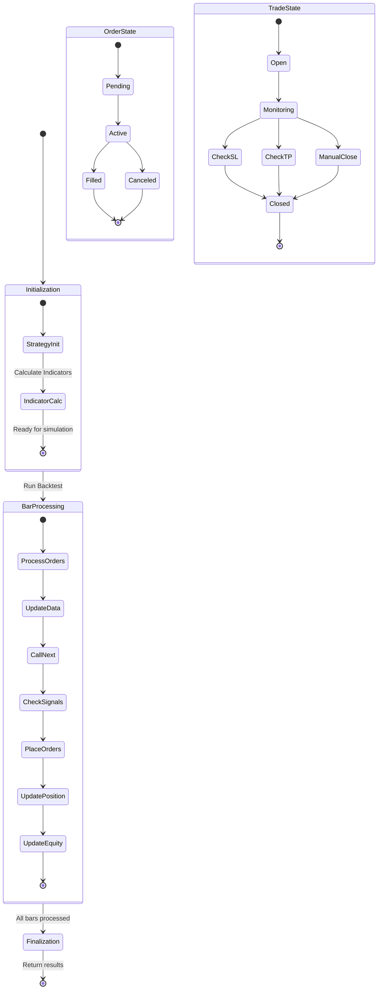

# Backtesting.py State Management

This document details how Backtesting.py manages state throughout the backtesting process. Understanding the state model is essential for developing effective trading strategies and properly utilizing the framework's capabilities.

## State Model Overview

```mermaid
classDiagram
    class Backtest {
        +data
        +strategy_cls
        +cash
        +commission
        +margin
        +trade_on_close
        +hedging
        +exclusive_orders
        +run()
        +optimize()
        +plot()
    }
    
    class Strategy {
        +data
        +position
        +equity
        +orders
        +trades
        +closed_trades
        +init()
        +next()
        +buy()
        +sell()
        +I()
    }
    
    class Order {
        +size
        +limit
        +stop
        +sl
        +tp
        +tag
        +is_long
        +is_short
        +is_contingent
        +cancel()
    }
    
    class Trade {
        +size
        +entry_price
        +entry_time
        +entry_bar
        +exit_price
        +exit_time
        +exit_bar
        +pl
        +pl_pct
        +value
        +sl
        +tp
        +tag
        +is_long
        +is_short
        +close()
    }
    
    class Position {
        +size
        +pl
        +pl_pct
        +is_long
        +is_short
        +close()
    }
    
    Backtest --> Strategy : creates
    Strategy --> Order : creates
    Order --> Trade : becomes
    Trade --> Position : affects
```



## Core State Components

Backtesting.py maintains several key state components throughout the backtesting process:

### 1. Backtest State

The `Backtest` class maintains the overall simulation state, including:

- **Configuration parameters**: Initial cash, commission, margin, etc.
- **Data**: The price data being used for the backtest
- **Strategy instance**: The active strategy being tested
- **Results**: Performance statistics and equity curve

### 2. Strategy State

The `Strategy` class maintains the trading logic state, including:

- **Data access**: Current and historical price data
- **Indicators**: Technical indicators calculated from price data
- **Position**: Current market position
- **Orders**: Pending orders waiting to be filled
- **Trades**: Active and closed trades
- **Equity**: Current account equity (cash + position value)

### 3. Order State

The `Order` class represents orders with states including:

- **Pending**: Order has been created but not yet processed
- **Active**: Order is being checked against market conditions
- **Filled**: Order has been executed and converted to a trade
- **Canceled**: Order has been canceled

### 4. Trade State

The `Trade` class represents executed trades with states including:

- **Active**: Trade is currently open
- **Closed**: Trade has been closed (either manually or by stop-loss/take-profit)

### 5. Position State

The `Position` class represents the current market exposure with states including:

- **Flat**: No position (size = 0)
- **Long**: Long position (size > 0)
- **Short**: Short position (size < 0)

## State Transitions



### Key State Transitions

1. **Initialization to Bar Processing**:
   - Backtest is created with data and strategy
   - Strategy is initialized and indicators are calculated
   - Bar-by-bar processing begins

2. **Order State Transitions**:
   - Order is created via `buy()` or `sell()`
   - Order is processed based on its type (market, limit, stop)
   - Order is filled when conditions are met or canceled

3. **Trade State Transitions**:
   - Trade is created when an order is filled
   - Trade is monitored for stop-loss and take-profit conditions
   - Trade is closed when exit conditions are met

4. **Position State Transitions**:
   - Position changes when trades are opened or closed
   - Position size increases or decreases based on trade size
   - Position profit/loss is continuously updated

## State Persistence Mechanisms

Backtesting.py maintains state in memory during the backtesting process. The framework does not persist state between backtest runs, but it does provide mechanisms to access and analyze state after a backtest completes:

1. **Results Series**: The `run()` method returns a pandas Series containing performance statistics and references to internal state objects.

2. **Equity Curve**: The equity curve is stored in the results as `_equity_curve` and can be accessed for further analysis.

3. **Trades List**: Completed trades are stored in the results as `_trades` and can be analyzed for performance evaluation.

## State Recovery Procedures

Since Backtesting.py is primarily an in-memory backtesting framework, there are no built-in state recovery procedures. However, users can implement their own state persistence and recovery by:

1. Saving backtest results to disk using pandas functionality
2. Storing strategy parameters and configurations
3. Implementing custom logging of state transitions

## Thread Safety and Concurrency

Backtesting.py is not designed for concurrent execution within a single backtest. However, it provides mechanisms for parallel processing in certain scenarios:

1. **Parameter Optimization**: The `optimize()` method can utilize parallel processing for evaluating different parameter combinations.

2. **Multiple Backtests**: Multiple independent backtest instances can be run in parallel using Python's multiprocessing capabilities.

3. **MultiBacktest Class**: The `MultiBacktest` class in `backtesting.lib` allows running the same strategy on multiple instruments in parallel.

## State Access Patterns

### Accessing State in Strategy.init()

During initialization, the strategy has access to:

- Full historical data for indicator calculation
- Configuration parameters
- Initial cash and account settings

Example:
```python
def init(self):
    # Access full data for indicator calculation
    self.sma = self.I(SMA, self.data.Close, 20)
    
    # Access configuration parameters
    self.initial_cash = self.equity
```

### Accessing State in Strategy.next()

During bar-by-bar processing, the strategy has access to:

- Data up to the current bar
- Current position and equity
- Active orders and trades

Example:
```python
def next(self):
    # Access current position
    if not self.position:
        # No position, check for entry
        if self.sma[-1] > self.data.Close[-1]:
            self.buy()
    else:
        # Have position, check for exit
        if self.sma[-1] < self.data.Close[-1]:
            self.position.close()
```

### Accessing State After Backtest

After the backtest completes, results can be accessed:

```python
stats = bt.run()

# Access equity curve
equity_curve = stats['_equity_curve']

# Access trades
trades = stats['_trades']

# Access performance metrics
sharpe = stats['Sharpe Ratio']
drawdown = stats['Max. Drawdown [%]']
```

## State Management Examples

### Managing Multiple Positions (with hedging)

```python
# Enable hedging in backtest
bt = Backtest(data, MyStrategy, cash=10000, hedging=True)

# In strategy
def next(self):
    # Open long position
    if long_condition:
        self.buy(tag='long')
    
    # Open short position (can coexist with long)
    if short_condition:
        self.sell(tag='short')
    
    # Close specific positions by tag
    for trade in self.trades:
        if trade.tag == 'long' and exit_long_condition:
            trade.close()
        elif trade.tag == 'short' and exit_short_condition:
            trade.close()
```

### Managing Stop-Loss and Take-Profit Levels

```python
def next(self):
    # Enter position with initial stop-loss and take-profit
    if entry_condition:
        self.buy(sl=self.data.Close[-1] * 0.95,
                 tp=self.data.Close[-1] * 1.10)
    
    # Dynamically update stop-loss (trailing stop)
    for trade in self.trades:
        if trade.is_long:
            new_sl = max(trade.sl or 0, self.data.Close[-1] * 0.95)
            trade.sl = new_sl
```

### State Management with Multiple Timeframes

```python
def init(self):
    # Calculate indicators on different timeframes
    self.daily_sma = resample_apply('1D', SMA, self.data.Close, 20)
    self.hourly_sma = self.I(SMA, self.data.Close, 50)

def next(self):
    # Use indicators from multiple timeframes for decision making
    if (self.data.Close[-1] > self.daily_sma[-1] and 
        self.data.Close[-1] > self.hourly_sma[-1]):
        self.buy()
    elif (self.data.Close[-1] < self.daily_sma[-1] and 
          self.data.Close[-1] < self.hourly_sma[-1]):
        self.position.close()
```

## Common State Management Patterns

### 1. Signal-Based State Management

Using the `SignalStrategy` from `backtesting.lib` to manage state based on signals:

```python
from backtesting.lib import SignalStrategy

class MySignalStrategy(SignalStrategy):
    def init(self):
        super().init()
        self.sma1 = self.I(SMA, self.data.Close, 10)
        self.sma2 = self.I(SMA, self.data.Close, 20)
        
        # Set entry/exit signals
        self.set_signal(
            entry_size=1.0,  # Long entry when sma1 > sma2
            exit_portion=1.0,  # Full exit when sma1 < sma2
            plot=True
        )
```

### 2. Trailing Stop-Loss Management

Using the `TrailingStrategy` from `backtesting.lib` to manage trailing stops:

```python
from backtesting.lib import TrailingStrategy

class MyTrailingStrategy(TrailingStrategy):
    def init(self):
        super().init()
        self.sma = self.I(SMA, self.data.Close, 20)
        
        # Set trailing stop as 2x ATR
        self.set_trailing_sl(2)
        
    def next(self):
        super().next()
        
        if not self.position and self.data.Close[-1] > self.sma[-1]:
            self.buy()
```

### 3. Position Sizing Based on Volatility

Adjusting position size based on market volatility:

```python
def init(self):
    self.atr = self.I(ATR, self.data.High, self.data.Low, self.data.Close, 14)

def next(self):
    if entry_condition:
        # Size position inversely to volatility
        risk_pct = 0.02  # Risk 2% of equity
        price = self.data.Close[-1]
        stop_price = price - 2 * self.atr[-1]
        risk_per_share = price - stop_price
        
        # Calculate position size
        pos_size = (self.equity * risk_pct) / risk_per_share
        
        # Enter position with calculated size and stop-loss
        self.buy(size=pos_size, sl=stop_price)
```

## Conclusion

Backtesting.py provides a comprehensive state management system that allows for flexible and powerful strategy development. By understanding how the framework manages and transitions state, developers can create more effective and realistic trading strategies while avoiding common pitfalls like look-ahead bias and improper position management.
