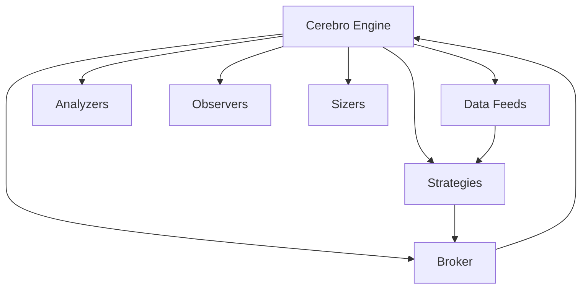
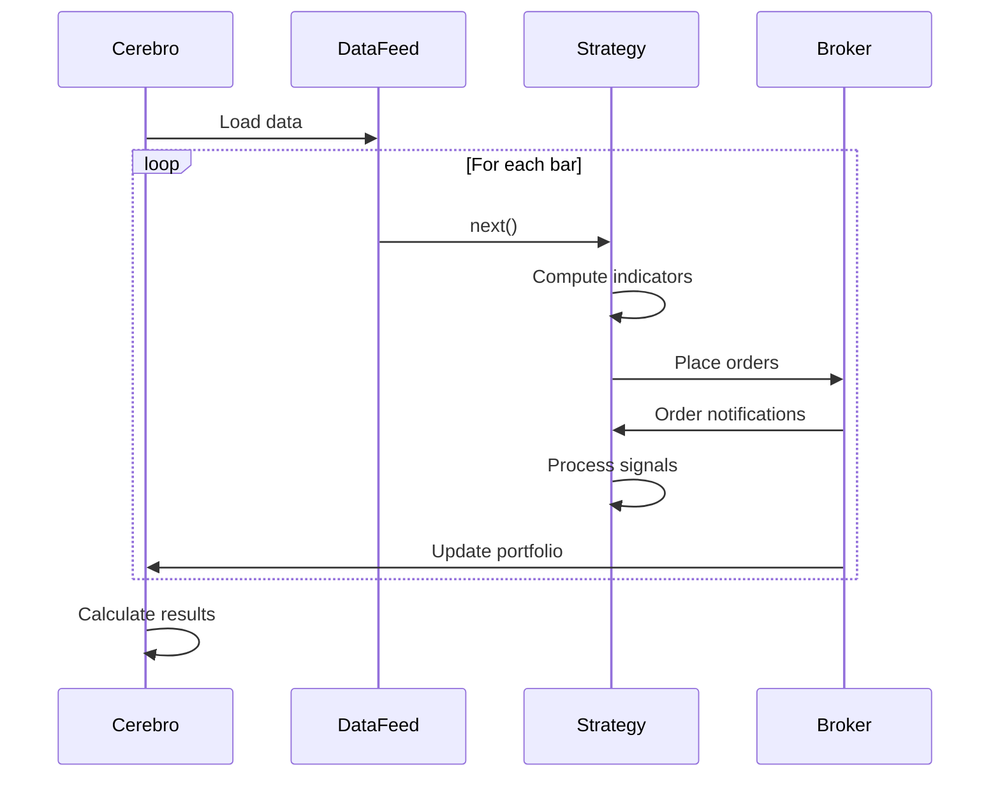

# Backtrader Trading System

## Overview

Backtrader is a Python library for backtesting trading strategies. It provides a comprehensive framework for implementing, testing, and analyzing trading strategies with high-level abstractions and extensive functionality.

## System Architecture

Backtrader follows a modular architecture with the following key components:



### Core Components

1. **Cerebro**: The central engine that coordinates all operations
2. **Data Feeds**: Sources of market data (CSV, Pandas, live feeds)
3. **Strategies**: Trading logic implementation
4. **Broker**: Order execution and portfolio management
5. **Analyzers**: Performance metrics calculation
6. **Observers**: Real-time monitoring of values during execution
7. **Sizers**: Position sizing mechanisms

## Event Flow

Backtrader follows a strict event-based model for processing data and executing strategies:



## Performance Characteristics

### Strengths

- **Ease of Use**: Simple API with intuitive abstractions
- **Flexibility**: Extensible architecture for custom components
- **Visualization**: Built-in plotting capabilities
- **Comprehensive**: Includes many indicators, analyzers, and tools
- **Community**: Active community with good documentation

### Limitations

- **Performance**: Python-based implementation can be slower for high-frequency strategies
- **Scalability**: Memory usage increases with data size and complexity
- **Live Trading**: Limited broker integrations compared to some alternatives

## Benchmark Results

The benchmark implementation uses a simple moving average crossover strategy:
- Entry signal: SMA(50) crosses above SMA(500)
- Exit signal: SMA(50) crosses below SMA(500)
- Trading 1 BTC per signal
- Initial capital: 10,000,000 USD
- Commission: 0.1% (10 basis points)
- Timeframe: Jan 1, 2024 to Dec 31, 2024 (1-minute data)

Performance metrics measured:
- Execution time
- Final portfolio value
- Profit/Loss
- Sharpe ratio
- Maximum drawdown
- Win rate

## Usage Example

```python
# Create Cerebro engine
cerebro = bt.Cerebro()

# Add strategy
cerebro.addstrategy(SMACrossoverStrategy)

# Set broker parameters
cerebro.broker.setcash(10_000_000)  # 10M initial capital
cerebro.broker.setcommission(commission=0.001)  # 0.1% commission

# Add data feed
data = bt.feeds.PandasData(dataname=df)
cerebro.adddata(data)

# Add analyzers
cerebro.addanalyzer(bt.analyzers.SharpeRatio, _name='sharpe')
cerebro.addanalyzer(bt.analyzers.DrawDown, _name='drawdown')

# Run backtest
results = cerebro.run()
```

## Comparison Notes

When compared to other trading systems:

1. **Ease of Development**:
   - Backtrader has a well-designed API that is easy to understand
   - Strategy implementation is intuitive with clear lifecycle methods

2. **Performance**:
   - Python-based implementation may not be suitable for high-frequency strategies
   - Memory usage can be significant with large datasets

3. **Extensibility**:
   - Highly extensible with a component-based architecture
   - Easy to develop custom indicators, analyzers, and data feeds

4. **Live Trading**:
   - Supports limited number of brokers for live trading
   - Primarily focused on backtesting capabilities

For ultra-low-latency trading requirements, Rust or C++-based systems would be more suitable than Backtrader's Python implementation. 