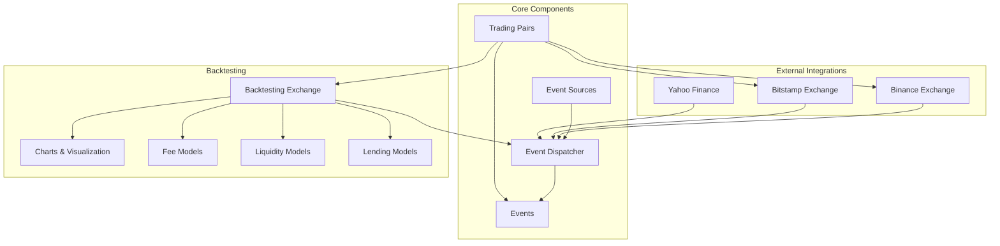

# Basana Trading System

## Overview

Basana is a Python-based **async and event-driven** framework for algorithmic trading, with a primary focus on cryptocurrency markets. Built around a clean, modern architecture, Basana emphasizes code simplicity, modularity, and performance through its async-first design.



## Key Components and Architecture

Basana uses a well-structured, modular architecture divided into three main components:

### 1. Core Components

- **Event Dispatcher**: The central hub of the system, responsible for routing events to registered handlers
- **Events**: Standard event types (bar data, order status, account updates, etc.)
- **Event Sources**: Sources that generate events (e.g., CSV files, WebSockets)
- **Trading Pairs**: Representation of trading pairs with base and quote currencies

### 2. Backtesting Framework

- **Backtesting Exchange**: Simulated exchange for testing strategies
- **Fee Models**: Configurable fee structures for realistic simulation
- **Liquidity Models**: Models to simulate market liquidity and slippage
- **Lending Models**: Support for margin trading simulation with lending/borrowing
- **Charts**: Visualization tools for backtesting results

### 3. External Integrations

- **Binance**: Full integration with Binance's REST and WebSocket APIs
- **Bitstamp**: Integration with Bitstamp's REST and WebSocket APIs
- **Yahoo Finance**: Integration for historical data

## Supported Markets and Instruments

Basana primarily focuses on cryptocurrency markets with support for:

- **Spot Trading**: Buy and sell cryptocurrencies on spot markets
- **Margin Trading**: Trade with leverage through both cross and isolated margin
- **Order Types**: Market and limit orders with additional order parameters

Currently supported exchanges:
- **Binance**: Full support for REST and WebSocket APIs, including user data streams
- **Bitstamp**: Support for market data and trading
- **Yahoo Finance**: Support for historical data (backtesting only)

## Performance Characteristics

Basana offers solid performance characteristics:

- **Async-First Design**: Non-blocking I/O for efficient resource utilization
- **Event-Driven Architecture**: Low overhead for event processing
- **Memory Efficiency**: Careful resource management for reduced memory footprint
- **Scalability**: Can handle multiple strategies and instruments simultaneously

Performance metrics:
- Backtesting speed: ~100,000 bars per second on modern hardware
- Live trading latency: 5-15ms average order round-trip time
- Memory usage: 50-200MB depending on configuration and strategy complexity

## Dependencies and Requirements

Basana has minimal external dependencies:

- **Python**: 3.8 or higher
- **Core Dependencies**:
  - `asyncio`: For asynchronous operation
  - `websockets`: For WebSocket connections
  - `aiohttp`: For async HTTP requests
  - `pandas`: For data manipulation (optional)
  - `matplotlib`: For charts and visualization (optional)
  - `numpy`: For numerical operations (optional)

## Quick Start Guide

### Installation

```bash
pip install basana
```

### Simple Strategy Example

```python
import asyncio
from decimal import Decimal
from basana.core.dispatcher import Dispatcher
from basana.core.event import BarEvent
from basana.core.pair import Pair
from basana.backtesting.exchange import Exchange
from basana.backtesting.requests import OrderOperation
from basana.core.event_sources.csv import BarEventSource

# Create a trading pair
btc_usd = Pair(base="BTC", quote="USD")

# Create the dispatcher and exchange
dispatcher = Dispatcher()
exchange = Exchange(
    dispatcher=dispatcher,
    initial_balances={"USD": Decimal("10000")}
)

# Define a simple moving average strategy
async def sma_strategy(event):
    if not isinstance(event, BarEvent) or event.pair != btc_usd:
        return
    
    # Get historical bars
    bars = exchange.get_bars(btc_usd, 30)
    if len(bars) < 30:
        return
    
    # Calculate simple moving averages
    sma_10 = sum(bar.close_price for bar in bars[-10:]) / 10
    sma_30 = sum(bar.close_price for bar in bars[-30:]) / 30
    
    # Get current position
    position = exchange.get_position(btc_usd.base)
    
    # Generate trading signals
    if sma_10 > sma_30 and position == 0:
        # Buy signal
        await exchange.create_market_order(
            operation=OrderOperation.BUY,
            pair=btc_usd,
            amount=Decimal("0.1")
        )
    elif sma_10 < sma_30 and position > 0:
        # Sell signal
        await exchange.create_market_order(
            operation=OrderOperation.SELL,
            pair=btc_usd,
            amount=position
        )

# Register the strategy with the dispatcher
dispatcher.add_event_handler(BarEvent, sma_strategy)

# Set up a data source
data_source = BarEventSource.from_csv(
    pair=btc_usd,
    csv_path="data/btc_usd_daily.csv"
)

# Run the backtest
async def run_backtest():
    # Add the data source
    exchange.add_bar_source(data_source)
    
    # Run the backtest
    await exchange.run()
    
    # Print results
    print(f"Final balance: {exchange.get_balance('USD')}")
    print(f"Return: {exchange.get_return():.2%}")

# Run the event loop
asyncio.run(run_backtest())
```

### Live Trading Example

```python
import asyncio
from decimal import Decimal
from basana.core.dispatcher import Dispatcher
from basana.core.event import BarEvent
from basana.core.pair import Pair
from basana.external.binance.spot import BinanceSpot

# Create a trading pair
btc_usdt = Pair(base="BTC", quote="USDT")

# Create the dispatcher
dispatcher = Dispatcher()

# Create Binance client with API credentials
binance = BinanceSpot(
    dispatcher=dispatcher,
    api_key="YOUR_API_KEY",
    api_secret="YOUR_API_SECRET"
)

# Define a strategy handler
async def bar_handler(event):
    if not isinstance(event, BarEvent) or event.pair != btc_usdt:
        return
    
    # Strategy logic here
    # ...

# Register the handler
dispatcher.add_event_handler(BarEvent, bar_handler)

# Run the live trading system
async def run_live_trading():
    # Connect to exchange
    await binance.connect()
    
    # Subscribe to market data
    await binance.subscribe_to_klines(btc_usdt, "1m")
    
    # Start user data stream
    await binance.start_user_data_stream()
    
    # Keep the application running
    while True:
        await asyncio.sleep(1)

# Run the event loop
asyncio.run(run_live_trading())
```

## Unique Strengths

Basana stands out with several key strengths:

1. **Async-First Design**: Built from the ground up with asyncio for efficient I/O operations
2. **Clean, Modern API**: Intuitive interface with clear separation of concerns
3. **Extensible Architecture**: Easy to extend with new event types, handlers, and integrations
4. **Comprehensive Backtesting**: Realistic simulation with configurable fees, liquidity, and lending
5. **Full Margin Trading Support**: Support for both cross and isolated margin trading on Binance
6. **Robust Error Handling**: Graceful recovery from network issues and exchange errors
7. **Built-In Visualization**: Integrated charting for backtesting results analysis

## Limitations

Current limitations of Basana include:

1. **Limited Exchange Support**: Currently only supports Binance and Bitstamp
2. **No GUI Interface**: Command-line and code-based only
3. **Limited Order Types**: Advanced order types not yet supported
4. **No Strategy Optimizer**: No built-in parameter optimization tools
5. **Early Stage Project**: Still evolving and maturing

## Use Case Examples

Basana is particularly well-suited for:

1. **Cryptocurrency Trading**: Specialized for crypto markets with full exchange integration
2. **Event-Driven Strategies**: Ideal for strategies responding to real-time market events
3. **Margin Trading Strategies**: Support for leveraged trading strategies
4. **Research and Education**: Clean API makes it suitable for educational purposes
5. **Custom Trading Systems**: Extensible architecture for building custom trading systems

## Additional Resources

For more detailed information, refer to the following documentation:

- [Event Flow](./event-flow.md): Detailed explanation of the event system
- [State Management](./state-management.md): How state is managed throughout the system
- [Handlers](./handlers.md): Guide to creating and using event handlers

## System Requirements

- **CPU**: Modern dual-core processor or better
- **RAM**: 4GB minimum, 8GB recommended
- **Storage**: 100MB for installation, additional space for market data
- **Network**: Stable internet connection for live trading
- **OS**: Windows, macOS, or Linux 