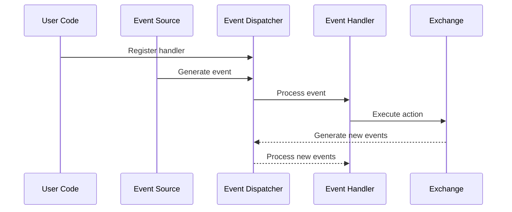
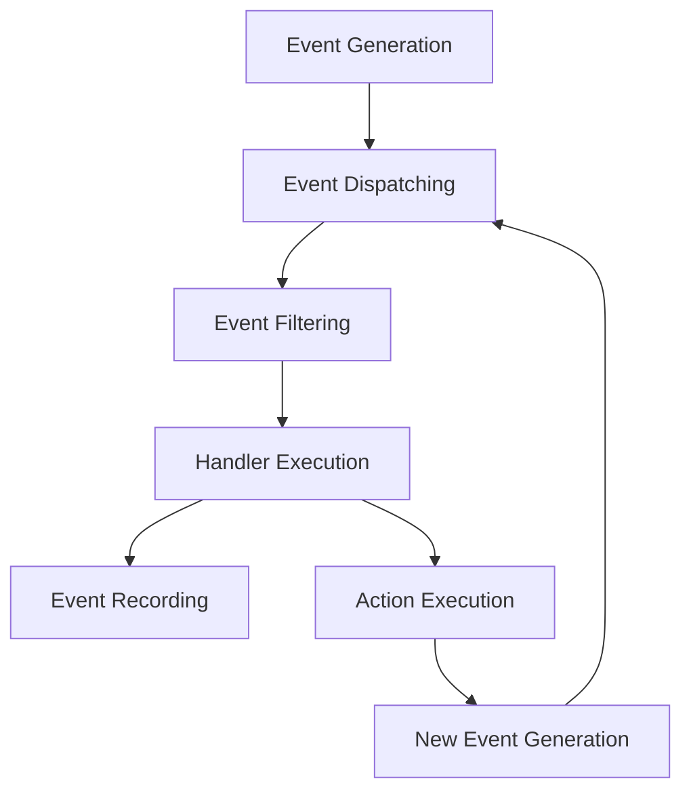
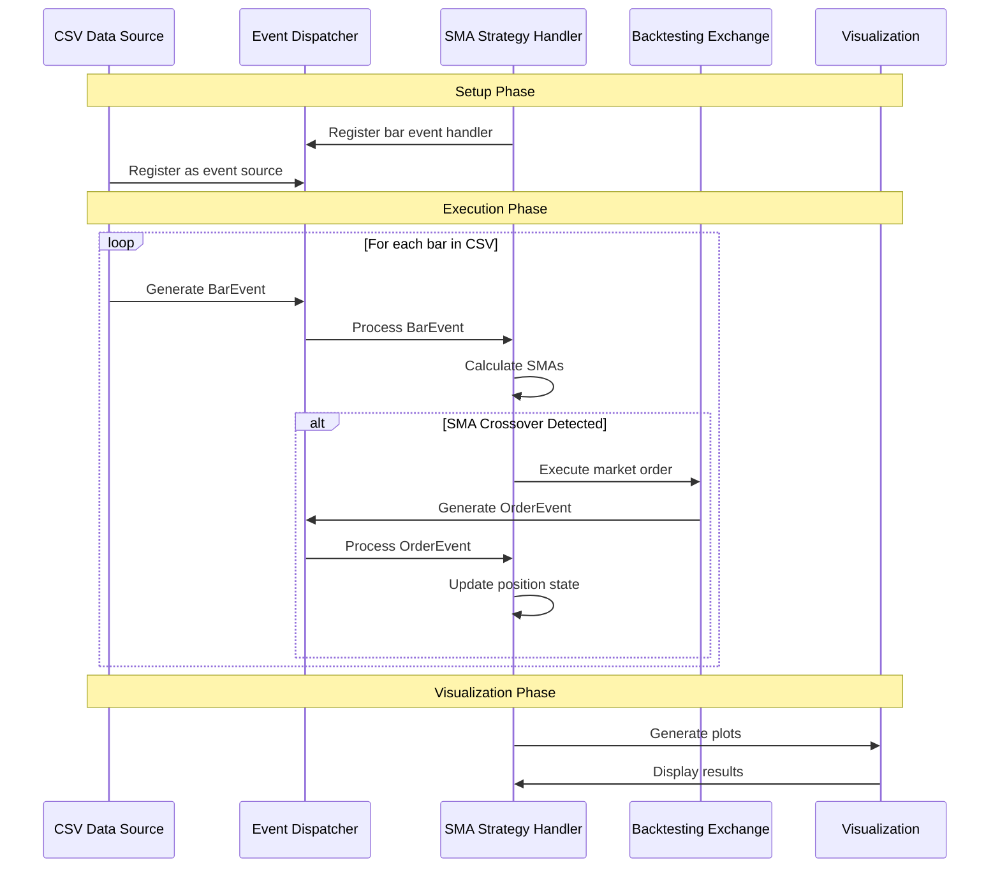

# Basana Event Flow

## Event Flow Overview

Basana implements a comprehensive event-driven architecture where trading strategies respond to various events such as price updates, order status changes, and custom events. The event system is built on top of Python's asynchronous programming model, using `asyncio` for non-blocking operations.



The event flow in Basana follows a clean publish-subscribe pattern, where event sources publish events to the dispatcher, and handlers subscribe to specific event types. This design allows for loose coupling between components and makes the system highly extensible.

## Event Types and Purposes

Basana defines several core event types, each serving a specific purpose:

### 1. `Event` (Base Class)

The abstract base class for all events in the system:

```python
class Event(metaclass=abc.ABCMeta):
    """Base class for all events."""
    
    @property
    @abc.abstractmethod
    def type(self) -> str:
        """Returns the event type."""
        pass
```

### 2. `BarEvent`

Events representing time-based price bars (OHLCV):

```python
class BarEvent(Event):
    """A bar event carrying price and volume information for a specific time period."""

    def __init__(self, bar: Bar, when: Optional[datetime.datetime] = None):
        self.__bar = bar
        self.__when = when if when is not None else datetime.datetime.now()

    @property
    def type(self) -> str:
        return "BAR"

    @property
    def bar(self) -> Bar:
        """Returns the bar."""
        return self.__bar

    @property
    def when(self) -> datetime.datetime:
        """Returns the datetime when the event was generated."""
        return self.__when

    @property
    def pair(self) -> Pair:
        """Returns the trading pair that the bar belongs to."""
        return self.bar.pair
```

Bar events are used for:
- Technical analysis calculations
- Trading signal generation
- Chart updates
- Strategy execution based on price patterns

### 3. `OrderEvent`

Events representing order status updates:

```python
class OrderEvent(Event):
    """An event for order updates."""

    def __init__(self, order_info: OrderInfo, when: Optional[datetime.datetime] = None):
        self.__order_info = order_info
        self.__when = when if when is not None else datetime.datetime.now()

    @property
    def type(self) -> str:
        return "ORDER"

    @property
    def order_info(self) -> OrderInfo:
        """Returns the order info."""
        return self.__order_info

    @property
    def when(self) -> datetime.datetime:
        """Returns the datetime when the event was generated."""
        return self.__when
```

Order events are used for:
- Tracking order lifecycle (created, filled, canceled, rejected)
- Position management
- Risk management
- Trade tracking and accounting

### 4. Custom Events

Basana allows for creating custom event types by subclassing the `Event` base class:

```python
class CustomEvent(Event):
    def __init__(self, data, when=None):
        self.__data = data
        self.__when = when if when is not None else datetime.datetime.now()

    @property
    def type(self) -> str:
        return "CUSTOM"

    @property
    def data(self):
        return self.__data

    @property
    def when(self) -> datetime.datetime:
        return self.__when
```

Custom events can be used for:
- External data integration
- Timer-based events
- System notifications
- Interprocess communication

## Event Processing Sequence

The event processing sequence in Basana follows a well-defined path:



### 1. Event Generation

Events can be generated from various sources:

```python
# Bar event generation from CSV data
bar_source = BarEventSource.from_csv(
    pair=pair,
    csv_path="data/btc_usd_daily.csv",
    timestamp_column="timestamp",
    timestamp_format="%Y-%m-%d",
    open_column="open",
    high_column="high",
    low_column="low",
    close_column="close",
    volume_column="volume"
)

# Order event generation from exchange
async def place_order():
    order = await exchange.create_market_order(OrderOperation.BUY, pair, amount)
    # This will generate an OrderEvent in the dispatcher
```

### 2. Event Dispatching

The dispatcher routes events to registered handlers:

```python
# Register a handler for bar events
dispatcher.add_event_handler(BarEvent, on_bar_event)

# Dispatch an event
await dispatcher.dispatch(event)
```

### 3. Event Filtering

Handlers can filter events based on their properties:

```python
async def on_bar_event(event: Event):
    # Only process BarEvent for BTC/USD pair
    if not isinstance(event, BarEvent):
        return
    
    if event.pair != Pair("BTC", "USD"):
        return
    
    # Process the relevant event
    # ...
```

### 4. Handler Execution

Event handlers are executed asynchronously:

```python
async def on_bar_event(event: Event):
    if not isinstance(event, BarEvent):
        return
    
    # Execute trading logic
    close_price = event.bar.close_price
    
    # Make trading decisions
    if close_price > moving_average:
        await buy_signal()
    else:
        await sell_signal()
```

### 5. Action Execution

Handlers can trigger actions on exchanges or other components:

```python
async def buy_signal():
    # Calculate position size
    balance = await exchange.get_balance("USD")
    amount = balance.available / price * Decimal("0.95")
    
    # Execute the order
    await exchange.create_market_order(OrderOperation.BUY, pair, amount)
```

### 6. New Event Generation

Actions often generate new events, creating a cycle:

```python
# Creating an order generates an OrderEvent
order = await exchange.create_market_order(OrderOperation.BUY, pair, amount)

# Order status updates will generate additional OrderEvents
# ...which will be processed by order handlers
```

## Concrete Event Flow Example: SMA Crossover Strategy

To illustrate the event flow in practice, let's examine a simple moving average crossover strategy:



### Implementation Details:

```python
import asyncio
from decimal import Decimal
import pandas as pd
from basana.core.bar import BarEvent
from basana.core.dispatcher import BacktestingDispatcher
from basana.core.enums import OrderOperation
from basana.core.event import Event
from basana.core.event_sources.csv import BarEventSource
from basana.core.pair import Pair
from basana.backtesting.exchange import Exchange
from basana.backtesting.charts import LineCharts

async def main():
    # 1. Setup Phase - Initialize components
    dispatcher = BacktestingDispatcher()
    exchange = Exchange(
        dispatcher=dispatcher,
        initial_balances={"BTC": Decimal("0.0"), "USD": Decimal("10000.0")}
    )
    
    # Setup visualization
    pair = Pair("BTC", "USD")
    charts = LineCharts(exchange)
    charts.add_pair(pair)
    charts.add_balance("USD")
    charts.add_portfolio_value("USD")
    
    # Initialize strategy state
    short_period = 10
    long_period = 30
    position = False
    
    # 2. Event Handler Registration
    async def on_bar_event(event: Event):
        nonlocal position
        
        # Filter for relevant events
        if not isinstance(event, BarEvent):
            return
        
        # Collect historical data from dispatcher
        df = pd.DataFrame([
            {
                "datetime": bar_event.bar.timestamp,
                "close": float(bar_event.bar.close_price),
            }
            for bar_event in dispatcher.get_bar_events(pair)
        ])
        
        # Wait for enough data
        if len(df) < long_period:
            return
        
        # Calculate indicators
        df['short_sma'] = df['close'].rolling(short_period).mean()
        df['long_sma'] = df['close'].rolling(long_period).mean()
        
        # Skip if not enough data for indicators
        if pd.isna(df['short_sma'].iloc[-1]) or pd.isna(df['long_sma'].iloc[-1]):
            return
        
        # Get latest values
        short_sma = df['short_sma'].iloc[-1]
        long_sma = df['long_sma'].iloc[-1]
        prev_short_sma = df['short_sma'].iloc[-2]
        prev_long_sma = df['long_sma'].iloc[-2]
        
        # 3. Trading Logic - Detect crossovers
        if not position and prev_short_sma <= prev_long_sma and short_sma > long_sma:
            # Buy signal: short SMA crosses above long SMA
            balance = await exchange.get_balance("USD")
            if balance.available > Decimal("0"):
                # 4. Action Execution - Place order
                amount = balance.available / event.bar.close_price * Decimal("0.95")
                # This will generate an OrderEvent
                await exchange.create_market_order(OrderOperation.BUY, pair, amount)
                position = True
                print(f"BUY at {event.bar.close_price}")
        
        elif position and prev_short_sma >= prev_long_sma and short_sma < long_sma:
            # Sell signal: short SMA crosses below long SMA
            balance = await exchange.get_balance("BTC")
            if balance.available > Decimal("0"):
                # 4. Action Execution - Place order
                # This will generate an OrderEvent
                await exchange.create_market_order(OrderOperation.SELL, pair, balance.available)
                position = False
                print(f"SELL at {event.bar.close_price}")
    
    # Register event handler
    dispatcher.add_event_handler(BarEvent, on_bar_event)
    
    # 5. Setup Event Source
    bar_source = BarEventSource.from_csv(
        pair=pair,
        csv_path="data/btc_usd_daily.csv",
        timestamp_column="timestamp",
        timestamp_format="%Y-%m-%d",
        open_column="open",
        high_column="high",
        low_column="low",
        close_column="close",
        volume_column="volume"
    )
    
    # Add bar source to exchange
    exchange.add_bar_source(bar_source)
    
    # 6. Run the event loop
    await dispatcher.run()
    
    # 7. Display results
    charts.show()

# Run the main function
asyncio.run(main())
```

## Timing Considerations

### Event Ordering

The Basana dispatcher ensures that events are processed in chronological order. This guarantees that:

1. Historical events are processed in sequence during backtesting
2. Real-time events are processed as they arrive during live trading
3. Events with the same timestamp are processed deterministically

```python
class BacktestingDispatcher(Dispatcher):
    """Dispatcher implementation for backtesting."""

    def __init__(self):
        super().__init__()
        self.__source_mgr = SourceManager()
        self.__bar_events: Dict[Pair, List[BarEvent]] = {}
        self.__event_sequence: List[Event] = []

    async def run(self):
        """Run all event sources and process generated events in chronological order."""
        await self.__source_mgr.run()
        
        # Process events in chronological order
        for event in self.__event_sequence:
            await self.dispatch(event)
```

### Asynchronous Processing

Basana uses `asyncio` for non-blocking event processing:

1. Event handlers are asynchronous functions
2. I/O operations (e.g., API calls) don't block the event loop
3. Multiple event sources can generate events concurrently

```python
# Non-blocking I/O
async def on_bar_event(event: Event):
    # API call doesn't block the event loop
    balance = await exchange.get_balance("USD")
    
    # Process event while waiting for other events
    # ...
```

### Backtesting vs. Live Timing

The timing behavior differs between backtesting and live trading:

**Backtesting**:
- Events are processed as fast as possible
- Time is simulated based on event timestamps
- The entire sequence can be completed in seconds, regardless of the timespan covered

**Live Trading**:
- Events occur in real-time
- WebSocket connections provide real-time data
- Processing time is limited by exchange API response times and rate limits

## Error Handling in Event Flow

Basana implements several error handling mechanisms to ensure robustness:

### 1. Exception Handling in Event Handlers

```python
async def on_bar_event(event: Event):
    try:
        # Process event
        # ...
    except Exception as e:
        logging.error(f"Error processing bar event: {e}")
        # Continue processing other events
```

### 2. Retry Logic for Exchange Operations

```python
async def execute_order_with_retry(exchange, operation, pair, amount, max_retries=3):
    retries = 0
    while retries < max_retries:
        try:
            return await exchange.create_market_order(operation, pair, amount)
        except ConnectionError:
            retries += 1
            if retries >= max_retries:
                raise
            # Exponential backoff
            await asyncio.sleep(0.5 * (2 ** retries))
```

### A Pattern for Robust Event Handling

```python
async def robust_event_handler(event: Event):
    # 1. Validate event
    if not validate_event(event):
        logging.warning(f"Invalid event: {event}")
        return
    
    try:
        # 2. Process event
        result = process_event(event)
        
        # 3. Execute actions based on processing
        await execute_actions(result)
        
    except ConnectionError as e:
        # 4. Handle connection errors
        logging.error(f"Connection error: {e}")
        await handle_connection_error(e)
        
    except Exception as e:
        # 5. Handle unexpected errors
        logging.error(f"Unexpected error: {e}")
        # Optionally retry or take recovery actions
```

## Advanced Event Flow Patterns

### 1. Event Composition

Multiple events can be combined to create higher-level events:

```python
async def detect_pattern(event: Event, dispatcher: Dispatcher):
    if not isinstance(event, BarEvent):
        return
    
    # Get recent events
    recent_events = dispatcher.get_bar_events(event.pair)[-5:]
    
    # Check for pattern
    if is_pattern_present(recent_events):
        # Create a new higher-level event
        pattern_event = PatternDetectedEvent(
            pattern_type="double_bottom",
            pair=event.pair,
            confidence=0.85
        )
        
        # Dispatch the new event
        await dispatcher.dispatch(pattern_event)
```

### 2. Event Filtering and Transformation

Events can be filtered and transformed before processing:

```python
class EventFilter:
    def __init__(self, dispatcher):
        self.dispatcher = dispatcher
        self.original_dispatch = dispatcher.dispatch
        
        # Replace the dispatch method with our filtered version
        dispatcher.dispatch = self.filtered_dispatch
    
    async def filtered_dispatch(self, event):
        # Filter out events based on criteria
        if should_filter_out(event):
            return
        
        # Transform events if needed
        transformed_event = transform_event(event)
        
        # Dispatch the transformed event
        await self.original_dispatch(transformed_event)
```

### 3. Event Sourcing and Replay

Basana's event architecture supports event sourcing patterns:

```python
# Record all events for later replay
class EventRecorder:
    def __init__(self, dispatcher):
        self.events = []
        
        # Hook into the dispatcher
        async def record_and_dispatch(event):
            self.events.append(event)
            await dispatcher.original_dispatch(event)
        
        dispatcher.original_dispatch = dispatcher.dispatch
        dispatcher.dispatch = record_and_dispatch
    
    def save_events(self, filename):
        # Save events to file
        # ...
    
    @classmethod
    def replay_events(cls, dispatcher, filename):
        # Load events from file
        events = load_events(filename)
        
        # Replay events through the dispatcher
        async def replay():
            for event in events:
                await dispatcher.dispatch(event)
        
        return replay()
```

This pattern is especially useful for:
- Debugging strategies
- Deterministic testing
- Auditing trading systems 