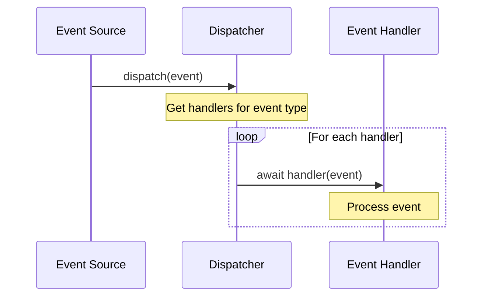

# Basana Handlers

## Handler Interface and Responsibilities

Basana uses an event-driven architecture where handlers are at the core of the system. Handlers are asynchronous functions that process specific event types and execute business logic in response to events.

### Handler Interface

In Basana, event handlers follow this interface pattern:

```python
async def event_handler(event: Event) -> None:
    # Process the event
    pass
```

Key characteristics of Basana handlers:

1. **Asynchronous**: All handlers are async functions to support non-blocking I/O
2. **Single Parameter**: Handlers accept a single Event parameter
3. **No Return Value**: Handlers operate by side effects, not return values
4. **Event Type Filtering**: Handlers typically filter events by type

### Handler Responsibilities

Handlers in Basana have several key responsibilities:

1. **Event Processing**: Parse and extract relevant data from events
2. **State Updating**: Modify state based on event information
3. **Decision Making**: Implement trading logic and strategy decisions
4. **Action Execution**: Perform actions like placing orders
5. **Error Handling**: Handle and recover from errors during processing

## Handler Registration and Dispatch

Handlers are registered with the dispatcher and called when matching events occur.

### Handler Registration

```python
from basana.core.dispatcher import Dispatcher
from basana.core.event import Event
from basana.core.bar import BarEvent

# Create a dispatcher
dispatcher = Dispatcher()

# Define a handler
async def on_bar_event(event: Event):
    if not isinstance(event, BarEvent):
        return
    
    # Process bar event
    print(f"Received bar: {event.bar}")

# Register the handler for BarEvent
dispatcher.add_event_handler(BarEvent, on_bar_event)
```

### Handler Dispatch Process

When an event is dispatched, the following process occurs:



Implementation in the Dispatcher class:

```python
async def dispatch(self, event: Event):
    """Dispatch an event to all registered handlers for its type."""
    
    # Get all handlers for this event type
    event_cls = event.__class__
    handlers = self.__handlers.get(event_cls, [])
    
    # Call each handler with the event
    for handler in handlers:
        try:
            await handler(event)
        except Exception as e:
            logging.error(f"Error in handler {handler.__name__} for event {event}: {e}")
```

## Key Handler Types

Basana implements several key types of handlers for different aspects of trading systems.

### 1. Market Data Handlers

Market data handlers process price and market information:

```python
async def bar_handler(event: Event):
    """Handle bar (OHLCV) data events."""
    if not isinstance(event, BarEvent):
        return
    
    # Extract bar data
    bar = event.bar
    pair = bar.pair
    timestamp = bar.timestamp
    close_price = bar.close_price
    
    # Update price state
    prices.update_price(pair, close_price)
    
    # Calculate technical indicators
    sma_10 = calculate_sma(pair, 10)
    rsi_14 = calculate_rsi(pair, 14)
    
    # Generate signals based on indicators
    if rsi_14 < 30:
        await generate_buy_signal(pair, close_price)
    elif rsi_14 > 70:
        await generate_sell_signal(pair, close_price)
```

### 2. Order Handlers

Order handlers process order status updates:

```python
async def order_handler(event: Event):
    """Handle order status update events."""
    if not isinstance(event, OrderEvent):
        return
    
    # Extract order information
    order_info = event.order_info
    order_id = order_info.id
    status = order_info.status
    pair = order_info.pair
    
    # Process based on order status
    if status == OrderStatus.FILLED:
        # Update position tracking
        if order_info.operation == OrderOperation.BUY:
            await update_position(pair, order_info.filled_amount)
        else:
            await update_position(pair, -order_info.filled_amount)
        
        # Log the trade
        log_trade(order_info)
        
    elif status == OrderStatus.REJECTED:
        # Handle rejected order
        log_error(f"Order {order_id} rejected: {order_info.message}")
        
        # Try alternative order if needed
        await handle_rejected_order(order_info)
```

### 3. User Data Handlers

User data handlers process account and balance updates:

```python
async def account_handler(event: Event):
    """Handle account update events."""
    if not isinstance(event, AccountEvent):
        return
    
    # Extract account data
    balances = event.balances
    
    # Update local account state
    for currency, balance in balances.items():
        update_balance(currency, balance)
    
    # Check risk limits
    if is_margin_call_required(balances):
        await handle_margin_call()
    
    # Update portfolio metrics
    total_value = calculate_portfolio_value(balances)
    update_equity_curve(event.timestamp, total_value)
```

### 4. Strategy Signal Handlers

Strategy signal handlers implement trading decisions:

```python
async def signal_handler(event: Event):
    """Handle trading signal events."""
    if not isinstance(event, SignalEvent):
        return
    
    # Extract signal information
    signal_type = event.signal_type
    pair = event.pair
    confidence = event.confidence
    
    # Execute based on signal type
    if signal_type == SignalType.BUY:
        # Calculate position size based on risk model
        amount = calculate_position_size(pair, confidence)
        
        # Execute buy order if valid size
        if amount > MINIMUM_ORDER_SIZE:
            await exchange.create_market_order(OrderOperation.BUY, pair, amount)
            
    elif signal_type == SignalType.SELL:
        # Get current position
        position = get_position(pair)
        
        # Close position if exists
        if position > MINIMUM_ORDER_SIZE:
            await exchange.create_market_order(OrderOperation.SELL, pair, position)
```

### 5. Timer and Scheduler Handlers

Timer handlers perform periodic tasks:

```python
async def timer_handler(event: Event):
    """Handle timer events."""
    if not isinstance(event, TimerEvent):
        return
    
    # Extract timer information
    interval = event.interval
    count = event.count
    
    # Execute different actions based on interval
    if interval == "1m":
        # Every minute actions
        await check_connectivity()
    elif interval == "1h":
        # Hourly actions
        await rebalance_portfolio()
    elif interval == "1d":
        # Daily actions
        await generate_reports()
        await adjust_risk_parameters()
```

## Handler Patterns and Best Practices

Basana encourages several patterns and best practices for handlers.

### 1. Type Filtering Pattern

Handlers should filter events by type to ensure they only process relevant events:

```python
async def my_handler(event: Event):
    # First filter by event type
    if not isinstance(event, TargetEventType):
        return
    
    # Now process the event safely
    # ...
```

### 2. Composition Pattern

Break complex handlers into smaller, reusable functions:

```python
async def main_handler(event: Event):
    if not isinstance(event, BarEvent):
        return
    
    # Extract data
    data = extract_data(event)
    
    # Process in steps
    indicators = calculate_indicators(data)
    signals = generate_signals(indicators)
    
    # Execute actions
    await execute_signals(signals)
```

### 3. Error Handling Pattern

Implement robust error handling in handlers:

```python
async def robust_handler(event: Event):
    try:
        # Process event
        await process_event(event)
    except ConnectionError as e:
        # Handle connection errors
        logging.error(f"Connection error: {e}")
        await retry_with_backoff(process_event, event)
    except Exception as e:
        # Handle unexpected errors
        logging.error(f"Unexpected error: {e}")
        # Prevent the error from stopping other handlers
```

### 4. State-Updating Pattern

Update state carefully in handlers:

```python
async def state_updating_handler(event: Event):
    if not isinstance(event, StateEvent):
        return
    
    # Create a copy of current state
    new_state = copy.deepcopy(current_state)
    
    # Update the copy
    try:
        update_state(new_state, event)
        
        # Validate the new state
        if is_valid_state(new_state):
            # Apply the update atomically
            current_state = new_state
        else:
            # Log validation failure
            logging.error("Invalid state update")
    except Exception as e:
        # Log state update failure
        logging.error(f"State update failed: {e}")
```

## Exchange-Specific Handlers

Basana implements specific handlers for different exchanges.

### Binance Handlers

```python
# In binance/exchange.py
async def __handle_user_data_event(self, event):
    """Process user data events from Binance websocket."""
    event_type = event.get("e")
    
    # Handle account update
    if event_type == "outboundAccountPosition":
        await self.__process_account_update(event)
    
    # Handle order update
    elif event_type == "executionReport":
        await self.__process_order_update(event)
        
    # Handle balance update
    elif event_type == "balanceUpdate":
        await self.__process_balance_update(event)

async def __process_order_update(self, event):
    """Process order update events from Binance."""
    # Extract order information
    order_id = event.get("i")
    symbol = event.get("s")
    side = event.get("S")
    order_type = event.get("o")
    status = event.get("X")
    
    # Create pair from symbol
    pair = symbol_to_pair(symbol)
    
    # Map Binance status to internal status
    internal_status = self.__map_order_status(status)
    
    # Create order info
    order_info = OrderInfo(
        id=str(order_id),
        pair=pair,
        operation=self.__map_order_side(side),
        type=self.__map_order_type(order_type),
        status=internal_status,
        # Additional fields...
    )
    
    # Dispatch order event
    order_event = OrderEvent(order_info)
    await self.__dispatcher.dispatch(order_event)
```

### Bitstamp Handlers

```python
# In bitstamp/exchange.py
async def __handle_order_book_event(self, data):
    """Process order book events from Bitstamp websocket."""
    channel = data.get("channel")
    
    if channel and channel.startswith("order_book_"):
        # Extract pair from channel
        pair_str = channel.replace("order_book_", "")
        pair = string_to_pair(pair_str)
        
        # Extract order book data
        asks = data.get("data", {}).get("asks", [])
        bids = data.get("data", {}).get("bids", [])
        
        # Create order book
        order_book = OrderBook(
            pair=pair,
            asks=[PriceLevel(Decimal(price), Decimal(amount)) for price, amount in asks],
            bids=[PriceLevel(Decimal(price), Decimal(amount)) for price, amount in bids]
        )
        
        # Dispatch order book event
        event = OrderBookEvent(order_book)
        await self.__dispatcher.dispatch(event)
```

## Handler Performance Considerations

Handlers in Basana are designed for optimal performance.

### Asynchronous Processing

All handlers use async/await to avoid blocking:

```python
async def non_blocking_handler(event: Event):
    # Perform I/O operations without blocking
    data = await fetch_data_async()
    
    # Process data
    result = process_data(data)
    
    # Execute actions
    await execute_actions_async(result)
```

### Memory Optimization

Handlers should be memory-efficient:

```python
async def memory_efficient_handler(event: Event):
    # Process events in chunks to limit memory usage
    data = extract_data(event)
    
    # Process in chunks
    for chunk in chunks(data, 1000):
        result = process_chunk(chunk)
        await store_results(result)
        
        # Allow garbage collection between chunks
        del chunk
        del result
```

### Computation Optimization

For compute-intensive operations, handlers can leverage optimizations:

```python
async def optimized_computation_handler(event: Event):
    # Use NumPy for vectorized calculations
    import numpy as np
    
    # Convert data to NumPy arrays for faster processing
    prices = np.array(get_prices())
    
    # Vectorized calculations
    sma = np.convolve(prices, np.ones(10)/10, mode='valid')
    
    # Process results
    if len(sma) > 0 and prices[-1] > sma[-1]:
        await generate_buy_signal()
```

### Caching and Memoization

Handlers can use caching to improve performance:

```python
# In-memory cache for indicator calculations
_indicator_cache = {}

async def cached_indicator_handler(event: Event):
    if not isinstance(event, BarEvent):
        return
    
    pair = event.pair
    timestamp = event.bar.timestamp
    
    # Check cache first
    cache_key = f"{pair}_{timestamp}"
    if cache_key in _indicator_cache:
        indicators = _indicator_cache[cache_key]
    else:
        # Calculate indicators
        indicators = calculate_indicators(event)
        
        # Cache the result
        _indicator_cache[cache_key] = indicators
        
        # Limit cache size
        if len(_indicator_cache) > 1000:
            # Remove oldest entries
            oldest_keys = sorted(_indicator_cache.keys())[:100]
            for key in oldest_keys:
                _indicator_cache.pop(key, None)
    
    # Process with cached indicators
    await process_with_indicators(indicators)
```

## Error Handling Strategies

Basana implements several error handling strategies in handlers.

### 1. Graceful Degradation

```python
async def graceful_degradation_handler(event: Event):
    try:
        # Try primary approach
        await primary_processing(event)
    except Exception as e:
        logging.warning(f"Primary processing failed: {e}")
        try:
            # Fall back to secondary approach
            await secondary_processing(event)
        except Exception as e:
            logging.error(f"Secondary processing failed: {e}")
            # Continue with basic functionality
            await minimal_processing(event)
```

### 2. Retry with Backoff

```python
async def retry_with_backoff(func, *args, max_retries=3, **kwargs):
    """Retry a function with exponential backoff."""
    retries = 0
    while retries < max_retries:
        try:
            return await func(*args, **kwargs)
        except (ConnectionError, TimeoutError) as e:
            retries += 1
            if retries >= max_retries:
                raise
            
            # Exponential backoff with jitter
            delay = 0.5 * (2 ** retries) * (0.5 + random.random())
            logging.warning(f"Retry {retries}/{max_retries} after {delay:.2f}s: {e}")
            await asyncio.sleep(delay)
```

### 3. Circuit Breaker

```python
class CircuitBreaker:
    def __init__(self, failure_threshold=5, reset_timeout=60):
        self.failures = 0
        self.failure_threshold = failure_threshold
        self.reset_timeout = reset_timeout
        self.open_since = None
        self.state = "CLOSED"  # CLOSED, OPEN, HALF_OPEN
    
    async def execute(self, func, *args, **kwargs):
        """Execute function with circuit breaker pattern."""
        current_time = time.time()
        
        # Check if circuit is OPEN
        if self.state == "OPEN":
            # Check if reset timeout has elapsed
            if current_time - self.open_since > self.reset_timeout:
                # Move to HALF_OPEN to test if the issue is resolved
                self.state = "HALF_OPEN"
            else:
                # Circuit is still OPEN
                raise CircuitBreakerOpenError("Circuit is open")
        
        try:
            # Execute the function
            result = await func(*args, **kwargs)
            
            # On success in HALF_OPEN, reset the circuit
            if self.state == "HALF_OPEN":
                self.state = "CLOSED"
                self.failures = 0
            
            return result
            
        except Exception as e:
            # Increment failure counter
            self.failures += 1
            
            # Open circuit if threshold reached
            if self.failures >= self.failure_threshold:
                self.state = "OPEN"
                self.open_since = current_time
            
            # Propagate the exception
            raise
```

### 4. Transaction Logs

```python
class TransactionLogger:
    def __init__(self, log_path):
        self.log_path = log_path
    
    async def log_transaction(self, transaction_type, data):
        """Log a transaction for recovery purposes."""
        log_entry = {
            "timestamp": datetime.datetime.now().isoformat(),
            "type": transaction_type,
            "data": data
        }
        
        async with aiofiles.open(self.log_path, "a") as f:
            await f.write(json.dumps(log_entry) + "\n")
    
    async def recover_from_logs(self):
        """Recover state from transaction logs."""
        transactions = []
        
        async with aiofiles.open(self.log_path, "r") as f:
            async for line in f:
                try:
                    transaction = json.loads(line)
                    transactions.append(transaction)
                except json.JSONDecodeError:
                    logging.error(f"Invalid transaction log entry: {line}")
        
        # Sort transactions by timestamp
        transactions.sort(key=lambda x: x["timestamp"])
        
        # Replay transactions to recover state
        for transaction in transactions:
            await self.apply_transaction(transaction)
```

## Edge Cases and Special Handling

Basana handlers address several edge cases and special scenarios.

### 1. Data Gaps

```python
async def handle_data_gaps(event: Event):
    if not isinstance(event, BarEvent):
        return
    
    # Get previous events
    previous_events = get_previous_events(event.pair)
    
    if previous_events:
        # Check for gap
        last_timestamp = previous_events[-1].bar.timestamp
        current_timestamp = event.bar.timestamp
        expected_interval = datetime.timedelta(minutes=1)  # For 1-minute bars
        
        if current_timestamp - last_timestamp > expected_interval * 1.5:
            # Gap detected
            logging.warning(f"Data gap detected for {event.pair}: "
                          f"{last_timestamp} to {current_timestamp}")
            
            # Handle the gap
            await fill_data_gap(event.pair, last_timestamp, current_timestamp)
```

### 2. Out-of-Order Events

```python
async def handle_out_of_order_events(event: Event):
    if not isinstance(event, BarEvent):
        return
    
    # Get latest timestamp processed
    latest_timestamp = get_latest_timestamp(event.pair)
    
    if latest_timestamp and event.bar.timestamp < latest_timestamp:
        # Out-of-order event detected
        logging.warning(f"Out-of-order event detected for {event.pair}: "
                      f"Got {event.bar.timestamp}, already processed {latest_timestamp}")
        
        # Handle based on threshold
        time_difference = latest_timestamp - event.bar.timestamp
        
        if time_difference < datetime.timedelta(minutes=5):
            # Minor out-of-order, reprocess with caution
            await reprocess_with_caution(event)
        else:
            # Major out-of-order, log and skip
            logging.error(f"Skipping significantly out-of-order event: {event}")
```

### 3. Exchange-Specific Anomalies

```python
async def handle_exchange_anomalies(event: Event):
    if not isinstance(event, BarEvent):
        return
    
    # Check for price anomalies
    current_price = event.bar.close_price
    previous_prices = get_previous_prices(event.pair, 10)
    
    if previous_prices:
        avg_price = sum(previous_prices) / len(previous_prices)
        
        # Check for extreme price change (e.g., flash crash)
        price_change_pct = abs(current_price - avg_price) / avg_price
        
        if price_change_pct > Decimal("0.20"):  # 20% change
            logging.warning(f"Potential price anomaly detected for {event.pair}: "
                          f"{avg_price} -> {current_price} ({price_change_pct:.2%})")
            
            # Anomaly handling strategies
            if is_exchange_known_for_anomalies(event.pair.exchange):
                # Apply exchange-specific filter
                await apply_exchange_specific_filter(event)
            else:
                # Apply general anomaly handling
                await handle_price_anomaly(event, avg_price, price_change_pct)
```

### 4. Partial Data

```python
async def handle_partial_data(event: Event):
    if not isinstance(event, OrderBookEvent):
        return
    
    # Check for partial order book
    if len(event.order_book.asks) < 5 or len(event.order_book.bids) < 5:
        logging.warning(f"Partial order book received for {event.order_book.pair}")
        
        # Options:
        # 1. Merge with previous order book
        merged_book = await merge_with_previous_book(event.order_book)
        
        # 2. Request full order book if needed
        if is_too_incomplete(merged_book):
            full_book = await request_full_order_book(event.order_book.pair)
            await process_complete_book(full_book)
        else:
            await process_complete_book(merged_book)
```

## Monitoring and Debugging Handlers

Basana provides tools for monitoring and debugging handlers.

### Handler Metrics

```python
class HandlerMetrics:
    def __init__(self):
        self.call_count = {}
        self.error_count = {}
        self.execution_time = {}
    
    async def measure_handler(self, handler_name, handler_func, event):
        """Measure handler performance metrics."""
        # Increment call count
        self.call_count[handler_name] = self.call_count.get(handler_name, 0) + 1
        
        # Time execution
        start_time = time.time()
        try:
            # Execute handler
            await handler_func(event)
        except Exception as e:
            # Increment error count
            self.error_count[handler_name] = self.error_count.get(handler_name, 0) + 1
            # Re-raise the exception
            raise
        finally:
            # Record execution time
            execution_time = time.time() - start_time
            
            # Update average execution time
            times = self.execution_time.get(handler_name, [])
            times.append(execution_time)
            self.execution_time[handler_name] = times[-100:]  # Keep last 100 values
    
    def get_metrics(self, handler_name=None):
        """Get handler metrics."""
        if handler_name:
            if handler_name not in self.call_count:
                return None
            
            avg_time = sum(self.execution_time.get(handler_name, [0])) / max(len(self.execution_time.get(handler_name, [1])), 1)
            
            return {
                "calls": self.call_count.get(handler_name, 0),
                "errors": self.error_count.get(handler_name, 0),
                "avg_execution_time": avg_time
            }
        else:
            return {
                name: {
                    "calls": self.call_count.get(name, 0),
                    "errors": self.error_count.get(name, 0),
                    "avg_execution_time": sum(self.execution_time.get(name, [0])) / max(len(self.execution_time.get(name, [1])), 1)
                }
                for name in self.call_count.keys()
            }
```

### Debugging Decorators

```python
def debug_handler(func):
    """Decorator to debug handler execution."""
    @functools.wraps(func)
    async def wrapper(event):
        handler_name = func.__name__
        event_type = event.__class__.__name__
        
        logging.debug(f"[START] {handler_name} processing {event_type}")
        
        try:
            result = await func(event)
            logging.debug(f"[END] {handler_name} successfully processed {event_type}")
            return result
        except Exception as e:
            logging.error(f"[ERROR] {handler_name} failed processing {event_type}: {e}")
            # Re-raise for standard error handling
            raise
    
    return wrapper

# Example usage
@debug_handler
async def my_handler(event: Event):
    # Handler implementation
    # ...
```

### Handler Profiling

```python
import cProfile
import pstats
import io

def profile_handler(func):
    """Decorator to profile handler performance."""
    @functools.wraps(func)
    async def wrapper(event):
        # Create profiler
        pr = cProfile.Profile()
        pr.enable()
        
        try:
            # Execute handler
            result = await func(event)
            return result
        finally:
            # Disable profiler
            pr.disable()
            
            # Get profiling results
            s = io.StringIO()
            ps = pstats.Stats(pr, stream=s).sort_stats('cumulative')
            ps.print_stats(20)  # Print top 20 functions
            
            logging.debug(f"Profiling results for {func.__name__}:\n{s.getvalue()}")
    
    return wrapper
```

## Conclusion and Best Practices

When implementing handlers in Basana, follow these best practices:

1. **Keep Handlers Focused**: Each handler should have a single responsibility
2. **Leverage Async/Await**: Use async for all I/O operations
3. **Implement Error Handling**: Always handle exceptions in handlers
4. **Filter by Event Type**: Start handlers with type checking
5. **Compose Functionality**: Break complex handlers into smaller functions
6. **Monitor Performance**: Track execution time and error rates
7. **Handle Edge Cases**: Anticipate and handle unusual scenarios
8. **Document Behavior**: Clearly document what each handler does
9. **Test Thoroughly**: Write unit and integration tests for handlers
10. **Use Metrics**: Collect metrics to identify performance bottlenecks

By following these practices, you can create robust, efficient, and maintainable handlers in your Basana trading applications. 