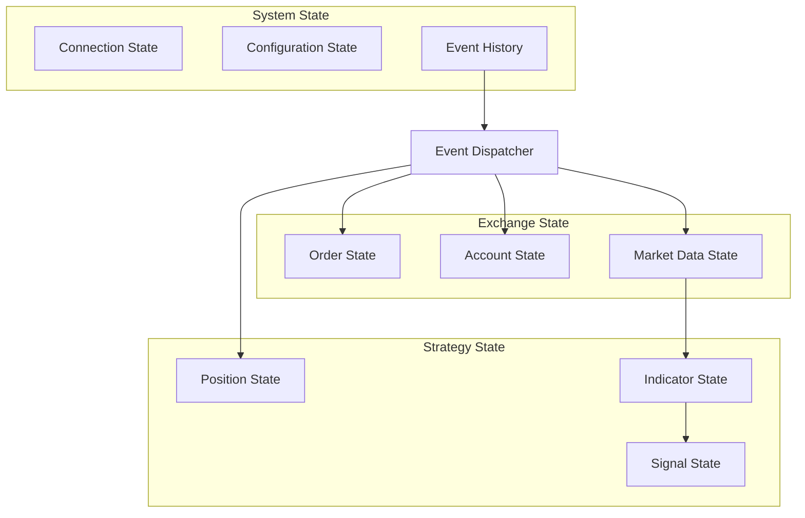
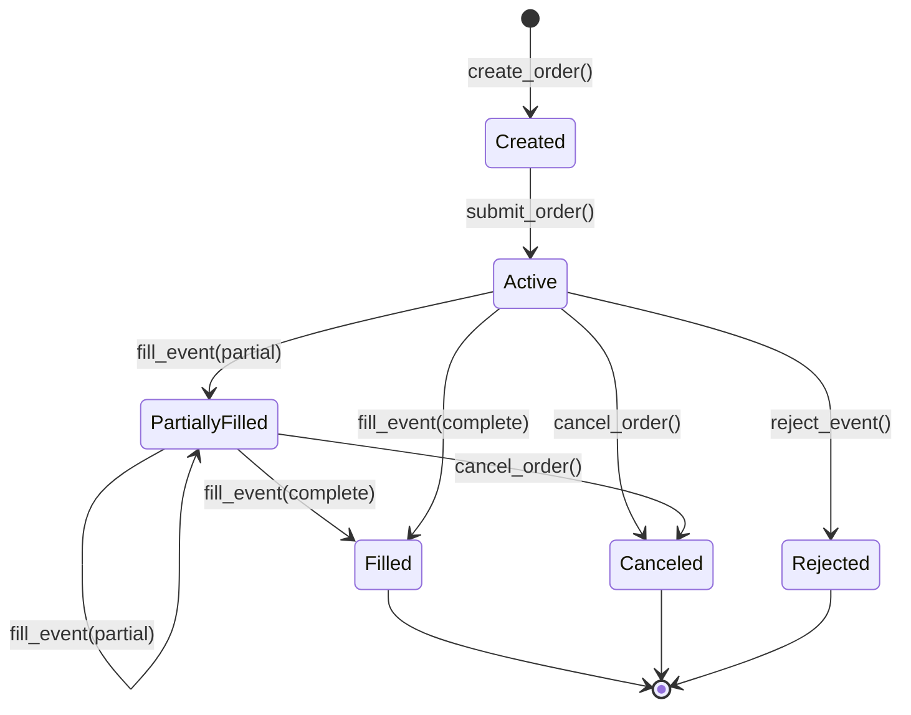

# Basana State Management

## State Model Overview

Basana's state management is built around an event-driven model where system state is primarily maintained in response to events. The framework manages several types of state across different components to ensure consistency, reliability, and performance.



## State Components and Their Relationships

### Exchange State

Exchange state captures the current state of the exchange, including orders, balances, and market data.

#### Order State

Order state tracks all active and historical orders in the system:

```python
# In backtesting exchange
class Exchange:
    def __init__(self, dispatcher, initial_balances=None, fees_config=None):
        # ...
        self.__order_mgr = OrderManager(dispatcher, fees_model)
        # ...

class OrderManager:
    def __init__(self, dispatcher, fees_model):
        self.__dispatcher = dispatcher
        self.__fees_model = fees_model
        self.__orders = {}  # Order state storage
        self.__last_order_id = 0
```

#### Account State

Account state maintains current balances and positions:

```python
# In backtesting exchange
class Exchange:
    def __init__(self, dispatcher, initial_balances=None, fees_config=None):
        # ...
        self.__account_balances = AccountBalances(initial_balances)
        # ...

class AccountBalances:
    def __init__(self, initial_balances=None):
        self.__balances = {}
        if initial_balances:
            for ccy, amt in initial_balances.items():
                self.__balances[ccy] = Balance(amt)
```

#### Market Data State

Market data state includes current and historical prices, order books, and other market information:

```python
# In backtesting exchange
class Exchange:
    def __init__(self, dispatcher, initial_balances=None, fees_config=None):
        # ...
        self.__prices = Prices()
        # ...

class Prices:
    def __init__(self):
        self.__prices = {}
```

### Strategy State

Strategy state represents the trading logic state, including positions, indicators, and signals.

#### Position State

Position state tracks current market positions:

```python
# Example position manager in strategy code
class PositionManager:
    def __init__(self, exchange):
        self.exchange = exchange
        self.positions = {}  # Current positions

    async def update_positions(self):
        # Update positions based on account balances and prices
        for currency, balance in self.positions.items():
            # Update position state
            pass
```

#### Indicator State

Indicator state stores technical indicators calculated from market data:

```python
# Example indicator calculation in strategy
def calculate_indicators(bars):
    # Calculate indicators from price bars
    indicators = {
        'sma_10': calculate_sma(bars, 10),
        'sma_30': calculate_sma(bars, 30),
        'rsi_14': calculate_rsi(bars, 14)
    }
    return indicators
```

#### Signal State

Signal state represents trading signals generated from indicators:

```python
# Example signal generation in strategy
def generate_signals(indicators, previous_indicators):
    signals = {}
    
    # Generate signals based on indicators
    if (indicators['sma_10'] > indicators['sma_30'] and 
            previous_indicators['sma_10'] <= previous_indicators['sma_30']):
        signals['buy'] = True
    
    return signals
```

### System State

System state includes configuration, connection status, and system-level metadata.

#### Connection State

Connection state tracks the status of connections to exchanges:

```python
# In binance exchange client
class BaseClient:
    def __init__(self, api_key=None, api_secret=None):
        self._session = None
        self._ws_connected = False  # WebSocket connection state
        self._rest_connected = False  # REST API connection state
```

#### Configuration State

Configuration state maintains system and component configurations:

```python
# In core configuration
class Config:
    def __init__(self, config_data):
        self.__config = config_data

    def get(self, key, default=None):
        # Retrieve configuration value
        # ...
```

#### Event History

Event history stores past events for analysis and replay:

```python
# In backtesting dispatcher
class BacktestingDispatcher(Dispatcher):
    def __init__(self):
        super().__init__()
        # ...
        self.__bar_events = {}  # Store bar events by pair
        self.__event_sequence = []  # Store all events in sequence
```

## State Transitions and Triggers

State transitions in Basana are primarily event-driven, with events triggering state changes throughout the system.

### Order State Transitions



Implementation in code:

```python
# In backtesting order manager
async def create_market_order(self, operation, pair, amount):
    # Create new order
    order_id = self.__get_next_order_id()
    order_info = OrderInfo(
        id=order_id,
        operation=operation,
        pair=pair,
        type=OrderType.MARKET,
        amount=amount,
        status=OrderStatus.CREATED,
        created_at=datetime.datetime.now()
    )
    
    # Store order
    self.__orders[order_id] = order_info
    
    # Transition to ACTIVE
    order_info = dataclasses.replace(order_info, status=OrderStatus.ACTIVE)
    self.__orders[order_id] = order_info
    
    # Process market order
    await self.__process_market_order(order_info)
    
    return order_info
```

### Account Balance Transitions

Account balances change in response to order fills, deposits, and withdrawals:

```python
# In backtesting account balances
def apply_market_order(self, pair, operation, amount, price, fees_config):
    # Calculate filled amount and fees
    filled_amount, fees = self.__calculate_filled_amount_and_fees(
        operation, amount, price, fees_config
    )
    
    # Update balances based on operation
    if operation == OrderOperation.BUY:
        # Decrease quote currency balance
        quote_ccy = pair.quote
        quote_amount = filled_amount * price
        self.__dec_balance(quote_ccy, quote_amount)
        
        # Add fees
        for fee_ccy, fee_amount in fees.items():
            self.__dec_balance(fee_ccy, fee_amount)
        
        # Increase base currency balance
        base_ccy = pair.base
        self.__inc_balance(base_ccy, filled_amount)
    else:
        # Decrease base currency balance
        base_ccy = pair.base
        self.__dec_balance(base_ccy, filled_amount)
        
        # Add fees
        for fee_ccy, fee_amount in fees.items():
            self.__dec_balance(fee_ccy, fee_amount)
        
        # Increase quote currency balance
        quote_ccy = pair.quote
        quote_amount = filled_amount * price
        self.__inc_balance(quote_ccy, quote_amount)
```

### Market Data State Transitions

Market data changes with each new data point:

```python
# In backtesting prices
def update_price(self, pair, price):
    # Update price for the given pair
    self.__prices[pair] = price

# In bar event handling
async def process_bar_event(self, event):
    if isinstance(event, BarEvent):
        # Update price state
        self.__prices.update_price(event.pair, event.bar.close_price)
```

## Persistence Mechanisms

Basana primarily uses in-memory state during execution, with different persistence options for different scenarios.

### In-Memory State

Most state in Basana is maintained in memory during execution:

```python
# Order manager maintaining orders in memory
class OrderManager:
    def __init__(self, dispatcher, fees_model):
        self.__orders = {}  # In-memory order storage
```

### Event Recording

Events can be recorded and replayed for backtesting and analysis:

```python
# Store bar events for later analysis
class BacktestingDispatcher(Dispatcher):
    def __init__(self):
        # ...
        self.__bar_events = {}  # Store bar events by pair
    
    def add_bar_event(self, event):
        if not isinstance(event, BarEvent):
            return
        
        pair = event.pair
        if pair not in self.__bar_events:
            self.__bar_events[pair] = []
        
        self.__bar_events[pair].append(event)
```

### CSV Data Storage

Historical data can be stored in CSV files:

```python
# Save bar data to CSV
def save_bars_to_csv(bars, filename):
    with open(filename, 'w', newline='') as csvfile:
        fieldnames = ['timestamp', 'open', 'high', 'low', 'close', 'volume']
        writer = csv.DictWriter(csvfile, fieldnames=fieldnames)
        
        writer.writeheader()
        for bar in bars:
            writer.writerow({
                'timestamp': bar.timestamp.strftime('%Y-%m-%d %H:%M:%S'),
                'open': str(bar.open_price),
                'high': str(bar.high_price),
                'low': str(bar.low_price),
                'close': str(bar.close_price),
                'volume': str(bar.volume)
            })
```

### Chart State Storage

For visualization, state can be recorded for charting:

```python
# In backtesting charts
class LineCharts:
    def __init__(self, exchange):
        self.__exchange = exchange
        self.__pairs = set()
        self.__balances = set()
        self.__portfolio_values = set()
        self.__annotations = []
        
    def add_pair(self, pair):
        self.__pairs.add(pair)
    
    def add_balance(self, ccy):
        self.__balances.add(ccy)
    
    def add_portfolio_value(self, ccy):
        self.__portfolio_values.add(ccy)
    
    def add_annotation(self, x, y, text):
        self.__annotations.append((x, y, text))
```

## Recovery Procedures

Basana implements several recovery mechanisms to handle errors and state inconsistencies.

### Connection Recovery

For external exchange connections, automatic reconnection is implemented:

```python
# In WebSocket connection
async def connect_with_retry(self, url, max_retries=5):
    retries = 0
    while retries < max_retries:
        try:
            self._ws = await websockets.connect(url)
            self._connected = True
            return
        except Exception as e:
            retries += 1
            if retries >= max_retries:
                raise
            # Exponential backoff
            await asyncio.sleep(0.5 * (2 ** retries))
```

### State Reconciliation

For live trading, periodic state reconciliation is performed:

```python
# In live exchange client
async def reconcile_orders(self):
    # Get orders from local state
    local_orders = self.__orders.copy()
    
    # Get orders from exchange
    exchange_orders = await self.__fetch_open_orders()
    
    # Reconcile differences
    for order_id, local_order in local_orders.items():
        if order_id not in exchange_orders:
            # Order no longer on exchange - mark as completed or canceled
            await self.__update_order_status(order_id, OrderStatus.CANCELED)
        else:
            # Update local order with exchange data
            exchange_order = exchange_orders[order_id]
            await self.__update_order_details(order_id, exchange_order)
```

### Event Replay

For backtesting, events can be replayed to restore state:

```python
# Replay stored events
async def replay_events(self, events):
    # Reset state
    self.__reset_state()
    
    # Replay events in order
    for event in events:
        await self.dispatch(event)
```

## Thread Safety and Concurrency

Basana is designed with concurrency in mind, leveraging Python's asyncio for thread safety.

### Asyncio-Based Concurrency

Most operations in Basana are asynchronous and non-blocking:

```python
# Asynchronous event dispatching
async def dispatch(self, event):
    # Get handlers for this event type
    event_cls = event.__class__
    handlers = self.__handlers.get(event_cls, [])
    
    # Run all handlers asynchronously
    for handler in handlers:
        await handler(event)
```

### State Access Synchronization

State access is synchronized through async/await patterns:

```python
# Synchronized state access
async def get_balance(self, currency):
    # Wait for any pending operations to complete
    await self.__balance_lock.acquire()
    try:
        # Access state safely
        balance = self.__account_balances.get_balance(currency)
        return balance
    finally:
        # Release lock
        self.__balance_lock.release()
```

### Task Management

Basana uses asyncio tasks for long-running operations:

```python
# Task management for WebSocket connections
async def start_user_data_stream(self):
    # Start listening task
    self.__user_data_task = asyncio.create_task(
        self.__listen_user_data_stream()
    )
    
    # Return task for management
    return self.__user_data_task
```

## State Initialization

State is initialized when components are created, typically with default values or from configuration.

### Exchange Initialization

```python
# Initialize exchange with initial balances
exchange = Exchange(
    dispatcher=dispatcher,
    initial_balances={"BTC": Decimal("1.0"), "USD": Decimal("10000.0")},
    fees_config=FeeConfig(maker=Decimal("0.001"), taker=Decimal("0.002"))
)
```

### Backtesting State Setup

```python
# Set up backtesting state
async def setup_backtest():
    # Create components
    dispatcher = BacktestingDispatcher()
    exchange = Exchange(dispatcher=dispatcher, initial_balances=initial_balances)
    
    # Register event handlers
    dispatcher.add_event_handler(BarEvent, on_bar_event)
    
    # Set up data sources
    bar_source = BarEventSource.from_csv(pair=pair, csv_path=data_file)
    exchange.add_bar_source(bar_source)
    
    return dispatcher, exchange
```

### Live Trading State Setup

```python
# Set up live trading state
async def setup_live_trading():
    # Create components
    dispatcher = Dispatcher()
    exchange = BinanceExchange(api_key=api_key, api_secret=api_secret)
    
    # Register event handlers
    dispatcher.add_event_handler(BarEvent, on_bar_event)
    dispatcher.add_event_handler(OrderEvent, on_order_event)
    
    # Set up data streams
    await exchange.start_user_data_stream()
    await exchange.subscribe_to_klines(pair, interval)
    
    return dispatcher, exchange
```

## State Validation and Monitoring

Basana includes mechanisms for validating and monitoring state.

### Balance Validation

```python
async def validate_balance_for_order(self, pair, operation, amount):
    if operation == OrderOperation.BUY:
        # Check if enough quote currency is available
        quote_balance = await self.get_balance(pair.quote)
        quote_amount = amount * await self.get_price(pair)
        
        if quote_balance.available < quote_amount:
            return False, "Insufficient balance"
    else:
        # Check if enough base currency is available
        base_balance = await self.get_balance(pair.base)
        
        if base_balance.available < amount:
            return False, "Insufficient balance"
    
    return True, ""
```

### Health Checks

```python
async def check_exchange_health(self):
    try:
        # Check API connectivity
        await self.ping()
        
        # Check server time synchronization
        server_time = await self.get_server_time()
        local_time = int(time.time() * 1000)
        time_diff = abs(server_time - local_time)
        
        if time_diff > 5000:  # 5 seconds
            logging.warning(f"Time difference with server: {time_diff}ms")
        
        # Check account permissions
        account_info = await self.get_account_info()
        
        return True, "Exchange connection healthy"
    except Exception as e:
        return False, f"Exchange health check failed: {e}"
```

### Order State Monitoring

```python
async def monitor_orders(self):
    while True:
        try:
            # Get all active orders
            active_orders = [order for order in self.__orders.values() 
                            if order.status in (OrderStatus.ACTIVE, OrderStatus.PARTIALLY_FILLED)]
            
            # Check for stale orders
            current_time = datetime.datetime.now()
            for order in active_orders:
                order_age = (current_time - order.created_at).total_seconds()
                
                # Alert if order is too old
                if order_age > self.__max_order_age:
                    logging.warning(f"Order {order.id} is stale (age: {order_age}s)")
        except Exception as e:
            logging.error(f"Error monitoring orders: {e}")
        
        # Wait before next check
        await asyncio.sleep(60)  # Check every minute
```

## Advanced State Management Techniques

### State Snapshots

Basana allows for creating state snapshots for analysis and recovery:

```python
def create_state_snapshot(self):
    # Create a snapshot of current state
    snapshot = {
        'orders': copy.deepcopy(self.__orders),
        'balances': self.__account_balances.to_dict(),
        'prices': self.__prices.to_dict(),
        'timestamp': datetime.datetime.now().isoformat()
    }
    return snapshot

def restore_from_snapshot(self, snapshot):
    # Restore state from snapshot
    self.__orders = copy.deepcopy(snapshot['orders'])
    self.__account_balances.from_dict(snapshot['balances'])
    self.__prices.from_dict(snapshot['prices'])
```

### Backtesting State Rewind

For strategy optimization, state can be rewound:

```python
class BacktestWithCheckpoints:
    def __init__(self, initial_state):
        self.__initial_state = initial_state
        self.__checkpoints = []
    
    def create_checkpoint(self, state):
        self.__checkpoints.append(state)
    
    def rewind_to_checkpoint(self, index):
        # Rewind to a specific checkpoint
        if 0 <= index < len(self.__checkpoints):
            return copy.deepcopy(self.__checkpoints[index])
        else:
            # Rewind to initial state
            return copy.deepcopy(self.__initial_state)
```

### State Diffing

For efficient state updates, only changes can be tracked:

```python
class StateTracker:
    def __init__(self):
        self.__previous_state = None
        self.__current_state = {}
    
    def update_state(self, new_state):
        self.__previous_state = self.__current_state
        self.__current_state = new_state
    
    def get_state_diff(self):
        # Return differences between current and previous state
        if not self.__previous_state:
            return self.__current_state
        
        diff = {}
        for key, value in self.__current_state.items():
            if key not in self.__previous_state or self.__previous_state[key] != value:
                diff[key] = value
        
        return diff
```

## Summary of State Management Approach

Basana employs a comprehensive state management approach that includes:

1. **Event-Driven Architecture**: State changes are triggered by events
2. **Centralized Dispatching**: Events flow through a central dispatcher
3. **Immutable State Objects**: Data classes and immutable objects for state
4. **Async-First Design**: Asynchronous operations for concurrency
5. **State Validation**: Mechanisms to ensure state integrity
6. **Recovery Procedures**: Methods to recover from failures
7. **In-Memory State**: Fast access with optional persistence

This approach ensures that Basana can handle complex trading strategies while maintaining performance, reliability, and correctness. 