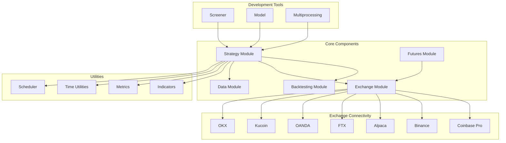
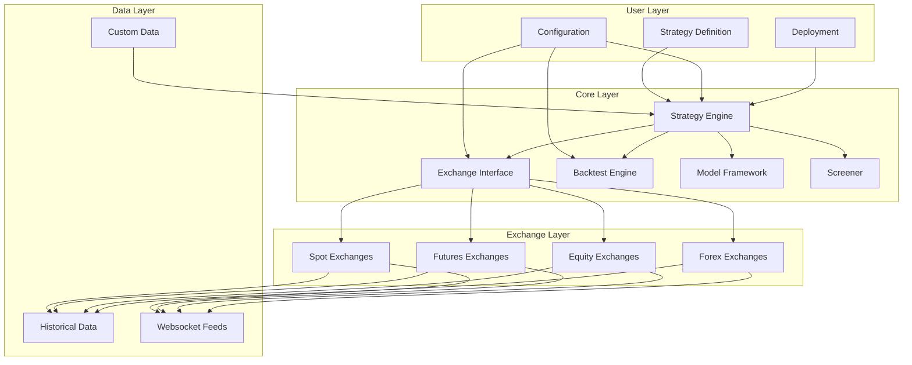

# Blankly Trading System

## Overview

Blankly is a Python-based package designed to simplify quantitative finance and algorithmic trading by providing a unified framework for building, testing, and deploying trading models. It abstracts away exchange connectivity, order management, and data handling to allow developers to focus primarily on trading logic and model development.



## Key Components and Their Relationships

Blankly is organized around several core modules that work together to provide a seamless trading experience:

### 1. Strategy Module

The heart of Blankly is the Strategy Module, which provides an event-driven framework for developing trading strategies:

- Event-based price callbacks
- State management
- Position tracking
- Multiple asset trading

```python
from blankly import Strategy, StrategyState

def price_event(price, symbol, state: StrategyState):
    # Your trading logic here
    if price > state.variables['moving_average']:
        state.interface.market_order(symbol, 'buy', funds=100)
    
def init(symbol, state: StrategyState):
    # Initialize variables
    state.variables['moving_average'] = 0

# Create and run a strategy
strategy = Strategy(exchange)
strategy.add_price_event(price_event, 'BTC-USD', resolution='1h', init=init)
strategy.start()
```

### 2. Exchange Module

The Exchange Module provides a unified interface for interacting with different exchanges:

- Standardized API for market data
- Order management (market, limit, stop orders)
- Account information
- Websocket connections for real-time data

```python
from blankly import Alpaca, CoinbasePro, Binance

# Create exchange objects with the same interface
alpaca = Alpaca()
coinbase = CoinbasePro()
binance = Binance()

# Use the same methods across exchanges
alpaca.market_order('AAPL', 'buy', 1)
coinbase.market_order('BTC-USD', 'buy', 0.01)
```

### 3. Backtesting Module

The Backtesting Module enables strategy testing on historical data:

- Historical data processing
- Trade simulation
- PnL calculation
- Performance metrics

```python
from blankly import Strategy

strategy = Strategy(exchange)
strategy.add_price_event(price_event, 'BTC-USD', resolution='1h', init=init)

# Run a backtest from Jan 2021 to Dec 2021
results = strategy.backtest(start_date="2021-01-01", end_date="2021-12-31")
results.metrics()  # Get performance metrics
results.plot()     # Plot backtest results
```

### 4. Data Module

The Data Module handles market data acquisition and processing:

- Historical data retrieval
- Data normalization
- Custom data integration
- Templating system

```python
from blankly import CoinbasePro

coinbase = CoinbasePro()
interface = coinbase.get_interface()

# Get historical data
history = interface.history('BTC-USD', to='1y', resolution='1d')
```

### 5. Futures Module

The Futures Module extends Blankly's capabilities to futures and derivatives trading:

- Leverage management
- Position mode handling
- Futures-specific order types
- Funding rate access

```python
from blankly import BinanceFutures
from blankly.enums import Side, PositionMode

futures = BinanceFutures()
interface = futures.get_interface()

# Set leverage
interface.set_leverage(5, 'BTC-USDT')

# Place a futures market order
interface.market_order('BTC-USDT', Side.BUY, 0.01, position=PositionMode.LONG)
```

## Supported Markets and Instruments

Blankly supports a wide range of markets and instruments through its exchange integrations:

1. **Cryptocurrencies**:
   - Spot markets via Coinbase Pro, Binance, FTX, Kucoin, OKX
   - Futures markets via Binance Futures, FTX Futures
   - Trading pairs with USD, USDT, BTC, and other base currencies

2. **Equities**:
   - US stock market via Alpaca
   - ETFs and mutual funds
   - Options trading support

3. **Forex**:
   - Currency pairs via OANDA
   - Major and minor pairs

4. **Custom Instruments**:
   - Paper trading with custom assets
   - Keyless backtesting for any asset

## Performance Characteristics

Blankly is designed with the following performance characteristics:

### Efficiency

- **Memory Usage**: Optimized for low memory consumption with efficient state management
- **CPU Utilization**: Typically <1% CPU usage for basic trading bots
- **Data Processing**: Efficient historical data processing using vectorized operations

### Scalability

- **Multi-Asset Trading**: Capable of monitoring and trading hundreds of assets simultaneously
- **Multiprocessing Support**: Parallel processing for computationally intensive tasks
- **Cloud Deployment**: Designed for easy deployment to cloud environments

### Speed

- **Event Processing**: Sub-millisecond event handling
- **Backtesting Performance**: Processing of years of minute-level data in seconds
- **API Response**: Fast exchange API interaction with connection pooling

## Dependencies and Requirements

Blankly has the following key dependencies:

- **Python**: 3.7 or higher
- **pandas**: Data manipulation and analysis
- **numpy**: Numerical computations
- **websocket-client**: WebSocket connections for real-time data
- **ccxt**: Optional cryptocurrency exchange connectivity
- **alpaca-trade-api**: For equities trading
- **matplotlib/plotly**: For visualization

Optional dependencies:
- **redis**: For advanced caching
- **tensorflow/pytorch**: For integration with ML models
- **ta-lib**: For additional technical indicators

## Quick Start Guide

### Installation

```bash
pip install blankly
```

### Basic Strategy Setup

```python
import blankly
from blankly import Strategy, StrategyState

def init(symbol, state: StrategyState):
    # Download price data to give context to the algo
    state.variables['history'] = state.interface.history(symbol, 100, 
                                                      resolution='1d')['close'].tolist()
    state.variables['owns_position'] = False

def price_event(price, symbol, state: StrategyState):
    interface = state.interface
    
    # Update our state's history
    state.variables['history'].append(price)
    
    # Calculate 20-day moving average
    short_period = 20
    if len(state.variables['history']) > short_period:
        moving_average = sum(state.variables['history'][-short_period:]) / short_period
        
        # Simple strategy: buy when price crosses above MA, sell when it drops below
        if price > moving_average and not state.variables['owns_position']:
            # Buy with 90% of our portfolio
            interface.market_order(symbol, 'buy', int(interface.cash * 0.90 / price))
            state.variables['owns_position'] = True
            
        elif price < moving_average and state.variables['owns_position']:
            # Sell all
            interface.market_order(symbol, 'sell', int(interface.account[blankly.utils.get_base_asset(symbol)]['available']))
            state.variables['owns_position'] = False

# Initialize exchange and strategy
exchange = blankly.CoinbasePro()
strategy = Strategy(exchange)

# Add the price event
strategy.add_price_event(price_event, 'BTC-USD', resolution='1h', init=init)

# Backtest the strategy
results = strategy.backtest(start_date='2020-01-01', end_date='2022-01-01')
print(results.metrics())
results.plot()

# Uncomment to run live
# strategy.start()
```

### Configuration Files

Blankly uses several JSON configuration files:

1. **keys.json** - Exchange API credentials
```json
{
  "coinbase_pro": {
    "API_KEY": "your_api_key",
    "API_SECRET": "your_api_secret",
    "API_PASS": "your_api_passphrase",
    "sandbox": true
  }
}
```

2. **settings.json** - General settings
```json
{
  "settings": {
    "use_sandbox": true,
    "cache_history": true,
    "auto_truncate": true
  }
}
```

3. **backtest.json** - Backtesting configuration
```json
{
  "price_data": {
    "assets": ["BTC-USD"],
    "resolution": "1h"
  },
  "settings": {
    "base_account_size": 10000,
    "quote_account_size": {},
    "start_date": "2021-01-01",
    "end_date": "2022-01-01"
  }
}
```

## Unique Features

Blankly offers several distinguishing features:

1. **Cross-Exchange Compatibility**: Write once, trade anywhere - same codebase works across multiple exchanges

2. **Unified Interface**: Consistent API across cryptocurrency and traditional markets

3. **Deployment Tools**: Built-in tools for deploying strategies to cloud infrastructure

4. **Screener Framework**: Built-in tools for scanning multiple assets for trading opportunities

5. **Model Integration**: Easy integration with machine learning models and external data sources

## Architecture

Blankly follows a modular architecture with clear separation of concerns:



### Design Principles

Blankly is built on several key design principles:

1. **Abstraction**: High-level interfaces abstract away exchange-specific details

2. **Composability**: Modular components that can be combined flexibly

3. **Extensibility**: Well-defined interfaces for extending functionality

4. **Convention over Configuration**: Sensible defaults that can be overridden when needed

5. **Synchronicity**: Primarily synchronous API for simplicity, with asynchronous components where performance is critical

## Documentation and Examples

Comprehensive documentation is available at [docs.blankly.finance](https://docs.blankly.finance/), including:

1. **API Reference**: Complete API documentation
2. **Tutorials**: Step-by-step guides for common tasks
3. **Example Strategies**: Sample trading strategies
4. **Configuration Guides**: Detailed configuration explanations 