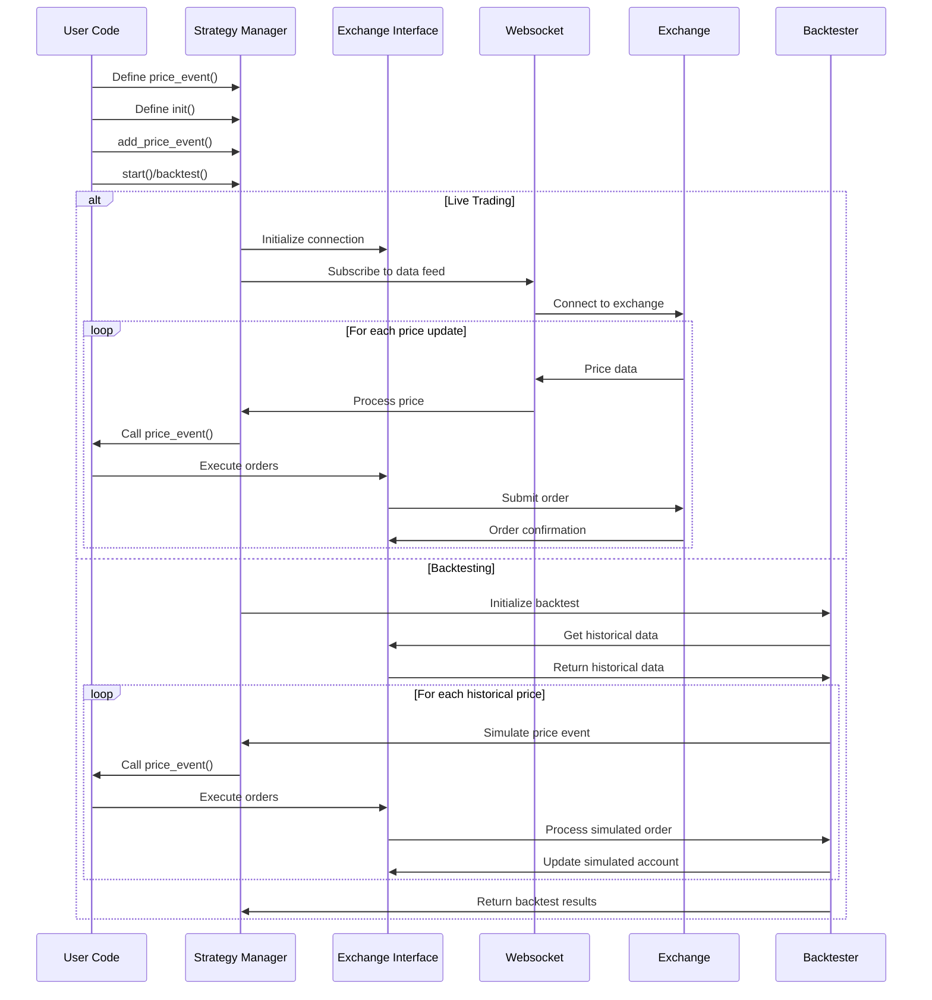
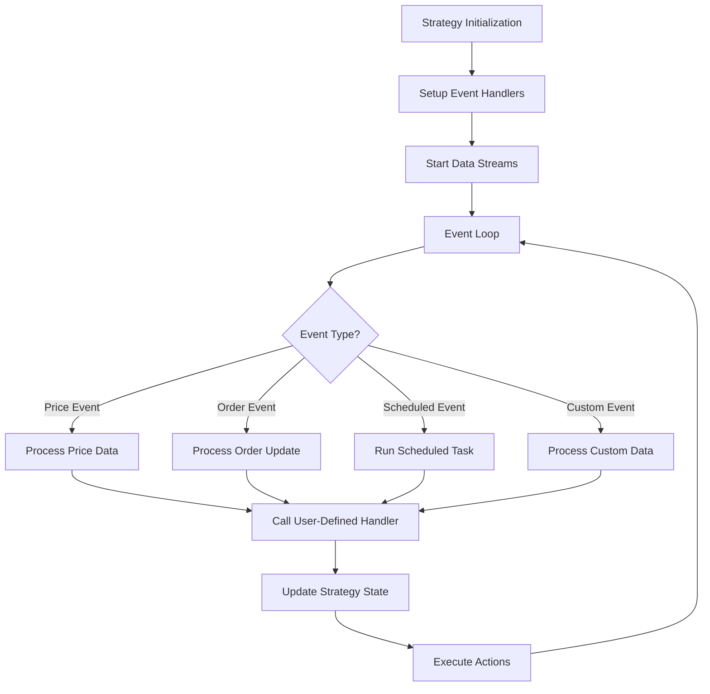
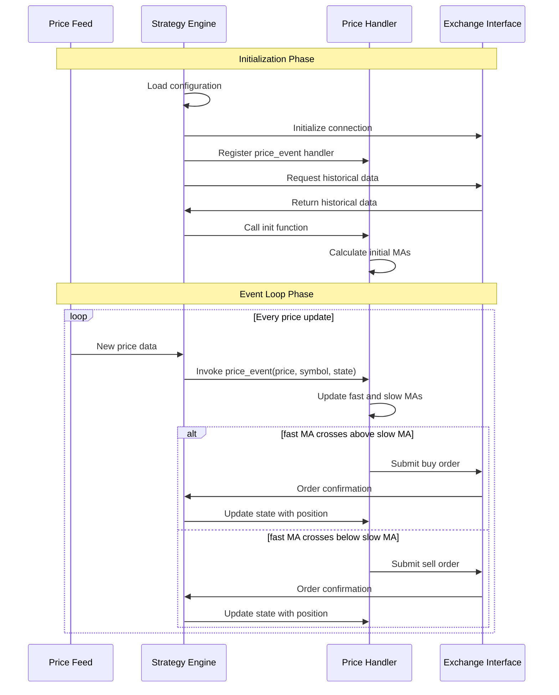

# Blankly Event Flow

## Event Flow Overview

Blankly implements an event-driven architecture where trading strategies respond to various events such as price updates, order fills, and scheduled callbacks. This document outlines the event flow, processing sequence, and event types used within the Blankly framework.



## Event Types and Purposes

Blankly processes several key event types through its event-driven workflow:

### 1. Price Events

The core event type in Blankly is the price event, triggered by changes in asset prices:

```python
def price_event(price, symbol, state):
    # Triggered when new price data is available
    pass
```

Price events are used for:
- Making trading decisions based on current market prices
- Updating strategy state based on price movements
- Executing orders when price conditions are met
- Calculating technical indicators on price streams

### 2. Initialization Events

Initialization events occur when a strategy or component is first started:

```python
def init(symbol, state):
    # Triggered once when the strategy starts
    state.variables['sma'] = 0
```

Initialization events are used for:
- Setting up initial strategy state
- Loading historical data for context
- Initializing indicators or models
- Setting up initial positions

### 3. Order Events

Order events are triggered when orders are created, filled, or cancelled:

```python
def order_event(order, state):
    # Handle order status changes
    if order.status == 'filled':
        # Perform actions when an order is filled
    pass
```

Order events are used for:
- Tracking order lifecycles
- Implementing post-order logic
- Managing position sizing
- Recording trade history

### 4. Scheduled Events

Scheduled events occur at specific times or intervals:

```python
def scheduled_event(state):
    # Runs at scheduled times
    pass

strategy.add_scheduled_event(scheduled_event, '30m')
```

Scheduled events are used for:
- Periodic portfolio rebalancing
- Regular data downloads or calculations
- Time-based strategy adjustments
- Scheduled reporting or notifications

### 5. Custom Data Events

Custom data events are triggered by external data sources:

```python
def on_tweet(tweet_data, state):
    # Triggered when new tweet data arrives
    sentiment = analyze_sentiment(tweet_data)
    state.variables['sentiment'] = sentiment
```

Custom data events are used for:
- Incorporating alternative data into strategies
- Responding to news or social media
- Integrating external signals

## Event Processing Sequence

The typical event flow in Blankly follows this sequence:



### Initialization Phase

The sequence begins with strategy initialization:

1. **Configuration Loading**:
   - Load settings from JSON files
   - Connect to exchanges
   - Initialize exchange interfaces

2. **Strategy Setup**:
   - Register event handlers
   - Set up initial variables
   - Load historical data for context

3. **Event Registration**:
   - Register price events
   - Set up scheduled events
   - Register custom data sources

### Event Loop Phase

Once initialized, Blankly enters an event loop:

1. **Event Reception**:
   - Receive price updates from websockets or simulated data
   - Monitor order status changes
   - Check scheduled event timers
   - Listen for custom data events

2. **Event Preprocessing**:
   - Format and normalize event data
   - Enrich events with additional context
   - Apply filters if configured

3. **Handler Invocation**:
   - Call the appropriate user-defined event handler
   - Provide current state and event data
   - Catch and handle any exceptions

4. **State Management**:
   - Update strategy state based on event processing
   - Persist state changes if necessary
   - Prepare state for next event

### Action Execution Phase

After event processing, actions are executed:

1. **Order Execution**:
   - Submit orders to exchange or simulator
   - Record order details in state
   - Monitor order status

2. **Position Management**:
   - Update position tracking
   - Apply risk management rules
   - Adjust position sizes if needed

3. **Results Recording**:
   - Log events and actions
   - Update performance metrics
   - Generate notifications if configured

## Concrete Event Flow Example: Moving Average Crossover

Let's examine a specific example of event flow through a moving average crossover strategy:



### Step-by-Step Execution:

1. **Initialization**:
   ```python
   def init(symbol, state):
       # Get historical data for calculating initial MAs
       history = state.interface.history(symbol, 100, resolution='1d')
       closes = history['close'].tolist()
       
       # Calculate initial MAs
       fast_period = 10
       slow_period = 50
       state.variables['fast_ma'] = sum(closes[-fast_period:]) / fast_period
       state.variables['slow_ma'] = sum(closes[-slow_period:]) / slow_period
       state.variables['position'] = 0
   ```

2. **Price Event Processing**:
   ```python
   def price_event(price, symbol, state):
       # Update moving averages with new price
       fast_period = 10
       slow_period = 50
       
       closes = state.variables.get('closes', [])
       closes.append(price)
       closes = closes[-slow_period:]  # Keep only needed history
       state.variables['closes'] = closes
       
       # Recalculate MAs
       fast_ma = sum(closes[-fast_period:]) / fast_period
       slow_ma = sum(closes[-slow_period:]) / slow_period
       
       # Store updated MAs
       state.variables['fast_ma'] = fast_ma
       state.variables['slow_ma'] = slow_ma
       
       # Check for crossover
       prev_fast = state.variables.get('prev_fast_ma', 0)
       prev_slow = state.variables.get('prev_slow_ma', 0)
       
       # Buy signal: fast crosses above slow
       if prev_fast <= prev_slow and fast_ma > slow_ma and state.variables['position'] <= 0:
           # Calculate position size (e.g., 95% of available cash)
           size = 0.95 * state.interface.cash / price
           state.interface.market_order(symbol, 'buy', size)
           state.variables['position'] = size
       
       # Sell signal: fast crosses below slow
       elif prev_fast >= prev_slow and fast_ma < slow_ma and state.variables['position'] > 0:
           state.interface.market_order(symbol, 'sell', state.variables['position'])
           state.variables['position'] = 0
       
       # Store current MAs for next comparison
       state.variables['prev_fast_ma'] = fast_ma
       state.variables['prev_slow_ma'] = slow_ma
   ```

3. **Strategy Execution**:
   ```python
   # Initialize exchange and strategy
   exchange = blankly.CoinbasePro()
   strategy = blankly.Strategy(exchange)
   
   # Add the price event
   strategy.add_price_event(price_event, 'BTC-USD', resolution='1h', init=init)
   
   # Run the strategy (live or backtest)
   strategy.start()  # For live trading
   # Or
   results = strategy.backtest(...)  # For backtesting
   ```

## Timing Considerations

Blankly's event system incorporates several timing considerations:

### Resolution and Frequency

Price events are scheduled based on the specified resolution:
```python
strategy.add_price_event(price_event, 'BTC-USD', resolution='1h')
```

Resolution options include:
- Timeframes: '1s', '1m', '5m', '15m', '1h', '4h', '1d', etc.
- Tick-by-tick: For exchanges that support it
- Custom intervals: Specified in seconds

### Time Synchronization

Blankly handles time synchronization challenges:
- Exchange time differences are normalized to UTC
- Historical data is aligned to consistent intervals
- Websocket data is timestamped on receipt for consistency

### Event Ordering

Events are processed with careful attention to ordering:
1. Price events are processed chronologically
2. For multiple assets at the same timestamp, processing order is deterministic
3. Order events follow their respective price events
4. Scheduled events take priority based on their scheduled time

### Backtest vs. Live Timing

The timing behavior differs between backtesting and live trading:

**Backtesting**:
- Events are processed as fast as computationally possible
- Simulated time progresses discretely between data points
- All events for a timestamp are processed before moving to the next

**Live Trading**:
- Events occur in real-time based on market activity
- Scheduled events use the system clock
- Price events depend on exchange websocket feeds

## Error Handling in Event Flow

Blankly implements robust error handling throughout the event flow:

### Exception Handling

Strategy-level exception handling prevents crashes:
```python
def price_event(price, symbol, state):
    try:
        # Strategy logic here
    except Exception as e:
        # Log error but continue running
        state.interface.notify("Strategy error: " + str(e))
```

### Specific Error Cases

Blankly handles common error scenarios:

1. **Exchange API Errors**:
   - Rate limit handling with exponential backoff
   - Connection retry logic
   - Fallback to REST API if websocket fails

2. **Data Inconsistencies**:
   - Missing price points are interpolated or carried forward
   - Outlier detection for anomalous price spikes
   - Timestamp alignment for multi-asset strategies

3. **Order Execution Failures**:
   - Insufficient funds handling
   - Minimum order size enforcement
   - Invalid price/size detection

### Reporting and Logging

Error events are recorded for analysis:
- Errors are logged with contextual information
- Critical errors can trigger notifications
- Performance impact of errors is tracked

### Recovery Mechanisms

Strategies can implement recovery patterns:
```python
def price_event(price, symbol, state):
    # Check if we're in recovery mode
    if state.variables.get('recovery_mode', False):
        # Execute recovery logic
        if recovery_condition_met():
            state.variables['recovery_mode'] = False
    else:
        try:
            # Normal strategy logic
            pass
        except CriticalError:
            # Enter recovery mode
            state.variables['recovery_mode'] = True
```

## Advanced Event Flow Patterns

Blankly supports several advanced event flow patterns:

### Multi-Asset Event Coordination

Strategies can coordinate actions across multiple assets:
```python
# Strategy state can share data across different symbols
def init(symbol, state):
    if symbol == 'BTC-USD':
        # Initialize shared state for all symbols
        if 'portfolio' not in state.variables:
            state.variables['portfolio'] = {}

def price_event(price, symbol, state):
    # Update shared portfolio state
    state.variables['portfolio'][symbol] = price
    
    # Make decisions based on entire portfolio
    if len(state.variables['portfolio']) >= 3:  # Wait for data from at least 3 assets
        execute_portfolio_strategy(state)
```

### Event Chaining

Events can trigger other events in sequence:
```python
def price_event(price, symbol, state):
    # Process price and decide to rebalance
    if rebalance_condition(price, state):
        # Schedule a rebalance event
        state.variables['pending_rebalance'] = True

def scheduled_event(state):
    # Check for pending rebalance
    if state.variables.get('pending_rebalance', False):
        perform_rebalance(state)
        state.variables['pending_rebalance'] = False
```

### Event Aggregation

Multiple events can be aggregated before taking action:
```python
def price_event(price, symbol, state):
    # Add price to buffer
    if 'price_buffer' not in state.variables:
        state.variables['price_buffer'] = []
    
    state.variables['price_buffer'].append(price)
    
    # Only take action after collecting enough prices
    if len(state.variables['price_buffer']) >= 10:
        # Calculate average price
        avg_price = sum(state.variables['price_buffer']) / len(state.variables['price_buffer'])
        # Take action based on average
        if decision_function(avg_price, state):
            execute_trade(symbol, state)
        # Reset buffer
        state.variables['price_buffer'] = []
``` 