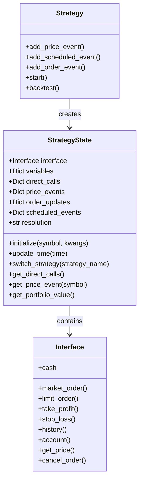
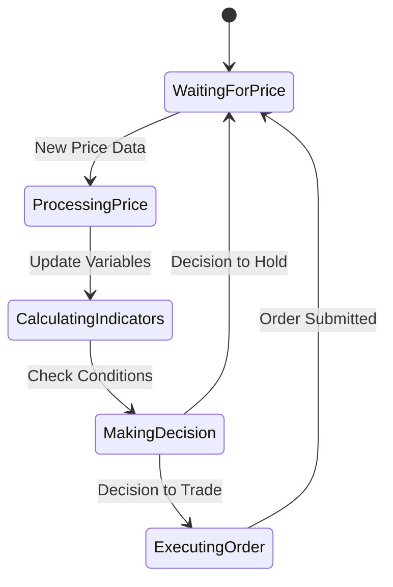
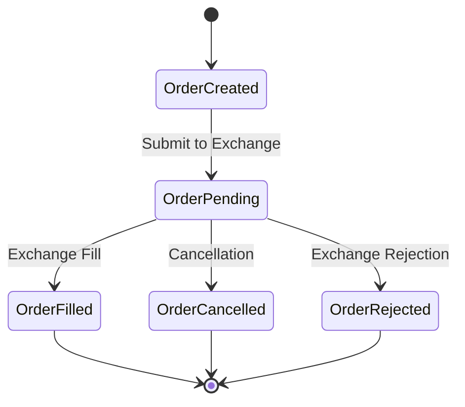

# Blankly State Management

## State Model Overview

Blankly implements a comprehensive state management system to track and maintain the state of trading strategies across both live trading and backtesting environments. The state management is primarily handled through the `StrategyState` class, which provides a consistent interface for accessing exchange data, strategy variables, and trading functionality.



The state model consists of several core components:

### 1. Strategy Variables

The `variables` dictionary within `StrategyState` serves as the primary state store for user-defined data:

```python
def init(symbol, state):
    # Initialize strategy variables
    state.variables['sma_period'] = 20
    state.variables['position_size'] = 0
    state.variables['last_price'] = 0
    state.variables['trades'] = []
```

These variables persist throughout the strategy's lifecycle and can be accessed and modified by any event handler.

### 2. Exchange Interface

The `interface` property provides access to exchange functionality, which represents another aspect of state - the current market and account state:

```python
def price_event(price, symbol, state):
    # Access account state
    current_portfolio = state.interface.account
    available_cash = state.interface.cash
    
    # Access market state
    current_price = state.interface.get_price(symbol)
    
    # Modify account state
    state.interface.market_order(symbol, 'buy', funds=100)
```

### 3. Event Registration State

The state also tracks registered event handlers:

```python
# Price events registered for each symbol and resolution
state.price_events = {
    'BTC-USD': {
        '1h': <function price_event>
    }
}

# Scheduled events with their intervals
state.scheduled_events = {
    'daily_rebalance': {
        'function': <function rebalance>,
        'interval': '1d'
    }
}
```

### 4. Time State

During backtesting, the state includes time management:

```python
# Update the simulated current time during backtesting
state.update_time(datetime(2022, 1, 15, 14, 30, 0))
```

## State Components and Relationships

The state model in Blankly is structured around several key components that work together:

### Strategy State

The `StrategyState` class is the central component that:
- Maintains strategy variables
- Provides access to exchange functionality
- Tracks event registrations
- Manages time during backtesting

```python
# Typical state usage
def price_event(price, symbol, state: StrategyState):
    # Access state components
    historical_data = state.variables.get('historical_data', [])
    historical_data.append(price)
    state.variables['historical_data'] = historical_data
    
    # Make trading decisions based on state
    if decision_condition(state):
        # Execute trade through interface (modifies exchange state)
        state.interface.market_order(symbol, 'buy', funds=100)
```

### Exchange Interface

The exchange interface component:
- Abstracts exchange-specific functionality
- Provides access to account, market, and order state
- Manages the connection to the exchange
- During backtesting, simulates exchange behavior

```python
# Interface usage
def check_portfolio(state):
    # Get current holdings
    portfolio = state.interface.account
    
    # Calculate portfolio value
    portfolio_value = state.interface.get_portfolio_value()
    
    # Get specific asset holding
    btc_holding = portfolio.get('BTC', {}).get('available', 0)
```

### Backtester State

During backtesting, additional state components are involved:
- Historical price data
- Simulated account and order state
- Time progression management
- Performance metrics collection

```python
# Backtesting result state
backtest_results = strategy.backtest(...)
performance_metrics = backtest_results.metrics()
```

### Websocket State

For live trading, websocket connection state is maintained:
- Connection status
- Subscription status
- Message queue
- Reconnection logic

This state is typically handled by the `WebsocketManager` class internally.

## State Transitions and Triggers

State transitions in Blankly can be triggered by various events:

### 1. Price Updates

Price events cause transitions in both strategy variables and potentially account state:



Example of a price-triggered transition:
```python
def price_event(price, symbol, state):
    # Previous state: No position
    if state.variables['position_size'] == 0:
        if price > state.variables['buy_threshold']:
            # Transition to having a position
            state.interface.market_order(symbol, 'buy', funds=1000)
            state.variables['position_size'] = 1000 / price
            state.variables['position_state'] = 'long'
    # Previous state: Long position
    elif state.variables['position_state'] == 'long':
        if price < state.variables['sell_threshold']:
            # Transition back to no position
            state.interface.market_order(symbol, 'sell', size=state.variables['position_size'])
            state.variables['position_size'] = 0
            state.variables['position_state'] = 'none'
```

### 2. Order Status Changes

Order status updates trigger state transitions related to position management:



Example of order state transition:
```python
def order_event(order, state):
    if order.status == 'filled':
        # Update position tracking in state
        if order.side == 'buy':
            state.variables['position'] = True
            state.variables['entry_price'] = order.price
        else:  # sell
            state.variables['position'] = False
            state.variables['exit_price'] = order.price
            # Calculate and record profit
            profit = (order.price - state.variables['entry_price']) * order.size
            state.variables['trades'].append({
                'entry': state.variables['entry_price'],
                'exit': order.price,
                'profit': profit
            })
```

### 3. Scheduled Events

Time-based events trigger scheduled state transitions:

```python
def daily_rebalance(state):
    # Reset daily state variables
    state.variables['daily_high'] = 0
    state.variables['daily_low'] = float('inf')
    
    # Rebalance portfolio based on target allocations
    current_allocation = calculate_allocation(state)
    target_allocation = state.variables['target_allocation']
    
    # Execute rebalancing trades to transition to target state
    execute_rebalance(current_allocation, target_allocation, state)
```

### 4. Initialization Transition

When a strategy starts, it transitions from an uninitialized state to a ready state:

```python
def init(symbol, state):
    # Initialize from default state to ready state
    state.variables['initialized'] = True
    state.variables['strategy_start_time'] = time.time()
    
    # Load historical data to establish initial state
    historical_data = state.interface.history(symbol, 100, resolution='1d')
    state.variables['latest_close'] = historical_data['close'].iloc[-1]
    
    # Calculate initial indicators
    state.variables['sma'] = calculate_sma(historical_data['close'], 20)
```

## Persistence Mechanisms

Blankly provides several mechanisms for state persistence across different usage scenarios:

### In-Memory State

By default, state is maintained in memory during the lifetime of a strategy:

```python
# Standard in-memory state usage
def price_event(price, symbol, state):
    # Update state
    if 'price_history' not in state.variables:
        state.variables['price_history'] = []
    
    state.variables['price_history'].append(price)
    
    # Use accumulated state
    if len(state.variables['price_history']) > 20:
        calculate_moving_average(state.variables['price_history'])
```

### Deployment State Persistence

When deploying strategies using Blankly's cloud deployment features, state can be persisted to cloud storage:

```python
# State is automatically persisted in deployed environments
def price_event(price, symbol, state):
    # Update trade count
    state.variables['trade_count'] = state.variables.get('trade_count', 0) + 1
    
    # This updated count will persist even if the deployment restarts
```

### Backtest Result Persistence

Backtest results, which include the final state, can be saved to disk:

```python
results = strategy.backtest(...)
results.save('backtest_results.pkl')

# Later, results can be loaded
from blankly import load_backtest_results
restored_results = load_backtest_results('backtest_results.pkl')
```

### Manual State Serialization

For custom persistence needs, state can be manually serialized:

```python
import json

def save_state(state):
    # Extract serializable data from state
    serializable_state = {
        'variables': state.variables,
        'positions': {
            symbol: size for symbol, size in get_positions(state).items()
        }
    }
    
    # Save to file
    with open('strategy_state.json', 'w') as f:
        json.dump(serializable_state, f)

def restore_state(state, filename):
    with open(filename, 'r') as f:
        saved_state = json.load(f)
    
    # Restore variables
    state.variables.update(saved_state['variables'])
    
    # Restore positions if needed
    # ...
```

## Recovery Procedures

Blankly provides methods for recovering from failures or crashes:

### Strategy Reinitialization

When restarting a strategy, the initialization function runs again:

```python
def init(symbol, state):
    # Check if we're recovering from a crash
    if 'last_run_time' in state.variables:
        # Calculate downtime
        downtime = time.time() - state.variables['last_run_time']
        state.variables['recovered'] = True
        state.variables['recovery_time'] = time.time()
        state.variables['downtime'] = downtime
        
        # Perform recovery actions
        if downtime > 3600:  # If down for more than an hour
            # Get missing data
            missed_data = state.interface.history(
                symbol, 
                int(downtime / 3600) + 1,  # Convert to hours and add buffer
                resolution='1h'
            )
            process_missed_data(missed_data, state)
    
    # Update last run time for future recovery
    state.variables['last_run_time'] = time.time()
```

### Order Recovery

Handling open orders after a restart:

```python
def init(symbol, state):
    # Check for open orders
    open_orders = state.interface.get_open_orders(symbol)
    
    # Process any existing orders
    for order in open_orders:
        if order_still_valid(order, state):
            # Keep the order open
            state.variables['tracked_orders'].append(order.id)
        else:
            # Cancel stale orders
            state.interface.cancel_order(order.id, symbol)
```

### Position Recovery

Reconciling positions after restart:

```python
def init(symbol, state):
    # Get current positions from exchange
    account = state.interface.account
    actual_position = account.get(symbol.split('-')[0], {}).get('available', 0)
    
    # Compare with expected position in state
    expected_position = state.variables.get('position_size', 0)
    
    if abs(actual_position - expected_position) > 1e-8:  # Allow for small floating point differences
        # Reconcile discrepancy
        state.variables['position_size'] = actual_position
        state.variables['position_discrepancy_detected'] = True
        state.variables['position_correction'] = actual_position - expected_position
```

### Connection Recovery

Handling exchange connection failures:

```python
def price_event(price, symbol, state):
    try:
        # Attempt to make exchange call
        state.interface.market_order(symbol, 'buy', funds=100)
    except ConnectionError:
        # Handle connection error
        if not state.variables.get('reconnecting', False):
            state.variables['reconnecting'] = True
            state.variables['reconnect_attempts'] = 0
        
        # Implement exponential backoff
        if state.variables['reconnect_attempts'] < 5:
            state.variables['reconnect_attempts'] += 1
            # Store the intended action for retry
            state.variables['pending_orders'].append({
                'symbol': symbol,
                'side': 'buy',
                'funds': 100
            })
        else:
            # Too many failures, alert and give up
            state.variables['critical_failure'] = True
```

## Thread Safety and Concurrency Considerations

While Blankly's primary interface is synchronous, it includes several mechanisms to handle concurrent operations:

### Strategy Isolation

Multiple strategies running in the same process maintain separate state:

```python
# Strategy 1
strategy1 = blankly.Strategy(exchange)
strategy1.add_price_event(strategy1_price_event, 'BTC-USD')

# Strategy 2 with its own isolated state
strategy2 = blankly.Strategy(exchange)
strategy2.add_price_event(strategy2_price_event, 'ETH-USD')

# Both can run concurrently
strategy1.start()
strategy2.start()
```

### Multiprocessing Support

For CPU-intensive strategies, Blankly provides multiprocessing capabilities:

```python
from blankly import BlanklyBot

# Create bot for each symbol
bots = []
for symbol in ['BTC-USD', 'ETH-USD', 'SOL-USD', 'AVAX-USD', 'LINK-USD']:
    bot = BlanklyBot(exchange)
    bot.price_event(price_event_function, symbol, resolution='1h')
    bots.append(bot)

# Run all bots in separate processes
for bot in bots:
    bot.start_processes()
```

Each process has its own isolated state to prevent concurrency issues.

### Websocket Thread Safety

The websocket implementation uses threading with proper synchronization:

```python
# Internally, Blankly uses locks to protect shared state
def _handle_websocket_message(self, message):
    with self._lock:
        self._message_buffer.append(message)
        # Process message and update state safely
```

### Connection Pooling

HTTP connections are managed with connection pooling to handle concurrent requests safely:

```python
# Blankly's internal exchange clients use connection pools
# Example of configuring a connection pool in the underlying implementation
session = requests.Session()
adapter = requests.adapters.HTTPAdapter(
    pool_connections=10,
    pool_maxsize=10,
    max_retries=3
)
session.mount('https://', adapter)
```

### Race Condition Prevention

Strategies should be designed to avoid race conditions in state updates:

```python
def price_event(price, symbol, state):
    # Wrong approach - potential race condition
    position_size = state.variables.get('position_size', 0)
    state.variables['position_size'] = position_size + 1
    
    # Better approach - atomic operation
    state.variables['position_size'] = state.variables.get('position_size', 0) + 1
```

### Order Status Handling

Order status updates happen asynchronously, requiring careful state management:

```python
def order_event(order, state):
    # Check for duplicate order updates
    if order.id in state.variables.get('processed_orders', set()):
        return  # Skip if already processed
    
    # Process the order update
    # ...
    
    # Mark as processed
    if 'processed_orders' not in state.variables:
        state.variables['processed_orders'] = set()
    state.variables['processed_orders'].add(order.id)
```

### State Locking

For advanced concurrency control, manual locking can be implemented:

```python
import threading

def init(symbol, state):
    # Add a lock to the state
    state.variables['lock'] = threading.Lock()

def price_event(price, symbol, state):
    # Acquire lock before updating critical state
    with state.variables['lock']:
        # Update shared state
        if 'portfolio' not in state.variables:
            state.variables['portfolio'] = {}
        state.variables['portfolio'][symbol] = price
        
        # Make decisions based on entire portfolio
        if len(state.variables['portfolio']) >= required_assets:
            execute_portfolio_logic(state)
```

## State Model Implementation Details

The internal implementation of Blankly's state management includes several notable details:

### StrategyState Class

The core state container class contains:

```python
class StrategyState:
    def __init__(self, interface, symbol):
        # Exchange interface
        self.interface = interface
        
        # User-defined variables dictionary
        self.variables = {}
        
        # Event registration dictionaries
        self.price_events = {}
        self.scheduled_events = {}
        self.order_events = {}
        
        # Current symbol
        self.symbol = symbol
        
        # Time tracking (for backtesting)
        self._time = None
```

### Variables Dictionary

The variables dictionary provides a flexible key-value store:

```python
# Adding values
state.variables['sma'] = calculate_sma(prices)

# Retrieving with defaults
sma = state.variables.get('sma', 0)

# Complex data structures
if 'positions' not in state.variables:
    state.variables['positions'] = {}
state.variables['positions'][symbol] = size

# Nested state
if 'metrics' not in state.variables:
    state.variables['metrics'] = {
        'wins': 0,
        'losses': 0,
        'total_profit': 0
    }
state.variables['metrics']['wins'] += 1
```

### Exchange Interface

The interface property provides exchange functionality:

```python
# The interface is bound to the specific exchange
interface = state.interface

# Account information
account = interface.account
cash = interface.cash

# Market data
current_price = interface.get_price(symbol)
historical_data = interface.history(symbol, 100, resolution='1h')

# Order functions
order = interface.market_order(symbol, side, size=size, funds=funds)
limit_order = interface.limit_order(symbol, side, price, size)
```

### Backtesting State

During backtesting, additional state is maintained:

```python
# Backtest controller manages:
# - Time progression
# - Price simulation
# - Order execution simulation
# - PnL tracking
# - Metrics calculation

# Backtesting results contain:
backtest_results = strategy.backtest(...)
backtest_results.metrics  # Performance metrics
backtest_results.copy_settings  # Configuration used
backtest_results.figures  # Generated plots
backtest_results.direct_access  # Raw data access
``` 