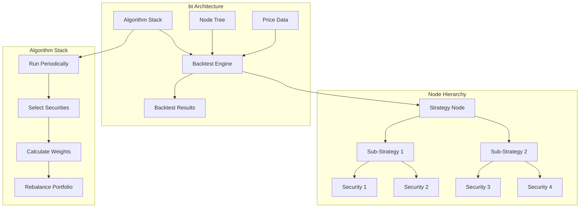

# bt Trading System

## Overview

bt (pronounced "beat") is a flexible backtesting framework for Python designed to test quantitative trading strategies. It provides a powerful yet intuitive approach to backtesting through its hierarchical tree structure and algorithm stack architecture. The system is particularly well-suited for portfolio management and asset allocation strategies, allowing users to model complex multi-level portfolio strategies with minimal code.

Unlike other event-driven backtesting frameworks, bt uses a vectorized approach combined with a flexible node-based architecture. This design allows it to efficiently process both historical data and strategy logic, while supporting complex strategy hierarchies and portfolio compositions.

## Architecture Diagram



## Key Components

### 1. Node Tree

The Node tree forms the hierarchical structure of a bt strategy:

- **Node**: The base class for all elements in the tree
  - Maintains values, weights, and returns
  - Propagates changes up and down the tree
  
- **Security**: Leaf nodes representing individual securities
  - Track prices and positions
  - Update values based on market data
  
- **Strategy**: Non-leaf nodes representing strategy components
  - Contain children (other strategies or securities)
  - Manage allocation between children
  - Execute the algorithm stack

### 2. Algorithm Stack (AlgoStack)

The AlgoStack is the core logic engine of bt, consisting of a sequence of Algos (Algorithms) that execute in order:

- **Run Algos**: Determine when to run the strategy (e.g., RunMonthly, RunWeekly)
- **Selection Algos**: Choose securities from the universe (e.g., SelectAll, SelectN)
- **Weighting Algos**: Assign weights to selected securities (e.g., WeighEqually, WeighInvVol)
- **Rebalance Algos**: Execute portfolio adjustments (e.g., Rebalance, RebalanceOnce)
- **Utility Algos**: Provide additional functionality (e.g., PrintInfo, StoreBacktest)

### 3. Backtest Engine

The backtest engine coordinates the simulation:

- Manages time iteration through the price data
- Updates the Node tree at each timestamp
- Triggers strategy execution via the AlgoStack
- Tracks performance statistics
- Generates results

### 4. Results and Performance Analysis

bt provides extensive performance analysis capabilities:

- Equity curves and drawdowns
- Return statistics (Sharpe ratio, Sortino ratio, etc.)
- Exposure and allocation analysis
- Trade statistics
- Rolling performance metrics

## Supported Markets and Instruments

bt is designed to be market and instrument agnostic, supporting:

| Market/Instrument | Support Level | Notes |
|-------------------|---------------|-------|
| Equities (Stocks) | Excellent | Primary use case with full support |
| ETFs | Excellent | Well-suited for ETF rotation strategies |
| Indices | Excellent | Ideal for asset allocation models |
| Fixed Income (Bonds) | Good | Supports basic bond trading strategies |
| Futures | Good | Requires additional price adjustment logic |
| Options | Limited | No built-in option pricing models |
| Forex | Good | Requires exchange rate handling |
| Cryptocurrencies | Good | Requires data sourcing |

The framework is particularly well-suited for portfolio-based strategies such as:
- Strategic and tactical asset allocation
- Factor investing and smart beta
- Multi-asset portfolio management
- Fund-of-funds strategies
- Cross-asset allocation models

## Performance Characteristics

bt offers a balance of performance and flexibility:

| Characteristic | Performance |
|----------------|-------------|
| Execution Speed | Medium-High (vectorized operations) |
| Memory Usage | Medium (depends on data size) |
| Scalability | Medium (limited by Python memory constraints) |
| Processing Approach | Vectorized with node tree updates |
| Optimization Capability | Good (supports parameter optimization) |

Performance considerations:
- Designed for portfolio-level strategies rather than high-frequency trading
- Efficiently handles strategies with many securities
- Tree structure adds overhead but enables complex strategy composition
- Performance scales with the complexity of the node tree and algorithms
- Pandas-based calculations provide good performance for most use cases

## Dependencies and Requirements

### Core Dependencies

- **Python**: 3.6+
- **pandas**: Data manipulation and time series functionality
- **numpy**: Numerical computations
- **matplotlib**: Visualization (optional)
- **ffn**: Financial function library
- **scipy**: Used for optimization algorithms (optional)

### Optional Dependencies

- **plotly**: Interactive visualizations
- **ipywidgets**: Interactive display in Jupyter
- **pyfolio**: Advanced performance analysis

### System Requirements

Minimal system requirements:
- CPU: Any modern multi-core processor
- RAM: 4GB+ (8GB+ recommended for larger datasets)
- Disk: 100MB for installation, additional space for data

## Quick Start Guide

### Installation

```bash
pip install bt
```

### Basic Usage Example

```python
import bt
import pandas as pd
import ffn

# Load price data
data = bt.get('spy,agg', start='2010-01-01')

# Create a simple strategy
strategy = bt.Strategy('s1', 
                      [bt.algos.RunMonthly(),
                       bt.algos.SelectAll(),
                       bt.algos.WeighEqually(),
                       bt.algos.Rebalance()],
                      [data])

# Create and run a backtest
backtest = bt.Backtest(strategy, data)
result = bt.run(backtest)

# Display results
result.plot()
result.display()
```

### Simple 60/40 Portfolio Example

```python
import bt

# Load price data for stocks and bonds
data = bt.get('spy,agg', start='2010-01-01')

# Create a 60/40 strategy
strategy = bt.Strategy('60-40',
                      [bt.algos.RunQuarterly(),
                       bt.algos.SelectAll(),
                       bt.algos.WeighSpecified({'spy': 0.6, 'agg': 0.4}),
                       bt.algos.Rebalance()],
                      [data])

# Run backtest
result = bt.run(strategy, data)

# Display results
result.plot()
result.display()
```

### Strategy of Strategies Example

```python
import bt

# Load price data
data = bt.get('spy,iwm,qqq,eem,agg,tlt,shy,lqd', start='2010-01-01')

# Define sub-strategies
equities = bt.Strategy('equities',
                      [bt.algos.SelectThese(['spy', 'iwm', 'qqq', 'eem']),
                       bt.algos.WeighEqually()],
                      [data])

fixed_income = bt.Strategy('fixed_income',
                          [bt.algos.SelectThese(['agg', 'tlt', 'shy', 'lqd']),
                           bt.algos.WeighInvVol(lookback=63)],
                          [data])

# Define master strategy
master = bt.Strategy('master',
                    [bt.algos.RunQuarterly(),
                     bt.algos.SelectAll(),
                     bt.algos.WeighSpecified({'equities': 0.6, 'fixed_income': 0.4}),
                     bt.algos.Rebalance()],
                    [equities, fixed_income])

# Run backtest
result = bt.run(master, data)

# Display results
result.plot()
result.display()
```

## Conclusion

bt provides a powerful and flexible framework for backtesting portfolio-based trading strategies. Its unique node-based architecture and algorithm stack design make it particularly well-suited for complex allocation strategies and multi-level portfolio management. While not designed for high-frequency strategies or tick-level simulation, it excels at portfolio-level strategy development and testing with a focus on asset allocation.

Key strengths of bt include:
- Hierarchical tree structure for complex portfolio composition
- Flexible algorithm stack for strategy logic
- Efficient vectorized calculations
- Simple API for common operations
- Strong visualization and analysis capabilities

For more information, visit the [official documentation](https://pmorissette.github.io/bt/). 