# bt Event Flow

This document details the event flow and processing sequence in the bt framework. Understanding this flow is crucial for effectively utilizing the framework's capabilities and developing robust trading strategies.

## High-Level Event Flow

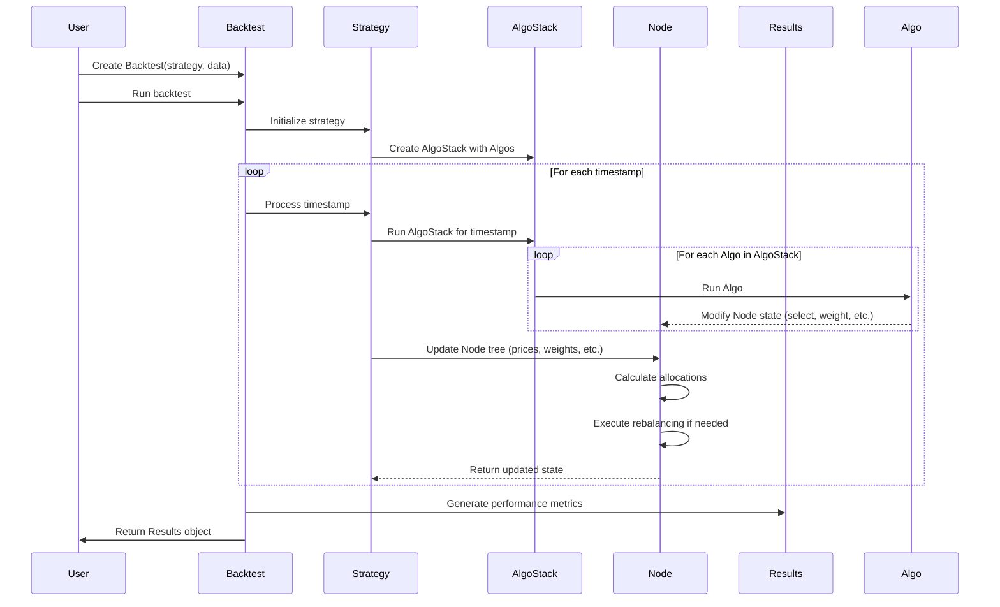

## Detailed Event Processing Sequence

bt follows a timestamp-based simulation approach where trading decisions are made at specific points in time (typically daily, weekly, or monthly). The framework processes each timestamp sequentially, with state changes propagating through the Node tree.

### 1. Initialization Phase

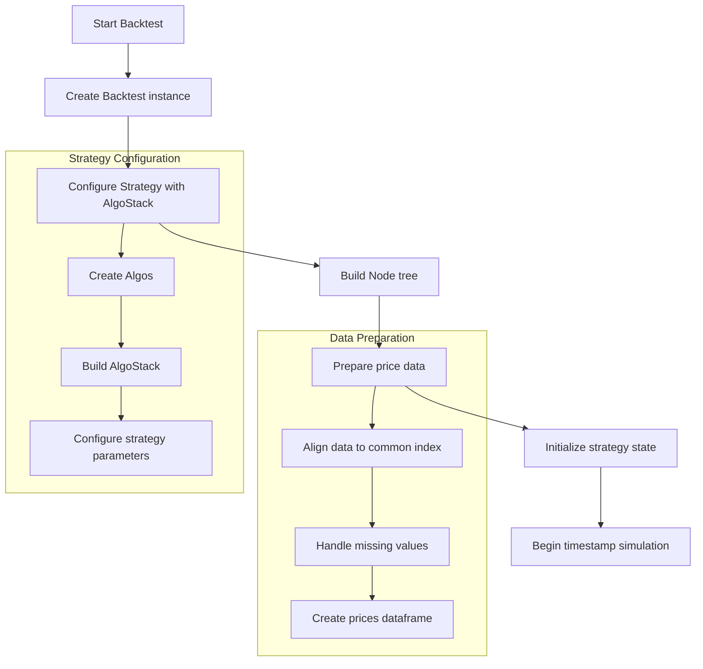

During initialization:

1. The user creates a `Backtest` instance with a strategy and price data
2. The strategy is configured with its AlgoStack (a sequence of Algos)
3. The Node tree is built (strategy hierarchy with securities as leaf nodes)
4. Price data is prepared and aligned to a common timestamp index
5. Initial state (weights, positions, cash) is established

### 2. Timestamp-Based Simulation

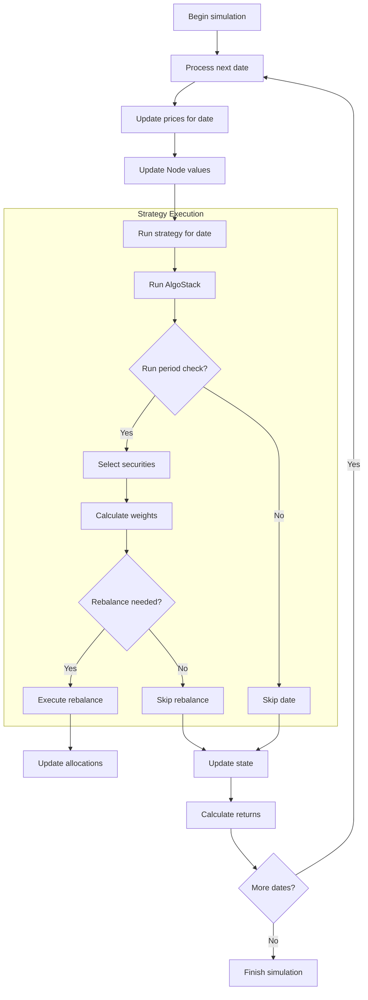

During the timestamp-based simulation:

1. For each timestamp in the index, bt:
   - Updates prices for all securities
   - Updates the value of each Node in the tree
   - Runs the strategy's AlgoStack if conditions are met

2. The AlgoStack execution follows a sequence:
   - Check if it's time to run the strategy (e.g., RunMonthly, RunWeekly)
   - If not, skip to the next timestamp
   - If yes, continue executing the AlgoStack
   - Select securities from the universe
   - Calculate target weights for selected securities
   - Determine if rebalancing is needed
   - If rebalancing is needed, update allocations

3. After the AlgoStack runs, bt:
   - Updates the portfolio state (positions, cash, etc.)
   - Calculates returns for the timestamp
   - Moves to the next timestamp

### 3. Algo Execution Flow

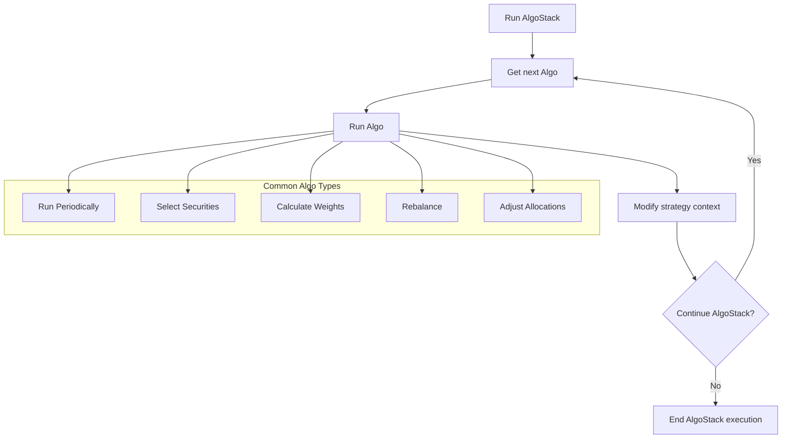

The execution of an AlgoStack involves:

1. Running each Algo in sequence
2. Each Algo can:
   - Access and modify the strategy's context (selected securities, weights, etc.)
   - Decide whether to continue to the next Algo or terminate early
   - Perform specific actions that affect the Node tree

Common Algo types include:
- **Run Algos**: Determine when to execute the strategy (e.g., `RunMonthly`, `RunWeekly`)
- **Selection Algos**: Choose which securities to include (e.g., `SelectAll`, `SelectThese`)
- **Weighting Algos**: Assign weights to securities (e.g., `WeighEqually`, `WeighTarget`)
- **Rebalance Algos**: Execute the rebalancing process (e.g., `Rebalance`)
- **Adjustment Algos**: Adjust allocations or positions (e.g., `Allocate`, `CapitalFlow`)

### 4. Node Tree Operation

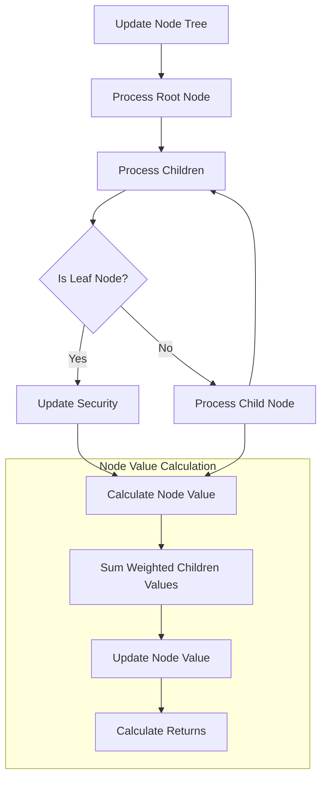

The Node tree operation involves:

1. Processing the root Node (usually a Strategy)
2. Recursively processing children Nodes
3. Updating leaf Nodes (Securities) with current prices
4. Calculating values for each Node based on its children
5. Propagating values up the tree to the root

This tree structure enables complex strategy compositions, such as:
- Strategy of strategies (fund of funds approach)
- Multi-level allocations (e.g., asset class → sector → security)
- Parallel strategies under a master allocation strategy

### 5. Rebalancing Process

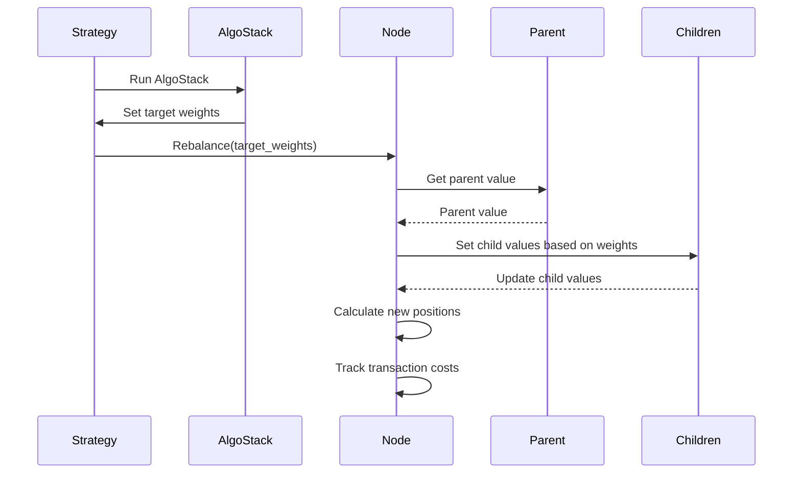

The rebalancing process:

1. The AlgoStack determines target weights for securities
2. The Rebalance Algo triggers the rebalancing process
3. The Node adjusts the values of its children based on the target weights
4. New positions are calculated
5. Transaction costs are accounted for (if enabled)
6. The Node tree is updated to reflect the new allocations

## Event Types and Their Purposes

bt processes several types of events during simulation:

### 1. Temporal Events

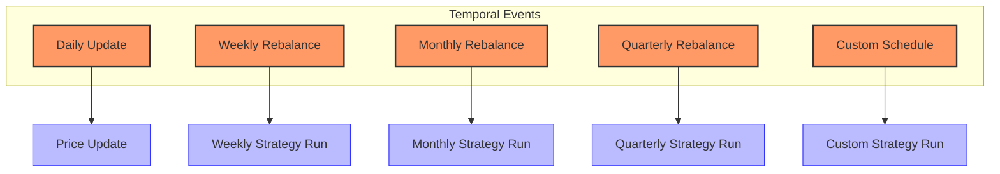

1. **Daily Updates**:
   - Update prices for all securities
   - Recalculate Node values
   - Track daily performance

2. **Periodic Strategy Runs**:
   - Weekly, monthly, quarterly, or custom periods
   - Triggered by Run Algos (RunMonthly, RunWeekly, etc.)
   - Execute the full AlgoStack when triggered

### 2. Strategy Events

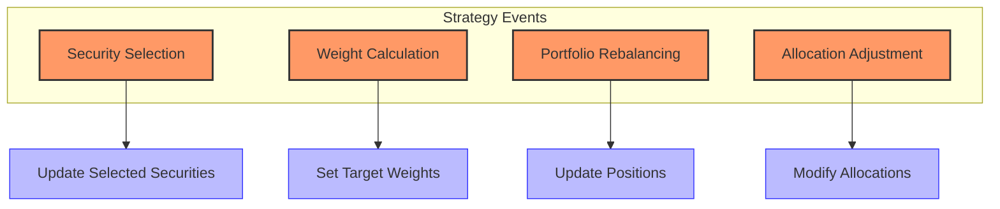

1. **Security Selection Events**:
   - Choose which securities to include in the portfolio
   - Update the selected securities in the strategy context

2. **Weight Calculation Events**:
   - Determine target weights for selected securities
   - Can use various methodologies (equal weight, target weight, optimization)

3. **Rebalancing Events**:
   - Adjust portfolio allocations to match target weights
   - Account for transaction costs (if enabled)

4. **Allocation Adjustment Events**:
   - Modify portfolio allocations based on criteria
   - Handle capital flows, restrictions, or constraints

### 3. Tree Events

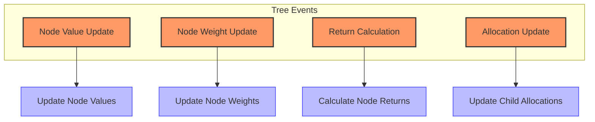

1. **Node Value Updates**:
   - Update the value of each Node based on prices or child values
   - Propagate value changes up the tree

2. **Node Weight Updates**:
   - Adjust the weights of children Nodes
   - Ensure weights sum to 1.0

3. **Return Calculation Events**:
   - Calculate returns for each Node
   - Aggregate returns up the tree

4. **Allocation Update Events**:
   - Modify allocations to children Nodes
   - Implement rebalancing at each level of the tree

## Event Processing Timing

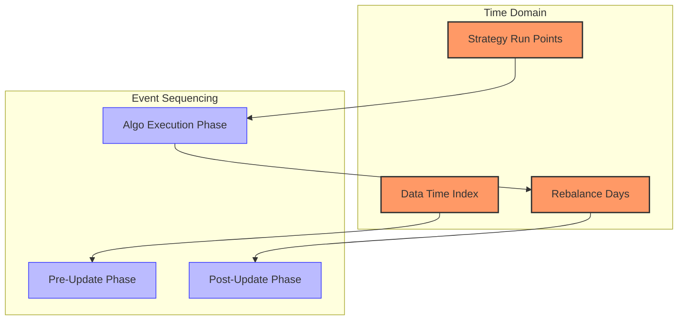

### Timing Model

bt uses a timestamp-based timing model:

1. **Data Time Index**: The framework processes each timestamp in the input data
2. **Strategy Run Points**: Run Algos determine when strategies are executed
3. **Rebalance Days**: Days when portfolio rebalancing occurs

### Event Sequencing

Events are sequenced in a specific order at each timestamp:

1. **Pre-Update Phase**:
   - Update prices for all securities
   - Update Node values based on new prices
   - Calculate pre-rebalancing returns

2. **Algo Execution Phase** (if it's a strategy run day):
   - Run the AlgoStack sequence
   - Select securities
   - Calculate target weights
   - Determine if rebalancing is needed

3. **Post-Update Phase**:
   - Execute rebalancing (if triggered)
   - Update Node allocations
   - Calculate post-rebalancing returns
   - Update performance statistics

## Error Handling in the Event Flow

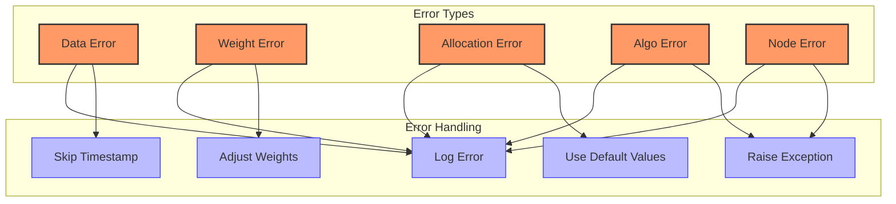

bt implements several error handling mechanisms:

### Data Errors

1. **Missing Data**: 
   - bt can fill missing data with forward/backward fill or interpolation
   - If critical data is missing, the timestamp may be skipped

2. **Inconsistent Data**:
   - Data with different frequencies is reindexed to a common timeframe
   - Misaligned data is adjusted to ensure consistency

### Weight Errors

1. **Invalid Weights**:
   - Negative weights may be floored to zero
   - Weights not summing to 1.0 are normalized

2. **Missing Weights**:
   - Securities without weights are assigned zero weight
   - Default weighting schemes can be applied

### Allocation Errors

1. **Insufficient Funds**:
   - Allocations may be scaled down proportionally
   - Transactions might be partially executed

2. **Invalid Allocations**:
   - Negative allocations may be floored to zero
   - Allocations exceeding limits can be capped

### Algo Errors

1. **Algo Failures**:
   - Errors in individual Algos are logged
   - AlgoStack execution may continue with subsequent Algos
   - Critical errors can terminate the backtest

### Node Errors

1. **Tree Structure Errors**:
   - Invalid Node relationships are caught during initialization
   - Circular references are detected and prevented

2. **Value Calculation Errors**:
   - Errors in Node value calculations are logged
   - Default values may be used in case of calculation errors

## Example Event Flow Scenarios

### Scenario 1: Monthly Rebalanced Equal-Weight Portfolio

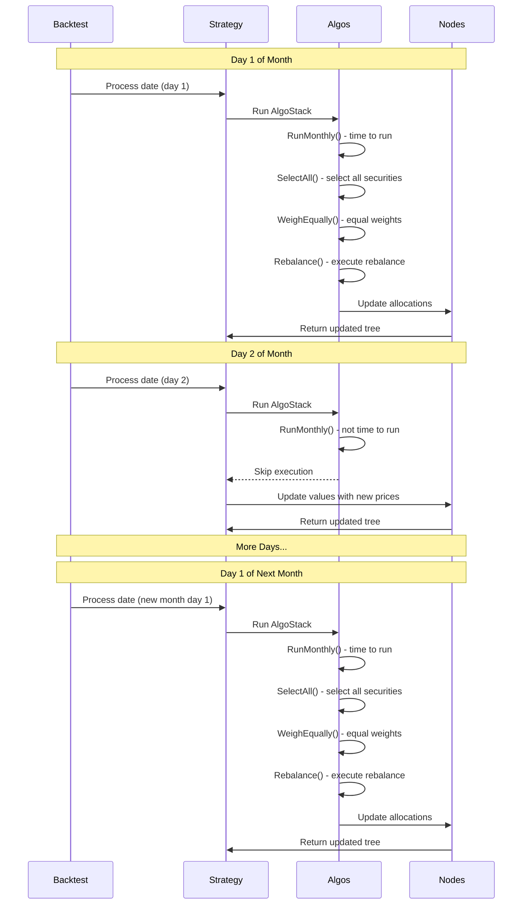

This example shows the event flow for a monthly rebalanced equal-weight portfolio:

1. On the first day of each month:
   - RunMonthly Algo determines it's time to run the strategy
   - SelectAll Algo selects all securities
   - WeighEqually Algo assigns equal weights
   - Rebalance Algo executes the rebalancing
   - Node allocations are updated

2. On other days:
   - RunMonthly Algo determines it's not time to run
   - The rest of the AlgoStack is skipped
   - Node values are updated based on new prices
   - No rebalancing occurs

### Scenario 2: Strategy Tree with Multiple Allocations

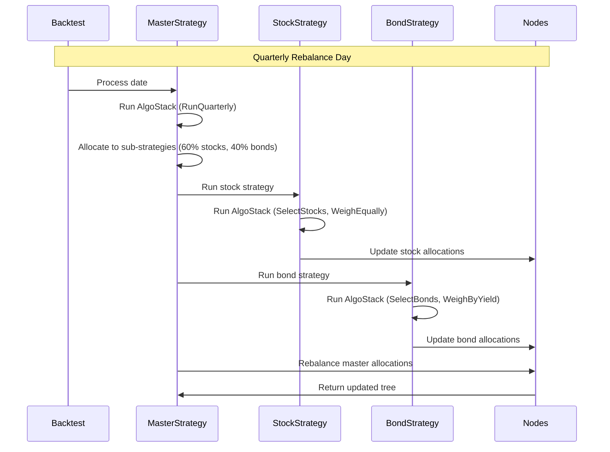

This example shows the event flow for a strategy tree with multiple allocation levels:

1. On quarterly rebalance days:
   - The master strategy allocates to sub-strategies (60% stocks, 40% bonds)
   - The stock strategy selects stocks and weights them equally
   - The bond strategy selects bonds and weights them by yield
   - The master strategy rebalances the overall allocations

2. The tree structure enables:
   - Independent sub-strategy logic
   - Hierarchical allocation decisions
   - Coordinated rebalancing across the entire portfolio

## Conclusion

bt's event flow is designed to provide a flexible framework for developing and testing a wide range of quantitative trading strategies. By understanding this event flow, users can create more effective strategies that leverage the framework's hierarchical structure and algorithm stack approach.

The framework's timestamp-based simulation, combined with its powerful tree structure and Algo composition model, enables the development of sophisticated portfolio strategies with multiple levels of decision-making and allocation. 