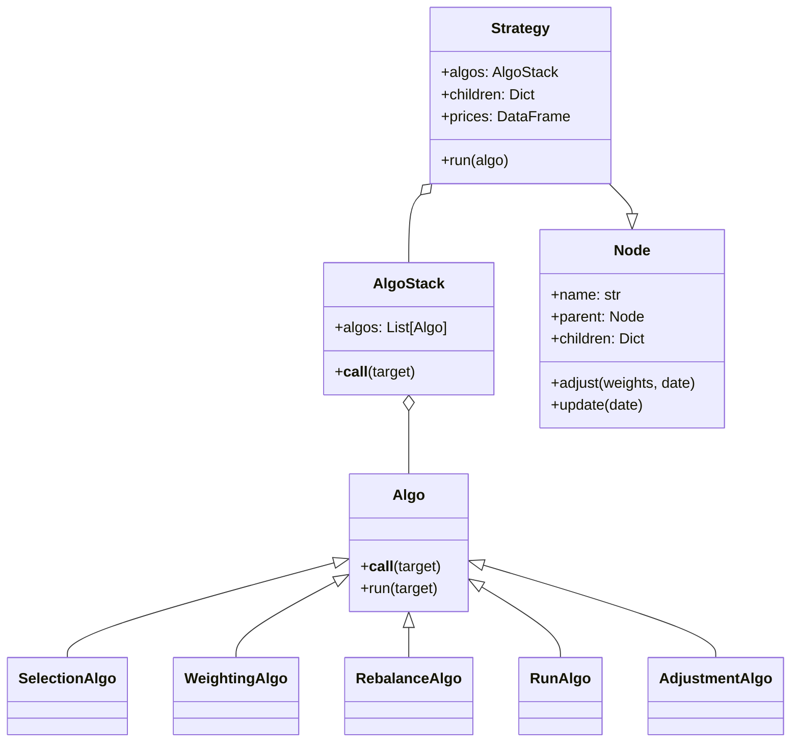
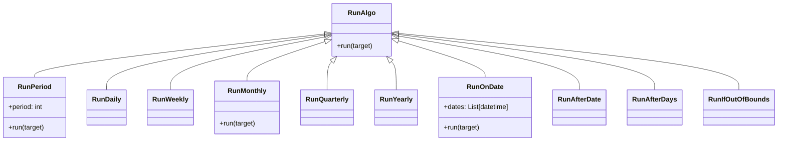
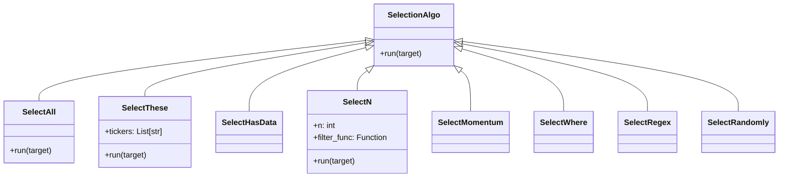
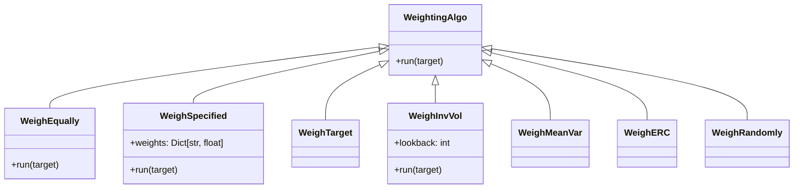
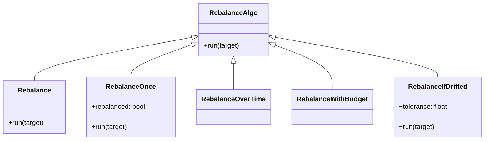
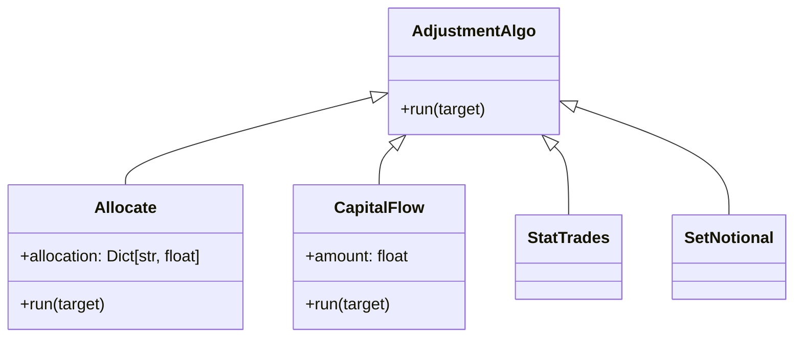
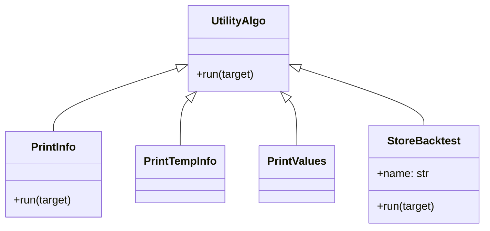
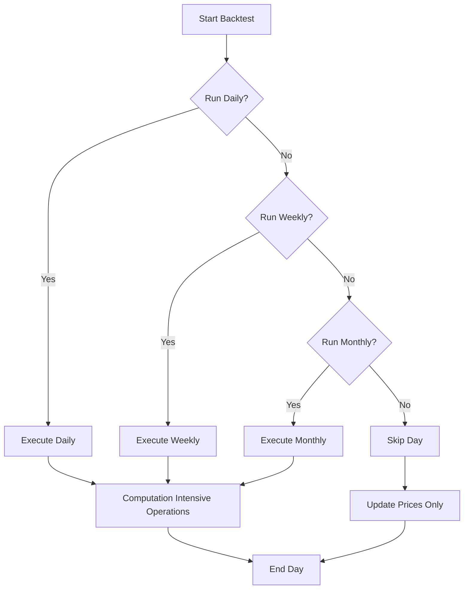

# bt Handlers

This document details the various handlers in the bt framework, their responsibilities, interfaces, and usage patterns. Understanding these handlers is crucial for effectively utilizing the framework for trading strategy development and backtesting.

## Handler Architecture Overview

bt uses a modular handler architecture centered around the concept of "Algos" (Algorithms) that form an algorithm stack. These Algos act as handlers for different aspects of the trading strategy logic, from determining when to run the strategy to security selection, weighting, and rebalancing.



The bt framework's handler architecture is organized into several key categories:

1. **Algo Base Class**: The foundation for all handlers in the system
2. **AlgoStack**: A container that manages a sequence of Algos
3. **Strategy**: Combines algos with a tree of Nodes to implement a trading strategy
4. **Node Hierarchy**: Represents the portfolio structure and handles value updates

## Algo Base Class

The Algo base class is the foundation for all handlers in bt. It defines a common interface and behavior pattern:

```python
class Algo(object):
    """
    Base class for all Algos.
    """
    
    def __call__(self, target):
        """
        Implement by running run method and passing along target.
        """
        return self.run(target)
    
    def run(self, target):
        """
        This method is called with target from the __call__ method.
        All Algo subclasses must implement this method.
        """
        raise NotImplementedError("Algo subclass must implement run")
```

### Key Responsibilities

1. **Standardized Interface**: All Algos implement a common interface
2. **Target Modification**: Algos can modify the target (usually a Strategy) state
3. **Chain Control**: Algos can return True/False to control whether subsequent Algos run
4. **Reusability**: Algos are designed to be reusable across different strategies

### Usage Pattern

```python
# Simple usage of an Algo
algo = SomeAlgo(param1=value1, param2=value2)
result = algo(strategy)  # Runs algo.run(strategy)

# Usage within a strategy
strategy = bt.Strategy('strategy_name', 
                      [Algo1(), Algo2(), Algo3()],
                      [asset1, asset2, asset3])
```

## AlgoStack

AlgoStack serves as a container for a sequence of Algos that are executed in order:

```python
class AlgoStack(object):
    """
    Container for a stack of Algos.
    """
    
    def __init__(self, *algos):
        """
        Initialize with a list of algos.
        """
        self.algos = algos
        
    def __call__(self, target):
        """
        Call each algo in sequence on target.
        Returns result of last Algo.
        If any algo returns False, execution is stopped.
        """
        for algo in self.algos:
            if not algo(target):
                return False
        return True
```

### Key Responsibilities

1. **Sequence Management**: Maintains a sequence of Algos to be executed
2. **Execution Flow Control**: Executes Algos in sequence, stopping if any return False
3. **Target Passing**: Passes the target object to each Algo in sequence
4. **Result Forwarding**: Returns the result of the last executed Algo

### Usage Pattern

```python
# Create an AlgoStack with multiple Algos
algo_stack = bt.AlgoStack(
    bt.algos.RunMonthly(),
    bt.algos.SelectAll(),
    bt.algos.WeighEqually(),
    bt.algos.Rebalance()
)

# Use in a strategy
strategy = bt.Strategy('strategy_name', algo_stack, universe)

# Execute the AlgoStack
algo_stack(strategy)
```

## Category 1: Run Handlers

Run handlers determine when a strategy should execute, based on time or condition criteria:



### Key Run Handlers

| Handler | Description | Key Parameters |
|---------|-------------|----------------|
| `RunPeriod` | Run every n periods | `period`: Number of periods between runs |
| `RunDaily` | Run every day | - |
| `RunWeekly` | Run every week | `weekday`: Day of week (0=Monday) |
| `RunMonthly` | Run every month | `monthday`: Day of month |
| `RunQuarterly` | Run every quarter | `monthday`: Day of month |
| `RunYearly` | Run every year | `month`: Month to run |
| `RunOnDate` | Run on specific dates | `dates`: List of dates |
| `RunAfterDate` | Run after a specific date | `date`: Start date |
| `RunAfterDays` | Run after n days from start | `days`: Number of days |
| `RunIfOutOfBounds` | Run if weights drift | `bounds`: Tolerance range |

### Usage Pattern

```python
# Run monthly on the first day of the month
run_monthly = bt.algos.RunMonthly(monthday=1)

# Run weekly on Mondays
run_weekly = bt.algos.RunWeekly(weekday=0)

# Run quarterly on the 15th of the quarter-end month
run_quarterly = bt.algos.RunQuarterly(monthday=15)

# Run on specific dates
run_on_dates = bt.algos.RunOnDate([
    datetime(2020, 1, 15),
    datetime(2020, 4, 15),
    datetime(2020, 7, 15)
])

# Run every 10 periods
run_periodically = bt.algos.RunPeriod(period=10)
```

### Interface Details

All Run Algos implement a common interface:

```python
def run(self, target):
    """
    Determine if the strategy should be executed at the current time.
    
    Returns:
        bool: True if the strategy should run, False otherwise
    """
    # Implementation specific to the Run Algo
    if should_run:
        return True
    else:
        return False
```

### Error Handling

Run handlers implement several error handling mechanisms:

1. **Invalid Date Handling**: Handles cases where specified dates don't exist
2. **Out-of-Range Protection**: Validates that specified days exist for the month
3. **Data Availability Checks**: Ensures data is available for the run date

## Category 2: Selection Handlers

Selection handlers determine which securities from the universe should be included in the portfolio:



### Key Selection Handlers

| Handler | Description | Key Parameters |
|---------|-------------|----------------|
| `SelectAll` | Select all securities in universe | - |
| `SelectThese` | Select specific securities | `tickers`: List of tickers |
| `SelectHasData` | Select securities with valid data | `lookback`: Data lookback period |
| `SelectN` | Select top N by some metric | `n`: Number to select, `filter_func`: Filter function |
| `SelectMomentum` | Select by momentum | `n`: Number to select, `lookback`: Momentum period |
| `SelectWhere` | Select based on condition | `criterion`: Selection condition |
| `SelectRegex` | Select matching pattern | `pattern`: Regex pattern |
| `SelectRandomly` | Select random securities | `n`: Number to select |

### Usage Pattern

```python
# Select all securities in the universe
select_all = bt.algos.SelectAll()

# Select specific securities
select_these = bt.algos.SelectThese(['AAPL', 'MSFT', 'AMZN'])

# Select top 10 securities by momentum over 6 months
select_momentum = bt.algos.SelectMomentum(n=10, lookback=126)

# Select securities matching a pattern
select_tech = bt.algos.SelectRegex(pattern='^[A-Z]+\.[A-Z]$')

# Select stocks with positive returns in the past month
select_positive = bt.algos.SelectWhere(
    lambda x: x.loc[-21:, :].mean() > 0
)
```

### Interface Details

Selection Algos interact with the target's temp storage:

```python
def run(self, target):
    """
    Select securities based on specific criteria.
    
    Modifies:
        target.temp['selected']: List of selected securities
    
    Returns:
        bool: True if any securities were selected, False otherwise
    """
    # Implementation specific to the Selection Algo
    # Populates target.temp['selected'] with selected securities
    
    if len(target.temp['selected']) > 0:
        return True
    else:
        return False
```

### Error Handling

Selection handlers implement several error handling mechanisms:

1. **Empty Universe Handling**: Handles the case of an empty universe
2. **Missing Data Handling**: Skips securities with missing data
3. **Insufficient Data Protection**: Validates sufficient data for calculations

## Category 3: Weighting Handlers

Weighting handlers determine how to allocate capital among the selected securities:



### Key Weighting Handlers

| Handler | Description | Key Parameters |
|---------|-------------|----------------|
| `WeighEqually` | Equal weight to all selected | - |
| `WeighSpecified` | Use specified weights | `weights`: Dictionary of weights |
| `WeighTarget` | Target weight allocation | `weights`: Target weights |
| `WeighInvVol` | Inverse volatility weighting | `lookback`: Volatility period |
| `WeighMeanVar` | Mean-variance optimization | `lookback`: Return period |
| `WeighERC` | Equal risk contribution | `lookback`: Risk calculation period |
| `WeighRandomly` | Random weight allocation | - |

### Usage Pattern

```python
# Equal weight allocation
weigh_equally = bt.algos.WeighEqually()

# Specified weight allocation
weigh_specified = bt.algos.WeighSpecified({
    'AAPL': 0.25,
    'MSFT': 0.25,
    'AMZN': 0.5
})

# Inverse volatility weighting with 60-day lookback
weigh_inv_vol = bt.algos.WeighInvVol(lookback=60)

# Mean-variance optimization
weigh_mean_var = bt.algos.WeighMeanVar(
    lookback=252,
    bounds=(0, 0.5)  # Min/max weight
)

# Equal risk contribution
weigh_erc = bt.algos.WeighERC(lookback=63)
```

### Interface Details

Weighting Algos interact with the target's temp storage:

```python
def run(self, target):
    """
    Calculate weights for selected securities.
    
    Input:
        target.temp['selected']: List of selected securities
    
    Modifies:
        target.temp['weights']: Dictionary of weights for each security
    
    Returns:
        bool: True if weights were successfully calculated, False otherwise
    """
    # Implementation specific to the Weighting Algo
    # Uses target.temp['selected'] and populates target.temp['weights']
    
    if weights_calculated_successfully:
        return True
    else:
        return False
```

### Error Handling

Weighting handlers implement several error handling mechanisms:

1. **Normalization**: Ensures weights sum to 1.0
2. **Constraint Enforcement**: Enforces minimum/maximum weight constraints
3. **Missing Data Handling**: Handles securities with insufficient data
4. **Numerical Stability**: Addresses numerical issues in optimization procedures

## Category 4: Rebalance Handlers

Rebalance handlers determine when and how to adjust the portfolio weights:



### Key Rebalance Handlers

| Handler | Description | Key Parameters |
|---------|-------------|----------------|
| `Rebalance` | Standard rebalance | - |
| `RebalanceOnce` | Rebalance only once | - |
| `RebalanceOverTime` | Gradual rebalancing | `n`: Number of periods |
| `RebalanceWithBudget` | Limited turnover rebalance | `max_turnover`: Maximum turnover |
| `RebalanceIfDrifted` | Rebalance if weights drift | `tolerance`: Drift tolerance |

### Usage Pattern

```python
# Standard rebalance
rebalance = bt.algos.Rebalance()

# Rebalance only once at the beginning
rebalance_once = bt.algos.RebalanceOnce()

# Gradual rebalancing over 5 days
rebalance_over_time = bt.algos.RebalanceOverTime(n=5)

# Rebalance with maximum 10% turnover
rebalance_with_budget = bt.algos.RebalanceWithBudget(max_turnover=0.1)

# Rebalance only if weights drift by more than 5%
rebalance_if_drifted = bt.algos.RebalanceIfDrifted(tolerance=0.05)
```

### Interface Details

Rebalance Algos implement a common interface:

```python
def run(self, target):
    """
    Execute rebalancing based on the calculated weights.
    
    Input:
        target.temp['weights']: Dictionary of target weights
    
    Modifies:
        target.children: Updates child node allocations
    
    Returns:
        bool: True if rebalancing was executed, False otherwise
    """
    # Implementation specific to the Rebalance Algo
    # Uses target.temp['weights'] to adjust target.children
    
    # Execute rebalance
    target.adjust(target.temp['weights'])
    return True
```

### Error Handling

Rebalance handlers implement several error handling mechanisms:

1. **Insufficient Funds Handling**: Scales allocations if insufficient funds
2. **Transaction Cost Consideration**: Accounts for transaction costs
3. **Turnover Limitation**: Limits rebalancing to control turnover
4. **Weight Validation**: Validates weights before rebalancing

## Category 5: Adjustment Handlers

Adjustment handlers provide additional portfolio modifications:



### Key Adjustment Handlers

| Handler | Description | Key Parameters |
|---------|-------------|----------------|
| `Allocate` | Fixed allocation to children | `allocation`: Allocation percentages |
| `CapitalFlow` | Add/remove capital | `amount`: Amount to add/remove |
| `StatTrades` | Record trade statistics | - |
| `SetNotional` | Set portfolio notional value | `value`: Target value |

### Usage Pattern

```python
# Allocate 60% to stocks, 40% to bonds
allocate = bt.algos.Allocate({
    'stocks': 0.6,
    'bonds': 0.4
})

# Add capital flow
capital_flow = bt.algos.CapitalFlow(amount=10000)

# Record trade statistics
stat_trades = bt.algos.StatTrades()

# Set portfolio notional value to 1 million
set_notional = bt.algos.SetNotional(value=1000000)
```

### Interface Details

Adjustment Algos implement a common interface:

```python
def run(self, target):
    """
    Make adjustments to the portfolio or record statistics.
    
    Modifies:
        target: Modifies target state based on the adjustment type
    
    Returns:
        bool: True if adjustment was successful, False otherwise
    """
    # Implementation specific to the Adjustment Algo
    
    if adjustment_successful:
        return True
    else:
        return False
```

### Error Handling

Adjustment handlers implement several error handling mechanisms:

1. **Invalid Allocation Handling**: Validates allocation percentages
2. **Insufficient Funds Protection**: Handles insufficient funds for capital flows
3. **Data Recording Validation**: Ensures data is valid for recording

## Category 6: Utility Handlers

Utility handlers provide additional functionality:



### Key Utility Handlers

| Handler | Description | Key Parameters |
|---------|-------------|----------------|
| `PrintInfo` | Print strategy information | - |
| `PrintTempInfo` | Print temporary variables | - |
| `PrintValues` | Print node values | - |
| `StoreBacktest` | Store backtest state | `name`: Storage name |

### Usage Pattern

```python
# Print strategy information
print_info = bt.algos.PrintInfo()

# Print temporary variables
print_temp = bt.algos.PrintTempInfo()

# Print node values
print_values = bt.algos.PrintValues()

# Store backtest state
store_backtest = bt.algos.StoreBacktest(name='monthly_selection')
```

### Interface Details

Utility Algos implement a common interface:

```python
def run(self, target):
    """
    Perform utility operations like printing or storing information.
    
    Returns:
        bool: True to continue AlgoStack execution, False otherwise
    """
    # Implementation specific to the Utility Algo
    
    # Always continue execution
    return True
```

## Custom Handler Development

bt's architecture is designed to be extended with custom handlers. Users can create their own Algos by subclassing the Algo base class:

```python
class MyCustomAlgo(bt.Algo):
    """
    Custom Algo that does something special.
    """
    
    def __init__(self, param1, param2=None):
        self.param1 = param1
        self.param2 = param2
    
    def run(self, target):
        """
        Implement the Algo's logic.
        """
        # Algo implementation
        
        # Access target's state
        current_date = target.now
        
        # Modify target's temporary state
        target.temp['my_data'] = some_calculation()
        
        # Return True to continue AlgoStack execution
        return True
```

### Best Practices for Custom Handlers

1. **Documentation**: Document the purpose and behavior of your Algo
2. **Input Validation**: Validate input parameters in the constructor
3. **Error Handling**: Implement robust error handling
4. **State Modification**: Be clear about which aspects of state you modify
5. **Chain Consideration**: Consider when to return False to stop AlgoStack execution
6. **Performance**: Be mindful of computational efficiency

### Common Extension Points

1. **Custom Selection Logic**: Create custom security selection criteria
2. **Advanced Weighting Schemes**: Implement sophisticated weighting methodologies
3. **Conditional Execution**: Create Algos that execute based on complex conditions
4. **Performance Analytics**: Track and store custom performance metrics
5. **Integration Points**: Connect with external data sources or systems

## Performance Considerations

When working with bt's handlers, consider these performance aspects:

### 1. Handler Execution Frequency



Performance tips for handler execution:

1. **Use Appropriate Run Frequency**: Match run frequency to strategy needs
2. **Optimize Computation-Heavy Algos**: Minimize iterations and vectorize operations
3. **Leverage Caching**: Cache intermediate results in the target's temp storage
4. **Progressive Filtering**: Apply cheaper filters first in selection chains

### 2. Data Access Patterns

Efficient data access in handlers:

1. **Vectorized Operations**: Use pandas vectorized operations instead of loops
2. **Minimize Data Copying**: Avoid unnecessary data copying
3. **Reuse Calculations**: Store and reuse intermediate calculations
4. **Limit Historical Lookback**: Limit historical data lookback to what's needed

### 3. Memory Management

```python
# Memory-efficient handler example
class EfficientAlgo(bt.Algo):
    def run(self, target):
        # Use view instead of copy where possible
        prices = target.universe.loc[:target.now].iloc[-self.lookback:]
        
        # Use inplace operations
        result = pd.DataFrame(index=prices.columns)
        result['metric'] = prices.pct_change().std()
        
        # Clean up temporary data
        if 'large_temp_data' in target.temp:
            del target.temp['large_temp_data']
            
        return True
```

Memory management tips:

1. **Clean Temporary Data**: Remove large temporary data after use
2. **Use Views Not Copies**: Use data views instead of copies when possible
3. **Process in Chunks**: For large datasets, process in manageable chunks
4. **Be Mindful of Node Tree Size**: Limit unnecessary nodes in the tree

## Edge Cases and Handling

bt's handlers need to address several edge cases:

### 1. Empty Selection Sets

```python
class RobustSelectionAlgo(bt.Algo):
    def run(self, target):
        # Apply selection logic
        target.temp['selected'] = [...] # Selected securities
        
        # Handle empty selection case
        if len(target.temp['selected']) == 0:
            # Fallback selection logic
            target.temp['selected'] = ['CASH']
            
        return True
```

### 2. Insufficient Funds

```python
class SafeRebalanceAlgo(bt.Algo):
    def run(self, target):
        # Get target weights
        weights = target.temp['weights']
        
        # Scale weights if necessary
        available_capital = target.value
        required_capital = calculate_required_capital(weights, prices)
        
        if required_capital > available_capital:
            scale_factor = available_capital / required_capital
            weights = {k: w * scale_factor for k, w in weights.items()}
        
        # Execute rebalance
        target.adjust(weights)
        return True
```

### 3. Missing Data

```python
class RobustWeightingAlgo(bt.Algo):
    def run(self, target):
        selected = target.temp['selected']
        weights = {}
        
        for sec in selected:
            # Check for valid data
            if has_valid_data(target, sec):
                weights[sec] = calculate_weight(target, sec)
            else:
                # Skip securities with missing data
                continue
                
        # Normalize weights to sum to 1.0
        if weights:
            total = sum(weights.values())
            weights = {k: w/total for k, w in weights.items()}
        
        target.temp['weights'] = weights
        return True
```

### 4. Boundary Conditions

```python
class BoundaryAwareAlgo(bt.Algo):
    def run(self, target):
        # Check if we're at the start of the backtest
        if target.now == target.data.index[0]:
            # Special handling for first day
            handle_first_day()
            
        # Check if we're at the end of the backtest
        elif target.now == target.data.index[-1]:
            # Special handling for last day
            handle_last_day()
            
        # Normal processing
        else:
            normal_processing()
            
        return True
```

## Conclusion

bt's handler architecture provides a flexible and powerful framework for implementing trading strategies. The Algo-based design allows for modular, reusable components that can be composed to create sophisticated strategies.

Key strengths of bt's handler architecture include:

1. **Composability**: Handlers can be combined in various ways to create complex strategies
2. **Extensibility**: Easy to extend with custom handlers
3. **Readability**: Clear declaration of strategy logic through AlgoStack composition
4. **Reusability**: Common components can be reused across strategies
5. **Separation of Concerns**: Different aspects of strategy logic are handled by specialized Algos

By understanding the different handler categories and their interaction patterns, users can effectively utilize bt's capabilities to develop and test a wide range of quantitative trading strategies. 