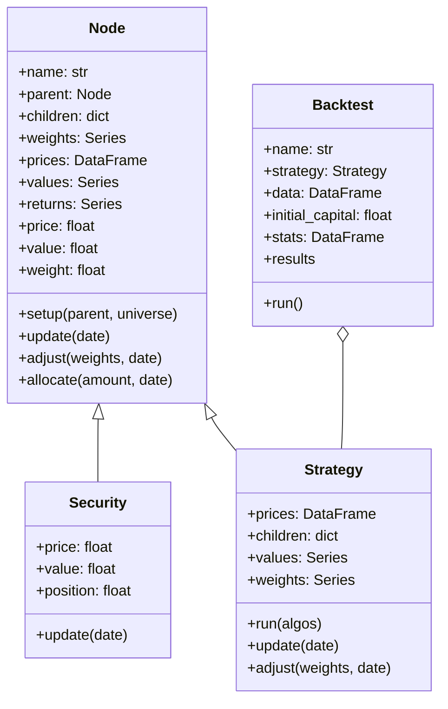
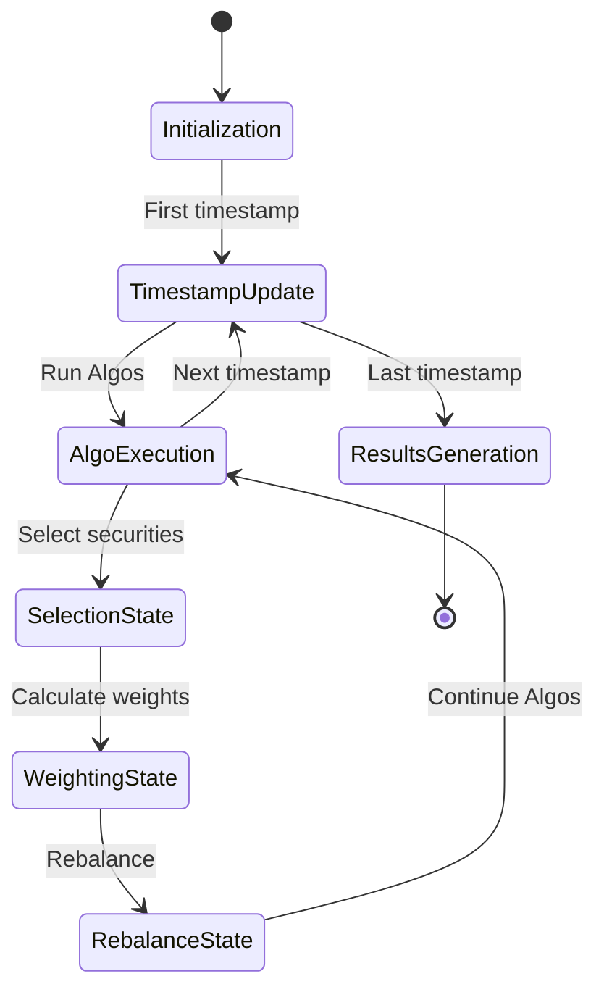
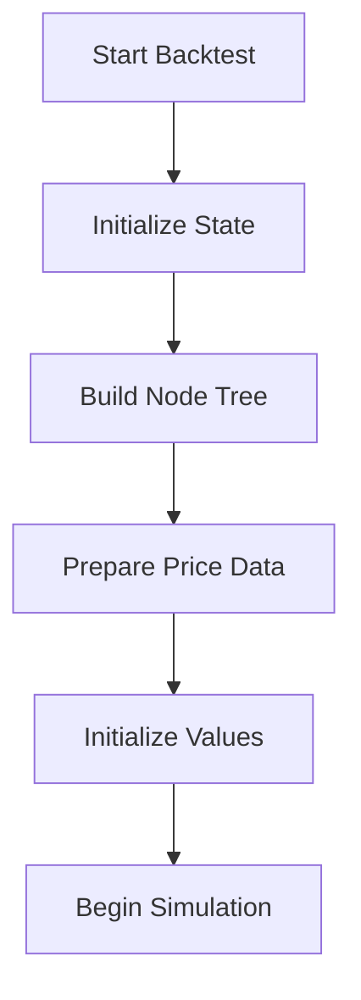
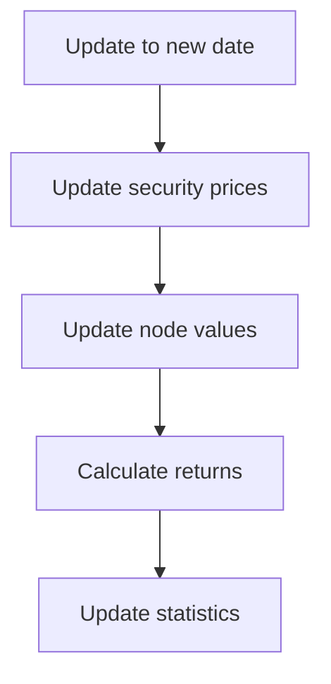
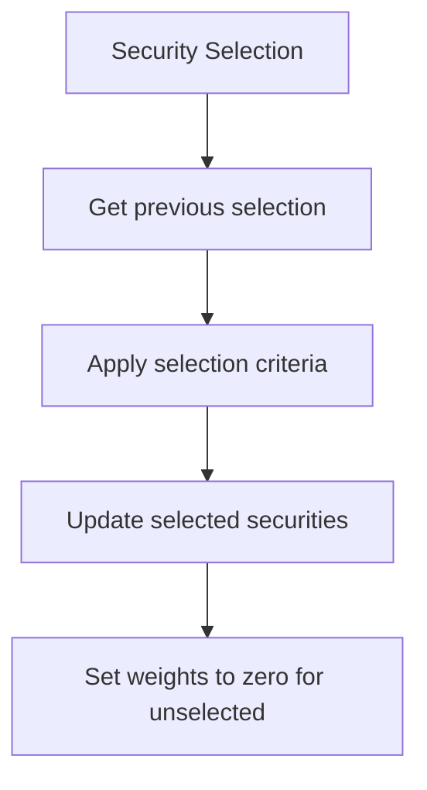
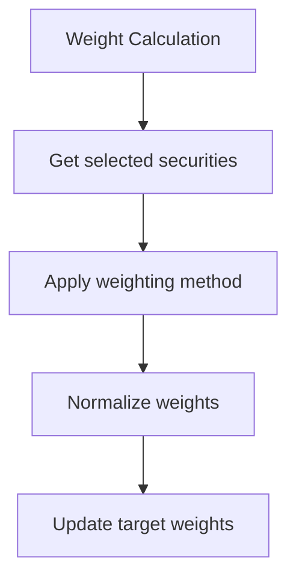
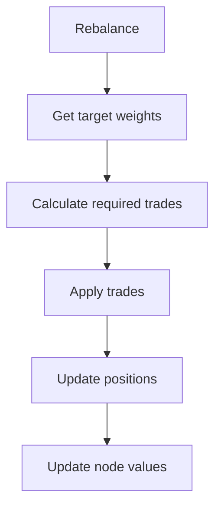
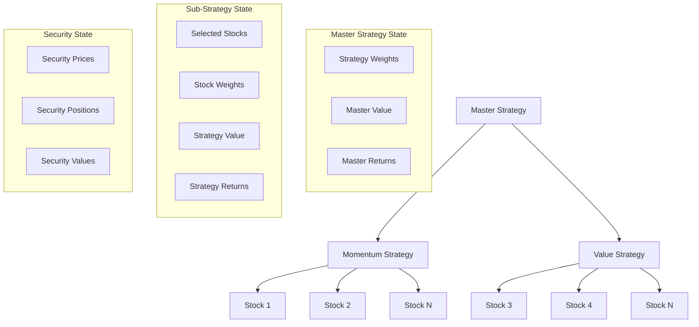
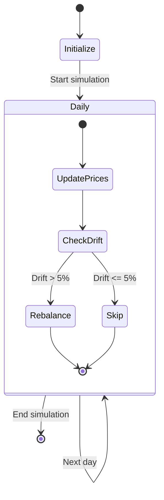
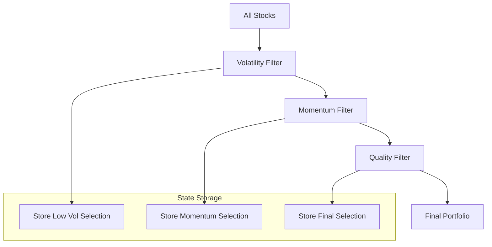

# bt State Management

This document details the state management approach used in the bt framework, focusing on how state is represented, maintained, and transitioned during backtesting.

## State Model Overview



bt employs a hierarchical state model where the entire backtest state is maintained in a tree structure of `Node` objects. Key state components include:

1. **Node State**: Each Node in the tree maintains its own state, including:
   - Weights of children
   - Current value
   - Historical values
   - Historical returns
   - Relationships to parent and children

2. **Security State**: Leaf nodes in the tree represent securities and maintain:
   - Current price
   - Current position
   - Current value
   - Historical prices and values

3. **Strategy State**: Non-leaf nodes in the tree represent strategies and maintain:
   - Allocation weights to children
   - Current value
   - Historical values and returns
   - Strategy-specific state (e.g., selected securities)

4. **Backtest State**: The overall backtest maintains:
   - The strategy tree
   - Historical performance metrics
   - Global parameters like initial capital
   - Results aggregation

## State Transitions and Triggers



### State Transition Triggers

bt employs several triggers that cause state transitions:

1. **Time-Based Triggers**:
   - Movement to the next timestamp in the simulation
   - Reaching specific calendar dates (e.g., month start, quarter end)
   - Periodic intervals (e.g., every 20 trading days)

2. **Algo-Based Triggers**:
   - Run Algos (e.g., RunMonthly, RunWeekly) triggering a full AlgoStack execution
   - Selection Algos (e.g., SelectAll, SelectThese) changing the selected securities
   - Weighting Algos (e.g., WeighEqually, WeighTarget) changing allocation weights
   - Rebalance Algos executing portfolio changes

3. **Condition-Based Triggers**:
   - Hitting threshold conditions (e.g., weights drifting beyond tolerance)
   - Custom strategy-defined conditions
   - External event simulations

### Core State Transitions

The primary state transitions in bt are:

#### 1. Initialization → Timestamp Simulation



During this transition:
- Node tree is constructed
- Initial weights are set
- Initial positions are established
- Historical data is prepared

#### 2. Timestamp Update



At each timestamp:
- Security prices are updated
- Node values are recalculated
- Returns are computed
- Performance statistics are updated

#### 3. Security Selection State Change



When selection occurs:
- Previous selection state is retrieved
- Selection criteria are applied
- Selected securities are updated
- Weights are adjusted (unselected securities get zero weight)

#### 4. Weight Calculation State Change



During weight calculations:
- Selected securities are retrieved
- Weighting method is applied
- Weights are normalized (sum to 1.0)
- Target weights are updated

#### 5. Rebalancing State Change



During rebalancing:
- Target weights are retrieved
- Required trades are calculated
- Trades are applied
- Positions are updated
- Node values are recalculated

## State Variables and Their Functions

### Key Node State Variables

| State Variable | Description | Function |
|----------------|-------------|----------|
| `name` | Node identifier | Uniquely identifies the node in the tree |
| `parent` | Reference to parent node | Establishes the tree hierarchy |
| `children` | Dictionary of child nodes | Maintains tree structure |
| `weights` | Series of child weights | Determines allocation to children |
| `prices` | DataFrame of security prices | Stores historical price data |
| `values` | Series of historical values | Tracks node value over time |
| `returns` | Series of historical returns | Tracks node performance |
| `price` | Current price (securities) | Current market price for securities |
| `value` | Current node value | Current value of the node |
| `weight` | Current weight in parent | Current allocation within parent |

### Key Strategy State Variables

| State Variable | Description | Function |
|----------------|-------------|----------|
| `selected` | Currently selected securities | Tracks securities for inclusion |
| `target_weights` | Target allocation weights | Stores target portfolio allocations |
| `temp` | Temporary calculation storage | Used for intermediate calculations |
| `stack` | AlgoStack instance | Stores the sequence of Algos to execute |
| `context` | Strategy context | Stores strategy-specific state |

### Key Backtest State Variables

| State Variable | Description | Function |
|----------------|-------------|----------|
| `name` | Backtest identifier | Uniquely identifies the backtest |
| `strategy` | Root strategy node | Entry point to the strategy tree |
| `data` | Input price data | Stores the raw input data |
| `initial_capital` | Starting capital | Sets the initial portfolio value |
| `stats` | Performance statistics | Stores calculated performance metrics |
| `results` | Results object | Stores final backtest results |

## State Persistence Mechanisms

bt primarily maintains state in memory without direct persistence to disk. However, several mechanisms exist for capturing and restoring state:

### 1. Results Serialization

```python
# Save backtest results to file
result = bt.run(strategy, data)
result.save('backtest_results.pkl')

# Load results from file
loaded_result = bt.Result.load('backtest_results.pkl')
```

The framework allows saving and loading backtest results, which contain:
- Performance metrics
- Equity curve data
- Transaction history
- Portfolio weights over time

### 2. State Snapshots

```python
# Capture a state snapshot at a specific point
strategy_state = strategy.get_state(date)

# Restore from a state snapshot
strategy.set_state(strategy_state)
```

State snapshots can be used to:
- Capture the state at a specific point in time
- Restart a simulation from a specific point
- Branch simulations from a common starting point

### 3. Storing Intermediate Results

```python
# Store intermediate state in a custom data structure
custom_state = {
    'selected': strategy.temp['selected'].copy(),
    'weights': strategy.temp['weights'].copy(),
    'timestamp': date
}
```

Intermediate state can be stored in custom data structures to:
- Track state evolution over time
- Analyze decision-making processes
- Implement custom state persistence

## Recovery Procedures

bt does not implement formal recovery procedures since backtests are typically run as atomic operations. However, several approaches can be used to handle interruptions:

### 1. Checkpoint-Based Recovery

```python
# Save checkpoints during a long-running backtest
for i, chunk in enumerate(chunked_data):
    result = bt.run(strategy, chunk, initial_capital=capital)
    capital = result.get_final_value()
    result.save(f'checkpoint_{i}.pkl')
```

For long-running backtests, checkpoint-based approaches can:
- Save intermediate results at regular intervals
- Allow resuming from the last checkpoint if interrupted
- Process large datasets in manageable chunks

### 2. Results Aggregation

```python
# Aggregate results from multiple partial runs
partial_results = [
    bt.Result.load(f'checkpoint_{i}.pkl')
    for i in range(num_chunks)
]
aggregated_result = bt.aggregate_results(partial_results)
```

Multiple partial results can be aggregated to:
- Combine results from separate time periods
- Merge results from parallel backtest executions
- Create a complete picture from checkpoint-based runs

## Thread Safety and Concurrency Considerations

bt was primarily designed for single-threaded operation and does not provide built-in thread safety guarantees. However, several approaches can be used for concurrent execution:

### 1. Parameter Sweep Parallelization

```python
# Run multiple parameter combinations in parallel
import multiprocessing

def run_backtest(params):
    strategy = create_strategy(params)
    return bt.run(strategy, data)

with multiprocessing.Pool(processes=4) as pool:
    results = pool.map(run_backtest, param_combinations)
```

This approach:
- Creates independent backtest instances for each parameter set
- Avoids shared state between parallel runs
- Efficiently utilizes multiple cores for parameter sweeps

### 2. Data Partitioning

```python
# Split data by time periods and run in parallel
def run_period(period_data):
    return bt.run(strategy, period_data)

with multiprocessing.Pool(processes=4) as pool:
    period_results = pool.map(run_period, data_periods)
```

Data partitioning:
- Divides the backtest period into separate chunks
- Runs each chunk in parallel
- Combines results afterward

### 3. Strategy-Level Parallelization

```python
# Run multiple strategies in parallel
def run_strategy(strategy_spec):
    strategy = create_strategy(strategy_spec)
    return bt.run(strategy, data)

with multiprocessing.Pool(processes=4) as pool:
    strategy_results = pool.map(run_strategy, strategy_specs)
```

Strategy-level parallelization:
- Runs different strategies in parallel
- Avoids shared state between strategy executions
- Enables efficient comparison of multiple approaches

## Example State Management Scenarios

### Scenario 1: Multi-Strategy Portfolio with Dynamic Allocation

```python
# Define a master strategy with multiple sub-strategies
# that dynamically adjusts allocations based on performance

bt.Strategy('master', [
    bt.algos.RunQuarterly(),
    bt.algos.SelectAll(),
    bt.algos.WeighByPerformance(),  # Allocate more to better performing strategies
    bt.algos.Rebalance()
], [
    # Sub-strategies
    bt.Strategy('momentum', [
        bt.algos.RunMonthly(),
        bt.algos.SelectMomentum(n=10),
        bt.algos.WeighEqually(),
        bt.algos.Rebalance()
    ], stock_universe),
    
    bt.Strategy('value', [
        bt.algos.RunMonthly(),
        bt.algos.SelectValuation(n=10),
        bt.algos.WeighEqually(),
        bt.algos.Rebalance()
    ], stock_universe)
])
```

#### State Management in this Scenario:



This scenario demonstrates:
1. Hierarchical state management with a tree structure
2. Dynamic allocation between strategies based on performance
3. Independent sub-strategy execution with their own state
4. Aggregation of sub-strategy performance to the master level

### Scenario 2: Rebalancing with Drift Tolerance

```python
# Define a strategy that only rebalances when
# weights drift beyond a specified tolerance

bt.Strategy('drift_tolerant', [
    bt.algos.RunDaily(),
    bt.algos.SelectAll(),
    bt.algos.WeighEqually(),
    bt.algos.RebalanceIfDrifted(tolerance=0.05)  # Only rebalance if weights drift by >5%
], stock_universe)
```

#### State Management in this Scenario:



This scenario demonstrates:
1. Condition-based state transitions (rebalance only when needed)
2. Threshold-based decision making
3. Maintaining target weights and actual weights in the state
4. State change triggers based on portfolio drift

### Scenario 3: Sequential Signal Strategy

```python
# Define a strategy that applies multiple
# sequential signals to filter the universe

bt.Strategy('multi_signal', [
    bt.algos.RunMonthly(),
    
    # First signal: Select low volatility
    bt.algos.SelectLowVol(n=50),
    bt.algos.StoreBacktest('low_vol_selection'),
    
    # Second signal: From low vol, select high momentum
    bt.algos.SelectMomentum(n=20),
    bt.algos.StoreBacktest('momentum_from_low_vol'),
    
    # Third signal: From momentum, select high quality
    bt.algos.SelectQuality(n=10),
    bt.algos.StoreBacktest('final_selection'),
    
    # Weight and rebalance final selection
    bt.algos.WeighEqually(),
    bt.algos.Rebalance()
], stock_universe)
```

#### State Management in this Scenario:



This scenario demonstrates:
1. Progressive state refinement through multiple steps
2. Storing intermediate state for analysis
3. Sequential signal application
4. Progressive universe filtering

## Conclusion

bt's state management system is built around a hierarchical tree structure that enables flexible strategy composition and execution. The Node-based architecture allows for complex strategy structures, from simple single-security portfolios to sophisticated multi-level strategy hierarchies.

Key strengths of bt's state management include:
1. **Hierarchical Representation**: The tree structure naturally represents portfolio hierarchies
2. **Composition-Based Design**: Strategies can be composed from reusable components
3. **Time-Series State Tracking**: Historical state is maintained for performance analysis
4. **Flexible Rebalancing Control**: Various mechanisms for controlling when and how rebalancing occurs
5. **Intermediate State Storage**: Ability to capture and analyze decision points

By understanding bt's state management model, developers can create more effective and sophisticated trading strategies that leverage the framework's flexible architecture and powerful composition capabilities. 