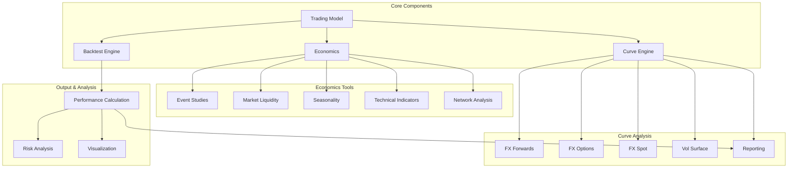
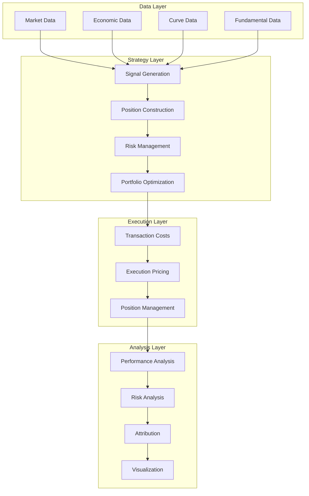

# FinMarketPy Trading System

## Overview

FinMarketPy is a Python-based financial markets analysis and backtesting framework designed for quantitative trading and financial market research. It provides a comprehensive suite of tools for market data analysis, strategy development, backtesting, and visualization with a strong focus on FX markets, statistical analysis, and event-driven trading.



## Key Components and Their Relationships

FinMarketPy is organized into several core modules that work together to provide a complete trading strategy development and analysis environment:

### 1. Backtest Module

The core backtesting engine implements:
- Signal-based backtesting framework
- Transaction cost modeling
- Position tracking and management
- PnL calculation and analysis
- Multi-asset portfolio construction

```python
from finmarketpy.backtest import BacktestRequest, Backtest, TradeAnalysis

# Configure backtest parameters
backtest_request = BacktestRequest(
    start_date='2010-01-01',
    finish_date='2020-12-31',
    spot_tc_bp=2.5,  # Transaction costs in basis points
    portfolio_vol_target=0.10  # 10% volatility target
)

# Run backtest and analyze results
backtest = Backtest()
trade_analysis = TradeAnalysis()
```

### 2. Curve Module

The curve module provides tools for working with financial market curves:
- Volatility surfaces and term structures
- Forward curves and implied rates
- Options pricing and sensitivity analysis
- Curve interpolation and fitting

```python
from finmarketpy.curve.volatility import FXVolSurface, FXOptionsPricer
from finmarketpy.curve import FXForwardsCurve

# Create volatility surface
vol_surface = FXVolSurface(market_data, 'EURUSD')

# Price FX options
options_pricer = FXOptionsPricer()
option_price = options_pricer.price_instrument(
    cross='EURUSD',
    horizon_date='2020-01-01',
    strike=1.10,
    expiry_date='2020-07-01',
    fx_vol_surface=vol_surface
)
```

### 3. Economics Module

The economics module provides analysis tools for economic and market data:
- Event studies (central bank announcements, data releases)
- Seasonal pattern analysis
- Technical indicator calculation
- Market liquidity analysis
- Reporting and visualization

```python
from finmarketpy.economics import EventStudy, Seasonality, TechIndicator

# Analyze market reaction to economic events
event_study = EventStudy()
event_impact = event_study.get_moves_around_event(
    market_data, 'EURUSD', 'ECB Rate Decision'
)

# Calculate seasonal patterns
seasonality = Seasonality()
monthly_pattern = seasonality.monthly_seasonality(market_data)

# Calculate technical indicators
tech = TechIndicator()
indicators = tech.create_tech_ind(market_data, 'momentum', tech_params)
```

### 4. Trading Model Framework

The TradingModel framework provides a foundation for building trading strategies:
- Abstract base class for strategy implementation
- Signal generation and processing
- Portfolio construction
- Performance analysis and reporting

```python
from finmarketpy.backtest import TradingModel

class MyStrategy(TradingModel):
    def __init__(self):
        super(MyStrategy, self).__init__()
        
    def load_parameters(self, br=None):
        # Set strategy parameters
        pass
        
    def load_assets(self, br=None):
        # Load required market data
        pass
        
    def construct_signal(self, spot_df, spot_df2=None, tech_params=None, br=None):
        # Generate trading signals
        pass
```

## Supported Markets and Instruments

FinMarketPy provides specialized support for:

1. **Foreign Exchange (FX) Markets**:
   - Spot FX rates
   - FX forwards and swaps
   - FX options (vanilla and exotic)
   - Cross-currency basis

2. **Fixed Income**:
   - Interest rate curves
   - Bond pricing and analysis
   - Yield curve construction

3. **Equities**:
   - Single stocks
   - Equity indices
   - Equity baskets

4. **Commodities**:
   - Precious metals
   - Energy markets
   - Agricultural products

5. **Alternative Data**:
   - Economic indicators
   - Sentiment data
   - News and events

## Performance Characteristics

FinMarketPy is designed with the following performance characteristics:

### Efficiency

- **Data Handling**: Efficient pandas-based data processing
- **Computation**: Optimized numerical calculations for large datasets
- **Memory Management**: Memory-efficient operations on time series data

### Scalability

- **Parallel Processing**: Support for parallel execution of backtests
- **Batch Analysis**: Tools for batch processing of strategies and parameters
- **Large Dataset Support**: Capable of handling large historical datasets

### Speed

- **Vectorized Operations**: Fast vectorized calculations using NumPy
- **Optimization**: Performance-optimized critical code paths
- **Caching**: Strategic result caching to avoid redundant calculations

## Dependencies and Requirements

FinMarketPy relies on the following key dependencies:

- **Python**: 3.6 or higher
- **pandas**: Data manipulation and analysis
- **NumPy**: Numerical computations
- **matplotlib/seaborn**: Data visualization
- **scipy**: Scientific and statistical functions
- **statsmodels**: Statistical models and tests
- **networkx**: Network analysis (optional)

Additional optional dependencies:
- **scikit-learn**: Machine learning algorithms
- **OpenPyXL**: Excel report generation
- **jupyter**: Interactive notebook support

## Quick Start Guide

### Installation

```bash
pip install finmarketpy
```

### Basic Usage

```python
import pandas as pd
from finmarketpy.backtest import BacktestRequest, TradingModel
from finmarketpy.backtest.backtestrequest import TechParams

# Load market data
market_data = pd.read_csv('fx_data.csv', index_col=0, parse_dates=True)

# Configure technical parameters
tech_params = TechParams(
    tech_params=[
        {'name': 'ma', 'params': [20]},
        {'name': 'ma', 'params': [100]}
    ]
)

# Create backtest request
br = BacktestRequest(
    start_date='2010-01-01',
    finish_date='2020-12-31',
    tech_params=tech_params,
    spot_tc_bp=2.5
)

# Implement a simple moving average crossover strategy
class MovingAverageCrossover(TradingModel):
    def __init__(self):
        super(MovingAverageCrossover, self).__init__()
        self.name = "MA Crossover"
        
    def load_parameters(self, br):
        self.br = br
        return
        
    def load_assets(self, br=None):
        self.asset_df = market_data
        return
        
    def construct_signal(self, spot_df=None, spot_df2=None, tech_params=None, br=None):
        if spot_df is None:
            spot_df = self.asset_df
        
        if tech_params is None:
            tech_params = self.br.tech_params
            
        # Calculate moving averages
        spot_df['ma_fast'] = spot_df['close'].rolling(window=20).mean()
        spot_df['ma_slow'] = spot_df['close'].rolling(window=100).mean()
        
        # Generate signals (1 for buy, -1 for sell, 0 for no position)
        spot_df['signal'] = 0
        spot_df.loc[spot_df['ma_fast'] > spot_df['ma_slow'], 'signal'] = 1
        spot_df.loc[spot_df['ma_fast'] < spot_df['ma_slow'], 'signal'] = -1
        
        return spot_df

# Create and run the strategy
strategy = MovingAverageCrossover()
strategy.load_parameters(br)
strategy.load_assets()
strategy.construct_strategy()

# Analyze results
strategy.plot_strategy_pnl()
print(strategy.strategy_pnl_ret_stats())
```

## Unique Features

FinMarketPy offers several distinguishing features:

1. **Event Studies**: Specialized tooling for analyzing market reactions around economic events and announcements

2. **FX Analytics**: Comprehensive suite of FX-specific analysis tools including volatility surfaces, forward curves, and cross-currency basis

3. **Seasonality Analysis**: Powerful tools for identifying and exploiting seasonal patterns in financial markets

4. **Network Analysis**: Tools for analyzing relationships and correlations in financial networks

5. **Curve Visualization**: Advanced plotting capabilities for financial curves and surfaces

## Architecture

FinMarketPy follows a modular architecture organized around key functional areas:



### Design Principles

FinMarketPy is built on several key design principles:

1. **Separation of Concerns**: Clear separation between data management, strategy logic, execution simulation, and analysis

2. **Composition over Inheritance**: Flexible component architecture encouraging composition of functionality

3. **Immutable Configuration**: Strategy parameters are defined upfront and remain constant during a backtest

4. **Vectorized Processing**: Emphasis on vectorized operations for performance

5. **Extensibility**: Well-defined interfaces for extending and customizing functionality

## Documentation and Examples

Comprehensive documentation is available in the form of:

1. **API Reference**: Detailed documentation of classes and methods
2. **Tutorials**: Step-by-step guides for common tasks
3. **Example Notebooks**: Jupyter notebooks demonstrating various use cases
4. **Sample Strategies**: Ready-to-use strategy implementations 