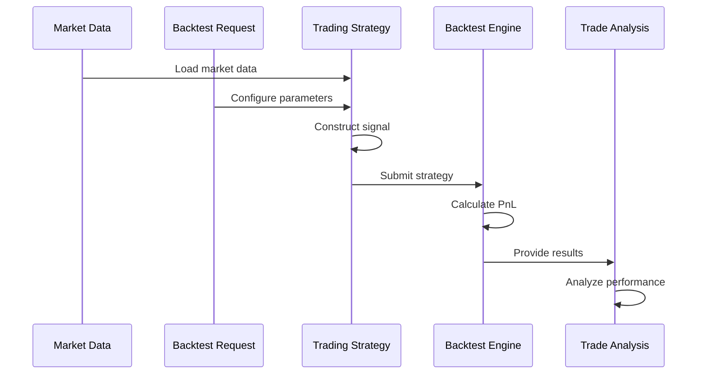
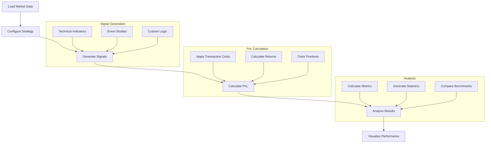
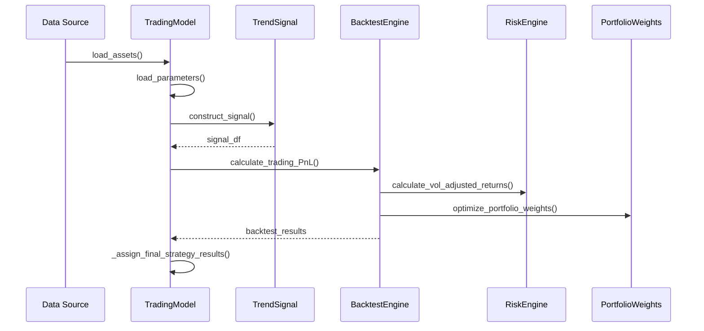

# FinMarketPy Event Flow

## Event Flow Overview

FinMarketPy employs an event-driven architecture for backtesting and analysis, where market data and trading decisions flow through a series of processing components. This document outlines the event flow mechanism, event types, and processing sequence within the FinMarketPy framework.



## Event Types and Purposes

FinMarketPy processes several key event types through its workflow:

1. **Market Data Events**: Time series data loaded from various sources
   - Price data (OHLCV)
   - Fundamental data
   - Economic indicators
   - Custom data sources

2. **Parameter Events**: Configuration settings that determine strategy behavior
   - Trading parameters (fees, constraints)
   - Date ranges
   - Risk parameters
   - Portfolio settings

3. **Signal Events**: Trading signals generated by strategies
   - Entry/exit signals
   - Position sizing signals
   - Risk adjustment signals

4. **Trade Events**: Actions taken based on signals
   - Order execution events
   - Position change events
   - Rebalancing events

5. **Analysis Events**: Performance evaluation events
   - PnL calculations
   - Risk metrics
   - Performance statistics
   - Visualization triggers

## Event Processing Sequence

The typical event flow in FinMarketPy follows this sequence:



### Initialization Phase

1. **Data Loading**:
   - Market data is loaded via specified data sources
   - Data is preprocessed and aligned to common timeframes
   - Missing data is handled according to configuration

2. **Strategy Configuration**:
   - BacktestRequest object configures parameters
   - Trading constraints are established
   - Portfolio settings are initialized

### Signal Generation Phase

3. **Technical Analysis**:
   - Apply technical indicators based on strategy requirements
   - Process market data through indicator functions
   - Generate raw signals based on indicator values

4. **Signal Processing**:
   - Raw signals are filtered and transformed
   - Signal strength determines position sizing
   - Multiple signals are combined if necessary

### Execution and PnL Phase

5. **Position Calculation**:
   - Signals are converted to position changes
   - Portfolio constraints are applied
   - Risk adjustments modify positions

6. **PnL Calculation**:
   - Transaction costs are applied to trades
   - Returns are calculated for each position
   - Portfolio-level PnL is aggregated

### Analysis Phase

7. **Performance Metrics**:
   - Risk-adjusted return metrics are calculated
   - Drawdown analysis is performed
   - Benchmark comparisons are processed

8. **Visualization**:
   - Performance charts are generated
   - Trade annotations are added
   - Interactive visualizations are created

## Concrete Example: FX Trend Strategy



### Step-by-Step FX Trend Strategy Flow

1. **Initialize Strategy**:
   ```python
   strategy = TradingModelFXTrend()
   strategy.load_parameters()
   ```

2. **Load Assets**:
   ```python
   strategy.load_assets()
   # Loads FX rate data into spot_df
   ```

3. **Generate Signals**:
   ```python
   signal_df = strategy.construct_signal(spot_df, spot_df2, tech_params, br)
   # Applies technical indicators to spot data
   # Creates buy/sell signals based on indicator crossovers
   ```

4. **Execute Backtest**:
   ```python
   strategy.construct_strategy()
   # Internally calls calculate_trading_PnL()
   # Processes signals into trades
   # Applies transaction costs
   # Calculates returns
   ```

5. **Analyze Results**:
   ```python
   strategy.strategy_pnl()
   strategy.strategy_pnl_ret_stats()
   strategy.plot_strategy_pnl()
   ```

## Error Handling in Event Flow

FinMarketPy implements several error handling mechanisms in its event flow:

1. **Data Validation**:
   - Input data is checked for completeness and validity
   - Missing data points are handled according to configurable policies
   - Data format inconsistencies are detected and resolved

2. **Parameter Validation**:
   - Trading parameters are checked for validity
   - Inconsistent parameters trigger warnings or exceptions
   - Default values are applied for missing parameters

3. **Signal Error Handling**:
   - Signal generation errors are logged
   - Strategy execution continues with fallback behavior
   - NaN values in signals are handled gracefully

4. **Execution Error Recovery**:
   - Transaction failures are logged and analyzed
   - Alternative execution paths may be attempted
   - System ensures state consistency after errors

5. **Analysis Error Robustness**:
   - Analysis gracefully handles partial or inconsistent results
   - Alternative metrics are calculated when primary metrics fail
   - Visualization adapts to available data

## Timing Considerations

FinMarketPy's event flow incorporates several timing considerations:

1. **Data Alignment**:
   - Data from different sources is aligned to a common timeline
   - Different time frequencies can be resampled to match
   - Time zone differences are handled appropriately

2. **Signal Delays**:
   - Configurable signal delays simulate real-world latency
   - Adjustable parameters for implementation shortfall
   - Forward-looking bias prevention

3. **Execution Timing**:
   - Trade execution can be configured for different points in time (open, close, etc.)
   - Different execution assumptions can be tested
   - Time-of-day effects can be analyzed

4. **Event Sequencing**:
   - Events are processed in the correct causal order
   - Dependencies between events are respected
   - Circular dependencies are detected and prevented 