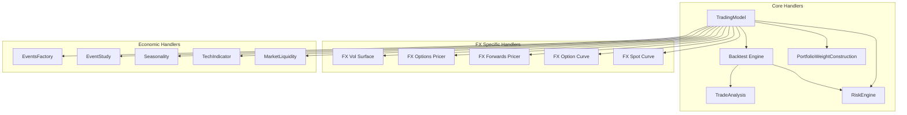

# FinMarketPy Handlers

## Handler Overview

FinMarketPy employs a variety of specialized handlers for processing different types of financial market operations, events, and data transformations. These handlers implement well-defined interfaces for data management, signal processing, trade execution simulation, and performance analysis.



## Handler Interfaces and Responsibilities

### Core Handlers

#### TradingModel

The `TradingModel` class serves as the primary interface for strategy implementation and execution:

```python
class TradingModel(object):
    """Abstract class which wraps around Backtest, providing convenient 
    functions for analysis. Implement your own subclasses of this for 
    your own strategy.
    """
    
    def load_parameters(self, br: BacktestRequest = None):
        """Sets parameters for the backtest"""
        pass
        
    def load_assets(self, br=None):
        """Loads market data for the strategy"""
        pass
        
    def construct_signal(self, spot_df: pd.DataFrame = None,
                         spot_df2: pd.DataFrame = None,
                         tech_params: TechParams = None,
                         br: BacktestRequest = None,
                         run_in_parallel: bool = False) -> pd.DataFrame:
        """Generates trading signals based on market data"""
        pass
```

**Responsibilities**:
- Strategy definition and parameter management
- Market data loading and preprocessing
- Signal generation and filtering
- Performance analysis and visualization
- Trade execution simulation coordination

**Input/Output**:
- Input: Market data, parameters, technical indicators
- Output: Trading signals, performance metrics, visualizations

#### Backtest Engine

The `Backtest` class handles the core backtesting logic:

```python
class Backtest(object):
    """Conducts backtesting of trading strategies"""
    
    def calculate_trading_PnL(self, br: BacktestRequest,
                              asset_a_df: pd.DataFrame,
                              signal_df: pd.DataFrame,
                              contract_value_df: pd.DataFrame,
                              run_in_parallel: bool = False):
        """Calculates PnL based on trading signals"""
        pass
```

**Responsibilities**:
- Trade execution simulation
- Transaction cost application
- Position tracking
- PnL calculation
- Portfolio metrics computation

**Input/Output**:
- Input: Trading signals, market data, parameters
- Output: Trade history, PnL metrics, position data

#### TradeAnalysis

The `TradeAnalysis` class provides tools for analyzing trading results:

```python
class TradeAnalysis(object):
    """Provides methods for analyzing trading results"""
    
    def run_strategy_returns_stats(self, trading_model, engine="finmarketpy"):
        """Calculate return statistics for a strategy"""
        pass
        
    def run_excel_trade_report(self, trading_model, excel_file='model.xlsx'):
        """Generate Excel report with trade details"""
        pass
```

**Responsibilities**:
- Performance metric calculation
- Trade statistics analysis
- Excel report generation
- Sensitivity analysis

**Input/Output**:
- Input: Trading model with results
- Output: Performance statistics, reports

#### PortfolioWeightConstruction

The `PortfolioWeightConstruction` class handles portfolio construction:

```python
class PortfolioWeightConstruction(object):
    """Handles portfolio construction and optimization"""
    
    def optimize_portfolio_weights(self, returns_df: pd.DataFrame,
                                  signal_df: pd.DataFrame,
                                  signal_pnl_cols: List[str],
                                  br: BacktestRequest = None):
        """Optimizes portfolio weights based on return characteristics"""
        pass
```

**Responsibilities**:
- Weight optimization
- Portfolio construction
- Risk-adjusted weight calculation
- Multi-asset allocation

**Input/Output**:
- Input: Return data, signals, parameters
- Output: Optimized portfolio weights

#### RiskEngine

The `RiskEngine` class manages risk calculations and adjustments:

```python
class RiskEngine(object):
    """Handles risk calculations and adjustments"""
    
    def calculate_vol_adjusted_returns(self, returns_df: pd.DataFrame,
                                      br: BacktestRequest,
                                      returns: bool = True):
        """Calculate volatility-adjusted returns"""
        pass
        
    def calculate_leverage_factor(self, returns_df: pd.DataFrame,
                                 vol_target: float,
                                 vol_max_leverage: float,
                                 vol_periods: int = 60,
                                 vol_obs_in_year: int = 252,
                                 vol_rebalance_freq: str = "BM",
                                 resample_freq: str = None,
                                 resample_type: str = "mean",
                                 returns: bool = True,
                                 period_shift: int = 0) -> pd.DataFrame:
        """Calculate appropriate leverage factor based on volatility"""
        pass
```

**Responsibilities**:
- Volatility calculation
- Risk-adjusted returns
- Leverage determination
- Position sizing based on risk

**Input/Output**:
- Input: Return data, risk parameters
- Output: Risk-adjusted positions, leverage factors

### FX-Specific Handlers

#### FXVolSurface

The `FXVolSurface` class handles volatility surface construction and analysis:

```python
class FXVolSurface(AbstractVolSurface):
    """Constructs and analyzes FX volatility surfaces"""
    
    def build_vol_surface(self, value_date):
        """Build volatility surface for a specific date"""
        pass
        
    def calculate_vol_for_strike_expiry(self, K, expiry_date=None, tenor="1M"):
        """Get implied volatility for a specific strike and expiry"""
        pass
```

**Responsibilities**:
- Volatility surface construction
- Interpolation across strike/tenor space
- Volatility extraction at specific points
- Surface visualization

**Input/Output**:
- Input: Market data, surface parameters
- Output: Volatility surface, implied volatilities

#### FXOptionsPricer

The `FXOptionsPricer` class handles FX option pricing:

```python
class FXOptionsPricer(AbstractPricer):
    """Prices FX options"""
    
    def price_instrument(self, cross, horizon_date, strike,
                        expiry_date=None, vol=None, notional=1000000,
                        contract_type='european-call', tenor=None,
                        fx_vol_surface=None, premium_output=None,
                        delta_output=None, depo_tenor=None,
                        use_atm_quoted=False, return_as_df=True):
        """Price an FX option with given parameters"""
        pass
```

**Responsibilities**:
- Option pricing
- Greeks calculation
- Price sensitivity analysis
- Premium calculation in different currencies

**Input/Output**:
- Input: Option parameters, volatility data
- Output: Option prices, Greeks, sensitivities

#### FXForwardsPricer

The `FXForwardsPricer` class handles FX forward pricing:

```python
class FXForwardsPricer(AbstractPricer):
    """Prices FX forwards"""
    
    def price_instrument(self, cross, horizon_date, delivery_date,
                        option_expiry_date=None, market_df=None,
                        quoted_delivery_df=None,
                        fx_forwards_tenor_for_interpolation=market_constants.fx_forwards_tenor_for_interpolation,
                        return_as_df=True):
        """Price an FX forward with given parameters"""
        pass
```

**Responsibilities**:
- Forward pricing
- Points calculation
- Forward curve construction
- Implied deposit rate calculation

**Input/Output**:
- Input: Forward parameters, market data
- Output: Forward prices, points, outright rates

### Economic Handlers

#### EventsFactory

The `EventsFactory` class handles economic event processing:

```python
class EventsFactory(EventStudy):
    """Processes economic data events and performs event studies"""
    
    def get_economic_event_date_time(self, name, event=None, csv=None):
        """Get dates and times of economic events"""
        pass
        
    def get_intraday_moves_over_event(self, data_frame_rets, cross, 
                                     event_fx, event_name, start, end, 
                                     vol, mins=3 * 60, min_offset=0, 
                                     create_index=False, resample=False, 
                                     freq='minutes'):
        """Analyze market movements around specific events"""
        pass
```

**Responsibilities**:
- Economic event identification
- Event-based market analysis
- Surprise impact measurement
- Market reaction quantification

**Input/Output**:
- Input: Market data, event definitions
- Output: Event analysis, market reaction metrics

#### Seasonality

The `Seasonality` class handles seasonal pattern analysis:

```python
class Seasonality(object):
    """Analyzes seasonal patterns in market data"""
    
    def bus_day_of_month_seasonality(self, data_frame,
                                   month_list=[1, 2, 3, 4, 5, 6, 7, 8, 9, 10,
                                               11, 12], cum=True,
                                   cal="FX", partition_by_month=True,
                                   add_average=False, price_index=False,
                                   resample_freq='B'):
        """Calculate business day of month seasonality"""
        pass
        
    def monthly_seasonality(self, data_frame, cum=True, add_average=False, 
                          price_index=False):
        """Calculate monthly seasonality"""
        pass
```

**Responsibilities**:
- Seasonal pattern detection
- Time-of-day, day-of-month, monthly analysis
- Seasonal adjustment
- Visualization of seasonal patterns

**Input/Output**:
- Input: Time series data
- Output: Seasonal patterns, adjusted series

#### TechIndicator

The `TechIndicator` class handles technical indicator calculation:

```python
class TechIndicator(object):
    """Calculates technical indicators for trading strategies"""
    
    def create_tech_ind(self, data_frame_non_nan, name, tech_params,
                       data_frame_non_nan_early=None):
        """Calculate technical indicators based on market data"""
        pass
```

**Responsibilities**:
- Technical indicator calculation
- Signal generation
- Parameter management
- Custom indicator implementation

**Input/Output**:
- Input: Price data, parameters
- Output: Technical indicators, signals

## Error Handling Strategies

FinMarketPy implements several error handling strategies across its handlers:

### Data Validation

Handlers validate input data for:
- Correct format and structure
- Timestamp alignment
- Data completeness
- Type consistency

```python
# Example data validation in TradingModel
if not isinstance(spot_df, pd.DataFrame):
    raise ValueError("spot_df must be a pandas DataFrame")
    
if spot_df.empty:
    self.logger.warning("Empty spot_df provided")
    return pd.DataFrame()
```

### Parameter Validation

Handlers validate parameters for:
- Valid ranges
- Consistency with other parameters
- Type correctness
- Default value application

```python
# Example parameter validation in BacktestRequest
@spot_tc_bp.setter
def spot_tc_bp(self, spot_tc_bp):
    if not isinstance(spot_tc_bp, (int, float)) and spot_tc_bp is not None:
        raise TypeError("spot_tc_bp must be a number or None")
    self._spot_tc_bp = spot_tc_bp
```

### Graceful Degradation

When errors occur, handlers attempt to:
- Continue with partial results
- Return empty DataFrames rather than None
- Log warnings for non-critical issues
- Use fallback methods for failed calculations

```python
# Example graceful degradation in signal processing
try:
    # Calculate primary signal
    signal = self._calculate_primary_signal(data)
except Exception as e:
    self.logger.warning(f"Primary signal calculation failed: {e}")
    # Fall back to simpler signal
    signal = self._calculate_fallback_signal(data)
```

### Comprehensive Logging

Error handling includes:
- Detailed error messages
- Warning logs for potential issues
- Input/output logging for debugging
- Exception tracebacks for critical errors

## Performance Considerations

FinMarketPy's handlers are designed with performance in mind:

### Vectorization

Wherever possible, handlers use vectorized operations:
- pandas and NumPy operations instead of loops
- Efficient matrix operations
- Bulk processing of data

```python
# Example of vectorized operations
def calculate_returns(self, prices):
    # Vectorized return calculation
    return prices.pct_change().fillna(0)
```

### Caching

Handlers use caching to avoid redundant calculations:
- Reusing previously calculated results
- Storing intermediate results
- Maintaining state between calls

```python
# Example of result caching
if self._cached_results is not None and not recalculate:
    return self._cached_results
    
# Perform calculation
result = self._perform_calculation()
self._cached_results = result
return result
```

### Parallel Processing

Many handlers support parallel processing:
- Multi-threaded execution
- Process-based parallelism
- Configurable threading options

```python
# Example of parallel processing support
def calculate_trading_PnL(self, ..., run_in_parallel=False):
    if run_in_parallel and self._can_parallelize():
        return self._calculate_parallel()
    else:
        return self._calculate_sequential()
```

### Memory Efficiency

Handlers are designed for memory efficiency:
- Using generators for large data sets
- Avoiding unnecessary copies
- Cleaning up temporary objects

## Edge Cases and Their Handling

FinMarketPy handlers address several common edge cases:

### Market Gaps

For market gaps (e.g., weekends, holidays):
- Calendar-aware date handling
- Proper adjustment of returns
- Handling of missing data periods

```python
# Example of market gap handling
def _adjust_for_market_gaps(self, data, calendar):
    # Get trading days
    trading_days = calendar.valid_days(data.index.min(), data.index.max())
    # Reindex data to valid trading days
    return data.reindex(trading_days).fillna(method='ffill')
```

### Extreme Market Moves

For extreme market moves:
- Outlier detection
- Winsorization options
- Configurable caps on position sizes
- Stop-loss simulation

```python
# Example of extreme move handling
def _apply_stop_loss(self, position, price_change, stop_level):
    # Check if stop loss triggered
    if price_change < -stop_level:
        # Close position at stop level
        return 0, True
    return position, False
```

### Zero/Negative Prices

For zero or negative prices (in certain asset classes):
- Validation checks
- Log-return adjustments
- Special handling for specific assets

```python
# Example of zero price handling
def _process_price(self, price):
    # Handle zero/negative prices
    if price <= 0:
        self.logger.warning(f"Non-positive price detected: {price}")
        return self._min_valid_price
    return price
```

### Data Frequency Mismatches

For mismatches in data frequency:
- Resampling capabilities
- Interpolation options
- Alignment algorithms

```python
# Example of frequency mismatch handling
def _align_data_frequency(self, data1, data2, target_freq):
    # Resample both datasets to common frequency
    data1_resampled = data1.resample(target_freq).last()
    data2_resampled = data2.resample(target_freq).last()
    # Align indexes
    return data1_resampled, data2_resampled
``` 