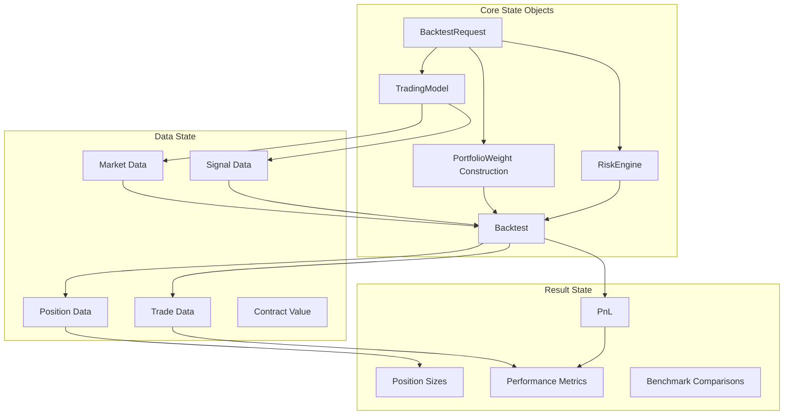

# FinMarketPy State Management

## State Model Description

FinMarketPy uses a comprehensive state management system to track the evolving state of strategies, portfolios, and market data throughout the backtesting and analysis process. The framework maintains state through a combination of object attributes, pandas DataFrames, and well-defined data structures.



The state management in FinMarketPy is designed for:

1. **Reproducibility**: Ensuring consistent results across multiple runs
2. **Transparent Analysis**: Making all aspects of the strategy state accessible for inspection
3. **Modular Design**: Allowing components to be developed and tested independently
4. **Extensibility**: Enabling custom state tracking for specialized strategies

## State Components and Structure

### BacktestRequest State

The `BacktestRequest` class maintains the configuration state of a backtest, including:

- Date ranges (`start_date`, `finish_date`, `plot_start`, `plot_finish`)
- Trading parameters (`spot_tc_bp`, `spot_rc_bp`)
- Risk parameters (`portfolio_vol_target`, `max_leverage`, etc.)
- Portfolio construction parameters (`portfolio_weight_construction`, `portfolio_combination`)
- Technical parameters (`tech_params`)

This state is immutable during a backtest run but can be modified between runs to examine different scenarios.

### TradingModel State

The `TradingModel` class maintains the strategy-specific state, including:

- Strategy name and identifier
- Market data (raw and processed)
- Signal DataFrame
- Strategy-specific parameters
- Result cache

The TradingModel state evolves as the strategy is configured, executed, and analyzed, with various methods updating different aspects of the state.

### Backtest Engine State

The `Backtest` class maintains the execution state, including:

- Current positions
- Trade history
- PnL calculations
- Portfolio metrics
- Execution details

This state is updated as the backtest engine processes signals and simulates trades.

### Data Structures

FinMarketPy uses pandas DataFrames as the primary data structure for state management:

1. **Market Data DataFrames**: 
   - Time-indexed price and volume data
   - Technical indicators
   - Fundamental data

2. **Signal DataFrames**:
   - Trading signals with timestamps
   - Signal strength indicators
   - Entry/exit points

3. **PnL DataFrames**:
   - Trade-level PnL
   - Component-level PnL
   - Cumulative PnL
   - Return statistics

4. **Position DataFrames**:
   - Current positions
   - Position history
   - Notional and contract sizes
   - Leverage metrics

## State Transitions and Triggers

FinMarketPy manages state transitions through a well-defined workflow:

```mermaid
stateDiagram
    [*] --> Initialization
    Initialization --> SignalGeneration
    SignalGeneration --> PositionConstruction
    PositionConstruction --> ExecutionSimulation
    ExecutionSimulation --> PerformanceAnalysis
    PerformanceAnalysis --> [*]
    
    state Initialization {
        [*] --> LoadParameters
        LoadParameters --> LoadAssets
        LoadAssets --> PrepareData
        PrepareData --> [*]
    }
    
    state SignalGeneration {
        [*] --> ApplyTechnicals
        ApplyTechnicals --> FilterSignals
        FilterSignals --> SignalPostprocessing
        SignalPostprocessing --> [*]
    }
    
    state PositionConstruction {
        [*] --> ConvertSignalsToPositions
        ConvertSignalsToPositions --> ApplyConstraints
        ApplyConstraints --> ApplyRiskManagement
        ApplyRiskManagement --> [*]
    }
    
    state ExecutionSimulation {
        [*] --> CalculateTransactionCosts
        CalculateTransactionCosts --> SimulateExecution
        SimulateExecution --> TrackPositions
        TrackPositions --> [*]
    }
    
    state PerformanceAnalysis {
        [*] --> CalculateMetrics
        CalculateMetrics --> AnalyzeDrawdowns
        AnalyzeDrawdowns --> CompareWithBenchmark
        CompareWithBenchmark --> [*]
    }
```



### Initialization

The state transitions during initialization include:

1. **Loading parameters**: Sets BacktestRequest attributes
2. **Loading assets**: Populates market data DataFrames
3. **Data preparation**: Aligns and preprocesses data

Triggers: Method calls like `load_parameters()` and `load_assets()`

### Signal Generation

State transitions during signal generation:

1. **Technical application**: Updates technical indicator state
2. **Signal filtering**: Updates signal DataFrame
3. **Signal postprocessing**: Normalizes and validates signals

Triggers: `construct_signal()` method call and internal logic

### Position Construction

State transitions for position construction:

1. **Signal conversion**: Transforms signals to positions
2. **Constraint application**: Adjusts positions for constraints
3. **Risk management**: Applies risk models to positions

Triggers: Internal position sizing logic and risk management rules

### Execution Simulation

State transitions for execution simulation:

1. **Transaction cost calculation**: Updates cost state
2. **Execution simulation**: Updates trade state
3. **Position tracking**: Updates position state

Triggers: `calculate_trading_PnL()` method and internal execution logic

### Performance Analysis

State transitions for performance analysis:

1. **Metric calculation**: Updates performance metrics state
2. **Drawdown analysis**: Updates risk metric state
3. **Benchmark comparison**: Updates relative performance state

Triggers: Analysis method calls like `strategy_pnl_ret_stats()`

## Persistence Mechanisms

FinMarketPy provides several mechanisms for persisting and retrieving state:

### Model Serialization

The `save_model()` and `load_model()` methods allow for serializing and deserializing the entire TradingModel state:

```python
# Save the model state
strategy.save_model("my_strategy.pkl")

# Load the model state in a new session
loaded_strategy = TradingModel.load_model("my_strategy.pkl")
```

This enables interrupted analyses to be resumed and successful strategies to be saved for future use.

### CSV Export

Multiple methods enable exporting state to CSV files for external analysis:

```python
# Export PnL data
strategy.dump_pnl_csv("pnl_data.csv")

# Export trade data
strategy.dump_trades_csv("trades.csv")
```

The `write_csv` and `write_csv_pnl` parameters in BacktestRequest control automatic CSV generation.

### Excel Reports

The TradeAnalysis component can generate comprehensive Excel reports containing the strategy state:

```python
trade_analysis = TradeAnalysis()
trade_analysis.run_excel_trade_report(strategy, "strategy_report.xlsx")
```

These reports include positions, trades, signals, and performance metrics.

## Recovery Procedures

FinMarketPy implements several recovery mechanisms:

### Error Recovery

When errors occur during state transitions, FinMarketPy:

1. Logs the error details
2. Maintains the last valid state
3. Allows for graceful degradation (continuing with partial results)
4. Provides diagnostic information for debugging

### Session Recovery

For interrupted sessions, FinMarketPy enables:

1. Saving the current state to disk
2. Loading the state in a new session
3. Resuming analysis from the saved point
4. Comparing results across sessions

### Data Recovery

For data issues, FinMarketPy provides:

1. NaN handling in time series data
2. Reindexing capabilities for misaligned data
3. Filtering options for outliers
4. Interpolation methods for missing values

## Thread Safety and Concurrency

FinMarketPy offers several concurrency options with appropriate state isolation:

### Parallel Processing

The `run_in_parallel` parameter enables parallel execution with:

1. Isolated state per process
2. Aggregation of results after parallel execution
3. Synchronization of final state
4. Performance scaling with available cores

```python
# Run with parallel signal generation
strategy.construct_strategy(run_in_parallel=True)
```

### Thread Safety Considerations

When using parallel processing:

1. Each process maintains its own copy of relevant state
2. Shared resources are accessed through thread-safe mechanisms
3. Results are merged using deterministic aggregation
4. The final state is consistent regardless of execution order

### Global State Management

For global state shared across multiple strategies:

1. Market data can be shared through caching mechanisms
2. Parameters can be synchronized across related strategies
3. Results can be compared in a common framework
4. Meta-analysis can be performed across strategy instances 