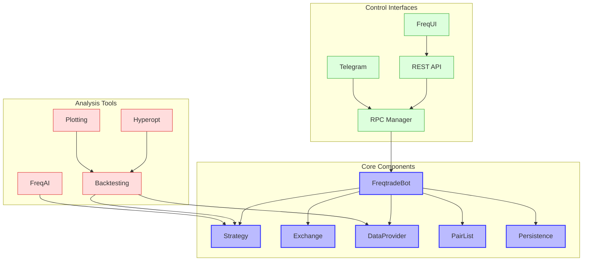

# Freqtrade Overview

Freqtrade is a free and open source crypto trading bot written in Python. It is designed to support all major exchanges and be controlled via Telegram or webUI. It contains backtesting, plotting and money management tools as well as strategy optimization by machine learning.

## Purpose and Design Philosophy

Freqtrade was designed with the following principles in mind:

- **Flexibility**: Provide a highly customizable framework for algorithmic trading
- **Accessibility**: Enable both beginners and experienced traders to implement strategies
- **Extensibility**: Allow for easy extension through plugins and custom components
- **Reliability**: Ensure stable operation for 24/7 trading
- **Community-driven**: Benefit from a large and active community of contributors

The framework is particularly well-suited for:
- Cryptocurrency trading across multiple exchanges
- Backtesting and optimizing trading strategies
- Educational purposes and learning algorithmic trading
- Implementing both simple and complex trading strategies
- Automated trading with minimal supervision

## Architecture Overview



The architecture of Freqtrade follows a modular design where:

1. The **FreqtradeBot** is the central component that coordinates the trading process
2. The **Strategy** class defines trading logic and signal generation
3. The **Exchange** module handles communication with cryptocurrency exchanges
4. The **DataProvider** supplies market data to the strategy and bot
5. The **PairList** manages the selection of trading pairs
6. The **Persistence** layer handles data storage (trades, orders, etc.)
7. The **RPC Manager** provides interfaces for external control (Telegram, REST API, etc.)
8. **Analysis Tools** (Backtesting, Hyperopt, FreqAI) support strategy development and optimization

## Key Components

### FreqtradeBot

The `FreqtradeBot` class is the central component that orchestrates the entire trading process. It:

- Initializes all components based on configuration
- Manages the main trading loop
- Processes signals from strategies
- Executes trades through the exchange
- Tracks open positions and handles exits
- Manages risk and position sizing

### Strategy

The `Strategy` class is where users define their trading logic. It provides:

- Methods for technical indicator calculation
- Signal generation for entries and exits
- Custom stop-loss and take-profit logic
- Position sizing and risk management
- Callbacks for various trading events

### Exchange

The `Exchange` module handles all communication with cryptocurrency exchanges:

- Order placement and management
- Market data retrieval
- Account balance tracking
- Rate limiting and error handling
- Exchange-specific implementations

### DataProvider

The `DataProvider` supplies market data to the strategy and bot:

- OHLCV (Open, High, Low, Close, Volume) candle data
- Order book data
- Latest ticker information
- Historical data for backtesting

### PairList

The `PairList` module manages the selection of trading pairs:

- Static pair lists defined in configuration
- Dynamic pair selection based on volume, volatility, etc.
- Blacklisting and whitelisting functionality
- Filtering pairs based on various criteria

### Persistence

The `Persistence` layer handles data storage:

- Trade tracking and management
- Order history
- Performance metrics
- Configuration storage

## Supported Markets and Instruments

Freqtrade primarily focuses on cryptocurrency markets and supports:

- Spot trading on major exchanges
- Futures trading (experimental)
- Support for 15+ exchanges including Binance, Bybit, OKX, and more
- Trading on decentralized exchanges (DEX) like Hyperliquid

## Data Sources

Freqtrade can obtain data from:

- Exchange APIs for real-time data
- Historical data downloads for backtesting
- Custom data sources through plugins
- External data providers

## Quick Start Guide

### Installation

The recommended way to install Freqtrade is using Docker:

```bash
# Download the docker-compose file
curl -L https://raw.githubusercontent.com/freqtrade/freqtrade/stable/docker-compose.yml -o docker-compose.yml

# Pull the latest image
docker-compose pull

# Create user directory structure
docker-compose run --rm freqtrade create-userdir --userdir user_data

# Create configuration
docker-compose run --rm freqtrade new-config --config user_data/config.json
```

Alternatively, you can install Freqtrade directly:

```bash
# Clone the repository
git clone https://github.com/freqtrade/freqtrade.git

# Install dependencies
cd freqtrade
./setup.sh -i
```

### Basic Strategy Example

```python
from freqtrade.strategy import IStrategy, IntParameter
import pandas as pd
import talib.abstract as ta

class SimpleMovingAverageStrategy(IStrategy):
    # Strategy parameters
    minimal_roi = {
        "0": 0.05
    }
    stoploss = -0.10
    timeframe = "1h"
    
    # Buy hyperspace params
    buy_params = {
        "buy_fast_ma": 12,
        "buy_slow_ma": 26
    }
    
    # Define the parameters
    buy_fast_ma = IntParameter(5, 20, default=12, space="buy")
    buy_slow_ma = IntParameter(20, 50, default=26, space="buy")
    
    def populate_indicators(self, dataframe: pd.DataFrame, metadata: dict) -> pd.DataFrame:
        # Calculate indicators
        dataframe['fastma'] = ta.SMA(dataframe, timeperiod=self.buy_fast_ma.value)
        dataframe['slowma'] = ta.SMA(dataframe, timeperiod=self.buy_slow_ma.value)
        return dataframe
    
    def populate_entry_trend(self, dataframe: pd.DataFrame, metadata: dict) -> pd.DataFrame:
        dataframe.loc[
            (
                (dataframe['fastma'] > dataframe['slowma']) &
                (dataframe['volume'] > 0)
            ),
            'enter_long'] = 1
        return dataframe
    
    def populate_exit_trend(self, dataframe: pd.DataFrame, metadata: dict) -> pd.DataFrame:
        dataframe.loc[
            (
                (dataframe['fastma'] < dataframe['slowma']) &
                (dataframe['volume'] > 0)
            ),
            'exit_long'] = 1
        return dataframe
```

### Backtesting

```bash
freqtrade backtesting --strategy SimpleMovingAverageStrategy --timerange 20210101-20210201
```

### Hyperopt (Parameter Optimization)

```bash
freqtrade hyperopt --hyperopt-loss SharpeHyperOptLoss --strategy SimpleMovingAverageStrategy --timerange 20210101-20210201 --spaces buy
```

## Dependencies

Freqtrade has the following key dependencies:

- Python 3.10+
- pandas and numpy for data manipulation
- ccxt for exchange connectivity
- SQLAlchemy for database operations
- TA-Lib for technical indicators
- scikit-learn and joblib for hyperparameter optimization
- Flask for REST API
- python-telegram-bot for Telegram integration
- plotly for visualization

## Advanced Features

- **FreqAI**: Machine learning framework for advanced strategy development
- **Edge positioning**: Risk-adjusted position sizing
- **Multi-timeframe support**: Analyze multiple timeframes simultaneously
- **Custom callbacks**: Extend functionality with custom event handlers
- **Plugin system**: Add custom components like pair lists and protections
- **WebUI (FreqUI)**: Browser-based interface for monitoring and control

## Further Resources

- [Official Documentation](https://www.freqtrade.io/en/stable/)
- [GitHub Repository](https://github.com/freqtrade/freqtrade)
- [Discord Community](https://discord.gg/p7nuUNVfP7)
- [Example Strategies](https://github.com/freqtrade/freqtrade-strategies)
