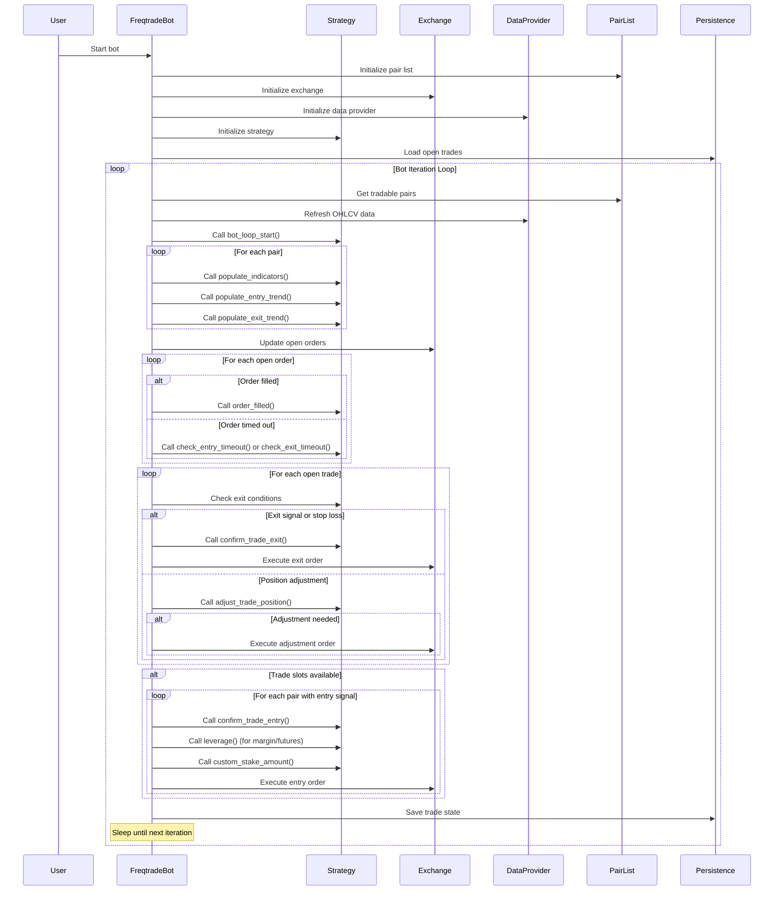
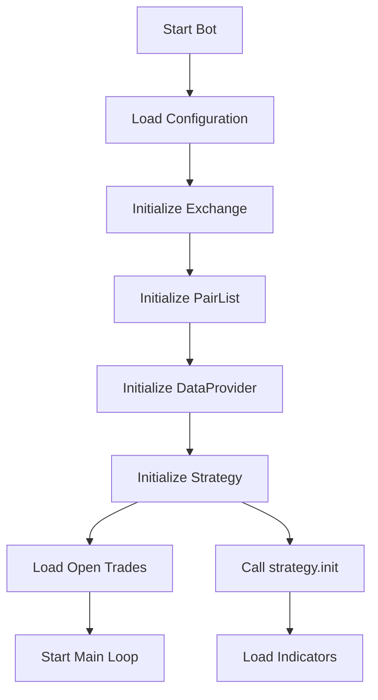
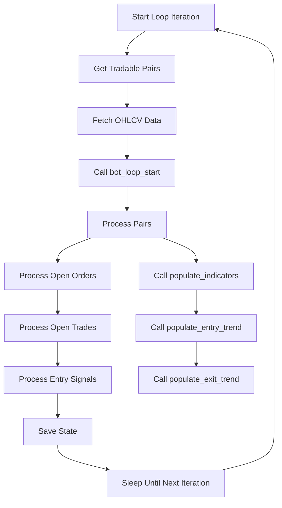
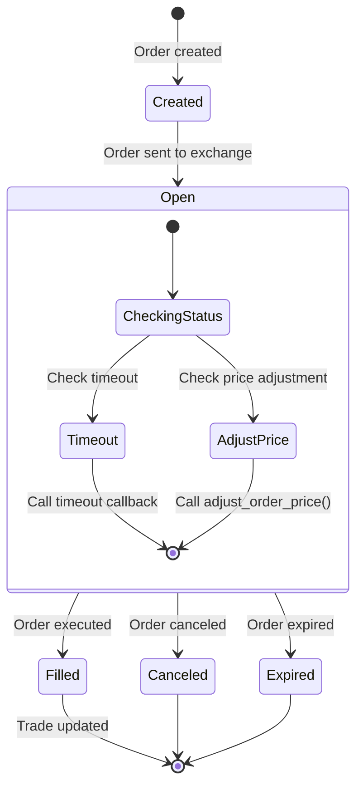
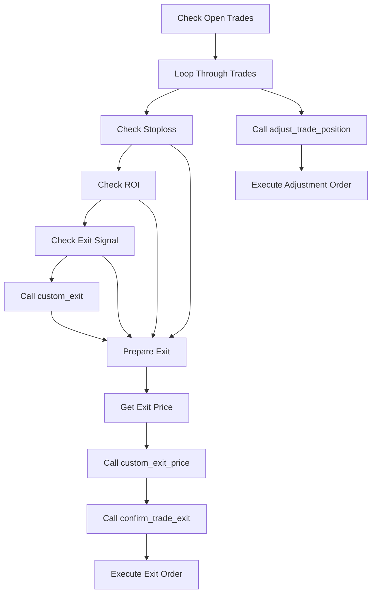
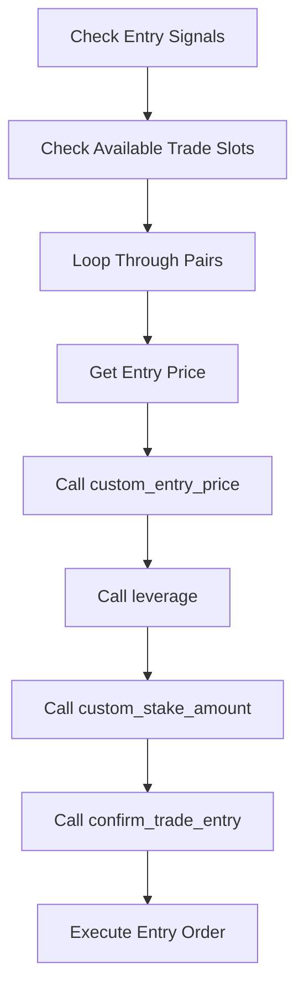
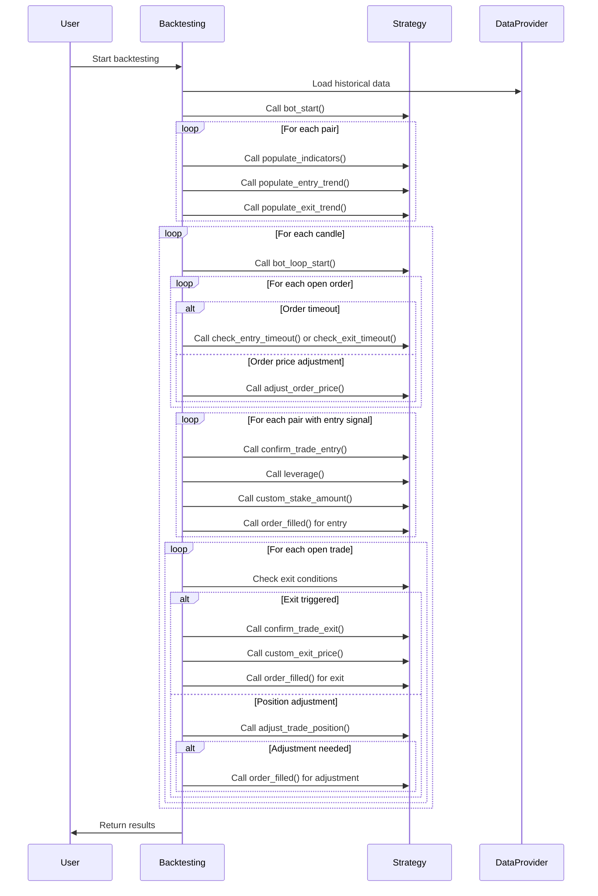
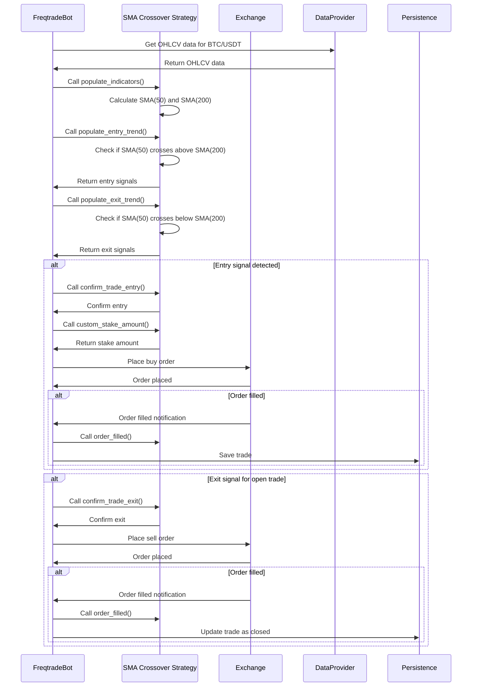

# Freqtrade Event Flow

This document details the event flow and processing sequence in the Freqtrade framework. Understanding this flow is crucial for developing effective trading strategies and properly utilizing the framework's capabilities.

## High-Level Event Flow

## Detailed Event Processing Sequence

Freqtrade follows a structured event flow that processes market data, generates signals, and executes trades. The following sections detail this flow.

### 1. Initialization Phase

During initialization:

1. The bot loads the configuration file and initializes all components
2. The exchange connection is established
3. The pair list manager is initialized with configured pair list providers
4. The data provider is set up to fetch market data
5. The strategy is initialized, calling its `init()` method
6. Open trades are loaded from the database
7. The main bot loop is started

### 2. Main Bot Loop

The main bot loop runs at regular intervals (configurable via `internals.process_throttle_secs`) and performs the following actions:

1. Get the current list of tradable pairs from the pair list manager
2. Fetch OHLCV data for all pairs (only once per candle to minimize API calls)
3. Call the strategy's `bot_loop_start()` callback
4. Process each pair by calling the strategy's populate methods
5. Process open orders (check for fills, timeouts, etc.)
6. Process open trades (check for exit conditions, adjustments, etc.)
7. Process entry signals for new trades
8. Save the current state to the database
9. Sleep until the next iteration

### 3. Order Processing Flow

Order processing follows these steps:

1. When an order is created, it's added to the list of open orders
2. The order is sent to the exchange
3. During each bot iteration, the status of open orders is checked
4. If an order is filled, the corresponding trade is updated and the `order_filled()` callback is called
5. If an order times out, the appropriate timeout callback is called
6. If price adjustment is enabled, the `adjust_order_price()` callback is called
7. Orders can be canceled manually or by the bot based on certain conditions

### 4. Trade Processing Flow

Trade processing includes:

1. Checking each open trade for exit conditions
2. Evaluating stop-loss conditions (including trailing stop-loss)
3. Checking ROI (Return on Investment) thresholds
4. Looking for exit signals from the strategy
5. Calling the `custom_exit()` callback for custom exit logic
6. If an exit is triggered, determining the exit price
7. Calling `confirm_trade_exit()` to confirm the exit
8. Executing the exit order if confirmed
9. Checking for position adjustments via `adjust_trade_position()`
10. Executing adjustment orders if needed

### 5. Entry Signal Processing

Entry signal processing includes:

1. Checking if trade slots are available (based on `max_open_trades`)
2. Looping through pairs with entry signals
3. Determining the entry price (based on configuration or `custom_entry_price()`)
4. Calling `leverage()` to determine leverage for margin/futures trading
5. Determining the stake amount via `custom_stake_amount()`
6. Calling `confirm_trade_entry()` to confirm the entry
7. Executing the entry order if confirmed

### 6. Backtesting Event Flow

The backtesting event flow simulates the live trading process:

1. Historical data is loaded for all pairs
2. The strategy's `bot_start()` callback is called once
3. Indicators and signals are calculated for all pairs
4. The simulation processes each candle sequentially
5. For each candle, the same callbacks as in live trading are called
6. Orders are simulated based on the candle's price range
7. Trades are tracked and performance metrics are calculated
8. Results are returned to the user

## Event Timing Considerations

Understanding the timing of events in Freqtrade is crucial for accurate strategy development:

1. **Candle Processing**: By default, Freqtrade processes candles after they are completed. This means that when processing a 5-minute candle at 10:05, you're working with data from 10:00-10:05.

2. **Order Execution**: In live trading, orders are executed asynchronously. In backtesting, orders are simulated based on the price range of the candle.

3. **Callback Frequency**: In live trading, callbacks like `bot_loop_start()` are called on each iteration (typically every few seconds). In backtesting, they are called once per candle.

4. **Data Availability**: In live trading, only data up to the current moment is available. In backtesting, the strategy has access to all historical data, but the framework prevents look-ahead bias.

## Error Handling in the Event Flow

Freqtrade implements several error handling mechanisms:

1. **Exchange Communication Errors**: Temporary errors are retried with exponential backoff
2. **Order Placement Errors**: Failed orders are logged and can trigger callbacks
3. **Strategy Errors**: Exceptions in strategy code are caught and logged
4. **Data Gaps**: The framework can handle missing candles in historical data

## Example Event Flow

Here's a concrete example of the event flow for a simple moving average crossover strategy:

This example demonstrates how a simple strategy interacts with the Freqtrade event flow to generate and process trading signals.
