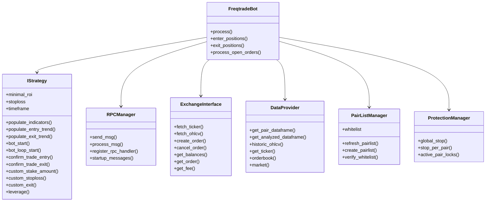
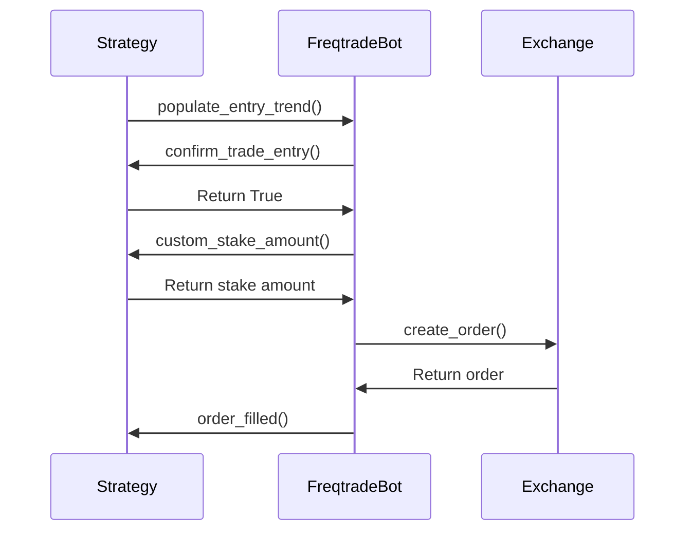
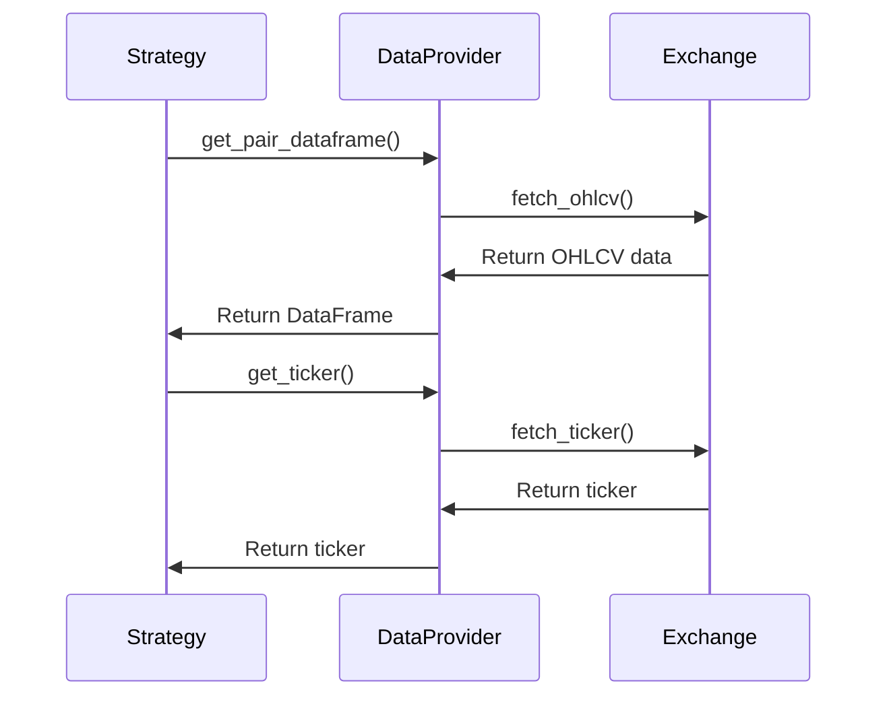
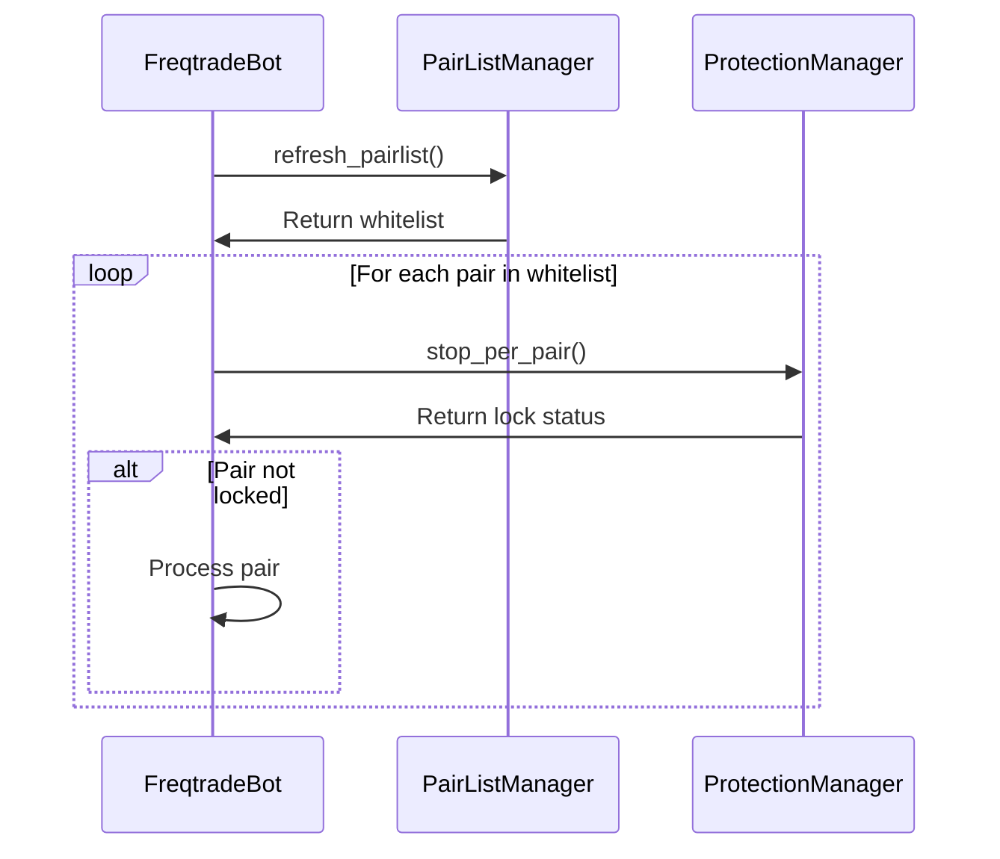

# Freqtrade Handlers

This document provides comprehensive documentation of the handlers and interfaces in Freqtrade. Understanding these components is essential for developing effective trading strategies and extending the framework's functionality.

## Handler Overview



## Core Handlers

### Strategy Handler (IStrategy)

The `IStrategy` class is the primary handler for implementing trading logic. It serves as the base class for all trading strategies in Freqtrade.

#### Interface

```python
class IStrategy(ABC):
    # Required methods
    def populate_indicators(self, dataframe: DataFrame, metadata: dict) -> DataFrame:
        """Calculate indicators for the given dataframe."""
        return dataframe
        
    def populate_entry_trend(self, dataframe: DataFrame, metadata: dict) -> DataFrame:
        """Generate entry signals for the given dataframe."""
        return dataframe
        
    def populate_exit_trend(self, dataframe: DataFrame, metadata: dict) -> DataFrame:
        """Generate exit signals for the given dataframe."""
        return dataframe
    
    # Optional callbacks
    def bot_start(self, **kwargs) -> None:
        """Called once at the start of the bot."""
        pass
        
    def bot_loop_start(self, **kwargs) -> None:
        """Called at the start of each bot iteration."""
        pass
        
    def confirm_trade_entry(self, pair: str, order_type: str, amount: float, rate: float,
                           time_in_force: str, current_time: datetime, **kwargs) -> bool:
        """Called before entering a trade, returns True to proceed."""
        return True
        
    def confirm_trade_exit(self, pair: str, trade: Trade, order_type: str, amount: float,
                          rate: float, time_in_force: str, exit_reason: str,
                          current_time: datetime, **kwargs) -> bool:
        """Called before exiting a trade, returns True to proceed."""
        return True
        
    def custom_stake_amount(self, pair: str, current_time: datetime, current_rate: float,
                           proposed_stake: float, min_stake: float, max_stake: float,
                           leverage: float, entry_tag: str, side: str, **kwargs) -> float:
        """Calculate custom stake amount for the trade."""
        return proposed_stake
        
    def custom_stoploss(self, pair: str, trade: Trade, current_time: datetime,
                       current_rate: float, current_profit: float, **kwargs) -> float:
        """Calculate custom stoploss for the trade."""
        return self.stoploss
        
    def custom_exit(self, pair: str, trade: Trade, current_time: datetime, current_rate: float,
                   current_profit: float, **kwargs) -> Optional[str]:
        """Custom exit signal logic, returns exit reason or None."""
        return None
        
    def leverage(self, pair: str, current_time: datetime, current_rate: float,
                proposed_leverage: float, max_leverage: float, side: str,
                **kwargs) -> float:
        """Calculate leverage for the trade."""
        return proposed_leverage
```

#### Key Properties

- `minimal_roi`: Dictionary defining Return on Investment (ROI) targets
- `stoploss`: Stop-loss percentage as a negative value
- `timeframe`: Candle timeframe for analysis (e.g., "5m", "1h")
- `process_only_new_candles`: Whether to process only new candles
- `order_types`: Dictionary defining order types for entries and exits
- `use_exit_signal`: Whether to use exit signals from `populate_exit_trend()`
- `use_custom_stoploss`: Whether to use the `custom_stoploss()` method
- `stake_currency`: The currency used for stake amount
- `startup_candle_count`: Number of candles required for indicator calculation

#### Responsibilities

- Calculating technical indicators for market analysis
- Generating entry and exit signals
- Confirming trade entries and exits
- Calculating custom stake amounts and stop-loss levels
- Implementing custom exit conditions
- Determining leverage for margin/futures trading

#### Example Usage

```python
class SimpleMovingAverageStrategy(IStrategy):
    # Define parameters
    minimal_roi = {"0": 0.1}  # 10% profit target
    stoploss = -0.05  # 5% stop loss
    timeframe = "1h"
    
    def populate_indicators(self, dataframe: DataFrame, metadata: dict) -> DataFrame:
        # Calculate indicators
        dataframe['sma20'] = ta.SMA(dataframe, timeperiod=20)
        dataframe['sma50'] = ta.SMA(dataframe, timeperiod=50)
        return dataframe
    
    def populate_entry_trend(self, dataframe: DataFrame, metadata: dict) -> DataFrame:
        # Generate entry signals
        dataframe.loc[
            (dataframe['sma20'] > dataframe['sma50']) &
            (dataframe['volume'] > 0),
            'enter_long'] = 1
        return dataframe
    
    def populate_exit_trend(self, dataframe: DataFrame, metadata: dict) -> DataFrame:
        # Generate exit signals
        dataframe.loc[
            (dataframe['sma20'] < dataframe['sma50']) &
            (dataframe['volume'] > 0),
            'exit_long'] = 1
        return dataframe
```

### Exchange Handler (Exchange)

The `Exchange` class handles all communication with cryptocurrency exchanges through the CCXT library.

#### Interface

```python
class Exchange:
    def fetch_ticker(self, pair: str) -> dict:
        """Fetch current ticker data for the given pair."""
        pass
        
    def fetch_ohlcv(self, pair: str, timeframe: str, since_ms: int = None,
                   is_new_pair: bool = False, candle_type: str = None) -> List[List]:
        """Fetch OHLCV data for the given pair and timeframe."""
        pass
        
    def create_order(self, pair: str, order_type: str, side: str, amount: float,
                    rate: float = None, leverage: float = None) -> dict:
        """Create an order on the exchange."""
        pass
        
    def cancel_order(self, order_id: str, pair: str) -> dict:
        """Cancel an order on the exchange."""
        pass
        
    def get_balances(self) -> dict:
        """Get account balances."""
        pass
        
    def get_order(self, order_id: str, pair: str) -> dict:
        """Get order details."""
        pass
        
    def get_fee(self, symbol: str, order_type: str = 'limit',
               side: str = 'buy', amount: float = 1.0,
               price: float = 1.0, taker_or_maker: str = 'maker') -> float:
        """Get trading fee for the given parameters."""
        pass
```

#### Responsibilities

- Communicating with cryptocurrency exchanges
- Fetching market data (tickers, OHLCV)
- Placing and managing orders
- Retrieving account balances and order information
- Handling exchange-specific features and limitations
- Managing rate limits and error handling

#### Example Usage

```python
# Initialize exchange
exchange = Exchange(config)

# Fetch OHLCV data
ohlcv = exchange.fetch_ohlcv('BTC/USDT', '1h')

# Create a buy order
order = exchange.create_order(
    pair='BTC/USDT',
    order_type='limit',
    side='buy',
    amount=0.01,
    rate=30000.0
)

# Check order status
order_status = exchange.get_order(order['id'], 'BTC/USDT')

# Get account balances
balances = exchange.get_balances()
```

### Data Provider Handler (DataProvider)

The `DataProvider` class serves as an abstraction layer for accessing market data.

#### Interface

```python
class DataProvider:
    def get_pair_dataframe(self, pair: str, timeframe: str = None) -> DataFrame:
        """Get OHLCV dataframe for the given pair and timeframe."""
        pass
        
    def get_analyzed_dataframe(self, pair: str, timeframe: str) -> Tuple[DataFrame, datetime]:
        """Get analyzed dataframe (with indicators) and last refresh time."""
        pass
        
    def historic_ohlcv(self, pair: str, timeframe: str) -> DataFrame:
        """Get historical OHLCV data for the given pair and timeframe."""
        pass
        
    def get_ticker(self, pair: str) -> dict:
        """Get current ticker for the given pair."""
        pass
        
    def orderbook(self, pair: str, maximum: int = 100) -> dict:
        """Get orderbook for the given pair."""
        pass
        
    def market(self, pair: str) -> dict:
        """Get market data for the given pair."""
        pass
```

#### Responsibilities

- Providing a unified interface for accessing market data
- Caching data to reduce API calls
- Converting raw exchange data to pandas DataFrames
- Providing access to analyzed data with indicators
- Supplying additional market information (orderbook, tickers)

#### Example Usage

```python
# In a strategy
def populate_indicators(self, dataframe: DataFrame, metadata: dict) -> DataFrame:
    # Get data from a higher timeframe
    informative = self.dp.get_pair_dataframe(metadata['pair'], '1d')
    
    # Calculate indicators on higher timeframe
    informative['sma200'] = ta.SMA(informative, timeperiod=200)
    
    # Merge with original dataframe
    dataframe = merge_informative_pair(dataframe, informative, self.timeframe, '1d')
    
    return dataframe

def confirm_trade_entry(self, pair: str, order_type: str, amount: float, rate: float,
                       time_in_force: str, current_time: datetime, **kwargs) -> bool:
    # Get current ticker
    ticker = self.dp.get_ticker(pair)
    
    # Check if current price is close to rate
    if abs(ticker['last'] - rate) / rate > 0.01:  # 1% difference
        return False  # Price moved too much
    
    return True
```

### PairList Handler (PairListManager)

The `PairListManager` class manages the selection of trading pairs.

#### Interface

```python
class PairListManager:
    def refresh_pairlist(self) -> None:
        """Refresh the pairlist."""
        pass
        
    def create_pairlist(self, tickers: Dict) -> List[str]:
        """Create the pairlist based on tickers."""
        pass
        
    def verify_whitelist(self, whitelist: List[str], tickers: Dict) -> List[str]:
        """Verify the whitelist against available markets."""
        pass
        
    @property
    def whitelist(self) -> List[str]:
        """Get the current whitelist."""
        pass
```

#### Responsibilities

- Managing the list of tradable pairs
- Applying pairlist filters (volume, price, etc.)
- Handling blacklisted pairs
- Refreshing the pairlist at regular intervals
- Validating pairs against available markets

#### Example Usage

```python
# In FreqtradeBot
def process(self) -> bool:
    """Main bot loop."""
    # Refresh pairlist
    self.pairlists.refresh_pairlist()
    
    # Get current whitelist
    whitelist = self.pairlists.whitelist
    
    # Process each pair in the whitelist
    for pair in whitelist:
        self._process_pair(pair)
```

### Protection Handler (ProtectionManager)

The `ProtectionManager` class manages trading protections to prevent excessive losses.

#### Interface

```python
class ProtectionManager:
    def global_stop(self, date_now: datetime) -> Optional[ProtectionReturn]:
        """Check if trading should be stopped globally."""
        pass
        
    def stop_per_pair(self, pair: str, date_now: datetime) -> Optional[ProtectionReturn]:
        """Check if trading should be stopped for a specific pair."""
        pass
        
    def active_pair_locks(self, pair: str = None) -> Dict[str, PairLock]:
        """Get active pair locks."""
        pass
```

#### Responsibilities

- Implementing trading protections
- Preventing trading after consecutive losses
- Locking pairs after failed trades
- Cooling down after drawdowns
- Managing global and per-pair stops

#### Example Usage

```python
# In FreqtradeBot
def enter_positions(self) -> int:
    """Enter positions based on signals."""
    # Check if global stop is active
    if self.protections.global_stop(datetime.now(timezone.utc)):
        logger.info("Trading stopped due to protection rules.")
        return 0
    
    # Process entry signals
    for pair in self.pairlists.whitelist:
        # Check if pair is locked
        if self.protections.stop_per_pair(pair, datetime.now(timezone.utc)):
            logger.debug(f"Pair {pair} locked due to protection rules.")
            continue
        
        # Process entry for pair
        self._enter_trade(pair)
```

### RPC Handler (RPCManager)

The `RPCManager` class manages remote procedure calls for controlling the bot.

#### Interface

```python
class RPCManager:
    def send_msg(self, msg: Dict[str, Any]) -> None:
        """Send message to all registered RPC handlers."""
        pass
        
    def process_msg(self, command: Dict[str, Any]) -> Optional[Dict[str, Any]]:
        """Process incoming message and return response."""
        pass
        
    def register_rpc_handler(self, handler: RPCHandler) -> None:
        """Register a new RPC handler."""
        pass
        
    def startup_messages(self, config: Dict[str, Any], pairlist: List[str]) -> None:
        """Send startup messages to all registered RPC handlers."""
        pass
```

#### Responsibilities

- Managing communication with external interfaces (Telegram, REST API, etc.)
- Processing commands from users
- Sending notifications and status updates
- Providing a unified interface for bot control

#### Example Usage

```python
# In FreqtradeBot
def _notify_enter(self, trade: Trade, order: Dict, fill: bool = False) -> None:
    """Notify users about new trade."""
    msg = {
        'type': RPCMessageType.ENTRY_FILL if fill else RPCMessageType.ENTRY,
        'trade_id': trade.id,
        'pair': trade.pair,
        'limit': order.get('price'),
        'amount': order.get('amount'),
        'order_type': order.get('type'),
        'leverage': trade.leverage if trade.leverage else 1.0,
        'direction': 'Long' if trade.is_short is False else 'Short',
    }
    self.rpc.send_msg(msg)
```

## Specialized Handlers

### Backtesting Handler (Backtesting)

The `Backtesting` class handles the backtesting process.

#### Interface

```python
class Backtesting:
    def start(self) -> Dict[str, Any]:
        """Start backtesting process."""
        pass
        
    def backtest(self, processed: Dict) -> Dict[str, Any]:
        """Perform backtesting for the given processed data."""
        pass
        
    def backtest_one_strategy(self, strategy: IStrategy, data: Dict[str, Any]) -> Dict[str, Any]:
        """Backtest one strategy with the given data."""
        pass
        
    def load_bt_data(self) -> Tuple[Dict[str, DataFrame], TimeRange]:
        """Load data for backtesting."""
        pass
```

#### Responsibilities

- Loading historical data for backtesting
- Simulating trading based on strategy signals
- Calculating performance metrics
- Generating backtest reports
- Optimizing strategy parameters

#### Example Usage

```python
# Create backtesting object
backtesting = Backtesting(config)

# Run backtest
results = backtesting.start()

# Print results
print(f"Total trades: {results['total_trades']}")
print(f"Profit: {results['profit_total']:.2f} {config['stake_currency']}")
print(f"Profit %: {results['profit_percent']:.2f}%")
```

### Hyperopt Handler (Hyperopt)

The `Hyperopt` class handles hyperparameter optimization for strategies.

#### Interface

```python
class Hyperopt:
    def start(self) -> None:
        """Start hyperopt process."""
        pass
        
    def generate_optimizer(self, dimensions: List[Dimension], random_state: int) -> Optimizer:
        """Generate optimizer for the given dimensions."""
        pass
        
    def prepare_hyperopt_data(self) -> Dict[str, Any]:
        """Prepare data for hyperopt."""
        pass
        
    def calculate_loss(self, results: Dict) -> float:
        """Calculate loss for the given results."""
        pass
```

#### Responsibilities

- Defining the hyperparameter search space
- Running backtests with different parameter combinations
- Evaluating performance using loss functions
- Finding optimal parameter values
- Reporting optimization results

#### Example Usage

```python
# Create hyperopt object
hyperopt = Hyperopt(config)

# Run hyperopt
hyperopt.start()
```

### FreqAI Handler (FreqAI)

The `FreqAI` class handles machine learning model training and prediction.

#### Interface

```python
class FreqAI:
    def train(self, pair: str) -> Any:
        """Train model for the given pair."""
        pass
        
    def predict(self, pair: str, data: DataFrame) -> DataFrame:
        """Make predictions for the given pair and data."""
        pass
        
    def fit_live_predictions(self, pair: str) -> None:
        """Fit live predictions for the given pair."""
        pass
        
    def purge_old_models(self) -> None:
        """Purge old models."""
        pass
```

#### Responsibilities

- Feature engineering for machine learning
- Training prediction models
- Making predictions for trading decisions
- Managing model lifecycle
- Adapting to changing market conditions

#### Example Usage

```python
# In a FreqAI strategy
def populate_indicators(self, dataframe: DataFrame, metadata: dict) -> DataFrame:
    # Get pair name
    pair = metadata['pair']
    
    # Get predictions from FreqAI
    dataframe = self.freqai.predict(pair, dataframe)
    
    return dataframe
```

## Handler Interaction Patterns

### Strategy and Exchange Interaction



### Strategy and DataProvider Interaction



### PairList and Protection Interaction



## Edge Cases and Their Handling

### 1. Exchange Communication Errors

Freqtrade implements retry logic for exchange communication:

```python
def _api_request(self, method: str, *args, **kwargs) -> Any:
    """Make API request with retry logic."""
    for retry in range(self.retries):
        try:
            return method(*args, **kwargs)
        except (DDosProtection, RequestTimeout) as e:
            # Exponential backoff
            sleep_time = self.retry_backoff_factor * (2 ** retry)
            logger.warning(f"Exchange busy, retrying in {sleep_time:.2f} seconds...")
            time.sleep(sleep_time)
    
    # If we get here, all retries failed
    raise ExchangeError("All retries failed")
```

### 2. Order Execution Edge Cases

The framework handles various order execution edge cases:

```python
def create_stoploss_order(self, pair: str, amount: float, rate: float, order_types: Dict) -> Dict:
    """Create stop-loss order with fallback logic."""
    try:
        # Try to create stop-loss on exchange
        stoploss_order = self.exchange.create_stoploss(
            pair=pair,
            amount=amount,
            stop_price=rate,
            order_types=order_types
        )
        return stoploss_order
    except InvalidOrderException:
        # Fall back to stoploss in code
        logger.warning(f"Could not create stoploss order for {pair}, using stoploss in code.")
        return {}
```

### 3. Data Gaps

The framework handles gaps in historical data:

```python
def _download_pair_history(self, pair: str, timeframe: str, timerange: TimeRange) -> None:
    """Download pair history with gap detection."""
    # Download data
    data = self.exchange.fetch_ohlcv(pair, timeframe, since=timerange.startts * 1000)
    
    # Check for gaps
    if len(data) > 1:
        timestamps = [x[0] for x in data]
        gaps = self._detect_gaps(timestamps, timeframe)
        
        # Fill gaps if needed
        for gap_start, gap_end in gaps:
            logger.warning(f"Detected gap between {gap_start} and {gap_end}, filling...")
            gap_data = self.exchange.fetch_ohlcv(
                pair, timeframe, since=gap_start, until=gap_end
            )
            data.extend(gap_data)
    
    # Sort and save data
    data.sort(key=lambda x: x[0])
    self._save_pair_history(pair, timeframe, data)
```

### 4. Strategy Errors

The framework catches and handles strategy errors:

```python
def _process_pair(self, pair: str) -> None:
    """Process a single pair."""
    try:
        # Get analyzed dataframe
        dataframe, _ = self.dataprovider.get_analyzed_dataframe(pair, self.timeframe)
        
        # Check for entry signals
        if self._check_entry_signals(dataframe, pair):
            self._enter_trade(pair)
    except StrategyError as e:
        logger.error(f"Strategy error for {pair}: {e}")
    except Exception as e:
        logger.error(f"Unexpected error processing {pair}: {e}")
        logger.exception(e)
```

## Conclusion

Freqtrade provides a comprehensive set of handlers that enable the development of sophisticated trading strategies. By understanding these handlers and their interactions, developers can create more effective and reliable trading systems while leveraging the full capabilities of the framework.
