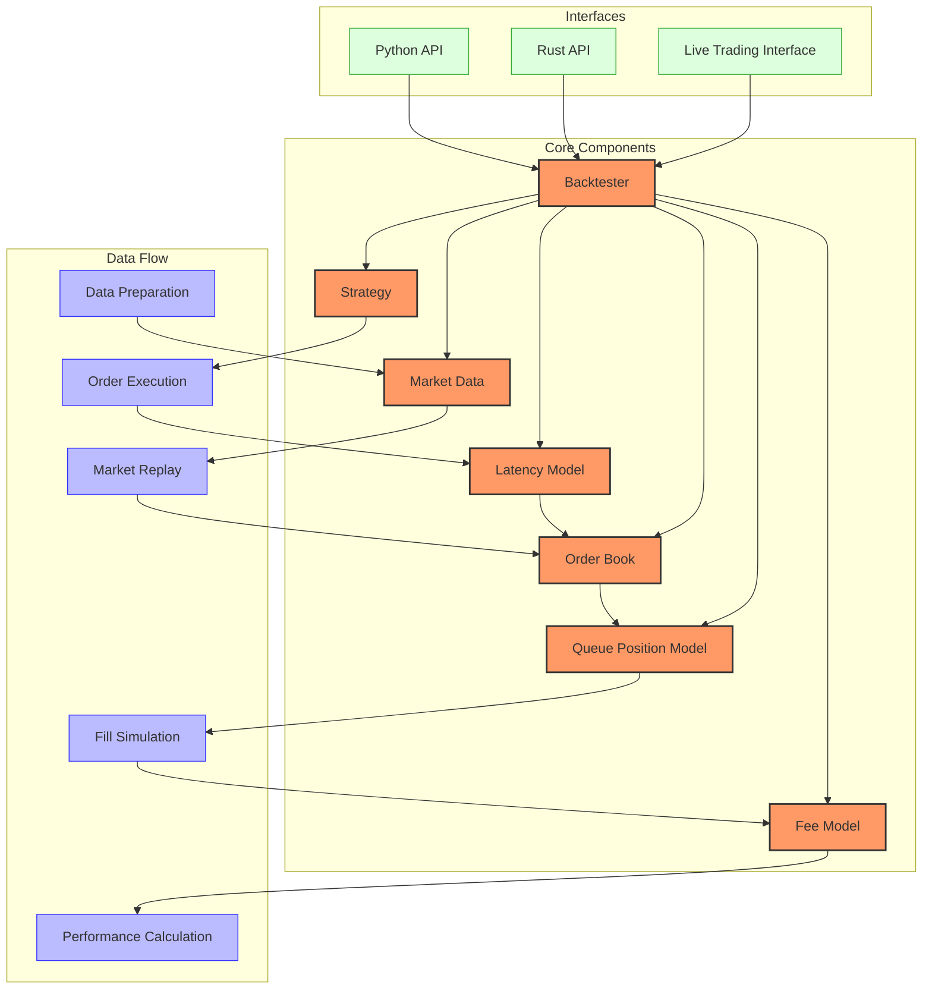

# HFTBacktest Trading System

## Overview

HFTBacktest is a high-frequency trading backtesting framework specifically designed for developing and testing high-frequency trading (HFT) and market making strategies. It provides a realistic simulation environment by accounting for both feed and order latencies, as well as order queue position dynamics for order fill simulation.

The framework focuses on accurate market replay-based backtesting, using full order book and trade tick feed data to create a realistic environment for backtesting strategies that are sensitive to microstructural factors like latency, queue position, and order book dynamics.

## Architecture



## Key Components and Relationships

### Backtester

The central component that coordinates the entire simulation process:
- Manages market data and order book reconstruction
- Processes strategy signals and order requests
- Simulates order execution with latency
- Applies queue position models for fill simulation
- Calculates performance statistics

### Market Data

Provides historical market data required for simulation:
- Supports Market-by-Price (L2) and Market-by-Order (L3) data
- Processes depth updates and trade ticks
- Enables customizable time intervals for simulation

### Order Book

Reconstructs and maintains the full limit order book:
- Processes market depth updates
- Tracks price levels and available liquidity
- Supports both L2 (Market-by-Price) and L3 (Market-by-Order) order books

### Latency Model

Simulates realistic latency in market data and order execution:
- Models feed latency for market data reception
- Models order latency for order submission and responses
- Supports custom latency distributions and profiles

### Queue Position Model

Models order queue dynamics for realistic fill simulation:
- Estimates queue position for orders at each price level
- Applies probability-based models for order execution
- Supports various queue position models based on market characteristics

### Fee Model

Calculates trading costs for performance evaluation:
- Supports various fee structures (maker/taker)
- Accounts for exchange-specific fee schedules

### Strategy

User-defined trading logic implemented using Numba JIT compilation:
- Processes market data and generates trading signals
- Places and manages orders
- Reacts to order execution events

## Supported Markets and Instruments

HFTBacktest is designed to work with any market or instrument where high-frequency data is available:

- **Cryptocurrency Markets**: Supports major cryptocurrency exchanges including Binance, Bybit, and others.
- **Futures Markets**: Can be used for cryptocurrency futures and traditional futures markets.
- **Traditional Markets**: Can support equities, forex, and other markets with appropriate data.

The framework is particularly well-suited for:
- Large-tick assets where queue position is important
- Markets with significant latency considerations
- Markets with complex microstructure dynamics

## Performance Characteristics

- **Execution Speed**: Excellent - Rust-based core with Numba JIT compilation for strategies
- **Memory Efficiency**: Very high - Optimized data structures for order book operations
- **Backtesting Approach**: Market replay-based with tick-by-tick simulation
- **Latency Simulation**: Nanosecond precision with customizable models
- **Order Book Simulation**: Full reconstruction with queue position tracking
- **Scalability**: Supports multi-asset and multi-exchange backtesting

## Dependencies and Requirements

### Python Requirements
- Python 3.10 or higher
- Numba for JIT compilation
- NumPy for numerical operations
- Pandas for data manipulation (optional, for data preparation)

### Rust Requirements (for Rust API and live trading)
- Rust compiler (latest stable version recommended)

### Data Requirements
- Market depth (L2) data with price and quantity information
- Trade tick data
- Optional: Order latency data for more accurate simulations

## Quick Start Guide

### Installation

```bash
# Install using pip
pip install hftbacktest

# Or clone from GitHub for latest development version
git clone https://github.com/nkaz001/hftbacktest
cd hftbacktest
pip install -e .
```

### Basic Usage

```python
from hftbacktest import HftBacktest, BUY, SELL, GTX, LIMIT
import numpy as np
from numba import njit

# Define strategy algorithm
@njit
def market_making_algo(hbt):
    asset_no = 0
    tick_size = hbt.depth(asset_no).tick_size
    lot_size = hbt.depth(asset_no).lot_size

    # Main simulation loop, elapses 10 milliseconds at each step
    while hbt.elapse(10_000_000) == 0:
        # Clear inactive orders
        hbt.clear_inactive_orders(asset_no)
        
        # Get current market data
        depth = hbt.depth(asset_no)
        mid_price = (depth.best_bid + depth.best_ask) / 2.0
        
        # Simple market making strategy
        new_bid_tick = depth.best_bid_tick
        new_ask_tick = depth.best_ask_tick
        order_qty = np.round(100 / mid_price / lot_size) * lot_size
        
        # Process time simulation (1ms)
        if hbt.elapse(1_000_000) != 0:
            return False
            
        # Manage existing orders and place new ones
        # [Order management logic would go here]
        
        # Place new orders
        hbt.submit_buy_order(asset_no, new_bid_tick, new_bid_tick * tick_size, 
                            order_qty, GTX, LIMIT, False)
        hbt.submit_sell_order(asset_no, new_ask_tick, new_ask_tick * tick_size, 
                             order_qty, GTX, LIMIT, False)
                             
        # Wait for order response
        if not hbt.wait_order_response(asset_no, last_order_id, 5_000_000_000):
            return False
            
    return True

# Load market data
# [Data loading code would go here]

# Create and run backtest
hbt = HftBacktest(feed_latencies, 
                  order_latencies,
                  depth_updates, 
                  trades, 
                  lot_sizes,
                  tick_sizes)
                  
# Run the backtest
hbt.run(market_making_algo)

# Get performance statistics
performance = hbt.get_statistics()
```

For more detailed examples and advanced features, see the [event-flow.md](./event-flow.md), [state-management.md](./state-management.md), and [handlers.md](./handlers.md) documentation.
