# HFTBacktest Event Flow

This document details the event flow and processing sequence in the HFTBacktest framework. Understanding this flow is crucial for developing effective high-frequency trading strategies and properly utilizing the framework's simulation capabilities.

## High-Level Event Flow

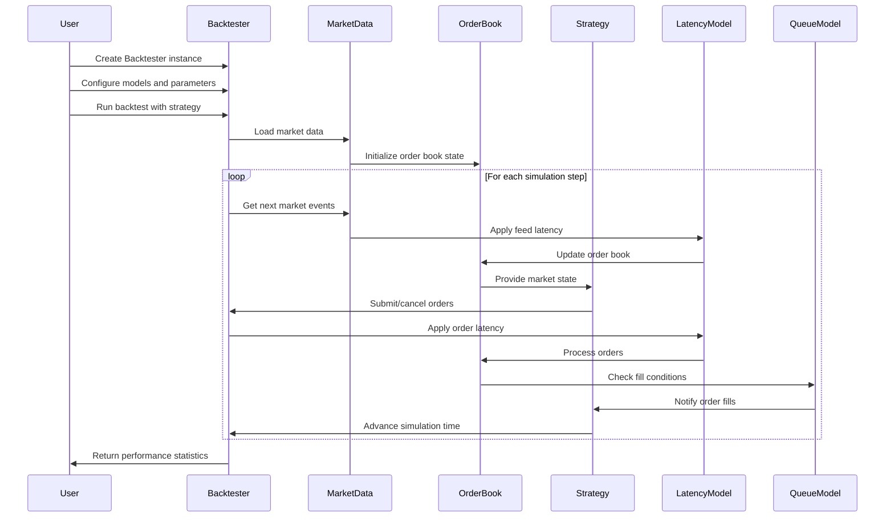

## Detailed Event Processing Sequence

HFTBacktest follows a tick-by-tick simulation approach where market events are processed sequentially in chronological order. The framework simulates both feed latency (time for market data to reach the strategy) and order latency (time for orders to reach the exchange).

### 1. Initialization Phase

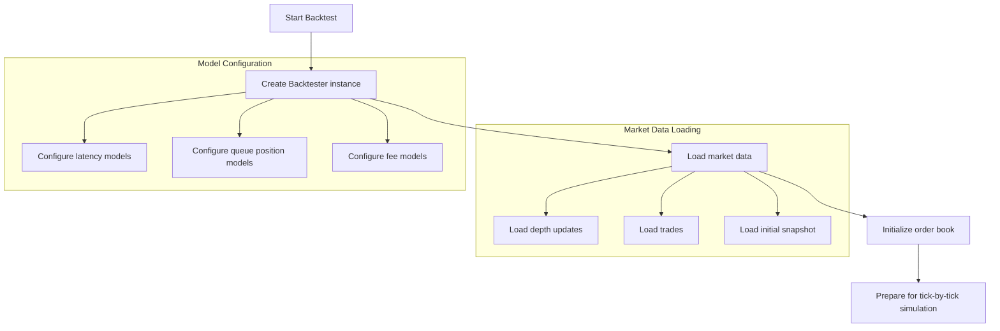

During initialization:

1. The user creates a `Backtester` instance with appropriate configuration
2. Market data is loaded, including depth updates, trades, and initial order book snapshot
3. The order book is initialized with the initial snapshot
4. Latency, queue position, and fee models are configured
5. The simulation is prepared for tick-by-tick processing

### 2. Tick-by-Tick Simulation

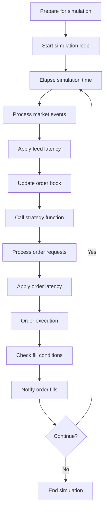

During the tick-by-tick simulation:

1. The strategy calls `elapse(time_delta)` to advance simulation time
2. Market events that occur within the time window are processed:
   - Depth updates modify the order book
   - Trades are applied to the order book
3. Feed latency is applied to determine when the strategy receives market information
4. The strategy processes the market state and submits/cancels orders
5. Order latency is applied to determine when orders reach the exchange
6. Orders are processed by the exchange simulation
7. Fill conditions are checked using the queue position model
8. Order fills are notified back to the strategy

### 3. Order Processing Flow

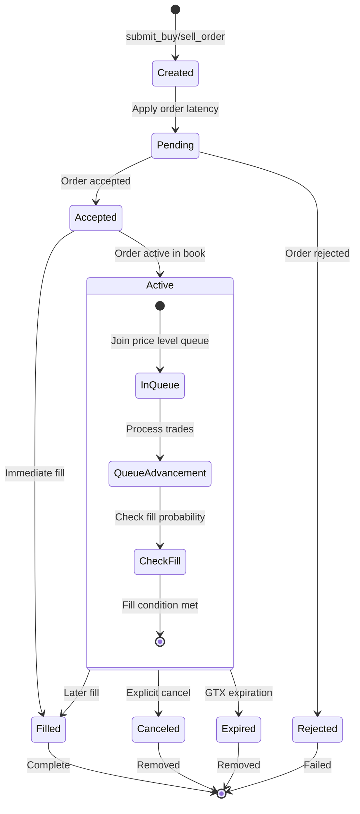

Order processing follows these steps:

1. The strategy submits an order using `submit_buy_order()` or `submit_sell_order()`
2. Order latency is applied to simulate network delay
3. The exchange simulation validates the order (sufficient funds, valid parameters)
4. If valid, the order is added to the order book at the specified price level
5. The order joins the queue at its price level
6. As trades occur, the queue position is updated
7. Fill conditions are checked based on the queue position model
8. When fill conditions are met, the order is executed and the fill is reported

### 4. Queue Position Modeling

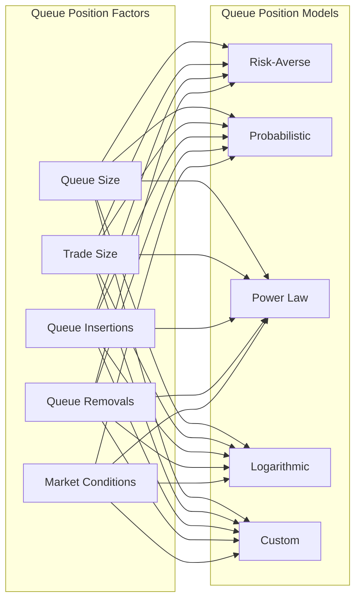

HFTBacktest provides several queue position models:

1. **Risk-Averse Model**: Most conservative model where queue position only advances with trades
2. **Probabilistic Model**: Uses probabilities based on queue position to determine fills
3. **Power Law Model**: Uses a power function to model the probability of fills
4. **Logarithmic Model**: Uses a logarithmic function to model the probability of fills
5. **Custom Models**: Users can implement custom queue position models

### 5. Time Management and Progression

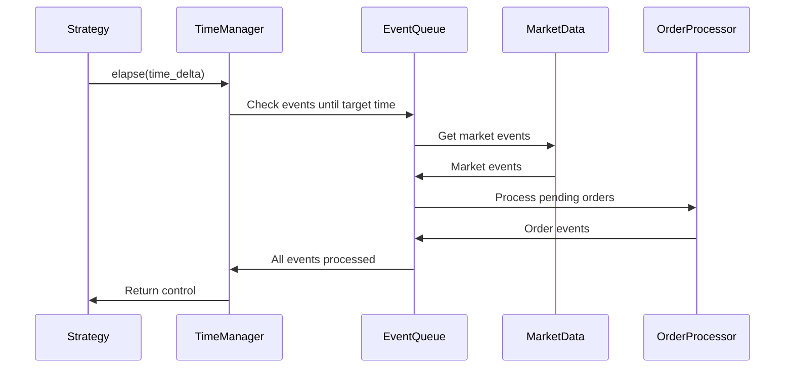

Time management in HFTBacktest:

1. The strategy controls time progression using the `elapse(time_delta)` method
2. This instructs the backtester to process all events up to the specified time delta
3. Events include market data updates, order submissions, cancellations, and fills
4. Events are processed in chronological order, accounting for feed and order latency
5. Control returns to the strategy after all events are processed

## Event Types and Their Purposes

HFTBacktest processes several types of events during simulation:

### Market Data Events

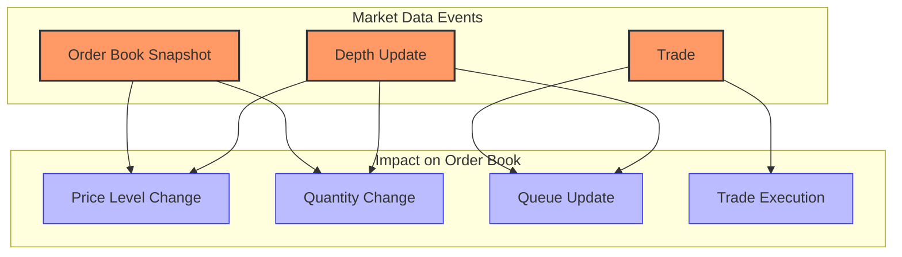

1. **Depth Update Events**:
   - Represent changes to the order book
   - Add or remove orders at specific price levels
   - Modify quantities at price levels

2. **Trade Events**:
   - Represent executed trades
   - Affect queue positions at price levels
   - Used for queue position modeling

3. **Snapshot Events**:
   - Represent the complete state of the order book
   - Used for initialization or synchronization

### Order Events

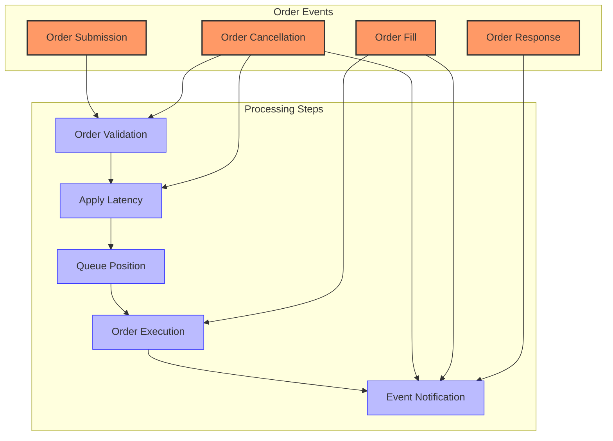

1. **Order Submission Events**:
   - Generated when the strategy submits orders
   - Subject to order latency
   - Validated by the exchange simulation

2. **Order Cancellation Events**:
   - Generated when the strategy cancels orders
   - Subject to order latency
   - Processed by the exchange simulation

3. **Order Fill Events**:
   - Generated when orders are filled
   - Based on queue position and market conditions
   - Affect positions and P&L

4. **Order Response Events**:
   - Generated in response to order submissions/cancellations
   - Notify the strategy of order status changes

### Strategy Events

1. **Time Elapse Events**:
   - Generated when the strategy calls `elapse(time_delta)`
   - Trigger processing of market and order events
   - Advance simulation time

2. **Strategy Signal Events**:
   - Generated by the strategy's decision logic
   - Result in order submissions/cancellations

## Event Processing Timing

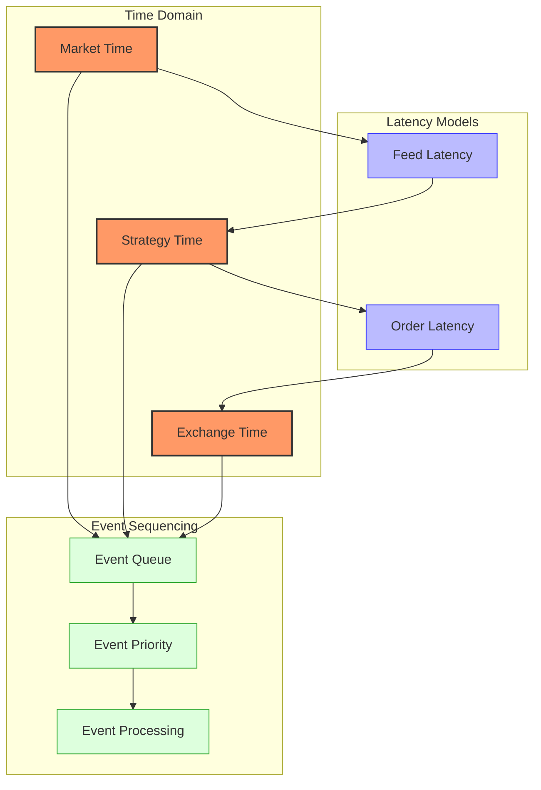

### Timing Model

HFTBacktest uses a sophisticated timing model to ensure realistic simulation:

1. **Market Time**: The "real" time when market events occur
2. **Strategy Time**: The time when the strategy receives market information (after feed latency)
3. **Exchange Time**: The time when orders reach the exchange (after order latency)

### Latency Models

1. **Feed Latency**: The delay between market events occurring and the strategy receiving them
   - Can be constant, variable, or based on historical data
   - Affects the timeliness of market information

2. **Order Latency**: The delay between the strategy submitting orders and the exchange receiving them
   - Can be constant, variable, or based on historical data
   - Affects the execution timing and effectiveness of orders

### Event Sequencing

Events are sequenced based on their timestamps, accounting for latencies:

1. Market events occur at market time
2. Strategy processes market events at market time + feed latency
3. Strategy submits orders at strategy time
4. Exchange processes orders at strategy time + order latency

## Error Handling in the Event Flow

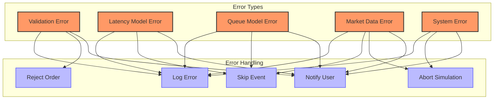

HFTBacktest implements several error handling mechanisms:

### Order Validation Errors

1. **Invalid Size**: Orders with invalid sizes are rejected
   - Zero or negative sizes
   - Sizes not conforming to lot size rules

2. **Invalid Price**: Orders with invalid prices are rejected
   - Negative or zero prices
   - Prices not conforming to tick size rules

3. **Insufficient Funds**: Orders requiring more funds than available are rejected
   - Checked based on margin requirements and available balance

### Model Errors

1. **Latency Model Errors**: Errors in the latency model are logged and handled
   - Invalid latency values
   - Model implementation errors

2. **Queue Model Errors**: Errors in the queue position model are logged and handled
   - Invalid queue positions
   - Model implementation errors

### Data Errors

1. **Missing Data**: Missing or incomplete market data is handled
   - Gaps in market data
   - Inconsistent order book states

2. **Invalid Data**: Invalid or corrupt market data is detected and handled
   - Price/quantity anomalies
   - Timestamp inconsistencies

### System Errors

1. **Memory Errors**: Out-of-memory or resource allocation errors
   - Large order books or datasets
   - Resource exhaustion

2. **Runtime Errors**: Errors during simulation execution
   - Algorithm exceptions
   - Internal state inconsistencies

## Example Event Flow Scenarios

### Scenario 1: Market Making Strategy

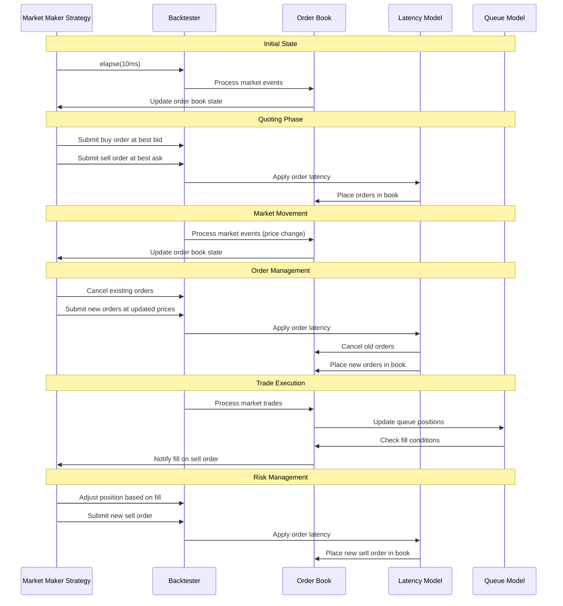

This example shows the event flow for a typical market making strategy:

1. The strategy advances time by 10ms
2. The backtester processes market events within this time window
3. The strategy submits buy and sell orders at the best bid and ask
4. Order latency is applied
5. The orders are placed in the order book
6. Market events cause price changes
7. The strategy cancels existing orders and submits new ones
8. A trade occurs, affecting queue positions
9. The queue model determines that the sell order should be filled
10. The strategy is notified of the fill and adjusts its position

### Scenario 2: Impact of Latency on Strategy Performance

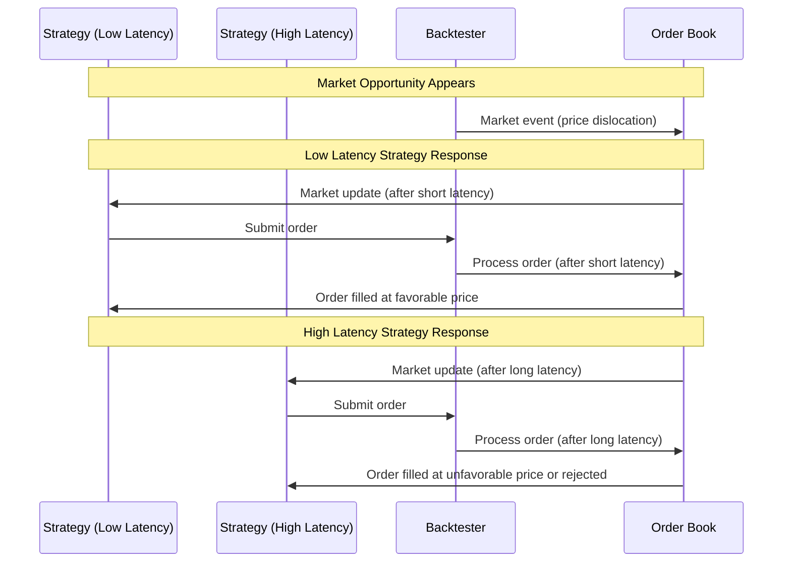

This example demonstrates how latency affects strategy performance:

1. A market opportunity (price dislocation) occurs
2. The low-latency strategy receives the market update quickly
3. It submits an order that reaches the exchange promptly
4. The order is filled at a favorable price
5. The high-latency strategy receives the market update later
6. It submits an order that reaches the exchange after further delay
7. By the time the order reaches the exchange, the opportunity has diminished
8. The order is filled at an unfavorable price or rejected

## Conclusion

HFTBacktest's event flow is designed to provide a realistic simulation environment for high-frequency trading strategies. By understanding this flow, developers can create more effective strategies that account for real-world factors like latency, queue position dynamics, and order book microstructure.

The framework's tick-by-tick simulation approach, combined with sophisticated latency and queue position models, enables accurate backtesting of strategies that operate at high frequencies and are sensitive to market microstructure effects.
