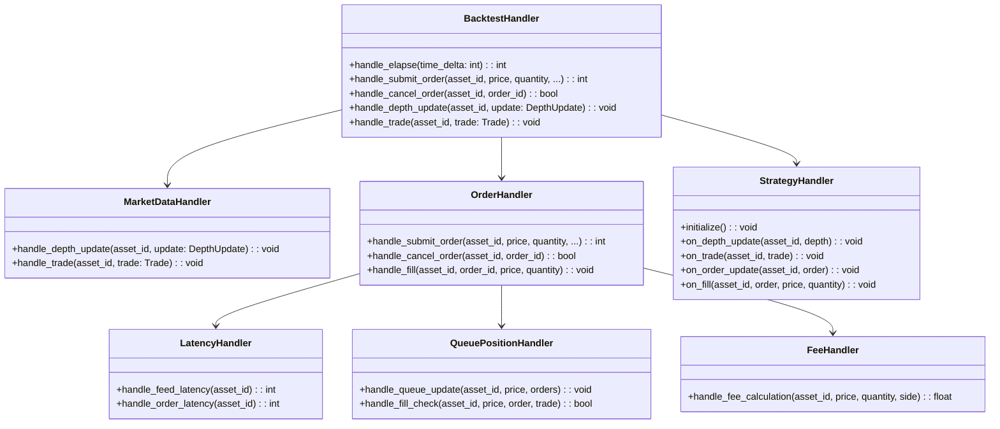
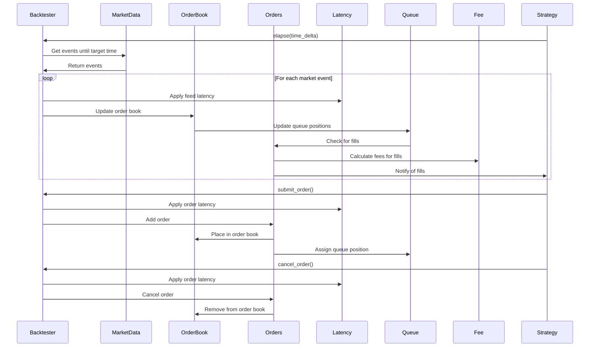

# HFTBacktest Handlers

This document details the various handlers in the HFTBacktest framework, their responsibilities, interfaces, and usage patterns. Understanding these handlers is crucial for effectively utilizing the framework for high-frequency trading strategy development and backtesting.

## Handler Architecture Overview

HFTBacktest uses a handler-based architecture to process events, manage state, and execute strategy logic. The framework's handlers can be categorized into several groups based on their responsibilities:



## Core Handler Interfaces

### 1. Backtester Handler

The `Backtester` is the central handler that coordinates all aspects of the simulation:

```python
class Backtester:
    def __init__(self, assets: List[BacktestAsset], collateral: float = 0.0):
        """
        Initialize the backtester with assets and collateral.
        
        Parameters:
            assets: List of assets to backtest
            collateral: Initial collateral amount
        """
        pass

    def elapse(self, time_delta: int) -> int:
        """
        Advance simulation time by time_delta nanoseconds.
        
        Parameters:
            time_delta: Time to advance in nanoseconds
            
        Returns:
            0 if simulation can continue, 1 if simulation has ended
        """
        pass
    
    def submit_buy_order(self, asset_id: int, order_id: int, price: float, quantity: float, 
                         time_in_force: int, order_type: int, post_only: bool) -> int:
        """
        Submit a buy order.
        
        Parameters:
            asset_id: ID of the asset
            order_id: ID of the order
            price: Order price
            quantity: Order quantity
            time_in_force: GTC, IOC, FOK, GTX
            order_type: LIMIT, MARKET
            post_only: Whether the order is post-only
            
        Returns:
            0 if successful, error code otherwise
        """
        pass
    
    def submit_sell_order(self, asset_id: int, order_id: int, price: float, quantity: float,
                          time_in_force: int, order_type: int, post_only: bool) -> int:
        """
        Submit a sell order.
        
        Parameters:
            asset_id: ID of the asset
            order_id: ID of the order
            price: Order price
            quantity: Order quantity
            time_in_force: GTC, IOC, FOK, GTX
            order_type: LIMIT, MARKET
            post_only: Whether the order is post-only
            
        Returns:
            0 if successful, error code otherwise
        """
        pass
    
    def cancel_order(self, asset_id: int, order_id: int) -> bool:
        """
        Cancel an order.
        
        Parameters:
            asset_id: ID of the asset
            order_id: ID of the order
            
        Returns:
            True if successful, False otherwise
        """
        pass
    
    def depth(self, asset_id: int, levels: int = 10) -> MarketDepth:
        """
        Get market depth for an asset.
        
        Parameters:
            asset_id: ID of the asset
            levels: Number of price levels to include
            
        Returns:
            MarketDepth object
        """
        pass
    
    def position(self, asset_id: int) -> Position:
        """
        Get position for an asset.
        
        Parameters:
            asset_id: ID of the asset
            
        Returns:
            Position object
        """
        pass
    
    def orders(self, asset_id: int) -> List[Order]:
        """
        Get all orders for an asset.
        
        Parameters:
            asset_id: ID of the asset
            
        Returns:
            List of Order objects
        """
        pass
    
    def order(self, asset_id: int, order_id: int) -> Order:
        """
        Get a specific order.
        
        Parameters:
            asset_id: ID of the asset
            order_id: ID of the order
            
        Returns:
            Order object
        """
        pass
```

### 2. Market Data Handler

The Market Data Handler processes market data events:

```python
class MarketDataHandler:
    def handle_depth_update(self, asset_id: int, update: DepthUpdate) -> None:
        """
        Handle a depth update event.
        
        Parameters:
            asset_id: ID of the asset
            update: DepthUpdate object containing bids and asks
        """
        pass
    
    def handle_trade(self, asset_id: int, trade: Trade) -> None:
        """
        Handle a trade event.
        
        Parameters:
            asset_id: ID of the asset
            trade: Trade object containing price, quantity, and timestamp
        """
        pass
```

### 3. Order Handler

The Order Handler processes order-related events:

```python
class OrderHandler:
    def handle_submit_order(self, asset_id: int, order_id: int, price: float, 
                            quantity: float, side: int, time_in_force: int, 
                            order_type: int, post_only: bool) -> int:
        """
        Handle an order submission.
        
        Parameters:
            asset_id: ID of the asset
            order_id: ID of the order
            price: Order price
            quantity: Order quantity
            side: BUY or SELL
            time_in_force: GTC, IOC, FOK, GTX
            order_type: LIMIT, MARKET
            post_only: Whether the order is post-only
            
        Returns:
            0 if successful, error code otherwise
        """
        pass
    
    def handle_cancel_order(self, asset_id: int, order_id: int) -> bool:
        """
        Handle an order cancellation.
        
        Parameters:
            asset_id: ID of the asset
            order_id: ID of the order
            
        Returns:
            True if successful, False otherwise
        """
        pass
    
    def handle_fill(self, asset_id: int, order_id: int, price: float, quantity: float) -> None:
        """
        Handle an order fill.
        
        Parameters:
            asset_id: ID of the asset
            order_id: ID of the order
            price: Fill price
            quantity: Fill quantity
        """
        pass
```

### 4. Latency Handler

The Latency Handler models feed and order latency:

```python
class LatencyHandler:
    def handle_feed_latency(self, asset_id: int) -> int:
        """
        Calculate feed latency for an asset.
        
        Parameters:
            asset_id: ID of the asset
            
        Returns:
            Latency in nanoseconds
        """
        pass
    
    def handle_order_latency(self, asset_id: int) -> int:
        """
        Calculate order latency for an asset.
        
        Parameters:
            asset_id: ID of the asset
            
        Returns:
            Latency in nanoseconds
        """
        pass
```

### 5. Queue Position Handler

The Queue Position Handler models order queue positions:

```python
class QueuePositionHandler:
    def handle_queue_update(self, asset_id: int, price: float, orders: List[Order]) -> None:
        """
        Update queue positions for orders at a price level.
        
        Parameters:
            asset_id: ID of the asset
            price: Price level
            orders: List of orders at the price level
        """
        pass
    
    def handle_fill_check(self, asset_id: int, price: float, 
                          order: Order, trade: Trade) -> bool:
        """
        Check if an order should be filled based on a trade.
        
        Parameters:
            asset_id: ID of the asset
            price: Price level
            order: Order to check
            trade: Trade that occurred
            
        Returns:
            True if the order should be filled, False otherwise
        """
        pass
```

### 6. Fee Handler

The Fee Handler calculates trading fees:

```python
class FeeHandler:
    def handle_fee_calculation(self, asset_id: int, price: float, 
                               quantity: float, side: int) -> float:
        """
        Calculate fee for a trade.
        
        Parameters:
            asset_id: ID of the asset
            price: Trade price
            quantity: Trade quantity
            side: BUY or SELL
            
        Returns:
            Fee amount
        """
        pass
```

### 7. Strategy Handler

The Strategy Handler implements trading strategy logic:

```python
class StrategyHandler:
    def initialize(self) -> None:
        """
        Initialize the strategy.
        """
        pass
    
    def on_depth_update(self, asset_id: int, depth: MarketDepth) -> None:
        """
        Handle a depth update event.
        
        Parameters:
            asset_id: ID of the asset
            depth: MarketDepth object
        """
        pass
    
    def on_trade(self, asset_id: int, trade: Trade) -> None:
        """
        Handle a trade event.
        
        Parameters:
            asset_id: ID of the asset
            trade: Trade object
        """
        pass
    
    def on_order_update(self, asset_id: int, order: Order) -> None:
        """
        Handle an order update event.
        
        Parameters:
            asset_id: ID of the asset
            order: Order object
        """
        pass
    
    def on_fill(self, asset_id: int, order: Order, price: float, quantity: float) -> None:
        """
        Handle an order fill event.
        
        Parameters:
            asset_id: ID of the asset
            order: Order object
            price: Fill price
            quantity: Fill quantity
        """
        pass
```

## Handler Implementation Details

### 1. Market Data Handler Implementation

HFTBacktest provides multiple implementations of the Market Data Handler interface:

#### a. Historical Data Handler

Processes market data from historical files:

```python
class HistoricalDataHandler(MarketDataHandler):
    def __init__(self, depth_file: str, trade_file: str):
        """
        Initialize with depth and trade data files.
        
        Parameters:
            depth_file: Path to depth updates file
            trade_file: Path to trades file
        """
        pass
```

#### b. Replay Data Handler

Replays market data at the original or modified speed:

```python
class ReplayDataHandler(MarketDataHandler):
    def __init__(self, depth_file: str, trade_file: str, speed_factor: float = 1.0):
        """
        Initialize with depth and trade data files and replay speed.
        
        Parameters:
            depth_file: Path to depth updates file
            trade_file: Path to trades file
            speed_factor: Replay speed factor (1.0 = original speed)
        """
        pass
```

#### c. Live Data Handler

Processes live market data in real-time (typically used in live trading mode):

```python
class LiveDataHandler(MarketDataHandler):
    def __init__(self, market_data_source):
        """
        Initialize with a market data source.
        
        Parameters:
            market_data_source: Source of market data
        """
        pass
```

### 2. Order Handler Implementation

HFTBacktest provides multiple implementations of the Order Handler interface:

#### a. Simulation Order Handler

Simulates order processing in a backtesting environment:

```python
class SimulationOrderHandler(OrderHandler):
    def __init__(self, latency_model: LatencyHandler, 
                 queue_model: QueuePositionHandler,
                 fee_model: FeeHandler):
        """
        Initialize with models for latency, queue position, and fees.
        
        Parameters:
            latency_model: Latency model to use
            queue_model: Queue position model to use
            fee_model: Fee model to use
        """
        pass
```

#### b. Exchange Order Handler

Interfaces with a real exchange in live trading mode:

```python
class ExchangeOrderHandler(OrderHandler):
    def __init__(self, exchange_api):
        """
        Initialize with an exchange API.
        
        Parameters:
            exchange_api: Exchange API to use
        """
        pass
```

### 3. Latency Handler Implementation

HFTBacktest provides multiple implementations of the Latency Handler interface:

#### a. Constant Latency Handler

Applies a constant latency to all events:

```python
class ConstantLatencyHandler(LatencyHandler):
    def __init__(self, feed_latency: int, order_latency: int):
        """
        Initialize with constant feed and order latencies.
        
        Parameters:
            feed_latency: Feed latency in nanoseconds
            order_latency: Order latency in nanoseconds
        """
        pass
```

#### b. Distribution Latency Handler

Samples latency from a statistical distribution:

```python
class DistributionLatencyHandler(LatencyHandler):
    def __init__(self, feed_latency_distribution, order_latency_distribution):
        """
        Initialize with distributions for feed and order latencies.
        
        Parameters:
            feed_latency_distribution: Distribution for feed latency
            order_latency_distribution: Distribution for order latency
        """
        pass
```

#### c. Historical Latency Handler

Uses historical latency data:

```python
class HistoricalLatencyHandler(LatencyHandler):
    def __init__(self, feed_latency_file: str, order_latency_file: str):
        """
        Initialize with historical feed and order latency files.
        
        Parameters:
            feed_latency_file: Path to feed latency file
            order_latency_file: Path to order latency file
        """
        pass
```

### 4. Queue Position Handler Implementation

HFTBacktest provides multiple implementations of the Queue Position Handler interface:

#### a. Risk-Averse Queue Handler

Implements a conservative queue position model:

```python
class RiskAverseQueueHandler(QueuePositionHandler):
    def __init__(self):
        """
        Initialize the risk-averse queue position handler.
        """
        pass
```

#### b. Probabilistic Queue Handler

Implements a probabilistic queue position model:

```python
class ProbabilisticQueueHandler(QueuePositionHandler):
    def __init__(self, probability_model):
        """
        Initialize with a probability model.
        
        Parameters:
            probability_model: Model for fill probability
        """
        pass
```

### 5. Fee Handler Implementation

HFTBacktest provides multiple implementations of the Fee Handler interface:

#### a. Fixed Fee Handler

Applies a fixed fee to all trades:

```python
class FixedFeeHandler(FeeHandler):
    def __init__(self, maker_fee: float, taker_fee: float):
        """
        Initialize with maker and taker fees.
        
        Parameters:
            maker_fee: Fee for maker orders
            taker_fee: Fee for taker orders
        """
        pass
```

#### b. Tiered Fee Handler

Applies fees based on volume tiers:

```python
class TieredFeeHandler(FeeHandler):
    def __init__(self, tier_volumes: List[float], tier_maker_fees: List[float], 
                 tier_taker_fees: List[float]):
        """
        Initialize with volume tiers and corresponding fees.
        
        Parameters:
            tier_volumes: Volume thresholds for tiers
            tier_maker_fees: Maker fees for each tier
            tier_taker_fees: Taker fees for each tier
        """
        pass
```

## Handler Interaction Patterns

### 1. Event Processing Flow



### 2. Handler Error Handling

Each handler implements error handling to handle exceptional conditions:

```python
def handle_submit_order(self, asset_id, order_id, price, quantity, side, 
                        time_in_force, order_type, post_only):
    try:
        # Validate inputs
        if price <= 0 or quantity <= 0:
            return ERROR_INVALID_PARAMETERS
        
        # Check collateral
        if not self.check_collateral(asset_id, price, quantity, side):
            return ERROR_INSUFFICIENT_COLLATERAL
        
        # Process order
        # ...
        
        return 0  # Success
    except Exception as e:
        log_error(f"Error submitting order: {e}")
        return ERROR_INTERNAL
```

### 3. Handler State Management

Handlers maintain state relevant to their responsibilities:

```python
class OrderHandler:
    def __init__(self):
        # Order state
        self.orders = {}  # order_id -> Order
        self.active_orders = {}  # (asset_id, price) -> List[Order]
        self.pending_orders = {}  # order_id -> Order
        self.order_history = {}  # order_id -> Order
        
    def handle_submit_order(self, asset_id, order_id, price, quantity, side, 
                           time_in_force, order_type, post_only):
        # Create order
        order = Order(
            asset_id=asset_id,
            order_id=order_id,
            price=price,
            quantity=quantity,
            side=side,
            time_in_force=time_in_force,
            order_type=order_type,
            post_only=post_only,
            status=ORDER_STATUS_PENDING,
            submit_time=self.current_time
        )
        
        # Add to pending orders
        self.pending_orders[order_id] = order
        
        # Calculate latency
        latency = self.latency_handler.handle_order_latency(asset_id)
        
        # Schedule order acceptance
        self.event_queue.add_event(
            self.current_time + latency,
            lambda: self.handle_order_accept(asset_id, order_id)
        )
        
        return 0  # Success
```

## Handler Interface Examples

### 1. Strategy Handler Interface

The Strategy Handler interface is implemented by user-defined strategies:

```python
@njit
def strategy(hbt):
    # Initialize variables
    asset_no = 0
    spread = 0.0
    
    # Run for 1 hour
    while hbt.elapse(3600 * 1e9) == 0:  # 1 hour in nanoseconds
        # Clear inactive orders
        hbt.clear_inactive_orders(asset_no)
        
        # Get market depth
        depth = hbt.depth(asset_no)
        
        # Calculate spread
        spread = depth.best_ask - depth.best_bid
        
        # Get position
        position = hbt.position(asset_no)
        
        # Implement strategy logic
        if position.qty == 0:
            # No position, place new orders
            hbt.submit_buy_order(asset_no, 1, depth.best_bid, 1.0, GTC, LIMIT, False)
            hbt.submit_sell_order(asset_no, 2, depth.best_ask, 1.0, GTC, LIMIT, False)
        elif position.qty > 0:
            # Long position, place sell order
            hbt.submit_sell_order(asset_no, 3, depth.best_ask, position.qty, GTC, LIMIT, False)
        elif position.qty < 0:
            # Short position, place buy order
            hbt.submit_buy_order(asset_no, 4, depth.best_bid, -position.qty, GTC, LIMIT, False)
```

### 2. Custom Queue Position Handler

Users can implement custom queue position handlers:

```python
class CustomQueueHandler(QueuePositionHandler):
    def __init__(self, sensitivity: float):
        """
        Initialize with a queue position sensitivity parameter.
        
        Parameters:
            sensitivity: Queue position sensitivity (0.0-1.0)
        """
        self.sensitivity = sensitivity
    
    def handle_queue_update(self, asset_id, price, orders):
        """
        Update queue positions based on the custom model.
        """
        # Implement custom queue position update logic
        # ...
    
    def handle_fill_check(self, asset_id, price, order, trade):
        """
        Check if an order should be filled based on the custom model.
        """
        # Calculate queue position-based fill probability
        position_ratio = order.queue_position / len(self.price_queues[asset_id][price])
        fill_probability = (1.0 - position_ratio) ** self.sensitivity
        
        # Generate random number
        random_value = random.random()
        
        # Determine if order should be filled
        return random_value < fill_probability
```

### 3. Custom Latency Handler

Users can implement custom latency handlers:

```python
class NetworkLatencyHandler(LatencyHandler):
    def __init__(self, base_latency: int, jitter: int, packet_loss_rate: float):
        """
        Initialize with network latency parameters.
        
        Parameters:
            base_latency: Base latency in nanoseconds
            jitter: Maximum jitter in nanoseconds
            packet_loss_rate: Probability of packet loss (0.0-1.0)
        """
        self.base_latency = base_latency
        self.jitter = jitter
        self.packet_loss_rate = packet_loss_rate
    
    def handle_feed_latency(self, asset_id):
        """
        Calculate feed latency based on the network model.
        """
        # Check for packet loss
        if random.random() < self.packet_loss_rate:
            # Simulate packet loss with very high latency
            return self.base_latency * 10
        
        # Calculate latency with jitter
        jitter_value = random.randint(-self.jitter, self.jitter)
        return max(0, self.base_latency + jitter_value)
    
    def handle_order_latency(self, asset_id):
        """
        Calculate order latency based on the network model.
        """
        # Check for packet loss
        if random.random() < self.packet_loss_rate:
            # Simulate packet loss with very high latency
            return self.base_latency * 10
        
        # Calculate latency with jitter
        jitter_value = random.randint(-self.jitter, self.jitter)
        return max(0, self.base_latency + jitter_value)
```

## Handler Performance Considerations

### 1. Optimizing Handler Performance

HFTBacktest handlers are optimized for performance using several techniques:

- **Numba JIT Compilation**: Handlers that run in the critical path are compiled using Numba's just-in-time compilation
- **Efficient Data Structures**: Handlers use efficient data structures for state management
- **Pre-allocation**: Memory is pre-allocated to minimize allocations during simulation
- **Batched Processing**: Events are processed in batches where possible
- **Lock-Free Algorithms**: Handlers use lock-free algorithms for concurrent operations

Example of a Numba-optimized handler:

```python
@njit
class JitOrderHandler:
    def __init__(self):
        # Pre-allocate arrays
        self.order_ids = np.zeros(MAX_ORDERS, dtype=np.int64)
        self.order_prices = np.zeros(MAX_ORDERS, dtype=np.float64)
        self.order_quantities = np.zeros(MAX_ORDERS, dtype=np.float64)
        self.order_sides = np.zeros(MAX_ORDERS, dtype=np.int64)
        self.order_statuses = np.zeros(MAX_ORDERS, dtype=np.int64)
        self.order_count = 0
    
    def handle_submit_order(self, asset_id, order_id, price, quantity, side, 
                           time_in_force, order_type, post_only):
        # Add order to arrays
        idx = self.order_count
        self.order_ids[idx] = order_id
        self.order_prices[idx] = price
        self.order_quantities[idx] = quantity
        self.order_sides[idx] = side
        self.order_statuses[idx] = ORDER_STATUS_PENDING
        self.order_count += 1
        
        return 0  # Success
```

### 2. Handler Profiling

HFTBacktest includes tools for profiling handler performance:

```python
def run_with_profiling(strategy_func, assets, duration, profile_output="profile.txt"):
    """
    Run a strategy with profiling.
    
    Parameters:
        strategy_func: Strategy function
        assets: Assets to simulate
        duration: Simulation duration in nanoseconds
        profile_output: Output file for profiling results
    """
    backtester = Backtester(assets)
    
    # Start profiling
    import cProfile
    import pstats
    
    profiler = cProfile.Profile()
    profiler.enable()
    
    # Run strategy
    strategy_func(backtester)
    
    # Stop profiling
    profiler.disable()
    
    # Write profiling results
    with open(profile_output, "w") as f:
        stats = pstats.Stats(profiler, stream=f).sort_stats("cumtime")
        stats.print_stats()
```

## Handler Edge Cases

### 1. Zero Quantity Orders

Handlers must correctly handle edge cases like zero quantity orders:

```python
def handle_submit_order(self, asset_id, order_id, price, quantity, side, 
                        time_in_force, order_type, post_only):
    # Validate quantity
    if quantity <= 0:
        return ERROR_INVALID_QUANTITY
    
    # Process order
    # ...
```

### 2. Self-Trading

Handlers must prevent self-trading (when a strategy's buy and sell orders match):

```python
def handle_match_orders(self, asset_id, price):
    # Get buy and sell orders at this price
    buy_orders = self.buy_orders[asset_id].get(price, [])
    sell_orders = self.sell_orders[asset_id].get(price, [])
    
    # Match orders
    for buy_order in buy_orders:
        for sell_order in sell_orders:
            # Check for self-trading
            if buy_order.strategy_id == sell_order.strategy_id:
                continue
            
            # Match orders
            # ...
```

### 3. Invalid Order Cancellation

Handlers must correctly handle invalid order cancellations:

```python
def handle_cancel_order(self, asset_id, order_id):
    # Check if order exists
    if order_id not in self.orders:
        return False
    
    # Check if order is already inactive
    order = self.orders[order_id]
    if order.status != ORDER_STATUS_ACTIVE:
        return False
    
    # Process cancellation
    # ...
    
    return True
```

## Handler Testing Strategies

### 1. Unit Testing Handlers

Handlers can be unit tested in isolation:

```python
def test_order_handler():
    # Create handler
    handler = OrderHandler()
    
    # Test order submission
    result = handler.handle_submit_order(0, 1, 100.0, 1.0, BUY, GTC, LIMIT, False)
    assert result == 0
    
    # Test order cancellation
    result = handler.handle_cancel_order(0, 1)
    assert result == True
    
    # Test invalid order cancellation
    result = handler.handle_cancel_order(0, 999)
    assert result == False
```

### 2. Integration Testing Handler Interactions

Handler interactions can be tested in integration tests:

```python
def test_order_execution():
    # Create backtester with handlers
    backtester = Backtester([BacktestAsset(0)])
    
    # Submit order
    backtester.submit_buy_order(0, 1, 100.0, 1.0, GTC, LIMIT, False)
    
    # Process events
    backtester.elapse(1_000_000)
    
    # Check order status
    order = backtester.order(0, 1)
    assert order.status == ORDER_STATUS_ACTIVE
    
    # Update market
    backtester.handle_depth_update(0, DepthUpdate(
        timestamp=backtester.current_time,
        bids=[[100.0, 1.0]],
        asks=[[100.0, 1.0]]
    ))
    
    # Process events
    backtester.elapse(1_000_000)
    
    # Check order execution
    order = backtester.order(0, 1)
    assert order.status == ORDER_STATUS_FILLED
    
    # Check position
    position = backtester.position(0)
    assert position.qty == 1.0
```

## Conclusion

HFTBacktest provides a comprehensive set of handlers that enable the accurate simulation of high-frequency trading strategies. By understanding these handlers and their interactions, users can:

1. Develop and test sophisticated trading strategies
2. Customize behavior through custom handler implementations
3. Optimize performance for high-frequency applications
4. Handle edge cases and error conditions
5. Implement realistic market models

The handler-based architecture of HFTBacktest provides the flexibility and extensibility needed for advanced trading strategy development while maintaining the performance required for high-frequency trading simulations.
