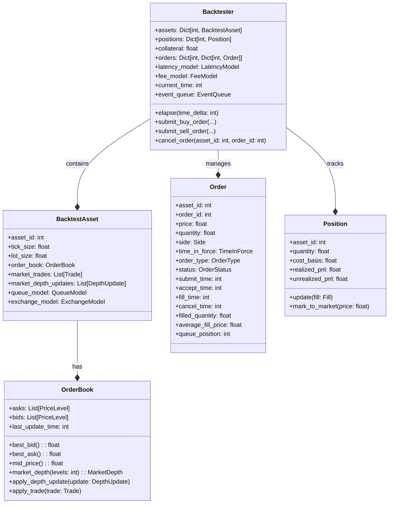
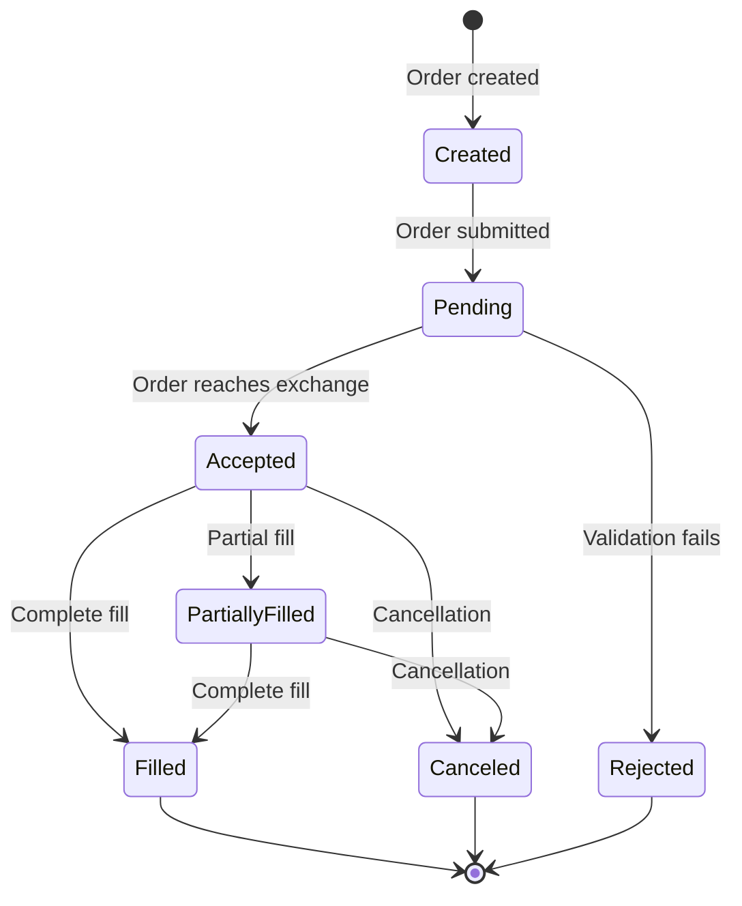
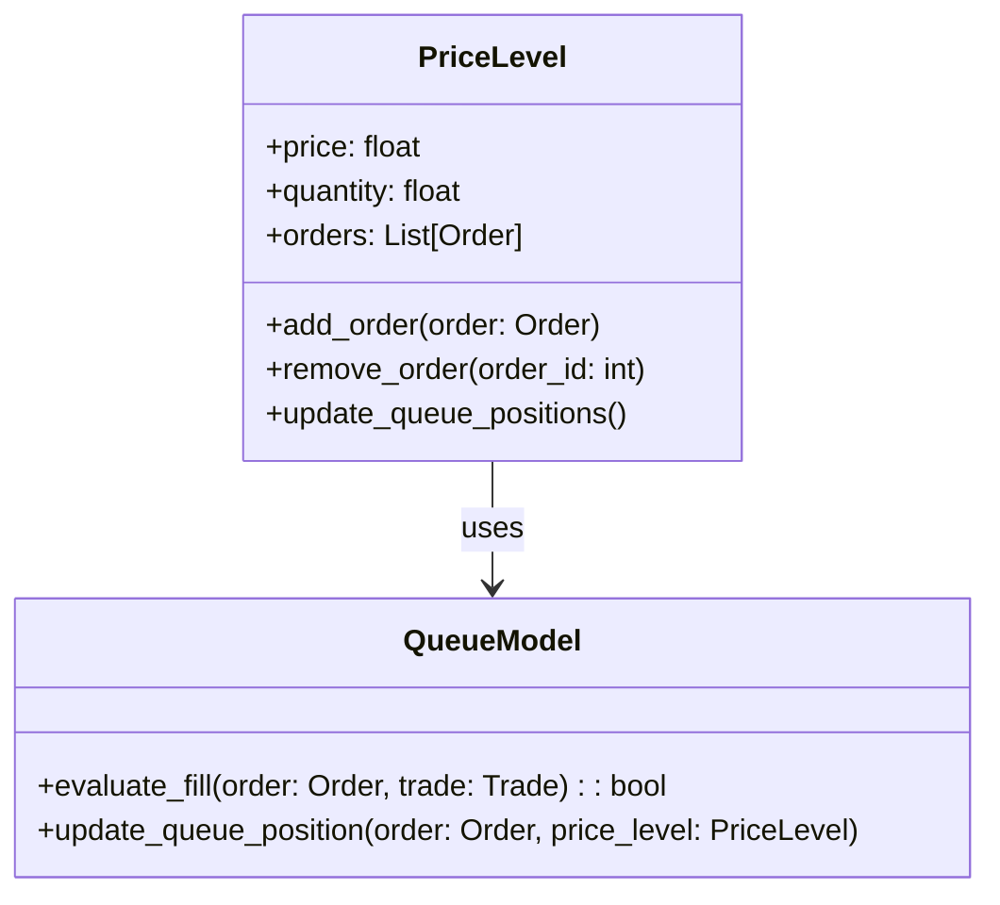
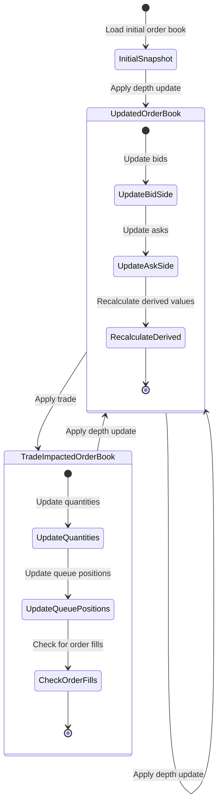
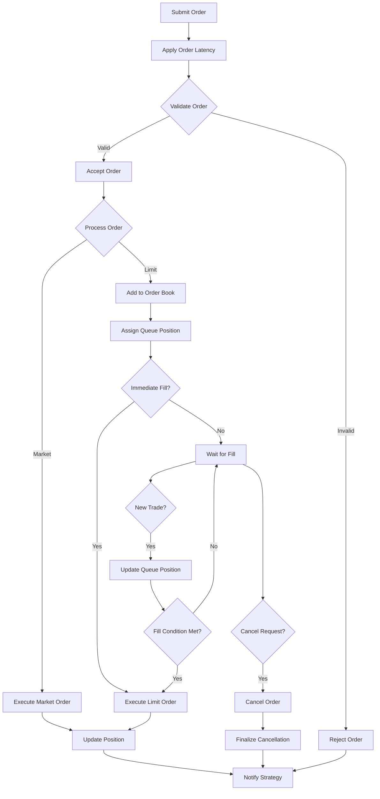
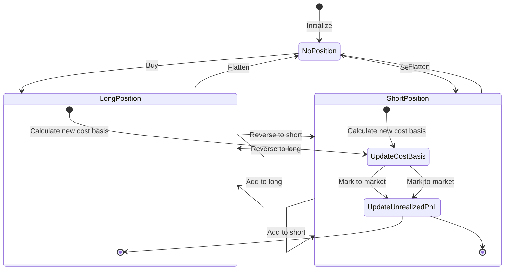

# HFTBacktest State Management

This document details the state management approach used in the HFTBacktest framework, focusing on how different states are represented, maintained, and transitioned during the simulation process.

## State Model Overview

HFTBacktest maintains several key state objects throughout a simulation, which are essential for accurately modeling high-frequency trading environments:



## State Components

### 1. Backtester State

The central state container in HFTBacktest is the `Backtester` object, which maintains:

- **Current simulation time**: An integer representing nanoseconds from epoch
- **Assets**: Collection of assets being simulated, each with its own state
- **Positions**: Current positions for each asset
- **Orders**: Active, pending, and historical orders
- **Collateral**: Available funds for trading
- **Event queue**: Queue of events to be processed in chronological order

The backtester state is the primary interface for strategies to interact with the simulation.

### 2. Market State

Market state is maintained in the `OrderBook` object for each asset:

- **Order book**: Bids and asks at each price level, with quantity information
- **Best bid/ask**: The current top of the book prices
- **Last update time**: When the order book was last updated
- **Last trade**: Information about the most recent trade

Market state changes are driven by:
- Depth updates from the market data feed
- Trades from the market data feed
- Order submissions, cancellations, and fills from the strategy

### 3. Order State

Each order in the system has its own state, represented by the `Order` object:



Order states include:

- **Created**: Order is created by the strategy but not yet submitted
- **Pending**: Order is submitted and subject to latency
- **Accepted**: Order is accepted by the exchange and placed in the order book
- **Partially Filled**: Order is partially filled
- **Filled**: Order is completely filled
- **Canceled**: Order is canceled
- **Rejected**: Order is rejected

Order state transitions occur based on:
- Strategy actions (submit, cancel)
- Market conditions (fills)
- Validation rules (rejections)

### 4. Position State

Position state is maintained for each asset and includes:

- **Quantity**: Current position size (positive for long, negative for short)
- **Cost basis**: Average entry price of the position
- **Realized P&L**: Profit or loss from closed trades
- **Unrealized P&L**: Profit or loss on current open position

Position state is updated when:
- Orders are filled (changing the position size)
- Mark-to-market calculations are performed (updating unrealized P&L)

### 5. Queue Position State

A critical aspect of HFTBacktest is the modeling of queue positions for orders at each price level:



Queue state includes:
- Order position in the queue at each price level
- Queue advancement based on trades and other market activity
- Fill probability based on queue position

Queue state is managed by the queue model, which implements different approaches to queue position modeling:
- Risk-averse model (most conservative)
- Probabilistic model (based on statistical distributions)
- Custom models (user-defined behavior)

## State Transitions

### 1. Market State Transitions



Market state transitions include:
1. Loading the initial order book snapshot
2. Applying depth updates, which modify price levels and quantities
3. Applying trades, which affect quantities and queue positions
4. Recalculating derived values (mid-price, market depth, etc.)

### 2. Order State Transitions



Order state transitions include:
1. Order submission (creating an order)
2. Order latency application (delaying order processing)
3. Order validation (checking for valid parameters)
4. Order acceptance (adding to the order book)
5. Queue position assignment (determining execution priority)
6. Order execution (filling the order)
7. Order cancellation (removing from the order book)

### 3. Position State Transitions



Position state transitions include:
1. Opening a position (from no position to long or short)
2. Adding to a position (increasing long or short)
3. Reducing a position (decreasing long or short)
4. Flattening a position (returning to no position)
5. Reversing a position (from long to short or vice versa)

Each transition involves:
- Updating the position quantity
- Recalculating the cost basis
- Computing realized P&L for closed portions
- Marking to market for unrealized P&L

## State Persistence

HFTBacktest primarily maintains state in memory during simulation. However, it provides mechanisms for state persistence:

### 1. Checkpointing

The framework allows for state checkpointing, which captures the complete state of the simulation at a point in time. This is useful for:
- Resuming simulations from specific points
- Analyzing specific market conditions
- Debugging strategy behavior

Checkpoints include:
- Full order book state
- All active orders
- Current positions
- Available collateral
- Queue positions

### 2. State Serialization

State can be serialized to JSON for:
- Storage and later analysis
- Sharing simulation states
- Comparing different strategy behaviors

Serialized state includes:
- Order book snapshots
- Order history
- Position history
- P&L history
- Performance metrics

### 3. Post-Simulation Analysis

After a simulation completes, the final state is available for analysis:
- Performance metrics calculation
- Trade analysis
- Position history review
- Order execution analysis

## State Access and Manipulation

Strategies interact with HFTBacktest state through a well-defined API:

### 1. State Observation

```python
# Get current order book state
depth = backtester.depth(asset_id, levels)

# Get current position
position = backtester.position(asset_id)

# Get order information
order = backtester.order(asset_id, order_id)

# Get all orders for an asset
orders = backtester.orders(asset_id)

# Get performance metrics
metrics = backtester.metrics()
```

### 2. State Modification

```python
# Advance simulation time
continue_simulation = backtester.elapse(time_delta)

# Submit orders
order_id = backtester.submit_buy_order(
    asset_id,
    price,
    quantity,
    time_in_force,
    order_type,
    post_only
)

order_id = backtester.submit_sell_order(
    asset_id,
    price,
    quantity,
    time_in_force,
    order_type,
    post_only
)

# Cancel orders
success = backtester.cancel_order(asset_id, order_id)
```

## Thread Safety and Concurrency

HFTBacktest's state management is designed with specific threading considerations:

### 1. Single-Threaded Core

The core simulation engine operates in a single thread for deterministic behavior. This ensures:
- Reproducible results
- Deterministic event processing
- Consistent state transitions

### 2. Parallel Processing Options

For data-intensive operations, HFTBacktest offers parallel processing options:
- Parallel market data preprocessing
- Parallel performance metric calculation
- Multiple independent simulations for parameter sweeps

### 3. Lock-Free State Management

The framework uses lock-free data structures to avoid contention issues:
- Lock-free order book implementation
- Efficient event queue
- Optimized data structures for state representation

## Recovery Procedures

HFTBacktest provides mechanisms for handling exceptional conditions and recovering state:

### 1. Data Irregularity Handling

When market data contains irregularities (gaps, anomalies), the framework:
- Detects and logs the issue
- Applies heuristics to infer missing state
- Continues simulation with best-effort state reconstruction

### 2. Simulation Reset

The simulation can be reset to a clean or specific state:
- Full reset to initial conditions
- Reset to a saved checkpoint
- Partial reset of specific components (e.g., order book only)

### 3. Error Recovery

When errors occur during simulation, the framework tries to:
- Preserve the current state
- Log detailed error information
- Provide options for recovering or restarting the simulation

## State Management Examples

### Example 1: Order Book State Management

```python
# Initialize order book from a snapshot
order_book = OrderBook(
    bids=[
        [100.0, 10.0],  # price, quantity
        [99.5, 20.0],
        [99.0, 30.0],
    ],
    asks=[
        [101.0, 15.0],
        [101.5, 25.0],
        [102.0, 35.0],
    ]
)

# Apply a depth update
depth_update = DepthUpdate(
    timestamp=123456789,
    bids=[
        [100.0, 15.0],  # Updated quantity
        [99.75, 5.0],   # New price level
    ],
    asks=[
        [101.0, 0.0],   # Remove price level
        [101.25, 10.0], # New price level
    ]
)
order_book.apply_depth_update(depth_update)

# Apply a trade
trade = Trade(
    timestamp=123456790,
    price=100.0,
    quantity=5.0,
    is_buyer_maker=False
)
order_book.apply_trade(trade)

# Get market depth
depth = order_book.market_depth(5)
```

This example shows:
1. Order book initialization from a snapshot
2. Applying a depth update to modify price levels
3. Applying a trade that affects quantities and queue positions
4. Retrieving the current market depth

### Example 2: Order State Management

```python
# Submit a buy order
order_id = backtester.submit_buy_order(
    asset_id=0,
    price=100.0,
    quantity=1.0,
    time_in_force=TimeInForce.GTC,
    order_type=OrderType.LIMIT,
    post_only=False
)

# Advance time to allow order processing
backtester.elapse(1_000_000)  # 1 millisecond

# Check order status
order = backtester.order(0, order_id)
if order.status == OrderStatus.ACCEPTED:
    # Order is active in the book
    print(f"Order active at queue position {order.queue_position}")
elif order.status == OrderStatus.FILLED:
    # Order was filled
    print(f"Order filled at {order.average_fill_price}")
    
# Cancel the order if still active
if order.status == OrderStatus.ACCEPTED:
    backtester.cancel_order(0, order_id)
    
    # Advance time to allow cancellation processing
    backtester.elapse(1_000_000)  # 1 millisecond
    
    # Check updated status
    order = backtester.order(0, order_id)
    if order.status == OrderStatus.CANCELED:
        print("Order successfully canceled")
```

This example shows:
1. Submitting an order and getting its ID
2. Advancing simulation time to allow order processing
3. Checking the order status after processing
4. Canceling the order if it's still active
5. Verifying the cancellation was successful

### Example 3: Position State Management

```python
# Check initial position
position = backtester.position(0)
print(f"Initial position: {position.quantity} @ {position.cost_basis}")

# Submit and fill a buy order
buy_order_id = backtester.submit_buy_order(
    asset_id=0,
    price=100.0,
    quantity=1.0,
    time_in_force=TimeInForce.IOC,  # Immediate-or-Cancel
    order_type=OrderType.LIMIT,
    post_only=False
)

# Advance time to allow order processing
backtester.elapse(1_000_000)  # 1 millisecond

# Check updated position
position = backtester.position(0)
print(f"Position after buy: {position.quantity} @ {position.cost_basis}")

# Submit and fill a sell order
sell_order_id = backtester.submit_sell_order(
    asset_id=0,
    price=101.0,
    quantity=1.0,
    time_in_force=TimeInForce.IOC,  # Immediate-or-Cancel
    order_type=OrderType.LIMIT,
    post_only=False
)

# Advance time to allow order processing
backtester.elapse(1_000_000)  # 1 millisecond

# Check final position and P&L
position = backtester.position(0)
print(f"Position after sell: {position.quantity}")
print(f"Realized P&L: {position.realized_pnl}")
```

This example shows:
1. Checking the initial position
2. Submitting and filling a buy order
3. Checking the updated position
4. Submitting and filling a sell order
5. Checking the final position and realized P&L

## Conclusion

HFTBacktest provides a comprehensive state management system designed specifically for high-frequency trading simulation. The framework:

1. Maintains accurate representations of market state, order state, and position state
2. Supports realistic state transitions driven by market data and strategy actions
3. Models critical HFT factors like order latency and queue position
4. Provides clean APIs for state observation and modification
5. Enables advanced analysis of simulation results

By understanding this state management approach, developers can create more effective high-frequency trading strategies and accurately simulate their behavior in realistic market conditions.
