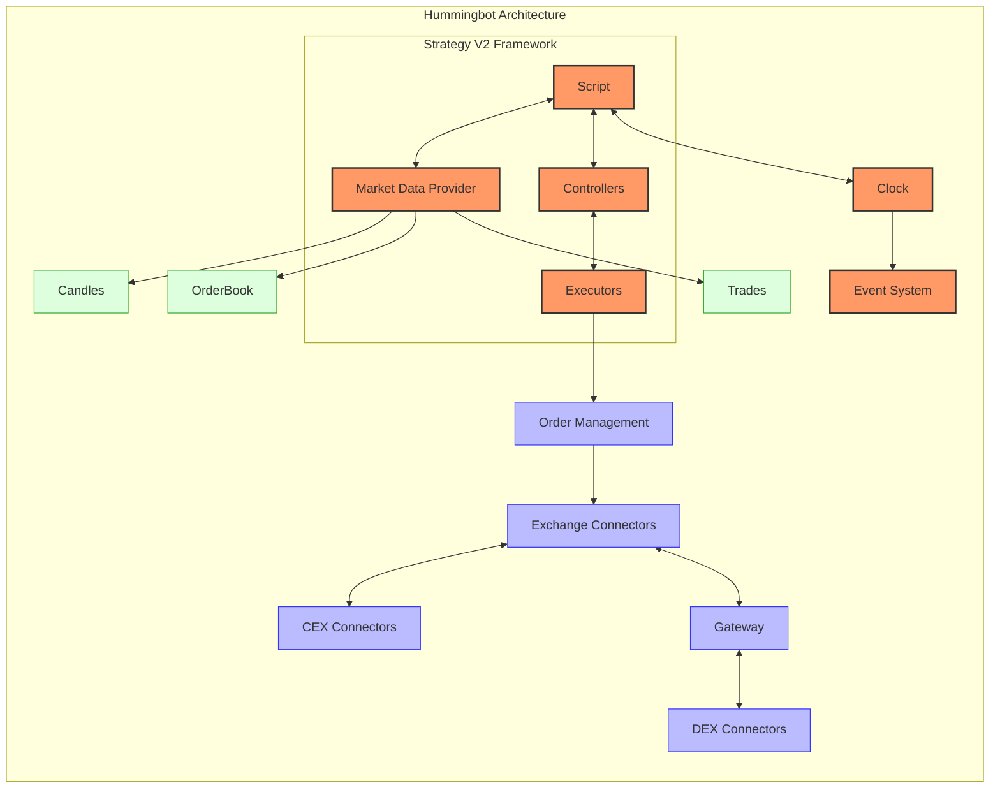

# Hummingbot Trading System

## Overview

Hummingbot is an open-source, community-driven Python framework designed for building automated market making and algorithmic trading bots. Maintained by the Hummingbot Foundation, it provides a modular and extensible architecture that enables users to automate any trading strategy across various exchanges and blockchains.

The system is particularly well-suited for cryptocurrency trading, with extensive support for both centralized exchanges (CEX) and decentralized exchanges (DEX). Hummingbot's component-based design allows traders to implement various strategies using its standardized connectors and strategy framework.

Unlike many trading systems that are either purely event-driven or vector-based, Hummingbot employs a hybrid approach with a strong focus on real-time event processing for live trading, while also offering script-based strategy implementations that can be more declarative in nature.

## Architecture Diagram



## Key Components

### 1. Script

The script is the entry point for all Hummingbot strategies. It defines the overall strategy logic and coordinates all other components:

- Initializes connectors, controllers, and executors
- Manages the strategy lifecycle
- Processes tick events from the clock
- Handles user configuration and parameters

### 2. Controllers

Controllers are responsible for the strategy's decision-making logic:

- Process market data to generate trading signals
- Create actions for executors to implement
- Implement trading algorithms (like trend following, market making, etc.)
- Make high-level decisions about position management

Hummingbot offers several types of controllers:
- **Directional Trading Controllers**: Implement trend-following and indicator-based strategies
- **Market Making Controllers**: Implement two-sided liquidity provision strategies
- **Generic Controllers**: Implement other strategy types like arbitrage or grid trading

### 3. Executors

Executors are self-managing components responsible for carrying out trading actions:

- Manage the lifecycle of orders (creation, tracking, cancellation)
- Implement specific execution algorithms (e.g., DCA, TWAP, position management)
- Monitor fills and handle partial executions
- Report execution status back to controllers

Common executor types include:
- **Position Executors**: Handle single position entries and exits
- **DCA Executors**: Implement dollar-cost averaging strategies
- **Arbitrage Executors**: Execute arbitrage opportunities across venues
- **TWAP Executors**: Implement time-weighted average price algorithms

### 4. Market Data Provider

The Market Data Provider is responsible for acquiring and managing market data:

- Retrieves and normalizes price data from exchanges
- Manages order book data
- Provides candle (OHLCV) data for technical analysis
- Tracks trades and market activity

### 5. Clock and Event System

The clock coordinates the timing of the entire system:

- Drives the main event loop via tick events
- Synchronizes all components
- Manages real-time and backtesting modes
- Distributes events through the event system

### 6. Connectors

Connectors provide standardized interfaces to different exchanges and protocols:

- **CLOB Connectors**: Connect to central limit order book exchanges
- **AMM Connectors**: Connect to automated market maker protocols
- **Gateway**: Middleware that provides connections to DEX platforms

### 7. Gateway

Gateway is a companion middleware service for connecting to blockchains and DeFi protocols:

- Manages blockchain connections and wallet interactions
- Provides unified interfaces to DEX platforms
- Handles blockchain transactions and gas management
- Enables cross-chain trading capabilities

## Supported Markets and Instruments

Hummingbot provides extensive support for cryptocurrency markets with more limited support for traditional markets:

| Market/Instrument | Support Level | Notes |
|-------------------|---------------|-------|
| Cryptocurrencies (Spot) | Excellent | Primary focus with 30+ CEX connectors |
| Cryptocurrency Derivatives | Good | Support for perpetual futures on major exchanges |
| Decentralized Exchanges | Excellent | 10+ DEX connectors via Gateway |
| EVM-based tokens | Excellent | Support for Ethereum, BSC, Polygon, Avalanche, etc. |
| Non-EVM chains | Good | Support for Solana, Near, and other ecosystems |
| Traditional Equities | Limited | Some support via specialized connectors |
| Traditional Futures | Limited | Some support via specialized connectors |
| Forex | Limited | Some support via specialized connectors |

The framework is particularly well-suited for the following strategy types:
- Market making across CEX and DEX venues
- Arbitrage between different exchanges or liquidity pools
- Directional trading using technical indicators
- Cross-exchange market making (XE-MM)
- Liquidity mining strategies
- DEX-based trading and yield farming

## Performance Characteristics

Hummingbot offers a balance of performance and flexibility:

| Characteristic | Performance |
|----------------|-------------|
| Execution Speed | Good (Python-based with C++ extensions) |
| Memory Usage | Medium |
| Scalability | Good (modular design allows for multiple bot instances) |
| Processing Approach | Event-driven |
| Optimization Capability | Medium (parameter optimization via scripts) |

Performance considerations:
- Python-based architecture with Cython components for performance-critical sections
- Asynchronous I/O for efficient network operations
- Event-driven architecture for responsive order management
- Modular design allows running multiple strategy instances
- Clock-based timing system ensures consistent execution

## Dependencies and Requirements

### Core Dependencies

- **Python**: 3.8+
- **Cython**: For performance-critical components
- **pandas**: For data manipulation and analysis
- **pandas-ta**: For technical analysis indicators
- **aiohttp**: For async API connections
- **web3**: For blockchain interactions (when using Gateway)
- **SQLAlchemy**: For data persistence
- **Redis**: For caching and message passing (optional)

### System Requirements

Minimal requirements:
- CPU: Any modern multi-core processor
- RAM: 4GB+ (8GB+ recommended)
- Disk: 1GB for installation, additional space for data and logs
- Network: Stable internet connection

For running multiple strategies or high-frequency operations:
- RAM: 16GB+
- CPU: 4+ cores
- SSD storage recommended

## Quick Start Guide

### Installation

Using Docker (recommended for most users):

```bash
# Pull the latest Hummingbot image
docker pull hummingbot/hummingbot:latest

# Run Hummingbot
docker run -it \
  --name hummingbot \
  --network host \
  -v /path/to/config:/home/hummingbot/conf \
  -v /path/to/logs:/home/hummingbot/logs \
  hummingbot/hummingbot:latest
```

From source (for developers):

```bash
# Clone the repository
git clone https://github.com/hummingbot/hummingbot.git
cd hummingbot

# Install dependencies
./install

# Compile
./compile

# Run Hummingbot
./start
```

### Basic Script Example

```python
#!/usr/bin/env python3
from decimal import Decimal
import logging
import pandas as pd

from hummingbot.core.clock import Clock
from hummingbot.core.clock_mode import ClockMode
from hummingbot.strategy.script_strategy_base import ScriptStrategyBase


class SimpleMovingAverageScript(ScriptStrategyBase):
    """
    A simple moving average crossover strategy.
    When the short-term SMA crosses above the long-term SMA, buy.
    When the short-term SMA crosses below the long-term SMA, sell.
    """
    
    markets = {"binance_paper_trade": {"BTC-USDT"}}
    
    def __init__(self, connectors = None):
        super().__init__(connectors)
        self.trading_pair = "BTC-USDT"
        self.connector_name = "binance_paper_trade"
        self.short_period = 20
        self.long_period = 50
        self.order_amount = Decimal("0.001")  # BTC
        self.last_signal = 0  # 0 for neutral, 1 for buy, -1 for sell
        
    def on_tick(self):
        # Get the latest candles
        candles = self.fetch_candles(
            connector=self.connector_name,
            trading_pair=self.trading_pair,
            interval="1h",
            max_records=100
        )
        
        if len(candles) < self.long_period:
            self.logger().info("Not enough candles to calculate moving averages")
            return
            
        # Calculate moving averages
        df = pd.DataFrame(candles)
        df['short_ma'] = df['close'].rolling(self.short_period).mean()
        df['long_ma'] = df['close'].rolling(self.long_period).mean()
        
        # Check for crossover
        current_short_ma = df['short_ma'].iloc[-1]
        current_long_ma = df['long_ma'].iloc[-1]
        prev_short_ma = df['short_ma'].iloc[-2]
        prev_long_ma = df['long_ma'].iloc[-2]
        
        # Buy signal: short MA crosses above long MA
        if prev_short_ma <= prev_long_ma and current_short_ma > current_long_ma and self.last_signal != 1:
            self.logger().info("BUY signal detected!")
            self.buy(self.connector_name, self.trading_pair, self.order_amount, order_type="MARKET")
            self.last_signal = 1
            
        # Sell signal: short MA crosses below long MA
        elif prev_short_ma >= prev_long_ma and current_short_ma < current_long_ma and self.last_signal != -1:
            self.logger().info("SELL signal detected!")
            self.sell(self.connector_name, self.trading_pair, self.order_amount, order_type="MARKET")
            self.last_signal = -1


def main():
    # Initialize and run the strategy
    strategy = SimpleMovingAverageScript()
    clock = Clock(ClockMode.REALTIME)
    clock.add_iterator(strategy)
    
    with clock:
        try:
            clock.run_til(strategy.stop_clock())
        except KeyboardInterrupt:
            strategy.logger().info("Stopped by keyboard interrupt.")

if __name__ == "__main__":
    main()
```

### V2 Strategy Example (with Controller and Executor)

```python
from hummingbot.strategy.script_strategy_base import ScriptStrategyBase
from hummingbot.smart_components.executors.position_executor.data_types import PositionExecutorConfig
from hummingbot.smart_components.controllers.directional_trading.bollinger_v1 import (
    BollingerV1Controller,
    BollingerV1ControllerConfig,
)

class BollingerBandsStrategy(ScriptStrategyBase):
    markets = {"binance_paper_trade": {"ETH-USDT"}}
    
    def __init__(self, connectors=None):
        super().__init__(connectors)
        # Strategy parameters
        self.trading_pair = "ETH-USDT"
        self.connector_name = "binance_paper_trade"
        self.bb_length = 20
        self.bb_std = 2.0
        self.position_amount = 0.1
        self.take_profit_spread = 0.05
        self.stop_loss_spread = 0.03
        self.time_limit_seconds = 60 * 60  # 1 hour
        
        # Initialize controller
        controller_config = BollingerV1ControllerConfig(
            strategy_name="bollinger_strategy",
            trading_pair=self.trading_pair,
            connector_name=self.connector_name,
            candles_config=[{"connector": self.connector_name, 
                             "trading_pair": self.trading_pair, 
                             "interval": "1m", 
                             "max_records": 100}],
            bb_length=self.bb_length,
            bb_std=self.bb_std,
            bb_long_threshold=0.0,
            bb_short_threshold=1.0,
        )
        self.controller = BollingerV1Controller(controller_config)
        
        # Initialize executor handler
        self.controller_executors_map = {}
        self.create_executor_handler()
        
    def create_executor_handler(self):
        executor_handler = self.executor_handler_for_trading_pair(self.trading_pair)
        if executor_handler is None:
            executor_config = PositionExecutorConfig(
                timestamp=self.current_timestamp,
                trading_pair=self.trading_pair,
                exchange=self.connector_name,
                side=None,  # Will be set by the controller
                amount=self.position_amount,
                take_profit=self.take_profit_spread,
                stop_loss=self.stop_loss_spread,
                time_limit=self.time_limit_seconds,
                entry_price=None,  # Will be determined at execution time
            )
            executor_handler = self.create_executor(
                executor_config, self.controller
            )
            self.controller_executors_map[self.trading_pair] = executor_handler
    
    def on_tick(self):
        # Update executor
        for executor_handler in self.executor_handlers.values():
            if executor_handler.status == "NOT_STARTED":
                executor_handler.start()
```

## Conclusion

Hummingbot provides a flexible and extensible framework for algorithmic trading, with a particular strength in cryptocurrency markets. Its component-based architecture allows for a high degree of customization while providing standardized interfaces for common trading operations.

Key strengths of Hummingbot include:
- Component-based architecture that enables code reuse and modular design
- Extensive exchange connectivity for both centralized and decentralized markets
- Strategy V2 framework with controllers and executors for more sophisticated strategies
- Active community development and open-source codebase
- Gateway middleware for connecting to blockchain networks and DeFi protocols

For users looking to implement cryptocurrency trading strategies across multiple venues, especially those involving both CEX and DEX platforms, Hummingbot provides a comprehensive solution that balances ease of use with extensibility.

For more information, visit the [official documentation](https://hummingbot.org/docs/) or the [GitHub repository](https://github.com/hummingbot/hummingbot). 