# Hummingbot Event Flow

This document details the event flow and processing sequence in the Hummingbot framework. Understanding this flow is crucial for effectively developing and customizing trading strategies.

## High-Level Event Flow

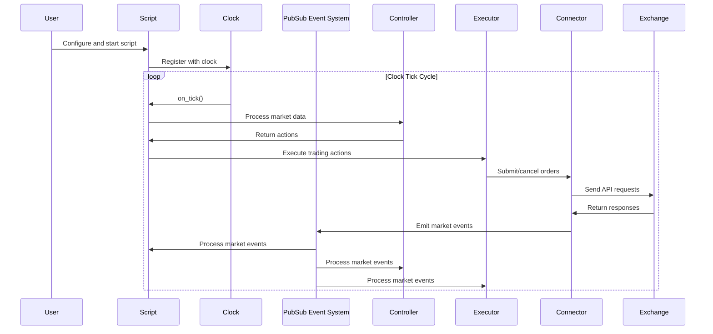

## Detailed Event Processing Sequence

Hummingbot follows a clock-driven event system where most components are synchronized through a central clock that generates tick events. The event processing flows through several key components.

### 1. Initialization Phase

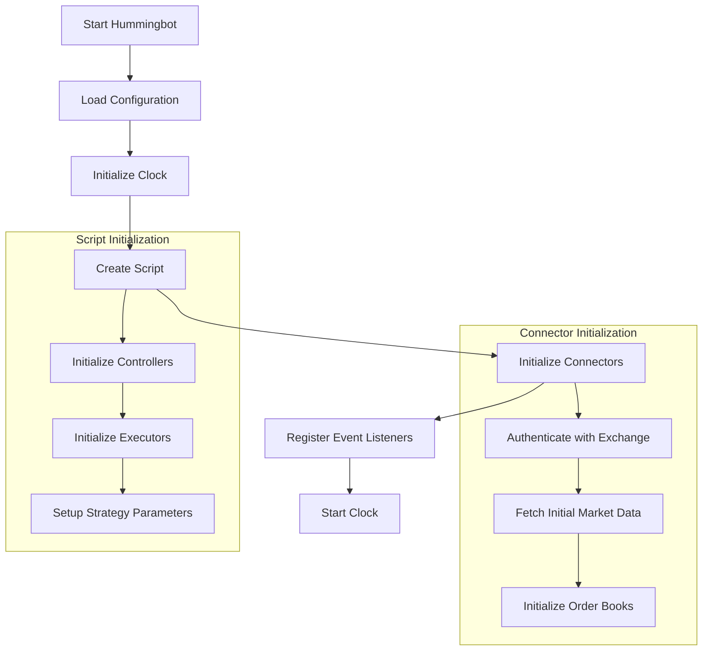

During initialization:

1. The user's configuration is loaded
2. The Clock component is initialized in the appropriate mode (real-time or backtesting)
3. The Script instance (strategy) is created
4. Exchange connectors are initialized and authenticated
5. Event listeners are registered with the PubSub system
6. Controllers and Executors are initialized with their configurations
7. The Clock is started, which begins the main event loop

### 2. Clock-Driven Event Flow

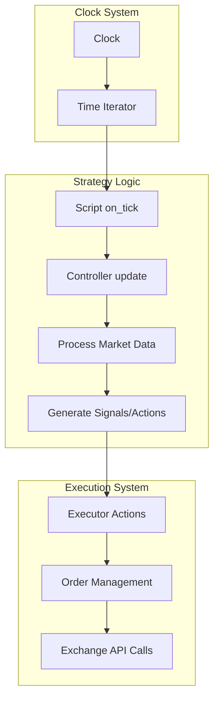

The clock-driven event flow works as follows:

1. The Clock generates tick events at regular intervals
2. The Script's `on_tick()` method is called
3. Inside `on_tick()`:
   - The Script updates controllers and processes market data
   - Controllers generate signals and actions
   - Executors receive actions and manage orders
   - Connectors send API requests to exchanges
   - Market events are processed through the PubSub system

### 3. PubSub Event System

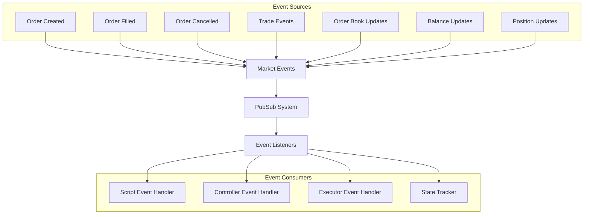

The PubSub event system:

1. Facilitates communication between different components
2. Distributes market events to registered listeners
3. Enables components to react to events asynchronously
4. Maintains a decoupled architecture where components don't directly depend on each other

### 4. V2 Strategy Component Interaction

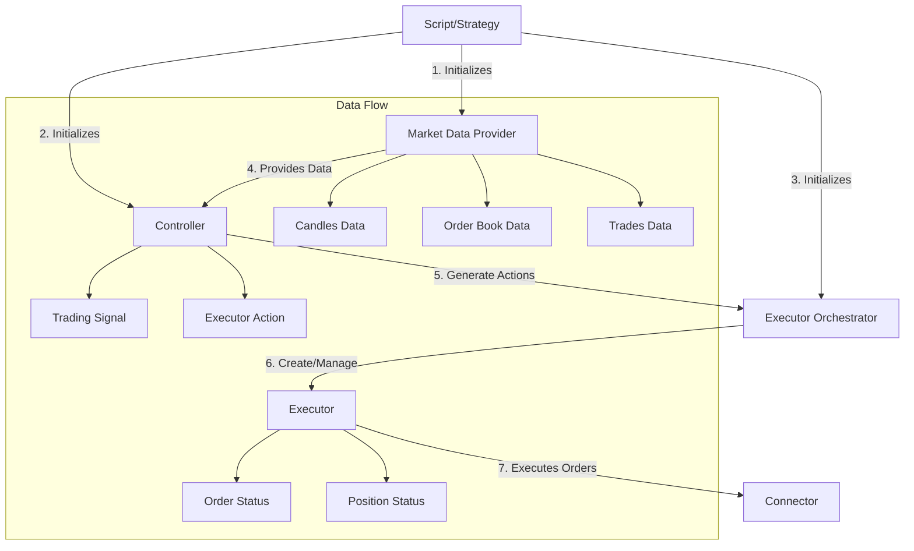

The Strategy V2 components interact as follows:

1. The Script initializes core components including MarketDataProvider, Controllers, and Executors
2. The MarketDataProvider collects and organizes market data (candles, order book, trades)
3. The Controller processes market data to generate trading signals
4. Based on signals, the Controller generates Executor actions
5. The ExecutorOrchestrator creates and manages Executors based on actions
6. Executors implement specific execution strategies and manage orders
7. Connectors handle the communication with exchanges

## Event Types and Their Purposes

Hummingbot processes several types of events during operation:

### 1. Market Events

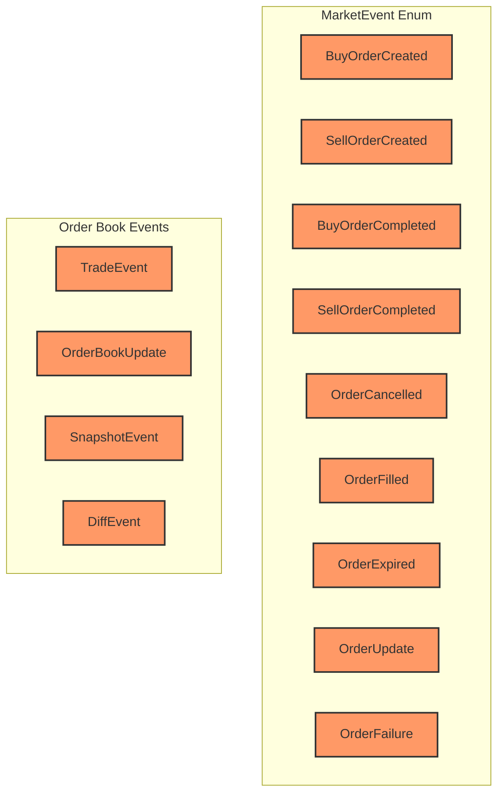

1. **Order Events**:
   - `BuyOrderCreated` / `SellOrderCreated`: Emitted when an order is created
   - `BuyOrderCompleted` / `SellOrderCompleted`: Emitted when an order is fully filled
   - `OrderCancelled`: Emitted when an order is cancelled
   - `OrderFilled`: Emitted when an order is partially or fully filled
   - `OrderExpired`: Emitted when an order expires
   - `OrderUpdate`: Emitted when an order status is updated
   - `OrderFailure`: Emitted when an order creation fails

2. **Order Book Events**:
   - `TradeEvent`: Emitted when a trade occurs in the market
   - `OrderBookUpdate`: Emitted when the order book is updated
   - `SnapshotEvent`: Emitted when a full order book snapshot is received
   - `DiffEvent`: Emitted when an incremental order book update is received

3. **Account Events**:
   - `BalanceEvent`: Emitted when account balances change
   - `PositionUpdate`: Emitted when a trading position is updated
   - `MarginCall`: Emitted when a margin call occurs
   - `LiquidationEvent`: Emitted when a position is liquidated

### 2. Execution Events

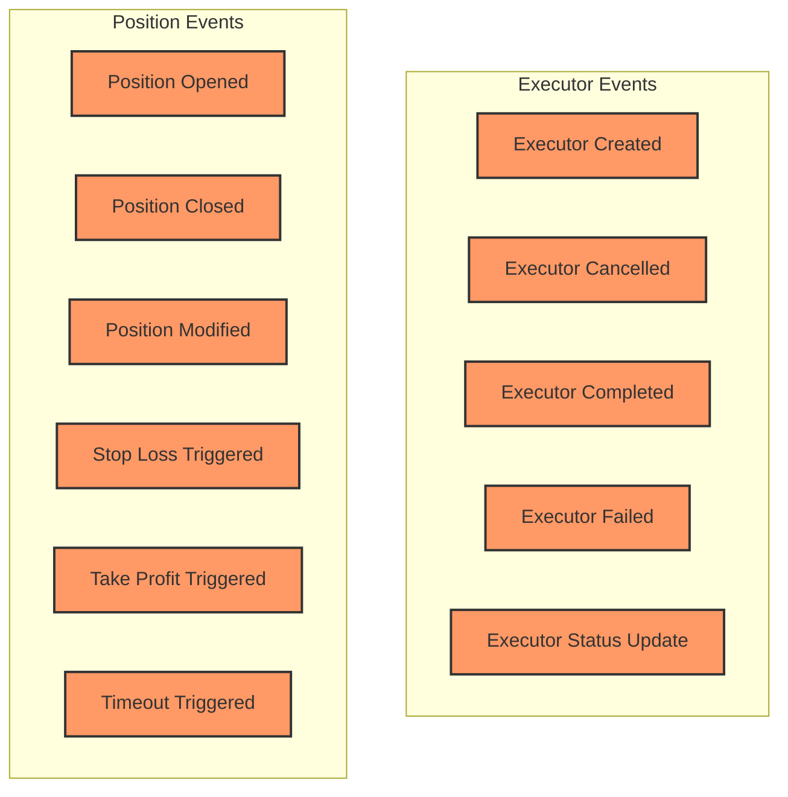

Execution events track the lifecycle of executors and the positions they manage:

1. **Executor Lifecycle Events**:
   - `ExecutorCreated`: When a new executor is created
   - `ExecutorCancelled`: When an executor is cancelled
   - `ExecutorCompleted`: When an executor completes its task
   - `ExecutorFailed`: When an executor fails
   - `ExecutorStatus`: Updates to executor status

2. **Position Events**:
   - `PositionOpened`: When a new position is opened
   - `PositionClosed`: When a position is closed
   - `PositionModified`: When a position is modified
   - `StopLossTriggered`: When a stop loss is triggered
   - `TakeProfitTriggered`: When a take profit is triggered
   - `TimeoutTriggered`: When a position timeout is triggered

### 3. System Events

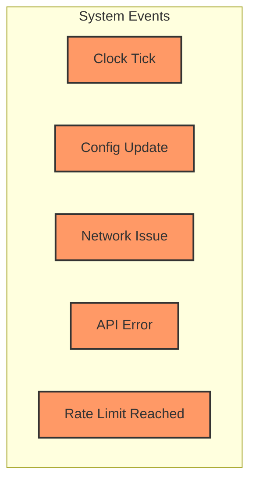

System events handle the operational aspects of the trading system:

1. **Clock Events**:
   - `ClockTick`: Regular tick events from the clock
   
2. **Configuration Events**:
   - `ConfigUpdate`: Changes to configuration parameters
   
3. **Network Events**:
   - `NetworkIssue`: Network connectivity problems
   - `APIError`: Errors from exchange APIs
   - `RateLimitReached`: API rate limits being reached

## Event Processing Timing

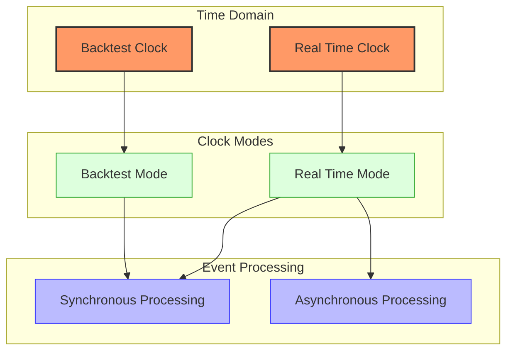

### Clock Modes

Hummingbot supports two clock modes:

1. **Real-Time Mode**:
   - Events are processed as they occur in real-time
   - The clock generates tick events at regular intervals (e.g., 1 second)
   - Both synchronous and asynchronous event processing is used
   - Network I/O is handled asynchronously using asyncio

2. **Backtest Mode**:
   - Events are processed sequentially from historical data
   - Time is simulated rather than actual real time
   - Only synchronous event processing is used
   - No actual network I/O is performed, exchange API calls are simulated

### Event Timing and Sequencing

In Real-Time Mode:
1. The clock generates tick events at regular intervals
2. Events are processed sequentially within each tick
3. Network I/O happens asynchronously
4. Order and trade events are processed as they arrive
5. Market data is updated continuously

In Backtest Mode:
1. The clock advances through historical data at a predetermined rate
2. Events for each time step are processed sequentially
3. Market data for each time step is processed before order events
4. Simulation results are computed after all events are processed

## Error Handling in the Event Flow

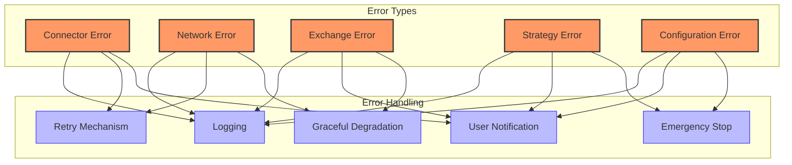

Hummingbot implements several error handling strategies:

### 1. Connector Errors

When interacting with exchanges:
- API errors are logged and retried with exponential backoff
- Order submission failures are handled with retry logic
- Websocket disconnections trigger automatic reconnection
- Rate limit errors trigger temporary pausing of requests

### 2. Network Errors

For network-related issues:
- Connection issues trigger reconnection attempts
- Temporary outages are handled with retry logic
- Persistent issues trigger user notifications
- Critical network failures can trigger safety measures like order cancellation

### 3. Strategy Errors

For errors in user-defined strategies:
- Exceptions in strategy code are caught and logged
- The strategy execution continues where possible
- Critical errors can trigger emergency stopping of the strategy
- User is notified of strategy errors through logs and notifications

### 4. Configuration Errors

For issues with user configuration:
- Configuration validation occurs at startup
- Invalid parameters are reported to the user
- Dangerous configurations trigger warnings
- Critical configuration errors prevent strategy startup

## Example Event Flow Scenarios

### Scenario 1: Basic Market Making

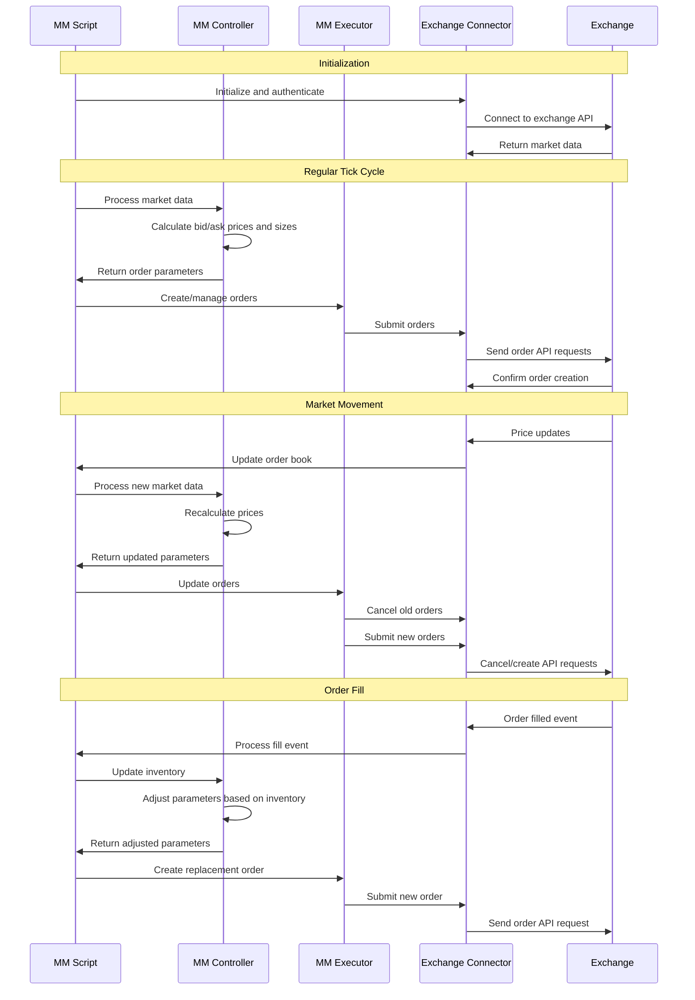

This example shows the event flow for a market making strategy:

1. Initialization sets up connections to the exchange
2. During each tick, the controller calculates optimal bid/ask prices and sizes
3. The executor manages the orders based on controller parameters
4. Market movements trigger recalculation of prices and order updates
5. Order fills update inventory state and adjust strategy parameters

### Scenario 2: Directional Trading with Technical Indicators

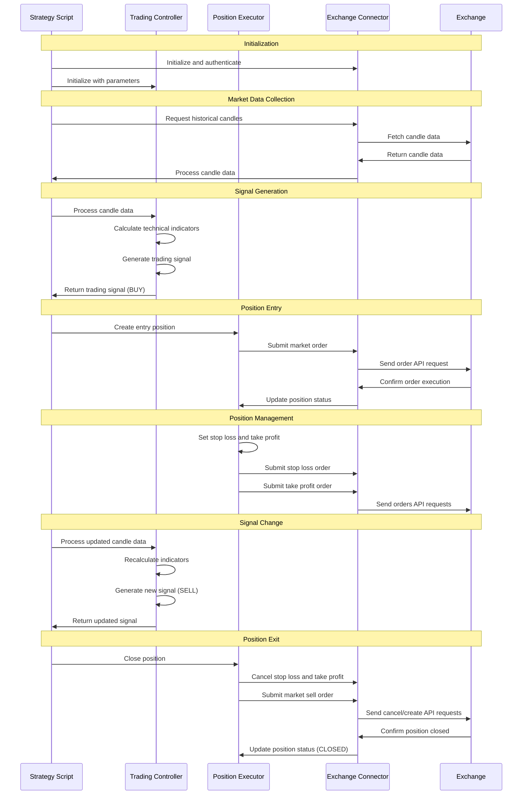

This example shows the event flow for a directional trading strategy:

1. The script initializes the controller with technical indicator parameters
2. Historical candle data is fetched for initial analysis
3. The controller calculates indicators and generates a BUY signal
4. The executor creates a position with appropriate stop loss and take profit orders
5. As new candle data arrives, the controller updates signals
6. When a SELL signal is generated, the executor closes the position

## Conclusion

Hummingbot's event flow is built around a clock-driven system that coordinates the interaction between scripts, controllers, executors, and exchange connectors. The PubSub event system allows components to communicate asynchronously, creating a flexible and extensible architecture.

Key features of Hummingbot's event system include:

1. **Clock-Driven Architecture**: Central timing mechanism that drives the system
2. **PubSub Event System**: Decoupled communication between components
3. **Component-Based Design**: Modular architecture where components interact through well-defined interfaces
4. **Dual Clock Modes**: Support for both real-time trading and backtesting
5. **Comprehensive Error Handling**: Robust mechanisms to handle various error scenarios

By understanding this event flow, developers can effectively create and customize trading strategies that leverage Hummingbot's powerful framework. 