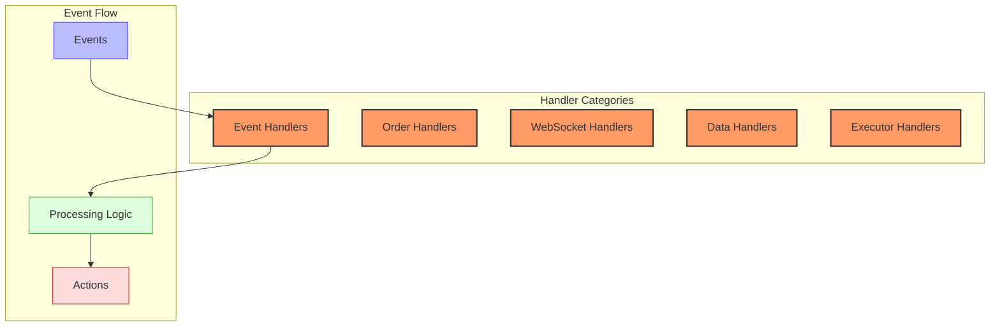

# Hummingbot Handlers

This document details the key handlers in the Hummingbot framework, their responsibilities, interfaces, and interactions.

## Overview of Handler Architecture



In Hummingbot, handlers are specialized components responsible for processing specific types of events or managing particular aspects of the trading system. They follow a loosely event-driven architecture where handlers subscribe to events, process them, and often produce actions or additional events.

## Core Handler Types

### 1. Event Handlers

Event handlers process events from the PubSub system and update state or trigger actions accordingly. The primary event handler in Hummingbot is the Market Event Handler.

```python
class MarketEventHandler:
    def __init__(self, strategy):
        self.strategy = strategy
        self._event_listeners = {}
        
    def register_event_listeners(self):
        self._event_listeners = {
            MarketEvent.BuyOrderCompleted: self.handle_buy_order_completed,
            MarketEvent.SellOrderCompleted: self.handle_sell_order_completed,
            MarketEvent.OrderCancelled: self.handle_order_cancelled,
            MarketEvent.OrderFilled: self.handle_order_filled,
            OrderBookEvent.TradeEvent: self.handle_trade_event,
            # Other event types...
        }
        
        for event_type, handler_func in self._event_listeners.items():
            self.strategy.add_listener(event_type, handler_func)
            
    def handle_buy_order_completed(self, event: BuyOrderCompletedEvent):
        """Process a completed buy order"""
        # Update inventory
        # Update strategy state
        # Notify relevant components
        
    def handle_sell_order_completed(self, event: SellOrderCompletedEvent):
        """Process a completed sell order"""
        # Update inventory
        # Update strategy state
        # Notify relevant components
        
    def handle_order_filled(self, event: OrderFilledEvent):
        """Process an order fill event"""
        # Update fill tracking
        # Update position information
        # Trigger follow-up actions if needed
        
    def handle_trade_event(self, event: OrderBookTradeEvent):
        """Process a market trade event"""
        # Update market state
        # Recalculate indicators if needed
        # Potentially trigger strategy logic
```

### 2. Order Handlers

Order handlers manage the lifecycle of orders, from creation to completion or cancellation.

```python
class OrderHandler:
    def __init__(self, connector):
        self.connector = connector
        self.active_orders = {}  # order_id -> order
        
    async def create_order(self, order_id, trading_pair, order_type, side, amount, price=None):
        """Create an order on the exchange"""
        try:
            exchange_order_id = await self.connector.create_order(
                trading_pair, order_type, side, amount, price
            )
            self.active_orders[order_id] = {
                "exchange_order_id": exchange_order_id,
                "trading_pair": trading_pair,
                "order_type": order_type,
                "side": side,
                "amount": amount,
                "price": price,
                "status": "OPEN",
                "created_at": time.time()
            }
            return exchange_order_id
        except Exception as e:
            # Handle order creation errors
            return None
            
    async def cancel_order(self, order_id):
        """Cancel an active order"""
        if order_id not in self.active_orders:
            return False
            
        order = self.active_orders[order_id]
        try:
            result = await self.connector.cancel_order(
                order["trading_pair"], 
                order["exchange_order_id"]
            )
            if result:
                order["status"] = "CANCELLING"
            return result
        except Exception as e:
            # Handle cancellation errors
            return False
            
    def update_order_status(self, order_id, new_status):
        """Update the status of an order"""
        if order_id in self.active_orders:
            self.active_orders[order_id]["status"] = new_status
            if new_status in ["FILLED", "CANCELED", "FAILED"]:
                # Move to completed orders or remove from active
                del self.active_orders[order_id]
```

### 3. Executor Handlers

Executor handlers manage the lifecycle of specialized execution components. The `ExecutorHandler` serves as a factory and manager for executor instances.

```python
class ExecutorHandler:
    def __init__(self, strategy):
        self.strategy = strategy
        self.executors = {}  # executor_id -> executor
        
    def create_executor(self, config, controller=None):
        """Create a new executor based on configuration"""
        if config.executor_type == "position":
            executor = PositionExecutor(config, self.strategy, controller)
        elif config.executor_type == "dca":
            executor = DCAExecutor(config, self.strategy, controller)
        elif config.executor_type == "twap":
            executor = TWAPExecutor(config, self.strategy, controller)
        else:
            raise ValueError(f"Unsupported executor type: {config.executor_type}")
            
        self.executors[executor.id] = executor
        return executor
        
    def start_executor(self, executor_id):
        """Start an executor"""
        if executor_id in self.executors:
            self.executors[executor_id].start()
            
    def stop_executor(self, executor_id):
        """Stop an executor"""
        if executor_id in self.executors:
            self.executors[executor_id].stop()
            
    def get_executor_status(self, executor_id):
        """Get the status of an executor"""
        if executor_id in self.executors:
            return self.executors[executor_id].status
        return None
        
    def update_executors(self):
        """Update all active executors"""
        for executor in self.executors.values():
            if executor.status == "ACTIVE":
                executor.process_tick()
```

### 4. WebSocket Handlers

WebSocket handlers manage connections to exchange WebSocket APIs, processing messages and maintaining the connection.

```python
class WebSocketHandler:
    def __init__(self, connector, url, message_handlers=None):
        self.connector = connector
        self.url = url
        self.message_handlers = message_handlers or {}
        self.ws = None
        self.connected = False
        self.last_message_time = 0
        
    async def connect(self):
        """Establish WebSocket connection"""
        try:
            self.ws = await websockets.connect(self.url)
            self.connected = True
            self._start_heartbeat()
            self._start_message_listener()
            return True
        except Exception as e:
            self.connected = False
            return False
            
    async def _message_listener(self):
        """Listen for and process WebSocket messages"""
        while self.connected:
            try:
                message = await self.ws.recv()
                self.last_message_time = time.time()
                await self._process_message(message)
            except Exception as e:
                self.connected = False
                await self._handle_disconnect()
                
    async def _process_message(self, message):
        """Process a WebSocket message"""
        try:
            parsed = json.loads(message)
            message_type = self._get_message_type(parsed)
            
            if message_type in self.message_handlers:
                await self.message_handlers[message_type](parsed)
        except Exception as e:
            # Log error processing message
            pass
            
    async def _handle_disconnect(self):
        """Handle disconnection and attempt reconnection"""
        retry_delay = 1
        max_retries = 10
        retries = 0
        
        while retries < max_retries and not self.connected:
            retries += 1
            try:
                await asyncio.sleep(retry_delay)
                retry_delay = min(retry_delay * 2, 60)  # Exponential backoff
                await self.connect()
            except Exception:
                continue
```

### 5. Data Handlers

Data handlers process and manage market data, such as order books, candles, and trades.

```python
class OrderBookHandler:
    def __init__(self, connector):
        self.connector = connector
        self.order_books = {}  # trading_pair -> OrderBook
        
    def handle_snapshot(self, trading_pair, snapshot_data):
        """Process an order book snapshot"""
        if trading_pair not in self.order_books:
            self.order_books[trading_pair] = OrderBook()
            
        self.order_books[trading_pair].apply_snapshot(
            snapshot_data["bids"],
            snapshot_data["asks"],
            snapshot_data["update_id"]
        )
        
    def handle_diff(self, trading_pair, diff_data):
        """Process an order book diff"""
        if trading_pair not in self.order_books:
            # Request snapshot if we don't have the order book yet
            return
            
        self.order_books[trading_pair].apply_diff(
            diff_data["bids"],
            diff_data["asks"],
            diff_data["update_id"]
        )
        
    def get_order_book(self, trading_pair):
        """Get the current order book"""
        return self.order_books.get(trading_pair)
        
    def get_price(self, trading_pair, side):
        """Get the best price for a given side"""
        order_book = self.get_order_book(trading_pair)
        if not order_book:
            return None
            
        if side == "buy":
            return order_book.get_best_bid()
        elif side == "sell":
            return order_book.get_best_ask()
        return None
```

## Handler Interfaces and Responsibilities

### Event Handler Interface

Event handlers follow a common pattern:

```python
class BaseEventHandler:
    def register_events(self):
        """Register for relevant events"""
        pass
        
    def handle_event(self, event):
        """Process an event"""
        pass
```

Responsibilities:
- Register for specific event types
- Process events when they occur
- Update relevant state
- Trigger follow-up actions if needed

### Order Handler Interface

```python
class BaseOrderHandler:
    async def create_order(self, *args, **kwargs):
        """Create an order"""
        pass
        
    async def cancel_order(self, order_id):
        """Cancel an order"""
        pass
        
    def get_order_status(self, order_id):
        """Get order status"""
        pass
```

Responsibilities:
- Create orders on exchanges
- Track order status and fills
- Cancel or modify orders as needed
- Handle order-related errors

### Executor Handler Interface

```python
class BaseExecutorHandler:
    def create_executor(self, config):
        """Create an executor"""
        pass
        
    def start_executor(self, executor_id):
        """Start an executor"""
        pass
        
    def stop_executor(self, executor_id):
        """Stop an executor"""
        pass
```

Responsibilities:
- Create appropriate executor instances
- Manage executor lifecycle
- Track executor status
- Handle executor errors

## Error Handling Strategies

Handlers implement several error handling strategies:

### 1. Resilient Connections

```python
async def _maintain_connection(self):
    """Maintain WebSocket connection with reconnection logic"""
    while True:
        try:
            if not self.connected:
                await self.connect()
            await asyncio.sleep(5)
        except Exception as e:
            self.logger.error(f"Error maintaining connection: {e}")
            await asyncio.sleep(5)
```

### 2. Transaction Retry Logic

```python
async def _execute_with_retry(self, func, *args, max_retries=3, **kwargs):
    """Execute a function with retry logic"""
    retries = 0
    while retries < max_retries:
        try:
            return await func(*args, **kwargs)
        except (ConnectionError, TimeoutError) as e:
            retries += 1
            if retries >= max_retries:
                raise
            await asyncio.sleep(0.5 * (2 ** retries))  # Exponential backoff
```

### 3. Graceful Degradation

```python
def handle_market_data(self, data):
    """Handle market data with degradation options"""
    try:
        # Process in full mode
        return self._process_full_data(data)
    except Exception as e:
        self.logger.warning(f"Falling back to simplified processing: {e}")
        try:
            # Try simplified processing
            return self._process_simplified_data(data)
        except Exception as e2:
            self.logger.error(f"Failed to process market data: {e2}")
            return None
```

## Performance Considerations

Handlers are designed with performance in mind:

1. **Asynchronous Processing**: Most handlers use asyncio for non-blocking I/O
2. **Batched Updates**: Order book and other data updates are batched where possible
3. **Efficient Event Routing**: Events are routed only to relevant handlers
4. **State Caching**: Frequently used data is cached in memory
5. **Throttling**: API-intensive operations are throttled to avoid rate limits

## Example: Integrating Handlers in a Strategy

```python
class MyCustomStrategy(ScriptStrategyBase):
    def __init__(self, connectors=None):
        super().__init__(connectors)
        # Initialize handlers
        self.event_handler = MarketEventHandler(self)
        self.executor_handler = ExecutorHandler(self)
        
        # Register event handlers
        self.event_handler.register_event_listeners()
        
        # Initialize strategy
        self.initialize_strategy()
        
    def initialize_strategy(self):
        # Create executors for initial positions if needed
        controller_config = BollingerV1ControllerConfig(
            strategy_name="my_strategy",
            trading_pair="ETH-USDT",
            connector_name="binance_paper_trade",
            # ...other parameters
        )
        self.controller = BollingerV1Controller(controller_config)
        
        executor_config = PositionExecutorConfig(
            executor_type="position",
            trading_pair="ETH-USDT",
            exchange="binance_paper_trade",
            # ...other parameters
        )
        self.executor = self.executor_handler.create_executor(executor_config, self.controller)
        
    def on_tick(self):
        # Update controller
        self.controller.process_tick(self.current_timestamp)
        
        # Check for new actions
        actions = self.controller.get_actions()
        
        # Process actions
        for action in actions:
            if action.action_type == "CREATE_EXECUTOR":
                self.executor_handler.create_executor(action.config, self.controller)
            elif action.action_type == "STOP_EXECUTOR":
                self.executor_handler.stop_executor(action.executor_id)
                
        # Update executors
        self.executor_handler.update_executors()
```

## Edge Cases and Their Handling

### 1. Exchange Disconnections

```python
async def handle_exchange_disconnection(self):
    """Handle exchange disconnection"""
    # Cancel all local tracking orders
    for order_id in list(self.active_orders.keys()):
        self.active_orders[order_id]["status"] = "UNKNOWN"
        
    # Attempt reconnection
    reconnected = await self.connector.reconnect()
    
    if reconnected:
        # Synchronize order status
        await self.sync_orders()
    else:
        # Notify strategy of extended outage
        self.strategy.on_exchange_disconnection(self.connector.name)
        
async def sync_orders(self):
    """Synchronize local order state with exchange"""
    # Get open orders from exchange
    exchange_orders = await self.connector.get_open_orders()
    exchange_order_ids = {order["exchange_order_id"] for order in exchange_orders}
    
    # Update local orders
    for order_id, order in list(self.active_orders.items()):
        if order["exchange_order_id"] not in exchange_order_ids:
            # Order is not on exchange, mark as CANCELED
            order["status"] = "CANCELED"
            del self.active_orders[order_id]
```

### 2. Partial Fills

```python
def handle_partial_fill(self, event):
    """Handle a partial fill event"""
    order_id = event.order_id
    fill_amount = event.amount
    
    if order_id in self.active_orders:
        order = self.active_orders[order_id]
        order["filled_amount"] = order.get("filled_amount", 0) + fill_amount
        
        # Check if the order is fully filled
        if order["filled_amount"] >= order["amount"]:
            order["status"] = "FILLED"
            # Process complete fill
            self.handle_complete_fill(order)
        else:
            # Process partial fill
            self.handle_continue_partial_fill(order)
```

### 3. Order Expiry

```python
def check_order_expiry(self):
    """Check for expired orders"""
    current_time = time.time()
    expiry_threshold = 60 * 5  # 5 minutes
    
    for order_id, order in list(self.active_orders.items()):
        if current_time - order["created_at"] > expiry_threshold:
            # Order has been open too long, cancel it
            asyncio.create_task(self.cancel_order(order_id))
```

## Conclusion

Hummingbot's handler system provides a modular approach to managing the various aspects of the trading system:

1. **Event Handlers** process market events and update strategy state
2. **Order Handlers** manage the lifecycle of orders
3. **Executor Handlers** manage specialized execution components
4. **WebSocket Handlers** maintain connections to exchange data feeds
5. **Data Handlers** process and organize market data

Each handler type is responsible for a specific domain of functionality, creating a clean separation of concerns. This modular design enables flexibility, maintainability, and extensibility, allowing users to customize trading logic while leveraging the framework's robust infrastructure.

The handler-based architecture, combined with Hummingbot's event-driven design, creates a powerful system capable of implementing a wide range of trading strategies across multiple markets and asset classes. 