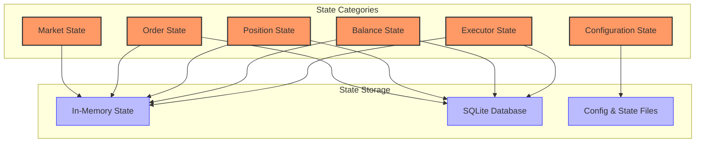
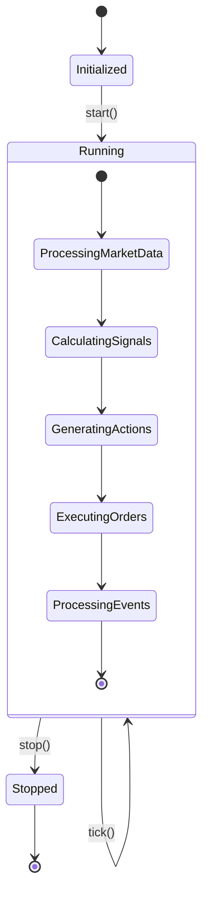
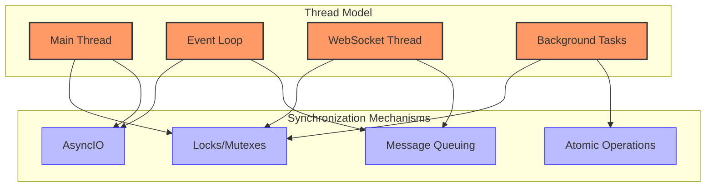

# Hummingbot State Management

This document details how Hummingbot manages state across various components of the system. Understanding the state model is crucial for developing effective strategies and interacting with the framework.

## State Model Description



Hummingbot's state management is organized into several key categories, each with its own lifecycle and persistence characteristics:

### 1. Market State

Market state includes current and historical market data:
- Order book snapshots and updates
- Recent trades and candle data
- Market statistics (e.g., 24h volume, price range)
- Market status (e.g., trading enabled, maintenance mode)

Market state is typically held in memory for performance reasons, with historical data sometimes persisted to a database for backtesting purposes.

### 2. Order State

Order state tracks all aspects of orders:
- Active orders (open, partially filled)
- Historical orders (filled, cancelled, failed)
- Order parameters (price, amount, type, time in force)
- Fill information (fill price, fees, timestamps)

Orders have a lifecycle that includes creation, tracking, updates, and completion or cancellation. Order state is maintained both in memory for active orders and persisted to a database for historical reference.

### 3. Position State

Position state tracks trading positions, particularly important for derivatives trading:
- Open positions (entry price, size, leverage, margin)
- Position side (long/short)
- Unrealized PnL
- Associated orders (stop loss, take profit)
- Position history

Position state is maintained both in memory and persisted for historical analysis.

### 4. Balance State

Balance state tracks account balances across different assets:
- Free balances (available for trading)
- Locked balances (in open orders)
- Total balances
- Balance history
- Funding balance (for derivatives exchanges)

Balance state is synchronized with exchanges and updated based on order and position events.

### 5. Configuration State

Configuration state includes user-defined parameters:
- Strategy parameters
- Exchange API credentials
- Trading pairs and markets
- Risk parameters
- GUI configurations

Configuration state is typically stored in files and loaded at startup.

### 6. Executor State

Executor state tracks the status of executors:
- Executor lifecycle (created, active, completed, cancelled)
- Executor parameters
- Associated orders
- Execution statistics

## State Transitions and Triggers



### Key State Transitions

1. **Strategy Lifecycle**
   - **Initialized**: Strategy components are created but not active
   - **Running**: Strategy is actively processing market data and generating signals
   - **Stopped**: Strategy has been stopped and is no longer active

2. **Order Lifecycle**
   - **Created**: Order has been created and submitted to the exchange
   - **Open**: Order is active on the exchange
   - **Partially Filled**: Order has been partially filled
   - **Filled**: Order has been completely filled
   - **Cancelled**: Order has been cancelled
   - **Failed**: Order creation or execution has failed

3. **Executor Lifecycle**
   - **Created**: Executor has been created with its parameters
   - **Active**: Executor is actively managing orders
   - **Completed**: Executor has completed its task successfully
   - **Cancelled**: Executor has been cancelled
   - **Failed**: Executor has failed due to an error

### State Transition Triggers

State transitions are triggered by various events and actions:

| Trigger | Source | Affected State | Description |
|---------|--------|---------------|-------------|
| **Clock Tick** | Clock | Strategy | Regular update cycle that processes data and updates strategy state |
| **Market Data Updates** | Connector | Market State | Updates to order books, trades, and candles |
| **Order Events** | Exchange | Order State | Order creation, fill, cancellation events |
| **Balance Updates** | Exchange | Balance State | Changes to account balances |
| **Position Updates** | Exchange | Position State | Changes to trading positions |
| **User Commands** | User Interface | Configuration | User-initiated changes to parameters or commands |
| **Controller Signals** | Controller | Executor State | Trading signals that trigger executor actions |

## Persistence Mechanisms

Hummingbot uses multiple persistence mechanisms to maintain state across sessions:

### 1. In-Memory State

Most operational state is kept in memory for performance reasons:
- Current order book and recent market data
- Active orders and positions
- Strategy-specific state (e.g., signal values, indicator calculations)
- Runtime configuration

### 2. SQLite Database

Historical data and completed operations are stored in a SQLite database:
- Order history
- Trade history
- Balance history
- Execution metrics
- Performance analytics

The database schema includes tables for orders, trades, balances, and market data, with appropriate indexes for efficient querying.

### 3. Configuration Files

User-defined settings are stored in YAML configuration files:
- Global configuration (e.g., default exchange, log level)
- Strategy-specific configuration
- Exchange API credentials (encrypted)
- Trading pairs and parameters

### 4. State Files

Some components maintain state files for persistence across sessions:
- Executor state
- Trading performance
- Rate limiting state
- Session information

## Recovery Procedures

Hummingbot includes mechanisms for recovering state after restarts or failures:

### 1. Normal Restart

During a normal restart:
1. Configuration is loaded from files
2. Database state is loaded for historical reference
3. Exchange connections are established
4. Current market state is retrieved
5. Open orders are synchronized
6. Balances are updated
7. Strategy state is reinitialized

### 2. Failure Recovery

After a failure:
1. Logs are analyzed to determine failure point
2. Database state is examined for consistency
3. Exchange state is synchronized (open orders, positions)
4. Inconsistencies are resolved (e.g., phantom orders)
5. Strategy state is restored where possible
6. User is notified of recovery actions

### 3. Exchange Disconnection Recovery

When an exchange connection is lost:
1. Reconnection is attempted with exponential backoff
2. Once reconnected, order status is synchronized
3. Missing events are reconciled
4. Balances are updated
5. Strategy operation is resumed if safe

## Thread Safety and Concurrency

Hummingbot's state management includes considerations for thread safety and concurrency:



### Thread Model

Hummingbot uses a hybrid threading model:
- **Main Thread**: Runs the main event loop and handles user interface
- **Event Loop**: Manages asynchronous operations using AsyncIO
- **WebSocket Threads**: Handle exchange websocket connections
- **Background Tasks**: Handle tasks like database persistence

### Synchronization Mechanisms

Several mechanisms ensure thread-safe state access:
- **Locks/Mutexes**: Protect shared state from concurrent access
- **AsyncIO**: Coordinates asynchronous operations
- **Atomic Operations**: Ensure certain operations are executed atomically
- **Message Queuing**: Allows thread-safe communication between components

### Critical Sections

The following state categories require special attention for thread safety:
- **Order Management**: Orders can be updated by both strategy logic and exchange events
- **Balance Updates**: Balances can change due to order fills and external transactions
- **Market Data**: Order book updates must be applied atomically to maintain consistency

## State Management in Key Components

### 1. Strategy Script

```python
class MyStrategy(ScriptStrategyBase):
    def __init__(self, connectors=None):
        super().__init__(connectors)
        # Strategy state
        self.last_candle_timestamp = 0
        self.signal_value = 0
        self.active_position = None
        self.trading_pair = "ETH-USDT"
        
    def on_tick(self):
        # Update state based on market data
        current_price = self.get_mid_price(self.connector_name, self.trading_pair)
        candles = self.fetch_candles(self.connector_name, self.trading_pair, "1m", 100)
        
        # Process candles if we have new data
        if candles and candles[-1]["timestamp"] > self.last_candle_timestamp:
            self.last_candle_timestamp = candles[-1]["timestamp"]
            self.process_candles(candles)
            
    def process_candles(self, candles):
        # Update internal state
        df = pd.DataFrame(candles)
        df["sma"] = df["close"].rolling(20).mean()
        df["rsi"] = calculate_rsi(df["close"], 14)
        
        # Generate signal
        self.signal_value = self.generate_signal(df)
        
    def generate_signal(self, df):
        # Calculate signal value
        rsi = df["rsi"].iloc[-1]
        sma = df["sma"].iloc[-1]
        close = df["close"].iloc[-1]
        
        # Update state based on signal
        if close > sma and rsi < 70 and not self.active_position:
            self.buy(self.connector_name, self.trading_pair, 0.1)
            self.active_position = "LONG"
        elif (close < sma or rsi > 70) and self.active_position == "LONG":
            self.sell(self.connector_name, self.trading_pair, 0.1)
            self.active_position = None
```

The strategy maintains internal state including:
- Last processed candle timestamp
- Current signal value
- Active position information
- Configuration parameters

This state is updated during each tick based on market data and trading logic.

### 2. Connectors

```python
class BinanceConnector:
    def __init__(self, api_key, api_secret):
        self.api_key = api_key
        self.api_secret = api_secret
        self.order_book_state = {}  # Trading pair -> OrderBook
        self.account_balances = {}  # Asset -> Balance
        self.active_orders = {}     # Order ID -> Order
        
    async def start_network(self):
        # Initialize connection and subscribe to web socket feeds
        # Synchronize initial state
        await self.update_balances()
        await self.get_active_orders()
        
    async def update_order_book(self, trading_pair, data):
        # Thread-safe update of order book
        if trading_pair not in self.order_book_state:
            self.order_book_state[trading_pair] = OrderBook()
        await self.order_book_state[trading_pair].update(data)
        
    async def update_balances(self):
        # Fetch and update account balances
        response = await self.api_request("GET", "/api/v3/account")
        for balance in response.get("balances", []):
            asset = balance["asset"]
            self.account_balances[asset] = {
                "free": Decimal(balance["free"]),
                "locked": Decimal(balance["locked"])
            }
            
    async def create_order(self, trading_pair, order_type, side, amount, price=None):
        # Create an order and update local state
        params = {
            "symbol": trading_pair,
            "side": side,
            "type": order_type,
            "quantity": str(amount)
        }
        if price and order_type != "MARKET":
            params["price"] = str(price)
            
        response = await self.api_request("POST", "/api/v3/order", params)
        order_id = response["orderId"]
        self.active_orders[order_id] = {
            "id": order_id,
            "trading_pair": trading_pair,
            "type": order_type,
            "side": side,
            "amount": amount,
            "price": price,
            "status": "NEW"
        }
        return order_id
```

Connectors maintain several key pieces of state:
- Order book data for each trading pair
- Account balances
- Active orders
- Exchange-specific state (e.g., rate limits, websocket connections)

This state is synchronized with the exchange through API calls and websocket messages.

### 3. Executors

```python
class PositionExecutor:
    def __init__(self, config):
        self.config = config
        self.status = "NOT_STARTED"
        self.entry_order = None
        self.exit_orders = {}
        self.filled_amount = Decimal("0")
        self.average_entry_price = None
        self.exit_reason = None
        
    def start(self):
        # Initialize and start execution
        self.status = "ACTIVE"
        self.create_entry_order()
        
    def create_entry_order(self):
        # Create entry order
        self.entry_order = {
            "id": generate_order_id(),
            "trading_pair": self.config.trading_pair,
            "exchange": self.config.exchange,
            "side": self.config.side,
            "amount": self.config.amount,
            "price": self.config.entry_price,
            "type": "LIMIT",
            "status": "PENDING"
        }
        # Submit order to exchange
        
    def on_entry_order_filled(self, fill_event):
        # Update state based on fill
        self.filled_amount += fill_event.amount
        self.average_entry_price = calculate_average_price(
            self.average_entry_price, self.filled_amount, fill_event.price, fill_event.amount
        )
        
        # Create exit orders when entry is complete
        if self.filled_amount >= self.config.amount:
            self.create_exit_orders()
            
    def create_exit_orders(self):
        # Create stop loss order
        self.exit_orders["stop_loss"] = {
            "id": generate_order_id(),
            "trading_pair": self.config.trading_pair,
            "exchange": self.config.exchange,
            "side": opposite_side(self.config.side),
            "amount": self.filled_amount,
            "price": calculate_stop_loss_price(self.average_entry_price, self.config),
            "type": "STOP_LIMIT",
            "status": "PENDING"
        }
        
        # Create take profit order
        self.exit_orders["take_profit"] = {
            "id": generate_order_id(),
            "trading_pair": self.config.trading_pair,
            "exchange": self.config.exchange,
            "side": opposite_side(self.config.side),
            "amount": self.filled_amount,
            "price": calculate_take_profit_price(self.average_entry_price, self.config),
            "type": "LIMIT",
            "status": "PENDING"
        }
        
        # Submit orders to exchange
        
    def on_exit_order_filled(self, fill_event, order_type):
        # Update state based on exit
        self.status = "COMPLETED"
        self.exit_reason = order_type
        
        # Cancel other exit orders
        for order_type, order in self.exit_orders.items():
            if order["status"] == "ACTIVE":
                # Cancel order on exchange
                order["status"] = "CANCELLING"
```

Executors maintain detailed state about a specific execution task:
- Current status
- Entry and exit orders
- Fill information
- Execution metrics
- Exit conditions

This state evolves throughout the executor's lifecycle based on order events and market conditions.

## State Persistence Example

The following example shows how Hummingbot persists and restores state:

```python
# State persistence
def save_state(strategy):
    # Collect state from various components
    state = {
        "strategy": {
            "name": strategy.name,
            "active_executors": [e.id for e in strategy.active_executors]
        },
        "executors": {
            executor.id: {
                "status": executor.status,
                "config": executor.config.to_json(),
                "entry_order": executor.entry_order,
                "exit_orders": executor.exit_orders,
                "filled_amount": str(executor.filled_amount),
                "average_entry_price": str(executor.average_entry_price) if executor.average_entry_price else None
            }
            for executor in strategy.all_executors
        },
        "balances": {
            connector: {
                asset: {
                    "free": str(balance.free),
                    "locked": str(balance.locked)
                }
                for asset, balance in connector.account_balances.items()
            }
            for connector in strategy.connectors
        }
    }
    
    # Save to file
    with open("state.json", "w") as f:
        json.dump(state, f, indent=2)
        
    # Save to database
    with strategy.db.get_session() as session:
        for executor_id, executor_state in state["executors"].items():
            session.add(ExecutorState(
                executor_id=executor_id,
                status=executor_state["status"],
                config=executor_state["config"],
                filled_amount=executor_state["filled_amount"],
                average_entry_price=executor_state["average_entry_price"],
                timestamp=time.time()
            ))
        session.commit()

# State restoration
def restore_state(strategy):
    try:
        # Load from file
        with open("state.json", "r") as f:
            state = json.load(f)
            
        # Restore strategy state
        strategy.name = state["strategy"]["name"]
        
        # Restore executor state
        for executor_id, executor_state in state["executors"].items():
            if executor_id in strategy.all_executors:
                executor = strategy.all_executors[executor_id]
                executor.status = executor_state["status"]
                executor.filled_amount = Decimal(executor_state["filled_amount"])
                if executor_state["average_entry_price"]:
                    executor.average_entry_price = Decimal(executor_state["average_entry_price"])
                    
        # Synchronize with exchange to verify state
        for connector in strategy.connectors:
            await connector.update_balances()
            await connector.get_active_orders()
            
    except FileNotFoundError:
        logger.info("No state file found, starting with fresh state")
    except Exception as e:
        logger.error(f"Error restoring state: {e}")
        logger.info("Starting with fresh state")
```

## Conclusion

Hummingbot's state management system provides a robust foundation for developing and operating trading strategies:

1. **Comprehensive State Model**: The state model covers all aspects of trading, from market data to orders, positions, and strategy-specific state.

2. **Persistence and Recovery**: Multiple persistence mechanisms ensure state can be recovered after restarts or failures.

3. **Thread Safety**: Synchronization mechanisms ensure thread-safe access to state in a concurrent environment.

4. **Component-Based Design**: State is distributed across components, with clear interfaces for communication and synchronization.

5. **Event-Driven Updates**: State transitions are triggered by events, creating a reactive system that responds to market changes.

Understanding this state management architecture is essential for developing effective Hummingbot strategies, especially when implementing complex trading logic that depends on maintaining consistent state across multiple components. 