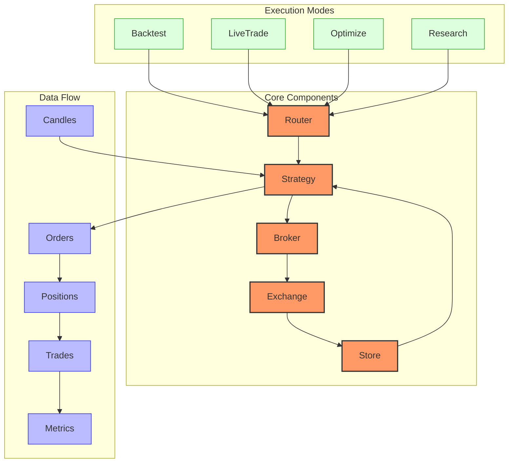
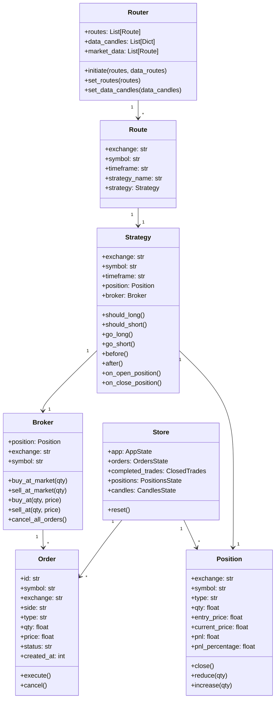
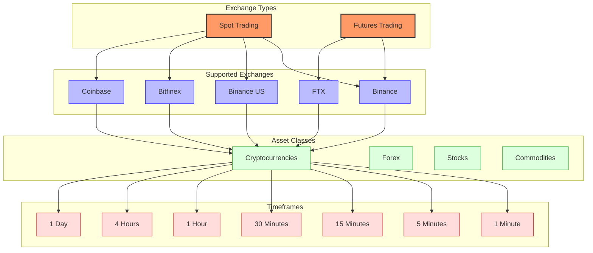
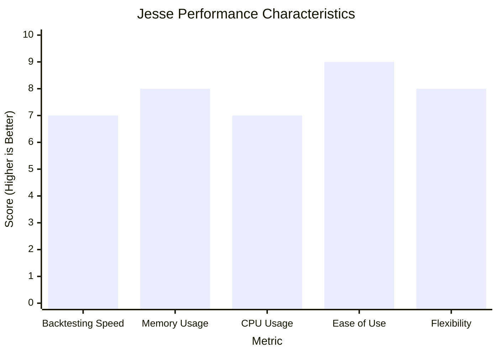
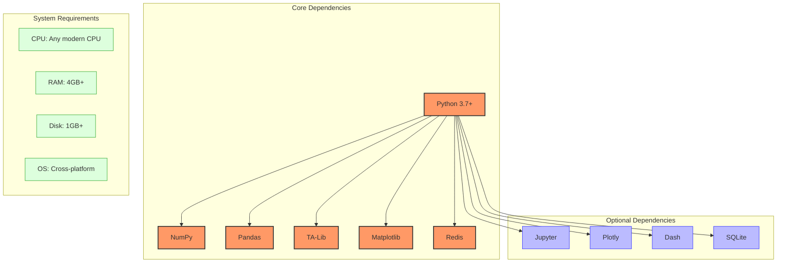

# Jesse Trading System

## System Overview



Jesse is a Python-based trading framework designed for both backtesting and live trading. It provides a clean, modular architecture that allows traders to develop, test, and deploy trading strategies with minimal friction. Jesse's design philosophy emphasizes simplicity, performance, and reliability, making it suitable for both beginners and experienced algorithmic traders.

The framework follows an event-driven architecture where strategies react to market data updates (candles) and execute trading decisions through a broker interface. Jesse's state management system ensures consistent tracking of orders, positions, and trades throughout the trading process.

## Key Components and Their Relationships



### Router

The Router is the central component that manages the trading routes. A route defines which strategy to use for a specific exchange, symbol, and timeframe combination. The Router initializes the trading environment and ensures that strategies receive the correct market data.

```python
# Example of defining routes
routes = [
    {'exchange': 'Binance', 'symbol': 'BTC-USDT', 'timeframe': '1h', 'strategy': 'MyStrategy'},
    {'exchange': 'Binance', 'symbol': 'ETH-USDT', 'timeframe': '4h', 'strategy': 'AnotherStrategy'},
]
```

### Strategy

The Strategy class is the core component where trading logic is implemented. Traders extend this class to create custom strategies by implementing methods like `should_long()`, `should_short()`, `go_long()`, and `go_short()`. The Strategy class also provides event handlers for position management and risk control.

```python
class MyStrategy(Strategy):
    def should_long(self) -> bool:
        # Define entry conditions for long positions
        return self.sma10 > self.sma20 and self.rsi < 30
        
    def go_long(self) -> None:
        # Define execution details for long entries
        entry_price = self.price
        stop_loss = entry_price * 0.95
        take_profit = entry_price * 1.15
        
        self.buy = 1, entry_price
        self.stop_loss = 1, stop_loss
        self.take_profit = 1, take_profit
```

### Broker

The Broker acts as an intermediary between the Strategy and the Exchange. It handles order submission, cancellation, and execution. The Broker provides methods for creating market and limit orders, as well as managing stop-loss and take-profit orders.

```python
# Example of broker usage within a strategy
def go_long(self):
    # Market order
    self.broker.buy_at_market(1)
    
    # Limit order
    self.broker.buy_at(1, self.price * 0.98)
```

### Store

The Store is a centralized state management system that maintains the current state of the application, including orders, positions, trades, and candles. It ensures data consistency across the system and provides access to historical and current market data.

```python
# Accessing store components
from jesse.store import store

# Get current position
position = store.positions.get_position(exchange, symbol)

# Get current candle
candle = store.candles.get_current_candle(exchange, symbol, timeframe)
```

### Exchange

The Exchange component handles the communication with trading exchanges, either through API calls in live trading or through simulation in backtesting. It processes order requests, provides market data, and manages account information.

## Supported Markets and Instruments



Jesse primarily focuses on cryptocurrency trading but is designed to be flexible enough to support other asset classes. The framework supports both spot and futures trading on various exchanges.

### Supported Exchanges

- **Binance**: Both spot and futures markets
- **Binance US**: Spot markets
- **Bitfinex**: Spot markets
- **Coinbase**: Spot markets
- **FTX**: Futures markets

### Asset Classes

While Jesse is primarily used for cryptocurrency trading, its architecture allows for trading other asset classes by implementing custom exchange drivers:

- **Cryptocurrencies**: Full support for major cryptocurrencies and altcoins
- **Forex**: Possible with custom implementation
- **Stocks**: Possible with custom implementation
- **Commodities**: Possible with custom implementation

### Timeframes

Jesse supports multiple timeframes for strategy execution:

- **1 minute (1m)**
- **3 minutes (3m)**
- **5 minutes (5m)**
- **15 minutes (15m)**
- **30 minutes (30m)**
- **1 hour (1h)**
- **2 hours (2h)**
- **4 hours (4h)**
- **6 hours (6h)**
- **8 hours (8h)**
- **12 hours (12h)**
- **1 day (1D)**

### Order Types

- **Market Orders**: Executed immediately at the current market price
- **Limit Orders**: Executed only at the specified price or better
- **Stop Orders**: Activated when the market reaches a specified price
- **Stop-Limit Orders**: Combines features of stop and limit orders
- **Take-Profit Orders**: Automatically close positions at a profit target
- **Stop-Loss Orders**: Automatically close positions to limit losses

## Performance Characteristics



Jesse is designed to balance performance with usability, making it suitable for both research and production environments.

### Speed

- **Backtesting Speed**: Good performance for medium-sized datasets, with optimizations for faster execution
- **Optimization Speed**: Efficient parameter optimization with parallel processing support
- **Live Trading Latency**: Low latency for real-time order execution

### Resource Usage

- **Memory Footprint**: Moderate, with efficient data structures for storing candles and orders
- **CPU Usage**: Moderate, with optimizations for critical paths
- **Scaling**: Can handle multiple strategies and instruments simultaneously

### Performance Considerations

- **Data Size**: Performance scales linearly with data size
- **Strategy Complexity**: Complex strategies with many indicators may slow down backtesting
- **Optimization**: Parameter optimization can be computationally intensive but supports parallel processing

### Benchmarks

- Processing 1 year of 1-hour candles with a simple moving average crossover strategy: < 5 seconds
- Parameter optimization with 100 parameter combinations: < 2 minutes
- Memory usage for typical backtest: 200-500 MB

## Dependencies and Requirements



### Core Dependencies

- **Python**: 3.7 or higher
- **NumPy**: For numerical operations
- **Pandas**: For data manipulation and analysis
- **TA-Lib**: For technical analysis indicators
- **Matplotlib**: For plotting and visualization
- **Redis**: For state management and live trading

### Optional Dependencies

- **Jupyter**: For interactive research and development
- **Plotly**: For interactive charts
- **Dash**: For web-based dashboards
- **SQLite**: For database storage

### System Requirements

- **CPU**: Any modern CPU
- **RAM**: 4GB+ recommended (8GB+ for larger datasets)
- **Disk Space**: 1GB+ for installation and data storage
- **Operating System**: Cross-platform (Windows, macOS, Linux)

### Installation

```bash
# Install Jesse
pip install jesse

# Create a new Jesse project
jesse make-project my_project
cd my_project

# Import candles for backtesting
jesse import-candles Binance BTC-USDT 2019-01-01 2020-01-01
```

## Quick Start Guide

### Creating a Strategy

```python
from jesse.strategies import Strategy
import jesse.indicators as ta

class MyStrategy(Strategy):
    def __init__(self):
        super().__init__()
        
        # Define parameters
        self.sma_period_short = 10
        self.sma_period_long = 20
    
    def should_long(self) -> bool:
        # Define entry conditions for long positions
        return self.sma_short > self.sma_long
    
    def should_short(self) -> bool:
        # Define entry conditions for short positions
        return self.sma_short < self.sma_long
    
    def go_long(self) -> None:
        # Define execution details for long entries
        entry_price = self.price
        stop_loss = entry_price * 0.95
        take_profit = entry_price * 1.15
        
        self.buy = 1, entry_price
        self.stop_loss = 1, stop_loss
        self.take_profit = 1, take_profit
    
    def go_short(self) -> None:
        # Define execution details for short entries
        entry_price = self.price
        stop_loss = entry_price * 1.05
        take_profit = entry_price * 0.85
        
        self.sell = 1, entry_price
        self.stop_loss = 1, stop_loss
        self.take_profit = 1, take_profit
    
    def before(self) -> None:
        # Calculate indicators before strategy execution
        self.sma_short = ta.sma(self.candles, self.sma_period_short)
        self.sma_long = ta.sma(self.candles, self.sma_period_long)
    
    def should_cancel_entry(self) -> bool:
        # Define conditions to cancel entry orders
        return False
```

### Setting Up Routes

```python
# routes.py
routes = [
    {'exchange': 'Binance', 'symbol': 'BTC-USDT', 'timeframe': '1h', 'strategy': 'MyStrategy'},
]

extra_candles = [
    {'exchange': 'Binance', 'symbol': 'ETH-USDT', 'timeframe': '1h'},
]
```

### Running a Backtest

```bash
# Run backtest from command line
jesse backtest 2019-01-01 2020-01-01

# Or programmatically
from jesse.research import backtest

result = backtest(
    config={
        'starting_balance': 10000,
        'fee': 0.001,
    },
    routes=[
        {'exchange': 'Binance', 'symbol': 'BTC-USDT', 'timeframe': '1h', 'strategy': 'MyStrategy'},
    ],
    start_date='2019-01-01',
    finish_date='2020-01-01',
)

# Access results
print(result.metrics)
```

### Optimizing Strategy Parameters

```bash
# Run optimization from command line
jesse optimize --start-date 2019-01-01 --finish-date 2020-01-01

# Or programmatically
from jesse.research import optimize

result = optimize(
    config={
        'starting_balance': 10000,
        'fee': 0.001,
    },
    routes=[
        {'exchange': 'Binance', 'symbol': 'BTC-USDT', 'timeframe': '1h', 'strategy': 'MyStrategy'},
    ],
    start_date='2019-01-01',
    finish_date='2020-01-01',
    optimal_total=5,
    hyperparameters=[
        {'name': 'sma_period_short', 'type': int, 'min': 5, 'max': 20, 'step': 1},
        {'name': 'sma_period_long', 'type': int, 'min': 20, 'max': 50, 'step': 5},
    ],
)

# Access results
print(result)
```

### Live Trading

```bash
# Configure API keys in .env file
EXCHANGE_API_KEY=your_api_key
EXCHANGE_API_SECRET=your_api_secret

# Run live trading
jesse live
```

For more detailed examples and advanced usage, refer to the [official documentation](https://docs.jesse.trade/).
