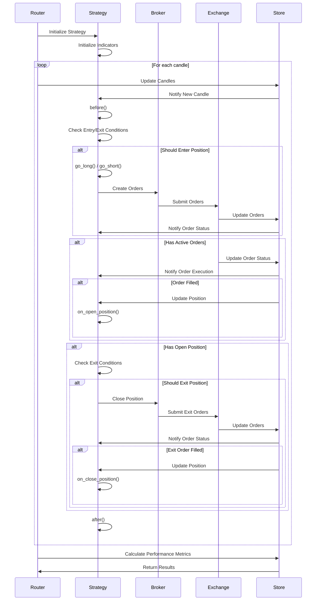
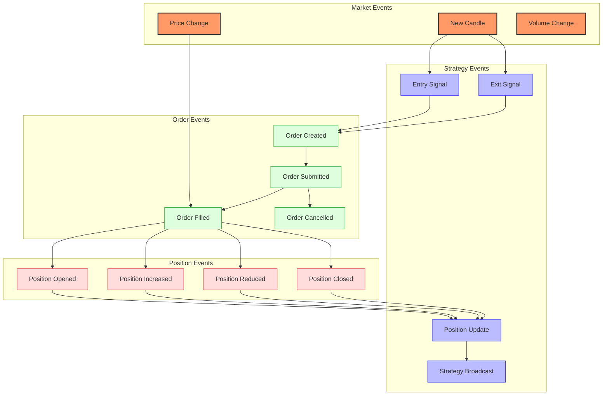
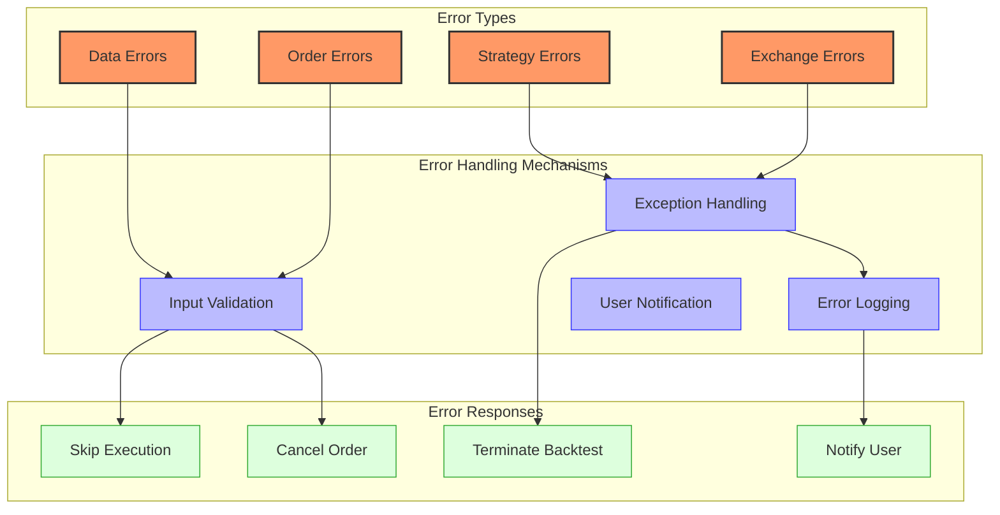

# Jesse Event Flow

## Event Flow Overview



Jesse implements an event-driven architecture that processes market data sequentially and executes trading decisions based on strategy logic. The event flow is designed to simulate the progression of time in financial markets, with each candle representing a discrete time step.

## Event Types and Their Purposes



### Market Events

1. **New Candle**: Represents the arrival of a new price candle.
   - Triggers: Time progression in the market
   - Purpose: Provides new price information for strategy evaluation

2. **Price Change**: Represents changes in the current price.
   - Triggers: Market movements
   - Purpose: Updates current price for order execution and position valuation

3. **Volume Change**: Represents changes in trading volume.
   - Triggers: Market activity
   - Purpose: Provides volume information for strategy evaluation

### Strategy Events

1. **Entry Signal**: Represents a signal to enter a position.
   - Triggers: Strategy conditions being met
   - Purpose: Initiates the process of opening a position

2. **Exit Signal**: Represents a signal to exit a position.
   - Triggers: Strategy conditions being met
   - Purpose: Initiates the process of closing a position

3. **Position Update**: Represents changes in the current position.
   - Triggers: Order execution
   - Purpose: Updates the strategy's position state

4. **Strategy Broadcast**: Represents communication between strategies.
   - Triggers: Position changes, order execution
   - Purpose: Allows strategies to react to events in other strategies

### Order Events

1. **Order Created**: Represents the creation of a new order.
   - Triggers: Strategy decisions
   - Purpose: Initiates the order lifecycle

2. **Order Submitted**: Represents the submission of an order to the exchange.
   - Triggers: Order creation
   - Purpose: Sends the order to the exchange for execution

3. **Order Filled**: Represents the execution of an order.
   - Triggers: Market conditions meeting order criteria
   - Purpose: Updates position and triggers position events

4. **Order Cancelled**: Represents the cancellation of an order.
   - Triggers: Strategy decisions, timeout, or other conditions
   - Purpose: Removes the order from the active orders list

### Position Events

1. **Position Opened**: Represents the opening of a new position.
   - Triggers: Order fill when no position exists
   - Purpose: Establishes a new market position

2. **Position Increased**: Represents an increase in position size.
   - Triggers: Order fill when a position already exists
   - Purpose: Adds to an existing position

3. **Position Reduced**: Represents a decrease in position size.
   - Triggers: Partial position closure
   - Purpose: Reduces an existing position

4. **Position Closed**: Represents the complete closure of a position.
   - Triggers: Full position closure
   - Purpose: Exits the market completely

## Event Processing Sequence

```mermaid
flowchart TD
    subgraph "Initialization Phase"
        Init[Initialize Jesse]:::init
        LoadRoutes[Load Routes]:::init
        CreateStrategies[Create Strategy Instances]:::init
        InitStrategies[Initialize Strategies]:::init
        WarmupCandles[Load Warmup Candles]:::init
    end
    
    subgraph "Candle Processing Phase"
        NextCandle[Next Candle]:::candle
        UpdateStore[Update Store]:::candle
        BeforeMethod[Strategy.before()]:::candle
        CheckEntryExit[Check Entry/Exit Conditions]:::candle
    end
    
    subgraph "Order Processing Phase"
        CreateOrder[Create Order]:::order
        ValidateOrder[Validate Order]:::order
        SubmitOrder[Submit Order]:::order
        UpdateOrderStatus[Update Order Status]:::order
    end
    
    subgraph "Position Management Phase"
        UpdatePosition[Update Position]:::position
        CalculatePnL[Calculate PnL]:::position
        TriggerCallbacks[Trigger Callbacks]:::position
        BroadcastEvent[Broadcast Event]:::position
    end
    
    subgraph "Finalization Phase"
        AfterMethod[Strategy.after()]:::final
        CalculateMetrics[Calculate Metrics]:::final
        GenerateReports[Generate Reports]:::final
        ReturnResults[Return Results]:::final
    end
    
    Init --> LoadRoutes
    LoadRoutes --> CreateStrategies
    CreateStrategies --> InitStrategies
    InitStrategies --> WarmupCandles
    
    WarmupCandles --> NextCandle
    
    NextCandle --> UpdateStore
    UpdateStore --> BeforeMethod
    BeforeMethod --> CheckEntryExit
    
    CheckEntryExit --> CreateOrder
    CreateOrder --> ValidateOrder
    ValidateOrder --> SubmitOrder
    SubmitOrder --> UpdateOrderStatus
    
    UpdateOrderStatus --> UpdatePosition
    UpdatePosition --> CalculatePnL
    CalculatePnL --> TriggerCallbacks
    TriggerCallbacks --> BroadcastEvent
    
    BroadcastEvent --> AfterMethod
    AfterMethod --> NextCandle
    
    NextCandle -- "No more candles" --> CalculateMetrics
    CalculateMetrics --> GenerateReports
    GenerateReports --> ReturnResults
    
    classDef init fill:#f96,stroke:#333,stroke-width:2px;
    classDef candle fill:#bbf,stroke:#33f,stroke-width:1px;
    classDef order fill:#dfd,stroke:#3a3,stroke-width:1px;
    classDef position fill:#fdd,stroke:#d33,stroke-width:1px;
    classDef final fill:#ddf,stroke:#33d,stroke-width:1px;
    
    class Init,LoadRoutes,CreateStrategies,InitStrategies,WarmupCandles init;
    class NextCandle,UpdateStore,BeforeMethod,CheckEntryExit candle;
    class CreateOrder,ValidateOrder,SubmitOrder,UpdateOrderStatus order;
    class UpdatePosition,CalculatePnL,TriggerCallbacks,BroadcastEvent position;
    class AfterMethod,CalculateMetrics,GenerateReports,ReturnResults final;
```

The event processing sequence in Jesse follows a well-defined flow that simulates the progression of market data and trading decisions over time. This sequence can be broken down into several phases:

### 1. Initialization Phase

The initialization phase sets up the trading environment and prepares strategies for execution:

```python
# Initialize Jesse
from jesse.routes import router
from jesse import config
from jesse.store import store

# Load routes
router.initiate(routes, extra_candles)

# Create strategy instances
for r in router.routes:
    StrategyClass = jh.get_strategy_class(r.strategy_name)
    r.strategy = StrategyClass()

# Initialize strategies
for r in router.routes:
    r.strategy.initialize()

# Load warmup candles
store.candles.init_storage(config['env']['data']['warmup_candles_num'])
```

During initialization:
- Routes are loaded and validated
- Strategy instances are created
- Strategies are initialized with their parameters
- Warmup candles are loaded to ensure indicators have enough data

### 2. Candle Processing Phase

After initialization, the system enters the main loop, processing each candle sequentially:

```python
# Main loop in backtest mode
for i in range(0, len(candles)):
    # Update store with new candle
    store.app.time = candles[i][0]
    
    # Execute strategies
    for r in router.routes:
        # Update current candle
        store.candles.update_current_candle(r.exchange, r.symbol, r.timeframe, candles[i])
        
        # Execute strategy
        r.strategy._execute()
```

For each candle:
- The store is updated with the new candle data
- Each strategy's `before()` method is called
- Entry and exit conditions are checked
- Orders are created and executed
- The strategy's `after()` method is called

### 3. Order Processing Phase

When a strategy generates trading signals, orders are created and processed:

```python
# Inside Strategy._execute_long()
def _execute_long(self) -> None:
    self.go_long()
    
    # Validate orders
    if self.buy is None:
        raise exceptions.InvalidStrategy('You forgot to set self.buy')
    
    # Prepare orders
    self._prepare_buy()
    
    # Submit orders
    self._submit_buy_orders()
```

Order processing includes:
- Creating orders with specified parameters
- Validating order parameters
- Submitting orders to the exchange
- Updating order status based on execution

### 4. Position Management Phase

After orders are executed, positions are updated and managed:

```python
# Inside OrdersState.execute_pending_market_orders()
def execute_pending_market_orders(self) -> None:
    for index, order in enumerate(self.pending_market_orders):
        if order.side == sides.BUY:
            self._execute_buy_market_order(order)
        else:
            self._execute_sell_market_order(order)
```

Position management includes:
- Updating position size and entry price
- Calculating profit/loss
- Triggering callbacks (on_open_position, on_close_position)
- Broadcasting position events to other strategies

### 5. Finalization Phase

After all candles have been processed, the system enters the finalization phase:

```python
# Calculate performance metrics
metrics = stats.trades(store.completed_trades.trades)

# Generate reports
if generate_charts:
    charts.equity_curve(store.app.daily_balance)
    charts.trades(store.completed_trades.trades)

# Return results
return metrics
```

During finalization:
- Performance metrics are calculated
- Reports and charts are generated
- Results are returned to the user

## Timing Considerations

```mermaid
gantt
    title Jesse Event Timing
    dateFormat  s
    axisFormat %S
    
    section Candle Processing
    Update Store            :a1, 0, 0.1s
    Strategy.before()       :a2, after a1, 0.2s
    Check Conditions        :a3, after a2, 0.1s
    
    section Order Processing
    Create Orders           :b1, after a3, 0.1s
    Validate Orders         :b2, after b1, 0.1s
    Submit Orders           :b3, after b2, 0.1s
    
    section Position Management
    Update Position         :c1, after b3, 0.1s
    Calculate PnL           :c2, after c1, 0.1s
    Trigger Callbacks       :c3, after c2, 0.2s
    
    section Finalization
    Strategy.after()        :d1, after c3, 0.2s
    Next Candle             :d2, after d1, 0.1s
```



### Order of Operations

In Jesse, the timing and order of operations are critical for realistic simulation. The framework follows these timing principles:

1. **Sequential Processing**: Candles are processed one at a time, in chronological order.

2. **Look-Ahead Bias Prevention**: Strategies only have access to data that would have been available at that point in time.

3. **Order Execution Timing**:
   - Market orders are executed at the current candle's price
   - Limit and stop orders are executed when price conditions are met in subsequent candles

4. **Event Propagation**: Events propagate through the system in a defined order:
   - Candle updates → Strategy execution → Order creation → Order execution → Position updates

### Trade Execution Timing

The timing of trade execution is particularly important for realistic backtesting:

```python
# Market order execution
def _execute_buy_market_order(self, order):
    # Execute at current price
    order.execute(order.price)
    
    # Update position
    position = store.positions.get_position(order.exchange, order.symbol)
    position.increase(order.qty, order.price)
    
    # Trigger callbacks
    strategy = order.strategy
    strategy._on_open_position(order)
```

### Event Broadcasting

Jesse allows strategies to communicate with each other through event broadcasting:

```python
# Broadcasting position events
def _broadcast(self, msg: str) -> None:
    from jesse.routes import router

    for r in router.routes:
        # Skip self
        if r.strategy.id == self.id:
            continue

        if msg == 'route-open-position':
            r.strategy.on_route_open_position(self)
        elif msg == 'route-close-position':
            r.strategy.on_route_close_position(self)
```

This allows strategies to react to events in other strategies, enabling complex multi-strategy systems.

## Error Handling in the Event Flow



Jesse implements several error handling mechanisms to ensure robust execution and provide meaningful feedback to users:

### Data Error Handling

Data errors occur when the input data is invalid or incomplete:

```python
# Validate candle data
def validate_candle(candle: np.ndarray) -> None:
    if candle[1] < candle[4]:
        raise exceptions.InvalidCandle(
            f'Low price cannot be higher than close price: {candle}'
        )
    if candle[2] < candle[1]:
        raise exceptions.InvalidCandle(
            f'High price cannot be lower than low price: {candle}'
        )
```

Common data errors include:
- Missing candles
- Invalid price data (e.g., low price higher than close price)
- Inconsistent timestamps

### Strategy Error Handling

Strategy errors occur when the strategy logic is invalid or inconsistent:

```python
# Validate strategy logic
def _validate_strategy(self) -> None:
    if self.should_long() and self.should_short():
        raise exceptions.ConflictingRules(
            'should_long and should_short should not be true at the same time.'
        )
```

Common strategy errors include:
- Conflicting trading rules
- Missing required methods
- Invalid order parameters

### Order Error Handling

Order errors occur when orders cannot be created or executed properly:

```python
# Validate order parameters
def _validate_qty(qty: float) -> None:
    if qty == 0:
        raise InvalidStrategy('qty cannot be 0.')
```

Common order errors include:
- Invalid quantity
- Invalid price
- Insufficient balance
- Exchange rejection

### Exchange Error Handling

Exchange errors occur when there are issues communicating with the exchange:

```python
# Handle exchange errors in live trading
try:
    response = exchange.create_order(symbol, order_type, side, amount, price)
except ccxt.NetworkError as e:
    logger.error(f'Network error: {e}')
    # Retry logic
except ccxt.ExchangeError as e:
    logger.error(f'Exchange error: {e}')
    # Handle exchange-specific errors
```

Common exchange errors include:
- Network errors
- API rate limits
- Invalid API credentials
- Exchange-specific errors

### Error Logging and Notification

Jesse provides comprehensive error logging and notification:

```python
# Log error and notify user
def handle_error(error: Exception) -> None:
    logger.error(f'Error: {error}')
    
    if jh.is_live():
        notifier.notify(f'Error: {error}')
```

In live trading, errors can be sent to various notification channels (email, Telegram, Discord) to alert the user.

### Graceful Degradation

Jesse implements graceful degradation to handle errors without crashing:

```python
# Handle errors in strategy execution
try:
    strategy._execute()
except Exception as e:
    logger.error(f'Error in strategy execution: {e}')
    # Continue with next strategy
```

This allows the system to continue running even if one strategy encounters an error.
