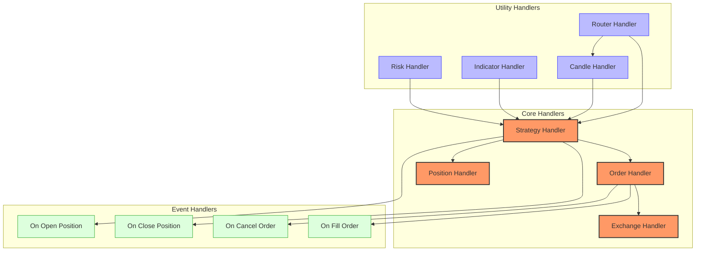
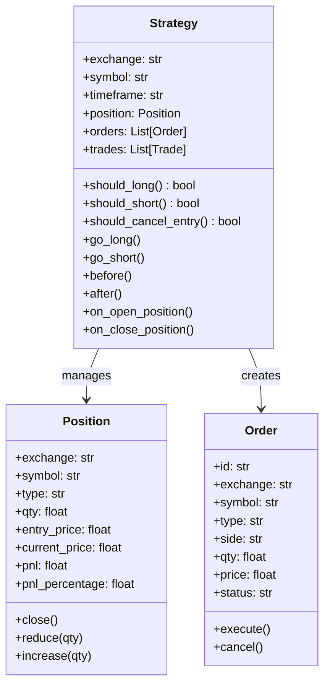
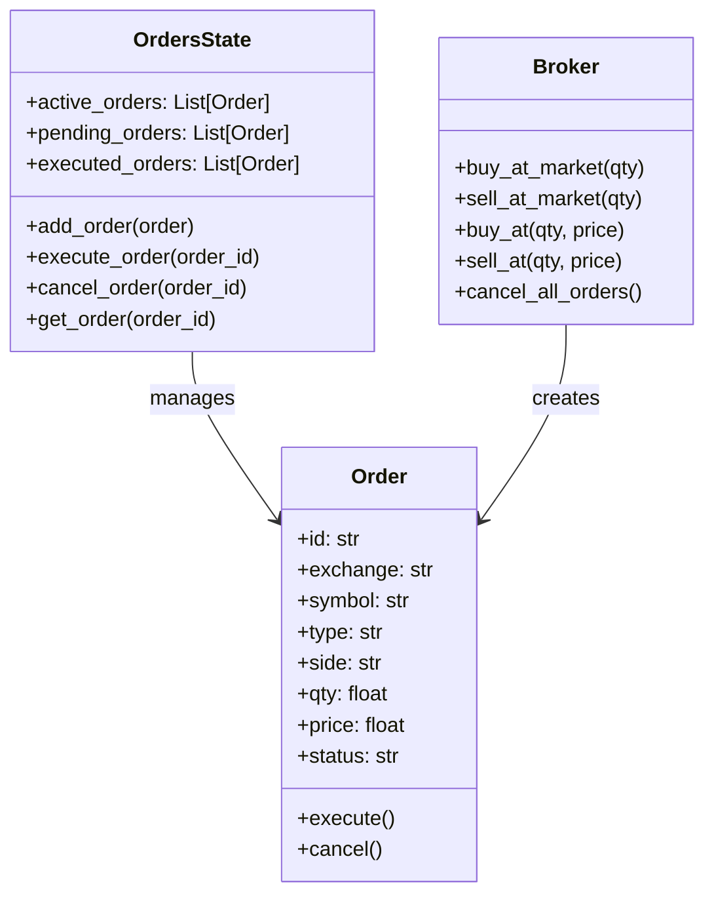
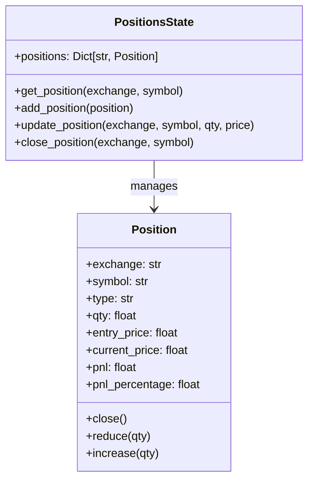
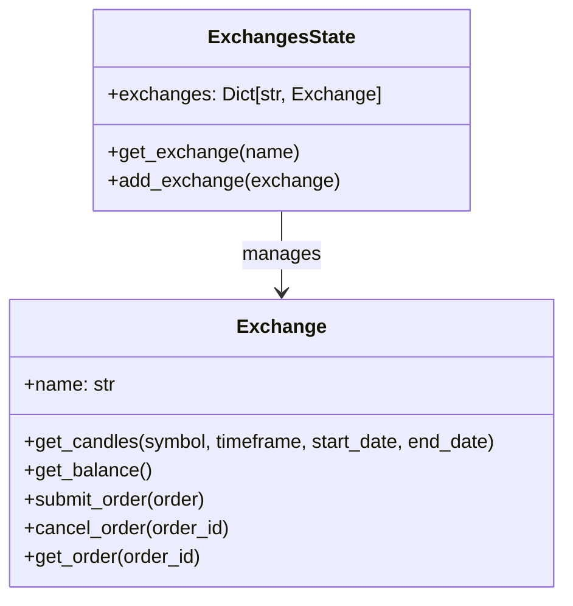
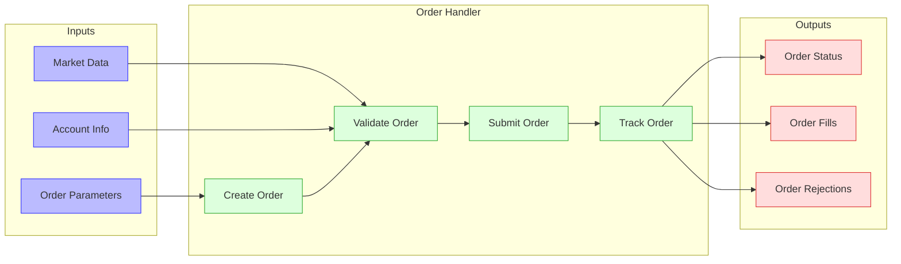
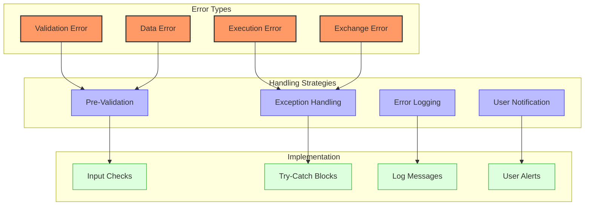
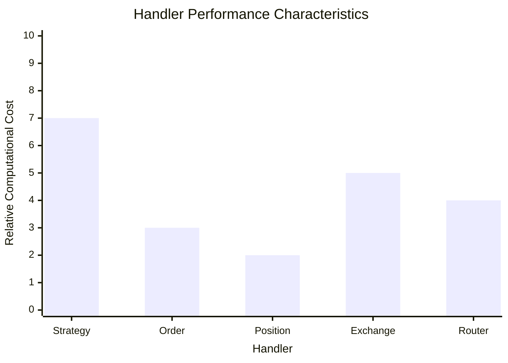
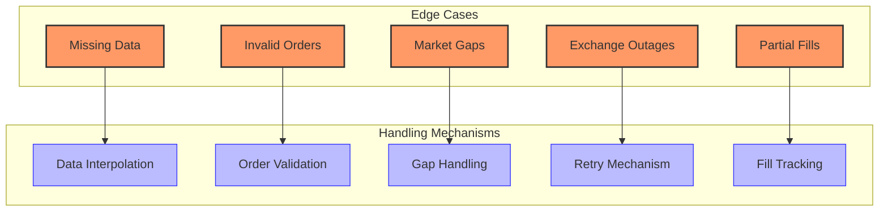

# Jesse Handlers

## Handler Overview



Jesse implements a set of handlers that manage different aspects of the trading system. These handlers work together to process market data, execute trading strategies, manage orders and positions, and interact with exchanges.

## Handler Interfaces and Responsibilities

### Strategy Handler

The Strategy handler is the core component that implements trading logic:



#### Responsibilities:
- Implementing trading logic in methods like `should_long()`, `should_short()`, `go_long()`, and `go_short()`
- Managing entry and exit conditions
- Creating and managing orders
- Handling position management
- Processing market data and generating signals

#### Interface:

```python
class Strategy:
    def __init__(self):
        self.exchange = None
        self.symbol = None
        self.timeframe = None
        self.position = None
        self.trades = []
        self.orders = []
        
    def should_long(self) -> bool:
        """
        Define entry conditions for long positions.
        Returns True if conditions are met, False otherwise.
        """
        return False
        
    def should_short(self) -> bool:
        """
        Define entry conditions for short positions.
        Returns True if conditions are met, False otherwise.
        """
        return False
        
    def should_cancel_entry(self) -> bool:
        """
        Define conditions to cancel entry orders.
        Returns True if conditions are met, False otherwise.
        """
        return False
        
    def go_long(self):
        """
        Define execution details for long entries.
        Set self.buy, self.stop_loss, and self.take_profit.
        """
        pass
        
    def go_short(self):
        """
        Define execution details for short entries.
        Set self.sell, self.stop_loss, and self.take_profit.
        """
        pass
        
    def before(self):
        """
        Called before strategy execution.
        Use this method to calculate indicators.
        """
        pass
        
    def after(self):
        """
        Called after strategy execution.
        Use this method for post-processing.
        """
        pass
        
    def on_open_position(self, order):
        """
        Called when a position is opened.
        """
        pass
        
    def on_close_position(self, order):
        """
        Called when a position is closed.
        """
        pass
```

### Order Handler

The Order handler manages the creation, submission, and execution of orders:



#### Responsibilities:
- Creating orders with specified parameters
- Submitting orders to the exchange
- Tracking order status and execution
- Handling order cancellation
- Managing order lifecycle

#### Interface:

```python
class Order:
    def __init__(self, exchange, symbol, side, type, qty, price=None, reduce_only=False):
        self.id = str(uuid.uuid4())
        self.exchange = exchange
        self.symbol = symbol
        self.side = side
        self.type = type
        self.qty = qty
        self.price = price
        self.reduce_only = reduce_only
        self.status = 'ACTIVE'
        self.created_at = jh.now_to_timestamp()
        self.executed_at = None
        
    def execute(self, price):
        """
        Execute the order at the specified price.
        """
        self.executed_at = jh.now_to_timestamp()
        self.status = 'FILLED'
        
    def cancel(self):
        """
        Cancel the order.
        """
        self.status = 'CANCELED'
```

### Position Handler

The Position handler manages the current market position:



#### Responsibilities:
- Tracking current position size and direction
- Calculating position profit/loss
- Managing position increases and decreases
- Handling position closure
- Providing position information to strategies

#### Interface:

```python
class Position:
    def __init__(self, exchange, symbol, type, qty, entry_price, current_price=None):
        self.exchange = exchange
        self.symbol = symbol
        self.type = type
        self.qty = qty
        self.entry_price = entry_price
        self.current_price = current_price or entry_price
        
    @property
    def pnl(self):
        """
        Calculate position profit/loss.
        """
        if self.type == 'long':
            return (self.current_price - self.entry_price) * self.qty
        else:
            return (self.entry_price - self.current_price) * self.qty
            
    @property
    def pnl_percentage(self):
        """
        Calculate position profit/loss percentage.
        """
        if self.type == 'long':
            return (self.current_price - self.entry_price) / self.entry_price * 100
        else:
            return (self.entry_price - self.current_price) / self.entry_price * 100
            
    def close(self):
        """
        Close the position.
        """
        self.qty = 0
        
    def reduce(self, qty):
        """
        Reduce the position size.
        """
        self.qty -= qty
        
    def increase(self, qty, price):
        """
        Increase the position size.
        """
        # Calculate new average entry price
        total_value = self.entry_price * self.qty + price * qty
        self.qty += qty
        self.entry_price = total_value / self.qty
```

### Exchange Handler

The Exchange handler manages communication with trading exchanges:



#### Responsibilities:
- Communicating with trading exchanges
- Fetching market data (candles, tickers, orderbooks)
- Submitting orders to exchanges
- Handling exchange-specific functionality
- Managing exchange authentication

#### Interface:

```python
class Exchange:
    def __init__(self, name):
        self.name = name
        
    def get_candles(self, symbol, timeframe, start_date, end_date):
        """
        Get historical candles from the exchange.
        """
        pass
        
    def get_balance(self):
        """
        Get account balance from the exchange.
        """
        pass
        
    def submit_order(self, order):
        """
        Submit an order to the exchange.
        """
        pass
        
    def cancel_order(self, order_id):
        """
        Cancel an order on the exchange.
        """
        pass
        
    def get_order(self, order_id):
        """
        Get order information from the exchange.
        """
        pass
```

## Input/Output Specifications

### Strategy Handler I/O

```mermaid
flowchart LR
    subgraph "Inputs"
        Candles[Candles]:::input
        Indicators[Indicators]:::input
        Parameters[Strategy Parameters]:::input
    end
    
    subgraph "Strategy"
        Before[before()]:::process
        ShouldLong[should_long()]:::process
        ShouldShort[should_short()]:::process
        GoLong[go_long()]:::process
        GoShort[go_short()]:::process
        After[after()]:::process
    end
    
    subgraph "Outputs"
        EntryOrders[Entry Orders]:::output
        ExitOrders[Exit Orders]:::output
        StopLoss[Stop Loss]:::output
        TakeProfit[Take Profit]:::output
    end
    
    Candles --> Before
    Indicators --> Before
    Parameters --> Before
    
    Before --> ShouldLong
    Before --> ShouldShort
    
    ShouldLong --> GoLong
    ShouldShort --> GoShort
    
    GoLong --> EntryOrders
    GoLong --> StopLoss
    GoLong --> TakeProfit
    
    GoShort --> EntryOrders
    GoShort --> StopLoss
    GoShort --> TakeProfit
    
    EntryOrders --> After
    ExitOrders --> After
    
    classDef input fill:#bbf,stroke:#33f,stroke-width:1px;
    classDef process fill:#dfd,stroke:#3a3,stroke-width:1px;
    classDef output fill:#fdd,stroke:#d33,stroke-width:1px;
    
    class Candles,Indicators,Parameters input;
    class Before,ShouldLong,ShouldShort,GoLong,GoShort,After process;
    class EntryOrders,ExitOrders,StopLoss,TakeProfit output;
```

#### Inputs:
- **Candles**: OHLCV price data for the current symbol and timeframe
- **Indicators**: Technical indicators calculated from price data
- **Parameters**: User-defined strategy parameters

#### Outputs:
- **Entry Orders**: Orders to enter positions (buy/sell)
- **Exit Orders**: Orders to exit positions (close)
- **Stop Loss**: Stop loss orders to limit losses
- **Take Profit**: Take profit orders to secure gains

#### Example:

```python
class MyStrategy(Strategy):
    def __init__(self):
        super().__init__()
        
        # Define parameters
        self.sma_period = 20
        self.rsi_period = 14
        self.risk_per_trade = 0.02  # 2% risk per trade
        
    def before(self):
        # Calculate indicators (inputs)
        self.sma = ta.sma(self.candles, self.sma_period)
        self.rsi = ta.rsi(self.candles, self.rsi_period)
        
    def should_long(self):
        # Generate long signals
        return self.price < self.sma and self.rsi < 30
        
    def go_long(self):
        # Calculate position size based on risk
        entry_price = self.price
        stop_loss = entry_price * 0.95
        risk_amount = self.balance * self.risk_per_trade
        position_size = risk_amount / (entry_price - stop_loss)
        
        # Create entry order (output)
        self.buy = position_size, entry_price
        
        # Set stop loss and take profit (outputs)
        self.stop_loss = position_size, stop_loss
        self.take_profit = position_size, entry_price * 1.15
```

### Order Handler I/O



#### Inputs:
- **Order Parameters**: Type, side, quantity, price, etc.
- **Market Data**: Current price, orderbook, etc.
- **Account Info**: Balance, positions, etc.

#### Outputs:
- **Order Status**: Current status of orders (active, filled, canceled)
- **Fills**: Information about executed orders
- **Rejections**: Information about rejected orders

#### Example:

```python
# Create a market buy order
def buy_at_market(self, qty):
    # Input: Order parameters
    order = Order(
        exchange=self.exchange,
        symbol=self.symbol,
        side='buy',
        type='MARKET',
        qty=qty
    )
    
    # Process: Validate order
    if not self._validate_order(order):
        # Output: Order rejection
        return None
    
    # Process: Submit order
    store.orders.add_order(order)
    
    # In backtest mode, execute immediately
    if jh.is_backtesting():
        order.execute(self.price)
        
        # Output: Order fill
        self._on_order_filled(order)
    
    return order
```

## Error Handling Strategies



Jesse implements several error handling strategies to ensure robust execution:

### Pre-Validation

Jesse validates inputs before execution to prevent errors:

```python
# Validate order parameters
def _validate_order(self, order):
    # Check if order quantity is valid
    if order.qty <= 0:
        logger.error(f"Invalid order quantity: {order.qty}")
        return False
    
    # Check if order price is valid (for limit orders)
    if order.type == 'LIMIT' and order.price is None:
        logger.error("Limit order must have a price")
        return False
    
    # Check if account has enough balance
    required_margin = order.qty * order.price
    if required_margin > self.available_margin:
        logger.error(f"Insufficient margin: required {required_margin}, available {self.available_margin}")
        return False
    
    return True
```

### Exception Handling

Jesse uses try-except blocks to handle exceptions:

```python
# Handle exceptions in strategy execution
def _execute(self):
    try:
        # Execute strategy
        self.before()
        
        # Check entry/exit conditions
        self._check_entry()
        self._check_exit()
        
        self.after()
    except Exception as e:
        logger.error(f"Error executing strategy: {e}")
        logger.error(traceback.format_exc())
```

### Error Logging

Jesse logs errors for debugging and analysis:

```python
# Log errors
def log_error(message, e=None):
    logger.error(message)
    
    if e is not None:
        logger.error(f"Exception: {e}")
        logger.error(traceback.format_exc())
    
    # Store error in database
    if jh.is_live():
        from jesse.services.db import database
        database.errors.insert_one({
            'timestamp': jh.now_to_timestamp(),
            'message': message,
            'exception': str(e) if e is not None else None,
            'traceback': traceback.format_exc() if e is not None else None
        })
```

### User Notification

In live trading, Jesse notifies users of errors:

```python
# Notify user of errors
def notify_error(message):
    if jh.is_live():
        # Send notification via configured channels
        from jesse.services.notifier import notify
        
        notify(f"ERROR: {message}")
```

## Performance Considerations



### Performance Optimization Techniques

Jesse implements several performance optimization techniques:

1. **Numpy for Indicator Calculation**:
   - Uses NumPy for efficient indicator calculation
   - Vectorized operations for better performance
   - Pre-calculation of indicators in `before()` method

   ```python
   # Efficient indicator calculation with NumPy
   def before(self):
       # Calculate SMA using NumPy's efficient operations
       self.sma = ta.sma(self.candles, 20)
   ```

2. **Efficient Data Structures**:
   - Uses NumPy arrays for candle data
   - Uses dictionaries for fast lookups
   - Minimizes object creation during backtesting

   ```python
   # Efficient candle storage
   class CandlesState:
       def __init__(self):
           self.storage = {}
           
       def add_candle(self, exchange, symbol, timeframe, candle):
           key = f"{exchange}-{symbol}-{timeframe}"
           if key not in self.storage:
               self.storage[key] = np.zeros((1000, 6))
           
           # Add candle to storage using NumPy operations
           self.storage[key] = np.vstack((self.storage[key][1:], candle))
   ```

3. **Lazy Evaluation**:
   - Calculates values only when needed
   - Uses properties for derived values
   - Avoids redundant calculations

   ```python
   # Lazy evaluation with properties
   class Position:
       def __init__(self, exchange, symbol, qty, entry_price):
           self.exchange = exchange
           self.symbol = symbol
           self.qty = qty
           self.entry_price = entry_price
           self._current_price = None
       
       @property
       def pnl(self):
           # Calculate PnL only when accessed
           if self.qty == 0:
               return 0
           
           return (self.current_price - self.entry_price) * self.qty
   ```

4. **Caching**:
   - Caches frequently accessed data
   - Uses memoization for expensive calculations
   - Invalidates cache when data changes

   ```python
   # Caching with memoization
   @lru_cache(maxsize=100)
   def get_candles(exchange, symbol, timeframe, start_date, end_date):
       # Expensive operation to fetch candles
       # Result is cached for future calls with the same parameters
       return fetch_candles(exchange, symbol, timeframe, start_date, end_date)
   ```

## Edge Cases and Their Handling



Jesse handles various edge cases to ensure robust execution:

### Missing Data

Jesse handles missing candle data through interpolation:

```python
# Handle missing candles
def handle_missing_candles(candles):
    # Check for missing candles
    timestamps = candles[:, 0]
    expected_interval = (timestamps[-1] - timestamps[0]) / (len(timestamps) - 1)
    
    # Find gaps
    gaps = []
    for i in range(1, len(timestamps)):
        if timestamps[i] - timestamps[i-1] > expected_interval * 1.5:
            gaps.append((i-1, i))
    
    # Interpolate missing candles
    for start, end in gaps:
        missing_count = int((timestamps[end] - timestamps[start]) / expected_interval) - 1
        
        for j in range(missing_count):
            # Create interpolated candle
            timestamp = timestamps[start] + expected_interval * (j + 1)
            interpolated_candle = np.array([
                timestamp,
                candles[start, 4],  # Use previous close as open
                candles[start, 4],  # Use previous close as high
                candles[start, 4],  # Use previous close as low
                candles[start, 4],  # Use previous close as close
                0                   # Zero volume
            ])
            
            # Insert interpolated candle
            candles = np.insert(candles, start + j + 1, interpolated_candle, axis=0)
    
    return candles
```

### Invalid Orders

Jesse validates orders before submission:

```python
# Validate orders
def validate_order(order):
    # Check if symbol is valid
    if order.symbol not in supported_symbols:
        return False, "Invalid symbol"
    
    # Check if quantity is valid
    if order.qty <= 0:
        return False, "Invalid quantity"
    
    # Check if price is valid for limit orders
    if order.type == 'LIMIT' and order.price <= 0:
        return False, "Invalid price for limit order"
    
    # Check if account has enough balance
    required_margin = calculate_required_margin(order)
    if required_margin > available_margin:
        return False, "Insufficient margin"
    
    return True, "Order is valid"
```

### Market Gaps

Jesse handles market gaps in price data:

```python
# Handle market gaps
def handle_gap(current_candle, previous_candle):
    # Check for gap
    gap_threshold = previous_candle[4] * 0.05  # 5% threshold
    
    if current_candle[1] > previous_candle[4] + gap_threshold:  # Gap up
        # Check for stop orders that would be triggered
        for order in store.orders.active_orders:
            if order.type == 'STOP' and order.price < current_candle[1]:
                # Execute at gap price
                order.execute(current_candle[1])
    
    elif current_candle[1] < previous_candle[4] - gap_threshold:  # Gap down
        # Check for stop orders that would be triggered
        for order in store.orders.active_orders:
            if order.type == 'STOP' and order.price > current_candle[1]:
                # Execute at gap price
                order.execute(current_candle[1])
```

### Exchange Outages

Jesse implements retry mechanisms for exchange outages:

```python
# Handle exchange outages
def execute_with_retry(func, *args, max_retries=3, retry_delay=1, **kwargs):
    for attempt in range(max_retries):
        try:
            return func(*args, **kwargs)
        except (ConnectionError, TimeoutError) as e:
            if attempt == max_retries - 1:
                logger.error(f"Max retries reached: {e}")
                raise
            
            logger.warning(f"Connection error, retrying in {retry_delay}s: {e}")
            time.sleep(retry_delay)
            retry_delay *= 2  # Exponential backoff
```

### Partial Fills

Jesse tracks partial fills for orders:

```python
# Handle partial fills
def handle_partial_fill(order, filled_qty):
    # Update order
    order.filled_qty = filled_qty
    
    # Check if fully filled
    if order.filled_qty >= order.qty:
        order.status = 'FILLED'
        # Process complete fill
        process_fill(order)
    else:
        # Process partial fill
        process_partial_fill(order)
        
        # Create new order for remaining quantity
        remaining_qty = order.qty - order.filled_qty
        new_order = Order(
            exchange=order.exchange,
            symbol=order.symbol,
            side=order.side,
            type=order.type,
            qty=remaining_qty,
            price=order.price
        )
        
        # Add new order to active orders
        store.orders.add_order(new_order)
```
