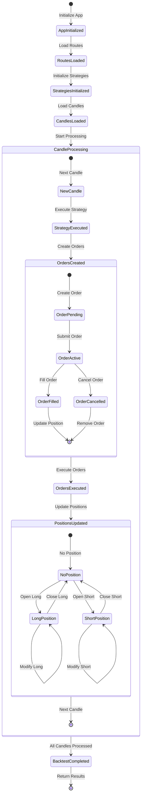
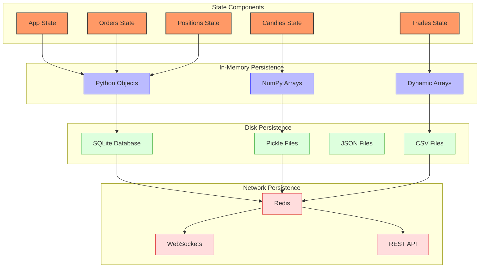
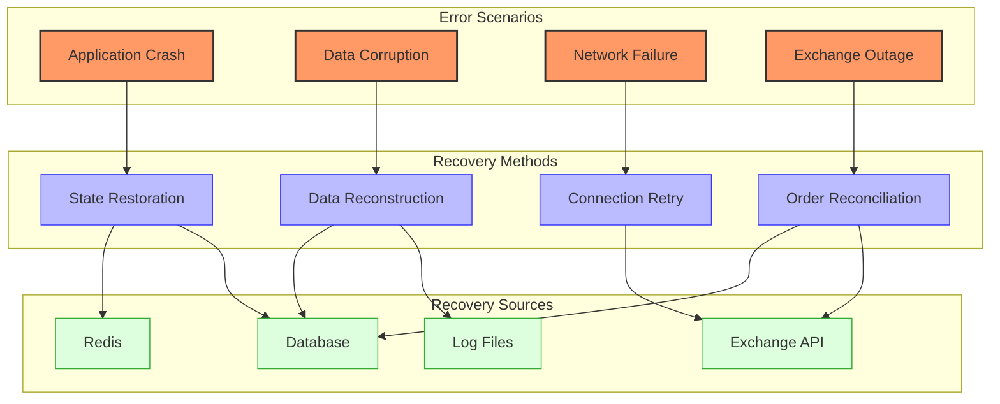
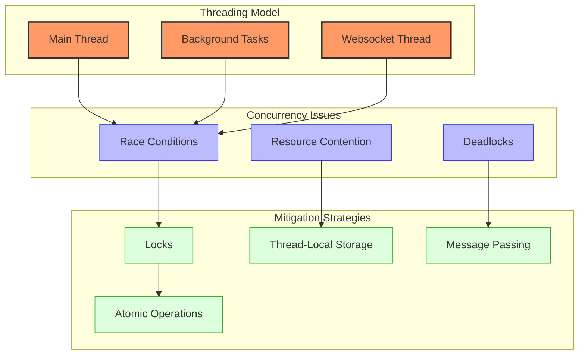

# Jesse State Management

## State Model Overview

```mermaid
graph TD
    subgraph "Core State Components"
        AppState[App State]:::core
        OrdersState[Orders State]:::core
        PositionsState[Positions State]:::core
        CandlesState[Candles State]:::core
        TradesState[Trades State]:::core
    end
    
    subgraph "App State"
        Time[Current Time]:::app
        Balance[Account Balance]:::app
        SessionInfo[Session Info]:::app
    end
    
    subgraph "Orders State"
        ActiveOrders[Active Orders]:::orders
        PendingOrders[Pending Orders]:::orders
        OrderHistory[Order History]:::orders
    end
    
    subgraph "Positions State"
        OpenPositions[Open Positions]:::positions
        PositionHistory[Position History]:::positions
    end
    
    subgraph "Candles State"
        CurrentCandles[Current Candles]:::candles
        HistoricalCandles[Historical Candles]:::candles
    end
    
    subgraph "Trades State"
        ActiveTrades[Active Trades]:::trades
        CompletedTrades[Completed Trades]:::trades
    end
    
    AppState --> Time
    AppState --> Balance
    AppState --> SessionInfo
    
    OrdersState --> ActiveOrders
    OrdersState --> PendingOrders
    OrdersState --> OrderHistory
    
    PositionsState --> OpenPositions
    PositionsState --> PositionHistory
    
    CandlesState --> CurrentCandles
    CandlesState --> HistoricalCandles
    
    TradesState --> ActiveTrades
    TradesState --> CompletedTrades
    
    classDef core fill:#f96,stroke:#333,stroke-width:2px;
    classDef app fill:#bbf,stroke:#33f,stroke-width:1px;
    classDef orders fill:#dfd,stroke:#3a3,stroke-width:1px;
    classDef positions fill:#fdd,stroke:#d33,stroke-width:1px;
    classDef candles fill:#ddf,stroke:#33d,stroke-width:1px;
    classDef trades fill:#ffd,stroke:#dd3,stroke-width:1px;
    
    class AppState,OrdersState,PositionsState,CandlesState,TradesState core;
    class Time,Balance,SessionInfo app;
    class ActiveOrders,PendingOrders,OrderHistory orders;
    class OpenPositions,PositionHistory positions;
    class CurrentCandles,HistoricalCandles candles;
    class ActiveTrades,CompletedTrades trades;
```



Jesse implements a comprehensive state management system through the `Store` class, which maintains the current state of the application, including orders, positions, trades, and candles. This centralized state management ensures data consistency across the system and provides a single source of truth for all components.

### Core State Components

1. **App State**: Manages the overall state of the application, including the current time, account balance, and session information.

2. **Orders State**: Manages the state of orders, including active orders, pending orders, and order history.

3. **Positions State**: Manages the state of positions, including open positions and position history.

4. **Candles State**: Manages the state of candles, including current candles and historical candles.

5. **Trades State**: Manages the state of trades, including active trades and completed trades.

### State Representation

In Jesse, state is represented through a combination of Python classes and their attributes:

```python
# Store class definition
class StoreClass:
    app = AppState()
    orders = OrdersState()
    completed_trades = ClosedTrades()
    logs = LogsState()
    exchanges = ExchangesState()
    candles = CandlesState()
    positions = PositionsState()
    tickers = TickersState()
    trades = TradesState()
    orderbooks = OrderbookState()

    def __init__(self) -> None:
        self.vars = {}

    def reset(self, force_install_routes: bool = False) -> None:
        """
        Resets all the states within the store
        """
        if not jh.is_unit_testing() or force_install_routes:
            install_routes()

        self.app = AppState()
        self.orders = OrdersState()
        self.completed_trades = ClosedTrades()
        self.logs = LogsState()
        self.exchanges = ExchangesState()
        self.candles = CandlesState()
        self.positions = PositionsState()
        self.tickers = TickersState()
        self.trades = TradesState()
        self.orderbooks = OrderbookState()
```

## State Transitions and Triggers



### App State Transitions

1. **Initialization to Routes Loaded**:
   - Triggered by: Starting a new backtest or live trading session
   - Actions: Initialize the app state, load routes
   - State Changes: `app.time` set to start time, `app.starting_time` set

2. **Routes Loaded to Strategies Initialized**:
   - Triggered by: Loading routes
   - Actions: Create strategy instances, initialize strategies
   - State Changes: Strategies added to routes

3. **Strategies Initialized to Candles Loaded**:
   - Triggered by: Initializing strategies
   - Actions: Load historical candles, initialize indicators
   - State Changes: `candles` state populated with historical data

4. **Candles Loaded to Candle Processing**:
   - Triggered by: Loading candles
   - Actions: Start processing candles
   - State Changes: `app.time` updated with current candle time

5. **Candle Processing to Backtest Completed**:
   - Triggered by: Processing all candles
   - Actions: Calculate performance metrics, generate reports
   - State Changes: `app.ending_time` set, metrics calculated

### Order State Transitions

1. **Creation to Pending**:
   - Triggered by: Strategy creating an order
   - Actions: Create order object, add to pending orders
   - State Changes: Order added to `orders.pending_orders`

2. **Pending to Active**:
   - Triggered by: Submitting order to exchange
   - Actions: Submit order, update order status
   - State Changes: Order moved from `pending_orders` to `active_orders`

3. **Active to Filled**:
   - Triggered by: Order execution
   - Actions: Execute order, update order status
   - State Changes: Order removed from `active_orders`, trade created

4. **Active to Cancelled**:
   - Triggered by: Order cancellation
   - Actions: Cancel order, update order status
   - State Changes: Order removed from `active_orders`

### Position State Transitions

1. **No Position to Long/Short**:
   - Triggered by: Order fill when no position exists
   - Actions: Create position, update position state
   - State Changes: Position added to `positions.open_positions`

2. **Long/Short to Modified Long/Short**:
   - Triggered by: Order fill when position exists
   - Actions: Update position size, entry price
   - State Changes: Position in `positions.open_positions` updated

3. **Long/Short to No Position**:
   - Triggered by: Position closure
   - Actions: Close position, update position state
   - State Changes: Position removed from `positions.open_positions`

## Persistence Mechanisms



Jesse provides several mechanisms for persisting state, depending on the execution mode and requirements:

### In-Memory Persistence

During execution, all state is maintained in memory through Python objects:

```python
# In-memory state management
class CandlesState:
    def __init__(self):
        self.storage = {}
        
    def init_storage(self, count: int) -> None:
        self.storage = {}
        
    def add_candle(self, exchange: str, symbol: str, timeframe: str, candle: np.ndarray) -> None:
        key = self._key(exchange, symbol, timeframe)
        if key not in self.storage:
            self.storage[key] = {
                'candles': np.zeros((count, 6)),
                'current_candle': np.zeros((1, 6)),
            }
        # Add candle to storage
        self.storage[key]['candles'] = np.append(self.storage[key]['candles'][1:], [candle], axis=0)
```

### Database Persistence

For longer-term storage, Jesse can persist state to a SQLite database:

```python
# Database persistence for completed trades
def store_trade_into_db(trade):
    from jesse.services.db import database
    
    database.trades.insert_one({
        'id': trade.id,
        'exchange': trade.exchange,
        'symbol': trade.symbol,
        'type': trade.type,
        'qty': trade.qty,
        'entry_price': trade.entry_price,
        'exit_price': trade.exit_price,
        'entry_time': trade.entry_time,
        'exit_time': trade.exit_time,
        'profit': trade.pnl,
        'profit_percentage': trade.pnl_percentage,
        'strategy_name': trade.strategy_name,
    })
```

### File Persistence

Jesse can also persist state to files for later analysis:

```python
# CSV persistence for backtest results
def store_logs(logs: list, path: str) -> None:
    import csv
    
    with open(path, 'w', newline='') as f:
        writer = csv.writer(f)
        writer.writerow(['timestamp', 'message'])
        for log in logs:
            writer.writerow([log['timestamp'], log['message']])
```

### Redis Persistence

In live trading mode, Jesse uses Redis for real-time state persistence and communication:

```python
# Redis persistence for live trading
def sync_publish(event: str, msg, compression: bool = False):
    if jh.is_unit_testing():
        raise EnvironmentError('sync_publish() should be NOT called during testing. There must be something wrong')

    if compression:
        msg = jh.gzip_compress(msg)
        # Encode the compressed message using Base64
        msg = base64.b64encode(msg).decode('utf-8')

    sync_redis.publish(
        f"{ENV_VALUES['APP_PORT']}:channel:1", json.dumps({
            'id': os.getpid(),
            'event': f'{jh.app_mode()}.{event}',
            'is_compressed': compression,
            'data': msg
        }, ignore_nan=True, cls=NpEncoder)
    )
```

## Recovery Procedures



Jesse implements several recovery procedures to handle various failure scenarios:

### Application Crash Recovery

When the application crashes, Jesse can restore its state from persistent storage:

```python
# Restore state from database
def restore_state_from_db():
    from jesse.services.db import database
    
    # Restore trades
    trades = database.trades.find({})
    for trade_data in trades:
        trade = Trade(
            trade_data['id'],
            trade_data['exchange'],
            trade_data['symbol'],
            trade_data['type'],
            trade_data['qty'],
            trade_data['entry_price'],
            trade_data['exit_price'],
            trade_data['entry_time'],
            trade_data['exit_time'],
        )
        store.completed_trades.add_trade(trade)
    
    # Restore other state components
    # ...
```

### Data Corruption Recovery

In case of data corruption, Jesse can reconstruct data from logs or other sources:

```python
# Reconstruct candles from alternative sources
def reconstruct_candles(exchange: str, symbol: str, timeframe: str, start_date: str, end_date: str):
    from jesse.services.candle import get_candles
    
    # Get candles from alternative source
    candles = get_candles(exchange, symbol, timeframe, start_date, end_date)
    
    # Update candles state
    for candle in candles:
        store.candles.add_candle(exchange, symbol, timeframe, candle)
```

### Network Failure Recovery

When network failures occur, Jesse implements retry mechanisms:

```python
# Retry mechanism for network failures
def fetch_with_retry(url: str, max_retries: int = 3, retry_delay: int = 1):
    import requests
    import time
    
    for attempt in range(max_retries):
        try:
            response = requests.get(url)
            return response.json()
        except requests.exceptions.RequestException as e:
            if attempt == max_retries - 1:
                raise e
            time.sleep(retry_delay * (2 ** attempt))  # Exponential backoff
```

### Order Reconciliation

After an exchange outage, Jesse can reconcile orders with the exchange:

```python
# Reconcile orders with exchange
def reconcile_orders(exchange: str):
    from jesse.services.exchange import get_exchange
    
    # Get open orders from exchange
    exchange_instance = get_exchange(exchange)
    exchange_orders = exchange_instance.get_open_orders()
    
    # Get open orders from local state
    local_orders = store.orders.get_open_orders(exchange)
    
    # Reconcile differences
    for exchange_order in exchange_orders:
        if exchange_order.id not in [o.id for o in local_orders]:
            # Order exists on exchange but not locally
            store.orders.add_exchange_order(exchange_order)
    
    for local_order in local_orders:
        if local_order.id not in [o.id for o in exchange_orders]:
            # Order exists locally but not on exchange
            store.orders.cancel_local_order(local_order.id)
```

## Thread Safety and Concurrency Considerations



Jesse's threading model and concurrency considerations vary depending on the execution mode:

### Backtesting Mode

In backtesting mode, Jesse operates in a single thread, which simplifies state management:

```python
# Single-threaded execution in backtesting mode
def run_backtest():
    # Initialize
    # ...
    
    # Process candles sequentially
    for i in range(len(candles)):
        # Update time
        store.app.time = candles[i][0]
        
        # Execute strategies
        for r in router.routes:
            r.strategy._execute()
    
    # Calculate metrics
    # ...
```

### Live Trading Mode

In live trading mode, Jesse uses multiple threads for different tasks:

```python
# Multi-threaded execution in live trading mode
def run_live():
    # Start websocket thread for market data
    websocket_thread = threading.Thread(target=start_websocket)
    websocket_thread.daemon = True
    websocket_thread.start()
    
    # Start main trading loop
    while True:
        # Process new market data
        process_market_data()
        
        # Execute strategies
        for r in router.routes:
            r.strategy._execute()
        
        # Sleep to avoid high CPU usage
        time.sleep(0.1)
```

### Thread Safety Mechanisms

Jesse implements several thread safety mechanisms for live trading:

1. **Locks**: Used to prevent race conditions when accessing shared resources:

```python
# Using locks for thread safety
class ThreadSafeDict:
    def __init__(self):
        self._dict = {}
        self._lock = threading.Lock()
    
    def get(self, key, default=None):
        with self._lock:
            return self._dict.get(key, default)
    
    def set(self, key, value):
        with self._lock:
            self._dict[key] = value
```

2. **Message Passing**: Used for communication between threads:

```python
# Using Redis for message passing between threads
def publish_message(channel: str, message: dict):
    sync_redis.publish(channel, json.dumps(message))

def subscribe_to_messages(channel: str, callback):
    pubsub = sync_redis.pubsub()
    pubsub.subscribe(channel)
    
    for message in pubsub.listen():
        if message['type'] == 'message':
            callback(json.loads(message['data']))
```

3. **Thread-Local Storage**: Used to isolate state between threads:

```python
# Using thread-local storage
thread_local = threading.local()

def get_thread_local_state():
    if not hasattr(thread_local, 'state'):
        thread_local.state = {}
    return thread_local.state
```

4. **Atomic Operations**: Used for operations that must be performed as a single unit:

```python
# Using atomic operations
def atomic_update(key, update_func):
    with redis_lock.Lock(sync_redis, f"lock:{key}"):
        value = sync_redis.get(key)
        new_value = update_func(value)
        sync_redis.set(key, new_value)
```

### Concurrency Best Practices

Jesse follows several best practices for concurrent programming:

1. **Minimize Shared State**: Limit the amount of state shared between threads
2. **Use Message Passing**: Prefer message passing over shared memory for thread communication
3. **Implement Proper Locking**: Use locks to protect shared resources
4. **Avoid Nested Locks**: Prevent deadlocks by avoiding nested locks
5. **Use Thread-Safe Data Structures**: Use data structures designed for concurrent access
