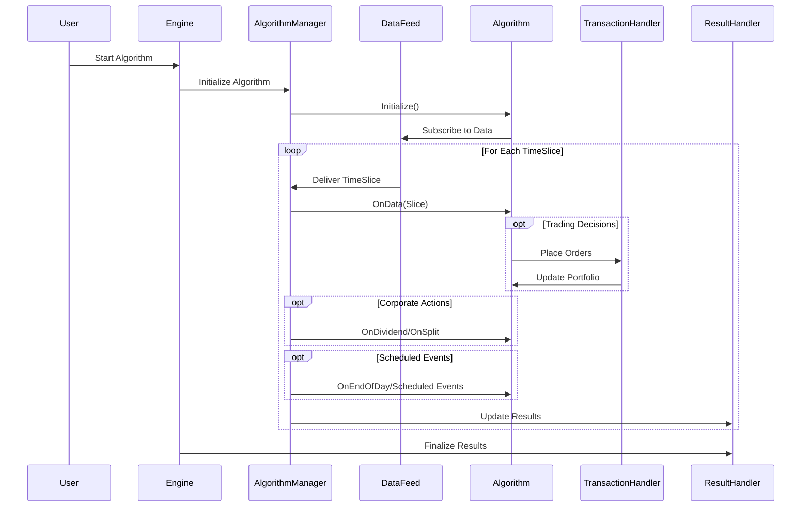

# Event Flow in LEAN

## Detailed Event Flow

LEAN operates on an event-driven architecture where the core `AlgorithmManager` orchestrates the flow of data and events through the system. This document outlines the event flow in LEAN, explaining how different components interact and process data.

## Event Types and Purposes

LEAN processes several types of events:

### 1. Time Events

- **Engine Initialization**: System startup and initialization of core components.
- **TimeSlice Generation**: The core data structure encapsulating all data for a specific time point.
- **Scheduled Events**: User-defined events executed on specific schedules.
- **End-of-Day Events**: Special handling for market close and daily reconciliation.

### 2. Data Events

- **Market Data**: Price, volume, and other market data delivered through Slice objects.
- **Universe Selection**: Events for selecting securities in dynamic universes.
- **Fundamental Data**: Company financial data events for fundamental analysis.
- **Custom Data**: User-defined data sources delivered through the same pipeline.

### 3. Algorithm Events

- **OnData**: Main event handler for receiving market data.
- **OnOrderEvent**: Notifications of order status changes.
- **OnSecuritiesChanged**: Notifications of universe membership changes.
- **OnEndOfDay**: End-of-trading-day event handler.
- **OnEndOfAlgorithm**: Final event before algorithm shutdown.

### 4. Portfolio Events

- **Fill Events**: Order execution notifications.
- **Cash/Holdings Updates**: Portfolio state changes.
- **Margin Calls**: Notifications of margin requirement violations.

## Event Processing Sequence

The sequence of event processing in LEAN follows a well-defined pattern:

1. **Initialization Phase**:
   - Algorithm.Initialize() is called
   - Securities are registered
   - Data subscriptions are established
   - Universe selection criteria are defined

2. **Warmup Phase** (Optional):
   - Historical data is processed to warm up indicators
   - No trading occurs, only simulation of data flow

3. **Main Processing Loop**:
   - TimeSlice objects containing all data are generated
   - Data is synchronized to ensure proper ordering
   - Algorithm.OnData() is called with a Slice of data
   - Trading decisions are executed through order placement
   - Portfolio is updated based on fills and market data
   - Corporate actions are processed (dividends, splits)
   - Scheduled events are triggered as appropriate
   - Results are recorded

4. **Termination Phase**:
   - Final portfolio valuation
   - Statistical analysis of performance
   - Results serialization

## Timing Considerations

LEAN's event processing takes timing into account in several ways:

- **TimeZone Management**: All data is synchronized to a consistent time zone to prevent timing errors.
- **Event Synchronization**: Events from different data sources are properly ordered and synchronized.
- **Fillforward**: Missing data points are handled through configurable fill-forward mechanisms.
- **Market Hours**: Events respect market trading hours and handle market open/close correctly.
- **Latency Modeling**: In live trading, realistic latency can be modeled in the order execution process.

## Error Handling in the Event Flow

LEAN implements robust error handling in its event flow:

- **Algorithm Isolation**: Algorithmic code runs in an isolated environment to prevent crashes.
- **Timeouts**: Algorithm execution is monitored for timeouts to prevent infinite loops.
- **Exception Handling**: Exceptions are caught, logged, and can optionally terminate the algorithm.
- **Data Validation**: Incoming data is validated to prevent processing of corrupted or invalid information.
- **Self-Healing**: In live trading, the system can recover from certain types of failures.

The event flow architecture of LEAN is designed to provide a consistent environment for backtesting and live trading, with the same code running in both modes to ensure strategy consistency across development and production. 