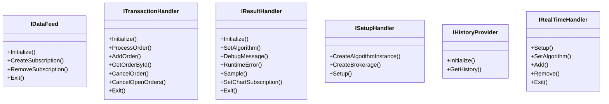

# Handlers in LEAN

## Handler Interfaces and Responsibilities

LEAN uses a modular architecture with specialized handlers for different aspects of the trading system. Each handler implements a specific interface and has well-defined responsibilities.

### Key Handler Interfaces



## Handler Implementation Details

### Data Feed Handlers

LEAN provides two primary data feed implementations:

1. **FileSystemDataFeed** for backtesting:
   - Reads historical data from local files or databases
   - Emulates real-time data flow in a controlled environment
   - Supports accelerated simulation for rapid testing

```csharp
// The simplified structure of data feed handling
public class FileSystemDataFeed : IDataFeed
{
    public void Initialize(
        IAlgorithm algorithm,
        AlgorithmNodePacket job,
        IResultHandler resultHandler,
        IMapFileProvider mapFileProvider,
        IFactorFileProvider factorFileProvider,
        IDataProvider dataProvider,
        IDataFeedSubscriptionManager subscriptionManager,
        IDataFeedTimeProvider dataFeedTimeProvider,
        IDataChannelProvider dataChannelProvider)
    {
        // Setup data subscriptions and synchronizer
    }
    
    public Subscription CreateSubscription(SubscriptionRequest request)
    {
        // Create appropriate subscription based on data type
    }
    
    // Additional implementation details omitted
}
```

2. **LiveTradingDataFeed** for live trading:
   - Connects to real-time data sources
   - Manages data queue handlers for different brokerages
   - Handles reconnections and data recovery

### Transaction Handlers

Transaction handlers manage order lifecycle and execution:

1. **BacktestingTransactionHandler**:
   - Simulates order filling based on configured models
   - Implements fill, fee, and slippage models for realistic simulation
   - Processes orders synchronously

2. **BrokerageTransactionHandler**:
   - Communicates with live brokerages
   - Manages local order book state
   - Processes real-time fill events
   - Handles order status synchronization

```csharp
// Example of order processing in transaction handler
public class BrokerageTransactionHandler : ITransactionHandler
{
    // Submit an order to the brokerage
    public bool ProcessOrder(IAlgorithm algorithm, Order order)
    {
        // Order validation
        if (order.Quantity == 0) return false;
        
        // Connect to brokerage and submit
        try
        {
            _brokerage.PlaceOrder(order);
            return true;
        }
        catch (Exception err)
        {
            algorithm.Error($"Error submitting order: {err.Message}");
            return false;
        }
    }
    
    // Additional implementation details omitted
}
```

### Result Handlers

Result handlers manage algorithm output and performance tracking:

1. **BacktestingResultHandler**:
   - Collects performance metrics during simulation
   - Generates detailed statistics and charts
   - Outputs results in various formats (JSON, CSV)

2. **LiveTradingResultHandler**:
   - Streams real-time performance metrics
   - Manages notifications and alerts
   - Provides live charting capabilities

### Setup Handlers

Setup handlers initialize the algorithm and prepare the execution environment:

1. **BacktestingSetupHandler**:
   - Loads and initializes the algorithm
   - Sets up data subscriptions
   - Configures the simulation environment

2. **BrokerageSetupHandler**:
   - Initializes connection to the brokerage
   - Synchronizes portfolio state
   - Establishes market data connections

## Input/Output Specifications

### Data Handler I/O

**Inputs**:
- Security definitions (Symbol, Resolution, DataType)
- Subscription requests
- Configuration parameters

**Outputs**:
- TimeSlice objects containing consolidated data
- Subscription instances
- Data feed status information

### Transaction Handler I/O

**Inputs**:
- Order requests (Symbol, Type, Quantity, Price)
- Cancel requests
- Update requests

**Outputs**:
- Order events (fills, rejections, cancellations)
- Order books
- Trade record

### Result Handler I/O

**Inputs**:
- Algorithm state updates
- Debug messages
- Error information
- Performance samples

**Outputs**:
- Logs
- Performance reports
- Charts and plots
- Notifications

## Error Handling Strategies

LEAN implements a comprehensive error handling approach:

1. **Graceful Degradation**:
   - Critical handlers attempt to continue operation after errors
   - Non-critical errors are logged without stopping execution

2. **Retry Mechanisms**:
   - Network operations implement retry with backoff
   - Transient errors are handled automatically when possible

3. **User Notification**:
   - Critical errors trigger notifications
   - Detailed error information is logged for diagnostics

4. **Isolation**:
   - Algorithm errors are isolated from the core system
   - Handler failures are contained to minimize impact

## Performance Considerations

Handlers are optimized for performance in several ways:

1. **Data Feed Optimization**:
   - Efficient data caching
   - Batch processing of data points
   - Memory-mapped files for large datasets

2. **Transaction Processing**:
   - Asynchronous order submission
   - Batched updates
   - Dedicated processing thread

3. **Result Processing**:
   - Background sampling
   - Configurable reporting frequency
   - Efficient data serialization

## Edge Cases and Their Handling

LEAN handlers address various edge cases:

1. **Incomplete or Missing Data**:
   - Configurable fill-forward behavior
   - Warning generation for data gaps
   - Data quality metrics

2. **Connection Failures**:
   - Automatic reconnection attempts
   - Failure notification
   - State recovery upon reconnection

3. **Order Execution Edge Cases**:
   - Partial fills
   - Rejected orders
   - Out-of-sequence fills
   - Stale order detection

4. **Resource Constraints**:
   - Memory usage monitoring
   - Adaptive resource allocation
   - Performance degradation detection

The handler architecture in LEAN provides a clean separation of concerns, allowing for customization and extension of various system components while maintaining a consistent interface for algorithm development. 