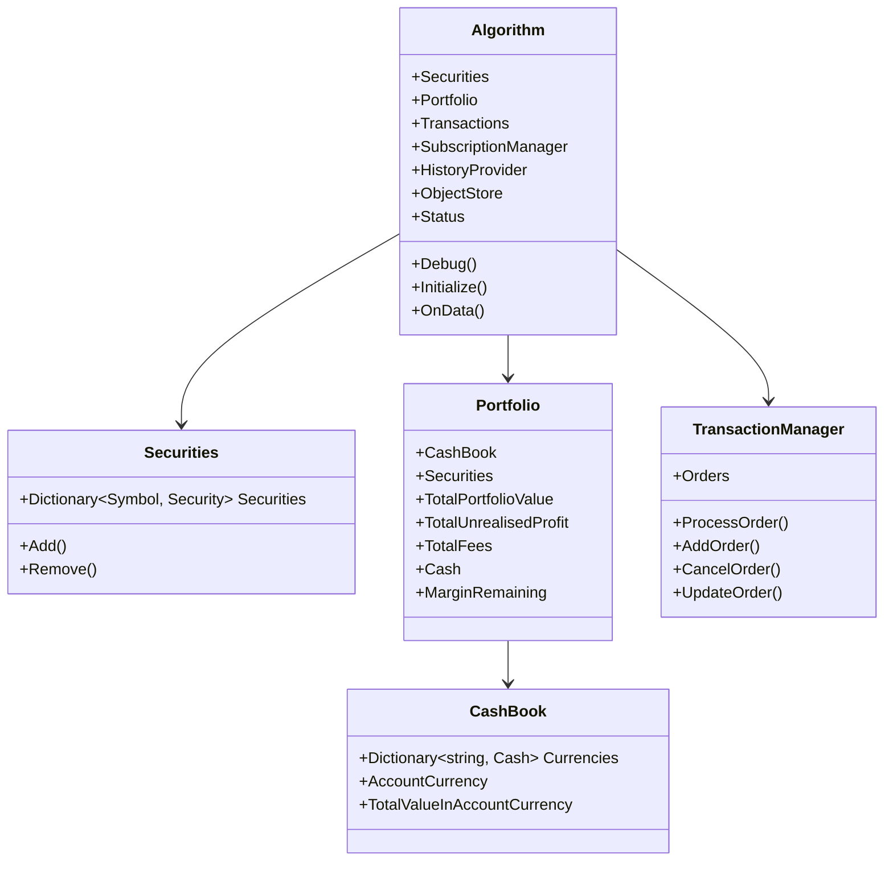
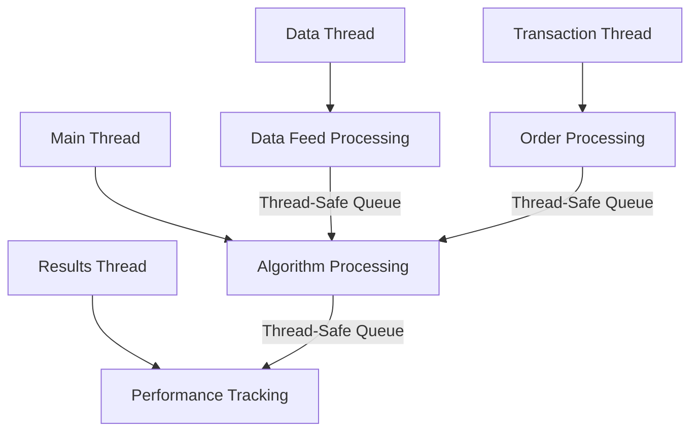

# State Management in LEAN

## State Model Description

LEAN implements a comprehensive state management system to track and maintain the various aspects of an algorithm's execution. The state model is designed to be consistent between backtesting and live trading environments, ensuring that strategies behave identically in both scenarios.

### Core State Components



## State Transitions and Triggers

LEAN's state model transitions through various states during algorithm execution:

1. **Algorithm Status States**:
   - `Initializing`: Algorithm is being set up
   - `Running`: Normal operation during backtest or live trading
   - `Stopped`: Algorithm has completed execution normally
   - `Liquidated`: All positions have been closed
   - `Deleted`: Algorithm has been terminated by user request
   - `RuntimeError`: Algorithm encountered an error during execution
   - `InQueue`: Algorithm is waiting to be executed
   - `History`: Algorithm is processing historical data
   - `WarmingUp`: Algorithm is in warmup mode to initialize indicators

2. **Order States**:
   - `New`: Order created but not submitted
   - `Submitted`: Order sent to broker
   - `PartiallyFilled`: Some quantity executed
   - `Filled`: Completely executed
   - `Canceled`: Order canceled before execution
   - `CancelPending`: Cancellation requested
   - `None`: Initial state
   - `Invalid`: Order is invalid
   - `UpdateSubmitted`: Order update has been submitted

3. **Portfolio State Changes**: 
   - Triggered by market data updates
   - Triggered by fill events
   - Triggered by cash adjustments (dividends, fees)
   - Triggered by currency fluctuations

## Persistence Mechanisms

LEAN provides several mechanisms to persist and recover state:

### In-Memory State

The primary state of the algorithm is maintained in memory during execution, providing fast access and updates. This includes:

- Security holdings and prices
- Order book state
- Cash balances
- Real-time indicators

### Database Persistence

For live trading and recovery, LEAN can persist state to databases:

```csharp
// Example of using the ObjectStore for persistence
public override void Initialize()
{
    // Store important algorithm state
    ObjectStore.Save("portfolio_state", Portfolio);
    
    // Later, retrieve it (e.g., after restart)
    if (ObjectStore.ContainsKey("portfolio_state"))
    {
        var savedPortfolio = ObjectStore.Read<PortfolioState>("portfolio_state");
        // Restore state from saved portfolio
    }
}
```

### Checkpointing

LEAN supports checkpointing in live trading to enable recovery from failures:

- Regular snapshots of algorithm state
- Automated recovery from most recent checkpoint
- Transaction journal to replay missed events

## Recovery Procedures

LEAN implements several recovery mechanisms:

1. **Restart Recovery**:
   - Algorithm state is loaded from persistent storage
   - Data subscriptions are reestablished
   - Trading is resumed from the point of failure

2. **Order Recovery**:
   - Open order status is reconciled with the broker
   - Partially filled orders are updated
   - Missing fills are processed

3. **Portfolio Reconciliation**:
   - Actual broker positions are compared with internal model
   - Discrepancies are resolved (optionally with user intervention)
   - Cash balances are synchronized

4. **Data Feed Recovery**:
   - Missed data points are backfilled where possible
   - Data subscriptions are reestablished
   - Connection to data providers is restored

## Thread Safety and Concurrency Considerations

LEAN's state management is designed with concurrency in mind:



### Synchronization Mechanisms

1. **Thread-Safe Collections**:
   - Concurrent dictionaries for securities and orders
   - Thread-safe queues for event processing

2. **Lock-Based Synchronization**:
   - Critical sections protected by locks
   - Minimized lock contention through careful design

3. **Atomic Operations**:
   - Use of interlocked operations for counters
   - Immutable data structures where appropriate

4. **Message Passing**:
   - Inter-thread communication via message queues
   - Event-based architecture to decouple components

### Live Trading Considerations

In live trading, additional concurrency considerations include:

- **Data Feed Threads**: Separate threads for real-time data processing
- **Broker Communication**: Dedicated threads for broker API communication
- **Result Processing**: Background processing of performance metrics
- **Scheduled Event Processing**: Timers and scheduled tasks

The sophisticated state management system in LEAN ensures that algorithms maintain consistent state across backtesting and live trading environments, with proper handling of concurrency and recovery from failures. 