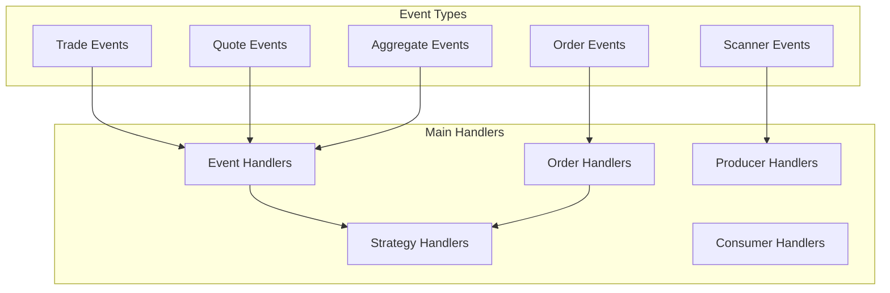

# LiuAlgoTrader Handlers

## Handler Overview

LiuAlgoTrader uses a variety of handlers to process different types of events throughout the system. Handlers are specialized functions that listen for specific events and execute corresponding actions. This document details the handler interfaces, their responsibilities, and how they interact with the rest of the system.



## Handler Interfaces and Responsibilities

### Event Handlers

Event handlers process market data events received from data providers:

1. **handle_data_queue_msg**: Entry point for all data events in consumer processes
   - Determines event type and routes to appropriate handler
   - Handles queue overload situations
   - Updates performance metrics

2. **handle_trade_update**: Processes order execution events
   - Updates order status (filled, partially filled, cancelled)
   - Triggers callbacks in strategies
   - Updates position information
   - Records trades in the database

3. **handle_quote**: Processes bid/ask quote events
   - Updates bid/ask information
   - Applies quote filtering based on conditions
   - Processes large lot sizes

4. **handle_aggregate**: Processes time-based aggregate events
   - Updates per-minute and per-second price aggregates
   - Maintains OHLC data
   - Calculates derived values (VWAP, etc.)
   - Triggers strategy execution

```python
async def handle_data_queue_msg(
    data: Dict, trader: Trader, data_loader: DataLoader, carrier=None
) -> bool:
    if data["EV"] == "new_strategy":
        await handle_new_strategy(
            batch_id=config.batch_id,
            portfolio_id=data["portfolio_id"],
            parameters=data["parameters"],
            data_loader=data_loader,
        )
        return True

    # Skip data messages if more than 5 seconds old
    ts = pd.Timestamp.fromtimestamp(
        int(data.get("timestamp", 0) / 1000) if "timestamp" in data else time.time()
    )
    now = pd.Timestamp.now(tz=ts.tz)
    if now - ts >= timedelta(seconds=5):
        return False

    symbol = data["symbol"].lower()
    if symbol.upper() in config.ignored_symbols:
        return False

    if data["EV"] == "T":
        return await handle_trade_update_wo_order(
            Trade(
                client_order_id=data.get("i"),
                symbol=symbol,
                order_id=data.get("i"),
                exchange=data.get("x", data.get("z")),
                side=Order.FillSide.BUY
                if data.get("s", data.get("sd")) == "buy"
                else Order.FillSide.SELL,
                qty=float(data.get("q", data.get("sz"))),
                price=float(data.get("p", data.get("p"))),
                timestamp=str(ts),
                fee=float(data.get("f", 0.0)),
                status=OrderStatus.FILLED,
            )
        )
    elif data["EV"] == "Q":
        return await handle_quote(data)
    elif data["EV"] in ("A", "AM"):
        return await handle_aggregate(
            symbol=symbol,
            trader=trader,
            data_loader=data_loader,
            ts=ts,
            data=data,
            carrier=carrier,
        )
    return False
```

### Order Handlers

Order handlers manage the lifecycle of orders from creation to completion:

1. **submit_order**: Submits orders to the broker
   - Converts strategy decision to broker API format
   - Handles different order types (market, limit, etc.)
   - Records order intent in the database

2. **order_inflight**: Monitors in-flight orders
   - Checks for stale orders
   - Applies timeout and cancellation policies
   - Recovers from missed order events

3. **update_filled_order**: Processes completed orders
   - Updates position information
   - Triggers strategy callbacks
   - Records trade completion
   - Updates indicators and performance metrics

4. **update_partially_filled_order**: Handles partial order fills
   - Updates partial position information
   - Records partial trade execution
   - Maintains order status for remaining quantity

```python
async def submit_order(
    trader: Trader, symbol: str, what: Dict, external_account_id: str = None
) -> Order:
    o = None
    try:
        if what.get("type", "market") == "market":
            o = await trader.submit_order(
                symbol=symbol,
                qty=what["qty"],
                side=what["side"],
                order_type=what["type"],
                time_in_force="day",
                external_account_id=external_account_id,
            )
        elif what.get("type", "market") == "limit":
            o = await trader.submit_order(
                symbol=symbol,
                qty=what["qty"],
                side=what["side"],
                order_type=what["type"],
                time_in_force="day",
                limit_price=what["limit_price"],
                external_account_id=external_account_id,
            )
    except Exception as e:
        tlog(f"Exception in submit_order(): {e}")
        if config.debug_enabled:
            exc_info = sys.exc_info()
            lines = traceback.format_exception(*exc_info)
            for line in lines:
                tlog(f"error: {line}")
            traceback.print_exception(*exc_info)
            del exc_info
    return o
```

### Strategy Handlers

Strategy handlers manage the execution of trading strategies:

1. **do_strategy**: Executes a single strategy for a specific symbol
   - Calls the strategy's run() method
   - Processes the strategy's decision
   - Submits orders based on the decision

2. **do_strategies**: Executes all relevant strategies for a specific symbol
   - Filters strategies based on symbol
   - Ensures strategy execution order
   - Prevents conflicting decisions

3. **create_strategies_from_file**: Instantiates strategies from configuration
   - Loads strategy classes dynamically
   - Applies configuration parameters
   - Initializes strategy state

4. **create_strategies_from_db**: Loads strategies from the database
   - Retrieves strategy configuration from the database
   - Instantiates strategies dynamically
   - Applies stored parameters

```python
async def do_strategy(
    strategy: Strategy,
    symbol: str,
    shortable: bool,
    position: float,
    data_loader: DataLoader,
    trader: Trader,
    minute_history: df,
    now: pd.Timestamp,
    portfolio_value: Optional[float],
    carrier=None,
) -> bool:
    try:
        if not minute_history.empty:
            do, what = await strategy.run(
                symbol=symbol,
                shortable=shortable,
                position=position,
                minute_history=minute_history,
                now=now,
                portfolio_value=portfolio_value,
                trade_fee=config.trade_fee,
                backtesting=False,
                carrier=carrier,
            )
            return (
                await execute_strategy_result(
                    strategy=strategy,
                    trader=trader,
                    data_loader=data_loader,
                    symbol=symbol,
                    what=what,
                )
                if do
                else False
            )
    except Exception as e:
        tlog(f"[Exception] strategy {strategy.name} -> {e}")
        if config.debug_enabled:
            tlog_exception(str(e))
    return False
```

### Producer Handlers

Producer handlers manage the interaction with data providers:

1. **run**: Initializes connections to data providers
   - Sets up WebSocket connections
   - Establishes API credentials
   - Initializes data streaming

2. **subscribe**: Subscribes to data for specific symbols
   - Registers interest in symbols with data providers
   - Specifies event types of interest
   - Manages subscription limits

3. **scanner_input**: Processes scanner results
   - Receives newly discovered symbols
   - Maps symbols to consumer queues
   - Initiates data subscriptions

```python
async def scanner_input(
    scanner_queue: Queue,
    queues: List[Queue],
    num_consumer_processes: int,
) -> None:
    tlog("scanner_input() task starting ")

    while True:
        try:
            await scanners_iteration(
                scanner_queue=scanner_queue,
                queues=queues,
                num_consumer_processes=num_consumer_processes,
            )
        except Empty:
            await asyncio.sleep(30)
        except asyncio.CancelledError:
            tlog("scanner_input() task task cancelled ")
            break
        except Exception as e:
            tlog(
                f"Exception in scanner_input(): exception of type {type(e).__name__} with args {e.args}"
            )
            if config.debug_enabled:
                exc_info = sys.exc_info()
                lines = traceback.format_exception(*exc_info)
                for line in lines:
                    tlog(f"error: {line}")
                traceback.print_exception(*exc_info)
                del exc_info

    tlog("scanner_input() task completed")
```

### Consumer Handlers

Consumer handlers manage the consumer process lifecycle:

1. **consumer_async_main**: Main entry point for consumer processes
   - Initializes database connections
   - Creates strategy instances
   - Sets up event processing loop

2. **queue_consumer**: Processes events from the queue
   - Dequeues events from the consumer queue
   - Routes events to appropriate handlers
   - Manages queue backlog

3. **periodic_runner**: Executes periodic tasks
   - Runs strategies that need periodic execution
   - Performs housekeeping tasks
   - Maintains system health

4. **cancel_lingering_orders**: Monitors and cancels stale orders
   - Identifies orders that have been open too long
   - Applies cancellation policies
   - Frees up capital for new trades

```python
async def queue_consumer(
    batch_id: str, queue: Queue, data_loader: DataLoader, trader: Trader
) -> None:
    tlog(f"queue_consumer() task starting for {batch_id}")

    try:
        # For each message in the queue
        while True:
            try:
                try:
                    data = queue.get(timeout=1)
                except Empty:
                    await asyncio.sleep(0)
                    continue

                if data is None:
                    break

                await handle_data_queue_msg(data, trader, data_loader)

            except Exception as e:
                tlog(
                    f"Exception in queue_consumer(): exception of type {type(e).__name__} with args {e.args}"
                )
                if config.debug_enabled:
                    tlog_exception("queue_consumer")
    except asyncio.CancelledError:
        tlog("queue_consumer() cancelled ")
    except Exception as e:
        tlog(
            f"Exception in queue_consumer(): exception of type {type(e).__name__} with args {e.args}"
        )
        if config.debug_enabled:
            tlog_exception("queue_consumer")

    tlog("queue_consumer() task completed")
```

## Error Handling Strategies

LiuAlgoTrader implements robust error handling across all handlers:

### Exception Isolation

1. **Process-Level Isolation**:
   - Exceptions in one consumer process don't affect others
   - Producer process errors are isolated from consumers
   - Scanner process errors don't disrupt trading

2. **Strategy-Level Isolation**:
   - Exceptions in one strategy don't affect others
   - Strategy errors are caught and logged
   - Failed strategies can be skipped while others continue

3. **Event-Level Isolation**:
   - Errors processing one event don't block other events
   - Event handling errors are caught and logged
   - Event processing continues with the next event

```python
try:
    # Execute strategy
    do, what = await strategy.run(
        symbol=symbol,
        shortable=shortable,
        position=position,
        minute_history=minute_history,
        now=now,
        portfolio_value=portfolio_value,
        trade_fee=config.trade_fee,
        backtesting=False,
    )
except Exception as e:
    tlog(f"[Exception] strategy {strategy.name} -> {e}")
    if config.debug_enabled:
        tlog_exception(str(e))
    return False
```

### Queue Management

1. **Queue Overflow Handling**:
   - If consumer falls behind, old events are discarded
   - Priority is given to recent events
   - Consumer logs when it's falling behind

2. **Timeout Mechanisms**:
   - Events older than configurable thresholds are discarded
   - Stale orders are automatically cancelled
   - Long-running operations have timeouts

3. **Backpressure Strategies**:
   - Producer slows down if consumers can't keep up
   - Scanner frequency is adjusted based on load
   - System resources are monitored and managed

```python
# Skip data messages if more than 5 seconds old
ts = pd.Timestamp.fromtimestamp(
    int(data.get("timestamp", 0) / 1000) if "timestamp" in data else time.time()
)
now = pd.Timestamp.now(tz=ts.tz)
if now - ts >= timedelta(seconds=5):
    return False
```

### Logging and Diagnostics

1. **Extensive Logging**:
   - Errors are logged with context information
   - Stack traces are recorded in debug mode
   - Log entries include timestamp and batch_id

2. **Performance Monitoring**:
   - Data latency is tracked and reported
   - Queue lengths are monitored
   - Execution times are measured

3. **Tracing Support**:
   - OpenTelemetry integration
   - Cross-process event tracing
   - Google Cloud Monitoring integration

```python
if config.debug_enabled:
    exc_info = sys.exc_info()
    lines = traceback.format_exception(*exc_info)
    for line in lines:
        tlog(f"error: {line}")
    traceback.print_exception(*exc_info)
    del exc_info
```

### Recovery Mechanisms

1. **Order Recovery**:
   - Periodic checks for order status
   - Re-fetching of positions if needed
   - Handling of unexpected order states

2. **Connectivity Recovery**:
   - Automatic reconnection to data providers
   - Backfill mechanisms for missed data
   - Connection pooling for database access

3. **Process Recovery**:
   - Session continuity across restarts
   - Position reconciliation
   - State reconstruction from database 