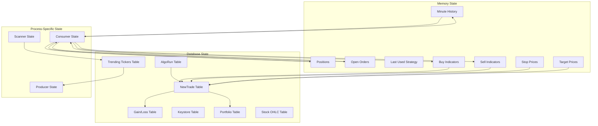
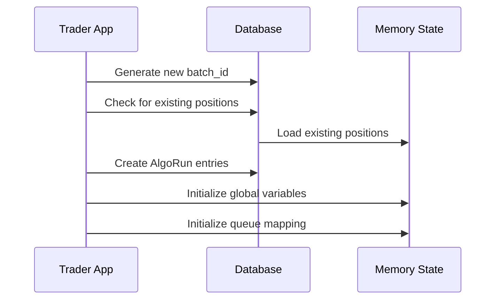
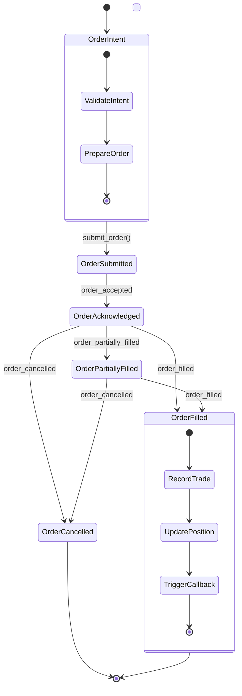
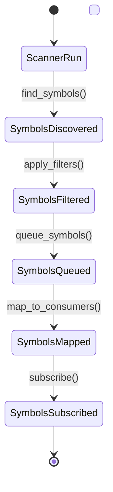

# LiuAlgoTrader State Management

## State Model Overview

LiuAlgoTrader implements a comprehensive state management system that maintains the current state of orders, positions, symbols, and strategy-specific data. The state is managed across multiple processes using a database for persistence and global variables for in-memory access.



## State Components

### Database State

LiuAlgoTrader uses PostgreSQL to persist state across trading sessions with the following key tables:

1. **algo_run**: Tracks each execution of a strategy per batch_id and process
   - batch_id
   - start/end timestamps
   - strategy name
   - environment (PAPER, BACKTEST, PROD)

2. **new_trades**: Records all trading operations (including partial fills)
   - symbol
   - amount and price
   - algo_run_id reference
   - timestamps (database and client)
   - target/stop prices
   - indicators (JSON) for strategy-specific data

3. **gain_loss**: Stores profit/loss for each symbol and strategy per batch
   - Percentage and absolute value
   - Used for performance analysis

4. **trending_tickers**: Tracks selected stocks per batch_id with timestamps

5. **keystore**: Key-value repository for strategies to track values across batch executions

6. **stock_ohlc**: Daily OHLC values for stocks and cached indicators

7. **portfolio**: Tracks securities value over time

### Memory State

The framework maintains in-memory state through shared global variables in the `trading_data` module:

1. **minute_history**: Dictionary of DataFrames with OHLC, volume, vwap per minute per symbol
2. **positions**: Dictionary of currently open positions
3. **open_orders**: Dictionary tracking active orders by symbol
4. **last_used_strategy**: Dictionary tracking which strategy last operated on each symbol
5. **buy_indicators**: Dictionary storing buy decision indicators per symbol
6. **sell_indicators**: Dictionary storing sell decision indicators per symbol
7. **stop_prices**: Dictionary storing stop-loss prices per symbol
8. **target_prices**: Dictionary storing price targets per symbol

### Process-Specific State

Each process maintains its own state:

1. **Producer State**:
   - Symbol to consumer queue mapping
   - WebSocket subscriptions
   - Data latency tracking

2. **Consumer State**:
   - Assigned symbols
   - Strategy instances
   - Event processing queue

3. **Scanner State**:
   - Scanner configuration
   - Previously discovered symbols

## State Transitions

### Session Initialization



1. The trader application generates a new unique batch_id
2. It checks for existing positions from previous interrupted sessions
3. Positions are loaded into memory
4. AlgoRun entries are created in the database
5. Global state variables are initialized

### Order Execution State Flow



1. Strategy returns a trading decision
2. Order is validated and prepared
3. Order is submitted to the broker
4. Order state is tracked through acknowledgment, partial fills, and completion
5. Trade is recorded in the database
6. Position is updated in memory
7. Strategy callbacks are triggered

### Scanner to Symbol State Flow



1. Scanner runs according to configuration
2. Symbols meeting criteria are discovered
3. Filters are applied (price range, volume, etc.)
4. Symbols are queued for processing
5. Symbols are mapped to consumer processes
6. Data provider subscribes to updates for these symbols

## Persistence Mechanisms

LiuAlgoTrader employs several persistence mechanisms:

1. **Database Persistence**:
   - All trades, indicators, and session data are stored in PostgreSQL
   - Batch-based persistence for analysis and backtracking
   - Transaction support for atomic operations

2. **Key-Value Store**:
   - The keystore table provides persistence across trading sessions
   - Strategies can store and retrieve values by key
   - Useful for maintaining state across different batch executions

3. **End-of-Day Persistence**:
   - Gain/loss calculations are automated at session end
   - Trade analysis data is stored for later review
   - Performance metrics are calculated and stored

## Recovery Procedures

LiuAlgoTrader implements several recovery mechanisms:

1. **Position Recovery**:
   - On startup, checks for existing positions from previous sessions
   - Reattaches positions to new batch_id if found
   - Ensures continuity across interrupted sessions

2. **Order Tracking**:
   - Periodic checks for order status updates
   - Recovery from missed order events
   - Timeout and cancellation for stale orders

3. **Data Recovery**:
   - Backfill mechanism for missed data points
   - Aggregation to ensure consistent OHLC data
   - Gap detection and handling

## Thread Safety and Concurrency

LiuAlgoTrader's state management is designed with concurrency in mind:

1. **Process Isolation**:
   - Each consumer process has isolated memory space
   - Producer process manages symbol to consumer mapping
   - Scanner process operates independently

2. **Database Concurrency**:
   - Connection pooling for efficient database access
   - Transaction isolation for concurrent operations
   - Connection retries and error handling

3. **Asyncio for Cooperative Multitasking**:
   - Each process uses asyncio for non-blocking operations
   - Events are processed cooperatively within a process
   - Critical sections are handled through asyncio primitives

## State Management Examples

### Trading Data Global Variables

```python
# Global variables in common/trading_data.py
positions: Dict[str, float] = {}
minute_history: Dict[str, pd.DataFrame] = {}
open_orders: Dict[str, Order] = {}
last_used_strategy: Dict[str, Strategy] = {}
buy_indicators: Dict[str, Dict] = {}
sell_indicators: Dict[str, Dict] = {}
stop_prices: Dict[str, float] = {}
target_prices: Dict[str, float] = {}
```

### Strategy Keystore Usage

```python
# Store value in keystore
await self.store("last_model_update", datetime.now().isoformat())

# Retrieve value from keystore
last_update = await self.retrieve("last_model_update")
if last_update:
    last_update_time = datetime.fromisoformat(last_update)
```

### Order Status Tracking

```python
# Handle order updates
async def handle_trade_update(trade: Trade) -> bool:
    if trade.symbol in open_orders:
        order = open_orders[trade.symbol]
        if trade.order_id == order.id:
            # Update order status
            if trade.status == OrderStatus.FILLED:
                # Process filled order
                await update_filled_order(
                    symbol=trade.symbol,
                    strategy=open_order_strategy[trade.symbol],
                    filled_qty=trade.qty,
                    filled_avg_price=trade.price,
                    side=trade.side,
                    updated_at=pd.Timestamp(trade.timestamp),
                    trade_fee=trade.fee,
                )
                return True
    return False
``` 