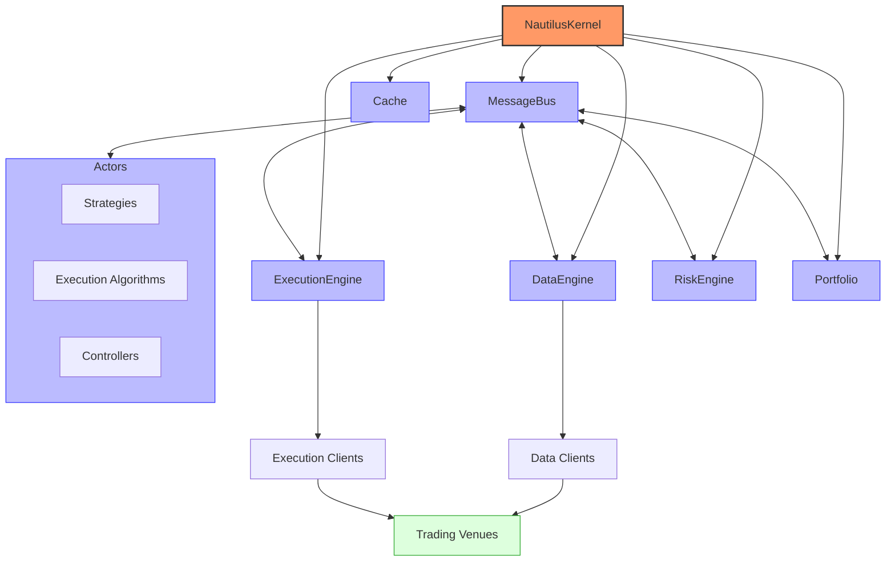

# NautilusTrader Trading System

## Overview

NautilusTrader is an open-source, high-performance, production-grade algorithmic trading platform. It provides quantitative traders with the ability to backtest portfolios of automated trading strategies on historical data with an event-driven engine, and also deploy those same strategies live, with no code changes.

The platform is *AI-first*, designed to develop and deploy algorithmic trading strategies within a highly performant and robust Python-native environment. This helps to address the parity challenge of keeping the Python research/backtest environment consistent with the production live trading environment.

NautilusTrader's design, architecture, and implementation philosophy prioritizes software correctness and safety at the highest level, with the aim of supporting Python-native, mission-critical, trading system backtesting and live deployment workloads.

The platform is also universal and asset-class-agnostic — with any REST API or WebSocket feed able to be integrated via modular adapters. It supports high-frequency trading across a wide range of asset classes and instrument types including FX, Equities, Futures, Options, Crypto and Betting, enabling seamless operations across multiple venues simultaneously.

## Architecture



NautilusTrader's architecture consists of several key components:

1. **System Kernel** - The core system that coordinates all components
2. **Data Engine** - Handles market data ingestion and processing
3. **Execution Engine** - Manages order execution and position tracking
4. **Risk Engine** - Enforces risk management rules
5. **Portfolio** - Tracks positions, balances, and performance
6. **Trader** - Coordinates trading activities and strategy execution
7. **Actors** - Pluggable components that implement trading logic

## Key Components and Relationships

### System Kernel

The `NautilusKernel` is the central component that initializes and coordinates all system components. It:
- Starts and stops the system
- Connects to data and execution venues
- Initializes the portfolio and cache
- Manages the message bus and actors
- Provides a common core between backtest, sandbox, and live trading environments

### Message Bus

The `MessageBus` is the core communication system that enables decoupled messaging patterns between components:
- Provides point-to-point, publish/subscribe, and request/response patterns
- Ensures efficient message routing with minimal overhead
- Maintains message ordering and delivery guarantees
- Supports both synchronous and asynchronous communication

### Cache

The `Cache` is a central in-memory data store for managing all trading-related data:
- Stores instruments, orders, positions, and account information
- Provides fast O(1) lookups for trading state
- Supports persistence to disk for recovery
- Maintains a consistent view of the trading system state

### Data Engine

The `DataEngine` is responsible for:
- Ingesting market data from various sources (exchanges, data providers)
- Processing and normalizing data across different formats
- Distributing data to interested components via the message bus
- Managing data caching and persistence
- Supporting different data types (ticks, quotes, bars, order books)

### Execution Engine

The `ExecutionEngine` handles:
- Order submission to execution venues
- Order tracking and management throughout the order lifecycle
- Position tracking and reconciliation
- Execution reporting and event generation
- Order emulation for advanced order types
- Support for different Order Management System (OMS) types

### Risk Engine

The `RiskEngine` enforces risk management rules:
- Pre-trade risk checks for all orders
- Position limits and exposure monitoring
- Order size and notional value limits
- Price and quantity precision validation
- Trading state management (active, halted, reducing)
- Custom risk rule implementation

### Portfolio

The `Portfolio` serves as the central hub for position management:
- Tracks positions across all instruments and strategies
- Manages account balances and margin requirements
- Calculates performance metrics (PnL, returns, drawdowns)
- Monitors risk exposures and correlations
- Provides portfolio-level analytics

### Actors

`Actors` are pluggable components that implement trading logic:
- **Strategies**: Core trading algorithms that generate signals and manage positions
- **Execution Algorithms**: Specialized components for optimal order execution (e.g., TWAP)
- **Controllers**: Components that can control and coordinate multiple strategies
- **Risk Models**: Custom risk management implementations

Actors can:
- Subscribe to market data
- Submit and manage orders
- Access the cache and portfolio
- Communicate with other components via the message bus

## Supported Markets and Instruments

NautilusTrader supports a wide range of markets and instruments through its adapter system:

| Name                  | ID                      | Type                    | Status     |
|-----------------------|-------------------------|-------------------------|------------|
| Betfair               | `BETFAIR`               | Sports Betting Exchange | Stable     |
| Binance               | `BINANCE`               | Crypto Exchange (CEX)   | Stable     |
| Binance US            | `BINANCE`               | Crypto Exchange (CEX)   | Stable     |
| Binance Futures       | `BINANCE`               | Crypto Exchange (CEX)   | Stable     |
| Bybit                 | `BYBIT`                 | Crypto Exchange (CEX)   | Stable     |
| Coinbase International| `COINBASE_INTX`         | Crypto Exchange (CEX)   | Stable     |
| Databento             | `DATABENTO`             | Data Provider           | Stable     |
| dYdX                  | `DYDX`                  | Crypto Exchange (DEX)   | Stable     |
| Interactive Brokers   | `INTERACTIVE_BROKERS`   | Brokerage (multi-venue) | Stable     |
| OKX                   | `OKX`                   | Crypto Exchange (CEX)   | Building   |
| Polymarket            | `POLYMARKET`            | Prediction Market (DEX) | Stable     |
| Tardis                | `TARDIS`                | Crypto Data Provider    | Stable     |

The platform provides built-in adapters for popular exchanges and brokers, with new integrations being added regularly through the extensible adapter framework.

## Performance Characteristics

- **Execution Speed**: Core components written in Rust with asynchronous networking using tokio
- **Reliability**: Rust-powered type- and thread-safety, with optional Redis-backed state persistence
- **Memory Efficiency**: Optimized memory usage with custom data structures and memory management
- **Type Safety**: Strong type checking at both compile-time and runtime for reliability
- **Concurrency**: Efficient asynchronous operations with tokio runtime
- **Scalability**: Modular design for scaling across multiple machines
- **Precision**: Supports both high-precision (128-bit, 16 decimals) and standard-precision (64-bit, 9 decimals) modes

## Precision Modes

NautilusTrader supports two precision modes for its core value types (`Price`, `Quantity`, `Money`):

- **High-precision**: 128-bit integers with up to 16 decimals of precision, and a larger value range
- **Standard-precision**: 64-bit integers with up to 9 decimals of precision, and a smaller value range

By default, the official Python wheels ship in high-precision (128-bit) mode on Linux and macOS. On Windows, only standard-precision (64-bit) is available due to the lack of native 128-bit integer support.

## Dependencies and Requirements

- Python 3.11-3.13
- Rust 1.87.0+ (for core performance-critical components)
- pandas for data analysis
- numpy for numerical operations
- redis for distributed deployment (optional)

NautilusTrader's Python bindings are implemented via Cython and PyO3—no Rust toolchain is required at install time for end users.

## Operational Modes

NautilusTrader operates in three distinct environment contexts:

### Backtesting

The backtesting environment allows you to test strategies on historical data with high fidelity:
- Supports both high-level and low-level APIs for different use cases
- Processes various data types (bars, ticks, quotes, order books) with appropriate simulation
- Provides realistic order matching and execution simulation
- Includes configurable fill models for simulating queue position and slippage
- Generates comprehensive performance analytics
- Fast enough to be used to train AI trading agents (RL/ES)

### Sandbox

The sandbox environment provides a real-time simulation with live market data:
- Uses real-time data feeds but simulated execution
- Allows testing of strategies in real market conditions without financial risk
- Maintains the same code path as live trading for accurate behavior

### Live Trading

The live trading environment connects to real exchanges and brokers:
- Supports both paper trading and real money trading
- Provides robust reconciliation mechanisms to ensure state consistency
- Includes configurable risk controls and circuit breakers

## Strategy Development

NautilusTrader provides a clean, intuitive API for strategy development. Strategies can be implemented in pure Python:

```python
class EMACross(Strategy):
    """
    A simple moving average cross example strategy.

    When the fast EMA crosses the slow EMA then enter a position at the market
    in that direction.
    """

    def __init__(self, config: EMACrossConfig) -> None:
        super().__init__(config)

        # Create the indicators for the strategy
        self.fast_ema = ExponentialMovingAverage(config.fast_ema_period)
        self.slow_ema = ExponentialMovingAverage(config.slow_ema_period)

    def on_start(self) -> None:
        """
        Actions to be performed on strategy start.
        """
        # Subscribe to live data
        self.subscribe_bars(self.config.bar_type)

    def on_bar(self, bar: Bar) -> None:
        """
        Actions to be performed when the strategy receives a bar.
        """
        # Check if indicators ready
        if not self.indicators_initialized():
            return  # Wait for indicators to warm up...

        # BUY LOGIC
        if self.fast_ema.value >= self.slow_ema.value:
            if self.portfolio.is_flat(self.config.instrument_id):
                self.buy()
            elif self.portfolio.is_net_short(self.config.instrument_id):
                self.close_all_positions(self.config.instrument_id)
                self.buy()
        # SELL LOGIC
        elif self.fast_ema.value < self.slow_ema.value:
            if self.portfolio.is_flat(self.config.instrument_id):
                self.sell()
            elif self.portfolio.is_net_long(self.config.instrument_id):
                self.close_all_positions(self.config.instrument_id)
                self.sell()
```

## AI Integration

NautilusTrader is designed from the ground up to be AI-first, making it ideal for developing and deploying AI-powered trading strategies:

- **Reinforcement Learning**: The backtest engine is fast enough to be used to train RL agents
- **Evolutionary Strategies**: Support for population-based optimization of strategies
- **Machine Learning Models**: Easy integration with scikit-learn, PyTorch, TensorFlow, and other ML frameworks
- **Feature Engineering**: Rich API for generating features from market data
- **Model Deployment**: Seamless transition from research to live deployment

## Conclusion

NautilusTrader represents a new generation of trading platforms that combines the flexibility of Python with the performance of Rust. Its event-driven architecture, comprehensive feature set, and robust implementation make it suitable for both research and production trading environments.

Key strengths include:
- High-performance execution with critical paths implemented in Rust
- Comprehensive market data support with nanosecond precision
- Advanced order types and execution algorithms
- AI-first design for modern quantitative trading approaches
- Strong type safety and correctness guarantees
- Cross-platform support (Linux, macOS, Windows)
- Open-source development with a growing community

For more information, visit the [official documentation](https://nautilustrader.io/docs/) or the [GitHub repository](https://github.com/nautechsystems/nautilus_trader).
